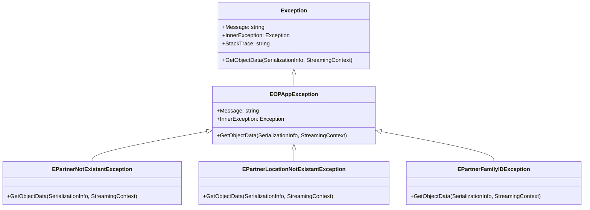
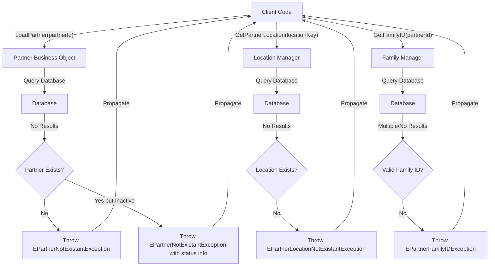
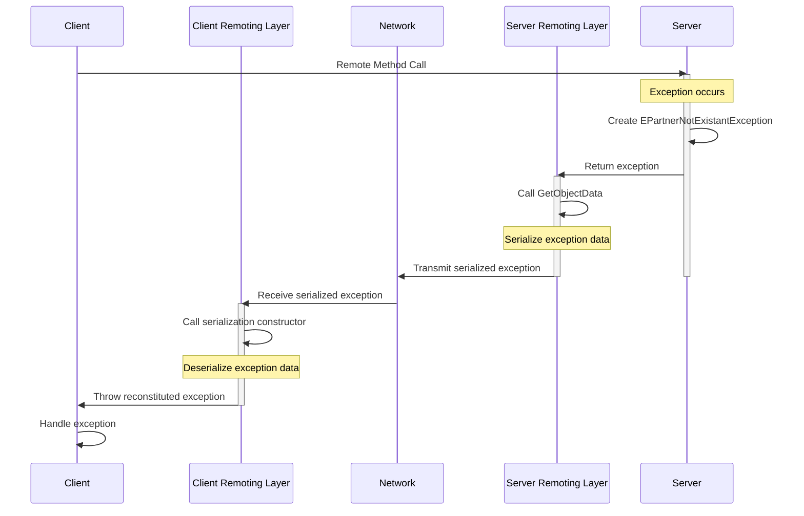

# OpenPetra Error Handling Architecture Analysis

## OpenPetra's Error Handling Architecture

OpenPetra implements a sophisticated hierarchical exception handling system that provides consistent error management throughout the application. At the core of this architecture is the `EOPAppException` base class, which serves as the foundation for all application-specific exceptions. This approach follows the best practice of creating a custom exception hierarchy that aligns with the application's domain model.

The exception architecture demonstrates careful consideration of cross-cutting concerns, particularly in how it handles error propagation across application boundaries. By inheriting from `EOPAppException`, all domain-specific exceptions gain consistent behavior for serialization, error message formatting, and integration with the broader error handling infrastructure. This design choice enables uniform error handling patterns throughout the codebase while still allowing for contextually rich error information specific to each domain area.

## Exception Class Hierarchy



The diagram illustrates OpenPetra's exception inheritance structure, showing how domain-specific exceptions inherit from the base `EOPAppException` class, which in turn inherits from the standard .NET `Exception` class. This hierarchical design allows for specialized error handling while maintaining compatibility with .NET's exception handling mechanisms.

The Partner module defines three specific exception types that represent distinct error conditions in the domain: non-existent partners, missing partner locations, and family ID issues. Each exception type maintains the serialization capabilities of the parent class while providing domain-specific context through its naming and documentation. This structure allows exception handlers to catch exceptions at different levels of specificity, from the most general (`Exception`) to the most specific (e.g., `EPartnerFamilyIDException`).

## Domain-Specific Exception Classes

OpenPetra's domain-specific exceptions demonstrate a thoughtful approach to error modeling. The Partner module implements three distinct exception types that directly map to specific business rule violations or error conditions:

1. `EPartnerNotExistantException`: Thrown when a business object attempts to load data for a partner that doesn't exist, is deleted, or is inactive. This exception clearly communicates that the requested partner entity cannot be found or used in the current operation.

2. `EPartnerLocationNotExistantException`: Signals that a partner location key doesn't exist in the database, providing precise context about the nature of the lookup failure.

3. `EPartnerFamilyIDException`: Indicates problems with finding a family ID, which is a specific domain concept in the partner management system.

These exceptions provide clear error context through their names and documentation, improving troubleshooting capabilities. By modeling exceptions after domain concepts rather than technical failures, OpenPetra creates a more maintainable and self-documenting codebase. This approach allows error handlers to make informed decisions based on the semantic meaning of the error rather than just its technical details.

## Constructor Patterns in Exception Classes

OpenPetra's exception classes implement a consistent pattern of multiple constructors to support various initialization scenarios and error reporting needs. Each exception class provides:

1. A parameterless constructor that creates a basic exception instance with default values.
2. A constructor accepting a message string, allowing for contextual error descriptions.
3. A constructor accepting both a message string and an inner exception, supporting exception chaining for preserving the original cause of errors.
4. A serialization constructor that takes `SerializationInfo` and `StreamingContext` parameters, enabling proper serialization/deserialization across remoting boundaries.

This comprehensive constructor pattern follows .NET best practices for exception design and ensures that exceptions can be created in any context where they might be needed. The message-based constructors are particularly valuable as they allow the throwing code to provide rich contextual information about the error condition, while the inner exception support enables preservation of the complete error chain.

The consistency of this pattern across all exception classes also makes the code more maintainable, as developers can rely on a standard set of initialization options for all exception types.

## Exception Flow in Partner Module



This flowchart illustrates how exceptions propagate through the Partner module when operations like loading non-existent partners or locations are attempted. The diagram shows three main error paths:

1. When a client attempts to load a partner that doesn't exist or is inactive, the Partner Business Object throws an `EPartnerNotExistantException` that propagates back to the client.
2. When a location lookup fails, an `EPartnerLocationNotExistantException` is thrown and propagated to the client.
3. When family ID resolution encounters problems, an `EPartnerFamilyIDException` is thrown.

Each exception path provides specific information about the nature of the failure, allowing the client code to handle different error conditions appropriately. The consistent exception hierarchy makes it possible to catch exceptions at different levels of specificity depending on the client's needs.

## .NET Remoting and Serialization Support

OpenPetra implements proper serialization support in its exception classes to ensure they work correctly across application boundaries and remoting contexts. This is critical for a distributed application architecture where exceptions may need to be transmitted between client and server components.

Each exception class implements the `ISerializable` interface implicitly by:
1. Including the `[Serializable]` attribute on the class definition
2. Providing a constructor that accepts `SerializationInfo` and `StreamingContext` parameters
3. Overriding the `GetObjectData` method to properly populate serialization information

The implementation of `GetObjectData` is particularly noteworthy for its careful handling of the serialization process. Each method first validates that the `SerializationInfo` parameter is not null, throwing an `ArgumentNullException` if validation fails. It then calls the base class implementation to ensure that all inherited state is properly serialized. This approach ensures that the complete exception state, including any custom properties defined in derived classes, is preserved during serialization.

This serialization support is essential for OpenPetra's distributed architecture, where exceptions may need to cross process or even machine boundaries while maintaining their full fidelity and error context.

## Null Checking and Defensive Programming

OpenPetra's exception handling code demonstrates strong defensive programming techniques, particularly in its handling of null references and boundary conditions. The `GetObjectData` method in each exception class includes an explicit null check for the `SerializationInfo` parameter:

```csharp
public override void GetObjectData(SerializationInfo AInfo, StreamingContext AContext)
{
    if (AInfo == null)
    {
        throw new ArgumentNullException("AInfo");
    }

    // We must call through to the base class to let it save its own state!
    base.GetObjectData(AInfo, AContext);
}
```

This pattern ensures that serialization operations fail fast and with clear error messages when invalid parameters are provided, rather than causing more obscure failures later in the execution path. The consistent application of this pattern across all exception classes demonstrates a systematic approach to defensive programming.

The code also shows defensive practices in its exception design by providing multiple constructors to handle different initialization scenarios and by carefully documenting the purpose and usage of each exception type. These practices contribute to a more robust and maintainable codebase by preventing common error conditions and making the code's intent clear.

## Exception Serialization Process



This sequence diagram illustrates the serialization and deserialization process for exceptions when they cross remoting boundaries in OpenPetra. When an exception occurs on the server during a remote method call, it follows these steps:

1. The server creates a domain-specific exception (e.g., `EPartnerNotExistantException`)
2. The server remoting layer calls `GetObjectData` to serialize the exception
3. The serialized exception data is transmitted across the network
4. The client remoting layer receives the serialized data
5. The client remoting layer uses the serialization constructor to recreate the exception
6. The reconstituted exception is thrown in the client's context

This process ensures that exceptions maintain their type information, message content, and other properties when crossing process boundaries. The careful implementation of serialization support in OpenPetra's exception classes makes this process reliable, preserving the rich error context that helps with troubleshooting and error handling.

## Error Message Standardization

OpenPetra standardizes error messages through its exception hierarchy to provide consistent user feedback and logging. By inheriting from `EOPAppException`, all domain-specific exceptions gain access to standardized error formatting and handling capabilities. This ensures that error messages follow a consistent structure and contain all necessary information for troubleshooting.

The exception classes in the Partner module demonstrate this standardization by accepting message parameters in their constructors and passing these to the base class. This approach allows for domain-specific error messages while maintaining a consistent format and structure across the application. The base `EOPAppException` class likely provides additional formatting or context enrichment to ensure that all exceptions present information in a standardized way.

This standardization is valuable for several reasons:
1. It creates a consistent user experience when errors occur
2. It simplifies log parsing and analysis by maintaining consistent message formats
3. It ensures that all error messages contain the necessary context for troubleshooting
4. It allows for centralized error message management and potential internationalization

By building this standardization into the exception hierarchy itself, OpenPetra ensures that all parts of the application benefit from consistent error reporting without requiring developers to implement custom formatting in each module.

## Exception Documentation Practices

OpenPetra demonstrates exemplary documentation practices for its exception classes. Each exception class includes comprehensive XML documentation comments that explain:

1. The purpose and meaning of the exception
2. When and why the exception might be thrown
3. The significance of each constructor parameter
4. The role of the exception in the broader error handling architecture

For example, the `EPartnerNotExistantException` is documented as being thrown "when a Business Object is asked to load data for a Partner that does either not exist or is deleted, not active, etc. whatever is applicable to the situation." This clear explanation helps developers understand when to throw or catch this exception.

The documentation also extends to the serialization-related members, explaining their purpose in the context of .NET remoting. Comments like "Only to be used by the .NET Serialization system (eg within .NET Remoting)" provide important usage guidance that helps prevent misuse of these specialized constructors and methods.

These thorough documentation practices enhance code maintainability by making the purpose and usage of each exception type clear to developers who may not be familiar with the specific domain area. They also serve as a form of self-documentation that helps maintain the consistency of error handling practices across the codebase.

## Integration with Broader Error Handling Infrastructure

OpenPetra's domain-specific exceptions integrate seamlessly with the application's broader error handling infrastructure for logging, reporting, and user feedback. By inheriting from `EOPAppException`, these exceptions participate in a centralized error handling strategy that likely includes:

1. Consistent logging of exceptions with appropriate severity levels
2. Translation of technical error messages into user-friendly notifications
3. Aggregation of error information for monitoring and analysis
4. Potential recovery mechanisms for certain types of errors

The Partner module's exceptions demonstrate this integration through their consistent implementation of serialization support and their adherence to the standard exception constructor patterns. This consistency ensures that these exceptions can be properly handled by any infrastructure components that work with the base `EOPAppException` class.

The hierarchical exception design also supports sophisticated error handling strategies, such as:
- Catching specific exception types for targeted recovery actions
- Catching the base `EOPAppException` for general application error handling
- Allowing unhandled exceptions to bubble up to global error handlers

This integration creates a cohesive error handling system that spans from low-level domain operations to high-level user interactions, ensuring that errors are consistently detected, reported, and potentially resolved throughout the application.

[Generated by the Sage AI expert workbench: 2025-03-30 02:22:57  https://sage-tech.ai/workbench]: #