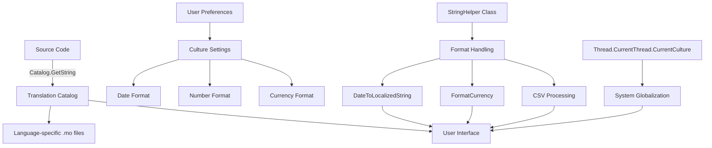
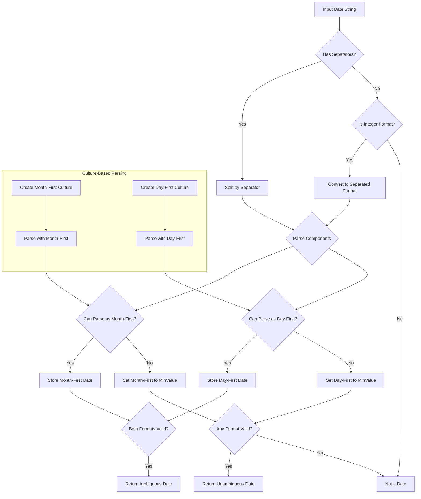
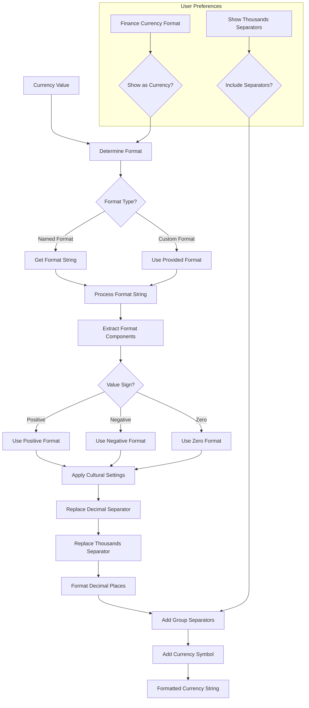
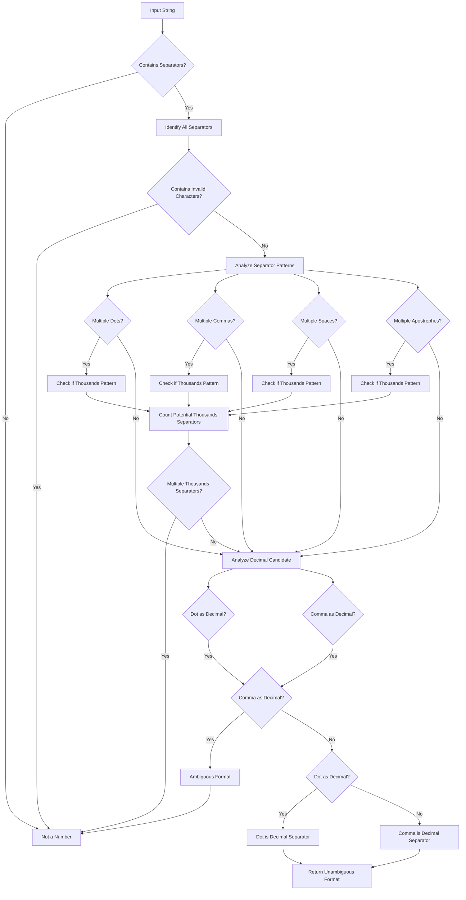

# Internationalization in OpenPetra

## Overview of Internationalization in OpenPetra

OpenPetra's internationalization architecture is designed to support the global nature of non-profit organizations that operate across multiple countries and languages. The system implements a comprehensive approach to internationalization that addresses several key aspects: string localization, date formatting, currency handling, and numeric format processing.

At its core, OpenPetra uses the GNU gettext model through the `Catalog.GetString` method for translatable text. This allows all user-facing strings to be extracted, translated, and displayed in the user's preferred language. The architecture also handles cultural differences in date formats (day-first vs. month-first), currency display (including decimal and thousands separators), and CSV data processing with awareness of different cultural conventions.

The internationalization components are integrated throughout the application, with particular emphasis in the `StringHelper` class which provides numerous utilities for handling culturally-sensitive data formatting. The system also respects user preferences, allowing individual users to configure their preferred formats for dates, currencies, and numbers.

## String Localization with Catalog.GetString

OpenPetra implements string localization using the `Catalog.GetString` method, which follows the GNU gettext approach to internationalization. This method is used throughout the codebase to mark strings that should be translated into different languages.

In the examined code, we can see this implementation in action:

```csharp
public static readonly string CSV_STRING_FORMAT_ERROR = Catalog.GetString(">>STRING FORMAT ERROR<<");
```

When this string is displayed to the user, the `Catalog.GetString` method looks up the appropriate translation based on the user's current locale settings. If a translation exists for the current language, the translated string is returned; otherwise, the original string is used as a fallback.

The system allows for context-sensitive translations where the same English text might be translated differently depending on where it appears in the application. This approach ensures that all user-facing text can be properly localized without requiring changes to the application code.

The localization system is designed to work seamlessly with the rest of the application, making it easy for developers to add new translatable strings and for translators to provide localized versions of those strings.

## Internationalization Architecture Components



The diagram illustrates OpenPetra's internationalization architecture. At the core is the translation catalog system, which connects source code strings to their translated equivalents. User preferences determine culture settings that affect date, number, and currency formats. The StringHelper class provides specialized formatting functions that respect these cultural preferences. The system leverages .NET's globalization capabilities through Thread.CurrentThread.CurrentCulture to ensure consistent formatting throughout the application.

This architecture ensures that all aspects of the user interface—from displayed text to date and currency formats—adapt to the user's language and cultural preferences. The centralized approach makes it easier to maintain consistency across the application while supporting a wide range of localization requirements.

## Culture-Aware Date Formatting

OpenPetra implements sophisticated culture-aware date formatting to handle the diverse date format preferences across different regions. The system recognizes that date formats vary significantly between cultures, with some using day-first (DD/MM/YYYY), others using month-first (MM/DD/YYYY), and others using year-first (YYYY/MM/DD) formats.

The `StringHelper` class provides several methods for date formatting, with `DateToLocalizedString` being the primary function. This method formats dates according to the user's cultural preferences:

```csharp
public static String DateToLocalizedString(DateTime ADateTime, Boolean AIncludeTime, Boolean ATimeWithSeconds)
{
    String ReturnValue = "";
    ReturnValue = ADateTime.ToString("dd-MMM-yyyy").ToUpper();
    
    // Culture-specific adjustments for month names
    if ((CultureInfo.CurrentCulture.TwoLetterISOLanguageName == "de") && (ADateTime.Month == 3))
    {
        ReturnValue = ReturnValue.Replace("MRZ", "MÄR");
    }
    
    // Time formatting based on parameters
    if (AIncludeTime)
    {
        if (ATimeWithSeconds)
        {
            ReturnValue = ReturnValue + ' ' + ADateTime.ToLongTimeString();
        }
        else
        {
            ReturnValue = ReturnValue + ' ' + ADateTime.ToShortTimeString();
        }
    }
    
    return ReturnValue;
}
```

The system also includes specialized handling for ambiguous date formats through the `LooksLikeAmbiguousShortDate` method, which attempts to determine whether a string represents a date and, if so, whether it should be interpreted as month-first or day-first:

```csharp
public static bool LooksLikeAmbiguousShortDate(string AString,
    bool ADateMayBeInteger,
    out DateTime AMonthFirstDate,
    out DateTime ADayFirstDate)
```

This method recognizes various date separators (/, -, ., space) and even handles compact numeric dates like "311216" (December 31, 2016). It returns both possible interpretations of ambiguous dates, allowing the application to make an informed decision based on context or user preferences.

The `GetCultureInfoForDateFormat` method creates appropriate `CultureInfo` objects for date parsing based on the format:

```csharp
public static CultureInfo GetCultureInfoForDateFormat(string ADateFormat)
{
    // Uses en-US for month-first formats and en-GB for day-first formats
    // This provides a solid foundation for date parsing
}
```

This comprehensive approach ensures that dates are consistently formatted and interpreted according to the user's cultural expectations throughout the application.

## Date Format Handling Flow



The diagram illustrates OpenPetra's process for handling date formats across different cultures. When a date string is received, the system first determines if it contains standard separators (/, -, ., space). If not, it checks if the string might be a compact numeric date (like 311216). The string is then parsed into components and attempts are made to interpret it using both month-first and day-first conventions by creating appropriate culture-specific parsers.

The system stores both interpretations if they're valid dates, allowing the application to handle ambiguous cases intelligently. This approach recognizes that "03/04/2022" could be either March 4 or April 3 depending on cultural convention. By maintaining both interpretations, OpenPetra can apply business rules or user preferences to resolve the ambiguity appropriately.

This sophisticated date handling ensures that users from different regions can work with dates in their familiar formats while maintaining data integrity across the application.

## Currency Formatting and Localization

OpenPetra implements a comprehensive approach to currency formatting that respects different cultural conventions. The system handles various aspects of currency display, including decimal separators, thousands separators, and currency symbols.

The primary method for currency formatting is `FormatCurrency`, which takes a value and a format string:

```csharp
public static String FormatCurrency(TVariant value, String format)
```

This method supports various format strings like "Currency", "CurrencyCSV", "CurrencyWithoutDecimals", and "CurrencyThousands". It also handles special formats for displaying credit/debit values.

The actual formatting is performed by `FormatCurrencyInternal`, which processes the format string and applies it to the value:

```csharp
public static String FormatCurrencyInternal(decimal d, String format)
{
    // Replace decimal and thousands separators with culture-specific ones
    DecimalSeparator = CultureInfo.CurrentCulture.NumberFormat.CurrencyDecimalSeparator;
    ThousandsSeparator = CultureInfo.CurrentCulture.NumberFormat.CurrencyGroupSeparator;
    format = format.Replace(".", "<TOBETHEDECIMALOPERATOR>");
    format = format.Replace(",", "<TOBETHEGROUPOPERATOR>");
    format = format.Replace("<TOBETHEDECIMALOPERATOR>", DecimalSeparator);
    format = format.Replace("<TOBETHEGROUPOPERATOR>", ThousandsSeparator);
    
    // Format the value according to the specified format
    // ...
}
```

The system also supports currency-specific formatting through the `FormatUsingCurrencyCode` method, which looks up the appropriate format for a given currency code:

```csharp
public String FormatUsingCurrencyCode(decimal AValue, String ACurrencyCode)
{
    String format = "->>>,>>>,>>>,>>9.99";
    
    if (CurrencyFormats != null)
    {
        CurrencyFormats.DefaultView.RowFilter = String.Format("a_currency_code_c='{0}'", ACurrencyCode);
        
        if (CurrencyFormats.DefaultView.Count > 0)
        {
            format = CurrencyFormats.DefaultView[0].Row["a_display_format_c"].ToString();
        }
    }
    
    return StringHelper.FormatCurrency(new TVariant(AValue), format);
}
```

This method allows different currencies to be displayed with their appropriate number of decimal places and formatting conventions.

The system also provides methods to determine the number of decimal places for a specific currency:

```csharp
public int DecimalPlacesForCurrency(String ACurrencyCode)
```

OpenPetra's currency formatting system is designed to be flexible and customizable, allowing organizations to display monetary values in a way that is familiar and appropriate for their users across different regions.

## Currency Format Processing



The diagram illustrates OpenPetra's process for formatting currency values according to different cultural conventions and user preferences. When a currency value needs to be displayed, the system first determines the appropriate format based on the context (whether it's a finance screen, partner screen, etc.) and user preferences.

The format string is processed to extract components for positive values, negative values, zero values, and null values. Based on the sign of the value, the appropriate format component is selected. The system then applies cultural settings by replacing generic decimal and thousands separators with the culture-specific ones.

The formatting process handles decimal places according to the currency requirements, adds thousands separators if specified by user preferences, and incorporates any currency symbols or additional formatting elements (like parentheses for negative values or CR/DR indicators).

This sophisticated approach ensures that currency values are displayed consistently and appropriately across different parts of the application while respecting both cultural conventions and user preferences.

## CSV Data Processing with Cultural Awareness

OpenPetra implements culturally-aware CSV data processing to handle the variations in separators and decimal formats across different regions. The system recognizes that CSV files may use different delimiters (commas, semicolons, tabs) and different conventions for representing decimal values.

The `StringHelper` class provides several methods for CSV processing, with `GetNextCSV` being the primary function for extracting values from a CSV string:

```csharp
public static string GetNextCSV(ref string list, string separator, Boolean ATryAllSeparators = false, Boolean ARemoveLeadingAndTrailingSpaces = false)
```

This method handles quoted text, escaped characters, and different separators. The `ATryAllSeparators` parameter allows the function to attempt different separators if the specified one doesn't work:

```csharp
if (ATryAllSeparators == true)
{
    // find which is the separator used in the file
    int commaPosition = list.IndexOf(separator);
    int alternativeSeparatorCounter = 0;
    
    while ((commaPosition == -1) && (alternativeSeparatorCounter < DefaultCSVSeparators.Length))
    {
        separator = DefaultCSVSeparators[alternativeSeparatorCounter];
        alternativeSeparatorCounter = alternativeSeparatorCounter + 1;
        commaPosition = list.IndexOf(separator);
    }
}
```

The system also includes a `GetCSVSeparator` method that intelligently determines the separator used in a CSV file:

```csharp
public static string GetCSVSeparator(string ACSVData)
```

This method examines the first valid line of CSV data and identifies the separator by analyzing the pattern of characters. It handles quoted text and considers various potential separators (tab, semicolon, comma, and others).

For adding values to a CSV string, the `AddCSV` method ensures proper escaping and quoting:

```csharp
public static string AddCSV(string line, string value, string separator = ",")
```

This method handles special cases like values containing the separator or double quotes, ensuring they're properly escaped.

The system's cultural awareness extends to handling numeric values in CSV data, recognizing that different cultures use different decimal separators (period vs. comma). This is particularly important when importing or exporting financial data, where misinterpreting decimal separators could lead to significant errors.

## Handling Ambiguous Numeric Formats

OpenPetra implements sophisticated strategies for detecting and resolving ambiguous numeric formats, particularly focusing on the challenges posed by different decimal and thousands separators across cultures.

The primary method for handling this is `LooksLikeFloat`, which evaluates whether a string appears to be a floating-point number and determines which character (dot or comma) is being used as the decimal separator:

```csharp
public static bool LooksLikeFloat(string AString, out bool? AIsDotDecimalSeparator)
```

This method performs a detailed analysis of the string, considering:

1. The positions of dots, commas, spaces, and apostrophes in the string
2. Whether these characters are likely being used as decimal separators or thousands separators
3. The patterns of digits between potential separators

The method returns true if it can unambiguously determine that the string represents a floating-point number, and sets `AIsDotDecimalSeparator` to indicate whether the decimal separator is a dot or a comma.

The analysis is quite sophisticated:

```csharp
// If there is more than one of each of these they could be thousands separators
bool thousandsCanBeDot = (firstDotPos != lastDotPos) && ((lastDotPos - firstDotPos) % 4 == 0);
bool thousandsCanBeComma = (firstCommaPos != lastCommaPos);
bool thousandsCanBeSpace = (firstSpacePos != lastSpacePos) && ((lastSpacePos - firstSpacePos) % 4 == 0);
bool thousandsCanBeApostrophe = (firstApostrophePos != lastApostrophePos) && ((lastApostrophePos - firstApostrophePos) % 4 == 0);

// A decimal separator is a dot if a single dot follows 0..n commas
//  OR there is no dot but the thousands separator is an unambiguous comma
bool decimalCanBeDot = (((lastDotPos >= 0) && (firstDotPos == lastDotPos) && (lastDotPos > lastCommaPos))
                        || ((lastDotPos == -1) && thousandsCanBeComma));

// A decimal separator is a comma if a single comma follows 0..n dots
//  OR there is a single comma following a space/apostrophe thousands separator
//  OR there is no comma but there is one of the other thousands separator
bool decimalCanBeComma = (((lastCommaPos >= 0) && (firstCommaPos == lastCommaPos) && (lastCommaPos > lastDotPos))
                          || ((lastCommaPos >= 0) && (firstCommaPos == lastCommaPos) && (thousandsCanBeSpace || thousandsCanBeApostrophe))
                          || ((lastCommaPos == -1) && (thousandsCanBeDot || thousandsCanBeSpace || thousandsCanBeApostrophe)));
```

This approach allows OpenPetra to intelligently parse numeric values from user input or imported data, even when the decimal and thousands separators might be ambiguous due to different cultural conventions.

## Ambiguous Format Resolution Process



The diagram illustrates OpenPetra's decision process for resolving ambiguous numeric formats. When analyzing a string that might represent a number, the system first identifies all potential separators (dots, commas, spaces, apostrophes) and checks for invalid characters. It then analyzes the pattern of separators to determine which might be thousands separators based on their positions and spacing.

The system counts potential thousands separators and rejects the string as a number if multiple types of thousands separators are detected (as this would be inconsistent). It then analyzes the remaining separator candidates to determine which might be the decimal separator.

If both dot and comma could be decimal separators based on the pattern analysis, the format is considered ambiguous and rejected. If only one candidate is identified as a potential decimal separator, the system returns the unambiguous interpretation of the format.

This sophisticated analysis allows OpenPetra to correctly interpret numeric values across different cultural formats, particularly important when processing financial data from various regions where decimal and thousands separators differ.

## User Preference Integration

OpenPetra integrates user preferences for date, currency, and number formats into its internationalization framework, allowing users to customize how these elements are displayed according to their individual needs and cultural expectations.

The `StringHelper` class defines several constants for user preferences related to formatting:

```csharp
/// <summary>Show money amounts in currency format on finance screens (default is true)</summary>
public const String FINANCE_CURRENCY_FORMAT_AS_CURRENCY = "FinanceShowCurrencyAsCurrency";

/// <summary>Show other decimal entities in currency format on finance screens (default is true)</summary>
public const String FINANCE_DECIMAL_FORMAT_AS_CURRENCY = "FinanceShowDecimalAsCurrency";

/// <summary>Show thousands separator for financial entities on finance screens (default is true)</summary>
public const String FINANCE_CURRENCY_SHOW_THOUSANDS = "FinanceCurrencyShowThousands";

/// <summary>Show money amounts in currency format on partner/conference/personnel screens (default is false)</summary>
public const String PARTNER_CURRENCY_FORMAT_AS_CURRENCY = "PartnerShowCurrencyAsCurrency";

/// <summary>Show other decimal entities in currency format on partner screens (default is false)</summary>
public const String PARTNER_DECIMAL_FORMAT_AS_CURRENCY = "PartnerShowDecimalAsCurrency";

/// <summary>Show thousands separator for financial entities on partner/conference/personnel screens (default is true)</summary>
public const String PARTNER_CURRENCY_SHOW_THOUSANDS = "PartnerCurrencyShowThousands";
```

These preferences allow users to control:
- Whether currency values are displayed in currency format (with symbols and specific formatting) or as plain numbers
- Whether decimal values that aren't currencies are displayed in currency format
- Whether thousands separators are shown in numeric values

The system differentiates between preferences for finance screens and partner/conference/personnel screens, recognizing that users might want different formatting in different contexts.

These preferences are integrated into the formatting methods like `FormatCurrency`, which check the user's preferences when determining how to display values.

The internationalization framework also respects the user's culture settings through the `Thread.CurrentThread.CurrentCulture` property, which affects date formats, number formats, and other culturally-sensitive elements throughout the application.

This integration of user preferences allows OpenPetra to provide a customized experience that meets the needs of users from different cultural backgrounds and with different formatting preferences.

## Future Internationalization Improvements

While OpenPetra already has a robust internationalization infrastructure, several potential enhancements could further improve its capabilities:

1. **Enhanced Right-to-Left (RTL) Language Support**: Improving support for languages like Arabic and Hebrew that are written from right to left, including proper text alignment, bidirectional text handling, and UI layout adjustments.

2. **Expanded Language Coverage**: Adding support for more languages, particularly those used in regions where non-profit organizations are increasingly active, such as East Asian languages (Chinese, Japanese, Korean) with their unique character sets and formatting requirements.

3. **Context-Aware Translation**: Implementing more sophisticated context awareness in the translation system to handle cases where the same English word might be translated differently depending on context.

4. **Locale-Specific Data Validation**: Enhancing data validation to be more aware of locale-specific formats and expectations, particularly for addresses, phone numbers, and postal codes.

5. **Improved Number Format Detection**: Building on the existing `LooksLikeFloat` method to handle even more ambiguous cases and support additional number formats used in specific regions.

6. **Customizable Date Format Preferences**: Allowing users to specify their preferred date format independently of their overall culture settings, recognizing that individuals might prefer different formats than their regional defaults.

7. **Enhanced Currency Handling**: Supporting more complex currency formatting requirements, including accounting formats, different negative value representations, and currency-specific rounding rules.

8. **Localized Reporting**: Improving the localization of reports and exports to ensure they respect the recipient's cultural expectations rather than just the user's settings.

9. **Internationalized Search**: Enhancing search capabilities to handle diacritics, case folding, and other language-specific search considerations appropriately.

10. **Performance Optimization**: Optimizing the internationalization components to reduce any performance overhead, particularly for operations that process large amounts of data with cultural formatting requirements.

These improvements would further strengthen OpenPetra's ability to serve as a truly global platform for non-profit organizations operating across diverse linguistic and cultural environments.

[Generated by the Sage AI expert workbench: 2025-03-30 02:22:57  https://sage-tech.ai/workbench]: #