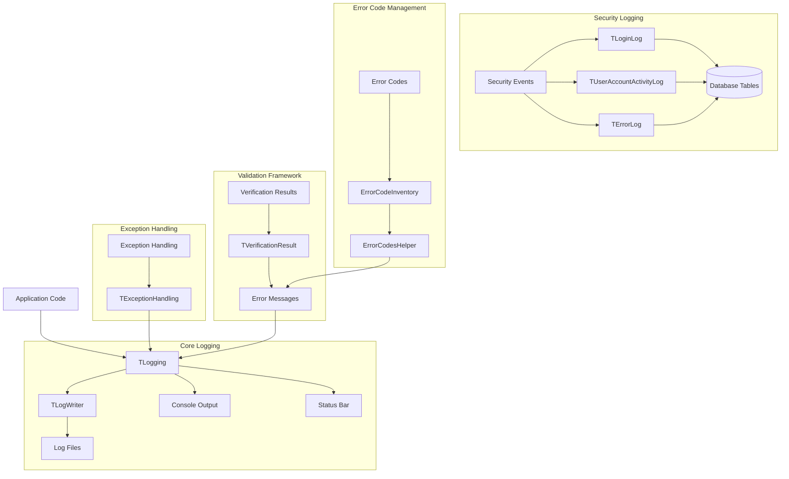
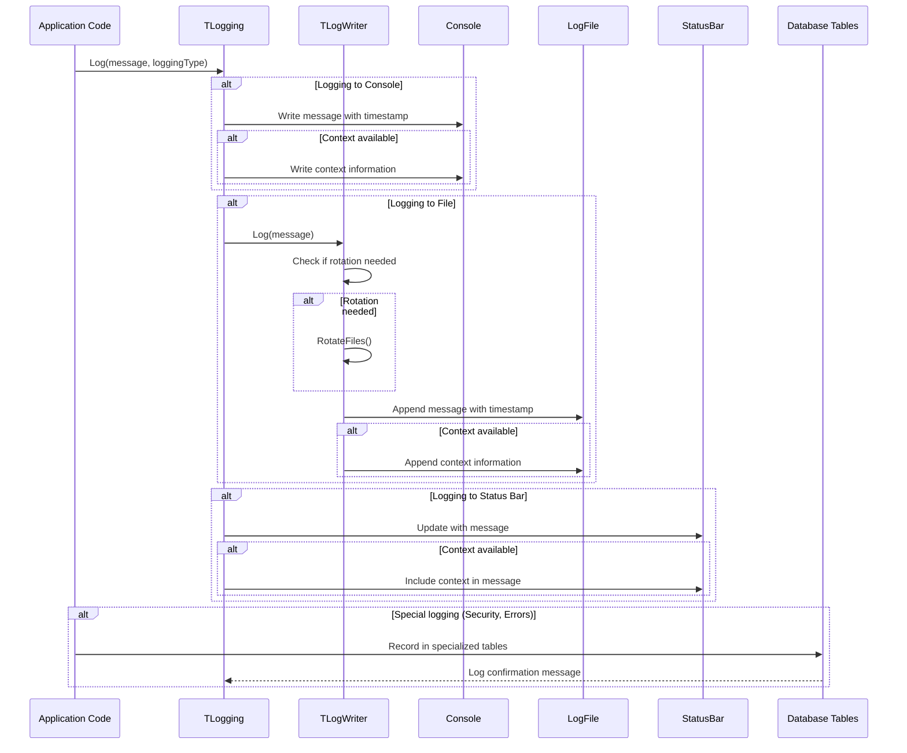
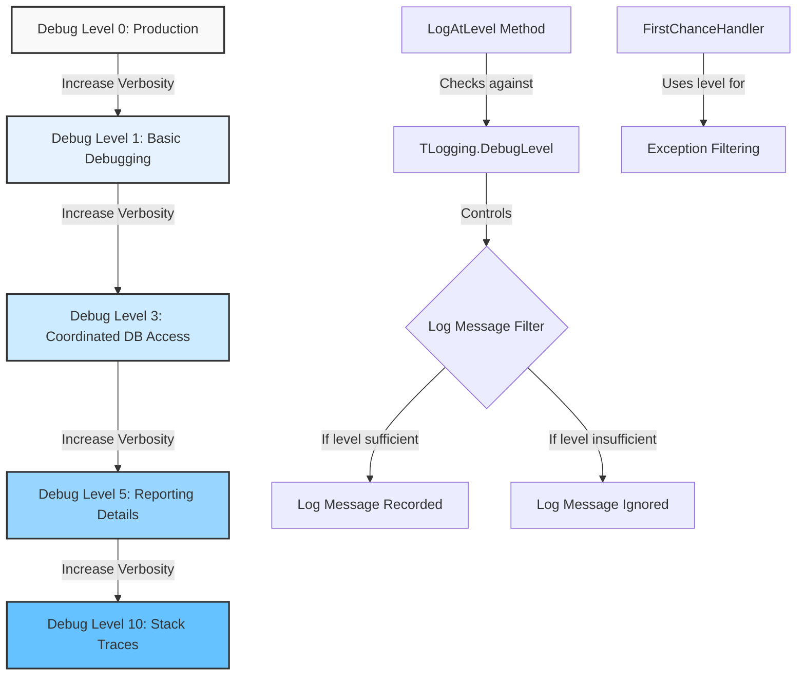
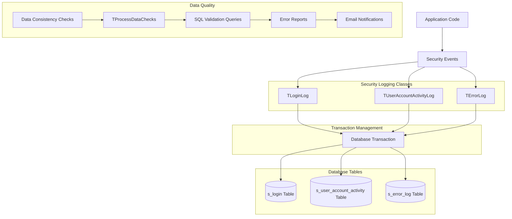

# OpenPetra's Logging Infrastructure

## Overview of OpenPetra's Logging Infrastructure

OpenPetra implements a comprehensive logging system that supports writing messages to multiple destinations including console, log files, and status bars with different debug levels and context tracking. The logging infrastructure is designed to be flexible, thread-safe, and configurable to meet the needs of both development and production environments. It provides mechanisms for recording application events, errors, user activities, and security-related information, enabling effective troubleshooting, auditing, and monitoring of the application's behavior.

The core logging functionality is implemented in the `Ict.Common` namespace, with specialized logging components for specific domains such as error logging, login tracking, and user account activity monitoring. The system supports different verbosity levels through debug level settings, context tracking for better error localization, and various output formats to accommodate different usage scenarios.

## OpenPetra Logging Architecture



The diagram illustrates the relationships between the core components of OpenPetra's logging architecture. The central `TLogging` class serves as the main entry point for logging messages, which can be directed to console output, log files (via `TLogWriter`), or status bars in the UI. Exception handling is integrated with the logging system through the `TExceptionHandling` class. Security-related events are logged through specialized classes like `TLoginLog`, `TUserAccountActivityLog`, and `TErrorLog`, which store information in database tables. The validation framework uses `TVerificationResult` objects to track and report validation errors, while the error code management system provides standardized error codes and messages.

## Core Logging Components

The foundation of OpenPetra's logging infrastructure consists of two primary classes: `TLogging` and `TLogWriter`. These classes work together to provide a flexible and extensible logging system that can be used throughout the application.

### TLogging

The `TLogging` class serves as the main entry point for logging messages in OpenPetra. It provides methods for logging messages with different debug levels, context information, and to different output destinations. Key features include:

- Support for multiple output destinations through the `TLoggingType` enum: console, log files, and status bars
- Debug level filtering to control the verbosity of log messages
- Context tracking to provide additional information about the source of log messages
- Thread-safe implementation using `ThreadStatic` attributes for variables
- Support for logging to string buffers for Windows Forms applications
- Methods for logging stack traces and exceptions

The class provides several overloaded `Log()` methods to accommodate different logging scenarios, as well as specialized methods like `LogAtLevel()` for conditional logging based on debug levels, `LogStackTrace()` for capturing call stacks, and `LogException()` for detailed exception logging.

### TLogWriter

The `TLogWriter` class handles the actual writing of log messages to files. It manages log file creation, rotation, and formatting of log entries. Key features include:

- Log file rotation based on dates to prevent excessive disk usage
- Configurable number of historical log files to retain
- Thread-safe logging operations using synchronization
- Support for custom prefixes in log messages
- Optional date/time suppression in log entries

The class uses a lock object to ensure thread-safe writing to log files and implements methods to check if log rotation is needed based on the current date.

Together, these core components provide a robust foundation for OpenPetra's logging system, enabling detailed tracking of application behavior and effective troubleshooting of issues.

## Log File Management

OpenPetra implements a sophisticated log file management system to prevent excessive disk usage while preserving historical information. This system is primarily handled by the `TLogWriter` class, which manages log file creation, rotation, and maintenance.

The log file management system includes the following key features:

1. **Log File Rotation**: The system automatically rotates log files based on dates. When a new day starts, the current log file is renamed with a numbered suffix (e.g., `-01.log`), and a new log file is created. This ensures that log files don't grow indefinitely and makes it easier to locate logs from specific dates.

2. **Configurable Retention**: The number of historical log files to retain is configurable through the `NumberOfLogFilesToKeep` setting in the application configuration. This allows administrators to balance disk space usage with the need to preserve historical logs.

3. **Rotation Logic**: The `NeedToRotateFiles()` method checks if log rotation is needed by comparing the last write time of the current log file with the current date. If the log file hasn't been written to today, rotation is triggered.

4. **Rotation Implementation**: The `RotateFiles()` method handles the actual rotation process. It renames existing log files by incrementing their numeric suffixes and removes the oldest log file if the maximum number of files to keep has been reached.

5. **Thread Safety**: All file operations are performed in a thread-safe manner using a lock object to prevent concurrent access issues.

6. **Error Handling**: The system includes robust error handling to deal with issues like file access problems, ensuring that logging failures don't crash the application.

This log file management approach ensures that OpenPetra can maintain detailed logs for troubleshooting and auditing purposes while keeping disk space usage under control and providing easy access to historical information when needed.

## Log Message Flow



The diagram illustrates how log messages flow through OpenPetra's logging system. When an application component needs to log a message, it calls the `TLogging.Log()` method with the message text and a logging type that specifies the destination(s). Depending on the logging type, the message may be sent to the console, a log file, a status bar, or a combination of these destinations.

For console logging, the message is formatted with a timestamp and written directly to the console. If context information is available, it's written as well. For file logging, the message is passed to the `TLogWriter` class, which checks if log rotation is needed, performs rotation if necessary, and then appends the formatted message to the log file. For status bar logging, the message is passed to a callback function that updates the status bar in the UI.

Special logging types, such as security events or errors, may also be recorded in specialized database tables through classes like `TLoginLog`, `TUserAccountActivityLog`, and `TErrorLog`. These database entries provide a persistent record of important events for auditing and troubleshooting purposes.

Throughout this flow, the logging system handles formatting, thread safety, error conditions, and other details to ensure reliable and consistent logging behavior across the application.

## Exception Handling and Logging

OpenPetra implements a robust exception handling and logging system through the `TExceptionHandling` class, which provides structured methods for capturing, logging, and managing exceptions throughout the application. This system ensures that exceptions are properly recorded and handled, even when they occur in unexpected places.

The `TExceptionHandling` class offers several key features:

1. **Structured Exception Logging**: The `LogException()` method logs exceptions with detailed information including the exception message, stack trace, and additional context information. This ensures that developers have comprehensive information for troubleshooting issues.

2. **Unhandled Exception Handler**: The `UnhandledExceptionHandler()` method serves as a last resort for catching exceptions that weren't handled elsewhere in the application. It logs the exception and initiates an orderly shutdown of the application to prevent data corruption.

3. **First Chance Exception Handling**: The `FirstChanceHandler()` method is hooked up to the .NET runtime's first-chance exception event, allowing the application to log exceptions before the CLR begins searching for event handlers. This provides visibility into all exceptions that occur, even those that are later caught and handled.

4. **Special Handling for Critical Exceptions**: The system includes special handling for critical exceptions like `OutOfMemoryException`, ensuring they're always logged regardless of the current debug level.

5. **Cooperative Async Shutdown**: To overcome limitations in the CLR's handling of unhandled exceptions (where finalizers aren't executed and threads are killed without cleanup), the system implements a "cooperative async shutdown" mechanism using a helper thread. This ensures that resources are properly released during application termination.

6. **Fallback Logging**: If an exception occurs before the logging system is fully initialized, the exception handler can create a fallback log file to ensure the exception details aren't lost.

This comprehensive approach to exception handling and logging ensures that OpenPetra can gracefully handle unexpected conditions, provide detailed information for troubleshooting, and maintain data integrity even when errors occur.

## Specialized Logging Mechanisms

OpenPetra implements several specialized logging mechanisms to address specific logging needs beyond general application logging. These specialized systems focus on security, auditing, and error tracking, providing detailed records of important events in the application.

### TErrorLog

The `TErrorLog` class records errors in the OpenPetra system database, providing a persistent record of application errors. It stores error codes, context information, message details, user IDs, and timestamps in the database, making it possible to track and analyze errors over time. This system is particularly useful for identifying recurring issues and understanding their impact on users.

### TLoginLog

The `TLoginLog` class records user authentication events in the system's `s_login` database table. It tracks successful logins, failed login attempts (with reasons like wrong passwords or locked accounts), and user logouts. This comprehensive audit trail of system access is essential for security monitoring and compliance purposes. The class defines constants for various login status types and provides methods to add login log entries and record user logouts.

### TUserAccountActivityLog

The `TUserAccountActivityLog` class records user account-related activities such as account creation, password changes, account locking/unlocking, and retirement status changes. This logging is critical for security auditing and tracking administrative actions on user accounts. The class writes records to both the `s_user_account_activity` database table and the server log, providing redundant storage of this important information.

### Data Consistency Checks

The `TProcessDataChecks` class implements a scheduled process that performs automated data consistency checks against the database. It executes SQL queries from predefined files to identify data inconsistencies, generates reports of errors, and sends email notifications to administrators and the users responsible for problematic records. This proactive approach to data quality helps maintain the integrity of the database by identifying and addressing issues before they cause significant problems.

These specialized logging mechanisms complement the core logging infrastructure, providing targeted solutions for specific logging requirements. Together, they create a comprehensive logging ecosystem that supports troubleshooting, security monitoring, auditing, and data quality management throughout the OpenPetra application.

## Debug Level Hierarchy



OpenPetra's logging system implements a hierarchical debug level structure that controls the verbosity of logging throughout the application. The debug level is set through the `TLogging.DebugLevel` property, which is a thread-static variable to ensure thread safety in multi-threaded environments.

The debug level hierarchy includes several predefined levels with specific purposes:

1. **Debug Level 0 (Production)**: The default level for production environments. Only critical errors and important information messages are logged.

2. **Debug Level 1 (Basic Debugging)**: Enables basic debugging information, providing more context about application operations without overwhelming detail.

3. **Debug Level 3 (Coordinated DB Access)**: Enables detailed logging for database access operations, particularly useful for troubleshooting data access issues.

4. **Debug Level 5 (Reporting Details)**: Enables detailed logging for the reporting subsystem, including information about report generation and processing.

5. **Debug Level 10 (Stack Traces)**: The highest verbosity level, which includes stack traces and very detailed diagnostic information. This level is typically used only for intensive debugging sessions.

The `LogAtLevel()` method in the `TLogging` class uses this hierarchy to conditionally log messages based on the current debug level. Messages are only logged if the current debug level is equal to or higher than the level specified for the message. This allows developers to include detailed diagnostic logging in the code without affecting performance in production environments where lower debug levels are used.

The debug level also affects other aspects of logging behavior, such as the formatting of log messages and the handling of first-chance exceptions. For example, at debug level 5 or higher, first-chance exceptions are logged with stack traces, providing detailed information for debugging.

This hierarchical approach to debug levels gives administrators and developers fine-grained control over logging verbosity, allowing them to balance the need for diagnostic information with performance considerations.

## Error Codes and Verification Results

OpenPetra implements a sophisticated system for error handling and validation using standardized error codes and verification results. This approach ensures consistent error reporting across the application and provides support for internationalization of error messages.

### Error Codes

The error code system is implemented through several key classes:

1. **CommonErrorCodes and PetraErrorCodes**: These classes define string constants for error codes following a structured format. Each error code consists of a prefix (e.g., "GENC" for general codes or a module abbreviation like "FIN" for Finance), a period, a five-digit number, and a suffix indicating the error type (V for validation, N for non-critical, E for error).

2. **ErrCodeAttribute**: This attribute decorates error code constants with metadata including short descriptions, full descriptions, error message text, and titles. This metadata supports the generation of user-friendly error messages.

3. **ErrorCodeInventory**: This class maintains a catalog of error codes from registered types, providing functionality to build an inventory of error codes and retrieve error code information.

4. **ErrorCodesHelper**: This class provides helper methods for working with error codes, including retrieving error information, messages, descriptions, and categories.

### Verification Results

The verification system uses several classes to track and manage validation results:

1. **TVerificationResult**: This class stores basic validation information including context, text, severity, and error codes. It serves as the foundation for tracking validation outcomes.

2. **TScreenVerificationResult**: This class extends TVerificationResult for UI-specific validations with DataColumn references, providing additional context for validation errors in user interfaces.

3. **TVerificationResultCollection**: This class manages collections of validation results, supporting operations like finding, adding, and removing validation results.

4. **TVerificationHelper**: This class provides helper methods for comparing and formatting validation results, making them more user-friendly.

### Integration

These systems work together to provide a comprehensive approach to error handling and validation:

1. Error codes are defined in the CommonErrorCodes and PetraErrorCodes classes.
2. When validation is performed, TVerificationResult objects are created with appropriate error codes.
3. These verification results are collected in TVerificationResultCollection objects.
4. When errors need to be displayed to users, the Messages class formats the verification results into user-friendly messages using the metadata from the error code system.

This integrated approach ensures that errors are consistently reported, properly localized, and easily identifiable by support staff regardless of the user interface language. It also provides rich context information to help users understand and address validation issues.

## Thread Safety in Logging

OpenPetra's logging infrastructure is designed to be thread-safe, ensuring reliable operation in multi-threaded server environments. This is particularly important for a system like OpenPetra that may handle multiple concurrent user sessions and background processes.

The thread safety in the logging system is implemented through several key mechanisms:

1. **ThreadStatic Attributes**: Many of the key variables in the logging classes are decorated with the `[ThreadStatic]` attribute, which ensures that each thread has its own independent copy of these variables. This includes variables like `TLogging.DebugLevel`, `TLogging.Context`, `TLogWriter.ULogFileName`, and others. This approach prevents threads from interfering with each other's logging state.

   ```csharp
   [ThreadStatic]
   public static int DebugLevel = 0;
   
   [ThreadStatic]
   private static String Context;
   ```

2. **Synchronization for Shared Resources**: When multiple threads need to access shared resources like log files, synchronization mechanisms are used to prevent concurrent access issues. The `TLogWriter` class uses a lock object to ensure that only one thread can write to a log file at a time:

   ```csharp
   private static readonly object _locker = new object();
   
   private static void Log(string strFile, string strMessage)
   {
       lock (_locker)
       {
           // Log file writing code...
       }
   }
   ```

3. **Reset Methods for Web Environments**: The logging classes include `ResetStaticVariables()` methods that can be called at the beginning of each web request to ensure a clean state. This prevents state leakage between requests in web environments:

   ```csharp
   public static void ResetStaticVariables()
   {
       DebugLevel = 0;
       FNoLoggingToConsoleError = false;
       ULogWriter = null;
       // Reset other static variables...
   }
   ```

4. **Error Handling**: The logging system includes robust error handling to deal with exceptions that might occur during logging operations. This ensures that logging failures don't cascade into application failures.

5. **Independent Log Writers**: Each thread can have its own log writer instance, allowing for thread-specific logging configurations.

These thread safety mechanisms ensure that OpenPetra's logging system can reliably handle concurrent logging from multiple threads without data corruption, race conditions, or other concurrency issues. This is essential for maintaining the integrity of log files and ensuring that all important events are properly recorded, even in high-concurrency scenarios.

## Database Logging Integration



OpenPetra integrates its logging system with database tables to provide persistent storage of critical events and user activities. This integration is primarily implemented through specialized logging classes that write to specific database tables.

### Key Database Logging Components

1. **TErrorLog**: Records application errors in the `s_error_log` database table. Each error entry includes:
   - Error code
   - Context information
   - Up to three message lines
   - User ID
   - Process ID
   - Timestamp
   - Application version

2. **TLoginLog**: Records user authentication events in the `s_login` database table. Entries include:
   - User ID
   - Login type (successful login, failed attempt, logout, etc.)
   - Login details
   - Date and time
   - Process ID

3. **TUserAccountActivityLog**: Records user account activities in the `s_user_account_activity` table. Activities include:
   - Account creation
   - Password changes
   - Account locking/unlocking
   - Retirement status changes
   - User ID
   - Activity type
   - Activity details
   - Date and time

### Database Transaction Handling

All database logging operations use proper transaction management to ensure data integrity:

1. Each logging operation is wrapped in a database transaction.
2. Transactions use appropriate isolation levels (typically Serializable or RepeatableRead).
3. Error handling includes transaction rollback in case of failures.
4. Some methods support both internal transaction management and externally provided transactions.

### Data Consistency Checks

The `TProcessDataChecks` class implements scheduled data consistency checks that:
1. Execute SQL validation queries from predefined files
2. Identify data inconsistencies in the database
3. Generate reports of errors
4. Send email notifications to administrators and responsible users

This proactive approach helps maintain data quality by identifying issues before they cause significant problems.

### Integration with Core Logging

Database logging operations are typically also logged to the standard log files through the core logging system. This dual logging approach ensures that important events are recorded in both the transient log files and the persistent database tables, providing redundancy and supporting different use cases:

- Log files are useful for real-time monitoring and troubleshooting
- Database tables support long-term auditing, reporting, and analysis

This comprehensive integration of logging with database tables ensures that OpenPetra maintains detailed records of critical events and user activities, supporting security monitoring, auditing, and troubleshooting needs.

## Configuration and Customization

OpenPetra's logging infrastructure offers extensive configuration and customization options to adapt to different deployment scenarios. These options are primarily controlled through XML configuration files and application settings, allowing administrators to tailor the logging behavior without modifying the application code.

### XML Configuration

The logging system can be configured using XML configuration files, particularly for the log4net integration used in testing. Key configuration elements include:

1. **Appenders**: Define where log messages are sent, such as console, file, or filtered outputs.
   ```xml
   <appender name="ConsoleAppender" type="log4net.Appender.ConsoleAppender">
       <layout type="log4net.Layout.PatternLayout">
           <conversionPattern value="%date [%thread] %-5level %logger [%ndc] - %message%newline" />
       </layout>
   </appender>
   ```

2. **Filters**: Control which messages are processed by specific appenders.
   ```xml
   <filter type="log4net.Filter.StringMatchFilter">
       <param name="StringToMatch" value="Entry" />
       <param name="AcceptOnMatch" value="false" />
   </filter>
   ```

3. **Log Levels**: Set the minimum severity level for messages to be logged.
   ```xml
   <root>
       <level value="DEBUG" />
       <appender-ref ref="ConsoleAppender" />
   </root>
   ```

### Application Settings

Several aspects of the logging behavior can be configured through application settings:

1. **Debug Level**: Controls the verbosity of logging.
   ```
   TLogging.DebugLevel = 3;  // Set programmatically
   ```

2. **Log File Rotation**: Configure how many historical log files to keep.
   ```
   NumberOfLogFilesToKeep = 7  // Keep a week's worth of logs
   ```

3. **Data Checks**: Configure scheduled data consistency checks.
   ```
   DataChecks.RunEveryXDays = 1  // Run daily
   DataChecks.Email.Recipient = admin@example.com
   ```

4. **Log File Path**: Specify where log files should be stored.

### Programmatic Customization

The logging system also supports programmatic customization:

1. **Custom Status Bar Callbacks**: Applications can register custom callbacks for status bar updates.
   ```csharp
   TLogging.SetStatusBarProcedure(UpdateStatusBar);
   ```

2. **Context Information**: Set context information to provide additional details in log messages.
   ```csharp
   TLogging.SetContext("Processing order #12345");
   ```

3. **Custom Log Writers**: Create custom log writers for specialized logging needs.

4. **String Buffer Logging**: Redirect console output to a string buffer for Windows Forms applications.
   ```csharp
   TLogging.SendConsoleOutputToString(HandleNewLogMessage);
   ```

### Thread-Specific Configuration

Because many logging variables use the `[ThreadStatic]` attribute, different threads can have different logging configurations. This allows for thread-specific debug levels, contexts, and other settings.

These configuration and customization options provide the flexibility needed to adapt OpenPetra's logging behavior to different environments, from development and testing to production deployments with varying requirements for log detail and storage.

[Generated by the Sage AI expert workbench: 2025-03-30 02:22:57  https://sage-tech.ai/workbench]: #