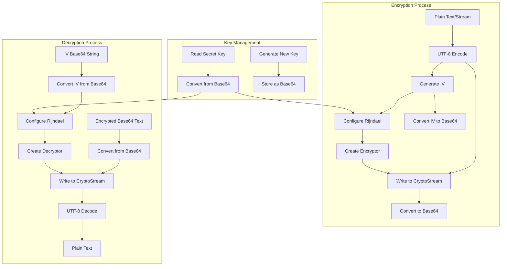
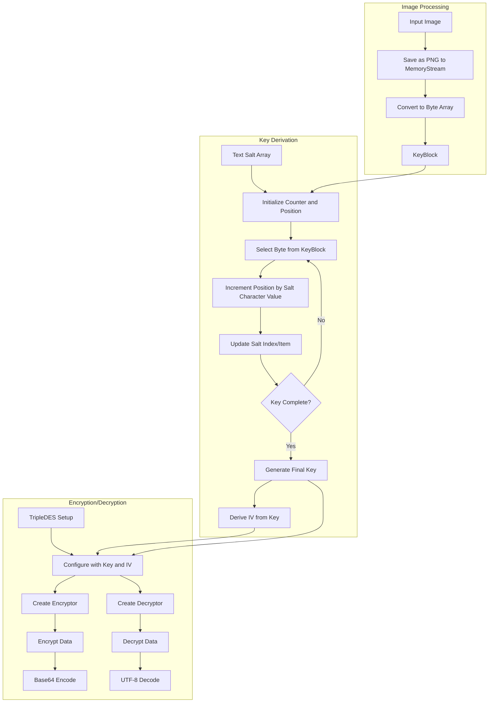
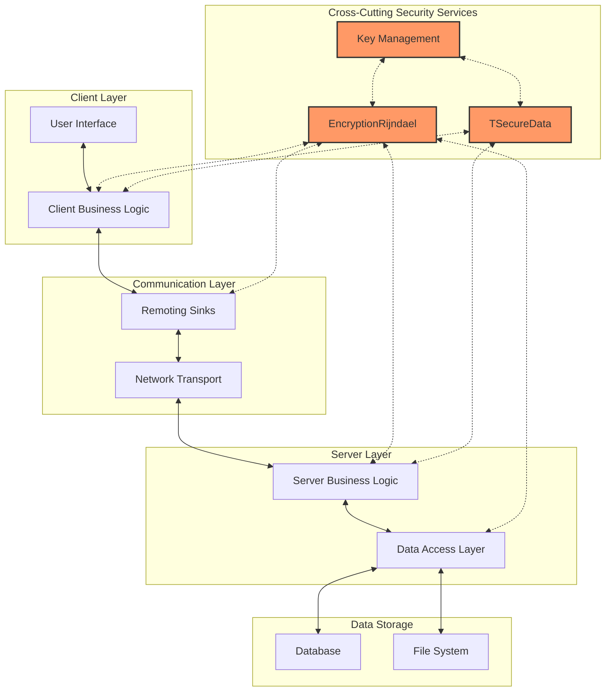
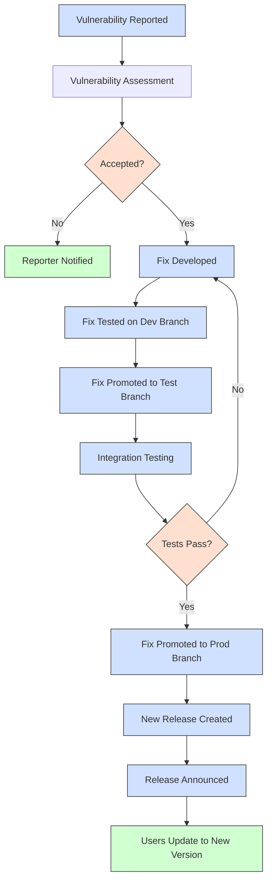

# OpenPetra Security Infrastructure Analysis

## Overview of OpenPetra Security Infrastructure

OpenPetra, as a free open-source system designed for non-profit organizations, implements a robust security infrastructure to protect sensitive organizational data. The system employs multiple encryption strategies, including both Rijndael (AES) and TripleDES implementations, to ensure data confidentiality and integrity. The security architecture is designed as a cross-cutting concern, making encryption services available throughout the application without tightly coupling security implementations to specific business logic. OpenPetra's approach to security balances the need for strong cryptographic protection with the practical requirements of an open-source application used by organizations that may have limited technical resources. The system implements key management, secure data transmission, and both string-based and stream-based encryption to accommodate various data volumes and performance requirements. This layered approach to security helps ensure that sensitive data remains protected both at rest and in transit between system components.

## Rijndael Encryption Implementation

OpenPetra implements the Rijndael algorithm (also known as AES - Advanced Encryption Standard) through the `EncryptionRijndael` class in the `Ict.Common.IO` namespace. This implementation leverages the .NET Framework's `System.Security.Cryptography` namespace, specifically using the `RijndaelManaged` class to provide cryptographic operations. The implementation includes several key features:

1. **Key Management**: The class provides methods for both reading existing secret keys from files (`ReadSecretKey`) and generating new keys (`CreateSecretKey`). Keys are stored as Base64-encoded strings for easier handling and transmission.

2. **Initialization Vector Handling**: For each encryption operation, a unique initialization vector (IV) is generated, which must be transmitted alongside the encrypted data to enable decryption. This approach enhances security by ensuring that identical plaintext messages produce different ciphertext outputs.

3. **String and Stream Encryption**: The implementation supports both string-based encryption for smaller data items and stream-based encryption for handling larger data volumes efficiently. This dual approach allows the system to optimize performance based on data size.

4. **Cryptographic Modes**: The implementation uses the default CBC (Cipher Block Chaining) mode of the `RijndaelManaged` class, with zero padding for block alignment.

5. **UTF-8 Encoding**: String data is consistently encoded using UTF-8 before encryption and after decryption, ensuring proper handling of international character sets.

The implementation follows cryptographic best practices by generating unique IVs for each encryption operation and properly managing the cryptographic streams to ensure complete processing of data, including flushing final blocks to handle padding correctly.

## Rijndael Encryption/Decryption Flow

The diagram illustrates the complete flow of OpenPetra's Rijndael encryption and decryption processes. The implementation follows a standard cryptographic pattern where encryption keys are either read from storage or newly generated, then used to configure the Rijndael algorithm. During encryption, a new initialization vector is generated for each operation, ensuring that identical plaintext produces different ciphertext. Both the encrypted data and the IV are Base64-encoded for storage or transmission.

For decryption, the process is reversed: the encrypted data and IV are decoded from Base64, the Rijndael algorithm is configured with the same key and IV, and the decryption operation produces the original plaintext. The stream-based variants follow a similar pattern but are optimized for handling larger data volumes by processing the data in chunks rather than loading it entirely into memory.

## TripleDES Security Implementation

OpenPetra implements an alternative encryption approach through the `TSecureData` class in the `Ict.Petra.Shared.Security` namespace. This class employs the Triple DES (Data Encryption Standard) algorithm with a unique key derivation mechanism that combines both textual and image-based inputs. Unlike the more straightforward Rijndael implementation, this approach adds complexity through:

1. **Dual-Source Key Derivation**: The class derives encryption keys using both text strings (stored in the `FText` array) and image data (stored in `FItem`). This approach increases entropy and makes key reconstruction more difficult without access to both sources.

2. **Image-to-Key Conversion**: The private `I2KB()` method converts an image to a byte array by saving it as a PNG to a memory stream. This byte array serves as a base for key derivation.

3. **Custom Key Derivation Algorithm**: The `GetKey()` method implements a custom algorithm that uses the text strings as "salt" values to select bytes from the image data for inclusion in the final key and initialization vector. The algorithm walks through the image data using character values from the salt strings to determine step sizes.

4. **Base64 Encoding**: Like the Rijndael implementation, the TripleDES implementation encodes encrypted data as Base64 strings for storage and transmission.

5. **UTF-8 Character Handling**: The implementation uses UTF-8 encoding for text processing, ensuring proper handling of international character sets.

This implementation represents a more specialized approach to encryption, potentially offering additional security through obscurity by using non-standard key derivation. However, it also introduces dependencies on image data and custom algorithms that may complicate key management and recovery processes.

## Image-Based Key Derivation Process

The diagram illustrates OpenPetra's unique approach to key derivation using both image data and text strings. This process begins with converting an input image to a byte array by saving it as a PNG to a memory stream. The resulting byte array serves as a large pool of potential key material.

The key derivation algorithm then uses text salt values to select specific bytes from this pool. Starting at a fixed position (37), the algorithm selects bytes and advances through the image data using character values from the salt strings to determine step sizes. This creates a pseudo-random walk through the image data, with the path determined by the salt values.

Once the key is derived, the first portion of it is used to create the initialization vector. The key and IV are then used to configure the TripleDES algorithm for either encryption or decryption operations. This approach creates a complex relationship between the image, the salt strings, and the resulting cryptographic key, making it difficult to reconstruct the key without access to both source elements.

The security of this approach relies on the unpredictability of the image data and the complexity of the key derivation algorithm, rather than solely on the strength of the underlying TripleDES algorithm.

## Stream-Based Encryption for Large Data Sets

OpenPetra implements stream-based encryption capabilities to efficiently handle large data volumes without excessive memory consumption. This approach is particularly important for a system designed to manage substantial organizational datasets. The stream-based encryption implementation in the `EncryptionRijndael` class processes data in manageable chunks rather than loading entire datasets into memory.

The implementation uses the .NET `CryptoStream` class to create a processing pipeline that encrypts or decrypts data as it flows through the stream. This approach offers several advantages:

1. **Memory Efficiency**: By processing data in 1000-byte chunks, the system can handle files of arbitrary size without requiring memory proportional to the file size.

2. **Performance Optimization**: Stream-based processing allows for parallel operations where data can be read, processed, and written in a continuous flow rather than as discrete operations.

3. **Integration with .NET Stream Architecture**: The implementation returns standard .NET Stream objects, allowing seamless integration with other stream-based operations in the system.

4. **Proper Cryptographic Handling**: The implementation ensures proper handling of cryptographic operations, including initialization vector management and final block processing.

The stream-based encryption methods follow the same security principles as their string-based counterparts, including unique initialization vector generation and proper key management. However, they're structured to operate on streams rather than in-memory strings, making them suitable for file encryption, database blob encryption, or network transmission of large datasets.

This capability is crucial for OpenPetra's role as an enterprise management system where reports, backups, or bulk data transfers may involve substantial volumes of sensitive information that must be protected while minimizing resource consumption.

## Security Key Management

OpenPetra implements a pragmatic approach to encryption key management that balances security requirements with the practical needs of an open-source application. The system provides mechanisms for both key generation and storage, with several notable characteristics:

1. **Base64 Key Representation**: Encryption keys are stored as Base64-encoded strings, making them easier to handle in text-based configurations and transmissions while maintaining their cryptographic properties.

2. **File-Based Storage**: The `ReadSecretKey` and `CreateSecretKey` methods in the `EncryptionRijndael` class support reading and writing keys to files, allowing for persistent key storage outside the application.

3. **Dual-Source Keys**: The `TSecureData` class implements a more complex key derivation approach that requires both image data and text strings, effectively splitting the key material across two different formats.

4. **Runtime Key Generation**: The system supports generating new keys at runtime using the cryptographically secure random number generator built into the .NET cryptography libraries.

5. **Initialization Vector Management**: For each encryption operation, a unique initialization vector is generated and must be stored alongside the encrypted data. This approach enhances security but requires careful management of these additional cryptographic parameters.

The system does not implement advanced key management features such as key rotation, key escrow, or hardware security module integration, which would typically be found in enterprise security systems. Instead, it focuses on providing fundamental key management capabilities that are appropriate for the target deployment scenarios of OpenPetra.

This approach reflects a design decision to make security accessible to organizations that may not have dedicated security infrastructure or expertise, while still providing meaningful protection for sensitive data.

## Security Architecture Overview

The diagram illustrates how encryption components integrate with other parts of the OpenPetra system. Security services are implemented as cross-cutting concerns that can be accessed from multiple layers of the application architecture. The `EncryptionRijndael` and `TSecureData` classes provide encryption services that can be utilized by both client and server components, as well as during data transmission and storage.

Key management services support both encryption implementations, handling the creation, storage, and retrieval of cryptographic keys. The security architecture allows for encryption to be applied at multiple points in the data flow:

1. **Client-Side Encryption**: Sensitive data can be encrypted before being sent to the server
2. **Transport Encryption**: Data can be encrypted during transmission between client and server
3. **Server-Side Encryption**: Data can be encrypted before being stored in the database or file system
4. **Storage Encryption**: Data can remain encrypted while at rest in persistent storage

This layered approach to security allows for defense in depth, where multiple security controls protect the same data. The architecture also supports the principle of least privilege, where encryption can be used to limit access to sensitive data even within the application itself.

The security services are designed to be modular and reusable, allowing them to be incorporated into different parts of the application without creating tight coupling between security implementations and business logic.

## Vulnerability Management Process

OpenPetra maintains a straightforward vulnerability management process as outlined in its SECURITY.md document. The project follows a streamlined approach to version support and security updates, focusing resources on maintaining the security of the current release rather than supporting multiple branches. Key aspects of the vulnerability management process include:

1. **Version Support Policy**: Only the latest release, maintained on the "prod" branch, is officially supported for security updates. This approach ensures that security resources are concentrated on the most current codebase.

2. **Release Strategy**: When security vulnerabilities are identified and fixed, a new release is created rather than patching older versions. This encourages users to stay current with the latest release.

3. **Development Workflow**: Development occurs on the "test" and "dev" branches, with security fixes being integrated into these branches before being promoted to the production branch for release.

4. **Reporting Mechanism**: Vulnerabilities should be reported directly to info@openpetra.org, providing a clear channel for security researchers and users to communicate potential issues.

5. **Recognition Policy**: The project acknowledges the importance of community contributions to security by expressing gratitude to those who report vulnerabilities, though it does not appear to offer formal bug bounties or other material incentives.

This approach reflects the project's nature as an open-source system with limited resources for maintaining multiple parallel versions. By focusing on the current release, the project can ensure that security fixes are promptly integrated and made available to all users through regular release cycles.

The vulnerability management process emphasizes the importance of staying current with the latest release to benefit from security improvements, which is a common approach in open-source projects where backward compatibility must be balanced against resource constraints.

## Cross-Cutting Security Concerns

Security in OpenPetra is implemented as a cross-cutting concern, providing encryption services that span multiple layers of the application architecture. This approach allows security functionality to be applied consistently throughout the system without duplicating code or creating tight coupling between security implementations and business logic. Several key aspects of this cross-cutting implementation include:

1. **Namespace Organization**: Security classes are organized in namespaces that reflect their cross-cutting nature, such as `Ict.Common.IO` for the `EncryptionRijndael` class and `Ict.Petra.Shared.Security` for the `TSecureData` class.

2. **Service Availability**: Encryption services are available to multiple system components, including client-side logic, server-side processing, data access layers, and communication components.

3. **Consistent Interfaces**: The encryption classes provide consistent interfaces for operations like encryption and decryption, allowing them to be used interchangeably in different contexts.

4. **Separation of Concerns**: The security implementations focus solely on cryptographic operations, maintaining a clear separation from business logic and data processing concerns.

5. **Pluggable Implementation**: The system supports multiple encryption approaches (Rijndael and TripleDES) that can be selected based on specific security requirements or compatibility needs.

This cross-cutting approach to security ensures that encryption capabilities are available throughout the application without creating dependencies that would complicate maintenance or evolution of the system. It also allows for security enhancements to be implemented in a centralized manner, with changes to the security classes automatically benefiting all components that use them.

The design reflects a recognition that security is not a feature that can be isolated to a single layer or component, but rather a fundamental aspect of the system that must be integrated at multiple levels to provide comprehensive protection.

## Security Update Release Process

The diagram illustrates OpenPetra's workflow for addressing security vulnerabilities from discovery through release. The process begins when a vulnerability is reported to the project via email (info@openpetra.org). The reported issue undergoes assessment to determine its validity, impact, and priority.

If the vulnerability is accepted as valid, the development team creates a fix, which is first implemented and tested on the development branch. This allows for initial verification of the fix without affecting the stability of production code. Once the fix passes initial testing, it is promoted to the test branch for more comprehensive integration testing.

The integration testing phase ensures that the security fix doesn't introduce regressions or conflicts with other system components. If issues are discovered during testing, the fix is revised and the testing cycle repeats. When the fix successfully passes all tests, it is promoted to the production branch.

At this point, a new release of OpenPetra is created that includes the security fix along with any other changes that have accumulated since the previous release. The new release is announced to users, who are encouraged to update to the latest version to receive the security enhancement.

This streamlined process focuses on maintaining the security of the current release rather than backporting fixes to older versions. By creating a new release for each security update, OpenPetra ensures that all users have access to the latest security improvements while simplifying the maintenance burden on the development team.

[Generated by the Sage AI expert workbench: 2025-03-30 02:22:57  https://sage-tech.ai/workbench]: #