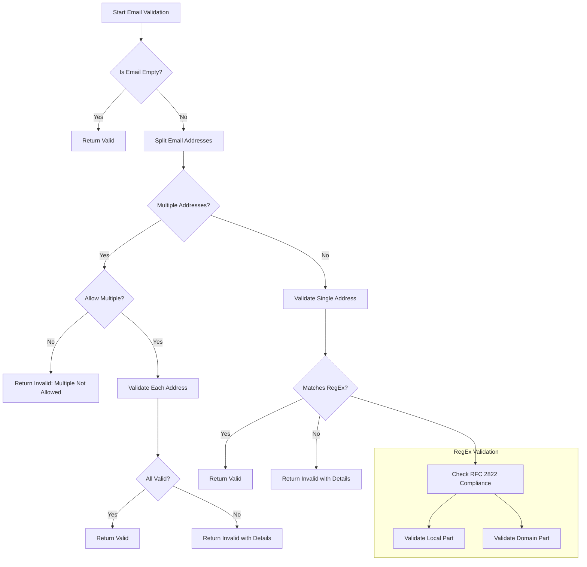
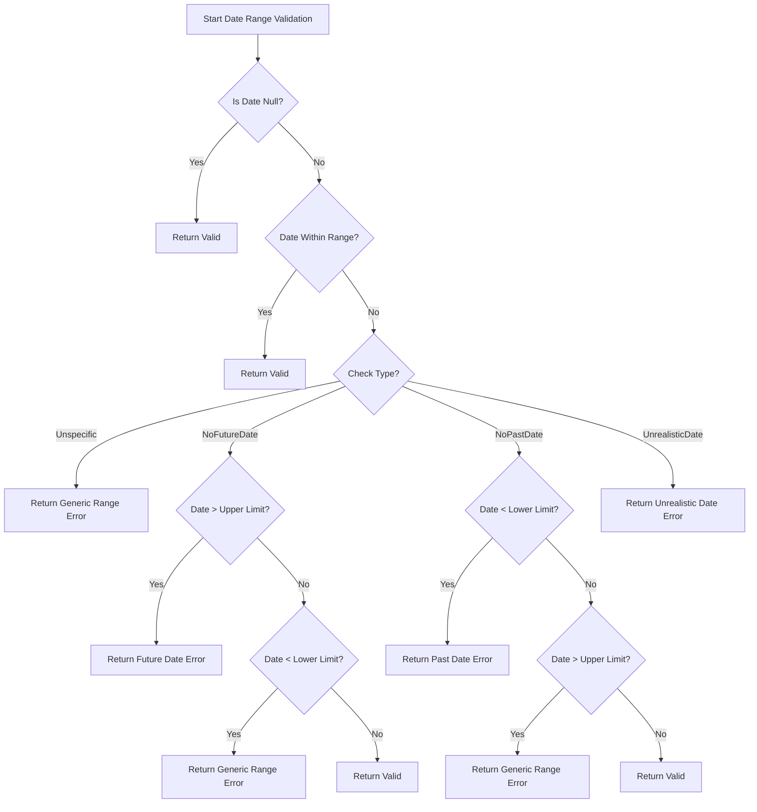
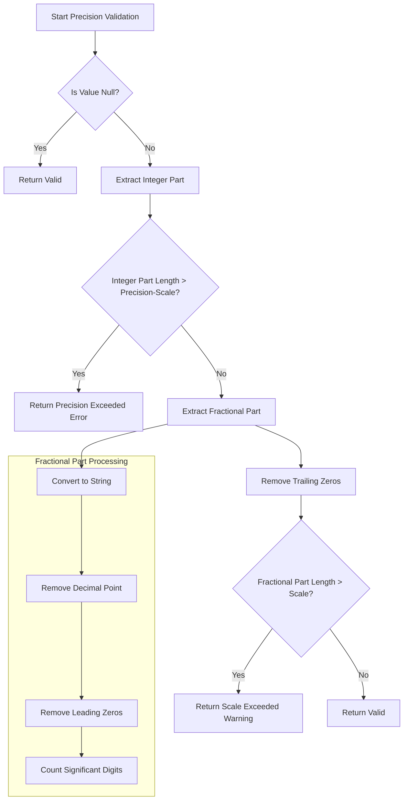
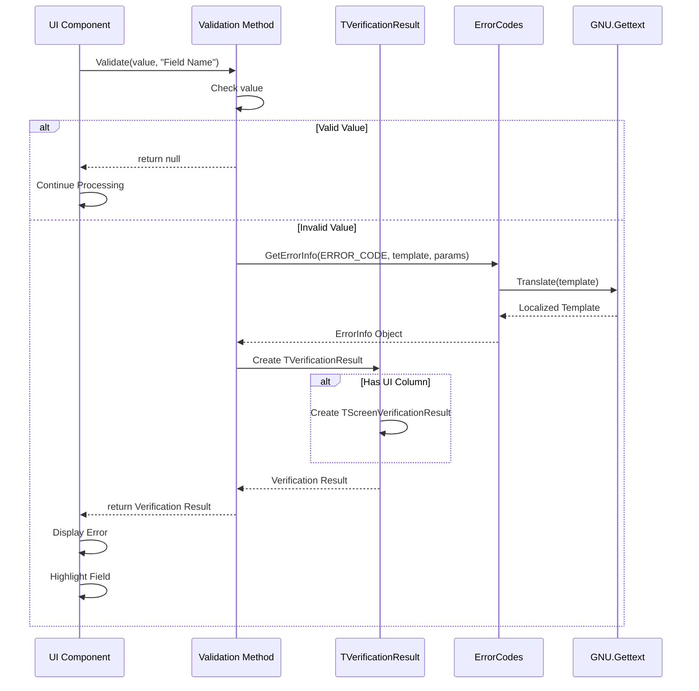

# OpenPetra's Validation Framework

## Introduction to OpenPetra's Validation Framework

OpenPetra's validation infrastructure provides a comprehensive system for ensuring data integrity across both client and server components without requiring database access. This is a critical architectural decision that enables consistent validation logic to be applied regardless of where the validation occurs in the application stack. The framework is designed to validate various data types including strings, dates, and numerical values, providing immediate feedback to users before data is committed to the database. By implementing validation logic that works independently of database access, OpenPetra ensures that client-side components can perform robust validation without requiring network round-trips, improving application responsiveness and user experience while maintaining data integrity.

## Architecture of the Validation System

The validation system is organized into a hierarchy of specialized classes, each focusing on different data types and validation scenarios. This structure is part of the Cross-Cutting Concerns layer, specifically within the Utilities.Validation namespace. The system follows a consistent pattern where validation methods accept the value to validate, descriptive information for error messages, and optional context parameters.

The framework is built around four primary classes:

1. **TGeneralChecks**: Provides fundamental validation methods applicable to any object type
2. **TStringChecks**: Specializes in string validation including email, length, and comparison checks
3. **TDateChecks**: Handles date and time validation with range checking and comparison operations
4. **TNumericalChecks**: Focuses on validating integers, decimals, and floating-point values

Each validation method returns either null (indicating successful validation) or a `TVerificationResult` object containing detailed error information. This consistent return pattern simplifies error handling throughout the application. The framework also supports internationalization through GNU.Gettext, ensuring that error messages can be presented in the user's preferred language.

## Validation Framework Class Structure

```mermaid
classDiagram
    class TVerificationResult {
        +object ResultContext
        +ErrorInfo ErrorInfo
        +TVerificationResult(object context, ErrorInfo errorInfo)
        +ToString() string
    }
    
    class TScreenVerificationResult {
        +System.Data.DataColumn Column
        +TScreenVerificationResult(TVerificationResult result, DataColumn column)
    }
    
    class TGeneralChecks {
        +ValueMustNotBeNull(object, string, object, DataColumn) TVerificationResult
        +ValueMustNotBeNullOrEmptyString(object, string, object, DataColumn) TVerificationResult
    }
    
    class TStringChecks {
        +StringMustNotBeEmpty(string, string, object, DataColumn) TVerificationResult
        +StringLengthLesserOrEqual(string, int, string, object, DataColumn) TVerificationResult
        +FirstLesserOrEqualThanSecondString(string, string, string, string, object, DataColumn) TVerificationResult
        +ValidateValueIsActive(int, DataTable, string, string, object, DataColumn) TVerificationResult
        +ValidateEmail(string, bool, object, DataColumn) TVerificationResult
    }
    
    class TDateChecks {
        +IsNotUndefinedDateTime(DateTime?, string, bool, object, DataColumn) TVerificationResult
        +IsCurrentOrFutureDate(DateTime?, string, object, DataColumn) TVerificationResult
        +IsCurrentOrPastDate(DateTime?, string, object, DataColumn) TVerificationResult
        +IsDateBetweenDates(DateTime?, DateTime?, DateTime?, string, TDateBetweenDatesCheckType, TDateBetweenDatesCheckType, object, DataColumn) TVerificationResult
        +FirstLesserThanSecondDate(DateTime?, DateTime?, string, string, object, DataColumn) TVerificationResult
    }
    
    class TNumericalChecks {
        +IsValidInteger(string, string, object, DataColumn) TVerificationResult
        +IsPositiveDecimal(decimal?, string, object, DataColumn) TVerificationResult
        +IsNegativeOrZeroInteger(Int64?, string, object, DataColumn) TVerificationResult
        +IsNonZeroDecimal(decimal?, string, object, DataColumn) TVerificationResult
        +FirstLesserThanSecondDecimal(decimal?, decimal?, string, string, object, DataColumn) TVerificationResult
        +IsNumberPrecisionNotExceeded(decimal?, int, int, string, object, DataColumn) TVerificationResult
    }
    
    TVerificationResult <|-- TScreenVerificationResult
    TGeneralChecks ..> TVerificationResult : returns
    TStringChecks ..> TVerificationResult : returns
    TDateChecks ..> TVerificationResult : returns
    TNumericalChecks ..> TVerificationResult : returns
```



The diagram illustrates the core validation classes and their relationships. The `TVerificationResult` class serves as the foundation for communicating validation errors, with `TScreenVerificationResult` extending it to provide UI-specific context. Each specialized validation class contains methods that return these result objects when validation fails, creating a consistent error handling pattern throughout the application.

## String Validation Capabilities

OpenPetra's string validation capabilities are implemented in the `TStringChecks` class, providing a comprehensive set of validation methods for string data. These methods work without database access, making them suitable for both client and server-side validation.

Key string validation features include:

1. **Empty String Validation**: The `StringMustNotBeEmpty` method ensures that strings are not null or empty, with customizable error messages that include the field description.

2. **String Length Validation**: `StringLengthLesserOrEqual` verifies that strings don't exceed a specified maximum length, which is crucial for database field constraints.

3. **String Comparison**: `FirstLesserOrEqualThanSecondString` performs lexical comparison between two strings, ensuring proper ordering for fields like date ranges represented as strings.

4. **Lookup Value Validation**: `ValidateValueIsActive` checks if a lookup value corresponds to an active record, preventing the selection of inactive or deprecated values.

5. **Email Validation**: Multiple overloads of `ValidateEmail` provide sophisticated email address validation, including support for validating multiple email addresses in a single string.

The string validation methods follow a consistent pattern, accepting the value to validate, descriptive information for error messages, and optional context parameters. This consistency makes the validation framework easy to use throughout the application.

## Email Validation Process



OpenPetra implements a sophisticated email validation process using regular expressions that comply with RFC 2822 standards. The flowchart illustrates how the validation handles both single and multiple email addresses.

The email validation process begins by checking if the input is empty. If not, it determines whether multiple email addresses are present (separated by commas or semicolons). If multiple addresses are found but not allowed in the context, validation fails immediately. Otherwise, each address is validated individually using a comprehensive regular expression.

The regular expression validation is particularly sophisticated, checking:
- The local part (before @) for valid characters and formats
- The domain part for proper structure, including TLD validation
- Support for quoted strings and special characters as permitted by RFC 2822
- Proper formatting of display names (e.g., "John Doe <john@example.com>")

When validation fails, the system provides detailed error messages indicating whether the entire email is invalid or if specific parts failed validation. For multiple email addresses, the system identifies which specific address caused the validation to fail.

## Date and Time Validation

OpenPetra's date validation capabilities, implemented in the `TDateChecks` class, provide comprehensive validation for date and time values. These validations ensure that dates are within acceptable ranges, properly formatted, and logically consistent when compared to other dates.

Key date validation features include:

1. **Undefined Date Validation**: `IsNotUndefinedDateTime` checks if a date is defined (not DateTime.MinValue), with options to treat null values as valid or invalid based on context.

2. **Corporate Date Validation**: `IsNotCorporateDateTime` validates dates against corporate period requirements, ensuring they align with accounting periods.

3. **Date Range Validation**: `IsCurrentOrFutureDate` and `IsCurrentOrPastDate` verify that dates are either in the future or past relative to the current date.

4. **Date Comparison**: Methods like `FirstLesserThanSecondDate` and `FirstGreaterThanSecondDate` ensure logical relationships between date pairs.

5. **Comprehensive Date Range Checking**: `IsDateBetweenDates` validates that a date falls within a specified range, with specialized handling for different types of range violations.

The framework also includes `TTimeChecks` for validating time values stored as integers (0-86399 seconds), ensuring time entries are valid within a 24-hour period.

Date validation methods handle null values gracefully, typically treating them as valid unless explicitly configured otherwise. This approach allows for optional date fields while still enforcing validation rules when values are provided.

## Date Range Validation Logic



The diagram illustrates the decision tree for date range validation in OpenPetra. The `IsDateBetweenDates` method implements sophisticated logic that varies based on the type of check being performed.

The validation begins by checking if the date is null (which is considered valid) or if it falls within the specified range. If the date is outside the range, the system determines the appropriate error message based on the check type:

1. **Unspecific Check**: Returns a generic error indicating the date must be between the specified bounds
2. **NoFutureDate Check**: Returns a specialized error when the date is in the future when it shouldn't be
3. **NoPastDate Check**: Returns a specialized error when the date is in the past when it shouldn't be
4. **UnrealisticDate Check**: Returns an error indicating the date is not sensible in the given context (e.g., birth dates before 1850)

This contextual validation approach allows the system to provide more meaningful error messages to users, helping them understand exactly why their input was rejected and how to correct it.

## Numerical Validation Capabilities

OpenPetra's numerical validation capabilities are implemented in the `TNumericalChecks` class, providing a comprehensive set of validation methods for integer, decimal, and floating-point values. These validations ensure that numerical data meets business requirements and database constraints.

Key numerical validation features include:

1. **Type Validation**: Methods like `IsValidInteger`, `IsValidDouble`, and `IsValidDecimal` verify that string inputs can be parsed to the appropriate numerical type.

2. **Sign Validation**: A family of methods including `IsPositiveInteger`, `IsNegativeDecimal`, and `IsNonZeroDouble` validate that numbers have the appropriate sign for their business context.

3. **Range Validation**: `IsInRange` checks that a number falls within specified minimum and maximum values.

4. **Comparison Validation**: Methods like `FirstLesserThanSecondInteger` and `FirstGreaterOrEqualThanSecondDecimal` ensure logical relationships between number pairs.

5. **Precision and Scale Validation**: `IsNumberPrecisionNotExceeded` performs sophisticated validation of decimal values, ensuring they don't exceed the specified precision (total digits) and scale (decimal places).

The numerical validation methods are particularly important for financial calculations, where precision and scale are critical. The framework carefully handles edge cases like trailing zeros in decimal values and provides detailed error messages that explain exactly how the validation failed.

## Number Precision Validation Algorithm



The flowchart illustrates the algorithm used by OpenPetra to validate decimal precision and scale. This is particularly important for financial data where database constraints often limit the total number of digits and decimal places.

The validation process begins by checking if the value is null (which is considered valid). If not, it extracts the integer part of the number and verifies that its length doesn't exceed the allowed precision minus the scale. This ensures that the number will fit in the database field.

Next, the algorithm extracts the fractional part and performs a sophisticated analysis:
1. It converts the fractional part to a string representation
2. Removes any trailing zeros as they don't affect the significant digits
3. Counts the remaining significant digits
4. Compares this count to the allowed scale

If the fractional part has more significant digits than the allowed scale, the system returns a warning rather than an error. This is because the value can still be stored, but will be rounded, potentially causing a loss of precision. This approach gives users important feedback about potential data loss while still allowing the operation to proceed.

## Verification Results and Error Handling

OpenPetra's validation framework uses the `TVerificationResult` pattern to provide consistent error reporting across the application. This pattern encapsulates all the information needed to understand and handle validation failures.

The `TVerificationResult` class contains:

1. **ResultContext**: An optional object that provides context about where the validation occurred
2. **ErrorInfo**: Detailed information about the error, including:
   - Error code: A unique identifier for the type of error
   - Error message: A human-readable description of the problem
   - Message parameters: Values that are inserted into the message template

For UI validation, the framework extends this with `TScreenVerificationResult`, which adds:
- **Column**: A reference to the specific `DataColumn` that failed validation

This structured approach to error reporting offers several advantages:
- Consistent error handling throughout the application
- Support for internationalized error messages
- Clear separation between error detection and error presentation
- Ability to associate errors with specific UI elements

When a validation method detects an issue, it constructs a `TVerificationResult` with appropriate error information. The calling code can then check if the result is null (indicating success) or handle the error appropriately. For UI validation, the `TScreenVerificationResult` allows the application to highlight the specific field that failed validation.

## Verification Result Flow



The sequence diagram illustrates how validation errors propagate from validation methods to UI components. When a UI component needs to validate data, it calls the appropriate validation method with the value to validate and contextual information.

If the validation succeeds, the method returns null and processing continues normally. If validation fails, a complex process begins:

1. The validation method requests error information from the `ErrorCodes` class
2. `ErrorCodes` uses GNU.Gettext to translate the error message template into the user's language
3. A `TVerificationResult` is created with the error information
4. If UI column information was provided, a `TScreenVerificationResult` is created
5. The result is returned to the UI component
6. The UI component displays the error message and highlights the problematic field

This flow ensures that validation errors are handled consistently throughout the application and presented to users in their preferred language with clear indications of which fields need correction.

## Internationalization of Validation Messages

OpenPetra's validation framework incorporates internationalization through GNU.Gettext, ensuring that error messages can be presented in the user's preferred language. This approach separates the validation logic from the presentation of error messages, making it easier to support multiple languages.

The internationalization process works as follows:

1. **Message Definition**: Error message templates are defined as static readonly strings using `Catalog.GetString()`, which marks them for translation.

```csharp
private static readonly string StrEmailAddNotValid = Catalog.GetString(
    "The e-mail address '{0}' is not valid.");
```

2. **Message Parameters**: Templates include placeholders (`{0}`, `{1}`, etc.) that are filled with dynamic content at runtime.

3. **Error Code Association**: Each error message is associated with a unique error code through the `ErrorCodes.GetErrorInfo()` method.

```csharp
ReturnValue = new TVerificationResult(AResultContext,
    ErrorCodes.GetErrorInfo(ERR_EMAILADDRESSINVALID, StrEmailAddNotValid, 
    new string[] { AEmailAddress }));
```

4. **Translation Lookup**: At runtime, GNU.Gettext looks up the appropriate translation based on the user's locale settings.

5. **Parameter Substitution**: The translated template has its placeholders replaced with the actual values.

This approach offers several advantages:
- Validation logic remains independent of language concerns
- New languages can be added without changing code
- Translators can work with message templates directly
- Error messages maintain consistent formatting across languages

The validation framework's error messages cover a wide range of scenarios with clear, user-friendly explanations that help users understand exactly what went wrong and how to fix it. By using internationalized messages, OpenPetra ensures that users receive guidance in their preferred language, improving the overall user experience.

## Best Practices for Using the Validation Framework

When implementing validation in OpenPetra applications, following these best practices will ensure consistent, maintainable, and user-friendly validation:

1. **Layer-Appropriate Validation**:
   - Use client-side validation for immediate feedback
   - Implement server-side validation as a security measure
   - Avoid duplicating complex validation logic by using the shared validation classes

2. **Consistent Error Handling**:
   - Always check for null return values to determine validation success
   - Chain validations using the null-coalescing operator for cleaner code:
   ```csharp
   TVerificationResult result = TStringChecks.StringMustNotBeEmpty(value, "Field Name") ??
                               TStringChecks.StringLengthLesserOrEqual(value, 50, "Field Name");
   ```

3. **Descriptive Field Names**:
   - Provide clear, user-friendly field descriptions for error messages
   - Use consistent terminology between UI labels and validation descriptions

4. **Context-Aware Validation**:
   - Use the appropriate validation method for the data type and business rule
   - Consider the validation context when choosing error messages
   - Utilize the `TDateBetweenDatesCheckType` enum for specialized date validation

5. **UI Integration**:
   - Always provide the `DataColumn` parameter when validating UI-bound data
   - Use `TScreenVerificationResult` to highlight problematic fields

6. **Common Validation Patterns**:
   - For required fields:
   ```csharp
   TGeneralChecks.ValueMustNotBeNullOrEmptyString(value, "Field Name")
   ```
   
   - For email validation:
   ```csharp
   TStringChecks.ValidateEmail(emailAddress, allowMultiple, context, column)
   ```
   
   - For date ranges:
   ```csharp
   TDateChecks.IsDateBetweenDates(date, minDate, maxDate, "Date Field", 
                                TDateBetweenDatesCheckType.NoPastDate,
                                TDateBetweenDatesCheckType.NoFutureDate)
   ```
   
   - For numerical precision:
   ```csharp
   TNumericalChecks.IsNumberPrecisionNotExceeded(amount, 10, 2, "Amount")
   ```

7. **Validation Composition**:
   - Build complex validations by combining simpler validation methods
   - Create domain-specific validation methods that use the core framework

By following these best practices, developers can leverage OpenPetra's validation framework to create robust, user-friendly applications that maintain data integrity across both client and server components.

[Generated by the Sage AI expert workbench: 2025-03-30 02:22:57  https://sage-tech.ai/workbench]: #