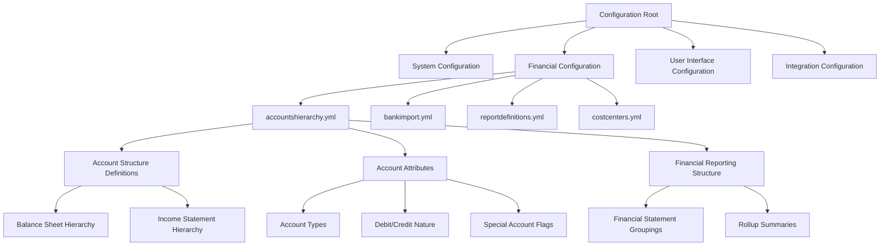
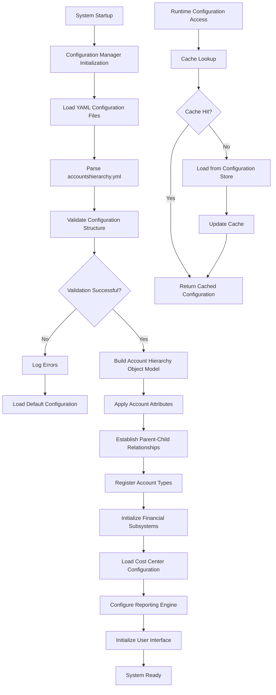

# OpenPetra Configuration Infrastructure Analysis

## Overview of OpenPetra's Configuration Infrastructure

OpenPetra's configuration architecture forms the backbone of its financial management capabilities, providing a structured and flexible foundation for non-profit organizations to manage their accounting operations. The system employs a sophisticated configuration infrastructure that defines everything from the chart of accounts to specialized financial operations like international clearing house transactions. This architecture enables OpenPetra to support diverse financial workflows while maintaining consistency and compliance with accounting standards. The configuration files serve as declarative definitions of the system's financial structure, allowing organizations to adapt the software to their specific operational requirements without modifying the core codebase. This separation of configuration from implementation facilitates customization, upgrades, and maintenance while preserving the integrity of the financial data model that underpins the entire system.

## YAML-Based Configuration Approach

OpenPetra leverages YAML (YAML Ain't Markup Language) as its primary configuration format, a choice that offers significant advantages for representing complex financial structures. YAML's human-readable syntax with minimal punctuation makes it accessible to both developers and financial administrators who need to understand or modify the system's configuration. The hierarchical indentation-based structure of YAML naturally maps to the nested relationships found in accounting systems, particularly for representing chart of accounts hierarchies where parent-child relationships are fundamental. This format allows OpenPetra to express sophisticated financial concepts like account groupings, rollup summaries, and specialized account types with remarkable clarity. YAML's support for complex data types and attributes enables the system to associate rich metadata with each account, including properties like debit/credit nature, cost center validity, and specialized flags for bank accounts or contra entries. The format's parsimony and expressiveness make it particularly well-suited for representing the intricate relationships and properties that characterize non-profit financial management systems.

## Configuration File Hierarchy in OpenPetra

OpenPetra organizes its configuration files in a logical hierarchy that reflects the system's functional domains. At the core of the financial configuration is the `accountshierarchy.yml` file, which defines the complete chart of accounts structure. This file establishes the hierarchical relationships between accounts, from high-level categories down to individual posting accounts. The configuration hierarchy follows accounting principles, separating balance sheet elements (assets, liabilities, equity) from income statement components (revenue, expenses). Supporting configuration files define related elements such as cost centers, bank import mappings, and report definitions. This hierarchical organization enables modular configuration management, allowing organizations to modify specific aspects of the system without disrupting the overall structure. The configuration hierarchy also facilitates the inheritance of properties from parent to child accounts, reducing redundancy and ensuring consistency throughout the financial structure.

## Chart of Accounts Configuration Structure

The `accountshierarchy.yml` file represents the financial backbone of OpenPetra, implementing a comprehensive chart of accounts through a meticulously structured YAML hierarchy. The file begins with a root node labeled "BAL SHT" (Balance Sheet), establishing the primary division of accounts according to standard accounting principles. From this root, the hierarchy branches into major financial categories: ASSETS, LIABILITIES, and EQUITY (represented as RET EARN or Retained Earnings). Each major category further subdivides into increasingly specific account groupings. For example, the ASSETS category branches into CASH, INVESTMENTS, DEBTORS (accounts receivable), and FIXED ASSETS, each with their own subcategories and individual accounts. Every account entry in the hierarchy contains a rich set of attributes that define its behavior within the system, including active status flags, account type designations, debit/credit nature, cost center validity, and descriptive text in multiple formats (short descriptions, long descriptions, and localized descriptions). The structure implements sophisticated accounting concepts like contra accounts (e.g., accumulated depreciation) through attribute modifications rather than structural changes, maintaining the logical organization while accommodating specialized accounting treatments. This configuration approach provides both the rigidity required for proper accounting and the flexibility needed to support diverse non-profit operational models.

## Chart of Accounts Hierarchical Structure

```mermaid
graph TD
    A["BAL SHT (Balance Sheet)"] --> B[ASSETS]
    A --> C[LIABS]
    A --> D["RET EARN (Equity)"]
    
    B --> E[CASH]
    B --> F[6500S: Investments]
    B --> G["DRS (Debtors)"]
    B --> H["DRS LNG (Long-term Debtors)"]
    B --> I[STOCK]
    B --> J["FA (Fixed Assets)"]
    
    E --> K[6000S: Petty Cash Accounts]
    E --> L[6200S: Bank Accounts Operational]
    E --> M[6400S: Bank Accounts Deposit]
    
    G --> N[6800S: Accounts Receivable]
    G --> O[6900S: Accounts Receivable Funds]
    G --> P[6700S: Prepaid Expenses]
    G --> Q[6600S: Provision for Doubtful Debts]
    
    J --> R[7300S: Equipment]
    J --> S[7400S: Land & Buildings]
    J --> T[7500S: Accumulated Depreciation]
    
    C --> U["CRS (Creditors)"]
    C --> V["CRS LNG (Long-term Creditors)"]
    C --> W[8500S: International Clearing House]
    
    D --> X[9700S: Brought Forward]
    D --> Y["PL (Profit & Loss)"]
    
    Y --> Z[INC: Total Income]
    Y --> AA[EXP: Total Expenditure]
    
    Z --> AB[GIFT: Gift Income]
    Z --> AC[LIT SALE: Literature Sales]
    Z --> AD[STC INC: Short Term Event Income]
    Z --> AE[OTHINC: Other Income]
    
    AA --> AF[4100S: Ministry]
    AA --> AG[4200S: Administration]
    AA --> AH[4300S: Personnel]
    AA --> AI[4400S: Business Travel]
    AA --> AJ[OTHEXP: Other Expenditure]
```

The chart of accounts in OpenPetra follows a deeply nested hierarchical structure that organizes financial elements according to standard accounting principles while accommodating non-profit specific needs. The hierarchy begins with the balance sheet as the root node, branching into the three fundamental accounting categories: assets, liabilities, and equity. Each branch further subdivides into increasingly specific categories, ultimately reaching individual posting accounts at the leaf nodes. This structure enables both detailed transaction recording and consolidated financial reporting through rollup summaries at each level. The hierarchy implements a consistent numbering scheme where summary accounts (marked with an 'S' suffix) aggregate their child accounts. The structure is particularly notable for its comprehensive treatment of non-profit specific categories, including detailed gift income classifications, ministry expenses, and project tracking accounts. The hierarchical design facilitates financial analysis at multiple levels of granularity, allowing organizations to examine both high-level financial performance and detailed operational metrics within specific functional areas.

## Account Attributes and Properties

The OpenPetra chart of accounts configuration employs a sophisticated attribute system that extends beyond basic account identification to define the complete behavior of each financial element. Every account entry carries a set of attributes that determine its role in the accounting system:

1. **Active Status**: Boolean flags indicate whether accounts are currently in use, allowing organizations to maintain historical accounts while preventing new transactions against deprecated categories.

2. **Account Type Classification**: Each account is explicitly typed as Asset, Liability, Equity, Income, or Expense, enforcing fundamental accounting principles and enabling proper financial statement generation.

3. **Debit/Credit Nature**: This critical attribute determines the natural balance of each account (whether increases are recorded as debits or credits), with most accounts following standard accounting conventions (assets and expenses as debit accounts; liabilities, equity, and income as credit accounts).

4. **Cost Center Validity**: Attributes like `validcc=Local` or `validcc=All` control which cost centers can post to specific accounts, enabling granular control over organizational financial boundaries.

5. **Description Levels**: Multiple description fields (shortdesc, longdesc, localdesc) support different reporting contexts and internationalization requirements.

6. **Special Purpose Flags**: Specialized attributes like `bankaccount=true` identify accounts with specific functional roles in the system, triggering specialized processing logic.

7. **Hierarchical Position**: Though not an explicit attribute, each account's position in the hierarchy implicitly defines its reporting relationships and rollup behavior.

This rich attribute system enables OpenPetra to implement sophisticated accounting rules and specialized financial workflows while maintaining a clean, understandable configuration structure. The attributes work in concert to enforce accounting principles, guide user interfaces, and support complex financial operations like international clearing house transactions and multi-currency reconciliation.

## Account Type Classification System

```mermaid
graph TD
    A[Account Types] --> B[Asset]
    A --> C[Liability]
    A --> D[Equity]
    A --> E[Income]
    A --> F[Expense]
    
    B --> G[Normal Balance: Debit]
    B --> H[Financial Statement: Balance Sheet]
    B --> I[Examples: Cash, Receivables, Fixed Assets]
    
    C --> J[Normal Balance: Credit]
    C --> K[Financial Statement: Balance Sheet]
    C --> L[Examples: Payables, Loans]
    
    D --> M[Normal Balance: Credit]
    D --> N[Financial Statement: Balance Sheet]
    D --> O[Examples: Retained Earnings, Fund Balances]
    
    E --> P[Normal Balance: Credit]
    E --> Q[Financial Statement: Income Statement]
    E --> R[Examples: Gift Income, Sales]
    
    F --> S[Normal Balance: Debit]
    F --> T[Financial Statement: Income Statement]
    F --> U[Examples: Ministry Expenses, Administration]
    
    V[Special Classifications] --> W[Contra Accounts]
    V --> X[Control Accounts]
    V --> Y[Summary Accounts]
    
    W --> Z[Reverse Normal Balance]
    W --> AA[Examples: Accumulated Depreciation, Doubtful Debts]
    
    X --> AB[Aggregate Related Accounts]
    X --> AC[Examples: Accounts Receivable Control]
    
    Y --> AD[Suffix 'S' in Account Code]
    Y --> AE[Roll-up Reporting Function]
```

OpenPetra implements a comprehensive account type classification system that adheres to standard accounting principles while extending them to meet the specialized needs of non-profit organizations. The system classifies all accounts into five fundamental types: Asset, Liability, Equity, Income, and Expense. Each type has a defined normal balance (debit or credit) and belongs to either the balance sheet or income statement. The classification system is explicitly encoded in the configuration through the `type` attribute, with default values inherited from parent accounts when not specified.

The system extends beyond these basic types with specialized classifications like contra accounts, which reverse the normal debit/credit nature of their parent category. For example, accumulated depreciation accounts are configured as liability types with credit balances, even though they function as contra-assets in the financial statements. Summary accounts, identified by an 'S' suffix in their account codes, serve as aggregation points for reporting and do not receive direct postings.

This classification system provides the foundation for enforcing accounting rules, generating accurate financial statements, and supporting specialized financial workflows. It ensures that transactions maintain proper double-entry accounting principles while accommodating the complex fund accounting requirements typical in non-profit environments.

## Special Account Configurations

OpenPetra's configuration infrastructure includes specialized account configurations that enable specific system functionality beyond standard accounting operations. These special configurations are implemented through attribute flags and strategic positioning within the account hierarchy:

1. **Bank Accounts**: Designated with the `bankaccount=true` attribute (as seen in account 6200), these accounts receive special treatment in the system, enabling bank reconciliation workflows, electronic banking interfaces, and specialized reporting. The system treats these accounts differently in cash management functions and provides additional validation rules for transactions affecting them.

2. **Contra Accounts**: Accounts like accumulated depreciation (7500S) are configured with reversed debit/credit nature compared to their parent categories. These accounts appear with negative balances on financial statements but maintain proper accounting principles. The configuration handles this by explicitly setting attributes like `type=Liability, debitcredit=credit` on accounts that function as contra-assets.

3. **International Clearing House (ICH) Operations**: The system implements a sophisticated ICH structure under account 8500S to facilitate cross-border and cross-currency transactions between organizational units. This specialized configuration enables complex settlement processes, currency exchange operations, and inter-entity reconciliation without requiring manual journal entries for each transfer.

4. **Summary Accounts**: Accounts with the 'S' suffix serve as aggregation points in the hierarchy, automatically summing their child accounts for reporting purposes. These accounts typically don't receive direct postings but instead derive their balances from subordinate accounts.

5. **Fund Accounting Structures**: Special account configurations for fund transfers (like 9800S: Internal Transfer) support the complex fund accounting requirements of non-profit organizations, enabling proper tracking of restricted and designated funds.

These specialized configurations demonstrate how OpenPetra's flexible configuration approach allows it to implement sophisticated financial operations while maintaining a clean, understandable structure. By encoding specialized behaviors through attributes rather than hard-coded logic, the system remains adaptable to diverse organizational requirements.

## Non-Profit Specific Financial Categories

OpenPetra's chart of accounts configuration is distinctively tailored to address the unique financial tracking requirements of non-profit organizations. This specialization is evident in several key areas of the account hierarchy:

1. **Gift Income Categorization**: The configuration implements an extensive gift income structure (under the GIFT category) that distinguishes between various donation types critical to non-profit operations:
   - Support gifts (both local and foreign)
   - Fund-specific gifts
   - Undesignated gifts
   - Project-specific gifts
   - Subscription and fee income

2. **Ministry Expense Tracking**: Under the Ministry expense category (4100S), the system provides detailed subcategories for tracking program-related expenditures, including:
   - Literature distribution (both for sale and free distribution)
   - Relief of need operations
   - Project-specific expenses
   - Outreach activities

3. **Project-Based Financial Management**: The configuration supports project-centric operations through dedicated income accounts (0400S: Project Gifts) and corresponding expense categories (4130S: Project Expenses), enabling accurate tracking of restricted funds and project outcomes.

4. **Event Management**: Specialized categories for event income (STC INC) and related expenses support the event-driven fundraising and ministry activities common in non-profit organizations.

5. **Fund Accounting Support**: The chart includes specialized accounts for tracking inter-fund transfers, grants between funds, and fund-specific receivables and payables, supporting the complex fund accounting requirements of non-profits managing multiple restricted and designated funds.

6. **International Operations**: The configuration accommodates the global nature of many non-profit organizations through specialized accounts for international clearing house operations, foreign income, and cross-border expense tracking.

These non-profit specific categories enable OpenPetra to support the complex financial reporting requirements of charitable organizations, including donor accountability, program efficiency metrics, and compliance with non-profit accounting standards. The configuration balances standard accounting principles with the specialized tracking needs of mission-driven organizations.

## Configuration Loading and Application Process

The configuration loading process in OpenPetra follows a structured sequence that transforms the static YAML definitions into dynamic, operational objects within the system. At startup, the Configuration Manager initializes and begins loading the YAML configuration files, with `accountshierarchy.yml` being one of the primary files processed. The system parses the YAML structure, validating it against expected schemas and accounting rules to ensure integrity.

Once validated, the system constructs an in-memory object model that represents the complete chart of accounts hierarchy, establishing parent-child relationships between accounts and applying all specified attributes. This object model serves as the foundation for financial operations throughout the application lifecycle. The configuration data is cached for performance, with careful attention to dependency management when configuration elements reference each other.

During runtime operations, the system accesses this configuration through a series of specialized services that abstract the underlying storage format, providing type-safe access to configuration elements. When transactions are processed, the system validates them against the loaded configuration, ensuring they conform to the defined account types, relationships, and rules. The reporting engine similarly relies on the configuration to generate financial statements that accurately reflect the organizational structure defined in the hierarchy.

This configuration loading process enables OpenPetra to maintain a clean separation between the definition of the financial structure and its implementation in code, allowing organizations to customize their chart of accounts without modifying the application logic.

## Configuration Extensibility and Customization

OpenPetra's configuration infrastructure is designed with extensibility as a core principle, enabling organizations to customize the financial structure to meet their specific operational needs without modifying the underlying codebase. This extensibility manifests in several key aspects of the configuration approach:

1. **Hierarchical Customization**: Organizations can modify the chart of accounts hierarchy to reflect their specific organizational structure, adding, removing, or rearranging accounts while maintaining the integrity of the overall financial model. The hierarchical nature of the configuration allows for targeted modifications at any level of detail.

2. **Attribute-Based Behavior**: By adjusting account attributes like `validcc` (valid cost centers), organizations can control which parts of the organization can post to specific accounts, enabling fine-grained financial controls that match their governance requirements.

3. **Specialized Account Types**: The configuration supports the creation of specialized account types through attribute combinations, allowing organizations to implement custom financial workflows like designated funds, restricted grants, or specialized project tracking.

4. **Descriptive Text Customization**: Multiple description fields (short, long, and localized) can be customized to match organization-specific terminology and reporting requirements, making financial reports more meaningful to stakeholders.

5. **Account Code Flexibility**: While maintaining structural conventions like the 'S' suffix for summary accounts, organizations can adapt the account numbering scheme to match their existing financial systems or reporting requirements.

6. **Extensible Metadata**: The YAML format readily accommodates additional custom attributes that can be leveraged by reporting tools or custom extensions without disrupting core functionality.

This extensibility is particularly valuable for non-profit organizations, which often have unique financial tracking requirements based on their mission, funding sources, and regulatory environment. The configuration approach allows each organization to adapt OpenPetra to their specific needs while benefiting from the shared core functionality and ongoing community development.

## Integration with Other System Components

OpenPetra's configuration infrastructure serves as a foundational element that integrates with and supports numerous other system components. The chart of accounts configuration defined in `accountshierarchy.yml` provides the structural backbone that enables cohesive operation across multiple functional areas:

1. **Transaction Processing**: The account hierarchy directly informs the transaction entry and validation subsystems, determining valid account combinations, enforcing debit/credit rules, and applying cost center restrictions based on the `validcc` attributes.

2. **Financial Reporting**: The hierarchical structure defined in the configuration drives the generation of financial statements, with summary accounts (those with 'S' suffix) providing automatic rollup capabilities for balance sheet and income statement reporting.

3. **User Interface Components**: Account attributes influence how accounts appear in selection lists, search results, and data entry forms throughout the application, with special account types receiving customized treatment in relevant interfaces.

4. **Security and Access Control**: The account structure interacts with the security subsystem to control which users can view or modify specific accounts based on their roles and permissions.

5. **Data Import/Export**: External data interfaces rely on the account configuration to map between external systems and OpenPetra's internal structure, particularly for bank reconciliation and financial data exchange.

6. **Audit and Compliance**: The configuration supports audit trails and compliance reporting by defining the structure against which financial transactions are validated and reported.

7. **Multi-Currency Operations**: Special accounts like the International Clearing House (ICH) configuration integrate with the multi-currency subsystem to facilitate cross-border financial operations.

8. **Budgeting and Forecasting**: The account hierarchy provides the structure for budget definition, variance reporting, and financial forecasting functions.

This deep integration across system components demonstrates how the configuration infrastructure serves not merely as a static definition but as an active participant in the system's operation. By centralizing the financial structure definition in the configuration, OpenPetra ensures consistency across all aspects of the application while maintaining the flexibility to adapt to diverse organizational requirements.

[Generated by the Sage AI expert workbench: 2025-03-30 02:22:57  https://sage-tech.ai/workbench]: #