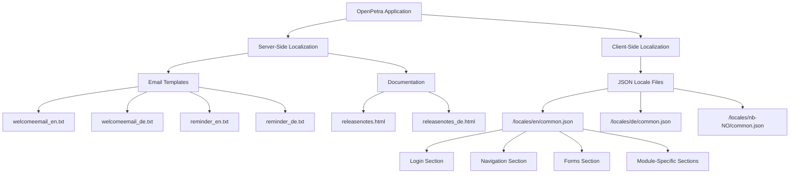
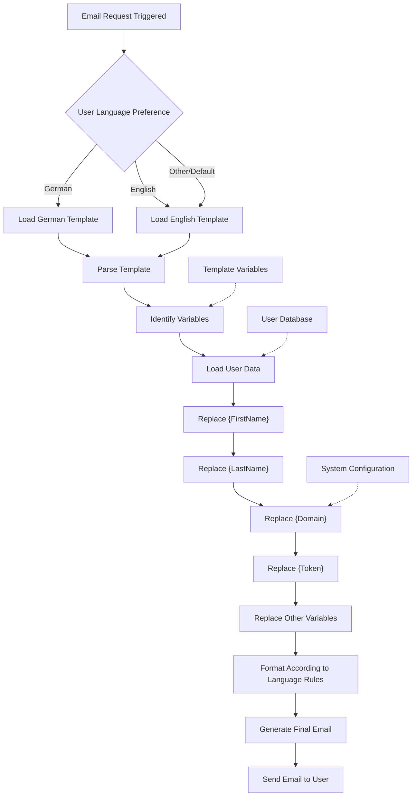
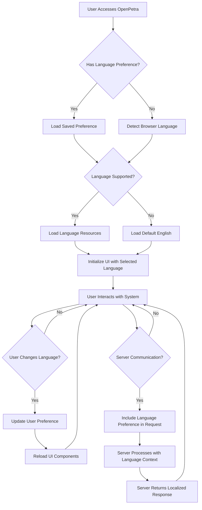
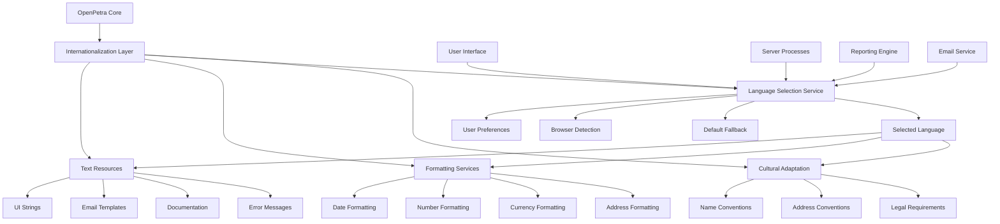

# Internationalization in OpenPetra

## Introduction to Internationalization in OpenPetra

OpenPetra takes a comprehensive approach to internationalization (i18n) and localization (l10n), enabling the software to serve non-profit organizations across different language regions and cultural contexts. The system is designed with a clear separation between code and user-facing content, allowing for efficient translation and adaptation to various languages without modifying the core application logic.

The internationalization architecture in OpenPetra spans multiple layers of the application, from the server-side email templates to the client-side user interface. This approach recognizes that effective internationalization goes beyond simple text translation - it encompasses date formats, number representations, currency displays, and cultural adaptations that make the software feel native to users regardless of their location or language preference.

OpenPetra currently supports multiple languages including English, German, and Norwegian, with the framework in place to easily add more languages as needed. This flexibility is crucial for a system designed to serve international non-profit organizations that may operate across multiple countries and language regions.

## Architecture of the Localization System

OpenPetra's localization architecture follows a modular approach that separates localized content from application code. The system employs a multi-layered strategy for internationalization:

1. **Server-side localization**: Email templates and system messages are stored as separate files with language-specific versions (e.g., `welcomeemail_de.txt` for German). These files contain placeholders that get replaced with dynamic content when used.

2. **Client-side localization**: The JavaScript client uses JSON-based localization files organized by functional areas. These files (like `common.json`) contain key-value pairs where the keys are consistent across languages, but values are translated.

3. **Resource file organization**: Localization files are organized by language code (e.g., `en` for English, `de` for German, `nb-NO` for Norwegian) and further by functional modules.

4. **Dynamic language selection**: The system allows users to select their preferred language, which is then stored as part of their profile settings. All UI elements and communications adapt to this preference.

5. **Fallback mechanism**: If a translation is missing in the selected language, the system falls back to English to ensure that users always see content rather than error messages or blank spaces.

This architecture ensures that adding a new language to OpenPetra primarily involves creating new resource files rather than modifying application code, making the internationalization process more maintainable and scalable.

## Localization File Structure

The localization file structure in OpenPetra is organized hierarchically to support multiple languages across different parts of the application. On the server side, email templates follow a naming convention with language suffixes (e.g., `_de` for German), allowing the system to select the appropriate template based on the user's language preference.

For the client-side UI, localization files are stored in language-specific directories under the `/locales` path. Each language has a `common.json` file that contains translations organized by functional areas such as login, navigation, forms, and module-specific sections. This structure allows developers to easily locate and update translations for specific features without having to search through a monolithic translation file.

The modular organization also facilitates the addition of new languages, as translators can work on specific sections independently. The consistent key structure across language files ensures that the application can seamlessly switch between languages while maintaining the same functionality.

## Email Template Localization

OpenPetra implements a sophisticated approach to email template localization, ensuring that system communications can be delivered in the recipient's preferred language. The system maintains separate template files for each supported language, with naming conventions that clearly identify the language (e.g., `welcomeemail_de.txt` for German welcome emails).

These email templates are designed with a consistent structure across languages, using the same variable placeholders (like `{FirstName}`, `{LastName}`, `{Domain}`, etc.) regardless of the language. This consistency allows the template processing engine to work with any language version without modification.

The templates contain not just translated text but also culturally appropriate greetings, formatting, and instructions. For example, the German welcome email uses formal address forms ("Sehr geehrte(r)") and German-specific links to documentation (https://handbuch.openpetra.de), while maintaining the same functional content as its English counterpart.

When an email needs to be sent, OpenPetra's email service:
1. Determines the recipient's preferred language
2. Selects the appropriate language version of the template
3. Populates the template with dynamic data (user information, links, tokens)
4. Formats the email according to language-specific conventions
5. Sends the localized communication

This approach ensures that users receive communications in their preferred language, enhancing the user experience and accessibility of the system for international organizations.

## Template Variable Substitution Flow

The template variable substitution process in OpenPetra follows a systematic flow that transforms static templates into personalized communications. When an email needs to be sent, the system first identifies the recipient's language preference and selects the appropriate template file (e.g., `welcomeemail_de.txt` for German users).

The template engine then parses the selected template file, identifying all variable placeholders enclosed in curly braces (e.g., `{FirstName}`, `{LastName}`, `{Token}`). For each identified variable, the system retrieves the corresponding value from various data sources:

- User-specific data like names and email addresses come from the user database
- System-specific data like domain URLs come from system configuration
- Security tokens are generated dynamically for password resets and verifications
- Context-specific data depends on the type of email being sent

The substitution process is language-agnostic, meaning the same variable names are used across all language versions of a template, ensuring consistency in functionality while allowing for differences in text structure and formatting.

After all variables are replaced with their actual values, the system applies any language-specific formatting rules (such as date formats or number representations) and generates the final email content. This process ensures that each recipient receives a communication that is both personalized and culturally appropriate for their language preference.

## Frontend UI Localization

OpenPetra's frontend UI localization is implemented through a comprehensive JSON-based translation system. The JavaScript client uses structured JSON files organized by functional areas to provide translations for all user interface elements. These files are stored in language-specific directories (e.g., `/js-client/locales/de/` for German) and contain hierarchically organized translation keys.

The localization approach for the frontend follows these key principles:

1. **Modular organization**: Translations are grouped by functional areas such as login, navigation, forms, and specific modules like partner management or finance. This organization makes it easier to maintain and update translations for specific features.

2. **Consistent key structure**: All language files use the same hierarchical key structure, allowing the application to retrieve the correct translation by simply changing the language path while keeping the key path consistent.

3. **Rich text support**: The translation system supports HTML markup within translation strings, enabling formatted text, links, and other rich content in the localized interface.

4. **Dynamic language switching**: Users can change their language preference on the fly, and the UI immediately updates to reflect the selected language without requiring a page reload.

5. **Specialized terminology**: Each functional area includes translations for domain-specific terminology, ensuring consistent use of financial, non-profit, and technical terms across the application.

The frontend localization system also handles pluralization rules, date formatting, and number formatting according to the conventions of each supported language. This comprehensive approach ensures that users experience a fully localized interface that feels natural in their preferred language.

## Language Selection and Application Flow

The language selection and application flow in OpenPetra is designed to provide a seamless multilingual experience. When a user first accesses the system, OpenPetra checks for a saved language preference. If none exists, it attempts to detect the user's preferred language from browser settings. If the detected or saved language is supported, the system loads the corresponding language resources; otherwise, it defaults to English.

Once the language is determined, the UI is initialized with the selected language resources, applying translations to all interface elements. The language selection persists across user sessions as part of the user's profile settings.

Users can change their language preference at any time through the settings menu. When a language change occurs, the system:

1. Updates the user's language preference in their profile
2. Dynamically reloads UI components with translations from the new language
3. Ensures that subsequent server communications use the updated language preference

For server communications, the user's language preference is included in requests to ensure that server-generated content (such as error messages or dynamically generated reports) is returned in the appropriate language. This includes email communications, which are sent using templates in the user's preferred language.

This integrated approach ensures consistency across all aspects of the application, providing users with a fully localized experience from the moment they log in to when they receive system-generated communications.

## Documentation Localization

OpenPetra takes a comprehensive approach to documentation localization, ensuring that users have access to guidance and information in their preferred language. The documentation localization strategy encompasses release notes, user manuals, and contextual help within the application.

Release notes are maintained in language-specific HTML files (e.g., `releasenotes_de.html` for German), which contain detailed information about new features, improvements, and bug fixes for each version. These files are structured consistently across languages but contain translated content appropriate for each language audience. The system automatically directs users to the release notes in their selected language, falling back to English if a translation is not available.

User manuals are also localized, with separate documentation sites for different languages. For example, German users are directed to `https://handbuch.openpetra.de` while English users access `https://docs.openpetra.org`. This approach allows for documentation that is not just translated but also culturally adapted, with examples and explanations that make sense in the context of each language region.

Within the application, contextual help links are dynamically adjusted based on the user's language preference, ensuring that help resources are always provided in the most appropriate language. This includes tooltips, help text, and links to relevant sections of the documentation.

The documentation localization process is integrated with the overall development workflow, ensuring that when new features are added or existing ones modified, the documentation in all supported languages is updated accordingly. This coordination helps maintain consistency between the application and its documentation across all supported languages.

## Handling Cultural Differences

OpenPetra's internationalization goes beyond simple text translation to address cultural differences in data presentation and interpretation. The system adapts various elements to match the cultural expectations and requirements of users in different regions:

1. **Date formats**: OpenPetra adjusts date displays based on regional conventions. For example, dates are shown as DD.MM.YYYY in German contexts and MM/DD/YYYY in American English contexts. The system handles these conversions automatically based on the user's language preference.

2. **Number formats**: Numerical values are formatted according to local conventions, including the appropriate decimal and thousands separators. For instance, German users see numbers with comma decimals (e.g., 1.234,56), while English users see point decimals (e.g., 1,234.56).

3. **Currency displays**: The system adapts currency symbols, positions, and formats based on regional standards. It also handles currency conversion for organizations operating across multiple currency zones.

4. **Address formats**: Contact information is displayed and printed according to country-specific address formats, ensuring that mailing labels and contact displays follow local conventions.

5. **Name formats**: The system supports different name ordering conventions (e.g., given name first vs. family name first) and provides options for users to select their preferred name display format.

6. **Formal vs. informal address**: In languages that distinguish between formal and informal address forms (like German), the system uses appropriate forms in communications and interfaces.

7. **Legal requirements**: OpenPetra adapts to region-specific legal requirements, such as GDPR compliance features for European users, which include consent management for personal data usage.

These cultural adaptations ensure that OpenPetra feels natural and appropriate to users regardless of their cultural background, enhancing usability and user acceptance across different regions.

## Internationalization Architecture Overview

OpenPetra's internationalization architecture is designed as a cross-cutting concern that integrates with all layers of the application. At its core is an Internationalization Layer that mediates between the application's core functionality and its presentation to users in different languages and cultural contexts.

The architecture consists of several key components:

1. **Language Selection Service**: Determines the appropriate language based on user preferences, browser settings, or system defaults. This service provides language context to all other components.

2. **Text Resources**: Manages localized strings for UI elements, email templates, documentation, and error messages. These resources are organized by language and functional area.

3. **Formatting Services**: Handles the localization of dates, numbers, currencies, and addresses according to regional conventions.

4. **Cultural Adaptation**: Implements region-specific behaviors for name conventions, address formats, and legal requirements.

5. **Integration Points**: The internationalization layer connects with the user interface, server processes, reporting engine, and email service to ensure consistent localization across all aspects of the application.

This architecture ensures that internationalization concerns are separated from business logic, making it easier to add new languages or update existing translations without modifying core functionality. It also provides a consistent user experience across different parts of the application, regardless of the user's language preference.

The modular design allows for independent evolution of language support and application features, with clear interfaces between the internationalization layer and the rest of the system.

## Future Improvements and Challenges

While OpenPetra has established a solid foundation for internationalization, several challenges and opportunities for improvement remain as the system continues to evolve:

1. **Expanding language support**: Adding more languages beyond the current English, German, and Norwegian offerings presents challenges in finding qualified translators who understand both the technical aspects of the software and the non-profit domain terminology.

2. **Maintaining translation consistency**: As the application grows, ensuring consistent terminology across all parts of the interface becomes increasingly challenging, especially when multiple translators are involved.

3. **Right-to-left language support**: Supporting languages like Arabic or Hebrew would require significant UI adjustments to handle right-to-left text direction, affecting layouts, input fields, and reports.

4. **Complex pluralization rules**: Some languages have complex pluralization rules that go beyond the simple singular/plural distinction, requiring more sophisticated handling in the translation system.

5. **Regional variations**: Addressing regional variations within the same language (e.g., British vs. American English, or different Spanish dialects) would provide a more tailored experience for users in different regions.

6. **Automated translation workflows**: Implementing tools to streamline the translation process, such as translation memory systems or machine translation with human review, could accelerate the localization of new features.

7. **Cultural nuances in reporting**: Financial and donation reports may need further cultural adaptation beyond simple translation to meet the expectations and requirements of different regions.

8. **Accessibility across languages**: Ensuring that accessibility features work effectively across all supported languages presents additional challenges, particularly for screen readers and other assistive technologies.

9. **Testing across languages**: Developing comprehensive testing strategies for all supported languages to catch localization issues before they reach users.

10. **Dynamic content localization**: Improving the handling of user-generated content and dynamic data that needs to be presented in multiple languages.

Addressing these challenges will require ongoing investment in the internationalization infrastructure, collaboration with language experts, and feedback from users across different regions. The modular architecture of OpenPetra's internationalization system provides a solid foundation for these future improvements, allowing the system to grow its language support while maintaining a consistent user experience.

[Generated by the Sage AI expert workbench: 2025-03-30 02:22:57  https://sage-tech.ai/workbench]: #