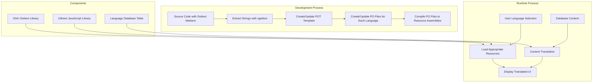
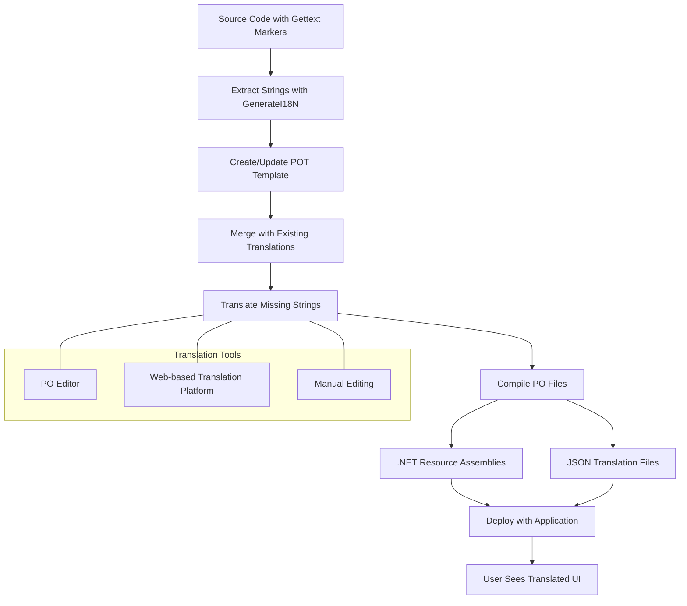
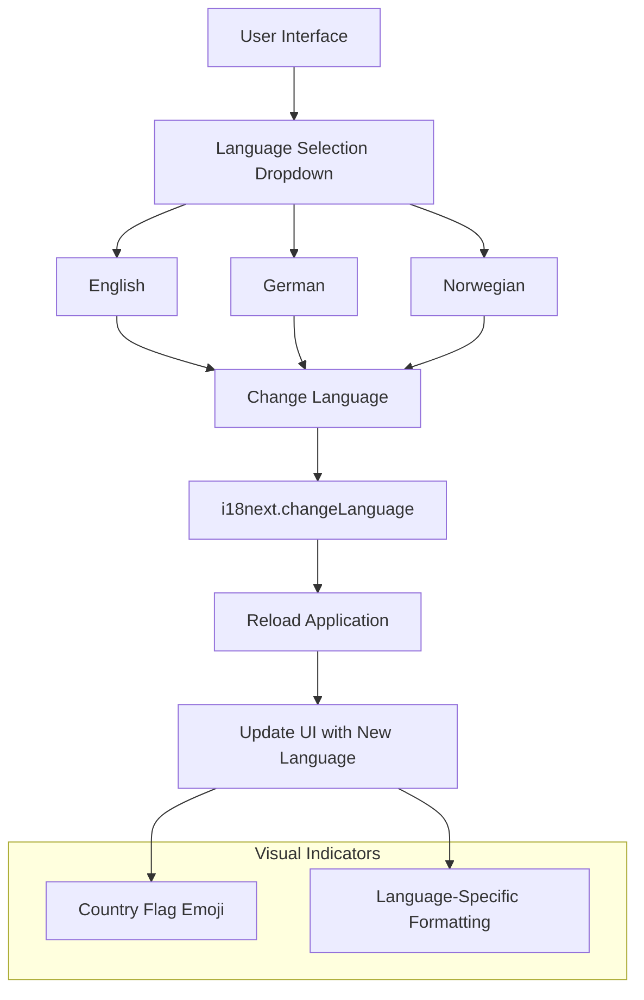
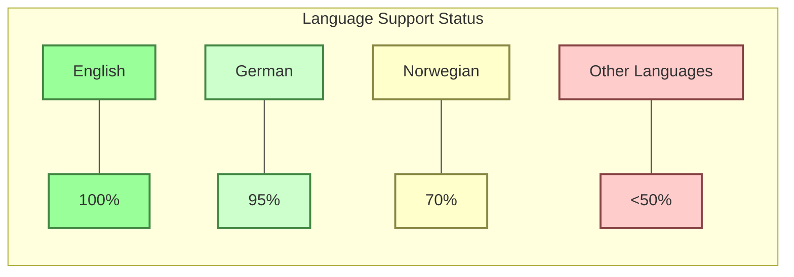

# Internationalization in OpenPetra: Multi-Language Support

## Introduction to OpenPetra's Multi-Language Support

OpenPetra implements a comprehensive internationalization (i18n) architecture that enables users to interact with the system in their preferred language. This capability is essential for supporting OpenPetra's global user base of non-profit organizations across different regions and language backgrounds. The system uses a mature, standards-based approach to separate translatable content from code, making it possible to add new languages without modifying the application's core functionality.

The internationalization architecture spans both the server-side C# components and the client-side JavaScript interface, providing a consistent multilingual experience throughout the application. OpenPetra's approach allows for dynamic language switching at runtime, proper handling of locale-specific formatting for dates, numbers, and currencies, and support for grammatical features like plural forms across different languages.

## GNU Gettext Integration

OpenPetra implements internationalization using GNU Gettext, a mature and widely-used framework for software translation. Gettext separates translatable strings from code by using a marker function (typically called `GetString()`) to identify text that should be translated. This approach offers several advantages:

1. **Separation of concerns**: Developers can focus on functionality while translators work with text files.
2. **Context preservation**: Translatable strings remain in their functional context in the code, making it easier for translators to understand their usage.
3. **Fallback mechanism**: If a translation is missing, the original (usually English) text is displayed rather than an error.
4. **Mature toolchain**: Gettext has a robust ecosystem of tools for extracting strings, managing translations, and compiling translation files.

In the server-side C# code, OpenPetra uses a wrapper class called `Catalog` that provides methods like `GetString()` and `GetPluralString()` to handle translations. The actual translation functionality is provided by the `GettextResourceManager` class, which loads and manages translation resources.

For the web client, OpenPetra uses the i18next JavaScript library, which follows similar principles but is adapted for browser environments. Translation files are stored in JSON format and loaded dynamically based on the user's language preference.

```csharp
// Example of C# code using Gettext
public static readonly string StrInvalidDataTitle = Catalog.GetString("Invalid Data");

// Example of handling plurals
string message = Catalog.GetPluralString(
    "One record was processed.", 
    "{0} records were processed.", 
    recordCount, 
    false);
```

## Internationalization Architecture Overview



The architecture diagram illustrates how OpenPetra's internationalization system works across both development and runtime processes. During development, source code with translation markers is processed to extract translatable strings into template files, which are then translated into multiple languages and compiled into resource assemblies. At runtime, the system loads the appropriate resources based on user language selection and displays the translated UI, with additional translation for database content.

This architecture ensures a clean separation between code and translations while providing efficient runtime performance. The use of standard tools and formats (Gettext, PO files) makes it easier to integrate with translation workflows and tools used by professional translators.

## Translation File Structure

OpenPetra's translation files are organized in a hierarchical structure that supports multiple languages and contexts. The system uses different file formats depending on the platform:

### Server-Side (C#) Translation Files

1. **POT (Portable Object Template) Files**: These are template files containing all original strings extracted from the source code. The main template file is `i18n/template.pot`.

2. **PO (Portable Object) Files**: Language-specific files derived from the POT template, containing the original strings and their translations. For example, `i18n/de.po` for German translations.

3. **Compiled Resource Assemblies**: PO files are compiled into .NET resource assemblies (DLLs) that are loaded at runtime. These are stored in language-specific directories, e.g., `de-DE/OpenPetra.resources.dll`.

### Client-Side (JavaScript) Translation Files

1. **JSON Translation Resources**: The web client uses JSON files organized by language and namespace. For example:
   - `js-client/locales/de-DE/common.json` for German translations
   - `js-client/locales/en/common.json` for English translations

The JSON files are structured hierarchically to organize translations by functional area:

```json
{
    "login": {
        "signin": "Anmelden",
        "signup": "Registrieren",
        "email": "E-Mail Adresse",
        "passwd": "Passwort",
        // ...
    },
    "navigation": {
        "home": "Start",
        "help": "Hilfe",
        // ...
    },
    // ...
}
```

This structure allows for modular loading of translations and helps organize the translations by context, making it easier for translators to understand where and how the strings are used in the application.

## Translation Workflow



The translation workflow in OpenPetra follows these steps:

1. **String Extraction**: The `GenerateI18N` tool analyzes source code files to identify strings marked for translation using `Catalog.GetString()` and similar methods.

2. **Template Generation**: Extracted strings are compiled into a POT (Portable Object Template) file that serves as the master template for all translations.

3. **Translation File Management**: For each supported language, the system either creates a new PO file or updates an existing one, preserving existing translations while adding new strings.

4. **Translation Process**: Translators work with PO files using specialized tools like Poedit, web-based translation platforms, or even manual editing. These tools show the original string, translation context, and allow entering the translated text.

5. **Quality Control**: OpenPetra includes functionality to identify and filter out strings that should not be translated (like technical identifiers) using a "Do Not Translate" list.

6. **Compilation**: Translated PO files are compiled into resource assemblies for the server-side code and converted to JSON format for the client-side interface.

7. **Deployment**: The compiled translation resources are packaged with the application for deployment.

This workflow allows for continuous translation updates as the application evolves, with tools to help manage the process efficiently and ensure translation quality.

## Language Switching Mechanism

OpenPetra allows users to change languages on-the-fly, providing a seamless multilingual experience. The language switching mechanism is implemented differently in the server and client components:

### Server-Side Language Switching

In the C# server components, language switching is handled by the `Catalog` class, which provides methods to initialize and change the current language:

```csharp
// Initialize with a specific language
Catalog.Init("de-DE", "de-DE");

// Change language at runtime
Catalog.SetLanguage("fr-FR");
```

When the language is changed, the system updates the current thread's culture settings (`CurrentUICulture` and `CurrentCulture`), which affects how strings, dates, numbers, and other culture-specific data are displayed.

### Client-Side Language Switching

In the JavaScript client, language switching is implemented using the i18next library. The `ChangeLanguage.js` file contains event handlers for language selection buttons:

```javascript
$("#btnGerman").click(function(e) {
    e.preventDefault();
    i18next.changeLanguage("de");
    nav.OpenForm("Home", "home");
    location.reload();
});
```

When a language button is clicked, the code:
1. Changes the language setting in i18next
2. Navigates to the home screen
3. Reloads the page to ensure all components reflect the new language

The client also updates visual indicators of the current language, such as displaying the appropriate country flag emoji:

```javascript
i18next.on('languageChanged', () => {
  updateContent();
  var flag = "🇬🇧";
  switch (currentLng()) {
    case "de": 
      flag = "🇩🇪";
      break;
    case "nb-NO":
      flag = "🇳🇴";
      break;
  }
  $("#chlang span").text(flag);
});
```

This approach ensures that the entire user interface is consistently presented in the selected language, including both static text and dynamically generated content.

## Build Tools for Internationalization

OpenPetra includes specialized build tools that automate the extraction of translatable strings, manage translation files, and integrate them into the application. These tools are primarily implemented in the `GenerateI18N` namespace and include:

### TGenerateCatalogStrings

This class analyzes C# source files to identify UI text properties and adds `Catalog.GetString()` calls to make them translatable. It works by:

1. Parsing designer files to extract text properties
2. Injecting translation code into the main code files
3. Extracting database help text for translation
4. Processing UI navigation YAML files to extract menu labels

```csharp
// Example of how TGenerateCatalogStrings processes files
public static bool Execute(string AMainFilename, 
                          TDataDefinitionStore ADataDefinitionStore, 
                          StreamWriter ADbHelpTranslationWriter)
{
    // Find designer file, extract strings, inject translation code
    // ...
}
```

### TDropUnwantedStrings

This class filters out strings that should not be translated from PO files, such as technical identifiers or code snippets. It:

1. Reads a "Do Not Translate" file to identify strings to exclude
2. Processes translation files to remove these entries
3. Preserves essential metadata and source references

### ParseWithGettext

This function uses the external GNU gettext tools to parse source files and extract translatable strings:

```csharp
private static void ParseWithGettext(string AGettextApp, 
                                    string APoFile, 
                                    string AListOfFilesToParse)
{
    // Run gettext to extract strings from source files
    // ...
}
```

### TPoFileParser

This class handles parsing and updating PO translation files, managing the specific format requirements of these files:

```csharp
public static void WriteUpdatedPoFile(string APoFilePath, 
                                     SortedList<string, string> ANewTranslations)
{
    // Update PO file with new translations while preserving structure
    // ...
}
```

These build tools are integrated into OpenPetra's build process, ensuring that translation resources are automatically updated as the application evolves. They handle the complex tasks of string extraction, file management, and format conversion, making it easier for developers to maintain internationalization support.

## Language Selection User Interface



OpenPetra provides a simple and intuitive language selection interface that allows users to switch between available languages. The language selection UI is implemented in the `ChangeLanguage.js` file and consists of buttons for each supported language.

When a user selects a language:

1. The system changes the language setting using `i18next.changeLanguage()`
2. The application navigates to the home screen
3. The page is reloaded to apply the language change throughout the interface
4. Visual indicators are updated to reflect the current language (e.g., country flag emoji)

The language selection UI is accessible from the user settings menu, making it easy for users to find and change their language preference at any time. The current implementation supports English, German, and Norwegian, but the architecture is designed to easily accommodate additional languages.

The UI also adapts to the selected language by applying appropriate formatting for dates, numbers, and other locale-specific content, providing a consistent experience in the user's preferred language.

## Handling Special Cases: Numbers, Dates and Plurals

OpenPetra implements sophisticated handling of language-specific formatting for numbers, dates, currency values, and grammatical plural forms across different languages:

### Number and Currency Formatting

The `NumberToWords` class converts numerical values to their written word form in different languages, handling language-specific rules:

```csharp
// Convert 123.45 to "one hundred twenty-three dollars and forty-five cents"
string amountInWords = NumberToWords.AmountToWords(123.45, 
                                                 "dollar", "dollars", 
                                                 "cent", "cents");
```

The implementation includes language-specific arrays and methods for different languages:

```csharp
private static readonly string[] SingleDigitsDE = 
    { "null", "ein", "zwei", "drei", "vier", "fünf", "sechs", "sieben", "acht", "neun" };

private static readonly string[] SingleDigitsUK = 
    { "zero", "one", "two", "three", "four", "five", "six", "seven", "eight", "nine" };
```

### Date Formatting

Date formatting is handled using the .NET `CultureInfo` system, which is set based on the user's language preference:

```csharp
// Set culture for date formatting
Thread.CurrentThread.CurrentCulture = new CultureInfo(ACultureCode);
```

This ensures that dates are displayed according to the conventions of the selected language and region.

### Plural Forms

OpenPetra handles grammatical plural forms using the `GetPluralString` method, which selects the appropriate form based on the quantity and language rules:

```csharp
// Get appropriate plural form
string message = Catalog.GetPluralString(
    "One record was processed.", 
    "{0} records were processed.", 
    recordCount, 
    false);
```

The GNU Gettext system supports complex plural rules for different languages. For example, some languages have different forms for zero, one, two, few, and many items.

In the JavaScript client, i18next provides similar functionality for handling plurals in the UI:

```javascript
// i18next plural handling
const message = i18next.t('key', { count: itemCount });
```

These mechanisms ensure that OpenPetra can correctly handle language-specific formatting and grammatical rules, providing a natural and correct experience for users in their native language.

## Testing and Quality Assurance for Translations

OpenPetra implements several approaches for ensuring translation quality, completeness, and context-appropriateness across the application:

### Translation Completeness Checking

The build system tracks translation completeness by comparing the POT template file with language-specific PO files to identify missing translations. This allows project managers to monitor translation progress and prioritize work on frequently used sections.

### Context Preservation

OpenPetra's translation extraction tools preserve context information in the PO files, including:
- Source file and line number where the string appears
- Comments that provide additional context for translators
- Function names and parameters that indicate how the string is used

This context helps translators understand how and where strings are used in the application, leading to more accurate translations.

### Test Applications

OpenPetra includes test applications specifically for internationalization:

```csharp
// Example from I18N test program
Catalog.Init("de-DE", "de-DE");
Console.WriteLine(Thread.CurrentThread.CurrentCulture.ToString());
Console.WriteLine(Catalog.GetString("Hello World!"));
```

These test applications verify that:
- Translation resources are correctly loaded
- String substitution works properly
- Plural forms are handled correctly
- Special characters are displayed properly

### Reference Files

The system maintains reference files with source locations for all translatable strings, helping translators and developers track where strings are used:

```csharp
// Create reference file with source locations
StreamWriter sw_all = new StreamWriter(ATranslationFile + ".withallsources", false, enc);
```

### Fallback Mechanism

OpenPetra implements a fallback mechanism that displays English text when a translation is missing, ensuring that the application remains usable even with incomplete translations:

```csharp
// Fallback to English if translation not found
if (AReturnEnglishIfNotFound)
{
    LogonMessageTable = SLogonMessageAccess.LoadByPrimaryKey("EN", ATransaction);
    ReturnValue = LogonMessageTable[0].LogonMessage;
}
```

These quality assurance measures help ensure that OpenPetra's translations are accurate, complete, and appropriate for their context, providing a high-quality multilingual experience for users.

## Supported Languages and Completion Status



OpenPetra currently supports multiple languages with varying levels of translation completeness. The primary supported languages are:

1. **English (EN)**: 100% - The base language with complete coverage
2. **German (DE)**: ~95% - Nearly complete translation
3. **Norwegian (nb-NO)**: ~70% - Major UI elements translated

The system is designed to support many more languages, as evidenced by the `p_language.csv` reference file which includes codes for over 50 languages including:

- French (FR)
- Spanish (ES)
- Italian (IT)
- Dutch (NL)
- Swedish (SV)
- Danish (DA)
- Finnish (FI)
- Czech (CS)
- Hungarian (HU)
- Ukrainian (UK)
- Korean (KO)

However, these additional languages currently have limited or no translation coverage. The architecture allows for easy addition of new languages as translations become available.

The translation status is tracked through the build system, which can generate reports on translation completeness for each language. This helps project managers prioritize translation efforts and track progress over time.

OpenPetra's modular approach to internationalization means that even partially translated languages can be used, with English text appearing as fallback for untranslated strings. This allows for incremental improvement of translations over time.

[Generated by the Sage AI expert workbench: 2025-03-30 02:22:57  https://sage-tech.ai/workbench]: #