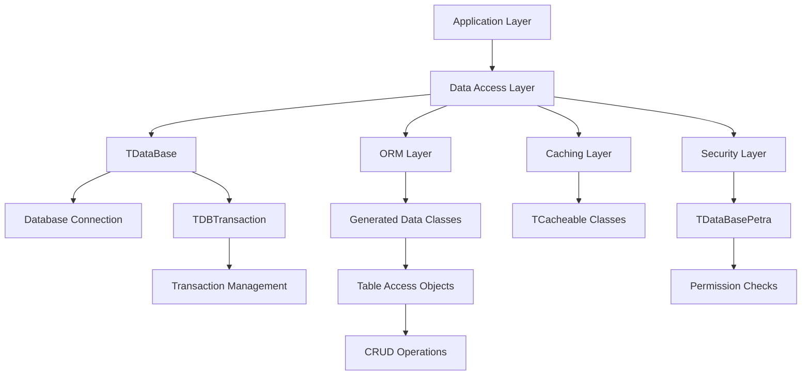
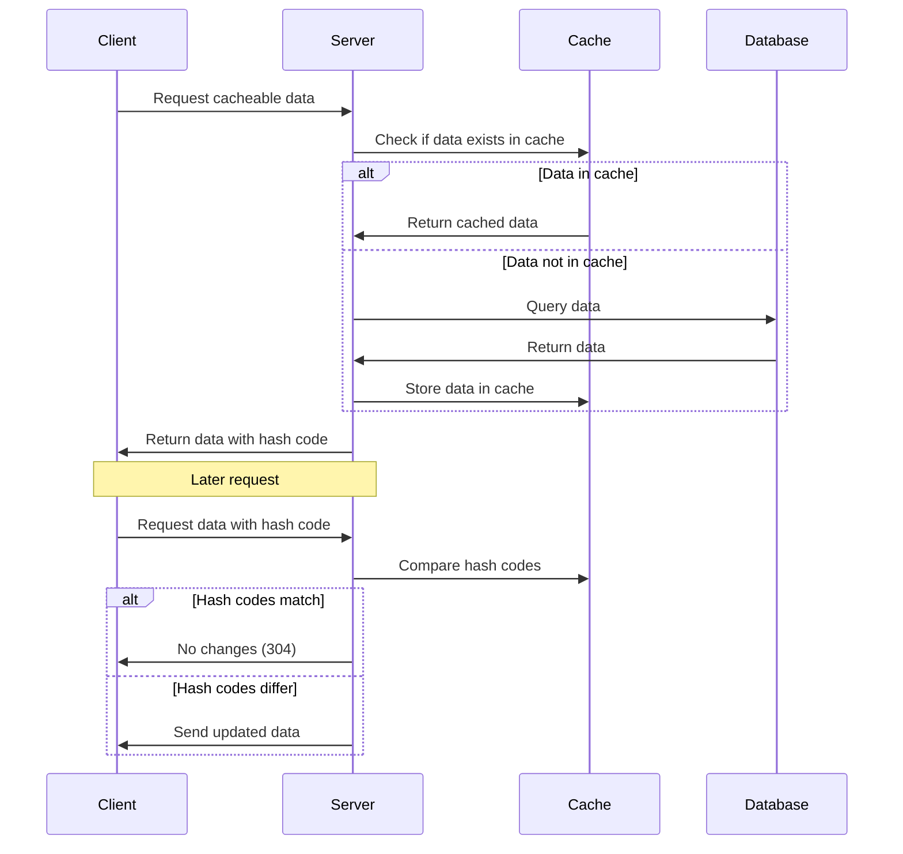
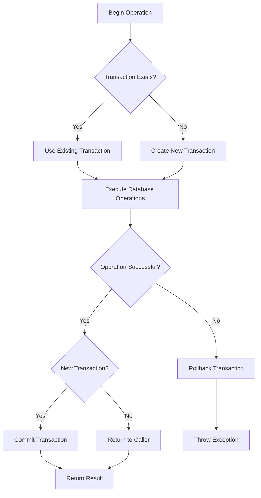
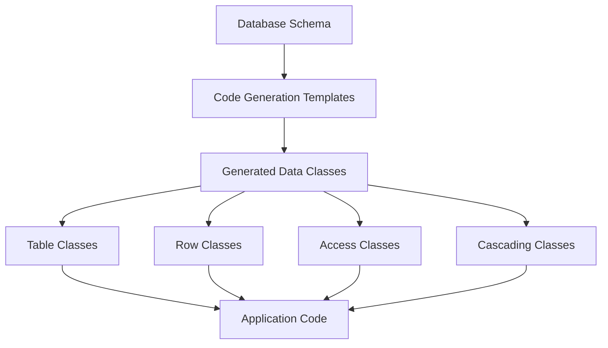

# Overview of OpenPetra's Data Access Layer

## Overview of OpenPetra's Data Access Layer

The data access layer in OpenPetra provides a structured approach to database interactions, separating business logic from data storage concerns while ensuring data integrity and security. This comprehensive architecture enables OpenPetra to maintain a clean separation of concerns while providing robust data management capabilities across its various modules.

## Core Database Abstraction Components

OpenPetra implements a comprehensive database abstraction layer through TDataBase, TDBTransaction, and related classes that handle connections, transactions, and SQL execution with support for multiple database systems. The architecture is designed to provide a unified interface for database operations while abstracting away the specifics of different database providers.

The core components include:

- **TDataBase**: The central class that manages database connections and provides methods for executing SQL commands
- **TDBTransaction**: Wraps ADO.NET transactions with additional metadata for tracking and debugging
- **DBAccess**: Provides utility methods for connection management and simplified transaction handling
- **TDataBasePetra**: Extends TDataBase to implement security checks before executing SQL queries

These components work together to provide a robust foundation for all database operations in OpenPetra, with comprehensive error handling and transaction management.

## Object-Relational Mapping (ORM)

The ORM system uses code generation templates to create strongly-typed data access classes that provide CRUD operations, relationship management, and data validation for each database table. This approach ensures type safety while reducing the amount of boilerplate code needed for database operations.

Key components of the ORM system include:

1. **Template-based code generation**: Templates like `DataAccess.cs`, `DataSet.cs`, and `DataCascading.cs` define patterns for generating data access code
2. **Strongly-typed datasets**: Generated classes provide type-safe access to database tables
3. **Table Access Objects**: Classes like `{TableName}Access` provide methods for loading, saving, and querying data
4. **Cascading operations**: Special handling for operations that affect multiple related tables

The ORM layer handles the complexity of mapping between object-oriented code and relational database structures, providing a clean API for the rest of the application to use.

## Caching Mechanism

OpenPetra implements a sophisticated caching system for frequently accessed, rarely changed data through the TCacheable classes, improving performance by reducing database queries. The caching system is particularly important for reference data that is used throughout the application.

Key features of the caching mechanism include:

- **Thread-static cache instances**: Ensures thread safety while maintaining performance
- **Hash-based change detection**: Efficiently determines when client caches need updating
- **Cacheable table enumeration**: Provides a structured way to identify cacheable tables
- **Manual and automatic cache invalidation**: Ensures data consistency when changes occur

The caching system significantly improves application performance by reducing database round-trips for frequently accessed data.

## Transaction Management Flow

OpenPetra's transaction management ensures data integrity by properly handling database operations within transactions. The system supports different isolation levels and provides mechanisms for handling transaction conflicts and retries.

Key aspects of transaction management include:

- **Isolation level control**: Supports different isolation levels based on operation requirements
- **Transaction nesting**: Properly handles nested transaction requests
- **Error handling**: Comprehensive exception handling for transaction failures
- **Automatic retry**: For certain transaction conflicts, especially in PostgreSQL
- **Transaction metadata**: Tracks transaction origin and context for debugging

The transaction management system ensures that database operations maintain ACID properties while providing flexibility for different types of operations.

## Data Validation Framework

A comprehensive validation framework ensures data integrity by validating business rules before data is committed to the database, with support for both manual and automatic validation. The validation framework works at multiple levels:

1. **Field-level validation**: Ensures individual fields meet data type and format requirements
2. **Row-level validation**: Validates business rules that span multiple fields
3. **Table-level validation**: Ensures referential integrity and other table-wide constraints
4. **Cross-table validation**: Validates relationships between different tables

The validation framework uses a collection-based approach to gather validation results, allowing for comprehensive error reporting to users.

## Security in the Data Access Layer

Security is integrated into the data access layer through TDataBasePetra, which checks user permissions before executing SQL queries against specific tables. This approach ensures that security is consistently applied across all database operations.

Key security features include:

- **Table-level access control**: Permissions are checked for each table accessed in a query
- **Operation-specific permissions**: Different permissions for create, modify, delete, and inquire operations
- **SQL parsing**: Analyzes SQL statements to determine required permissions
- **Error logging**: Comprehensive logging of unauthorized access attempts
- **Special handling for system tables**: Ensures core system functionality remains accessible

The security system integrates with OpenPetra's broader permission model to provide consistent access control throughout the application.

## Data Access Class Generation

OpenPetra generates data access classes from templates, creating a consistent pattern for database interactions. This approach ensures consistency across the codebase while allowing for customization where needed.

The code generation process includes:

1. **Template parsing**: Reading template files with placeholders
2. **Schema analysis**: Examining database schema to determine table structure
3. **Code generation**: Creating strongly-typed classes for tables, rows, and access methods
4. **Compilation**: Integrating generated code into the application

This approach ensures that the data access layer remains consistent and up-to-date with the database schema.

## Error Handling and Exception Management

The data access layer includes specialized exception classes for various database scenarios, providing detailed error information while maintaining security. These exceptions include:

- **EDBConnectionNotEstablishedException**: For connection failures
- **EDBTransactionBusyException**: When a transaction is already in use
- **EDBTransactionSerialisationException**: For serialization conflicts
- **EDBConcurrencyException**: For concurrent modification conflicts
- **EDBSubmitException**: For general database operation failures

Each exception provides context-specific information to help diagnose and resolve issues while maintaining appropriate security boundaries.

## Cross-Module Data Access Patterns

Common patterns for data access are implemented across modules (Finance, Partner, Personnel) ensuring consistent approaches to retrieving and manipulating data. These patterns include:

1. **WebConnector classes**: Provide remote-accessible methods for data operations
2. **Data aggregates**: Combine data from multiple tables for complex operations
3. **Cacheable data**: Standardized approach to caching frequently used data
4. **Validation methods**: Consistent validation patterns across modules

These common patterns ensure that developers can work across different modules with a consistent understanding of how data access works.

## Reporting and Data Extraction

The system provides specialized components for reporting and data extraction that leverage the data access layer while optimizing for read-only operations. The reporting system includes:

- **TReportingDbAdapter**: Specialized adapter for reporting queries
- **TPagedDataSet**: Efficient handling of large result sets with pagination
- **Extract functionality**: Tools for creating and managing data extracts
- **Parameter handling**: Flexible parameter system for report customization

These components build on the core data access layer while providing specialized functionality for reporting and data extraction scenarios.

In conclusion, OpenPetra's data access layer provides a comprehensive, well-structured approach to database interactions that ensures data integrity, security, and performance while maintaining a clean separation of concerns between business logic and data storage.

[Generated by the Sage AI expert workbench: 2025-03-30 02:22:57  https://sage-tech.ai/workbench]: #