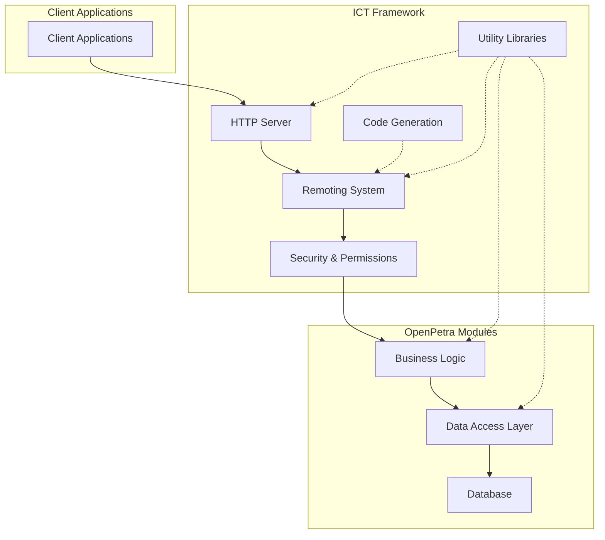
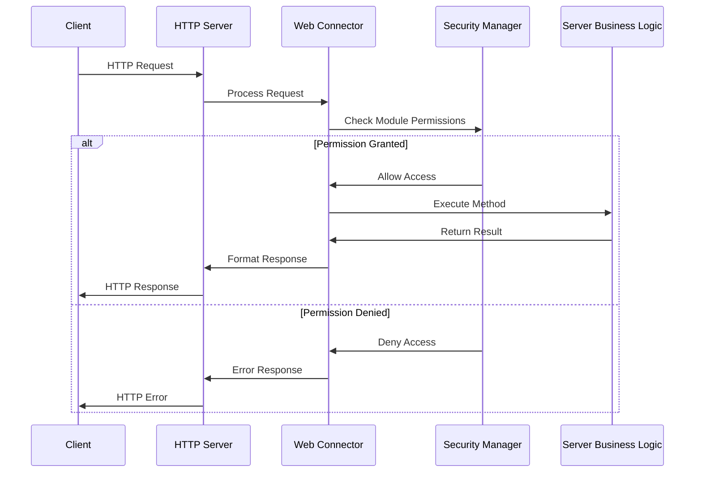
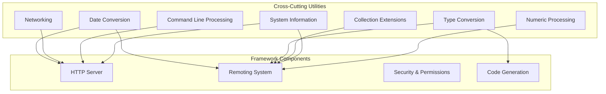
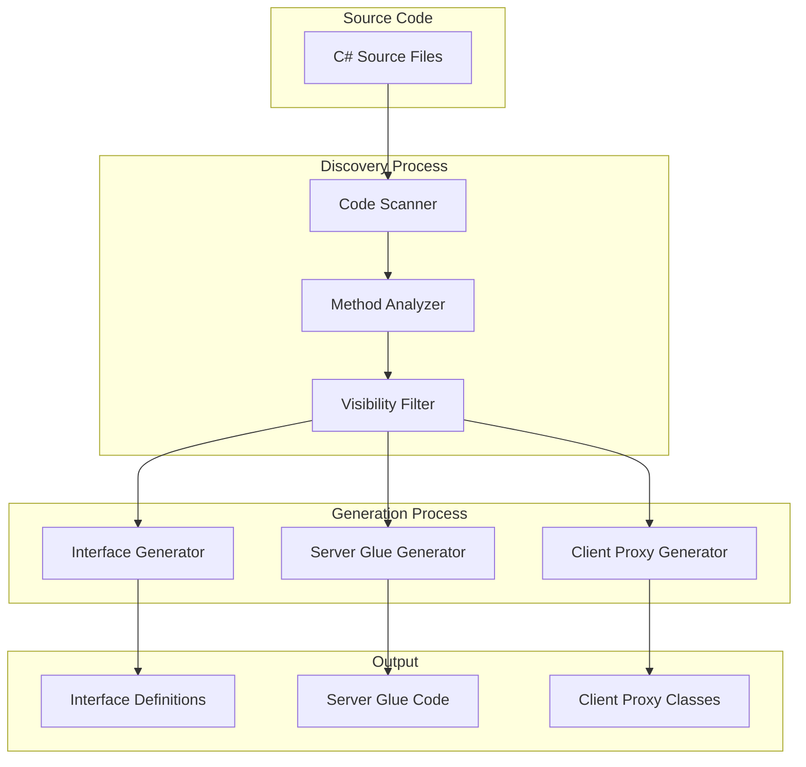

# ICT Framework: The Foundation of OpenPetra's Server Architecture

## Introduction to the ICT Framework

The ICT Framework serves as the foundational server-side architecture for OpenPetra, a free and open-source software system designed for non-profit organizations. This framework provides the essential infrastructure that enables client-server communication, data processing, and application functionality across the distributed OpenPetra system. 

The ICT Framework is a comprehensive collection of libraries, utilities, and components that work together to provide a robust platform for building and deploying enterprise-level applications. It handles critical aspects such as remote procedure calls, web service hosting, security validation, and cross-cutting concerns like logging, configuration, and type conversion. By abstracting these common functionalities, the framework allows application developers to focus on implementing business logic rather than dealing with infrastructure concerns.

As the backbone of OpenPetra's server architecture, the ICT Framework is designed with modularity, extensibility, and performance in mind, enabling the system to scale from small standalone installations to large distributed environments serving multiple concurrent users.

## Core Components and Structure

The ICT Framework consists of several key components that work together to provide a comprehensive server-side architecture:

1. **Remoting System**: The framework implements a sophisticated remoting mechanism that enables client applications to invoke methods on server objects. This is built around connector classes that expose functionality to remote clients through well-defined interfaces.

2. **HTTP Server**: A lightweight but powerful HTTP server implementation handles web requests, processes ASMX web services, and manages concurrent connections through a multi-threaded approach.

3. **Code Generation Tools**: The framework includes tools that automatically generate server-side "glue code" to handle client requests, implement security checks, and manage parameter conversion.

4. **Utility Libraries**: A rich set of utility classes provide essential functionality across the framework, including date conversion, networking, command-line processing, and type handling.

5. **Security Infrastructure**: The framework implements a comprehensive security model that ensures clients can only access authorized functionality through module permission checks.

6. **Cross-Cutting Concerns**: Components that address concerns like logging, error handling, and configuration management are integrated throughout the framework.

The structure of the ICT Framework follows a layered architecture, with lower-level utilities and infrastructure components supporting higher-level application services and business logic.

## HTTP Server Implementation

The ICT Framework includes a lightweight but powerful HTTP server implementation that handles web requests, processes ASMX services, and manages concurrent connections. This server component is implemented in the `ThreadedHttpListenerWrapper` and `TMyHttpWorkerRequest` classes, which together provide a robust foundation for serving web content and processing client requests.

The HTTP server is designed with the following key features:

1. **Multi-threaded Request Processing**: The server creates a new thread for each incoming HTTP request, allowing it to handle multiple concurrent connections efficiently. This approach ensures that slow or complex requests don't block the processing of other requests.

2. **ASP.NET Integration**: By extending the `HttpWorkerRequest` class, the server integrates with the ASP.NET runtime, enabling it to process both standard web pages and ASMX web services. This integration allows OpenPetra to leverage the rich functionality of ASP.NET without requiring a full IIS installation.

3. **Virtual Path Mapping**: The server implements sophisticated path translation logic that converts between virtual and physical paths, ensuring proper file handling and resource location regardless of the deployment environment.

4. **Configurable Endpoints**: The server can be configured to listen on multiple prefixes (combinations of protocol, hostname, port, and path), providing flexibility in deployment scenarios.

5. **Request and Response Handling**: Comprehensive support for HTTP headers, query strings, form data, and other HTTP protocol elements ensures compatibility with standard web clients and browsers.

The HTTP server component serves as the entry point for client requests into the OpenPetra system, handling the initial processing before passing requests to the appropriate handlers within the remoting system.

## Remoting and Connector System

The ICT Framework implements a sophisticated remoting system that enables client applications to securely access server functionality through well-defined interfaces. This system is built around the concept of "connectors" - specialized classes that expose server-side functionality to remote clients.

The remoting system consists of several key components:

1. **Connector Classes**: These server-side classes implement the business logic and are identified by their namespace ending with "Connectors". They expose methods that can be called remotely by clients.

2. **Interface Generation**: The framework automatically generates interface definitions for connector classes, creating a contract between client and server components.

3. **Server Glue Code**: Generated code handles the communication between client requests and server implementations, including parameter conversion, security checks, and error handling.

4. **Web Service Endpoints**: The remoting system exposes functionality through web service endpoints, allowing clients to invoke methods using standard HTTP protocols.

5. **Binary Serialization**: Complex data types are serialized and deserialized using a binary format, enabling efficient transfer of structured data between client and server.

The remoting system is designed to be transparent to application developers, allowing them to focus on implementing business logic rather than dealing with the complexities of distributed computing.

## Code Generation for Server Glue

The ICT Framework employs a sophisticated code generation system to create the "glue code" that connects client requests to server implementations. This approach reduces boilerplate code, ensures consistency in handling requests, and enforces security policies across the application.

The code generation process is primarily implemented in the `GenerateServerGlue` class, which analyzes connector classes and generates the necessary server-side code to handle client requests. Key aspects of this process include:

1. **Connector Discovery**: The system scans C# source files to identify connector classes (those in namespaces ending with "Connectors") and extracts their method definitions.

2. **Security Integration**: For each method, the code generator adds appropriate security checks based on attributes like `RequireModulePermission` and `CheckServerAdminToken`, ensuring that clients can only access authorized functionality.

3. **Parameter Handling**: The generated code includes logic to convert between the wire format (used for transmission) and the native format (used by the server implementation), handling complex types, arrays, and reference parameters.

4. **Error Handling**: The generated code includes appropriate error handling to ensure that exceptions are properly caught and reported back to clients.

5. **Type Conversion**: Special handling is provided for various data types, including dates, decimals, enumerations, and binary data, ensuring proper conversion between client and server representations.

The code generation approach offers several advantages:

- **Consistency**: All remote method calls are handled in a consistent manner.
- **Security**: Security checks are automatically applied to all exposed methods.
- **Maintainability**: Changes to the remoting infrastructure can be applied uniformly by regenerating the glue code.
- **Performance**: The generated code is optimized for the specific requirements of each method.

This automated approach significantly reduces the amount of manual coding required to implement the server-side of the distributed application.

## Cross-Cutting Utilities

The ICT Framework includes a comprehensive set of utility classes that provide essential functionality across the framework. These utilities address common concerns and requirements, ensuring consistency and reducing code duplication throughout the system.

Key utility components include:

1. **Date and Time Handling**: Classes like `TDate` and `TSaveConvert` provide robust date parsing, formatting, and conversion capabilities, handling various date formats, null values, and culture-specific representations.

2. **Networking Utilities**: The `Networking` class offers methods for determining network configuration, retrieving host names and IP addresses, and managing network-related settings.

3. **Command Line Processing**: The `TCmdOpts` class implements a flexible command-line parameter processing system, supporting various parameter formats and providing easy access to parameter values.

4. **Type Conversion**: Utilities for converting between different data types, handling null values, and ensuring type safety across the application.

5. **Collection Extensions**: Classes like `TSelfExpandingArrayList` extend standard collection types with additional functionality specific to the needs of the OpenPetra system.

6. **System Information**: The `Utilities` class provides methods for determining the operating system, runtime environment, and other system characteristics, enabling platform-specific behavior when needed.

7. **Numeric Processing**: Utilities for handling numeric formats, parsing, and conversion, ensuring consistent behavior across the application.

These utility classes form a foundation upon which the higher-level components of the ICT Framework are built, providing essential functionality that is used throughout the system.

## Connector Discovery and Generation Process

The ICT Framework employs a sophisticated process for discovering connector classes and generating the necessary interfaces and implementation code for remote access. This process is central to the framework's ability to expose server-side functionality to client applications in a secure and efficient manner.

The connector discovery and generation process involves several key steps:

1. **Scanning Source Code**: The system scans C# source files to identify connector classes, which are recognized by their namespace ending with "Connectors".

2. **Method Analysis**: For each connector class, the system analyzes its methods to determine which ones should be exposed for remote access, excluding those marked with the `NoRemoting` attribute or those that are not public.

3. **Interface Generation**: The system generates interface definitions that represent the contract between client and server components, ensuring type safety and enabling strong typing in client applications.

4. **Server Glue Generation**: For each connector method, the system generates server-side code that handles client requests, performs security checks, converts parameters, and invokes the actual implementation.

5. **Client Proxy Generation**: The system generates client-side proxy classes that provide a seamless interface for invoking remote methods, hiding the complexities of the remoting infrastructure.

This automated process ensures consistency between client and server components, reduces the potential for errors, and simplifies the development of distributed applications.

## Security and Permission Management

The ICT Framework implements a comprehensive security system through module permission checks, ensuring that clients can only access authorized functionality. This security model is deeply integrated into the remoting infrastructure, providing a consistent and robust approach to access control.

Key aspects of the security and permission management system include:

1. **Module-Based Permissions**: Access control is organized around modules, with each module representing a distinct functional area of the application. Users are granted permissions to specific modules based on their roles and responsibilities.

2. **Attribute-Based Security**: Security requirements are specified using attributes like `RequireModulePermission` and `CheckServerAdminToken`, which are applied to connector methods. These attributes declare the permissions required to invoke the method.

3. **Automatic Security Checks**: The code generation system automatically inserts security checks into the server glue code, ensuring that all remote method calls are properly validated before execution.

4. **Ledger-Specific Permissions**: For financial operations, the security system supports ledger-specific permissions, allowing fine-grained control over access to financial data.

5. **Server Admin Token**: Special administrative functions are protected by a server admin token, providing an additional layer of security for sensitive operations.

The security system is designed to be both robust and flexible, providing strong protection against unauthorized access while allowing administrators to configure permissions based on the specific needs of their organization.

## Extensibility and Plugin Support

The ICT Framework is designed with extensibility in mind, allowing additional modules to be integrated into the OpenPetra system through a plugin architecture. This approach enables the system to be customized and extended without modifying the core codebase, providing a flexible foundation for meeting diverse organizational needs.

Key aspects of the framework's extensibility and plugin support include:

1. **Plugin Directory Structure**: The framework supports a standardized directory structure for plugins, allowing them to be easily identified and loaded at runtime.

2. **Dynamic Connector Discovery**: The connector discovery process can locate connector classes in plugin directories, enabling plugins to expose functionality through the same remoting mechanism used by core modules.

3. **Code Generation for Plugins**: The code generation system supports generating server glue code for plugin connectors, ensuring consistent handling of remote method calls.

4. **Namespace Integration**: Plugins can define their own namespaces while still integrating with the core OpenPetra namespaces, providing a clean separation of concerns.

5. **Configuration Integration**: Plugins can provide their own configuration settings, which are integrated into the overall application configuration system.

This extensibility architecture allows OpenPetra to be adapted to specific organizational requirements without compromising the integrity and maintainability of the core system. Organizations can develop custom plugins to implement specialized functionality, integrate with external systems, or modify existing behavior to meet their unique needs.

The ICT Framework's plugin support exemplifies its design philosophy of providing a robust foundation while enabling flexibility and customization, making OpenPetra a versatile solution for a wide range of non-profit organizations.

[Generated by the Sage AI expert workbench: 2025-03-30 02:22:57  https://sage-tech.ai/workbench]: #