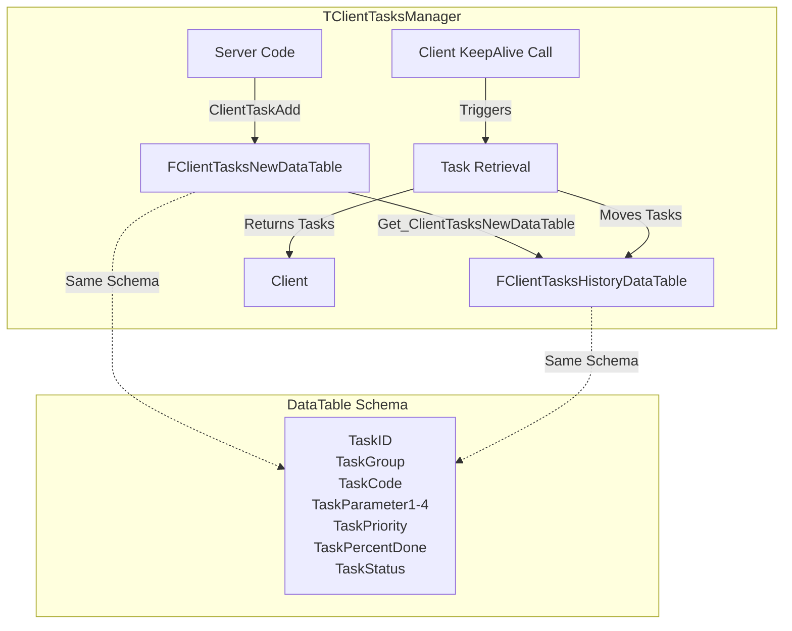
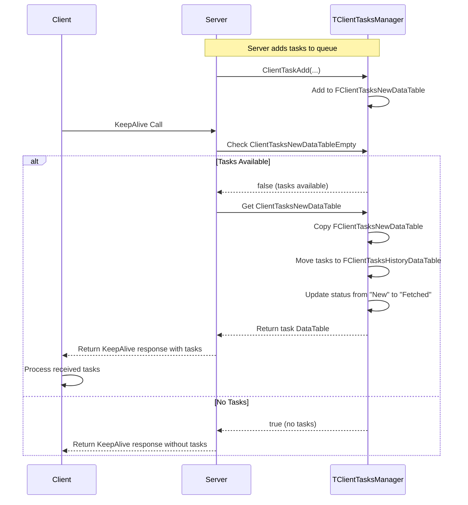
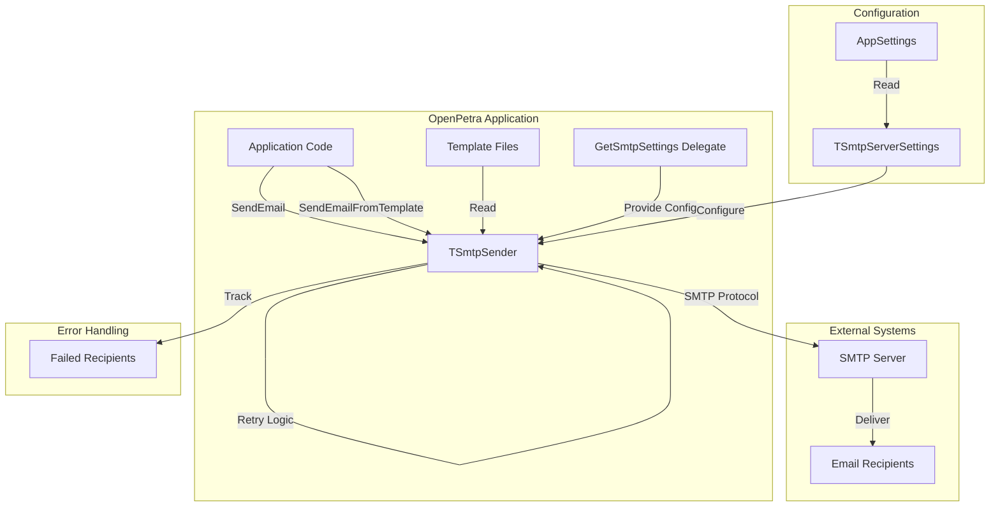
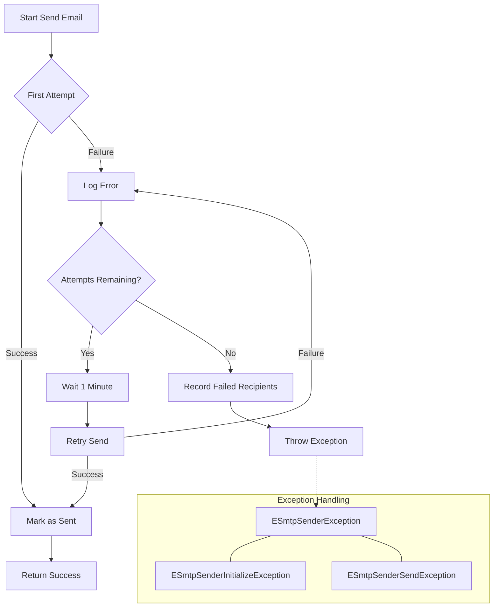

# OpenPetra's Pub/Sub Messaging System

## Introduction to OpenPetra's Pub/Sub Messaging System

OpenPetra implements a robust server-to-client messaging architecture based on the publish/subscribe pattern. This pattern allows the server to publish messages (tasks) that are later consumed by clients when they are ready to process them. The architecture decouples the message producers from consumers, enabling asynchronous communication between the server and multiple clients. This approach is particularly valuable in a distributed system like OpenPetra, where clients may connect and disconnect at various times, yet still need to receive important notifications, updates, or commands from the server.

The system is designed to queue messages on the server side until clients actively request them, typically during periodic "KeepAlive" calls. This ensures that messages are not lost even if clients are temporarily disconnected or busy processing other tasks. The implementation also includes a history tracking mechanism that maintains a record of delivered messages, which can be useful for auditing, debugging, or implementing more complex workflow scenarios.

## The ClientTasksManager Implementation

The `TClientTasksManager` class is the core component of OpenPetra's server-to-client messaging system. It manages the lifecycle of tasks (messages) from creation through delivery to clients and subsequent archival. The class maintains two primary data structures:

1. `FClientTasksNewDataTable` - A DataTable that holds newly created tasks waiting to be sent to clients
2. `FClientTasksHistoryDataTable` - A DataTable that archives tasks after they have been fetched by clients

Both tables share an identical schema, with columns including:
- `TaskID` - A unique auto-incrementing identifier for each task
- `TaskGroup` - Categorizes tasks (e.g., "USERMESSAGE", "CACHEREFRESH")
- `TaskCode` - Specifies the action or message content
- `TaskParameter1` through `TaskParameter4` - Optional parameters for additional context
- `TaskPriority` - Indicates the importance of the task
- `TaskPercentDone` - Tracks completion progress
- `TaskStatus` - Indicates the current state of the task (e.g., "New", "Fetched")

The class provides methods to add new tasks (`ClientTaskAdd`), check task status (`ClientTaskStatus`), and retrieve pending tasks for client processing (`Get_ClientTasksNewDataTable`). It's worth noting that the implementation is currently marked as not thread-safe, with a TODO comment indicating this as a future enhancement area.

The `ClientTaskAdd` method includes debugging code that detects when tasks are added unusually close together (configurable via the `Server.DEBUG.ClientTasks_UnusuallyFewSeconds` setting), which helps identify potential issues like message flooding or duplicate submissions.

## ClientTasksManager Architecture

The diagram illustrates the dual DataTable structure of the ClientTasksManager. When server code needs to send a message to a client, it calls `ClientTaskAdd` which creates a new entry in the `FClientTasksNewDataTable`. When a client makes a KeepAlive call, the `Get_ClientTasksNewDataTable` method is invoked, which returns all pending tasks to the client and simultaneously moves them to the `FClientTasksHistoryDataTable`, updating their status from "New" to "Fetched". Both tables share an identical schema, making the transition seamless. This architecture ensures that tasks are properly queued, delivered, and archived, providing a reliable messaging system between server and clients.

## Task Lifecycle and Status Management

Tasks in OpenPetra's messaging system follow a well-defined lifecycle, managed through status transitions and table movements. The lifecycle begins when a server component needs to communicate with a client and calls the `ClientTaskAdd` method. This method creates a new task entry in the `FClientTasksNewDataTable` with an initial status of "New". Each task is assigned a unique auto-incrementing TaskID and populated with the provided parameters.

The task remains in the "New" state within the `FClientTasksNewDataTable` until a client makes a KeepAlive call. During this call, the server checks if there are any pending tasks for the client by examining the `ClientTasksNewDataTableEmpty` property. If tasks exist, they are retrieved via the `ClientTasksNewDataTable` property, which internally calls `Get_ClientTasksNewDataTable()`.

This retrieval process is a critical transition point in the task lifecycle. The method creates a copy of the `FClientTasksNewDataTable` to return to the client, but it also moves all task entries to the `FClientTasksHistoryDataTable` and updates their status from "New" to "Fetched". This status change marks the task as delivered to the client, though it doesn't necessarily mean the client has processed it yet.

The `ClientTaskStatus` method allows checking the current status of any task by its TaskID, searching first in the new tasks table and then in the history table if not found. This provides visibility into the task's progression through its lifecycle.

While the current implementation doesn't explicitly track task completion beyond the "Fetched" state, the architecture supports extending the status tracking to include states like "Processing", "Completed", or "Failed" if needed for more complex workflow scenarios. The `TaskPercentDone` field also provides a mechanism for tracking progress on long-running tasks.

## Client Task Retrieval Mechanism

The client task retrieval mechanism in OpenPetra is elegantly integrated with the client's regular "KeepAlive" communication pattern. KeepAlive calls serve a dual purpose: they inform the server that a client is still active, and they provide an opportunity for the server to deliver any pending tasks to the client.

When a client makes a KeepAlive call to the server, the following sequence occurs:

1. The server first checks the `ClientTasksNewDataTableEmpty` property to determine if there are any pending tasks for the client.
2. If tasks exist, the server retrieves them via the `ClientTasksNewDataTable` property, which internally calls `Get_ClientTasksNewDataTable()`.
3. The `Get_ClientTasksNewDataTable()` method creates a copy of the `FClientTasksNewDataTable` to return to the client.
4. It then moves all task entries from `FClientTasksNewDataTable` to `FClientTasksHistoryDataTable` and updates their status from "New" to "Fetched".
5. The DataTable containing the pending tasks is returned to the client as part of the KeepAlive response.

This approach has several advantages:
- It eliminates the need for separate polling mechanisms for task retrieval
- It ensures tasks are delivered as soon as possible after they are created
- It maintains a clean separation between task creation and delivery
- It provides a natural archiving mechanism for delivered tasks

The client, upon receiving tasks in the KeepAlive response, can process them according to their TaskGroup and TaskCode. For example, tasks with a TaskGroup of "CACHEREFRESH" might trigger the client to refresh specific data caches, while tasks with a TaskGroup of "USERMESSAGE" might display notifications to the user.

It's worth noting that the current implementation is marked as not thread-safe, which could be a concern in high-concurrency scenarios. A TODO comment in the code indicates that making the process thread-safe is planned for future development.

## Task Retrieval Sequence

This sequence diagram illustrates the interaction between client and server during task retrieval via KeepAlive calls. The process begins with the server adding tasks to the queue using the `ClientTaskAdd` method. When a client makes a KeepAlive call, the server checks if there are any pending tasks. If tasks exist, the server retrieves them, moves them to the history table, updates their status, and returns them to the client as part of the KeepAlive response. The client then processes the received tasks. If no tasks are available, the server simply returns a standard KeepAlive response without any tasks.

## Email as a Pub/Sub Channel

In addition to its internal messaging system, OpenPetra implements email functionality as another pub/sub messaging channel. This extends the messaging capabilities beyond the application's boundaries, allowing communication with external systems and users who may not have direct access to the OpenPetra client.

The email subsystem, implemented primarily through the `TSmtpSender` class, follows a similar publish/subscribe pattern where OpenPetra acts as the publisher of messages, and email recipients are the subscribers. Unlike the internal messaging system where clients actively poll for messages, the email system pushes messages directly to recipients through external SMTP servers.

Key features of the email pub/sub channel include:

1. **Flexible Addressing**: Support for multiple recipients, CC, BCC, and reply-to addresses, allowing targeted distribution of messages.

2. **Template-Based Messaging**: The `SendEmailFromTemplate` method enables sending emails based on language-specific templates with parameter substitution, making it easy to generate standardized yet personalized communications.

3. **Conditional Content**: The template system supports conditional sections using `{ifdef var}...{endif var}` syntax, allowing dynamic content inclusion based on parameter availability.

4. **Attachment Support**: The ability to include file attachments with emails, extending the types of information that can be shared.

5. **Error Handling and Retry Logic**: Built-in mechanisms to track failed deliveries and retry sending with configurable delays, ensuring message delivery reliability.

The email system integrates with the overall application architecture through a delegate pattern (`TGetSmtpSettings`), which allows it to be used from both client and server contexts without needing to know the specifics of how SMTP configurations are retrieved.

## Email Messaging Architecture

The diagram illustrates how the `TSmtpSender` integrates with OpenPetra's overall messaging architecture. Application code can send emails either directly through the `SendEmail` method or using templates via `SendEmailFromTemplate`. The `TSmtpSender` reads configuration from `TSmtpServerSettings`, which is provided by the `GetSmtpSettings` delegate. This allows the same code to work in both client and server contexts. For template-based emails, the system reads template files from the configured location. The `TSmtpSender` communicates with external SMTP servers using the SMTP protocol to deliver messages to recipients. The system includes robust error handling, tracking failed recipients and implementing retry logic for failed deliveries. This architecture provides a flexible and reliable way to extend OpenPetra's messaging capabilities to external users and systems.

## SMTP Configuration and Connection Management

OpenPetra's email subsystem implements a sophisticated approach to SMTP server configuration and connection management, ensuring reliable email delivery across various deployment scenarios. The system is designed to abstract the complexities of SMTP communication while providing the flexibility needed for different environments.

At the core of the configuration system is the `TSmtpServerSettings` struct, which encapsulates all necessary SMTP connection parameters:
- `SmtpHost` - The hostname or IP address of the SMTP server
- `SmtpPort` - The port number for SMTP communication (typically 25, 465, or 587)
- `SmtpEnableSsl` - Flag indicating whether SSL/TLS encryption should be used
- `SmtpUsername` - Authentication username for the SMTP server
- `SmtpPassword` - Authentication password (with support for SecureString in some configurations)
- `SmtpIgnoreServerCertificateValidation` - Option to bypass certificate validation for self-signed certificates

To accommodate both client and server contexts, OpenPetra uses a delegate pattern through `TGetSmtpSettings`. This delegate is assigned during application initialization and provides the appropriate configuration retrieval mechanism depending on the context. The static `GetSmtpSettingsFromAppSettings` method serves as a common implementation that reads settings from the application configuration.

Connection management is handled within the `TSmtpSender` class, which establishes an SMTP connection during initialization and maintains it for subsequent email sending operations. The class implements `IDisposable` to ensure proper cleanup of resources when they are no longer needed.

For SSL/TLS connections, the system includes special handling for certificate validation issues, which can be particularly important when working with self-signed certificates or in environments with complex certificate chains. The `SmtpIgnoreServerCertificateValidation` option allows bypassing certificate validation when necessary, with a comment noting its usefulness for services like Office 365 where obtaining the public key for SSL certificate validation can be challenging.

The code also includes comprehensive error handling for connection issues, with specific exception types (`ESmtpSenderInitializeException`) that distinguish between server configuration problems and client-provided data errors. This helps in providing appropriate error messages to users or administrators.

## Email Template System

OpenPetra's email template system provides a powerful mechanism for creating standardized yet customizable email communications. This system supports multiple languages and parameter substitution, making it ideal for internationalized applications that need to send consistent messages across different locales.

The template system is implemented primarily through the `SendEmailFromTemplate` method in the `TSmtpSender` class. Templates are stored as text files with a specific naming convention: `[template]_[language].txt`, where `[template]` is a template identifier and `[language]` is a language code (e.g., "en" for English). The system first attempts to load a template matching the exact language specified, then falls back to the base language (before the hyphen in language codes like "en-US"), and finally to English if no matching template is found.

Each template file follows a simple structure:
- The first line contains the email subject
- All subsequent lines form the email body

The template system supports parameter substitution using a `{parameter}` syntax. When sending an email, a dictionary of parameter names and values is provided, and each occurrence of `{parameter}` in the template is replaced with the corresponding value.

Additionally, the system supports conditional content through an `{ifdef parameter}...{endif parameter}` syntax. Content between these markers is only included in the final email if the parameter exists in the provided dictionary. This allows for dynamic content inclusion based on available data.

The template path is configurable through the `EMailTemplates.Path` application setting, providing flexibility in template organization and storage.

Error handling in the template system includes checks for missing templates, malformed conditional blocks, and other potential issues. Detailed error messages help diagnose problems during development and deployment.

This template-based approach offers several advantages:
- Separation of content from code, making it easier to update message text without code changes
- Support for internationalization without duplicating code
- Consistent messaging across the application
- Ability to personalize messages with dynamic content

## Error Handling and Retry Mechanisms

OpenPetra's messaging systems implement comprehensive error handling and retry mechanisms to ensure reliable message delivery even in the face of transient network issues or server problems. These mechanisms are particularly important for the email subsystem, which interacts with external services that may have varying levels of reliability.

The `TSmtpSender` class includes a sophisticated retry logic for sending emails. When an attempt to send an email fails, the system will retry up to three times with a one-minute delay between attempts. This approach helps overcome temporary network glitches or brief SMTP server outages. The retry logic is implemented in the `SendMessage` method, which catches exceptions, logs them, and initiates retries if attempts remain.

For tracking failed deliveries, the `TSmtpSender` maintains a list of `TsmtpFailedRecipient` objects. Each object contains the failed email address and an associated error message. This list is accessible through the `FailedRecipients` property, allowing calling code to inform users about specific delivery failures and potentially take corrective action.

The system distinguishes between different types of failures through specialized exception classes:
- `ESmtpSenderException` - Base class for all SMTP-related exceptions
- `ESmtpSenderInitializeException` - Thrown when initialization fails, such as due to invalid configuration
- `ESmtpSenderSendException` - Thrown when message sending fails

These exceptions include a `TSmtpErrorClassEnum` that indicates whether the error originated from server configuration (`secServer`) or client-provided data (`secClient`). This helps in providing appropriate error messages to users or administrators.

For SMTP server errors, the system captures detailed information from `SmtpCommandException` and `SmtpProtocolException` instances, which can include specific error codes and descriptions from the SMTP server. This information is logged and can be used for troubleshooting.

The internal messaging system between server and clients doesn't currently implement explicit retry mechanisms, as it relies on the periodic KeepAlive calls from clients to retrieve messages. However, since tasks remain in the `FClientTasksNewDataTable` until successfully fetched, they are naturally retried on subsequent KeepAlive calls if a previous attempt failed.

## Retry Logic Flow

This flowchart illustrates the decision process and timing for retry attempts when email delivery fails. The process begins with an initial attempt to send the email. If successful, the email is marked as sent and the process completes successfully. If the attempt fails, the system logs the error and checks if retry attempts remain. With each failure, the system waits for one minute before retrying, up to a maximum of three total attempts. If all attempts fail, the system records the failed recipients and throws an appropriate exception. The exception hierarchy includes specialized types for different failure scenarios, helping calling code handle errors appropriately. This retry logic ensures that transient issues don't prevent message delivery while still allowing the application to handle permanent failures gracefully.

[Generated by the Sage AI expert workbench: 2025-03-30 02:22:57  https://sage-tech.ai/workbench]: #