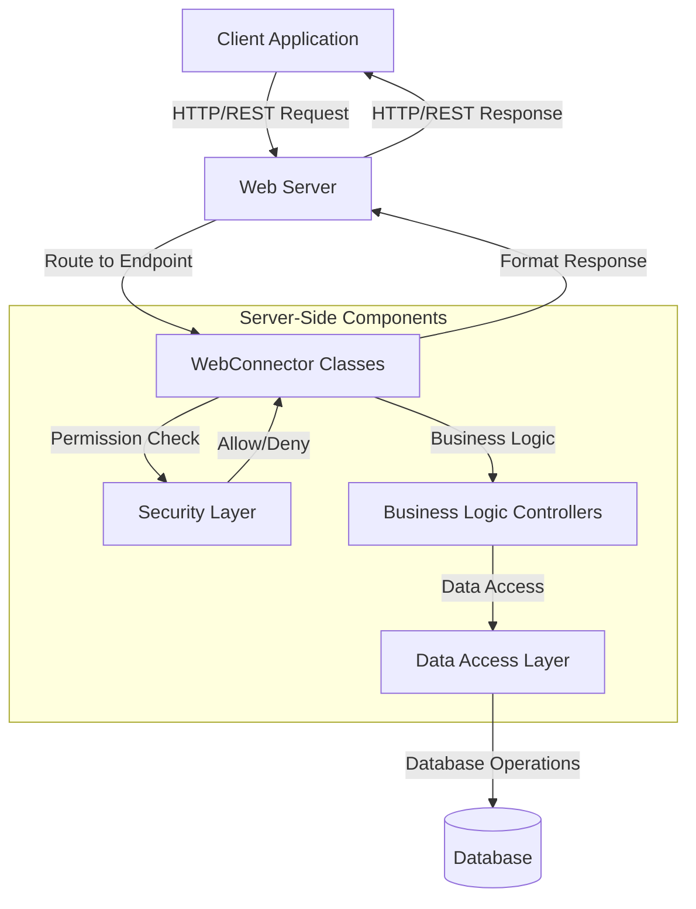
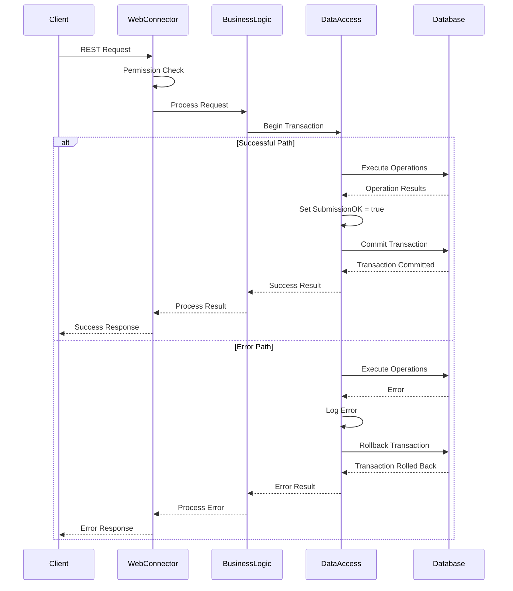

# OpenPetra's Server-Side REST Architecture

## Introduction to OpenPetra's Server-Side REST Architecture

OpenPetra implements a comprehensive server-side architecture that exposes functionality through REST services using WebConnector classes and permission-based security. The system is designed as a multi-tier application where the server-side components handle business logic, data access, and security, while exposing well-defined interfaces for client applications to consume.

The architecture follows a consistent pattern across different modules (Finance, Partner, Personnel, etc.) where WebConnector classes serve as the entry points for client requests. These classes implement methods decorated with permission attributes that enforce security checks before allowing access to functionality. The server uses transactions to ensure data integrity and implements various patterns for optimizing network traffic, handling errors, and managing asynchronous operations.

## WebConnector Architecture Overview



The WebConnector classes serve as the bridge between client requests and server-side business logic. They handle the translation of REST requests into internal method calls, enforce security through permission attributes, manage transactions, and format responses for clients. This architecture provides a clean separation of concerns while ensuring that all client-server communication follows consistent patterns for security, error handling, and data transfer.

## Security and Permission Management

OpenPetra implements a robust permission-based security model using the `RequireModulePermission` attribute to control access to REST endpoints. This attribute is applied to methods in WebConnector classes and enforces that the authenticated user has the necessary permissions to access the functionality.

The permission system is modular, with permissions grouped by functional areas such as "FINANCE-1", "PTNRUSER", "PERSONNEL", etc. Each permission represents a specific level of access to a module or submodule. For example, "FINANCE-1" might grant read access to financial data, while "FINANCE-3" might grant write access.

The security layer intercepts all calls to WebConnector methods and checks the current user's permissions against the required permissions specified in the attribute. If the user lacks the necessary permissions, the request is denied before any business logic is executed.

Some methods require multiple permissions, which can be combined using logical operators. For example:

```csharp
[RequireModulePermission("AND(PERSONNEL,PTNRUSER)")]
```

This requires the user to have both PERSONNEL and PTNRUSER permissions to access the method.

The security model also supports different permission levels for different operations within the same module. For example, viewing partner data might require "PTNRUSER" permission, while modifying it might require "PTNRADMIN" permission.

## Transaction Management Pattern

OpenPetra employs a consistent transaction management pattern throughout its REST services to ensure data integrity during client-server operations. This pattern is characterized by explicit transaction handling with proper isolation levels, error handling with rollback capabilities, and a delegate-based approach to encapsulate database operations.

The typical transaction flow in OpenPetra's REST services follows these steps:

1. Begin a database transaction with an appropriate isolation level
2. Execute the required database operations within a delegate
3. If all operations succeed, commit the transaction
4. If any operation fails, roll back the transaction and return an error response

Here's how this pattern is typically implemented:

```csharp
TDBTransaction Transaction = new TDBTransaction();
bool SubmissionOK = false;

DBAccess.WriteTransaction(
    ref Transaction,
    ref SubmissionOK,
    delegate
    {
        try
        {
            // Perform database operations
            // ...
            
            // If all operations succeed, set SubmissionOK to true
            SubmissionOK = true;
        }
        catch (Exception ex)
        {
            // Log the exception
            TLogging.Log("An exception occurred: " + ex.ToString());
            
            // Transaction will be automatically rolled back
            // because SubmissionOK remains false
        }
    });

// Transaction is automatically committed if SubmissionOK is true
// Otherwise, it's rolled back
```

For read-only operations, a similar pattern is used with `ReadTransaction` instead of `WriteTransaction`.

This pattern ensures that database operations are atomic, consistent, isolated, and durable (ACID). It prevents partial updates that could leave the database in an inconsistent state and provides clear error handling for client applications.

## Transaction Flow in REST Services



This diagram illustrates the flow of a typical database transaction in OpenPetra's REST services, showing both the successful path and the error handling path with rollback capabilities.

## Data Transfer and Pagination

OpenPetra optimizes network traffic through several strategies for data transfer and pagination in its REST responses:

1. **Typed DataSets**: The system uses strongly-typed DataSets (TDS) for transferring data between client and server. These DataSets contain only the necessary tables and columns for the specific operation, reducing the amount of data transferred.

2. **Pagination**: For large result sets, OpenPetra implements pagination to avoid transferring all data at once. This is particularly evident in search operations where results are returned in pages of configurable size.

3. **Selective Data Loading**: The server loads only the required data from the database and removes empty tables before sending responses to clients:
   ```csharp
   // Accept row changes here so that the Client gets 'unmodified' rows
   MainDS.AcceptChanges();
   
   // Remove all Tables that were not filled with data before remoting them.
   MainDS.RemoveEmptyTables();
   ```

4. **Lazy Loading**: Some complex screens implement lazy loading, where additional data is fetched only when needed (e.g., when a user clicks on a specific tab or expands a section).

5. **Progress Tracking**: For long-running operations, the system provides progress tracking through the `TProgressTracker` class, allowing clients to display progress information to users.

6. **Asynchronous Processing**: Time-consuming operations are executed asynchronously in separate threads, with clients able to poll for progress and results.

The pagination pattern is particularly important for search operations and is implemented through classes like `TPagedDataSet` and methods like `GetDataPagedResult()`. This allows clients to request specific pages of data rather than the entire result set, significantly reducing network traffic and improving application responsiveness.

## Module-Specific WebConnectors

OpenPetra organizes its REST services by functional modules, with specialized WebConnector implementations for each area of functionality. Each module has its own set of WebConnector classes that expose the module's functionality through REST endpoints.

The main modules include:

1. **Finance Module**:
   - `TRemittanceWebConnector`: Handles remittance advice and cheque generation
   - `TGiftSetupWebConnector`: Manages gift motivation groups and details
   - `TAdjustmentWebConnector`: Handles gift adjustments and reversals
   - `TFinanceReportingWebConnector`: Provides financial reporting functionality
   - `TBudgetAutoGenerateWebConnector`: Manages budget generation and forecasting

2. **Partner Module**:
   - `TPartnerWebConnector`: Core partner management functionality
   - `TSimplePartnerEditWebConnector`: Partner creation and editing
   - `TSimplePartnerFindWebConnector`: Partner search functionality
   - `TContactsWebConnector`: Contact log management
   - `TExtractMasterWebConnector`: Partner extract management

3. **Personnel Module**:
   - `TPersonnelWebConnector`: Staff data and commitment management
   - `TIndividualDataWebConnector`: Personal information management
   - `TApplicationDataWebConnector`: Application data for personnel

4. **Conference Module**:
   - `TConferenceMasterDataWebConnector`: Conference settings management
   - `TConferenceFindForm`: Conference creation and deletion

5. **System Management**:
   - `TServerAdminWebConnector`: Server administration functionality
   - `TSystemDefaultsConnector`: System defaults management

Each WebConnector class follows similar patterns for permission checking, transaction management, and error handling, but is specialized for its specific domain functionality.

## REST Service Organization by Module

```mermaid
flowchart TB
    Client[Client Application] --> |REST Requests| Server[OpenPetra Server]
    
    Server --> Finance[Finance Module]
    Server --> Partner[Partner Module]
    Server --> Personnel[Personnel Module]
    Server --> Conference[Conference Module]
    Server --> SystemAdmin[System Administration]
    
    Finance --> FinanceGift[Gift Processing]
    Finance --> FinanceAP[Accounts Payable]
    Finance --> FinanceGL[General Ledger]
    Finance --> FinanceBudget[Budget Management]
    Finance --> FinanceReporting[Financial Reporting]
    
    Partner --> PartnerEdit[Partner Editing]
    Partner --> PartnerFind[Partner Search]
    Partner --> PartnerExtract[Partner Extracts]
    Partner --> PartnerContacts[Contact Management]
    Partner --> PartnerReporting[Partner Reporting]
    
    Personnel --> PersonnelStaff[Staff Management]
    Personnel --> PersonnelApps[Applications]
    Personnel --> PersonnelReporting[Personnel Reporting]
    
    Conference --> ConferenceSetup[Conference Setup]
    Conference --> ConferenceVenue[Venue Management]
    
    SystemAdmin --> ServerAdmin[Server Administration]
    SystemAdmin --> UserAdmin[User Management]
    SystemAdmin --> SystemDefaults[System Defaults]
```



This diagram illustrates how REST services are organized by functional modules in OpenPetra's architecture, showing the hierarchical structure of the modules and their subcomponents.

## Asynchronous Processing

OpenPetra implements asynchronous operations for long-running tasks like report generation and data imports through its REST services. This approach prevents client applications from blocking while waiting for time-consuming operations to complete.

The asynchronous processing pattern typically follows these steps:

1. The client initiates a long-running operation through a REST call
2. The server generates a unique identifier for the operation
3. The server starts the operation in a separate thread
4. The client receives the identifier immediately
5. The client can poll the server for progress using the identifier
6. When the operation completes, the client can retrieve the results

This pattern is evident in the report generation process:

```csharp
[RequireModulePermission("USER")]
public static string Start(string AReportID, System.Data.DataTable AParameters)
{
    // Generate a unique identifier
    string session = TSession.GetSessionID();
    string configfilename = TAppSettingsManager.ConfigFileName;

    // Prepare the operation
    TParameterList ParameterList = new TParameterList();
    ParameterList.LoadFromDataTable(AParameters);
    TRptDataCalculator Datacalculator = new TRptDataCalculator(...);

    // Start the operation in a separate thread
    ThreadStart myThreadStart = delegate {
        Run(configfilename, session, AReportID, Datacalculator, ParameterList);
    };
    Thread TheThread = new Thread(myThreadStart);
    TheThread.Start();

    // Return the identifier immediately
    return AReportID;
}
```

The client can then poll for progress:

```csharp
[RequireModulePermission("USER")]
public static TProgressState GetProgress(string AReportID)
{
    return TProgressTracker.GetCurrentState(AReportID);
}
```

This approach is also used for other time-consuming operations like data imports, database backups, and batch processing tasks. It allows the client application to remain responsive while providing feedback to users about the progress of long-running operations.

## Error Handling and Verification

OpenPetra's REST services handle errors and provide verification results back to clients through standardized response structures. The system uses a combination of exception handling, verification collections, and structured responses to ensure that clients receive clear information about any issues that occur during processing.

The primary mechanism for communicating validation errors and business rule violations is the `TVerificationResultCollection` class. This class collects validation results, which can include errors, warnings, and informational messages. Each verification result includes:

- A message for the user
- A technical error code
- A severity level (critical, error, warning, info)
- Additional context information

When a client submits data for processing, the server performs validation and returns any verification results:

```csharp
[RequireModulePermission("FINANCE-1")]
public static bool SomeOperation(SomeParameters parameters, out TVerificationResultCollection AVerificationResult)
{
    AVerificationResult = new TVerificationResultCollection();
    
    // Perform validation
    if (!IsValid(parameters))
    {
        AVerificationResult.Add(new TVerificationResult(
            "error", 
            "Invalid parameters", 
            "error_invalid_parameters", 
            TResultSeverity.Resv_Critical));
        return false;
    }
    
    // Process the operation
    try
    {
        // Business logic
        return true;
    }
    catch (Exception ex)
    {
        AVerificationResult.Add(new TVerificationResult(
            "error", 
            "An error occurred: " + ex.Message, 
            "error_processing", 
            TResultSeverity.Resv_Critical));
        return false;
    }
}
```

For unexpected exceptions, the system includes error logging and provides appropriate error responses to clients without exposing sensitive information:

```csharp
try
{
    // Operation that might fail
}
catch (Exception ex)
{
    TLogging.Log("An exception occurred: " + ex.ToString());
    throw new EOPAppException("Operation failed. Please contact your system administrator.");
}
```

This approach ensures that clients receive clear information about any issues while maintaining security and providing sufficient details for troubleshooting.

## Client-Server Communication Patterns

OpenPetra employs several communication patterns between client applications and server-side REST services:

1. **Request-Response Pattern**: The most common pattern, where clients make a request and wait for a response. This is used for simple operations like retrieving a single record or performing a quick update.

2. **Asynchronous Processing Pattern**: For long-running operations, clients initiate a process and receive an identifier. They then poll for progress and eventually retrieve results when processing is complete.

3. **Batch Processing Pattern**: Clients submit multiple operations as a batch, and the server processes them in a single transaction. This is used for operations like importing data or processing multiple records.

4. **Pagination Pattern**: For large result sets, clients request specific pages of data rather than the entire set. This optimizes network traffic and improves responsiveness.

5. **Type-Ahead Pattern**: For search functionality, clients send partial search terms and receive matching results in real-time as users type.

6. **Notification Pattern**: The server notifies clients of events or changes through polling mechanisms. This is used for progress updates and system notifications.

7. **Caching Pattern**: Frequently accessed data is cached on both client and server sides, with mechanisms to invalidate caches when data changes.

These patterns are implemented through the WebConnector classes, which provide a consistent interface for client applications to interact with server-side functionality. The patterns are chosen based on the specific requirements of each operation, balancing factors like responsiveness, network efficiency, and data integrity.

## Conclusion and Best Practices

OpenPetra's REST service implementation demonstrates several architectural patterns and best practices that contribute to a robust, maintainable, and secure system:

1. **Clear Separation of Concerns**: The architecture separates client interfaces (WebConnectors) from business logic and data access, making the system easier to maintain and extend.

2. **Consistent Security Model**: The use of permission attributes provides a uniform approach to security across all REST endpoints, ensuring that access control is applied consistently.

3. **Transaction Management**: The consistent transaction pattern ensures data integrity while providing clear error handling and rollback capabilities.

4. **Optimized Data Transfer**: Through pagination, selective loading, and typed datasets, the system minimizes network traffic while providing the necessary data to clients.

5. **Asynchronous Processing**: Long-running operations are handled asynchronously with progress tracking, improving user experience and system responsiveness.

6. **Standardized Error Handling**: The verification result collection pattern provides a consistent approach to communicating errors and validation issues to clients.

7. **Module Organization**: Organizing REST services by functional modules improves maintainability and allows for independent development and deployment of different system components.

8. **Type Safety**: The use of strongly-typed datasets and parameters reduces the risk of runtime errors and improves code quality.

9. **Comprehensive Logging**: Detailed logging of operations and errors facilitates troubleshooting and system monitoring.

10. **Progress Tracking**: The implementation of progress tracking for long-running operations improves user experience by providing feedback during processing.

These patterns and practices create a solid foundation for OpenPetra's server-side architecture, enabling the system to handle complex business requirements while maintaining performance, security, and maintainability. The consistent application of these patterns across different modules also reduces the learning curve for developers working on the system and promotes code reuse.

[Generated by the Sage AI expert workbench: 2025-03-30 02:22:57  https://sage-tech.ai/workbench]: #