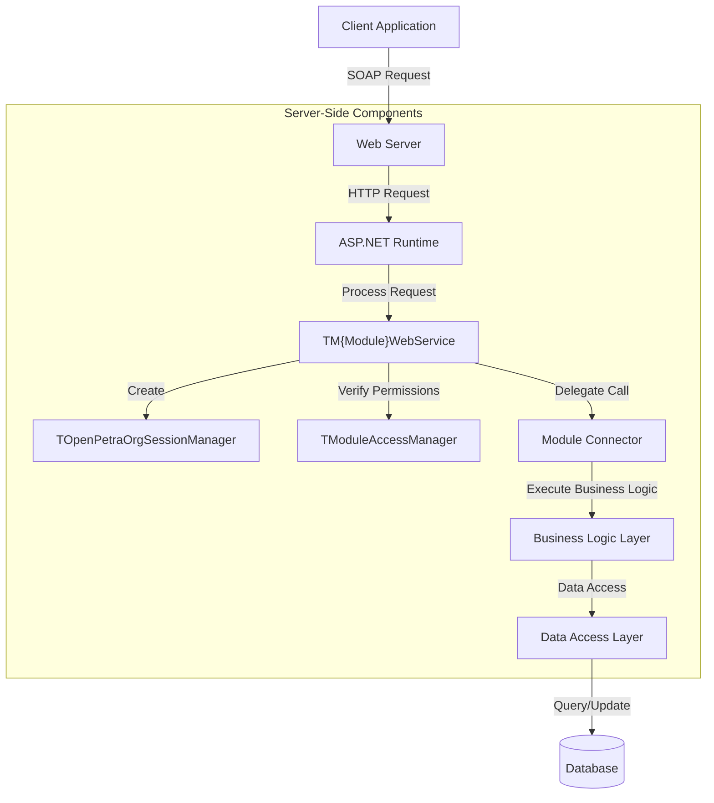
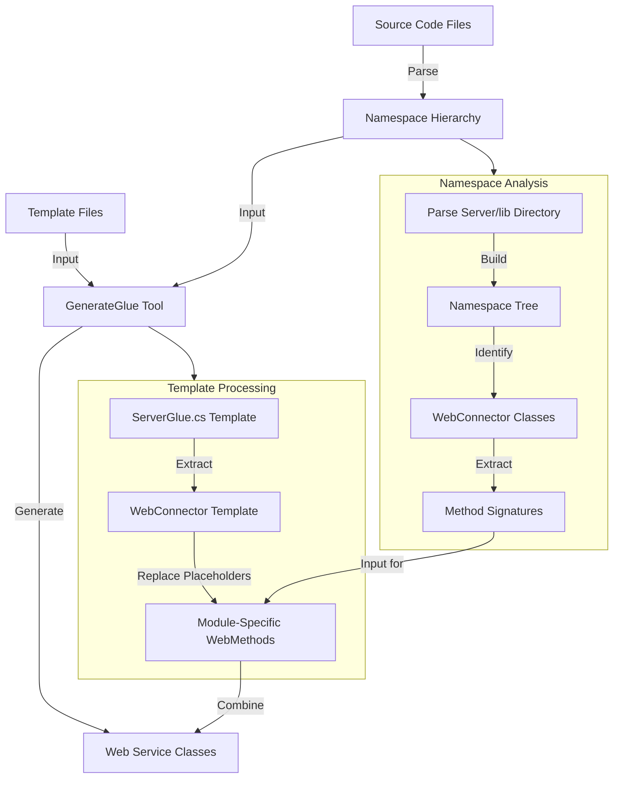
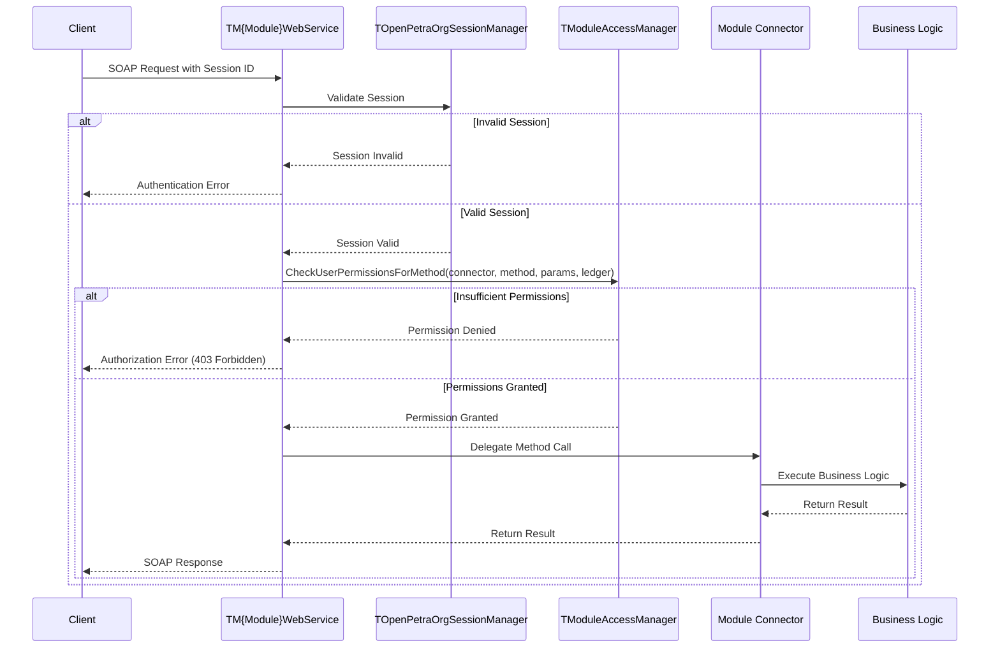
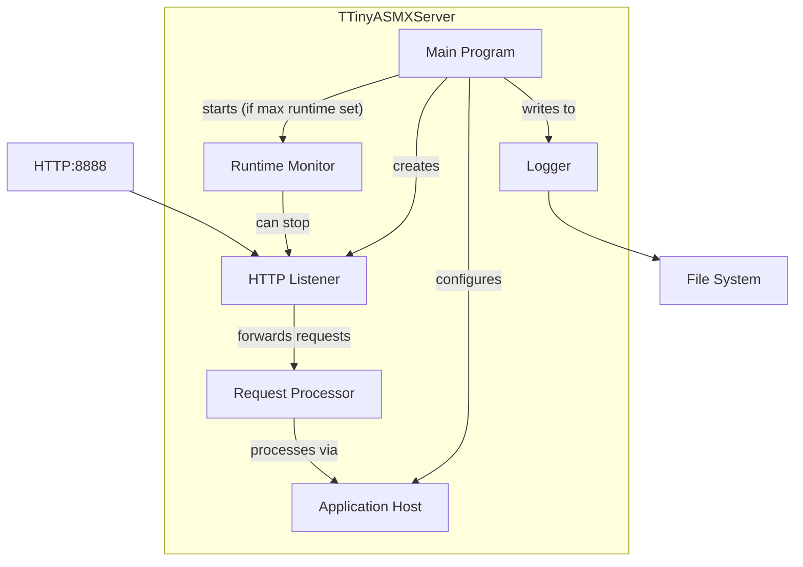

# SOAP Services in OpenPetra

## Introduction to SOAP Services in OpenPetra

OpenPetra leverages SOAP (Simple Object Access Protocol) web services as the foundation of its client-server communication architecture. This standardized protocol enables non-profit organizations to access the system's rich functionality through well-defined web service interfaces, regardless of their technical infrastructure. The SOAP implementation in OpenPetra follows a modular approach, where each functional domain (such as finance, personnel, or donor management) exposes its capabilities through dedicated web service endpoints. This design choice provides a clean separation of concerns while maintaining a consistent interface pattern across the system. By using SOAP, OpenPetra achieves platform independence, allowing clients built on various technologies to interact with the server through XML-based message exchanges. This architecture supports both local network deployments and remote access scenarios, making the system flexible for organizations with diverse operational requirements.

## Architecture of Server-Side SOAP Implementation

OpenPetra's server-side SOAP architecture follows a modular design pattern that aligns with the system's overall organizational structure. Each top-level module (such as Finance, Personnel, or Partner) exposes its functionality through dedicated web service classes prefixed with "TM" followed by the module name (e.g., TMFinanceWebService). These web service classes act as facades that delegate client requests to the appropriate business logic components. The architecture employs a layered approach where the web service layer handles protocol-specific concerns (session management, serialization, error handling), while the business logic layer implements the actual functionality. This separation ensures that business rules remain independent of the communication protocol.

The server-side implementation uses standard .NET WebService and WebMethod attributes to expose methods through SOAP, with additional security mechanisms layered on top. Each web service instance maintains its own session state through the TOpenPetraOrgSessionManager, which is instantiated for each HTTP request. This design allows for stateful interactions while maintaining scalability. The architecture also incorporates cross-cutting concerns such as logging, exception handling, and permission verification through centralized components that are consistently applied across all service endpoints.

## OpenPetra SOAP Service Architecture

The diagram illustrates OpenPetra's SOAP service architecture, showing the flow of requests from client applications through the server components. When a client sends a SOAP request, it's received by the web server and processed by the ASP.NET runtime. The request is then routed to the appropriate module-specific web service class (TM{Module}WebService). 

Upon receiving a request, the web service creates a session manager instance to handle user authentication and session state. Before executing the requested operation, the TModuleAccessManager verifies that the user has appropriate permissions. If authorized, the request is delegated to the corresponding module connector, which interfaces with the business logic layer. The business logic implements the actual functionality, interacting with the data access layer when necessary to retrieve or modify data in the database.

This architecture maintains a clear separation of concerns while providing a standardized approach to handling web service requests across all modules. The modular design allows for independent development and maintenance of different functional areas while ensuring consistent security and session management throughout the system.

## Code Generation for Web Services

OpenPetra employs a sophisticated code generation approach for its web services, significantly reducing manual coding effort while ensuring consistency across the system. The GenerateGlue tool serves as the cornerstone of this process, transforming template files into fully functional SOAP web service implementations. This approach follows the "write once, generate many" philosophy, where the core web service patterns are defined in template files and then specialized for each module through automated code generation.

The process begins with parsing C# source files to build a namespace hierarchy that represents the system's structure. The tool identifies web connector classes and their methods, which form the basis for the generated web services. For each top-level module, the tool generates a corresponding web service class that exposes the module's functionality through SOAP endpoints. The templates contain placeholders (marked with {#PLACEHOLDER} syntax) that are replaced with module-specific code during generation.

This approach offers several advantages: it ensures consistent implementation of cross-cutting concerns like security and error handling, reduces the potential for bugs through standardization, and allows architectural changes to be propagated throughout the system by simply modifying the templates and regenerating the code. The generated code includes proper WebMethod attributes, parameter marshaling, session management, and security checks, all following a consistent pattern while accommodating module-specific requirements.

## Web Service Code Generation Process

The diagram illustrates the web service code generation process in OpenPetra. The process begins with two primary inputs: template files that define the structure of web services and source code files that contain the business logic implementations.

The GenerateGlue tool first parses the source code files to build a comprehensive namespace hierarchy. This analysis identifies WebConnector classes and extracts their method signatures, which will be exposed as web service methods. The tool then processes the ServerGlue.cs template, which contains placeholders for module-specific code.

For each top-level module in the namespace hierarchy, the tool extracts the WebConnector template section and replaces placeholders with module-specific information. This includes generating proper method signatures, parameter definitions, return types, and permission checks. The resulting code is combined into complete web service class implementations that expose the module's functionality through SOAP endpoints.

This automated approach ensures consistency across all web services while allowing for module-specific customization. It also simplifies maintenance, as changes to the web service architecture can be implemented by modifying the templates and regenerating the code rather than manually updating numerous files.

## Session Management in SOAP Services

OpenPetra implements a robust session management system for its SOAP services through the TOpenPetraOrgSessionManager class. This component is instantiated for each HTTP request to the web service, as evidenced by its creation in the constructor of each web service class. The session manager handles user authentication, maintains session state, and provides context for security checks throughout the request lifecycle.

The session management architecture leverages ASP.NET's built-in session state capabilities, indicated by the EnableSession=true attribute on WebMethod declarations. This allows OpenPetra to maintain stateful connections while benefiting from the scalability features of the underlying platform. The session manager associates each authenticated user with a unique session ID, which is used to retrieve user context information such as permissions, preferences, and ledger access rights.

A key aspect of the session management implementation is its handling of concurrent requests and session timeouts. The system employs a session timeout mechanism to release resources for inactive sessions while providing a seamless experience for active users. Additionally, the session manager coordinates with the database connection management system to ensure proper transaction isolation and connection pooling, optimizing resource utilization under varying load conditions.

The session manager also facilitates cross-module operations by maintaining context that spans multiple web service calls. This is particularly important for complex workflows that involve multiple modules, such as financial transactions that affect both the General Ledger and Accounts Receivable systems. By centralizing session management in a dedicated component, OpenPetra ensures consistent behavior across all modules while simplifying the implementation of individual web service methods.

## Security and Permission Management

OpenPetra implements a comprehensive security model for its SOAP services centered around the TModuleAccessManager class. This component serves as the gatekeeper for all web service method calls, verifying that users have appropriate permissions before allowing access to system functionality. The security architecture operates at multiple levels, combining authentication, authorization, and access control to protect sensitive operations and data.

At the authentication level, users must provide valid credentials to establish a session. Once authenticated, the authorization process begins with each web service method call. The generated code includes calls to TModuleAccessManager.CheckUserPermissionsForMethod(), which verifies that the user has permission to execute the requested operation. This method takes several parameters: the connector type, method name, parameter types, and ledger number (when applicable). This granular approach allows permissions to be defined at the method level rather than just the module level, providing fine-grained access control.

The permission system supports both exception-based and result-based security checks. In the exception-based approach, unauthorized access attempts throw exceptions that prevent execution, while the result-based approach returns status codes that can be handled programmatically. The system also includes special handling for administrative operations through the CheckServerAdminToken method, which verifies that the caller possesses the server administrator security token.

OpenPetra's security model is designed to be both robust and flexible, allowing organizations to define permission sets that align with their organizational structure and security requirements. The centralized implementation ensures consistent security enforcement across all modules while allowing for module-specific security rules when necessary.

## SOAP Service Security Flow

The sequence diagram illustrates the security flow during a typical SOAP service call in OpenPetra. When a client sends a SOAP request, it includes a session ID that was previously obtained through authentication. The web service first validates this session through the TOpenPetraOrgSessionManager to ensure the user is properly authenticated.

If the session is invalid or expired, the web service immediately returns an authentication error to the client. For valid sessions, the process continues to the authorization phase, where TModuleAccessManager.CheckUserPermissionsForMethod() verifies that the user has sufficient permissions to execute the requested operation. This check considers the specific connector class, method name, parameter types, and ledger number (when applicable).

If the user lacks the necessary permissions, the web service returns a 403 Forbidden response. Only when both authentication and authorization checks pass does the web service delegate the call to the appropriate connector, which then executes the business logic. The results flow back through the same chain to the client.

This multi-layered security approach ensures that every web service call is properly authenticated and authorized before any business logic is executed, protecting sensitive operations and data from unauthorized access while maintaining a clear audit trail of system usage.

## Error Handling and Logging

OpenPetra's SOAP services implement a sophisticated error handling and logging strategy that balances the need for detailed diagnostics with security considerations. The approach is evident in the generated web service code, where each method is wrapped in a try-catch block that captures all exceptions. This defensive programming technique ensures that unhandled exceptions don't crash the server or expose sensitive implementation details to clients.

When an exception occurs during a web service call, the system logs the complete exception details, including stack traces and inner exceptions, to the server's log file through the TLogging.Log() method. This comprehensive logging provides administrators and developers with the information needed to diagnose and resolve issues. However, to maintain security, the client receives only a generic error message ("Please check server log file") rather than the detailed exception information. This prevents potential attackers from gaining insights into the system's internal workings through error messages.

The error handling architecture distinguishes between different types of errors. Security-related errors, such as authentication failures or insufficient permissions, generate specific error responses with appropriate HTTP status codes (e.g., 403 Forbidden). Business rule violations result in structured error responses that can be interpreted by client applications to provide meaningful feedback to users. System-level exceptions are logged but abstracted before being returned to clients.

This layered approach to error handling allows OpenPetra to maintain robust security while providing the diagnostic information needed for effective system maintenance. The centralized implementation in the generated code ensures consistent error handling across all modules, reducing the risk of security vulnerabilities that might arise from inconsistent error management practices.

## Lightweight ASMX Server Implementation

OpenPetra includes TTinyASMXServer, a lightweight alternative to Mono's XSP server for hosting SOAP services in environments where standard hosting options are unavailable or impractical. This custom implementation provides a minimal but functional HTTP server specifically designed to serve ASMX web services with minimal dependencies and configuration requirements.

TTinyASMXServer creates an HTTP listener on a specified port (defaulting to 8888 if not specified) and configures an ASP.NET application host to process incoming requests. The server supports several command-line parameters, including port number, log file location, and maximum runtime, making it adaptable to various deployment scenarios. A particularly useful feature is the automatic shutdown capability, which allows the server to terminate itself after a specified runtime, facilitating automated testing and controlled service availability.

The implementation handles several practical deployment concerns. It automatically creates the necessary directory structure and copies itself to the appropriate location to ensure proper ASP.NET hosting. When permission issues arise, the server provides clear instructions for configuring URL ACLs, a common challenge when hosting HTTP services on Windows systems. The server also includes comprehensive logging to aid in troubleshooting and monitoring.

TTinyASMXServer demonstrates OpenPetra's pragmatic approach to deployment challenges. Rather than requiring users to install and configure full-featured web servers, this lightweight alternative provides just enough functionality to host the system's SOAP services in constrained environments. This is particularly valuable for development, testing, and small-scale deployments where administrative overhead should be minimized.

## TTinyASMXServer Architecture

TTinyASMXServer implements a lightweight but complete web server architecture specifically designed for hosting ASMX web services. The main program initializes the server components based on command-line parameters, creating an HTTP listener on the specified port (defaulting to 8888).

The server configures an ASP.NET application host using ApplicationHost.CreateApplicationHost(), which provides the necessary environment for processing ASMX requests. This approach leverages the standard ASP.NET processing pipeline without requiring a full IIS or XSP installation. When the HTTP listener receives a request, it forwards it to the request processor, which uses the application host to handle the SOAP message and generate a response.

If a maximum runtime is specified, the server starts a monitoring thread that automatically terminates the server after the specified duration. This feature is particularly useful for automated testing scenarios or controlled service availability. Throughout its operation, the server logs activities and errors to both the console and a configurable log file, providing visibility into its operation.

The architecture includes special handling for permission issues, providing clear instructions for configuring URL ACLs when needed. This practical approach addresses common deployment challenges, making the server accessible to users without extensive system administration experience.

TTinyASMXServer demonstrates how OpenPetra provides pragmatic solutions to deployment challenges, offering a lightweight alternative when standard hosting options are unavailable or impractical.

## Plugin Integration with SOAP Services

OpenPetra's SOAP service framework includes a sophisticated plugin architecture that allows third-party modules to seamlessly integrate with the core system. This extensibility mechanism enables organizations to add custom functionality without modifying the core codebase, ensuring upgrade compatibility while meeting specific organizational requirements.

The plugin integration approach leverages the same code generation tools used for core modules. The GenerateGlueForPlugin method in the GenerateGlue tool parses plugin source directories to identify namespace hierarchies and WebConnector classes, then generates corresponding web service implementations. This ensures that plugins follow the same architectural patterns as core modules, maintaining consistency in areas such as security, session management, and error handling.

Plugins can define their own web service endpoints that are exposed alongside the core system's services. These plugin-provided services benefit from the same infrastructure as core services, including session management through TOpenPetraOrgSessionManager and permission checking through TModuleAccessManager. This integration ensures that plugin functionality adheres to the same security model as the core system, preventing security gaps that might arise from inconsistent implementation.

The plugin architecture supports various integration scenarios, from simple extensions that add new reports or screens to complex modules that implement entirely new business processes. Plugins can interact with core system data through the standard data access layer, ensuring data integrity while benefiting from the system's transaction management and validation rules.

This extensibility model exemplifies OpenPetra's design philosophy of providing a robust core system that can be extended to meet specific organizational needs without compromising security, maintainability, or upgrade compatibility. By using the same code generation approach for both core and plugin components, OpenPetra ensures architectural consistency while enabling customization.

[Generated by the Sage AI expert workbench: 2025-03-30 02:22:57  https://sage-tech.ai/workbench]: #