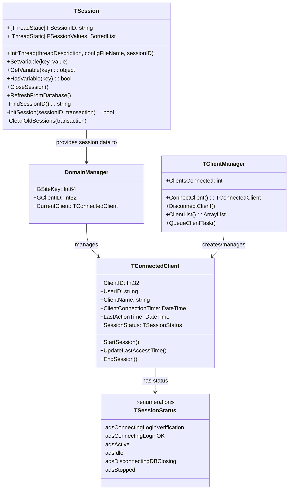
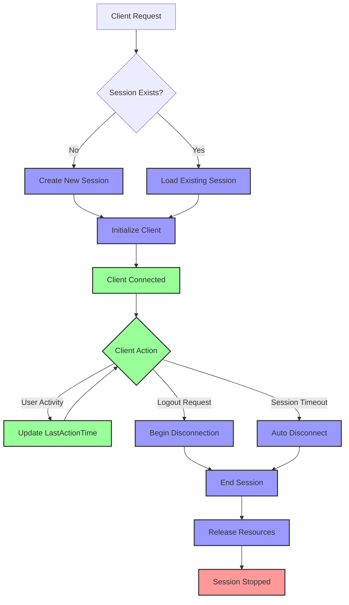
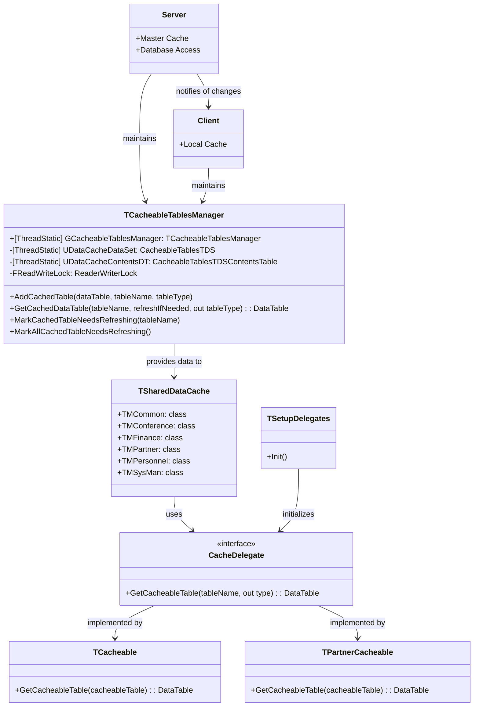
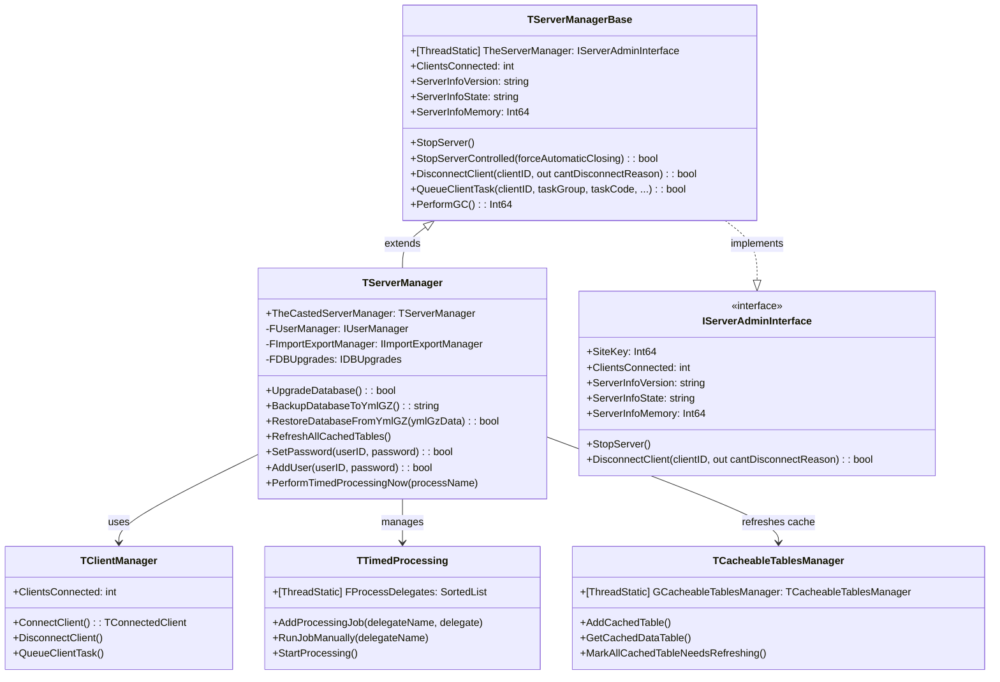

# Server-Side State Management in OpenPetra

## Server-Side State Management Overview

OpenPetra implements a sophisticated server-side state management architecture that goes beyond traditional ASP.NET session handling. The system uses a combination of custom session management, domain management, and client tracking to maintain application state across requests. Rather than relying on standard ASP.NET session state, OpenPetra implements its own session handling with database persistence, allowing for more robust state management that works both with and without HttpContext. This approach provides thread safety, session persistence, and efficient resource management.

The architecture is built around several key components: the `TSession` class for session variable storage and retrieval, the `DomainManager` class for accessing critical session variables, and the `TConnectedClient` class for tracking client connections. Together, these components create a comprehensive state management system that supports both web and desktop client scenarios while maintaining security and performance.

## Session Management Implementation

The `TSession` class implements a custom session handling mechanism that stores session data in a database rather than relying on standard ASP.NET session state. This approach provides several advantages:

1. **Thread Safety**: The class uses the `[ThreadStatic]` attribute for session variables to ensure thread isolation, preventing cross-request contamination in multi-threaded environments.

2. **Database Persistence**: Session data is stored in a database, allowing sessions to persist across server restarts and enabling distributed server scenarios.

3. **Mutex-based Concurrency Control**: The implementation uses mutex locks to prevent deadlocks during parallel session operations, ensuring data integrity.

4. **JSON Serialization**: Complex objects are stored in the session using JSON serialization, allowing for efficient storage and retrieval of structured data.

The class provides methods like `InitThread()`, `SetVariable()`, `GetVariable()`, `HasVariable()`, and `CloseSession()` that form the foundation of OpenPetra's state management. The `InitThread()` method is particularly important as it initializes session state for each new request, either retrieving an existing session or creating a new one.

```csharp
public static void InitThread(string AThreadDescription, string AConfigFileName, string ASessionID = null)
{
    // Reset static variables for logging
    TLogWriter.ResetStaticVariables();
    TLogging.ResetStaticVariables();

    // Initialize configuration and logging
    new TAppSettingsManager(AConfigFileName);
    new TLogging(TSrvSetting.ServerLogFile);
    
    // Set session ID and load session values
    FSessionID = ASessionID ?? FindSessionID();
    FSessionValues = null;
    
    // Connect to database and initialize session
    TDataBase db = ConnectDB("SessionInitThread");
    try {
        // Use mutex to prevent deadlocks on parallel operations
        if (!FDeleteSessionMutex.WaitOne(5000)) {
            throw new Exception("Server is too busy");
        }
        
        // Load or create session in database
        InitSession(sessionID, transaction);
        
        // Clean old sessions periodically
        CleanOldSessions(transaction);
    }
    finally {
        db.CloseDBConnection();
        FDeleteSessionMutex.ReleaseMutex();
    }
}
```

This implementation enables OpenPetra to maintain session state across requests while providing thread safety and database persistence.

## Session State Architecture



The diagram illustrates the relationship between the key components of OpenPetra's session state architecture. `TSession` provides the foundation for session management, storing and retrieving session variables. `DomainManager` accesses critical session variables like site keys and client IDs. `TClientManager` handles client connections, while `TConnectedClient` tracks individual client sessions and their states through the `TSessionStatus` enum.

This architecture enables OpenPetra to maintain robust session state across requests while providing thread safety, database persistence, and efficient resource management.

## Client Connection Tracking

OpenPetra implements comprehensive client connection tracking through the `TConnectedClient` and `TClientManager` classes. These classes work together to maintain session status, track client-specific resources, and manage the lifecycle of client connections.

The `TConnectedClient` class stores essential client information including:

- Client ID and user ID
- Computer name and IP address
- Connection timestamps (start, last action, finished)
- Connection type (LAN, remote)
- Session status (connecting, active, idle, disconnecting, stopped)

It provides methods to manage the client lifecycle:

```csharp
public void StartSession()
{
    // Initialize task managers for this client
    FTasksManager = new TClientTasksManager();
    FPollClientTasks = new TPollClientTasks(FTasksManager);
    
    // Update timestamps and status
    FClientConnectionStartTime = DateTime.Now;
    SessionStatus = TSessionStatus.adsActive;
    FClientConnectionFinishedTime = DateTime.Now;
}

public void UpdateLastAccessTime()
{
    FLastActionTime = DateTime.Now;
}

public void EndSession()
{
    // Prevent duplicate session termination
    if (FAppDomainStatus == TSessionStatus.adsStopped)
    {
        TLogging.Log("EndSession: Session has been stopped already!");
        return;
    }
    
    // Clean up resources
    if (HttpContext.Current != null)
    {
        TSession.CloseSession();
    }
    
    // Update status and timestamps
    FClientDisconnectionFinishedTime = DateTime.Now;
    FAppDomainStatus = TSessionStatus.adsStopped;
}
```

The `TClientManager` class provides static methods to manage client connections across the application:

1. **Connection Management**: Methods to connect and disconnect clients, track connection counts, and maintain client lists
2. **Resource Allocation**: Assigns unique client IDs and manages client-specific resources
3. **Task Management**: Queues tasks for specific clients and handles task prioritization
4. **Status Monitoring**: Tracks client status changes and logs connection events

Together, these classes provide a robust system for tracking client connections throughout their lifecycle, from initial connection through active use to disconnection, ensuring proper resource management and session state tracking.

## Domain Management

The `DomainManager` class serves as a centralized interface for accessing critical session variables in OpenPetra. It provides properties to get and set key session data including:

1. **GSiteKey**: The organization's site identifier, which can be changed by privileged users during an active session
2. **GClientID**: The current session's client identifier
3. **CurrentClient**: The connected client object, which contains detailed information about the client session

The class uses `TSession` for storing and retrieving these variables and includes validation to throw `EOPDBInvalidSessionException` when required session data is missing. This ensures that operations requiring valid session data fail gracefully when session state is invalid.

A key feature of the `DomainManager` is its handling of complex objects through JSON serialization/deserialization:

```csharp
public static TConnectedClient CurrentClient
{
    get
    {
        TVariant v = TSession.GetVariant("ConnectedClient");

        if (v.IsZeroOrNull())
        {
            return null;
        }

        return JsonConvert.DeserializeObject<TConnectedClient>(v.ToJson());
    }

    set
    {
        TSession.SetVariable("ConnectedClient", value);
    }
}
```

This approach allows complex objects like `TConnectedClient` to be stored in the session and retrieved with their full structure intact, enabling rich state management across requests.

The `DomainManager` plays a crucial role in OpenPetra's architecture by providing a clean interface to session state that abstracts away the underlying storage mechanism. This makes it easier for other components to access session data without needing to know how it's stored or retrieved.

## Client Connection Lifecycle



The client connection lifecycle in OpenPetra follows a well-defined path from initialization through active state to disconnection. When a client connects, the system either creates a new session or loads an existing one based on the session ID. The client is then initialized with a unique ID, and its status is set to `adsConnectingLoginVerification`.

After successful authentication, the client enters the active state (`adsActive`), where it can perform operations and interact with the system. Each client action updates the `LastActionTime` to track activity.

The client can transition to disconnection through several paths:
1. **User-initiated logout**: The client explicitly requests disconnection
2. **Session timeout**: Inactivity exceeds the configured timeout period
3. **Server shutdown**: The server initiates a controlled shutdown

During disconnection, the system follows these steps:
1. Change status to `adsDisconnectingDBClosing`
2. Close database connections and release resources
3. Update disconnection timestamps
4. Set final status to `adsStopped`

This lifecycle management ensures proper resource allocation and cleanup throughout the client's interaction with the system, preventing resource leaks and maintaining system stability.

## Caching Mechanism

OpenPetra implements a sophisticated caching mechanism through the `TCacheableTablesManager` class, which provides thread-safe caching of DataTables with functionality for adding, refreshing, and retrieving data from cache. This caching system significantly improves performance by reducing database queries for frequently accessed data.

The caching mechanism includes several key features:

1. **Thread Safety**: Uses `ReaderWriterLock` to protect shared resources, allowing multiple readers but exclusive writer access
2. **Copy-on-Read**: Returns copies of cached DataTables rather than references to prevent multi-threading issues
3. **Cache Invalidation**: Supports marking tables as needing refresh when underlying data changes
4. **Cross-Client Notification**: Notifies other clients when cached data changes to maintain consistency

The core methods of the caching system include:

```csharp
// Add a new table to the cache
public virtual void AddCachedTable(DataTable ADataTable, string ATableName, Type ATableType)

// Retrieve a table from cache, refreshing if needed
public virtual DataTable GetCachedDataTable(string ATableName, bool ARefreshIfNeeded, out Type ATableType)

// Mark a table as needing refresh
public virtual void MarkCachedTableNeedsRefreshing(string ATableName)

// Mark all tables as needing refresh
public virtual void MarkAllCachedTableNeedsRefreshing()
```

The caching system is designed to work across both server and client components, with the server maintaining the master cache and clients maintaining local copies. When data changes on the server, it can notify clients to refresh their caches, ensuring data consistency across the application.

## Data Caching Architecture



The diagram illustrates OpenPetra's data caching architecture, showing how data flows between server and client components. The `TCacheableTablesManager` serves as the central cache manager, with both server and client maintaining instances. The server's instance acts as the master cache with direct database access, while clients maintain local copies.

The `TSharedDataCache` class organizes cache functionality into domain-specific nested classes (Common, Finance, Partner, etc.), each with delegate patterns to retrieve cacheable tables. The `TSetupDelegates` class initializes these delegates at application startup, connecting them to the appropriate implementation classes like `TCacheable` and `TPartnerCacheable`.

When data changes in the database, the server updates its cache and notifies clients to refresh their local caches. This architecture ensures data consistency across the application while minimizing database queries and network traffic.

## User Preferences and Settings

OpenPetra implements a robust system for managing persistent user preferences through the `TUserDefaults` class. This class provides a comprehensive set of methods for storing and retrieving user-specific settings from the database, ensuring that user preferences persist across sessions and devices.

The `TUserDefaults` class offers type-specific getters and setters for various data types:

1. **Boolean values**: `GetBooleanDefault()` and `SetDefault()` for true/false settings
2. **Numeric values**: `GetInt16Default()`, `GetInt32Default()`, `GetInt64Default()`, `GetDoubleDefault()` for various numeric types
3. **String values**: `GetStringDefault()` for text-based settings
4. **Character values**: `GetCharDefault()` for single character settings

These methods handle type conversion and provide default values when settings don't exist:

```csharp
public static bool GetBooleanDefault(String AKey, bool ADefault = true, TDataBase ADataBase = null)
{
    return Convert.ToBoolean(GetUserDefault(AKey, ADefault.ToString()));
}

public static System.Int32 GetInt32Default(String AKey, System.Int32 ADefault = 0, TDataBase ADataBase = null)
{
    return Convert.ToInt32(GetUserDefault(AKey, ADefault.ToString()));
}

public static String GetStringDefault(String AKey, String ADefault = "", TDataBase ADataBase = null)
{
    return GetUserDefault(AKey, ADefault);
}
```

The class also implements a notification system that propagates changes to connected clients:

```csharp
private static void NotifyClientsAboutUserDefaultChange(string AKey, string AValue)
{
    // Queue client task to notify other clients about the change
    TClientManager.QueueClientTask(-1,
        ClientTaskConstants.CLIENTTASK_USERDEFAULTS,
        ClientTaskConstants.CLIENTTASK_USERDEFAULTS_USERDEFAULTCHANGED,
        AKey, AValue, null, null, 1, -1);
}
```

This ensures that when a user changes a preference on one device, the change is reflected across all their active sessions. The system supports both single updates and batch operations, with transaction management to ensure data integrity during database operations.

## Progress Tracking for Long-Running Operations

OpenPetra implements a sophisticated progress tracking system for long-running server operations through the `TProgressTracker` class. This system allows clients to monitor task completion and status while the server performs time-consuming operations like report generation, data imports, or batch processing.

The `TProgressTracker` manages state through session variables, storing progress information identified by client IDs. Key functionality includes:

1. **Initialization**: `InitProgressTracker()` creates a new tracker with a caption and overall amount
2. **Status Updates**: `SetCurrentState()` updates the current status message and completion percentage
3. **Progress Retrieval**: `GetCurrentState()` allows clients to check the current progress
4. **Job Control**: `CancelJob()` and `FinishJob()` handle cancellation and completion

The progress state is stored in a `TProgressState` class that includes:

```csharp
public class TProgressState
{
    public string Caption { get; set; }
    public string StatusMessage { get; set; }
    public int PercentageDone { get; set; }
    public decimal AbsoluteOverallAmount { get; set; }
    public bool CancelJob { get; set; }
    public bool JobFinished { get; set; }
}
```

This state is serialized to JSON and stored in session variables, allowing it to persist across requests:

```csharp
static public void SetCurrentState(string AClientID, string AStatusMessage, Decimal ACurrentAbsoluteAmount)
{
    if (TSession.HasVariable(PROGRESSTRACKER + AClientID))
    {
        TProgressState state = ((JObject)TSession.GetVariable(PROGRESSTRACKER + AClientID)).ToObject<TProgressState>();

        if (AStatusMessage.Length > 0)
        {
            state.StatusMessage = AStatusMessage;
        }

        state.PercentageDone = Convert.ToInt32((ACurrentAbsoluteAmount / state.AbsoluteOverallAmount) * 100.0m);

        TSession.SetVariable(PROGRESSTRACKER + AClientID, state);
    }
}
```

The system also supports job cancellation, allowing users to interrupt long-running operations:

```csharp
static public bool CancelJob(string AClientID)
{
    if (TSession.HasVariable(PROGRESSTRACKER + AClientID))
    {
        TProgressState state = ((JObject)TSession.GetVariable(PROGRESSTRACKER + AClientID)).ToObject<TProgressState>();

        if (state.JobFinished == false)
        {
            state.CancelJob = true;
            TSession.SetVariable(PROGRESSTRACKER + AClientID, state);
            return true;
        }
    }
    return false;
}
```

This progress tracking system enhances user experience by providing feedback during long-running operations and allowing users to cancel operations that are taking too long.

## Timed Processing and Scheduled Jobs

OpenPetra implements a flexible system for managing scheduled processing routines through the `TTimedProcessing` class. This class provides functionality to register processing jobs, run them at timed intervals, and execute them manually. It's designed to handle recurring tasks like data cleanup, report generation, and system maintenance.

The class maintains a collection of delegate functions that perform database operations:

```csharp
[ThreadStatic]
private static SortedList<string, TProcessDelegate> FProcessDelegates = null;

public delegate void TProcessDelegate(TDataBase Database, bool ARunManually);
```

Jobs are registered using the `AddProcessingJob` method:

```csharp
public static void AddProcessingJob(string ADelegateName, TProcessDelegate ADelegate)
{
    if (FProcessDelegates == null)
    {
        FProcessDelegates = new SortedList<string, TTimedProcessing.TProcessDelegate>();
    }

    if (!FProcessDelegates.ContainsKey(ADelegateName))
    {
        FProcessDelegates.Add(ADelegateName, ADelegate);
    }
}
```

The system supports both scheduled and manual execution of jobs:

1. **Scheduled Execution**: The `StartProcessing` method initializes timers to run jobs at configured intervals
2. **Manual Execution**: The `RunJobManually` method allows immediate execution of specific jobs

Each job runs within a database connection managed by the `GenericProcessor` method:

```csharp
private static void GenericProcessor(string ADelegateName, bool ARunManually = false)
{
    if (!FProcessDelegates.ContainsKey(ADelegateName))
    {
        return;
    }

    TProcessDelegate TypedDelegate = FProcessDelegates[ADelegateName];
    TDataBase db = null;

    try
    {
        db = DBAccess.Connect("Servers's DB Connection for TimedProcessing");
        TypedDelegate(db, ARunManually);
    }
    finally
    {
        if (db != null)
        {
            db.CloseDBConnection();
        }
    }
}
```

The `TServerManager` class extends this functionality by providing a web interface for managing scheduled jobs:

```csharp
public override void PerformTimedProcessingNow(string AProcessName)
{
    // Set up timed processing configuration
    TTimedProcessing.DailyStartTime24Hrs = TAppSettingsManager.GetValue("Server.Processing.DailyStartTime24Hrs", "00:30");

    // Register available processing jobs
    if (TAppSettingsManager.GetBoolean("Server.Processing.PartnerReminders.Enabled", true))
    {
        // Register partner reminder processing
        TTimedProcessing.AddProcessingJob("TProcessPartnerReminders", ...);
    }

    if (TAppSettingsManager.GetBoolean("Server.Processing.DataChecks.Enabled", false))
    {
        // Register data validation checks
        TTimedProcessing.AddProcessingJob("TProcessDataChecks", ...);
    }

    // Run the requested job immediately
    TTimedProcessing.RunJobManually(AProcessName);
}
```

This system provides a flexible framework for scheduling and managing background tasks, ensuring that routine maintenance and processing operations run reliably without manual intervention.

## Server Manager Architecture



The Server Manager architecture in OpenPetra provides a comprehensive framework for server administration and management. At its core is the `TServerManagerBase` class, which implements the `IServerAdminInterface` to provide essential server management functionality. This is extended by the `TServerManager` class, which adds application-specific functionality.

The architecture includes several key components:

1. **Server Control**: Methods for starting, stopping, and monitoring the server
2. **Client Management**: Functionality to track, connect, and disconnect clients
3. **Database Operations**: Methods for upgrading, backing up, and restoring the database
4. **User Management**: Functions to add users and manage passwords
5. **Cache Management**: Ability to refresh cached data tables
6. **Scheduled Processing**: Management of timed jobs and background tasks

The `TServerManager` loads and initializes various server components through reflection, allowing for modular design and extension:

```csharp
public TServerManager() : base()
{
    // Load and initialize import/export functionality
    Assembly SysManAssembly = Assembly.Load("Ict.Petra.Server.lib.MSysMan");
    Type ImportExportType = SysManAssembly.GetType("Ict.Petra.Server.MSysMan.ImportExport.TImportExportManager");
    FImportExportManager = (IImportExportManager)Activator.CreateInstance(ImportExportType,
        (BindingFlags.Public | BindingFlags.Instance | BindingFlags.InvokeMethod),
        null, null, null);

    // Load and initialize database upgrade functionality
    Assembly DBUpgradesAssembly = Assembly.Load("Ict.Petra.Server.lib.MSysMan.DBUpgrades");
    Type DatabaseUpgradeType = DBUpgradesAssembly.GetType("Ict.Petra.Server.MSysMan.DBUpgrades.TDBUpgrades");
    FDBUpgrades = (IDBUpgrades)Activator.CreateInstance(DatabaseUpgradeType,
        (BindingFlags.Public | BindingFlags.Instance | BindingFlags.InvokeMethod),
        null, null, null);

    // Load and initialize user management functionality
    Type UserManagement = SysManAssembly.GetType("Ict.Petra.Server.MSysMan.Maintenance.UserManagement.TUserManager");
    FUserManager = (IUserManager)Activator.CreateInstance(UserManagement,
        (BindingFlags.Public | BindingFlags.Instance | BindingFlags.InvokeMethod),
        null, null, null);
}
```

This architecture provides a centralized interface for server management, allowing administrators to control all aspects of the server through a single, consistent API. The use of interfaces and reflection enables modular design and extension, making it easy to add new functionality without modifying the core architecture.

[Generated by the Sage AI expert workbench: 2025-03-30 02:22:57  https://sage-tech.ai/workbench]: #