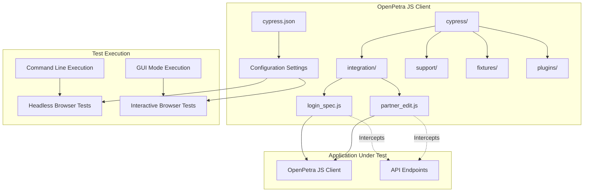
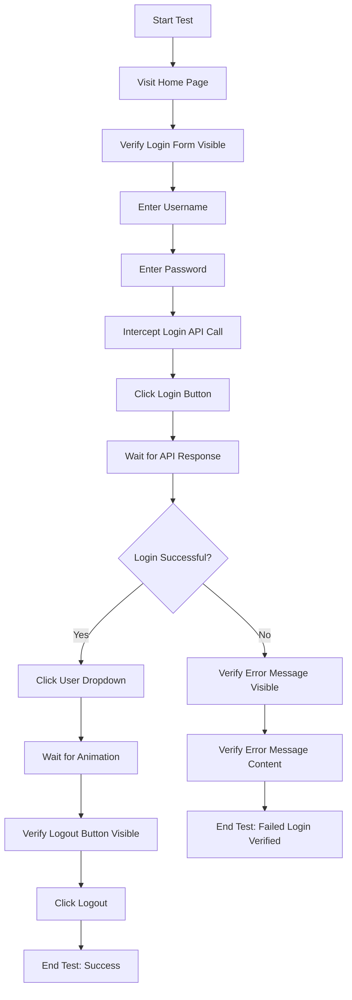
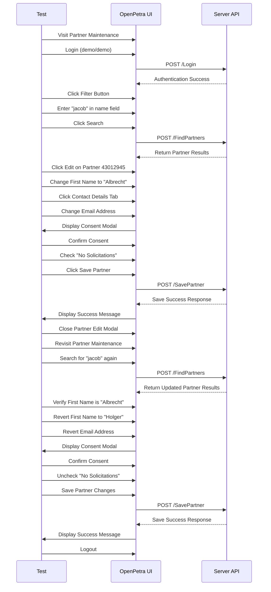
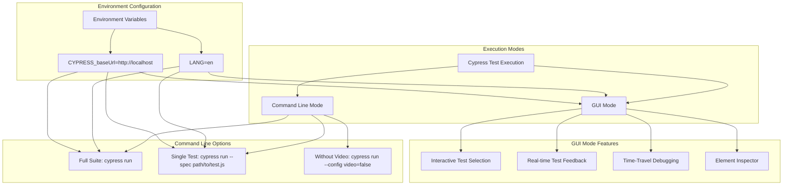

# Testing - Cypress in OpenPetra

## Introduction to Cypress Testing in OpenPetra

OpenPetra has integrated the Cypress testing framework to automate UI testing for its JavaScript client. This integration enables comprehensive testing of user interactions with the web interface, ensuring functionality across the application. Cypress provides a robust platform for writing, running, and debugging tests that simulate real user behavior within the OpenPetra application. The implementation focuses on critical workflows such as authentication and partner management, using Cypress's ability to interact with DOM elements, intercept network requests, and handle asynchronous operations. This approach allows OpenPetra developers to maintain high quality standards by automatically verifying that UI components and business logic function correctly across different scenarios and edge cases.

## Cypress Configuration in OpenPetra

The `cypress.json` configuration file in OpenPetra's JavaScript client establishes key parameters that optimize the testing environment. The configuration sets a `defaultCommandTimeout` of 10,000 milliseconds (10 seconds), which is significantly higher than Cypress's default 4-second timeout. This extended timeout accommodates operations that may take longer to complete, such as server responses in slower environments or complex UI rendering processes. The configuration also explicitly disables video recording of test runs with `"video": false`, which reduces resource consumption and storage requirements during test execution. This minimalist configuration approach focuses on the essential settings needed for OpenPetra's testing requirements while relying on Cypress defaults for other parameters, creating an efficient testing environment that balances thoroughness with performance.

## Cypress Test Architecture in OpenPetra



The diagram illustrates the structure of Cypress tests within the OpenPetra project. At the root level, the `cypress.json` file provides configuration settings that govern test execution behavior. The cypress directory contains the main test components, with the integration folder housing the actual test specifications like `login_spec.js` and `partner_edit.js`. These test files interact directly with the OpenPetra JavaScript client application and intercept API calls to validate both UI interactions and backend responses.

The architecture follows Cypress's recommended project structure, with support for fixtures (test data), plugins (extending Cypress functionality), and support files (shared utilities and commands). Tests can be executed either via command line for CI/CD integration or through Cypress's GUI mode for interactive debugging. This organization provides a clean separation between test configuration, implementation, and execution while maintaining close integration with the application under test.

## Authentication Testing Implementation

The `login_spec.js` file implements comprehensive authentication testing for OpenPetra's login functionality. The test suite contains three distinct test cases that cover critical authentication scenarios: successful login with lowercase username 'demo', successful login with uppercase username 'DEMO' (testing case-insensitivity), and failed login with incorrect password. Each test follows a similar pattern of visiting the login page, entering credentials, submitting the form, and verifying the expected outcome.

The implementation demonstrates sophisticated testing techniques, including API interception using `cy.route('POST','**/Login').as('Login')` to monitor network requests to the login endpoint, followed by `cy.wait('@Login')` to ensure the test waits for the asynchronous response before proceeding. For successful login scenarios, the tests verify that the user dropdown menu becomes accessible and contains a logout option, confirming proper authentication. For the failed login test, it verifies that an appropriate error message is displayed.

The tests also handle UI timing issues by incorporating explicit waits (e.g., `cy.wait(500)`) to account for dropdown animations, ensuring reliable test execution across different environments. This authentication testing implementation provides a solid foundation for validating one of the most critical aspects of the application while demonstrating proper Cypress testing patterns for handling asynchronous operations and UI interactions.

## Login Test Flow Diagram



This flowchart illustrates the sequence of operations in OpenPetra's Cypress login tests. The process begins with loading the application's home page and verifying that the login form is visible. The test then enters credentials (either correct or incorrect depending on the test case) and sets up API interception to monitor the login request.

After clicking the login button, the test waits for the API response before proceeding. For successful login scenarios, the test verifies proper authentication by checking that the user dropdown menu works and contains a logout option, then completes the workflow by logging out. For failed login attempts, the test verifies that an appropriate error message is displayed with the correct content.

The diagram highlights key testing points including form interaction, API interception, asynchronous waiting, and conditional verification paths based on expected outcomes. This structured approach ensures comprehensive testing of the authentication flow, covering both the happy path and error scenarios.

## API Interception and Asynchronous Testing

OpenPetra's Cypress tests demonstrate sophisticated handling of API interactions and asynchronous operations, which is critical for reliable UI testing. The implementation uses `cy.server()` to enable network request interception, followed by `cy.route()` calls to monitor specific API endpoints. For example, in the login tests, `cy.route('POST','**/Login').as('Login')` creates an alias for login requests, allowing the test to wait for and inspect these requests.

The tests employ `cy.wait('@Login')` to pause execution until the intercepted request completes, ensuring that subsequent assertions are made after the application has processed the server response. This pattern is also applied to other API calls like `FindPartners` and `SavePartner` in the partner management tests, where waiting for backend operations is essential before proceeding with UI verification.

Beyond API interception, the tests handle other asynchronous challenges through explicit timing controls. For instance, `cy.wait(500)` is used strategically to account for UI animations like dropdown menus expanding or modal dialogs appearing. These explicit waits supplement Cypress's built-in automatic waiting for elements, addressing edge cases where DOM presence doesn't guarantee interactive readiness.

The combination of API interception, aliased routes, and strategic waits creates a robust approach to managing asynchronous behavior in the tests. This methodology ensures that tests interact with elements only when they're truly ready, reducing flakiness and providing more reliable verification of application behavior across different execution environments and network conditions.

## Complex Workflow Testing: Partner Management

The `partner_edit.js` file implements a comprehensive test for OpenPetra's partner management functionality, demonstrating how Cypress can validate complex multi-step workflows. The test simulates a complete business process that includes authentication, partner search, detailed information editing, consent handling, preference toggling, and data restoration.

The workflow begins with logging in and navigating to the partner maintenance screen. It then searches for a specific partner using a partial name ("jacob") and verifies the search results before proceeding to edit the found partner. The test performs multiple edits across different tabs of the partner form, including changing the first name from "Holger" to "Albrecht" and modifying the email address. It also handles a consent modal that appears when changing contact information, demonstrating how to interact with conditional UI elements.

The implementation tests preference toggles by checking and unchecking the "no solicitations" option, verifying both the initial state and the ability to change it. After saving the changes, the test validates that success messages appear and that the changes persist by navigating away and then returning to re-edit the same partner.

Importantly, the test demonstrates good testing hygiene by reverting all changes at the end, restoring the partner data to its original state. This ensures that repeated test runs won't fail due to accumulated changes and leaves the system in a clean state. The comprehensive nature of this test showcases how Cypress can validate complex business workflows that span multiple UI components, modals, form interactions, and server operations.

## Partner Edit Test Sequence



This sequence diagram illustrates the complete workflow tested in the partner editing functionality. The test begins with authentication and navigating to the partner maintenance screen. It then performs a search operation, intercepting the API call to ensure results are loaded before proceeding.

The diagram shows how the test interacts with different UI components, including form fields across multiple tabs, and handles conditional elements like the consent modal that appears when changing contact information. It also demonstrates the verification of changes by revisiting the partner record after saving.

A key aspect highlighted in the sequence is the test's approach to data integrity - after verifying that changes were successfully applied, it methodically reverts all modifications to restore the original state. This ensures that the test can be run repeatedly without causing data drift.

The diagram also emphasizes the interplay between UI interactions and API calls, showing how the test waits for server responses before proceeding with subsequent steps. This comprehensive testing approach validates not just individual UI components but the entire business process flow, ensuring that all parts work together correctly.

## UI Interaction Patterns in Cypress Tests

OpenPetra's Cypress tests demonstrate several sophisticated UI interaction patterns that ensure reliable testing across complex interface components. For form interactions, the tests follow a consistent pattern of first verifying element visibility with `cy.get('#elementId').should("be.visible")`, then interacting with the element through commands like `type()`, `click()`, or `check()/uncheck()`. This verification-before-interaction approach prevents timing issues where tests might attempt to interact with elements that aren't yet ready.

For handling form fields, the tests often combine value verification with modification in a single chain, as seen in `cy.get('#modal_space input[name="PFamily_p_first_name_c"]').should('have.value', "Holger").click().clear().click().type('Albrecht')`. This pattern validates the initial state before making changes, providing both testing and documentation value.

Modal dialogs receive special attention in the tests, with explicit handling for their appearance and dismissal. For example, when editing contact information triggers a consent modal, the test waits for the modal to appear and then explicitly clicks the confirmation button with `cy.get('#modal_space #btnSubmitChangesConsent').click()`.

Navigation between tabs and sections uses targeted selectors like `cy.get('#modal_space [href="#contactdetails"]').click()`, demonstrating how to interact with tabbed interfaces. The tests also handle dropdown menus by accounting for animation timing with explicit waits before interacting with dropdown items.

For verification, the tests use chained assertions to check multiple aspects of an element, such as `cy.get('#message').should("be.visible").should("contain", 'Successfully saved')`. This approach provides clear feedback about which aspect of the verification failed when issues occur.

These patterns collectively form a robust approach to UI testing that handles the complexities of modern web interfaces while maintaining test reliability across different execution environments.

## Test Execution and Environment Configuration

OpenPetra's Cypress test suite can be executed in multiple ways, with flexible configuration options as documented in the project's README. The two primary execution modes are command-line (headless) for CI/CD integration and GUI mode for interactive development and debugging.

For command-line execution, developers can run tests after installing dependencies with `npm install` using the syntax:
```
LANG=en CYPRESS_baseUrl=http://localhost ./node_modules/.bin/cypress run --config video=false --spec cypress/integration/partner_edit.js
```

This command demonstrates several important configuration options:
- Environment variables (`LANG=en`) control the application's localization during testing
- The `CYPRESS_baseUrl` variable sets the target application URL, allowing tests to run against different environments
- The `--config` flag overrides configuration settings, in this case disabling video recording
- The `--spec` parameter allows running specific test files rather than the entire suite

For interactive testing during development, the GUI mode can be launched with:
```
LANG=en CYPRESS_baseUrl=http://localhost ./node_modules/.bin/cypress open
```

This opens Cypress's Test Runner interface, which displays available test files and allows running them individually with real-time feedback and debugging tools.

The configuration approach uses a combination of the `cypress.json` file for persistent settings and command-line parameters for run-specific options. This provides a flexible testing environment that can adapt to different development scenarios, from quick local verification to comprehensive CI/CD pipeline integration.

## Cypress Command Execution Options



This diagram illustrates the different approaches to executing Cypress tests in OpenPetra. The two primary execution modes are Command Line Mode for automated testing and CI/CD integration, and GUI Mode for interactive development and debugging.

Command Line Mode offers several options, including running the full test suite, executing specific test files, and configuring test behavior through parameters like disabling video recording. These options can be combined to create customized test runs based on specific requirements.

Environment configuration is applied through environment variables that control aspects like language settings (`LANG=en`) and the target application URL (`CYPRESS_baseUrl=http://localhost`). These variables can be used with both execution modes to ensure tests run against the correct environment with appropriate settings.

GUI Mode provides additional features for test development and debugging, including interactive test selection from a visual interface, real-time feedback as tests execute, time-travel debugging to inspect application state at any point during test execution, and an element inspector for verifying selectors.

This flexible execution model allows developers to choose the most appropriate approach based on their current needs, whether running automated tests in a CI pipeline or interactively debugging test failures during development.

## Best Practices and Patterns in OpenPetra's Cypress Tests

The OpenPetra Cypress test implementation demonstrates several best practices and patterns that contribute to reliable, maintainable automated testing. One notable pattern is the consistent approach to state restoration, where tests that modify data (like the partner editing test) methodically revert changes at the end of the test. This ensures that subsequent test runs aren't affected by accumulated state changes, preventing test interdependencies.

The tests employ comprehensive assertions that verify both the visibility and content of elements. For example, success messages are verified with `cy.get('#message').should("be.visible").should("contain", 'Successfully saved')`, ensuring both that the message appears and contains the expected text. This approach provides more specific feedback when failures occur.

For handling asynchronous operations, the tests use a combination of techniques. API calls are intercepted with `cy.route()` and waited for with `cy.wait('@aliasName')`, ensuring that the test proceeds only after server responses are received. UI animations and transitions are handled with strategic explicit waits like `cy.wait(500)`, addressing cases where elements might be in the DOM but not yet interactive.

The tests demonstrate good selector practices by using specific, stable selectors that combine IDs, names, and attributes to precisely target elements. For example, `#modal_space input[name="PFamily_p_first_name_c"]` combines a container ID with an input element and name attribute for reliable targeting.

Error scenarios are explicitly tested alongside happy paths, as seen in the login tests that verify both successful authentication and proper error handling for invalid credentials. This comprehensive approach ensures that the application behaves correctly under various conditions.

These patterns collectively form a robust testing strategy that balances thoroughness with maintainability, providing reliable validation of OpenPetra's functionality while remaining adaptable to application changes.

[Generated by the Sage AI expert workbench: 2025-03-30 02:22:57  https://sage-tech.ai/workbench]: #