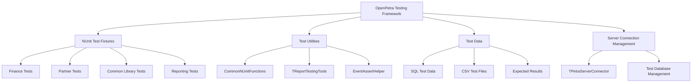
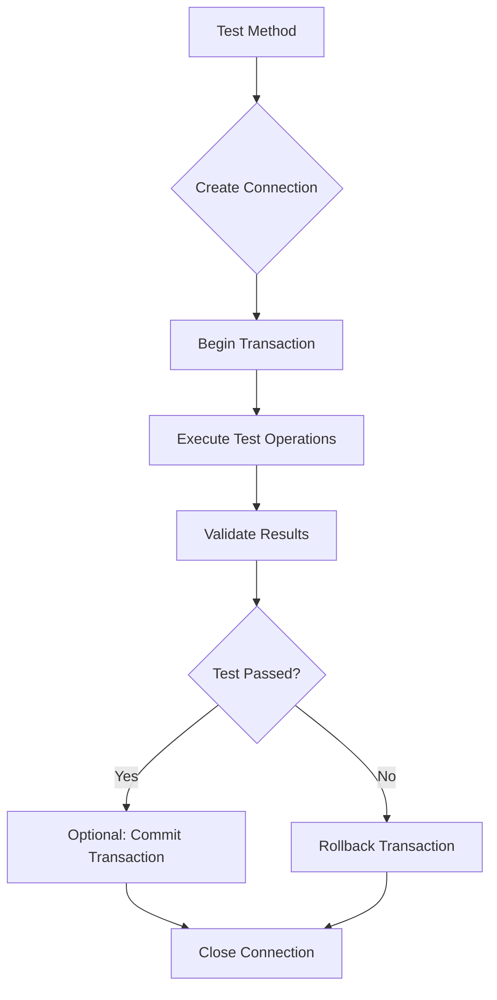
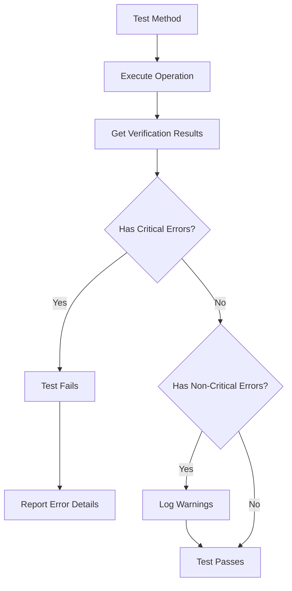
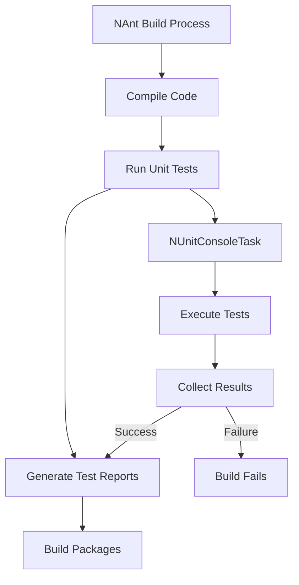

# OpenPetra's Testing Framework

## Introduction to OpenPetra's Testing Framework

OpenPetra's testing framework is built on NUnit, a widely-used testing framework for .NET applications. The framework provides comprehensive validation of system functionality across various modules including finance, partner management, gift processing, and reporting. OpenPetra employs a multi-layered testing approach with unit tests for individual components, integration tests for module interactions, and system tests for end-to-end functionality.

The testing framework is designed to ensure that OpenPetra's core business logic functions correctly, particularly focusing on critical financial operations, data integrity, and cross-platform compatibility. Tests are organized by module and functionality, with separate test fixtures for different system components, allowing for targeted validation of specific features while maintaining overall system integrity.

## Testing Architecture and Organization

OpenPetra's testing architecture follows a hierarchical organization that mirrors the application's structure. Tests are organized into namespaces that correspond to the modules they test (e.g., `Tests.MFinance.Server.Gift` for gift processing tests). Each module has dedicated test fixtures that focus on specific functionality areas.

The testing framework consists of several key components:



The framework uses a combination of real database connections and mock objects, allowing tests to validate both database operations and isolated component functionality. Test fixtures typically include setup methods that establish database connections and teardown methods that clean up resources, ensuring tests don't interfere with each other.

## Unit Test Implementation Patterns

OpenPetra's unit tests follow several common implementation patterns to ensure consistency and maintainability:

1. **Setup/Teardown Pattern**: Tests use `[OneTimeSetUp]` and `[OneTimeTearDown]` methods to establish and close database connections, while `[SetUp]` and `[TearDown]` methods prepare and clean up test-specific data.

2. **Arrange-Act-Assert (AAA) Pattern**: Tests are structured with clear arrangement of test data, execution of the functionality being tested, and assertion of expected results.

3. **Transaction-Based Testing**: Database operations are wrapped in transactions that are rolled back after testing, preventing test data from persisting in the database:

```csharp
TDBTransaction transaction = db.BeginTransaction(IsolationLevel.Serializable);
try
{
    // Test operations
    // ...
    
    // Verify results
    Assert.AreEqual(expectedValue, actualValue);
}
finally
{
    transaction.Rollback();
}
```

4. **Test Data Preparation**: Tests often use helper methods to create test data, such as `CreateTestPartnerData` or `ImportAndPostGiftBatch`, which encapsulate complex setup operations.

5. **Verification Result Validation**: Many tests use `TVerificationResultCollection` to validate business logic outcomes, checking for expected errors or successful operations.

## Database Testing Approach

OpenPetra's database testing approach is designed to ensure data integrity while maintaining test isolation. The framework uses a combination of techniques to interact with databases effectively:



Key aspects of the database testing approach include:

1. **Transaction Management**: Tests use transactions to isolate database changes, typically rolling back changes after test completion to prevent test data from affecting other tests.

2. **Test Database Creation**: For some tests, a fresh test database is created using `CommonNUnitFunctions.CreateNewLedger()` to ensure a clean starting point.

3. **SQL Script Loading**: Test data is often loaded from SQL scripts using `CommonNUnitFunctions.LoadTestDataBase()`, which allows for complex data setups.

4. **Data Access Patterns**: Tests use both direct SQL queries and the application's data access layer, testing both low-level database operations and higher-level business logic.

5. **Cross-Platform Compatibility**: Database tests are designed to work with different database systems (PostgreSQL, MySQL) by using database-agnostic access methods.

The framework includes utilities for database reset (`CommonNUnitFunctions.ResetDatabase()`) and verification of database state, ensuring tests start with a known database state and properly validate changes.

## Test Data Management

OpenPetra employs several strategies for managing test data to ensure tests are reliable, repeatable, and maintainable:

1. **Sample Files**: The framework includes sample data files (CSV, XML, HTML) that represent real-world scenarios. These files are stored in dedicated TestData directories and loaded during test execution.

2. **Dynamic Data Generation**: Tests often generate data dynamically, creating unique values for partner keys, transaction IDs, and other identifiers to avoid conflicts.

3. **Date Handling**: Tests frequently replace dates in test data with current dates to ensure tests remain valid over time:

```csharp
FileContent = FileContent.Replace("{thisyear}", DateTime.Today.Year.ToString());
```

4. **Expected Result Validation**: For complex outputs like reports, the framework compares generated results against expected result files, with support for variable substitution to handle dynamic content:

```csharp
SortedList<string, string> ToReplace = new SortedList<string, string>();
ToReplace.Add("{ledgernumber}", ALedgerNumber.ToString());
ToReplace.Add("{Today}", DateTime.Today.ToString("yyyy-MM-dd"));

Assert.IsTrue(
    TTextFile.SameContent(resultFile, expectedFile, true, ToReplace, true),
    "Results do not match expected output");
```

5. **Test Data Isolation**: The framework ensures test data isolation through transaction management and by using unique identifiers for test data, preventing interference between tests.

## Mocking and Dependency Isolation

OpenPetra's testing framework employs several techniques for isolating components and mocking dependencies:

1. **Server Connection Mocking**: The `TPetraServerConnector` class provides a standardized way to connect to a test server instance, allowing tests to run against a controlled environment.

2. **Function Delegation**: The framework uses delegate assignments to replace production functionality with test-specific implementations:

```csharp
TSmtpSender.GetSmtpSettings = @TSmtpSender.GetSmtpSettingsFromAppSettings;
```

3. **Test-Specific Implementations**: For complex components, the framework provides test-specific implementations that mimic the behavior of production components while providing additional testing capabilities:

```csharp
class TestOperation : AbstractPeriodEndOperation
{
    // Test-specific implementation
}
```

4. **Configuration Overrides**: Tests use custom configuration files to override production settings, allowing for controlled test environments.

5. **Transaction Isolation**: Database operations are wrapped in transactions that are typically rolled back after testing, preventing test data from affecting other tests.

While OpenPetra doesn't extensively use modern mocking frameworks like Moq, it achieves dependency isolation through these techniques, allowing components to be tested in isolation while still validating their integration with other system components.

## Verification and Assertion Patterns

OpenPetra uses a sophisticated verification system centered around the `TVerificationResultCollection` class to validate test outcomes and provide detailed error reporting:



Key verification patterns include:

1. **Verification Result Collections**: Many operations return a `TVerificationResultCollection` that contains information about errors, warnings, and informational messages:

```csharp
TVerificationResultCollection verificationResult;
bool success = TGiftTransactionWebConnector.PostGiftBatch(
    ledgerNumber, batchNumber, out generatedGlBatchNumber, out verificationResult);

Assert.IsTrue(success, "Operation should succeed");
Assert.IsFalse(verificationResult.HasCriticalErrors, 
    "Should not have critical errors: " + verificationResult.BuildVerificationResultString());
```

2. **Error Severity Levels**: Verification results have different severity levels (Critical, Non-critical, Status, Info), allowing tests to distinguish between fatal errors and warnings.

3. **Helper Methods**: The framework includes helper methods like `CommonNUnitFunctions.EnsureNullOrOnlyNonCriticalVerificationResults()` to simplify verification result checking.

4. **Custom Assertions**: For specific validation scenarios, the framework provides custom assertion helpers like `TReportTestingTools.TestResult()` for report validation.

5. **Detailed Error Messages**: When assertions fail, the framework provides detailed error messages that include the expected and actual values, making it easier to diagnose test failures.

This verification system allows tests to validate complex business rules and provide meaningful feedback when tests fail, improving the maintainability and reliability of the test suite.

## Integration with Build Process

OpenPetra integrates its testing framework with the build system using NAnt tasks and automated test execution:



Key aspects of this integration include:

1. **Custom NAnt Task**: The `NUnitConsoleTask` class implements a custom NAnt task for executing NUnit tests from the command line, with support for both Windows and non-Windows environments:

```csharp
[TaskName("NUnitConsole")]
public class NUnitConsoleTask : NAnt.Core.Task
{
    // Task implementation
}
```

2. **Test Result Collection**: Test results are collected and stored in XML format, allowing for detailed reporting and integration with continuous integration systems.

3. **Platform-Specific Handling**: The build process handles platform-specific differences, using appropriate commands for Windows and non-Windows environments:

```csharp
if (!PlatformHelper.IsWindows)
{
    process.StartInfo.FileName = "mono";
    process.StartInfo.Arguments = exeName + " \"" + FAssemblyName + "\"";
}
else
{
    process.StartInfo.FileName = exeName;
    process.StartInfo.Arguments = "\"" + FAssemblyName + "\" /result=../../log/TestResult.xml";
}
```

4. **Automated Test Execution**: Tests can be run automatically as part of the build process or manually using the NAnt tasks.

5. **Test Filtering**: The system supports running specific tests or test categories, allowing for targeted testing during development.

This integration ensures that tests are consistently executed during the build process, maintaining code quality and preventing regressions.

## Testing Best Practices and Challenges

Through analysis of OpenPetra's testing framework, several best practices and challenges emerge:

### Best Practices:

1. **Comprehensive Test Coverage**: OpenPetra tests cover a wide range of functionality, from low-level utility functions to complex business processes like financial year-end operations.

2. **Test Isolation**: Tests are designed to be independent, using transactions and unique identifiers to prevent interference between tests.

3. **Realistic Test Data**: Tests use realistic data scenarios that reflect actual usage patterns, improving the effectiveness of testing.

4. **Cross-Platform Testing**: The framework supports testing on different platforms (Windows, Linux) and with different database systems.

5. **Detailed Error Reporting**: When tests fail, they provide detailed information about what went wrong, making it easier to diagnose and fix issues.

### Challenges:

1. **Test Data Management**: Managing test data across many tests can be complex, especially for tests that require specific database states.

2. **Cross-Platform Compatibility**: Ensuring tests work correctly on different platforms requires careful handling of platform-specific behaviors.

3. **Date-Dependent Tests**: Tests that depend on dates can be fragile, requiring careful handling of date values to ensure tests remain valid over time.

4. **Test Performance**: Some tests, particularly those involving database operations, can be slow, affecting the overall test execution time.

5. **Maintenance Overhead**: As the application evolves, maintaining the test suite requires ongoing effort to keep tests up-to-date with changes in the application.

OpenPetra addresses these challenges through its structured testing approach, reusable test utilities, and careful management of test data and dependencies. The framework continues to evolve to meet the changing needs of the application and to incorporate modern testing practices.

[Generated by the Sage AI expert workbench: 2025-03-30 02:22:57  https://sage-tech.ai/workbench]: #