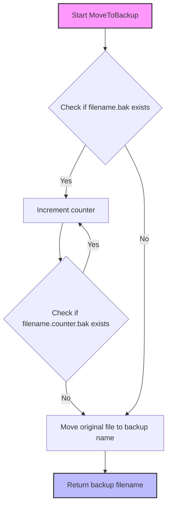
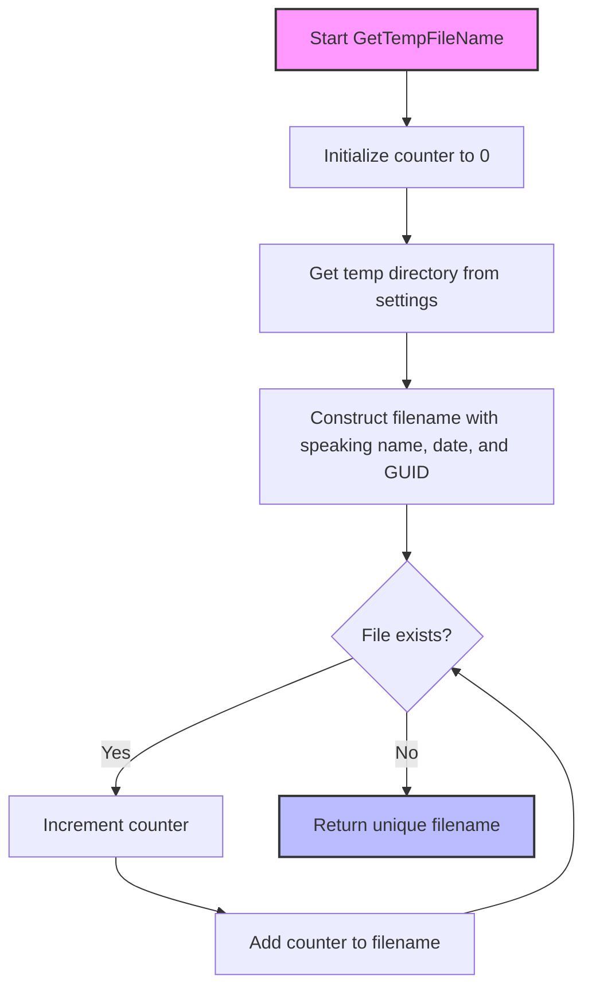
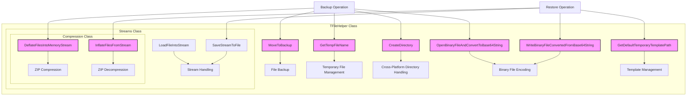

# OpenPetra Backup and Restore Functionality Analysis

## Overview of OpenPetra Backup and Restore Functionality

OpenPetra implements a robust backup and restore system centered around the `TFileHelper` class, which provides a comprehensive set of utilities for file operations, compression, and backup management. This class serves as the backbone for data preservation throughout the application, offering static methods organized into nested classes that handle various aspects of file manipulation. The architecture follows a modular approach with specialized components for stream handling, compression/decompression using ZIP format, and file operations. The system is designed with cross-platform compatibility in mind, addressing specific challenges in both Windows and Linux environments. The backup functionality is particularly important for preserving data integrity during critical operations such as database updates, configuration changes, and template management, ensuring that OpenPetra can recover from failures without data loss.

## File Backup Implementation

The `MoveToBackup` method in `TFileHelper` implements a sophisticated approach to file preservation that ensures original files are never lost during system operations. Rather than simply overwriting existing backups, the method creates sequentially numbered backup copies using a naming convention that prevents collisions. When invoked, it first attempts to create a backup with the `.bak` extension. If such a file already exists, it increments a counter and appends it to the filename (e.g., `filename.1.bak`, `filename.2.bak`) until an available filename is found. This implementation is particularly valuable in production environments where multiple backup operations might occur in succession, as it maintains a history of changes rather than a single point-in-time backup. The method returns the name of the newly created backup file, allowing the calling code to reference it if needed for recovery operations. This approach to backup creation demonstrates careful consideration for data integrity, ensuring that even in edge cases where multiple backup operations occur in rapid succession, no data is inadvertently overwritten.

## Backup File Naming Convention Flow

The diagram illustrates OpenPetra's backup file naming convention process. When creating a backup, the system first attempts to use a simple `.bak` extension. If that file already exists, it begins appending sequential numbers to create unique filenames (e.g., `filename.1.bak`, `filename.2.bak`, etc.). This prevents any existing backups from being overwritten, creating a historical trail of backups instead. The algorithm continues incrementing the counter until it finds an available filename, then performs the actual file move operation and returns the final backup path. This approach ensures data preservation while maintaining a clear chronological sequence of backup files, facilitating recovery operations when needed.

## ZIP Compression for Backup Storage

OpenPetra implements sophisticated compression capabilities through the `DeflateFilesIntoMemoryStream` method, which provides efficient storage of backup data with configurable options for security and structure preservation. This method accepts an array of file paths, compresses them into a single ZIP archive stored in memory, and returns the result as a `MemoryStream`. The implementation leverages the SharpZipLib library to provide industrial-strength compression with a configurable compression level (set to 5, balancing compression ratio and performance). 

The method offers two key configuration options that enhance its flexibility: password protection and path preservation. When a password is provided, the resulting ZIP archive is encrypted, adding a security layer for sensitive backup data. The path preservation option determines whether the internal structure of the ZIP file maintains the original directory hierarchy or flattens all files to the root level. This is particularly valuable when backing up complex directory structures where the relationships between files are meaningful.

The implementation carefully manages resources by using `using` statements to ensure proper disposal of streams, preventing memory leaks during compression operations. It also employs buffered copying (with a 4KB buffer) to optimize performance when handling large files. The compressed output is positioned at the beginning of the stream before returning, ensuring that consumers of this method can immediately read from the stream without needing to reset its position. This attention to detail makes the compression functionality a reliable foundation for OpenPetra's backup system, enabling efficient storage and transmission of backup data.

## Compression and Decompression Process

```mermaid
flowchart TD
    subgraph Compression
        A[Start DeflateFilesIntoMemoryStream] --> B[Create ZipOutputStream]
        B --> C[Set compression level]
        C --> D{Password provided?}
        D -->|Yes| E[Set ZIP password]
        D -->|No| F[Process each file]
        E --> F
        F --> G{Preserve path?}
        G -->|Yes| H[Use full path in ZIP]
        G -->|No| I[Use filename only in ZIP]
        H --> J[Create ZIP entry]
        I --> J
        J --> K[Copy file to ZIP stream]
        K --> L{More files?}
        L -->|Yes| F
        L -->|No| M[Finish ZIP stream]
        M --> N[Return compressed MemoryStream]
    end
    
    subgraph Decompression
        O[Start InflateFilesFromStream] --> P[Create ZipInputStream]
        P --> Q{More entries in ZIP?}
        Q -->|Yes| R[Get next entry]
        R --> S[Read entry data]
        S --> T[Write to output stream]
        T --> Q
        Q -->|No| U[Return uncompressed MemoryStream]
    end
    
    style A fill:#f9f,stroke:#333,stroke-width:2px
    style N fill:#bbf,stroke:#333,stroke-width:2px
    style O fill:#f9f,stroke:#333,stroke-width:2px
    style U fill:#bbf,stroke:#333,stroke-width:2px
```

This diagram illustrates the bidirectional flow of data through OpenPetra's compression and decompression pipeline. The compression process begins with file selection and applies configurable options like password protection and path preservation before creating a ZIP archive in memory. Each file is processed sequentially, with path handling determined by configuration settings. The decompression process reverses this flow, extracting files from a ZIP stream and reconstructing them in memory. Both processes use buffered operations for efficiency when handling large files. The system is designed to maintain stream positions correctly, ensuring that returned streams are always positioned at the beginning for immediate consumption by calling code. This architecture provides a reliable foundation for OpenPetra's backup and restore capabilities, enabling efficient storage and retrieval of application data.

## Cross-Platform Directory Handling

The `CreateDirectory` method in OpenPetra demonstrates sophisticated cross-platform awareness by addressing specific challenges that arise in Linux environments, particularly related to symbolic links. Unlike a straightforward call to `Directory.CreateDirectory()`, this implementation first checks if the directory exists using `Directory.Exists()`. If the directory doesn't appear to exist, it performs an additional check by attempting to access file attributes via `File.GetAttributes()`. This extra step is crucial for Linux systems where a symbolic link might point to a directory but not be recognized by `Directory.Exists()`.

The method catches any exceptions from the attributes check, which would indicate that the path truly doesn't exist (not even as a symbolic link), and only then proceeds to create the directory. This approach prevents the system from attempting to create directories that already exist as symbolic links, which could lead to errors or unintended behavior. The implementation shows careful consideration of platform-specific nuances, ensuring that backup operations work consistently across different operating systems.

This cross-platform compatibility is essential for OpenPetra as an open-source application that may be deployed in diverse environments. The method's design reflects a deep understanding of filesystem behaviors across platforms, particularly the differences in how Windows and Linux handle symbolic links. By accommodating these differences, the backup system maintains reliability regardless of the underlying operating system, which is crucial for an application designed for global use by non-profit organizations that may have varying technical infrastructures.

## Temporary File Management

OpenPetra's `GetTempFileName` method implements a sophisticated approach to generating unique temporary filenames for backup operations. Rather than relying solely on system-provided temporary filename generation (which might not be descriptive), this method creates filenames with multiple components that enhance both uniqueness and human readability. The generated filenames include:

1. A configurable "speaking name" that describes the file's purpose, with spaces replaced by underscores
2. A date component in YYYY-MM-DD format that provides chronological context
3. A GUID to ensure global uniqueness even in high-concurrency scenarios
4. An optional counter suffix that activates if filename collisions occur despite the GUID
5. The specified file extension, normalized to remove any leading dots

The method retrieves the temporary directory path from application settings (`Server.PathTemp`), ensuring consistency with the application's configuration. It implements a loop that continues generating filenames until it finds one that doesn't exist, providing a robust solution even in edge cases where GUIDs might collide (extremely unlikely) or when the temporary directory contains many files.

This approach to temporary file generation is particularly valuable in multi-user environments where multiple instances of OpenPetra might be running simultaneously. The descriptive nature of the filenames also aids in debugging and system administration, as the purpose and creation time of temporary files are immediately apparent from their names. The method demonstrates careful attention to both functional requirements (uniqueness) and operational considerations (debuggability), making it a well-designed component of the backup system.

## Temporary File Generation Algorithm

OpenPetra's temporary file generation algorithm creates highly unique filenames by combining multiple identifiers. Starting with a base path from application settings, it constructs a filename incorporating a human-readable "speaking name" (with spaces converted to underscores), the current date in YYYY-MM-DD format, and a randomly generated GUID. If this combination somehow results in a filename collision, the system adds an incremental counter suffix and tries again. This multi-layered approach ensures uniqueness even in high-volume environments while maintaining human readability for debugging purposes. The algorithm prioritizes both functional reliability and operational clarity, making temporary files easily identifiable during backup and restore operations while virtually eliminating the possibility of collisions.

## Binary File Encoding for Data Transfer

OpenPetra implements comprehensive Base64 encoding and decoding methods that enable binary files to be safely transferred as text strings, facilitating backup data transmission across networks or storage in databases. The `OpenBinaryFileAndConvertToBase64String` method reads a binary file and converts its contents to a Base64-encoded string, while `WriteBinaryFileConvertedFromBase64String` performs the reverse operation, converting a Base64 string back to a binary file. These methods are essential for scenarios where binary data needs to be transmitted through text-based channels, such as web services, XML files, or database text fields.

The implementation includes robust error handling with detailed error messages returned through output parameters, allowing calling code to provide meaningful feedback to users when operations fail. The encoding method carefully manages resources by using nested `using` statements to ensure proper disposal of file streams and binary readers, preventing resource leaks. Similarly, the decoding method ensures the target directory exists before attempting to write the file, creating it if necessary through a call to the cross-platform `CreateDirectory` method.

These Base64 conversion methods play a crucial role in OpenPetra's backup and restore functionality, particularly when backups need to be transmitted over network connections or stored in database systems that don't efficiently handle binary data. They provide a reliable mechanism for preserving the integrity of binary files during transmission and storage, ensuring that restored files are bit-for-bit identical to their original versions. This capability is especially important for backing up configuration files, templates, and other binary assets that are critical to OpenPetra's operation.

## Stream Handling for File Operations

The `Streams` nested class within `TFileHelper` provides essential utilities for loading files into memory streams and saving streams to files, forming a critical foundation for OpenPetra's backup and restore processes. This class is further organized into two specialized components: `FileHandling` for direct file-to-stream operations and `Compression` for ZIP-based operations.

The `LoadFileIntoStream` method efficiently reads a file into memory using buffered operations with a 1KB buffer size, optimizing performance for files of varying sizes. It carefully positions the stream pointer at the beginning before returning, ensuring that consumers can immediately read from the stream without needing to reset its position. This attention to stream positioning is a consistent pattern throughout the class, demonstrating careful API design that anticipates common usage patterns.

Complementing this, the `SaveStreamToFile` method writes a stream's contents to a file, again using buffered operations for efficiency. It also preserves the original stream's position by resetting it to the beginning after the write operation, allowing the stream to be reused by the calling code if needed. This consideration for the stream's state before and after operations reflects a thoughtful approach to API design that minimizes surprises for developers using these methods.

These stream handling utilities provide the fundamental operations needed for backup and restore processes, enabling efficient transfer of data between memory and persistent storage. They serve as building blocks for higher-level backup operations, ensuring that file contents are accurately preserved and can be reliably restored when needed. The consistent attention to resource management and stream positioning throughout these methods contributes to the overall robustness of OpenPetra's backup and restore functionality.

## Backup and Restore Architecture

This architectural diagram illustrates how the various components of the `TFileHelper` class interact to provide a comprehensive backup and restore solution within OpenPetra. The architecture follows a modular design with specialized components for different aspects of file handling. At the core are the file backup mechanisms (`MoveToBackup`), temporary file management (`GetTempFileName`), and cross-platform directory handling (`CreateDirectory`). The `Streams` nested class provides fundamental operations for file-to-memory and memory-to-file transfers, while its `Compression` subclass handles ZIP operations for efficient storage. Binary file encoding methods enable transmission of backup data through text-based channels. These components work together to support both backup operations (preserving original files and creating compressed archives) and restore operations (extracting archives and reconstructing files). The architecture demonstrates careful separation of concerns while maintaining cohesion around the central backup/restore functionality, resulting in a robust and maintainable system.

## Template Management for Backup Recovery

OpenPetra implements a sophisticated template management system that stores downloaded templates in user-specific locations, ensuring that critical form templates can be recovered during restore operations. The `GetDefaultTemporaryTemplatePath` method constructs a standardized path for template storage beneath the user's Local Application Data area, creating a consistent location that persists across application sessions. This approach isolates each user's templates, preventing conflicts in multi-user environments while maintaining accessibility for the application.

The method accepts a unique template name (typically composed of form code, form name, and language) and an optional file extension, constructing a path that follows the pattern: `[LocalAppData]/OpenPetraOrg/Templates/Client/[UniqueTemplateName].[Extension]`. It handles extension formatting gracefully, adding a leading dot if not provided. This standardized path construction ensures that templates can be reliably located during restore operations, even if the application is reinstalled or updated.

This template management strategy is particularly important for OpenPetra's backup and restore functionality because templates often represent significant customization work that organizations rely on for their operations. By storing templates in a persistent location separate from the application installation directory, the system ensures that these valuable assets survive application updates or reinstallations. During restore operations, the application can locate and reinstate these templates using the same standardized path construction, minimizing disruption to users.

The approach also demonstrates awareness of platform-specific considerations, using the application settings manager to retrieve the appropriate local application data path for the current operating system. This cross-platform compatibility ensures consistent template management regardless of whether OpenPetra is deployed on Windows or Linux systems, contributing to the overall robustness of the backup and restore functionality.

[Generated by the Sage AI expert workbench: 2025-03-30 02:22:57  https://sage-tech.ai/workbench]: #