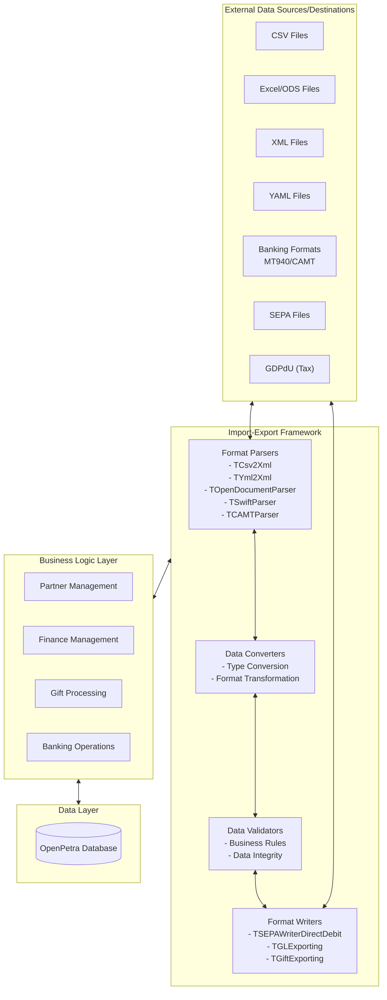
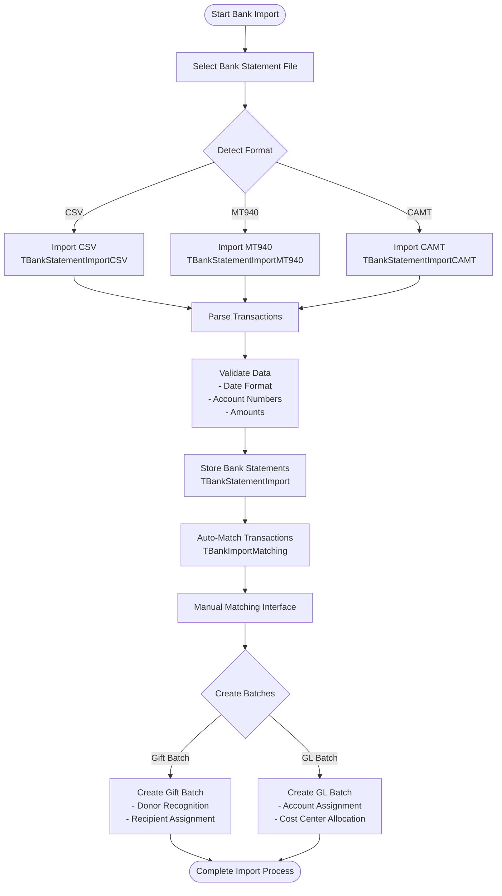
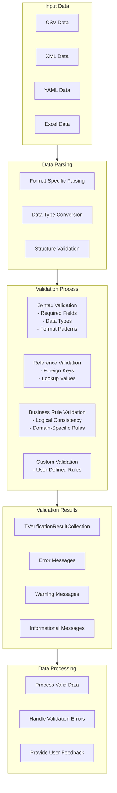

# OpenPetra's Data Import-Export Framework

## Introduction to OpenPetra's Data Import-Export Framework

OpenPetra's data import-export framework provides comprehensive capabilities for seamless data exchange with external systems and formats. This robust framework serves as the backbone for OpenPetra's interoperability, enabling users to import data from various sources and export information in multiple formats. The system supports a wide range of use cases from simple CSV imports to complex database migrations, regulatory compliance exports, and integration with financial institutions. By providing flexible data transformation tools, OpenPetra ensures that non-profit organizations can efficiently exchange information with donors, partners, financial institutions, and government agencies while maintaining data integrity and consistency.

## Core File Format Support

OpenPetra implements a versatile approach to file format handling, supporting a wide array of standard and specialized formats to accommodate various data exchange scenarios. The system's core file format support includes:

- **CSV (Comma-Separated Values)**: Extensively supported through classes like `TCsv2Xml` and `TPartnerImportCSV`, enabling import and export of partner data, financial transactions, and reference data.
  
- **XML**: Handled through classes like `TYml2Xml` which provides bidirectional conversion between XML and YAML formats, preserving hierarchical relationships.
  
- **YAML**: Supported via `TYml2Xml` and `TSimpleYmlParser`, with specialized handling for large datasets through memory-efficient parsing.
  
- **Excel (XLSX/ODS)**: Implemented through `TExcel` for direct Excel manipulation and `TCsv2Xml` for conversion between Excel and other formats. OpenDocument spreadsheets (ODS) are supported via `TOpenDocumentParser`.
  
- **Specialized Financial Formats**:
  - **SEPA**: Implemented in `TSEPAWriterDirectDebit` for creating standardized European payment files.
  - **MT940**: Banking format supported by `TSwiftParser` for importing bank statements.
  - **CAMT.052/053**: ISO 20022 XML banking formats handled by `TCAMTParser`.
  - **GDPdU**: German tax authority format implemented in specialized export tools.

The framework employs a modular architecture that separates format-specific parsing from business logic, allowing for consistent data handling regardless of the source or target format. This approach enables OpenPetra to easily adapt to new formats and evolving standards while maintaining backward compatibility with legacy systems.

## Data Import-Export Architecture

The architecture of OpenPetra's data import-export framework follows a layered design that separates concerns between parsing, validation, transformation, and business logic. External data flows through format-specific parsers that convert the data into internal representations. These are then processed by converters that handle type transformations and format adjustments. Validators ensure data integrity and compliance with business rules before the data is passed to the business logic layer. For export operations, the process is reversed, with business data flowing through writers that format it according to the target specification. This modular approach allows OpenPetra to handle diverse data formats while maintaining consistent business logic and data integrity.

## Partner Data Import-Export

OpenPetra provides robust tools for importing and exporting partner data, enabling organizations to efficiently manage contact information, relationships, and specialized attributes. The partner import-export functionality is primarily implemented through the `TImportExportWebConnector` and `TPartnerImportCSV` classes, which handle various aspects of partner data exchange.

The system supports importing partner data from multiple formats including CSV, ODS (OpenDocument Spreadsheet), and XLSX files. During import, the framework performs comprehensive validation to ensure data integrity, checking for required fields, proper formatting, and consistency with existing records. It handles different partner types (individuals, families, organizations) with their specific attributes and relationships.

Partner data export capabilities allow organizations to extract contact information in formats suitable for mail merges, external communications, and data sharing. The export functionality supports filtering by partner type, category, or custom criteria, and can include detailed information such as addresses, contact details, relationships, and specialized attributes.

Key features of the partner import-export system include:

1. **Flexible Format Support**: Handles various file formats with configurable field mappings.
2. **Data Validation**: Ensures imported data meets business rules and data integrity requirements.
3. **Duplicate Detection**: Identifies potential duplicate partners during import.
4. **Address Deduplication**: Prevents creation of duplicate addresses when multiple partners share the same location.
5. **Relationship Management**: Maintains proper relationships between partners during import/export.
6. **Special Type Handling**: Supports partner categorization through special types and attributes.
7. **Contact Detail Management**: Properly formats and validates email addresses, phone numbers, and other contact information.

The partner import-export system serves as a critical tool for organizations needing to migrate data from legacy systems, share information with external stakeholders, or maintain synchronized data across multiple platforms.

## Financial Data Exchange

OpenPetra's financial data exchange capabilities form a comprehensive ecosystem for importing and exporting financial information, supporting various accounting operations and regulatory requirements. The system handles several key financial data types:

### GL Batches and Transactions
The `TGLImporting` and `TGLExporting` classes provide functionality for importing and exporting General Ledger batches and transactions. These tools support CSV-based exchange of accounting entries, with validation for account codes, cost centers, and balanced transactions. The import process includes currency conversion handling and proper journal creation, while export can generate detailed or summarized transaction reports.

### Gift Batches
Gift data exchange is managed through `TGiftImporting` and `TGiftExporting` classes, supporting both regular and recurring gifts. The system can import gift batches from CSV files, validate donor information, and properly allocate gifts to recipients. Export functionality supports detailed gift reports with options for summarization, confidentiality handling, and currency conversion.

### Bank Statements
Bank statement import is a sophisticated subsystem handling various banking formats:
- MT940 format through `TBankStatementImportMT940`
- CAMT.052/053 formats via `TBankStatementImportCAMT`
- CSV formats with configurable column mappings in `TBankStatementImportCSV`

The imported bank statements can be matched against expected transactions, with automated matching suggestions based on amounts, dates, and transaction descriptions.

### Budget Data
The system supports importing budget data from CSV files, with handling for different budget types (fixed, split, inflation-based) and multi-year budget planning.

### SEPA Direct Debit
For European organizations, `TGiftExportingSEPA` provides functionality to export recurring gift information as SEPA Direct Debit files, complying with European banking standards for automated collection of donations.

The financial data exchange framework emphasizes data integrity, with comprehensive validation before import and consistent formatting during export. It supports multi-currency operations with exchange rate handling and provides audit trails for imported and exported financial data. This robust system enables organizations to efficiently interact with external financial systems, banks, and regulatory bodies while maintaining accurate financial records.

## Bank Import Process Flow

The bank import process in OpenPetra follows a structured flow designed to efficiently transform external bank statement data into actionable financial transactions. The process begins with file selection and format detection, where the system identifies whether the input is in CSV, MT940, or CAMT format and routes it to the appropriate parser. Each format-specific importer extracts transaction details including dates, amounts, descriptions, and account information.

After parsing, the system validates the data for consistency and completeness, checking date formats, account numbers, and transaction amounts. Valid statements are then stored in the database through the `TBankStatementImport` class, which assigns unique identifiers to each statement and transaction.

The automatic matching process (`TBankImportMatching`) then attempts to pair bank transactions with expected transactions based on amounts, dates, and descriptions. This includes matching donations to donors using IBAN numbers or transaction references. Transactions that cannot be automatically matched are presented in a manual matching interface where users can assign them to appropriate donors or accounts.

Finally, matched transactions can be converted into either gift batches (for donations) or general ledger batches (for operational expenses and other transactions). Gift batches include donor recognition and recipient assignment, while GL batches involve account and cost center allocation. This comprehensive process ensures that bank statement data is accurately integrated into OpenPetra's financial system with proper accounting treatment and donor recognition.

## Database Backup and Restoration

OpenPetra implements a robust database backup and restoration system centered around the YML.GZ format, which provides a portable, compressed representation of the entire database. This system is primarily implemented through the `TImportExportWebConnector` class, which offers methods for both exporting and importing database content.

The export process, implemented in `ExportAllTables()`, systematically extracts data from all database tables, organizing it by module (Partner, Finance, System, etc.). The data is structured in YAML format, which preserves hierarchical relationships and data types while remaining human-readable. This YAML representation is then compressed using GZip compression to reduce file size, resulting in a .yml.gz file that serves as a complete database snapshot.

For database restoration, the `ResetDatabase()` method reverses this process, reading the compressed YAML data, parsing it into table structures, and systematically populating the database tables. The import process handles dependencies between tables, ensuring that referenced data exists before dependent records are created. Special handling is provided for system tables and sequences to maintain database integrity.

Key features of this backup and restoration system include:

1. **Complete Database Representation**: Captures all tables, data, and relationships in a single file.
2. **Portable Format**: The YML.GZ format is platform-independent and can be used to migrate between different database systems.
3. **Efficient Storage**: Compression significantly reduces file size while preserving all data.
4. **Transaction Safety**: Import operations use database transactions to ensure consistency.
5. **Progress Tracking**: Long-running operations provide progress updates to users.
6. **Sequence Management**: Database sequences are properly exported and restored to maintain ID generation.

This system serves multiple purposes including full system backups, data migration between instances, and creating test environments with production-like data. The web interface in OpenPetra provides user-friendly access to these functions, allowing administrators to easily create backups or restore from previous exports.

## Regulatory Compliance Exports

OpenPetra provides specialized export tools for regulatory compliance, particularly focusing on the GDPdU format required by German tax authorities. These tools are implemented in dedicated classes within the `Ict.Petra.Tools.MFinance.Server.GDPdUExport` and `Ict.Petra.Tools.MFinance.Server.GDPdUExportIncomeTax` namespaces.

The GDPdU export functionality generates standardized CSV files containing financial data structured according to German tax authority requirements. The system exports several key data categories:

1. **GL Transactions**: Detailed transaction records with account codes, cost centers, dates, amounts, and tax-relevant analysis attributes.
2. **GL Balances**: Account balances by cost center, showing opening and closing balances for the reporting period.
3. **Accounts and Cost Centers**: Reference data defining the chart of accounts and organizational structure.
4. **Accounts Payable**: Invoice and payment information for suppliers.
5. **Worker Data**: Information about employees and their compensation.
6. **Participant Data**: Details about conference and seminar participants for tax reporting.

The export process includes sophisticated filtering capabilities to focus on relevant financial years, cost centers, and accounts while excluding internal accounts not relevant for tax reporting. It handles proper formatting of monetary values, dates, and text fields according to regulatory requirements.

Key features of the regulatory compliance export system include:

1. **Configurable Export Parameters**: Allows specification of reporting periods, included/excluded accounts, and cost centers.
2. **Standardized Output Format**: Generates files in the format expected by tax authorities.
3. **Comprehensive Data Coverage**: Includes all transaction details required for tax audits.
4. **Proper Character Encoding**: Uses Windows-1252 encoding for compatibility with German tax software.
5. **Hierarchical Cost Center Handling**: Supports organizational hierarchies in financial reporting.

These tools enable organizations to efficiently respond to tax audit requirements by generating compliant data exports that can be directly submitted to tax authorities or imported into specialized tax audit software.

## Data Validation Process

OpenPetra implements a comprehensive data validation process during import operations to ensure data integrity and business rule compliance. The validation framework is centered around the `TVerificationResultCollection` class, which aggregates validation results with different severity levels (errors, warnings, and informational messages).

The validation process begins during parsing, where format-specific parsers check for structural validity and perform initial data type conversions. For example, `TCommonImport` provides methods like `ImportString`, `ImportBoolean`, `ImportInt32`, `ImportDecimal`, and `ImportDate` that validate and convert input data while collecting any parsing errors.

After parsing, the system performs reference validation to ensure that imported data references valid entities in the database. This includes checking that account codes, cost centers, partner keys, and other foreign key values exist in the corresponding tables. The validation process also verifies that imported data meets business rules specific to each module:

1. **Partner Data Validation**: Checks for required fields like names, validates address formats, ensures proper relationship structures, and verifies contact information formats.

2. **Financial Data Validation**: Ensures balanced transactions, validates account and cost center combinations, checks currency codes, and verifies that dates fall within open accounting periods.

3. **Gift Data Validation**: Validates donor and recipient information, ensures gift types are valid, and checks that motivation codes and analysis attributes conform to system requirements.

4. **Bank Import Validation**: Verifies transaction dates, account numbers, and transaction amounts, ensuring they can be properly matched to internal records.

The validation results are collected in a `TVerificationResultCollection` object, which is returned to the calling code for appropriate handling. Based on the validation results, the system may:

1. Proceed with processing valid data
2. Reject the entire import if critical errors are found
3. Process valid records while skipping invalid ones
4. Present validation issues to the user for resolution

This multi-layered validation approach ensures that only valid, consistent data enters the system, maintaining data integrity while providing clear feedback about any issues encountered during the import process.

## Template-Based Exports

OpenPetra's template-based export system provides a flexible framework for generating reports and documents from internal data. This system is primarily implemented through the `ProcessTemplate` and `HTMLTemplateProcessor` classes, which handle different aspects of template processing.

The `ProcessTemplate` class provides a general-purpose template engine that supports:
- Placeholder substitution with `{PLACEHOLDER}` syntax
- Template inclusion with `{#INCLUDE filename}` directives
- Conditional sections with `{#IFDEF condition}...{#ENDIF}` blocks
- Reusable code snippets with `{##name}...{##}` definitions
- Proper indentation preservation during content insertion

The `HTMLTemplateProcessor` extends these capabilities specifically for HTML templates, adding:
- SQL query extraction and execution from template comments
- Parameter formatting with type-specific rules
- Conditional processing based on query results
- Conversion of HTML tables to Excel spreadsheets

For financial and partner data, specialized export classes like `TGiftExporting` and `TGLExporting` generate CSV data that can be further processed or converted to Excel format. These classes support various formatting options, data summarization, and filtering capabilities.

The template-based export system integrates with OpenPetra's form letter functionality through the `TFormLetterInfo` and related classes, which prepare partner data for mail merge operations. This includes handling of formality levels, address formatting, and specialized financial data for donor communications.

Key features of the template-based export system include:

1. **Flexible Template Syntax**: Supports a wide range of template directives and placeholder formats.
2. **Multiple Output Formats**: Can generate HTML, PDF, Excel, and text outputs from the same templates.
3. **Data-Driven Content**: Templates can include conditional sections based on data values.
4. **Reusable Components**: Supports template inclusion and code snippet reuse.
5. **Formatting Control**: Provides fine-grained control over data formatting in the output.
6. **Multi-language Support**: Templates can include localized text and formatting.

This powerful template system enables organizations to create standardized yet customizable reports, letters, receipts, and other documents that incorporate data from OpenPetra's database while maintaining consistent formatting and branding.

## Integration with External Systems

OpenPetra's import-export framework facilitates integration with a wide range of external systems and services through its flexible data exchange capabilities. The system's architecture is designed to accommodate various integration scenarios, from simple file-based data exchange to more complex API-based integrations.

For financial systems integration, OpenPetra provides specialized connectors for banking interfaces, supporting standard formats like MT940, CAMT.052/053, and SEPA. These connectors enable automated import of bank statements and export of payment instructions, facilitating seamless interaction with banking systems. The `TBankImportWebConnector` class orchestrates these operations, handling format detection, data parsing, and transaction matching.

Integration with accounting systems is supported through GL batch import and export functionality, allowing OpenPetra to exchange transaction data with external accounting packages. The standardized CSV formats for GL transactions enable bidirectional data flow between systems, with proper handling of account codes, cost centers, and currency conversion.

For CRM and donor management systems, the partner import-export functionality provides comprehensive data exchange capabilities. The system can import contact information, relationships, and categorization data from external sources, and export partner data for use in external communication tools or data analysis systems.

The system's extensible architecture allows for the development of custom importers and exporters to handle specialized formats or integration requirements. Key extension points include:

1. **Format Parsers**: New parsers can be added to support additional file formats.
2. **Data Converters**: Custom conversion logic can be implemented for specialized data transformations.
3. **Validation Rules**: Business-specific validation can be added to ensure data meets organizational requirements.
4. **Export Formatters**: Custom formatters can generate output in formats required by specific external systems.

Integration is further facilitated by OpenPetra's web API, which provides programmatic access to import-export functionality. This enables automated data exchange scenarios where external systems can trigger imports or request exports without manual intervention.

The combination of standardized format support, flexible data mapping, comprehensive validation, and extensible architecture makes OpenPetra a versatile hub for data integration in non-profit organizations, capable of connecting with financial systems, CRM tools, reporting platforms, and regulatory compliance systems.

## Future Directions and Extensibility

OpenPetra's import-export framework is designed with extensibility as a core principle, allowing for adaptation to emerging formats and integration scenarios. The modular architecture separates format-specific parsing from business logic, enabling new formats to be added without modifying core functionality.

Several architectural features support future extensibility:

1. **Format-Agnostic Business Logic**: Core business operations are separated from format-specific code, allowing new formats to be supported by adding parsers and formatters without changing business rules.

2. **Pluggable Format Handlers**: The system uses a factory pattern approach where format handlers can be registered and discovered dynamically.

3. **Configurable Mapping**: Field mappings between external formats and internal data structures are configurable, allowing adaptation to varying file layouts without code changes.

4. **Validation Framework**: The extensible validation framework allows new validation rules to be added as requirements evolve.

5. **Template-Based Exports**: The template system enables new output formats to be created without modifying code.

Potential future directions for the import-export framework include:

1. **Enhanced API Integration**: Expanding direct API connections to external systems beyond file-based exchanges.

2. **Real-Time Data Synchronization**: Moving beyond batch processing to support real-time data exchange with external systems.

3. **Advanced Matching Algorithms**: Implementing machine learning techniques for improved transaction matching and duplicate detection.

4. **Additional Financial Formats**: Supporting emerging financial data standards and country-specific banking formats.

5. **Enhanced Regulatory Reporting**: Expanding compliance reporting capabilities for different jurisdictions and regulatory requirements.

6. **Cloud Storage Integration**: Direct integration with cloud storage services for import/export operations.

7. **Mobile Data Capture**: Supporting data import from mobile devices and applications.

The framework's extensible design ensures that OpenPetra can adapt to changing requirements and new integration scenarios while maintaining backward compatibility with existing data exchange processes. This flexibility is crucial for non-profit organizations that must interact with an evolving ecosystem of financial institutions, donors, partners, and regulatory bodies.

[Generated by the Sage AI expert workbench: 2025-03-30 02:22:57  https://sage-tech.ai/workbench]: #