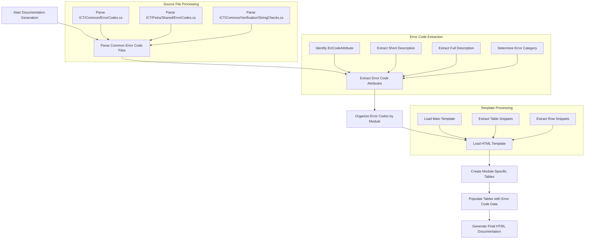
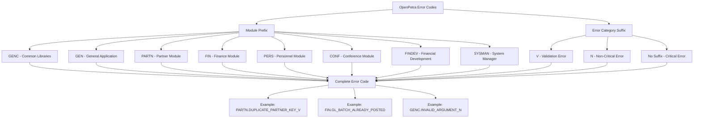
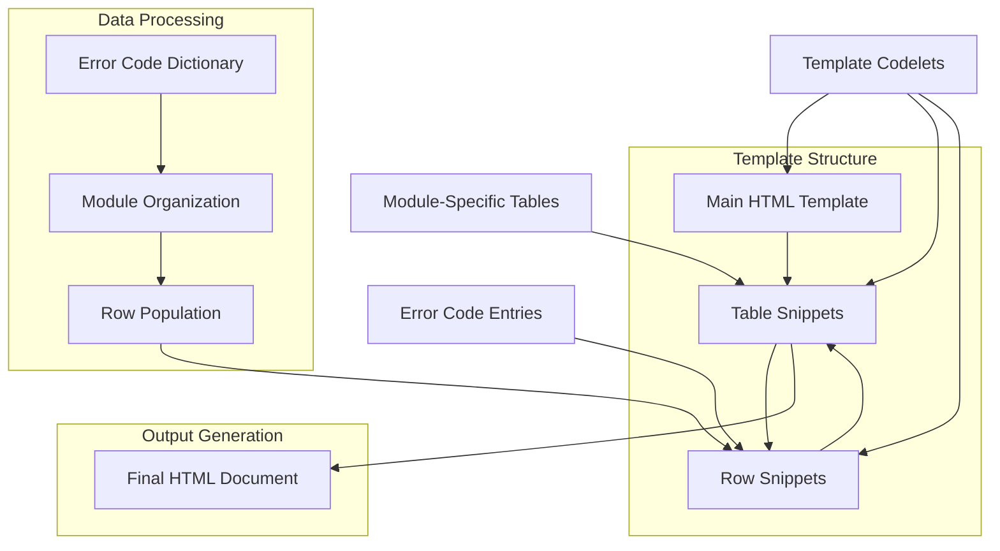
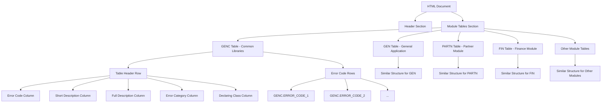

# OpenPetra Documentation Tools

## Overview of OpenPetra Documentation Tools

OpenPetra's documentation generation tools play a crucial role in maintaining comprehensive and up-to-date documentation for this open-source non-profit management system. These automated tools ensure that technical documentation remains synchronized with the codebase as it evolves, reducing the burden of manual documentation maintenance. The documentation generation system is designed to extract metadata directly from the source code, ensuring accuracy and completeness. The primary focus of this analysis is the error code documentation generator, which automatically creates structured HTML documentation by parsing error code definitions throughout the OpenPetra codebase, making it easier for developers and implementers to understand and troubleshoot issues within the system.

## Error Code Documentation Generator

The `TGenerateErrorCodeDoc` class is a specialized tool designed to automatically create HTML documentation for error codes used throughout the OpenPetra system. This class operates by parsing C# source files to extract error code definitions, their descriptions, categories, and other metadata. The implementation leverages ICSharpCode.NRefactory for C# code parsing, enabling it to extract structured information from attribute-decorated error code constants.

The core functionality is orchestrated through the `Execute()` method, which processes key source files containing error code definitions (such as `ICT/Common/ErrorCodes.cs` and `ICT/Petra/Shared/ErrorCodes.cs`). The tool identifies error codes by looking for fields decorated with the `ErrCodeAttribute` attribute, extracting both short descriptions (mandatory positional arguments) and full descriptions (optional named arguments). The extracted information is organized into a dictionary keyed by error code value, with each entry containing comprehensive metadata about the error code.

The documentation generator employs a template-based approach for output generation, creating separate tables for different modules (General, Partner, Finance, etc.) and populating them with the extracted error code information. This modular approach allows for well-organized documentation that can be easily navigated by developers seeking information about specific error categories or modules.

## Error Code Documentation Generation Process Flow

The diagram illustrates the complete workflow of the error code documentation generation process. The process begins by parsing key source files that contain error code definitions. Using NRefactory, the tool analyzes the abstract syntax tree of each file to identify fields decorated with the `ErrCodeAttribute`. For each identified error code, it extracts the short description (mandatory positional argument), full description (optional named argument), and determines the error category based on the suffix of the error code. 

The extracted information is then organized by module based on the error code prefix. The tool loads an HTML template and creates module-specific tables, populating each with the relevant error codes. This structured approach ensures that the generated documentation is well-organized and easily navigable, allowing developers to quickly find information about specific error types or modules.

## Error Code Classification System

OpenPetra implements a sophisticated error code classification system that categorizes errors based on both their severity and functional module. The system uses a hierarchical approach to error code organization, with each error code containing information about its module affiliation and severity level.

Error codes are primarily categorized into three severity levels:
1. **Validation Errors** (suffix 'V'): These represent input validation issues that prevent data from being processed correctly but don't represent system failures.
2. **Non-Critical Errors** (suffix 'N'): These indicate problems that the system can recover from without significant impact on functionality.
3. **Critical Errors** (no specific suffix): These represent serious issues that may impact system stability or data integrity.

The module affiliation is indicated by a prefix in the error code, such as:
- **GENC**: General errors specific to the Ict.Common libraries
- **GEN**: General errors across the OpenPetra application
- **PARTN**: Partner module errors
- **PERS**: Personnel module errors
- **FIN**: Finance module errors
- **CONF**: Conference module errors
- **FINDEV**: Financial Development module errors
- **SYSMAN**: System Manager module errors

This classification system enables developers to quickly identify the source and severity of an error, facilitating more efficient troubleshooting and resolution. The documentation generator preserves this classification in the generated HTML, organizing error codes into tables by module and including the error category in each entry.

## Error Code Structure and Organization

The diagram illustrates the hierarchical structure of OpenPetra's error code system. Each error code consists of two main components: a module prefix that identifies the functional area of the system where the error occurs, and an optional suffix that indicates the error category or severity.

The module prefix provides immediate context about where in the system the error originates, making it easier to locate the relevant code. The error category suffix provides information about the severity and nature of the error, helping developers prioritize issues and determine appropriate handling strategies.

This structured approach to error codes creates a consistent and intuitive system that facilitates both documentation and programmatic error handling throughout the application. The documentation generator leverages this structure to organize the generated HTML documentation in a logical manner, grouping errors by module and providing clear information about each error's category.

## Template-Based Documentation Generation

The error code documentation generator employs a sophisticated template-based approach to create consistent and well-structured HTML documentation. This approach separates the content (error code information) from the presentation (HTML formatting), allowing for flexible and maintainable documentation generation.

The system uses a main HTML template that defines the overall structure of the documentation, with placeholders for module-specific tables. Each table is generated using a table snippet template, which defines the structure of a module-specific table, including headers for error code, short description, full description, category, and declaring class.

Within each table, individual error codes are represented using a row snippet template, which defines how each error code's information is formatted within the table. The generator populates these templates with the extracted error code information, creating a complete and well-formatted HTML document.

This template-based approach offers several advantages:
1. **Consistency**: All error codes are documented in a consistent format
2. **Maintainability**: Changes to the documentation format can be made by modifying the templates rather than the code
3. **Separation of concerns**: The logic for extracting error code information is separate from the presentation logic
4. **Flexibility**: Different templates could be used to generate documentation in different formats or styles

The implementation uses the `ProcessTemplate` class to manage templates, with methods like `GetSnippet()` to extract specific template sections and `SetCodelet()` to populate placeholders with content. This structured approach ensures that the generated documentation is both comprehensive and easy to navigate.

## Template Processing Architecture

The diagram illustrates the architecture of the template processing system used by the error code documentation generator. The system uses a hierarchical template structure, with a main HTML template containing placeholders for module-specific tables, which in turn contain placeholders for individual error code rows.

The process begins with the extraction of error code information from source files, which is stored in a dictionary. This information is then organized by module based on the error code prefix. For each module, the system creates a table using the table snippet template, and populates it with rows for each error code using the row snippet template.

The template system uses "codelets" as placeholders within templates, which are replaced with actual content during the generation process. This approach allows for flexible and dynamic content generation, with the structure defined by the templates and the content provided by the extracted error code information.

The final HTML document is created by assembling all the populated templates into a cohesive structure, with module-specific tables organized in a logical manner. This architecture ensures that the generated documentation is well-structured, consistent, and easy to navigate, while also being maintainable and extensible.

## Source Code Parsing with NRefactory

The error code documentation generator leverages ICSharpCode.NRefactory, a powerful C# parsing library, to analyze source code and extract error code information. NRefactory provides a complete abstract syntax tree (AST) representation of C# code, allowing the tool to navigate through class declarations, field declarations, and attributes with precision.

The parsing process begins with the `CSParser` class, which uses NRefactory to parse C# source files into an AST. The `ProcessFile()` method then traverses this AST, focusing on field declarations that represent error code constants. For each field, it examines the attached attributes to identify those decorated with the `ErrCodeAttribute`.

When an error code attribute is found, the tool extracts several pieces of information:
1. The error code value from the field initializer
2. The short description from the attribute's positional argument
3. The full description from the attribute's named argument (if present)
4. The error category, determined by analyzing the error code suffix

The `ExpressionToString()` method handles the conversion of complex expressions (such as concatenated strings) into string representations, ensuring that multi-line or formatted descriptions are properly captured.

This approach allows the documentation generator to extract rich metadata directly from the source code, ensuring that the documentation accurately reflects the actual error codes used in the system. By parsing the source code directly rather than relying on external documentation sources, the tool ensures that the documentation remains synchronized with the code, even as new error codes are added or existing ones are modified.

## Documentation Output Structure

The error code documentation generator produces a comprehensive HTML document that organizes error codes in a logical and easily navigable structure. The generated documentation is organized primarily by module, with separate tables for each functional area of the system (General, Partner, Finance, etc.).

Each module table includes a descriptive header that clearly identifies the module, followed by a table with columns for:
1. **Error Code**: The full error code identifier (e.g., "PARTN.DUPLICATE_PARTNER_KEY_V")
2. **Short Description**: A concise description of the error
3. **Full Description**: A more detailed explanation of the error, its causes, and potential resolutions
4. **Error Category**: The classification of the error (Validation, Non-critical Error, or Error)
5. **Declaring Class**: The C# class where the error code is defined

This structured approach allows developers to quickly locate information about specific error codes, either by browsing the relevant module table or by using browser search functionality to find a specific error code. The inclusion of both short and full descriptions provides different levels of detail, allowing for both quick reference and in-depth understanding.

The HTML format makes the documentation easily accessible through any web browser, with no special tools required for viewing. The consistent formatting across all error codes ensures that the documentation is easy to read and navigate, even as the number of error codes grows over time.

## Error Code Documentation HTML Structure

The diagram illustrates the structure of the HTML documentation generated by the error code documentation tool. The document follows a hierarchical organization, starting with a header section that provides an overview of the error code system, followed by a series of module-specific tables.

Each module table has a consistent structure, with a header row defining the columns (Error Code, Short Description, Full Description, Error Category, and Declaring Class) and multiple rows containing information about individual error codes. The tables are organized by module prefix, making it easy to locate errors related to specific functional areas of the system.

This structured approach to documentation ensures that error codes are presented in a logical and consistent manner, facilitating quick reference and comprehensive understanding. The HTML format allows for easy navigation, with the ability to use browser search functionality to locate specific error codes or descriptions. The consistent structure across all module tables ensures that users can quickly become familiar with the documentation format, regardless of which module they are working with.

## Integration with OpenPetra Build Process

The error code documentation generator is seamlessly integrated into OpenPetra's build process, ensuring that documentation remains current with code changes. This integration is a critical aspect of maintaining accurate and comprehensive documentation in a continuously evolving codebase.

The documentation generation is typically triggered as part of the build process, running after the compilation of source code but before the assembly of the final application. This timing ensures that the documentation reflects the most recent changes to error codes, including any additions, modifications, or removals.

The integration is achieved through build scripts that invoke the `TGenerateErrorCodeDoc.Execute()` method with appropriate parameters for source code path, template file path, and output file path. These parameters can be configured to accommodate different build environments or documentation requirements.

By automating the documentation generation as part of the build process, OpenPetra ensures that:
1. Documentation is always up-to-date with the current codebase
2. Developers don't need to remember to update documentation separately
3. Documentation changes are version-controlled alongside code changes
4. Documentation is consistently formatted according to the templates

This integration exemplifies a best practice in software development: treating documentation as a first-class artifact that is generated and maintained alongside the code itself, rather than as an afterthought or separate process.

## Benefits and Future Enhancements

The automated error code documentation generator provides several significant benefits to the OpenPetra project:

1. **Consistency**: All error codes are documented in a uniform format, making the documentation easier to navigate and understand.
2. **Accuracy**: By extracting information directly from source code, the documentation accurately reflects the actual error codes used in the system.
3. **Maintainability**: As new error codes are added or existing ones modified, the documentation is automatically updated, eliminating the need for manual documentation maintenance.
4. **Completeness**: The automated process ensures that all error codes are documented, not just those that developers remember to document manually.
5. **Integration**: The documentation is integrated with the build process, ensuring it stays synchronized with the codebase.

Potential future enhancements to the documentation tools could include:

1. **Cross-referencing**: Adding links between related error codes or to relevant sections of the user manual.
2. **Search functionality**: Implementing a client-side search feature to quickly locate specific error codes or descriptions.
3. **Categorization enhancements**: Adding additional categorization options, such as by severity level or functional area.
4. **Localization support**: Extending the documentation to include translations of error messages for multilingual support.
5. **Interactive examples**: Adding interactive examples or troubleshooting guides for common error scenarios.
6. **Integration with logging**: Linking error codes to log analysis tools to help diagnose issues in production environments.
7. **API documentation integration**: Connecting error code documentation with API documentation to provide a comprehensive reference for developers.

These enhancements would further improve the utility of the documentation, making it an even more valuable resource for developers, administrators, and support personnel working with the OpenPetra system.

[Generated by the Sage AI expert workbench: 2025-03-30 02:22:57  https://sage-tech.ai/workbench]: #