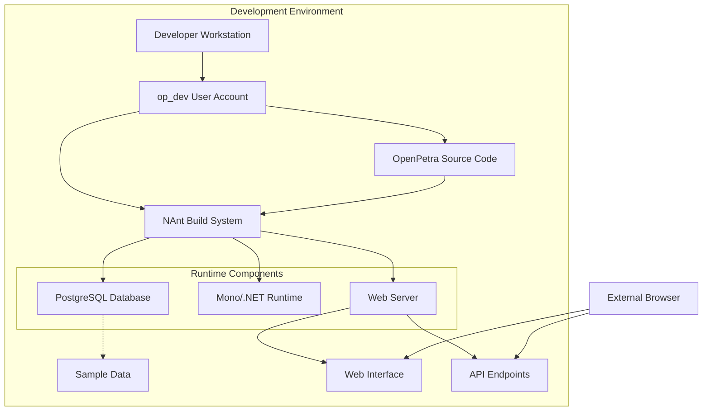
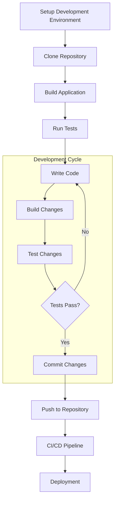
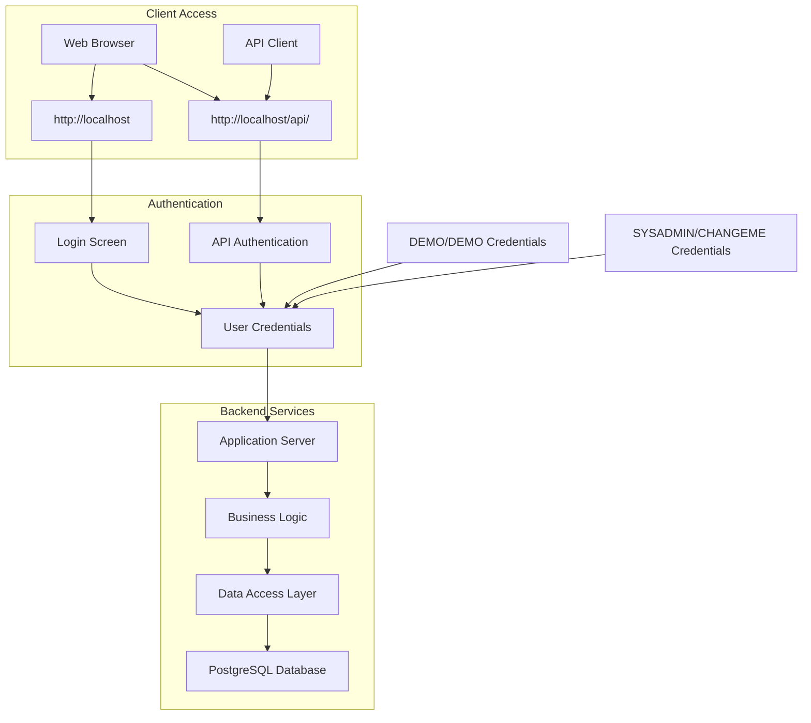
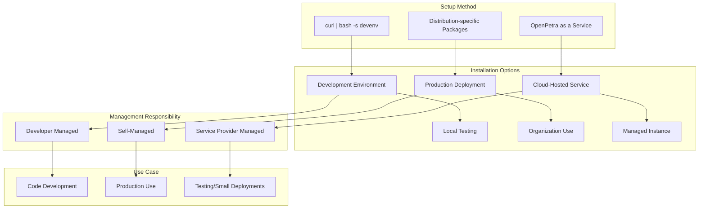

# OpenPetra Development Environment Setup

## Introduction to OpenPetra Setup

OpenPetra is a comprehensive open-source administration system specifically designed for non-profit organizations. It provides integrated Customer Relationship Management (CRM) and Enterprise Resource Planning (ERP) functionality with a particular emphasis on donation processing and receipting. The system aims to help non-profit organizations streamline their administrative operations, reduce costs, and simplify training. OpenPetra's core functionality includes contact management, accounting, sponsorship management, and donation processing, making it a versatile platform for organizations that need to manage both relationships and finances in an integrated environment.

## Development Environment Setup Process

OpenPetra offers a remarkably streamlined setup process for developers through a single command that leverages curl to download and execute a setup script. This approach eliminates the complexity typically associated with configuring development environments for enterprise applications. The command `curl https://get.openpetra.org | bash -s devenv` automatically installs all necessary components including the database server, application server, development tools, and dependencies. This installation method creates a dedicated user account (`op_dev`) with the appropriate permissions and directory structure, ensuring a consistent development environment across different systems. The setup script handles distribution-specific package management, dependency resolution, and configuration, making the process virtually identical regardless of which supported Linux distribution is being used.

## OpenPetra Development Environment Architecture

The diagram illustrates the architecture of the OpenPetra development environment after setup. The installation process creates a dedicated `op_dev` user account that contains the OpenPetra source code and the NAnt build system. The runtime components include a PostgreSQL database (pre-configured with sample data for development), the Mono/.NET runtime environment, and a web server for hosting the application. Developers can access the application through a web browser, connecting to either the web interface or the API endpoints. The NAnt build system serves as the central orchestration tool, managing the interaction between the source code and the runtime components during development, testing, and deployment activities.

## Supported Operating Systems

OpenPetra's development environment is officially supported on several major Linux distributions, ensuring flexibility for developers with different preferences. The supported distributions include CentOS 8-Stream, which provides a stable enterprise-grade foundation; Fedora 36, offering more recent packages for those who prefer cutting-edge technology; Debian Buster (10) and Bullseye (11), known for their stability and security; and Ubuntu LTS versions (specifically Focal 20.04 and Jammy 22.04), which provide long-term support and are widely used in development environments. The setup script automatically detects the distribution and applies the appropriate installation procedures, ensuring that all required dependencies are correctly installed regardless of the underlying package management system (yum/dnf for CentOS/Fedora or apt for Debian/Ubuntu).

## Development Commands and Workflow

After installation, developers work primarily through the NAnt build system, which provides a comprehensive set of commands for various development tasks. These commands are accessible after logging in as the `op_dev` user and navigating to the OpenPetra directory. Running `nant help` displays a list of available commands, which include building the application, running tests, generating documentation, and deploying the application. The NAnt system abstracts away many of the complexities of working with the underlying technologies, providing a consistent interface for development tasks. This approach allows developers to focus on writing code rather than managing build processes, and ensures that all team members follow consistent practices regardless of their individual development environments.

## OpenPetra Development Workflow

The diagram illustrates the typical development workflow for OpenPetra, beginning with the environment setup using the curl command. After setup, developers clone the repository and build the application using NAnt commands. The development cycle consists of writing code, building changes, testing those changes, and committing successful changes to the repository. The workflow emphasizes test-driven development, with tests being run both locally and in the CI/CD pipeline before deployment. This structured approach ensures code quality and consistency across the project. The NAnt build system facilitates each step of this workflow, providing commands for building, testing, and deploying the application, while the dedicated development environment ensures that all developers work in a consistent context.

## Testing and Access Methods

Once the OpenPetra development environment is set up, developers can access and test the installation through multiple interfaces. The primary access point is the web interface available at http://localhost, which provides the full user experience. Additionally, the API endpoints are accessible at http://localhost/api/, allowing for direct interaction with the backend services for testing and integration purposes. The system comes preconfigured with default credentials: either username "DEMO" with password "DEMO" for a restricted user experience, or username "SYSADMIN" with password "CHANGEME" for administrative access. These credentials should only be used for local development and testing purposes. The development environment also includes sample data that allows for comprehensive testing of various features without the need to manually create test data.

## OpenPetra Access Points

The diagram illustrates the various access points to OpenPetra and how they connect to the backend services. Users can access the system through a web browser, connecting either to the main web interface at http://localhost or directly to the API endpoints at http://localhost/api/. API clients can also connect directly to the API endpoints for programmatic access. Both access methods require authentication through the login screen or API authentication mechanisms, using either the DEMO or SYSADMIN credentials. Once authenticated, requests are processed by the application server, which implements the business logic and interacts with the data access layer to retrieve or modify data in the PostgreSQL database. This architecture provides flexibility for different types of interactions with the system while maintaining a consistent security model.

## Third-Party Components Management

OpenPetra carefully manages its third-party dependencies through a structured approach centered on the ThirdParty directory within the codebase. This directory contains all external libraries and components that OpenPetra depends on, each with its own subdirectory that includes the necessary license and readme files. The project explicitly acknowledges that these components are not part of OpenPetra itself and directs users to the respective license files for information about copyright holders and usage terms. This approach ensures compliance with the various open-source licenses that these components are distributed under. The development environment setup process automatically handles these dependencies, ensuring that the correct versions are installed and configured. This structured approach to third-party component management helps maintain license compliance while providing developers with the tools they need.

## Demo and Testing Resources

OpenPetra provides several resources for testing and demonstration purposes. A public demo instance is available at https://demo.openpetra.org, allowing potential users to explore the system's functionality without installing it. This demo environment is reset periodically and is intended for exploration rather than for entering real data. Additionally, OpenPetra offers a free test installation service through https://openpetra.ossaas.de, providing organizations with their own isolated instance for more extensive testing with their specific use cases. These resources complement the local development environment, allowing developers to compare their local changes with the standard installation and to demonstrate features to stakeholders without requiring them to set up their own environments.

## OpenPetra Installation Options

The diagram compares different OpenPetra installation options, highlighting their setup methods, management responsibilities, and typical use cases. The development environment, set up using the curl command, is developer-managed and primarily intended for code development and local testing. Production deployments use distribution-specific packages and are self-managed by the organization, designed for actual production use with real data. Cloud-hosted services, available through OpenPetra as a Service, are managed by the service provider and are suitable for testing or small deployments where organizations prefer not to manage their own infrastructure. Each option has its own advantages depending on the specific needs of the user or organization, providing flexibility in how OpenPetra can be deployed and used.

## Community Support and Resources

OpenPetra maintains an active community with resources available in multiple languages to support users and developers. The primary community hub is the English forum at https://forum.openpetra.org, which serves as a central point for discussions, questions, and announcements. For German-speaking users, a dedicated forum is available at https://forum.openpetra.de. These forums provide a platform for users to share experiences, ask questions, and receive support from both the development team and other community members. The project website at www.openpetra.org offers additional resources including documentation, case studies, and information about the project's roadmap. The development team actively monitors these community resources and uses feedback to guide the project's development priorities, ensuring that OpenPetra continues to meet the needs of its user base.

[Generated by the Sage AI expert workbench: 2025-03-30 02:22:57  https://sage-tech.ai/workbench]: #