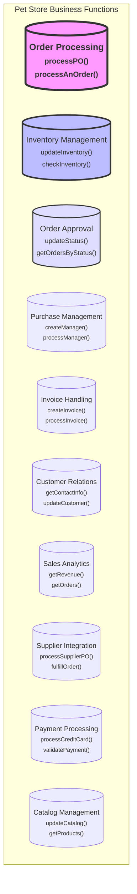
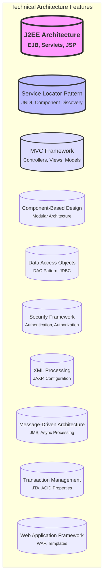

# J2EE Pet Store Topics

## Business Functions Mind Map



## Technical Architecture Mind Map



## Business Functions List

1. **Order Processing** (Largest) - Core business function handling purchase orders, order fulfillment, and order lifecycle management
2. **Inventory Management** - Manages product stock levels and inventory updates
3. **Order Approval** - Handles order status updates and approval workflows
4. **Purchase Management** - Manages the purchase process and workflow
5. **Invoice Handling** - Processes invoices and billing documents
6. **Customer Relations** - Manages customer information and interactions
7. **Sales Analytics** - Handles revenue tracking and order analytics
8. **Supplier Integration** - Manages supplier interactions and purchase orders
9. **Payment Processing** - Handles credit card and payment validation
10. **Catalog Management** - Manages product catalog and listings

## Technical Architecture List

1. **J2EE Architecture** (Largest) - The core enterprise Java platform features including EJB containers, servlets, and JSP
2. **Service Locator Pattern** - Centralized component and service discovery using JNDI
3. **MVC Framework** - Model-View-Controller architecture implementation
4. **Component-Based Design** - Modular architecture with independent components
5. **Data Access Objects** - Database abstraction layer with DAO pattern
6. **Security Framework** - Authentication and authorization mechanisms
7. **XML Processing** - Extensive XML configuration and document handling
8. **Message-Driven Architecture** - Asynchronous processing using JMS
9. **Transaction Management** - JTA-based transaction handling
10. **Web Application Framework** - Custom WAF implementation with templating

## JSON Structures

### Business Functions JSON

```json
{
  "business_functions": [
    {
      "name": "Order Processing",
      "description": "Core business function handling purchase orders, order fulfillment, and order lifecycle management",
      "importance": "primary",
      "related_components": [
        "purchase orders",
        "order fulfillment",
        "lifecycle management"
      ]
    },
    {
      "name": "Inventory Management",
      "description": "Manages product stock levels and inventory updates",
      "importance": "high",
      "related_components": [
        "stock levels",
        "inventory tracking",
        "updates"
      ]
    },
    {
      "name": "Order Approval",
      "description": "Handles order status updates and approval workflows",
      "importance": "high",
      "related_components": [
        "status updates",
        "approval workflows",
        "order validation"
      ]
    },
    {
      "name": "Purchase Management",
      "description": "Manages the purchase process and workflow",
      "importance": "medium",
      "related_components": [
        "purchase process",
        "workflow management"
      ]
    },
    {
      "name": "Invoice Handling",
      "description": "Processes invoices and billing documents",
      "importance": "medium",
      "related_components": [
        "invoices",
        "billing",
        "document processing"
      ]
    },
    {
      "name": "Customer Relations",
      "description": "Manages customer information and interactions",
      "importance": "medium",
      "related_components": [
        "customer info",
        "interactions",
        "relationship management"
      ]
    },
    {
      "name": "Sales Analytics",
      "description": "Handles revenue tracking and order analytics",
      "importance": "medium",
      "related_components": [
        "revenue tracking",
        "order analytics",
        "reporting"
      ]
    },
    {
      "name": "Supplier Integration",
      "description": "Manages supplier interactions and purchase orders",
      "importance": "medium",
      "related_components": [
        "supplier interactions",
        "purchase orders",
        "integration"
      ]
    },
    {
      "name": "Payment Processing",
      "description": "Handles credit card and payment validation",
      "importance": "medium",
      "related_components": [
        "credit card processing",
        "payment validation",
        "transaction security"
      ]
    },
    {
      "name": "Catalog Management",
      "description": "Manages product catalog and listings",
      "importance": "medium",
      "related_components": [
        "product catalog",
        "listings",
        "catalog maintenance"
      ]
    }
  ]
}
```

### Technical Architecture JSON

```json
{
  "technical_features": [
    {
      "name": "J2EE Architecture",
      "description": "The core enterprise Java platform features including EJB containers, servlets, and JSP",
      "importance": "primary",
      "related_components": [
        "EJB containers",
        "Servlets",
        "JavaServer Pages (JSP)",
        "Enterprise JavaBeans",
        "Container management"
      ]
    },
    {
      "name": "Service Locator Pattern",
      "description": "Centralized component and service discovery using JNDI",
      "importance": "high",
      "related_components": [
        "JNDI lookups",
        "Component discovery",
        "Service caching",
        "Resource management",
        "Dependency injection"
      ]
    },
    {
      "name": "MVC Framework",
      "description": "Model-View-Controller architecture implementation",
      "importance": "high",
      "related_components": [
        "Controllers",
        "View templates",
        "Model components",
        "Request processing",
        "Screen flow management"
      ]
    },
    {
      "name": "Component-Based Design",
      "description": "Modular architecture with independent components",
      "importance": "medium",
      "related_components": [
        "Modular components",
        "Interface definitions",
        "Component lifecycle",
        "Dependency management",
        "Module integration"
      ]
    },
    {
      "name": "Data Access Objects",
      "description": "Database abstraction layer with DAO pattern",
      "importance": "medium",
      "related_components": [
        "DAO implementations",
        "JDBC integration",
        "Database connectivity",
        "SQL management",
        "Data mapping"
      ]
    },
    {
      "name": "Security Framework",
      "description": "Authentication and authorization mechanisms",
      "importance": "medium",
      "related_components": [
        "Authentication",
        "Authorization",
        "Role management",
        "Security constraints",
        "Form-based login"
      ]
    },
    {
      "name": "XML Processing",
      "description": "Extensive XML configuration and document handling",
      "importance": "medium",
      "related_components": [
        "JAXP implementation",
        "XML parsing",
        "Configuration management",
        "Document processing",
        "XML validation"
      ]
    },
    {
      "name": "Message-Driven Architecture",
      "description": "Asynchronous processing using JMS",
      "importance": "medium",
      "related_components": [
        "JMS integration",
        "Message-driven beans",
        "Async processing",
        "Queue management",
        "Event handling"
      ]
    },
    {
      "name": "Transaction Management",
      "description": "JTA-based transaction handling",
      "importance": "medium",
      "related_components": [
        "JTA implementation",
        "Transaction boundaries",
        "ACID properties",
        "Rollback management",
        "Commit handling"
      ]
    },
    {
      "name": "Web Application Framework",
      "description": "Custom WAF implementation with templating",
      "importance": "medium",
      "related_components": [
        "Template system",
        "Request handling",
        "Response processing",
        "View rendering",
        "Component management"
      ]
    }
  ]
}
``` 