# Java Pet Store Project Overview

## Executive Summary

The Java Pet Store 1.3.2 is a reference implementation developed by Sun Microsystems as part of the Java 2 Platform, Enterprise Edition (J2EE) BluePrints Program. This application demonstrates best practices for building enterprise applications using J2EE technologies, serving as a blueprint for developers to understand and implement architectural patterns in their own applications.

The Pet Store application simulates an e-commerce platform for pet products, showcasing a comprehensive implementation of core J2EE components including Enterprise JavaBeans (EJB), JavaServer Pages (JSP), Java Servlets, and Java Message Service (JMS). Its primary value lies in demonstrating a flexible, scalable, and maintainable architecture that addresses common challenges in enterprise application development.

As a reference implementation, Java Pet Store has significantly influenced enterprise Java development practices. It illustrates design patterns like Model-View-Controller (MVC), Service Locator, Data Access Objects (DAO), and Business Delegates, along with best practices for internationalization, transaction management, and security.

## Application Purpose

The Java Pet Store application serves as an e-commerce platform for pet products with these key functionalities:

1. **Product Catalog Management**: A hierarchical system enabling customers to browse, search, and view detailed information about pet products organized by categories.

2. **Shopping Cart Management**: Allows users to add items to a cart, modify quantities, and prepare for checkout.

3. **Order Processing**: Comprehensive order workflow including checkout, payment processing, order confirmation, and fulfillment.

4. **Customer Account Management**: User registration, profile management, and order history tracking.

5. **Administration Functions**: Backend capabilities for managing the product catalog, inventory, and orders.

The application demonstrates practical implementation of business processes common to e-commerce platforms while showcasing J2EE architectural patterns and best practices. Though designed as a learning tool rather than a production system, it provides a complete and functional application experience that effectively demonstrates enterprise application architecture.

## Reference Implementation Value

As a reference implementation, Java Pet Store provides exceptional value to the Java enterprise development community:

1. **Architectural Blueprint**: Demonstrates a complete, working implementation of J2EE design patterns and architectural best practices in a real-world context.

2. **Learning Resource**: Offers developers a concrete example of how to implement abstract J2EE concepts and patterns in actual code.

3. **Standards Demonstration**: Showcases the practical application of J2EE standards and APIs in a cohesive application.

4. **Best Practices Codification**: Encapsulates Sun's recommended approaches to solving common enterprise application challenges.

5. **Pattern Illustration**: Provides working examples of design patterns including MVC, Service Locator, DAO, and Business Delegates.

By studying and extending Java Pet Store, developers can gain insights into architectural decisions, code organization, and implementation techniques that apply to their own enterprise projects. Its value extends beyond the specific technologies used, offering timeless principles of good software architecture that remain relevant even as frameworks and platforms evolve.

## Architectural Foundation

The Java Pet Store architecture is built on solid design principles that enable scalability, maintainability, and flexibility:

1. **Layered Architecture**: Clear separation between presentation, business logic, and data access layers.

2. **Design Pattern Implementation**: Practical application of established patterns:
    - Model-View-Controller (MVC) for UI organization
    - Service Locator for resource discovery
    - Data Access Objects (DAO) for database abstraction
    - Business Delegates for separating presentation from business logic
    - Front Controller for centralized request handling

3. **Component-Based Design**: Modular components with well-defined interfaces enabling independent development and testing.

4. **Stateless Components**: Emphasis on stateless services to improve scalability and facilitate clustering.

5. **Configurable Implementation**: Extensive use of configuration files to customize behavior without code changes.

The architecture demonstrates a balance between theoretical correctness and practical implementation, showing how abstract design principles translate into working code. It provides a comprehensive example of enterprise application structure that addresses common challenges in scalability, maintainability, and flexibility.

## Multi-Tier Architecture Diagram

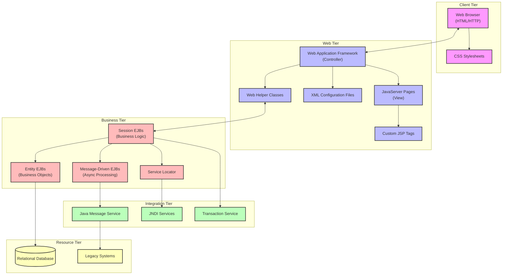
```mermaid
flowchart TB
    subgraph "Client Tier"
        Browser["Web Browser\n(HTML/HTTP)"]
        styleClass["CSS Stylesheets"]
        Browser --> styleClass
    end
    
    subgraph "Web Tier"
        JSP["JavaServer Pages\n(View)"]
        WAF["Web Application Framework\n(Controller)"]
        XML["XML Configuration Files"]
        Tags["Custom JSP Tags"]
        CHelpers["Web Helper Classes"]
        
        WAF --> JSP
        WAF --> XML
        JSP --> Tags
        WAF --> CHelpers
    end
    
    subgraph "Business Tier"
        SessionEJB["Session EJBs\n(Business Logic)"]
        EntityEJB["Entity EJBs\n(Business Objects)"]
        MessageEJB["Message-Driven EJBs\n(Async Processing)"]
        ServiceLocator["Service Locator"]
        
        SessionEJB --> EntityEJB
        SessionEJB --> MessageEJB
        SessionEJB --> ServiceLocator
    end
    
    subgraph "Integration Tier"
        JMS["Java Message Service"]
        JNDI["JNDI Services"]
        JTA["Transaction Service"]
        
        ServiceLocator --> JNDI
        MessageEJB --> JMS
        SessionEJB --> JTA
    end
    
    subgraph "Resource Tier"
        DB[(Relational Database)]
        Legacy["Legacy Systems"]
        
        EntityEJB --> DB
        JMS --> Legacy
    end
    
    Browser <--> WAF
    CHelpers <--> SessionEJB
    
    classDef clientTier fill:#f9f,stroke:#333,stroke-width:2px;
    classDef webTier fill:#bbf,stroke:#333,stroke-width:2px;
    classDef businessTier fill:#fbb,stroke:#333,stroke-width:2px;
    classDef integrationTier fill:#bfb,stroke:#333,stroke-width:2px;
    classDef resourceTier fill:#ffb,stroke:#333,stroke-width:2px;
    
    class Browser,styleClass clientTier;
    class JSP,WAF,XML,Tags,CHelpers webTier;
    class SessionEJB,EntityEJB,MessageEJB,ServiceLocator businessTier;
    class JMS,JNDI,JTA integrationTier;
    class DB,Legacy resourceTier;
```

The multi-tier architecture of Java Pet Store demonstrates a classic J2EE design with clear separation of concerns across five distinct tiers:

1. **Client Tier**: The user interface presented in web browsers, consisting of HTML, CSS, and JavaScript. The client communicates with the server exclusively through HTTP requests.

2. **Web Tier**: Handles HTTP requests and generates dynamic responses. Implements the MVC pattern with:
    - JSP pages serving as the View
    - The Web Application Framework implementing the Controller
    - Helper classes providing access to business tier functionality
    - Custom JSP tags for reusable UI components
    - XML configuration files for screen definitions and flow control

3. **Business Tier**: Contains the core application logic implemented through Enterprise JavaBeans:
    - Session EJBs implementing business processes and transaction boundaries
    - Entity EJBs representing persistent business objects
    - Message-Driven EJBs handling asynchronous processing
    - The Service Locator pattern for efficient resource discovery

4. **Integration Tier**: Provides services that connect the business tier to external resources:
    - Java Message Service (JMS) for asynchronous messaging
    - Java Naming and Directory Interface (JNDI) for resource lookup
    - Java Transaction API (JTA) for transaction management

5. **Resource Tier**: External systems and databases that store application data:
    - Relational database for persistent storage
    - Legacy systems or external services accessed through JMS

This architecture demonstrates how to build maintainable enterprise applications with clear boundaries between functionality. Each tier has specific responsibilities and communicates with adjacent tiers through well-defined interfaces, enabling independent development, testing, and scaling of components.

## Internationalization Support

Java Pet Store implements comprehensive internationalization (i18n) and localization (l10n) support, enabling the application to serve content in multiple languages and adapt to regional preferences:

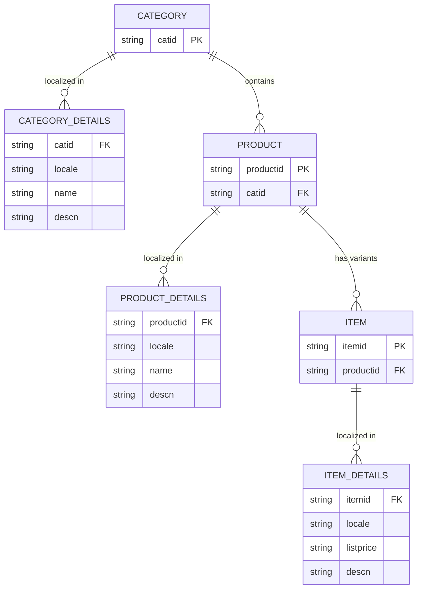
```mermaid
erDiagram
    CATEGORY {
        string catid PK
    }
    
    CATEGORY_DETAILS {
        string catid FK
        string locale
        string name
        string descn
    }
    
    PRODUCT {
        string productid PK
        string catid FK
    }
    
    PRODUCT_DETAILS {
        string productid FK
        string locale
        string name
        string descn
    }
    
    ITEM {
        string itemid PK
        string productid FK
    }
    
    ITEM_DETAILS {
        string itemid FK
        string locale
        string listprice
        string descn
    }
    
    CATEGORY ||--o{ CATEGORY_DETAILS : "localized in"
    CATEGORY ||--o{ PRODUCT : "contains"
    PRODUCT ||--o{ PRODUCT_DETAILS : "localized in"
    PRODUCT ||--o{ ITEM : "has variants"
    ITEM ||--o{ ITEM_DETAILS : "localized in"
```

Key internationalization features include:

1. **Database Design**: The catalog implements a pattern where each entity (Category, Product, Item) has a corresponding details table that stores language-specific content, with a `locale` column identifying the language.

2. **Resource Management**: Localized resource bundles for UI elements, error messages, and other text content are loaded dynamically based on the user's locale settings.

3. **Presentation Layer**: The Web Application Framework's templating system handles localized content through locale-specific XML screen definition files (e.g., `screendefinitions_en_US.xml`, `screendefinitions_ja_JP.xml`).

4. **Data Access Layer**: All DAO methods accept a `Locale` parameter that determines which language version of the data to retrieve.

5. **XML-based Data Population**: The system supports multilingual content through the `Populate-UTF8.xml` file, containing product data in English, Japanese, and Chinese.

This comprehensive approach demonstrates how enterprise applications can be designed from the ground up to support multiple languages and regional preferences, making the Pet Store accessible to a global audience while maintaining a clean architecture.

## Core Application Architecture

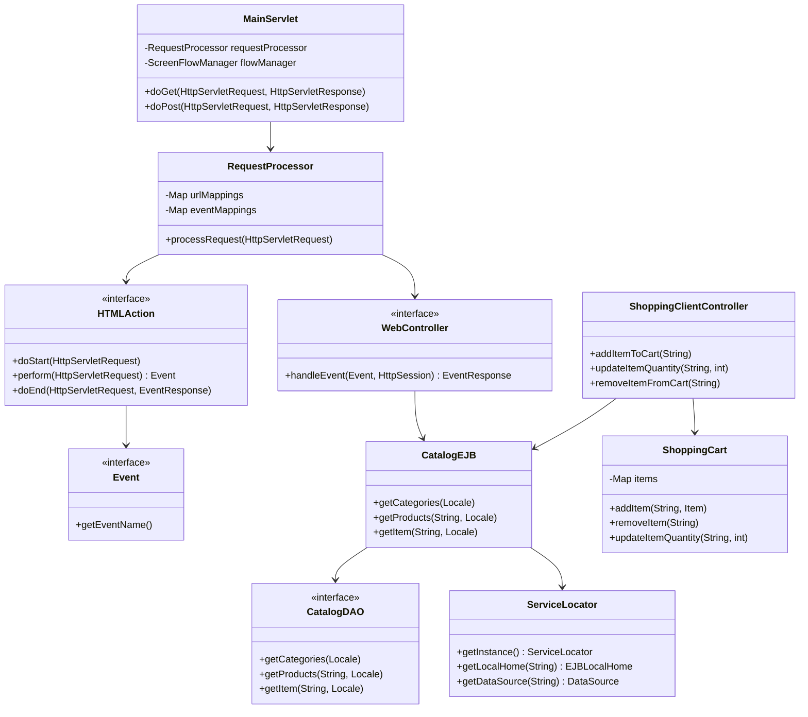
```mermaid
classDiagram
    class MainServlet {
        -RequestProcessor requestProcessor
        -ScreenFlowManager flowManager
        +doGet(HttpServletRequest, HttpServletResponse)
        +doPost(HttpServletRequest, HttpServletResponse)
    }
    
    class RequestProcessor {
        -Map urlMappings
        -Map eventMappings
        +processRequest(HttpServletRequest)
    }
    
    class HTMLAction {
        <<interface>>
        +doStart(HttpServletRequest)
        +perform(HttpServletRequest) Event
        +doEnd(HttpServletRequest, EventResponse)
    }
    
    class WebController {
        <<interface>>
        +handleEvent(Event, HttpSession) EventResponse
    }
    
    class Event {
        <<interface>>
        +getEventName()
    }
    
    class CatalogEJB {
        +getCategories(Locale)
        +getProducts(String, Locale)
        +getItem(String, Locale)
    }
    
    class CatalogDAO {
        <<interface>>
        +getCategories(Locale)
        +getProducts(String, Locale)
        +getItem(String, Locale)
    }
    
    class ServiceLocator {
        +getInstance() ServiceLocator
        +getLocalHome(String) EJBLocalHome
        +getDataSource(String) DataSource
    }
    
    class ShoppingClientController {
        +addItemToCart(String)
        +updateItemQuantity(String, int)
        +removeItemFromCart(String)
    }
    
    class ShoppingCart {
        -Map items
        +addItem(String, Item)
        +removeItem(String)
        +updateItemQuantity(String, int)
    }
    
    MainServlet --> RequestProcessor
    RequestProcessor --> HTMLAction
    HTMLAction --> Event
    RequestProcessor --> WebController
    WebController --> CatalogEJB
    CatalogEJB --> CatalogDAO
    CatalogEJB --> ServiceLocator
    ShoppingClientController --> ShoppingCart
    ShoppingClientController --> CatalogEJB
```

The core architecture of Java Pet Store demonstrates sophisticated design patterns and principles:

1. **MVC Implementation**:
    - The `MainServlet` acts as a Front Controller, intercepting all requests
    - The `RequestProcessor` analyzes requests and delegates to appropriate actions
    - `HTMLAction` implementations handle specific user operations
    - JSP pages render the view based on the model data

2. **Event-Driven Architecture**:
    - Actions generate `Event` objects representing user intentions
    - Events are passed to `WebController` components that bridge web and EJB tiers
    - The EJB tier processes events through appropriate handlers
    - `EventResponse` objects carry results back to the presentation layer

3. **Business Logic Organization**:
    - Session EJBs like `CatalogEJB` implement core business processes
    - The Service Locator pattern provides efficient resource discovery
    - Data Access Objects abstract database interactions
    - Business logic is isolated from presentation concerns

4. **Component Interactions**:
    - Clear interfaces define interactions between components
    - Dependency injection through JNDI and service location
    - Stateless design for most components to enhance scalability
    - XML-based configuration for flexible assembly

This architecture demonstrates how to build complex enterprise applications with clear separation of concerns, enabling maintainability, scalability, and flexibility. The design patterns employed provide solutions to common challenges in enterprise development, making the Pet Store a valuable reference for understanding effective application architecture.

## Key Technology Implementation Patterns

Java Pet Store implements several critical design patterns that demonstrate best practices for J2EE application development:

1. **Service Locator Pattern**:
    - Centralizes JNDI lookups for EJB home interfaces, JMS resources, and DataSources
    - Implements caching to improve performance of repeated lookups
    - Provides unified exception handling through ServiceLocatorException
    - Offers separate implementations optimized for web and EJB tiers

2. **Data Access Object Pattern**:
    - Abstracts database interactions through the CatalogDAO interface
    - Provides implementations for different database platforms
    - Supports internationalization through locale-aware queries
    - Utilizes XML-based SQL configuration for database portability

3. **Model-View-Controller Pattern**:
    - Separates presentation (JSP), control flow (WAF), and business logic (EJB)
    - Implements screen flow management through XML configuration
    - Uses a front controller servlet to centralize request handling
    - Employs custom JSP tags for view composition

4. **Business Delegate Pattern**:
    - Creates client-side proxies for EJB components
    - Hides remote invocation complexities from presentation layer
    - Implements caching strategies to reduce remote calls
    - Provides uniform exception handling

These patterns demonstrate how to build maintainable, scalable applications by applying proven architectural approaches to common enterprise challenges. Java Pet Store shows these patterns in a cohesive, working application rather than isolated examples, providing valuable context for understanding their practical application.

## Web Application Framework

The Web Application Framework (WAF) in Java Pet Store 1.3.2 serves as a foundational architecture for building structured J2EE web applications following the Model-View-Controller (MVC) pattern. Designed as a reusable component, WAF provides a consistent approach to handling HTTP requests, processing business logic, and rendering dynamic content.

WAF implements a front controller pattern where centralized request processors route incoming HTTP requests to appropriate action handlers, maintaining a clean separation between presentation logic and business processing. This architecture promotes code reusability, maintainability, and a clear division of responsibilities among development teams.

The framework's key components include:

- **Request Processor**: Serves as the front controller, receiving filtered requests and delegating them to the State Machine
- **State Machine**: Determines the appropriate Action Class to handle the request based on the current application state
- **Action Classes**: Contain business logic for processing requests and interact with the EJB tier
- **View Templates**: Generate dynamic HTML content with the support of custom Tag Libraries
- **Exception Handler**: Manages errors, directing them to appropriate error views

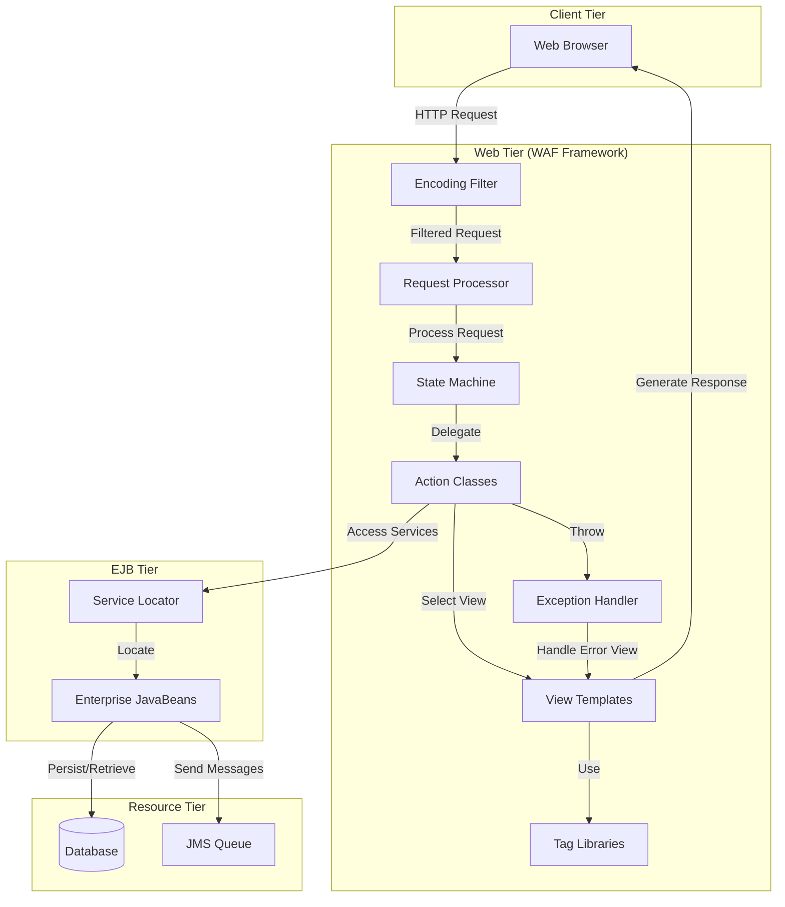
```mermaid
graph TD
    subgraph "Client Tier"
        Browser[Web Browser]
    end
    
    subgraph "Web Tier (WAF Framework)"
        RP[Request Processor]
        SM[State Machine]
        AC[Action Classes]
        VT[View Templates]
        TL[Tag Libraries]
        EF[Encoding Filter]
        EH[Exception Handler]
    end
    
    subgraph "EJB Tier"
        EJB[Enterprise JavaBeans]
        SL[Service Locator]
    end
    
    subgraph "Resource Tier"
        DB[(Database)]
        MQ[JMS Queue]
    end
    
    Browser -->|HTTP Request| EF
    EF -->|Filtered Request| RP
    RP -->|Process Request| SM
    SM -->|Delegate| AC
    AC -->|Access Services| SL
    SL -->|Locate| EJB
    EJB -->|Persist/Retrieve| DB
    EJB -->|Send Messages| MQ
    AC -->|Select View| VT
    VT -->|Use| TL
    VT -->|Generate Response| Browser
    AC -->|Throw| EH
    EH -->|Handle Error View| VT
```

The WAF architecture provides clean separation of concerns while maintaining a cohesive request processing pipeline, serving as the foundation for the application's web interface.

## EJB Component Model

Enterprise JavaBeans (EJB) container management is a foundational architectural element of the Java Pet Store 1.3.2 application, providing a robust infrastructure for managing enterprise beans and their lifecycle. The EJB container serves as a runtime environment that handles complex middleware services such as transaction management, security, persistence, resource pooling, and concurrency control.

The application makes extensive use of Container-Managed Persistence (CMP) for its entity beans, delegating the responsibility of database operations to the EJB container. This abstraction layer significantly reduces the amount of data access code that developers need to write and maintain. Entity beans like `CustomerEJB`, `LineItemEJB`, and `InventoryEJB` leverage CMP for database operations.

Container-Managed Relationships (CMR) enable the EJB container to automatically manage relationships between entity beans, similar to how it manages persistence. The application implements one-to-one, one-to-many, and many-to-many relationships through CMR fields defined in entity beans. For example, a `PurchaseOrder` entity has relationships with `LineItem`, `ContactInfo`, and `CreditCard` entities.

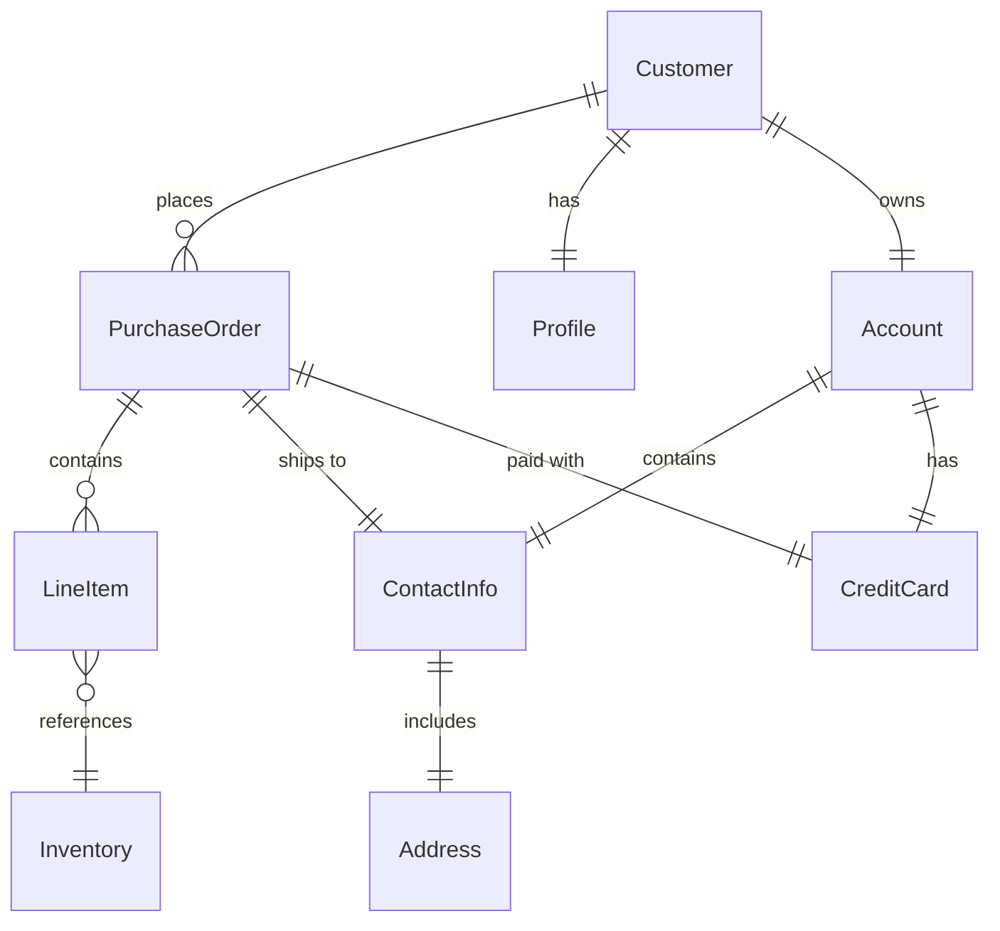
```mermaid
erDiagram
    Customer ||--o{ PurchaseOrder : places
    Customer ||--|| Profile : has
    Customer ||--|| Account : owns
    Account ||--|| ContactInfo : contains
    Account ||--|| CreditCard : has
    ContactInfo ||--|| Address : includes
    PurchaseOrder ||--o{ LineItem : contains
    PurchaseOrder ||--|| ContactInfo : "ships to"
    PurchaseOrder ||--|| CreditCard : "paid with"
    LineItem }o--|| Inventory : references
```

The Java Pet Store employs a multi-layered EJB architecture:

- **Session Facades**: Stateless and stateful session beans that provide coarse-grained interfaces to business functionality
- **Business Logic**: Components that implement core business rules and workflows
- **Domain Objects**: Value objects and event objects that encapsulate business data
- **Integration Layer**: Handles communication with external systems through message-driven beans (MDBs)
- **Persistence Layer**: CMP entity beans that represent business entities and their relationships
- **Services Layer**: Provides cross-cutting functionality like service location and security

This layered architecture with clear separation of concerns allows the Pet Store application to be maintainable, extensible, and scalable.

## Catalog Management

The Java Pet Store Demo 1.3.2's product catalog management forms its core business function. The catalog system enables customers to browse, search, and view detailed information about pet products organized in a hierarchical structure.

At its heart, the catalog management system provides features including:
- Category browsing
- Product listings
- Detailed item views
- Search capabilities
- Internationalization support

The catalog implements a hierarchical domain model with three levels:
1. **Category**: Broad product groupings such as "Fish," "Dogs," or "Cats"
2. **Product**: Specific types of pets or pet products within a category
3. **Item**: Specific variants of a product available for purchase, including pricing information

The catalog component architecture follows the Model-View-Controller (MVC) pattern with multiple layers:

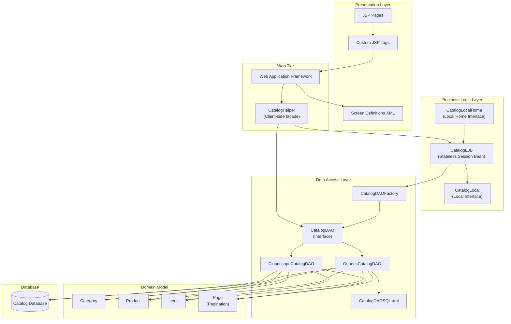
```mermaid

flowchart TB
    subgraph "Presentation Layer"
        JSP["JSP Pages"]
        Tags["Custom JSP Tags"]
        ScreenDef["Screen Definitions XML"]
    end

    subgraph "Web Tier"
        CatalogHelper["CatalogHelper\n(Client-side facade)"]
        WAF["Web Application Framework"]
    end

    subgraph "Business Logic Layer"
        CatalogEJB["CatalogEJB\n(Stateless Session Bean)"]
        CatalogLocal["CatalogLocal\n(Local Interface)"]
        CatalogLocalHome["CatalogLocalHome\n(Local Home Interface)"]
    end

    subgraph "Data Access Layer"
        DAOFactory["CatalogDAOFactory"]
        DAO["CatalogDAO\n(Interface)"]
        CloudscapeDAO["CloudscapeCatalogDAO"]
        GenericDAO["GenericCatalogDAO"]
        SQLXML["CatalogDAOSQL.xml"]
    end

    subgraph "Domain Model"
        Category["Category"]
        Product["Product"]
        Item["Item"]
        Page["Page\n(Pagination)"]
    end

    subgraph "Database"
        DB[(Catalog Database)]
    end

    JSP --> Tags
    Tags --> WAF
    WAF --> ScreenDef
    WAF --> CatalogHelper

    CatalogHelper --> CatalogEJB
    CatalogHelper --> DAO

    CatalogLocalHome --> CatalogEJB
    CatalogEJB --> CatalogLocal
    CatalogEJB --> DAOFactory

    DAOFactory --> DAO
    DAO --> CloudscapeDAO
    DAO --> GenericDAO
    GenericDAO --> SQLXML

    CloudscapeDAO --> DB
    GenericDAO --> DB

    CloudscapeDAO --> Category
    CloudscapeDAO --> Product
    CloudscapeDAO --> Item
    CloudscapeDAO --> Page

    GenericDAO --> Category
    GenericDAO --> Product
    GenericDAO --> Item
    GenericDAO --> Page
    
```

The Java Pet Store catalog demonstrates best practices including:
- Clean separation of concerns through the DAO pattern
- Internationalization through locale-aware database schema
- Efficient pagination for large result sets
- XML-based configuration for database portability
- Flexible search capabilities

This modular design allows for flexibility in deployment, maintenance, and extension of the catalog functionality.

## Shopping Cart Implementation

The Java Pet Store's shopping cart functionality is implemented using a multi-tier architecture with clear separation between presentation, business logic, and data layers. At its core is a stateful session EJB (ShoppingCartLocalEJB) that maintains the cart state across user interactions.

The shopping cart component architecture shows how various components interact:

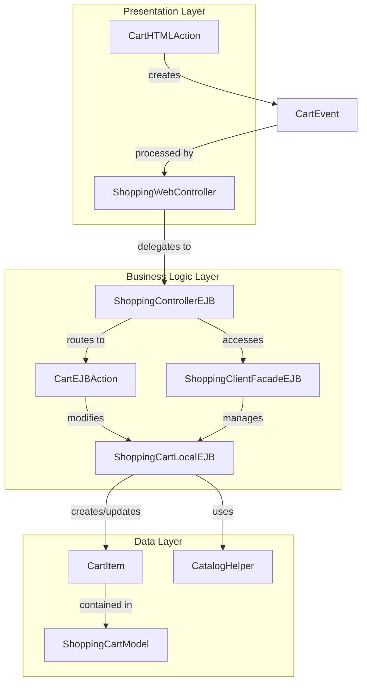
```mermaid
graph TD
    subgraph "Presentation Layer"
        CartHTMLAction[CartHTMLAction]
        ShoppingWebController[ShoppingWebController]
    end
    
    subgraph "Business Logic Layer"
        ShoppingControllerEJB[ShoppingControllerEJB]
        CartEJBAction[CartEJBAction]
        ShoppingClientFacadeEJB[ShoppingClientFacadeEJB]
        ShoppingCartEJB[ShoppingCartLocalEJB]
    end
    
    subgraph "Data Layer"
        CartItem[CartItem]
        ShoppingCartModel[ShoppingCartModel]
        CatalogHelper[CatalogHelper]
    end
    
    CartHTMLAction -->|creates| CartEvent
    CartEvent -->|processed by| ShoppingWebController
    ShoppingWebController -->|delegates to| ShoppingControllerEJB
    ShoppingControllerEJB -->|routes to| CartEJBAction
    CartEJBAction -->|modifies| ShoppingCartEJB
    ShoppingControllerEJB -->|accesses| ShoppingClientFacadeEJB
    ShoppingClientFacadeEJB -->|manages| ShoppingCartEJB
    ShoppingCartEJB -->|creates/updates| CartItem
    ShoppingCartEJB -->|uses| CatalogHelper
    CartItem -->|contained in| ShoppingCartModel
```

The shopping cart operations follow an event-driven flow:

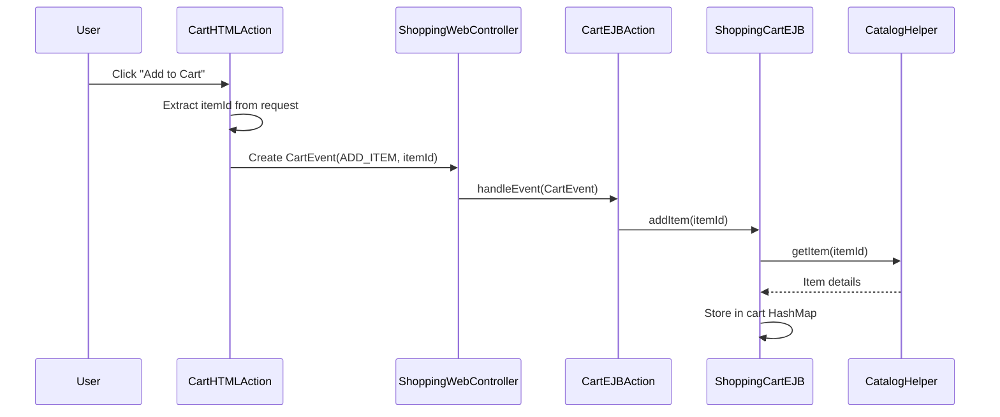
```mermaid
sequenceDiagram
    participant User
    participant CartHTMLAction
    participant ShoppingWebController
    participant CartEJBAction
    participant ShoppingCartEJB
    participant CatalogHelper
    
    User->>CartHTMLAction: Click "Add to Cart"
    CartHTMLAction->>CartHTMLAction: Extract itemId from request
    CartHTMLAction->>ShoppingWebController: Create CartEvent(ADD_ITEM, itemId)
    ShoppingWebController->>CartEJBAction: handleEvent(CartEvent)
    CartEJBAction->>ShoppingCartEJB: addItem(itemId)
    ShoppingCartEJB->>CatalogHelper: getItem(itemId)
    CatalogHelper-->>ShoppingCartEJB: Item details
    ShoppingCartEJB->>ShoppingCartEJB: Store in cart HashMap
```

Key aspects of the shopping cart implementation include:
- Stateful session EJB to maintain cart state
- Event-driven architecture with CartEvent objects
- Facade pattern for shopping operations
- Proper transaction management for data integrity
- Clear separation between model (CartItem/ShoppingCartModel) and business logic

This architecture ensures a clean separation between user interface and business logic while maintaining a consistent flow for all cart operations.

## Order Processing Workflow

Order processing represents the core business function in the Java Pet Store application, handling the complete lifecycle of customer orders from initial submission through fulfillment. The system implements a sophisticated workflow that manages orders as they progress through various states including pending, approved, denied, and completed.

The order processing workflow in Java Pet Store follows a comprehensive business process:

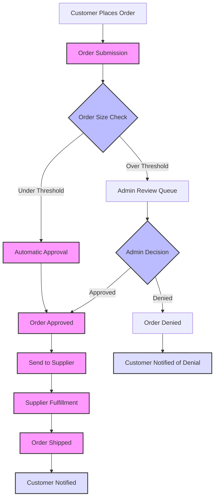
```mermaid
flowchart TD
    A[Customer Places Order] --> B[Order Submission]
    B --> C{Order Size Check}
    C -->|Under Threshold| D[Automatic Approval]
    C -->|Over Threshold| E[Admin Review Queue]
    E --> F{Admin Decision}
    F -->|Approved| G[Order Approved]
    F -->|Denied| H[Order Denied]
    D --> G
    G --> I[Send to Supplier]
    I --> J[Supplier Fulfillment]
    J --> K[Order Shipped]
    K --> L[Customer Notified]
    H --> M[Customer Notified of Denial]
    
    classDef process fill:#f9f,stroke:#333,stroke-width:2px
    classDef decision fill:#bbf,stroke:#333,stroke-width:2px
    classDef notification fill:#ddf,stroke:#333,stroke-width:2px
    
    class B,D,G,I,J,K process
    class C,F decision
    class L,M notification
```

When a customer places an order, the OrderEJBAction component creates a PurchaseOrder object containing billing information, shipping details, credit card data, and line items from the customer's shopping cart. A unique order ID is generated, and the order is converted to XML format.

This XML representation is then sent asynchronously via the AsyncSender component to the Order Processing Center (OPC), where the PurchaseOrderMDB receives and processes it. The OPC implements a business rule that automatically approves orders under a certain threshold ($500 for US orders or ¥50000 for Japanese orders) while routing larger orders to an administrator review queue.

Throughout this workflow, the ProcessManager component tracks the order's status transitions, maintaining a record of each order's current state. This enables administrators to query orders by status and provides visibility into the order fulfillment process.

The order processing system demonstrates a clean separation of concerns with different components handling specific aspects such as:
- Order creation and submission
- Automatic and manual order approval
- Supplier communication
- Order fulfillment tracking
- Customer notification

This modular design promotes maintainability and allows for flexible business rule implementation throughout the order lifecycle.

## Asynchronous Messaging Architecture

Java Pet Store 1.3.2 implements a sophisticated asynchronous messaging architecture based on JMS (Java Message Service) to enable reliable, loosely coupled communication between components. This architecture is fundamental to the system's ability to handle order processing in a scalable and resilient manner.

The asynchronous messaging architecture can be visualized as follows:

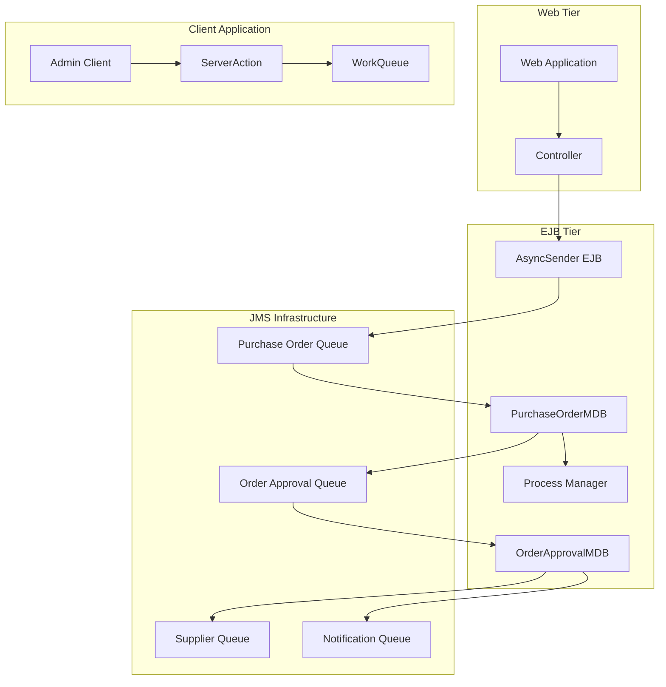
```mermaid
graph TD
    subgraph "Web Tier"
        WebApp[Web Application]
        Controller[Controller]
    end
    
    subgraph "EJB Tier"
        AsyncSender[AsyncSender EJB]
        PurchaseOrderMDB[PurchaseOrderMDB]
        OrderApprovalMDB[OrderApprovalMDB]
        ProcessManager[Process Manager]
    end
    
    subgraph "JMS Infrastructure"
        POQueue[Purchase Order Queue]
        ApprovalQueue[Order Approval Queue]
        SupplierQueue[Supplier Queue]
        NotificationQueue[Notification Queue]
    end
    
    subgraph "Client Application"
        AdminClient[Admin Client]
        WorkQueue[WorkQueue]
        ServerAction[ServerAction]
    end
    
    WebApp --> Controller
    Controller --> AsyncSender
    AsyncSender --> POQueue
    POQueue --> PurchaseOrderMDB
    PurchaseOrderMDB --> ProcessManager
    PurchaseOrderMDB --> ApprovalQueue
    ApprovalQueue --> OrderApprovalMDB
    OrderApprovalMDB --> SupplierQueue
    OrderApprovalMDB --> NotificationQueue
    AdminClient --> ServerAction
    ServerAction --> WorkQueue
```

At the core of this messaging system is the AsyncSender component, implemented as a stateless session bean that provides a simple interface for sending messages to JMS queues. Components that need to communicate asynchronously use the AsyncSender to place messages on appropriate queues without needing to manage JMS connection details directly.

The system defines several key message queues that facilitate different aspects of order processing:
- The PurchaseOrderQueue receives new orders from the storefront
- The OrderApprovalQueue handles order approval messages
- The OrderApprovalMailQueue and CompletedOrderMailQueue manage customer notifications
- The SupplierPurchaseOrderQueue communicates with supplier systems

Message-Driven Beans (MDBs) serve as the consumers of these messages, with specialized MDBs for each stage of order processing. For example, the PurchaseOrderMDB processes incoming orders, the OrderApprovalMDB handles approval decisions, and various notification MDBs manage customer communications.

The detailed asynchronous order processing flow shows how messages move through the system:

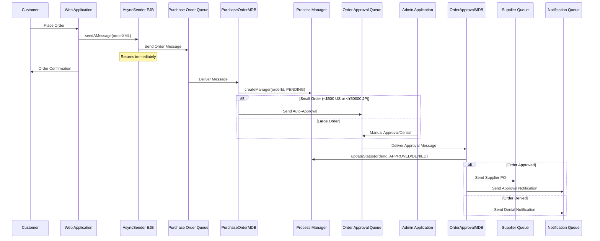
```mermaid
sequenceDiagram
    participant Customer as Customer
    participant WebApp as Web Application
    participant AsyncSender as AsyncSender EJB
    participant POQueue as Purchase Order Queue
    participant POMDB as PurchaseOrderMDB
    participant PM as Process Manager
    participant ApprovalQueue as Order Approval Queue
    participant Admin as Admin Application
    participant OAMDB as OrderApprovalMDB
    participant SupplierQueue as Supplier Queue
    participant NotificationQueue as Notification Queue

    Customer->>WebApp: Place Order
    WebApp->>AsyncSender: sendAMessage(orderXML)
    AsyncSender->>POQueue: Send Order Message
    Note over AsyncSender: Returns immediately
    WebApp->>Customer: Order Confirmation
    
    POQueue->>POMDB: Deliver Message
    POMDB->>PM: createManager(orderId, PENDING)
    
    alt Small Order (<$500 US or <¥50000 JP)
        POMDB->>ApprovalQueue: Send Auto-Approval
    else Large Order
        Admin->>ApprovalQueue: Manual Approval/Denial
    end
    
    ApprovalQueue->>OAMDB: Deliver Approval Message
    OAMDB->>PM: updateStatus(orderId, APPROVED/DENIED)
    
    alt Order Approved
        OAMDB->>SupplierQueue: Send Supplier PO
        OAMDB->>NotificationQueue: Send Approval Notification
    else Order Denied
        OAMDB->>NotificationQueue: Send Denial Notification
    end
```

This asynchronous approach provides several benefits:
1. Improved scalability through decoupling of components
2. Enhanced reliability with guaranteed message delivery
3. Better fault tolerance as components can fail independently
4. Simplified transaction management across system boundaries

The messaging architecture supports workflow transitions through the TransitionDelegate pattern, where components use JMS to signal state changes to downstream processes. This pattern allows for flexible workflow configuration without tight coupling between components.

## Admin Interface

The Java Pet Store Admin Interface is a sophisticated client-server application designed for administrative tasks like order management and sales analytics. The interface is implemented as a standalone application that is deployed separately from the main Pet Store web application in `petstoreadmin.ear`.

At its core, the admin interface uses Java Web Start technology to deliver a rich client experience while maintaining integration with the web-based authentication system. When a user navigates to the admin section, the `AdminRequestProcessor` servlet dynamically generates a JNLP (Java Network Launch Protocol) file tailored to the user's session. This JNLP file contains configuration details including the server hostname, port, and the user's session ID, which allows the rich client to maintain the user's authenticated state.

The admin client application (`PetStoreAdminClient`) is a full-featured Swing application that provides two primary functional areas:

1. **Order Management**: Administrators can view orders awaiting approval and process them accordingly. This includes a detailed view of order information and controls for approving or rejecting orders.

2. **Sales Analytics**: The application offers visualization tools for sales data, including both pie charts and bar charts to analyze sales patterns.

The client application follows the Model-View-Controller pattern, with a well-structured UI that includes tabbed panes, menu bars, and toolbars. It implements proper resource management and internationalization support, with all user-facing text loaded from resource bundles to facilitate localization.

Communication between the rich client and the server occurs through HTTP POST requests, maintaining session affinity through the session ID passed in the JNLP file. This approach allows the rich client to leverage the server's authentication and authorization framework while providing the interactive experience of a desktop application.

## XML-Based Integration

Java Pet Store 1.3.2 extensively leverages XML for configuration, integration, and data exchange across its distributed architecture. XML serves as the backbone for application configuration, build processes, deployment descriptors, and business document exchange.

The XML configuration in Pet Store follows a hierarchical approach that reflects both the application's structure and its build process. At the top level, `setup.xml` initializes the environment, while `src/build.xml` orchestrates the overall build process. This delegates to component-specific build files organized by functional area. The build system employs Apache Ant 1.4.1 as its primary build tool, with property files alongside XML to separate environment-specific settings from build logic.

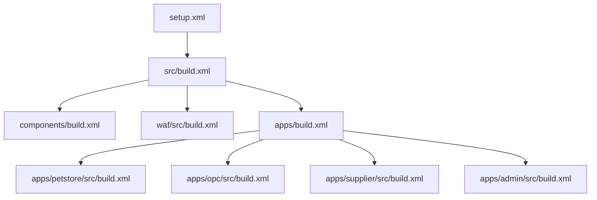
```mermaid
graph TD
    A[setup.xml] --> B[src/build.xml]
    B --> C[components/build.xml]
    B --> D[waf/src/build.xml]
    B --> E[apps/build.xml]
    
    E --> F[apps/petstore/src/build.xml]
    E --> G[apps/opc/src/build.xml]
    E --> H[apps/supplier/src/build.xml]
    E --> I[apps/admin/src/build.xml]
```

J2EE deployment descriptors form another critical XML configuration layer, including:

1. **application.xml**: Defines the overall application structure with EJB and web modules
2. **web.xml**: Configures web components, including servlets, filters, and security constraints
3. **ejb-jar.xml**: Defines Enterprise JavaBeans, including session beans, entity beans, and message-driven beans

Server-specific configuration files (`sun-j2ee-ri.xml`) provide J2EE Reference Implementation settings, including JNDI mappings, resource references, and security role mappings.

For data exchange, Pet Store implements a sophisticated XML schema management system through the `EntityCatalog.properties` file, which maps XML schemas to their physical locations. This supports both DTD and XSD formats for business documents like purchase orders, supplier orders, and invoices. The `XMLDocuments` component handles document validation and processing, using trading partner agreements (TPAs) to standardize the XML formats.

Database portability is achieved through XML configuration in files like `PopulateSQL.xml`, which contains database-specific SQL statements selected at runtime based on the configured database type. This approach allows the application to work with different database systems without code changes.

The XML-based integration approach provides a flexible, declarative mechanism for configuring and connecting the application's distributed components, supporting both build-time and runtime needs.

## Service Locator Pattern

The Service Locator pattern is a core design pattern in Java Pet Store 1.3.2 that abstracts the complexity of JNDI (Java Naming and Directory Interface) lookups and provides a centralized mechanism for obtaining references to distributed J2EE resources.

The pattern is implemented with two primary variants: a web-tier implementation (`com.sun.j2ee.blueprints.servicelocator.web.ServiceLocator`) and an EJB-tier implementation (`com.sun.j2ee.blueprints.servicelocator.ejb.ServiceLocator`), each tailored to the specific needs of its tier.

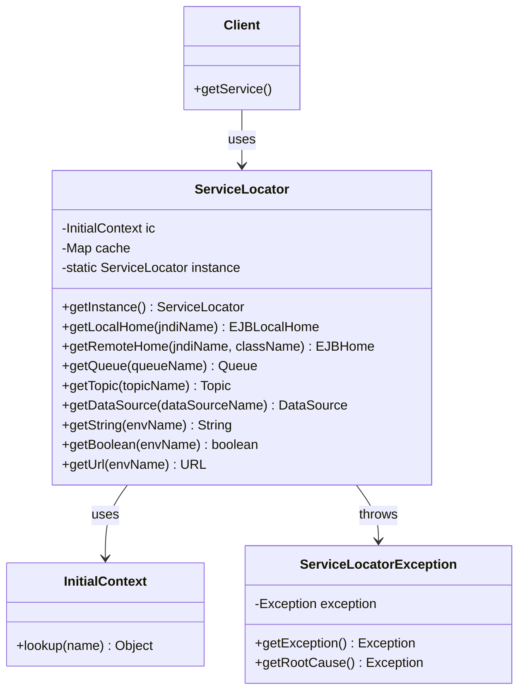
```mermaid
classDiagram
    class Client {
        +getService()
    }
    
    class ServiceLocator {
        -InitialContext ic
        -Map cache
        -static ServiceLocator instance
        +getInstance() ServiceLocator
        +getLocalHome(jndiName) EJBLocalHome
        +getRemoteHome(jndiName, className) EJBHome
        +getQueue(queueName) Queue
        +getTopic(topicName) Topic
        +getDataSource(dataSourceName) DataSource
        +getString(envName) String
        +getBoolean(envName) boolean
        +getUrl(envName) URL
    }
    
    class InitialContext {
        +lookup(name) Object
    }
    
    class ServiceLocatorException {
        -Exception exception
        +getException() Exception
        +getRootCause() Exception
    }
    
    Client --> ServiceLocator : uses
    ServiceLocator --> InitialContext : uses
    ServiceLocator --> ServiceLocatorException : throws
```

The web-tier implementation uses a true singleton pattern with a thread-safe cache to store looked-up resources, significantly improving performance by avoiding repeated JNDI lookups. The EJB-tier implementation, designed for use within Enterprise JavaBeans, uses a simpler approach without caching to avoid potential conflicts with the EJB container's resource management.

Both implementations provide a comprehensive set of methods for retrieving various J2EE resources:
- EJB homes (both local and remote)
- JMS resources (queues, topics, and connection factories)
- JDBC DataSources
- Environment entries (strings, booleans, URLs)

The Service Locator integrates with the application's component management framework through the `DefaultComponentManager` and its subclass `PetstoreComponentManager`, which serve as bridges between the web tier and EJB tier.

A key aspect of the pattern is its exception handling strategy through the `ServiceLocatorException` class. This class wraps lower-level exceptions, providing a unified exception handling approach with methods like `getRootCause()` to find the original cause of errors.

The Service Locator pattern delivers several benefits to the Pet Store application:
1. **Reduced coupling** between application components and J2EE infrastructure
2. **Centralized lookup** providing a single point for all resource access
3. **Improved performance** through caching of expensive lookups
4. **Simplified error handling** with a unified exception approach
5. **Resource abstraction** hiding the complexity of JNDI and related technologies

This pattern serves as a foundational element of Pet Store's architecture, enabling other components to operate effectively while remaining decoupled from the underlying J2EE infrastructure.

## Exception Handling Framework

Exception handling in Java Pet Store 1.3.2 is not merely an error reporting mechanism but an integral part of the application's control flow. The framework separates business exceptions from technical exceptions, providing appropriate responses for each while maintaining system integrity.

At the core of this design is the `EventException` class, which serves as the base for application-specific exceptions. This parent class extends Java's standard `Exception` class while adding functionality specific to the event processing system used throughout Pet Store.

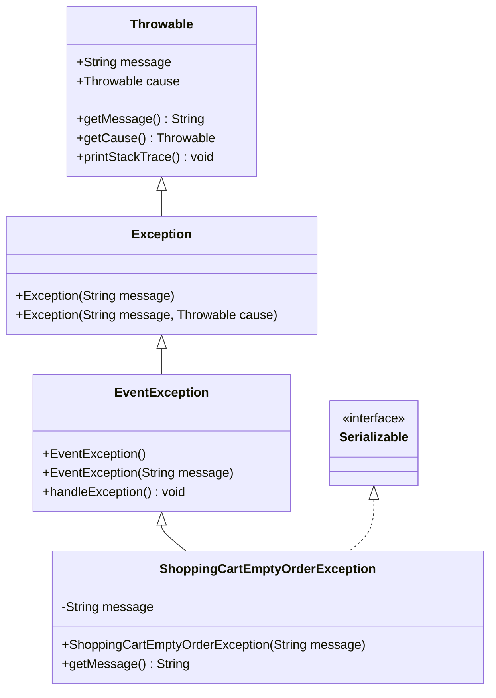
```mermaid
classDiagram
    class Throwable {
        +String message
        +Throwable cause
        +getMessage() String
        +getCause() Throwable
        +printStackTrace() void
    }
    
    class Exception {
        +Exception(String message)
        +Exception(String message, Throwable cause)
    }
    
    class EventException {
        +EventException()
        +EventException(String message)
        +handleException() void
    }
    
    class ShoppingCartEmptyOrderException {
        -String message
        +ShoppingCartEmptyOrderException(String message)
        +getMessage() String
    }
    
    class Serializable {
        <<interface>>
    }
    
    Throwable <|-- Exception
    Exception <|-- EventException
    EventException <|-- ShoppingCartEmptyOrderException
    Serializable <|.. ShoppingCartEmptyOrderException
```

Business exceptions like `ShoppingCartEmptyOrderException` represent business rule violations rather than technical failures. They provide precise feedback to users while enabling different handling strategies for business exceptions versus technical failures. By implementing `Serializable`, these exceptions can be transmitted across the distributed components of the J2EE application, maintaining their type information and custom properties.

Exception management at the controller layer demonstrates a sophisticated approach to error handling in the MVC architecture. The controller intercepts exceptions thrown by the model layer before they reach the view, transforming business exceptions into user-friendly messages and logging technical exceptions with detailed information.

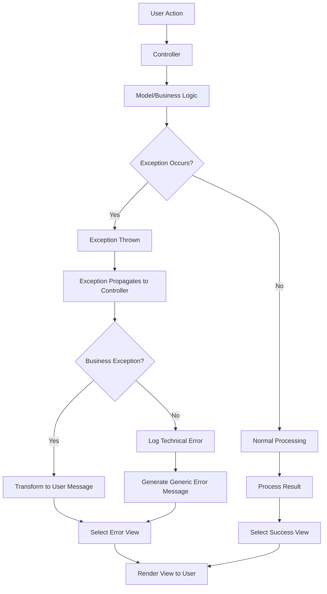
```mermaid
flowchart TD
    A[User Action] --> B[Controller]
    B --> C[Model/Business Logic]
    C --> D{Exception Occurs?}
    D -->|No| E[Normal Processing]
    D -->|Yes| F[Exception Thrown]
    F --> G[Exception Propagates to Controller]
    G --> H{Business Exception?}
    H -->|Yes| I[Transform to User Message]
    H -->|No| J[Log Technical Error]
    J --> K[Generate Generic Error Message]
    I --> L[Select Error View]
    K --> L
    L --> M[Render View to User]
    E --> N[Process Result]
    N --> O[Select Success View]
    O --> M
```

The user experience focus is evident in how exceptions like `ShoppingCartEmptyOrderException` address common scenarios (such as attempting to submit an order after using the browser's back button) with clear, actionable feedback. This targeted approach helps users understand the system's behavior and adjust their actions accordingly.

The exception handling framework also includes comprehensive logging and monitoring, using different logging levels to categorize exceptions based on their severity. This approach supports both immediate troubleshooting and long-term system health monitoring.

Pet Store's exception handling demonstrates best practices that remain relevant today: separation of concerns, meaningful messages, proper exception hierarchy, serialization support, integration with architecture, centralized handling, context preservation, and comprehensive logging.

## Component Interaction

Component interaction in Java Pet Store 1.3.2 is managed through a sophisticated lifecycle system that ensures proper initialization, operation, and termination of components throughout the application. This system employs a combination of build-time dependency management, runtime initialization sequences, and state transition mechanisms.

The build-time component lifecycle establishes a clear compilation order that respects component dependencies. The main components build file (`/components/build.xml`) orchestrates the build process for all 17 components in a carefully sequenced order, with foundational components like `xmldocuments`, `servicelocator`, and `util/tracer` built first.

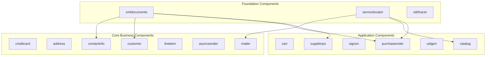
```mermaid
flowchart TD
    subgraph "Foundation Components"
        xmldoc["xmldocuments"]
        svclocator["servicelocator"]
        tracer["util/tracer"]
    end
    
    subgraph "Core Business Components"
        cc["creditcard"]
        addr["address"]
        contact["contactinfo"]
        customer["customer"]
        lineitem["lineitem"]
        async["asyncsender"]
        mailer["mailer"]
    end
    
    subgraph "Application Components"
        cart["cart"]
        catalog["catalog"]
        signon["signon"]
        po["purchaseorder"]
        uidgen["uidgen"]
        supplierpo["supplierpo"]
    end
    
    %% Foundation dependencies
    xmldoc --> contact
    xmldoc --> customer
    xmldoc --> po
    xmldoc --> supplierpo
    
    svclocator --> mailer
    svclocator --> catalog
    svclocator --> po
```

At runtime, component initialization is centered around the ComponentManager interface, which extends HttpSessionListener to ensure implementing classes are loaded at application startup. This interface defines how components are initialized, accessed, and managed throughout their lifecycle.

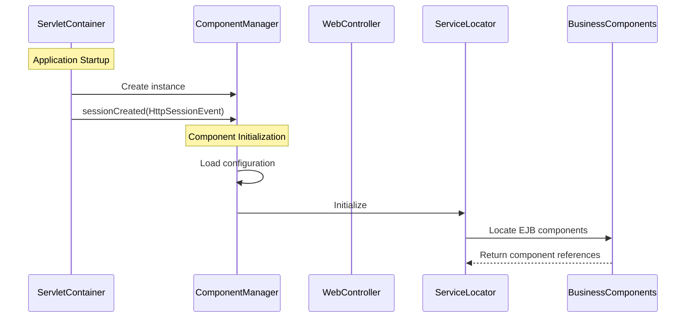
```mermaid
sequenceDiagram
    participant SC as ServletContainer
    participant CM as ComponentManager
    participant WC as WebController
    participant SL as ServiceLocator
    participant BC as BusinessComponents
    
    Note over SC: Application Startup
    SC->>CM: Create instance
    SC->>CM: sessionCreated(HttpSessionEvent)
    
    Note over CM: Component Initialization
    CM->>CM: Load configuration
    CM->>SL: Initialize
    SL->>BC: Locate EJB components
    BC-->>SL: Return component references
```

State management across components is handled through a combination of event-driven mechanisms and explicit state transitions. The ProcessManager component orchestrates business processes through well-defined state transitions, providing a framework for managing complex workflows.

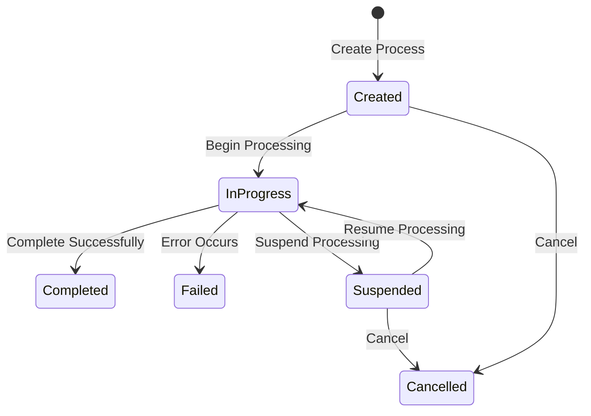
```mermaid
stateDiagram-v2
    [*] --> Created: Create Process
    
    Created --> InProgress: Begin Processing
    Created --> Cancelled: Cancel
    
    InProgress --> Completed: Complete Successfully
    InProgress --> Failed: Error Occurs
    InProgress --> Suspended: Suspend Processing
    
    Suspended --> InProgress: Resume Processing
    Suspended --> Cancelled: Cancel
```

Resource management is implemented systematically, ensuring proper acquisition, usage, and release of resources throughout their lifecycle. This is particularly evident in components that interact with external systems or manage potentially scarce resources. Exception handling is tightly integrated with resource management, with classes like TransitionException providing mechanisms to report and recover from resource-related errors.

Debugging and lifecycle monitoring is facilitated through the Debug utility class, which provides a centralized mechanism for conditional logging that can be used to track component lifecycle events throughout the application. This simple but effective approach supports development and troubleshooting without impacting production performance.

The comprehensive component interaction framework in Java Pet Store creates a reliable, maintainable system where components work together seamlessly while remaining properly encapsulated.

## Security Implementation

The Java Pet Store 1.3.2 implements a comprehensive security framework centered around authentication and authorization. The authentication system uses a multi-tier architecture that separates presentation logic from business logic through servlet filters, EJB components, and event-based notification mechanisms.

At the web tier, the `SignOnFilter` serves as the entry point for the authentication framework, intercepting HTTP requests to protected resources and redirecting unauthenticated users to a sign-on page. When credentials are submitted, the filter validates them against the `SignOnEJB` through JNDI lookup, establishing the user's authenticated state in the session upon success.

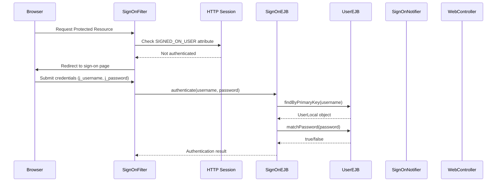
```mermaid
sequenceDiagram
    participant Browser as Browser
    participant Filter as SignOnFilter
    participant Session as HTTP Session
    participant SignOn as SignOnEJB
    participant User as UserEJB
    participant Notifier as SignOnNotifier
    participant Controller as WebController
    
    Browser->>Filter: Request Protected Resource
    Filter->>Session: Check SIGNED_ON_USER attribute
    Session-->>Filter: Not authenticated
    Filter->>Browser: Redirect to sign-on page
    Browser->>Filter: Submit credentials (j_username, j_password)
    Filter->>SignOn: authenticate(username, password)
    SignOn->>User: findByPrimaryKey(username)
    User-->>SignOn: UserLocal object
    SignOn->>User: matchPassword(password)
    User-->>SignOn: true/false
    SignOn-->>Filter: Authentication result
```

The core EJB-based authentication components consist of two EJBs: `UserEJB` (entity bean) stores username/password data, while `SignOnEJB` (stateless session bean) provides authentication services. The `UserEJB` is implemented as a container-managed persistence (CMP) entity bean with a String primary key representing the username. The `SignOnEJB` acts as a facade to the `UserEJB`, offering a simplified interface for authentication and user creation.

The framework uses XML configuration (`signon-config.xml`) to define protected resources, sign-on pages, and error pages, enabling declarative security without hardcoding protected URLs in application code. This configuration-driven approach provides several advantages: it centralizes security policy in a single location, allows for changes to protected resources without modifying code, and makes security policies more transparent and easier to audit.

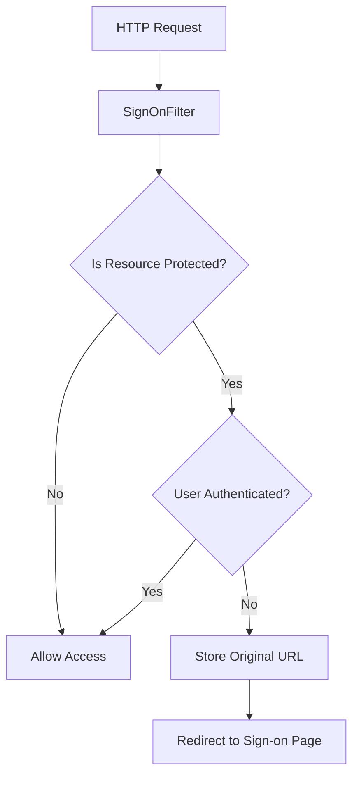
```mermaid
flowchart TD
    Request[HTTP Request] --> Filter[SignOnFilter]
    
    Filter --> IsProtected{Is Resource Protected?}
    IsProtected -->|No| AllowAccess[Allow Access]
    IsProtected -->|Yes| CheckAuth{User Authenticated?}
    
    CheckAuth -->|Yes| AllowAccess
    CheckAuth -->|No| StoreURL[Store Original URL]
    StoreURL --> Redirect[Redirect to Sign-on Page]
```

Event-based notification is implemented through the `SignOnNotifier`, which implements `HttpSessionAttributeListener` to detect successful sign-ons by monitoring session attributes. This enables loose coupling between the authentication framework and application-specific behavior that needs to occur after successful authentication.

User preferences are integrated with authentication, loading locale settings and other preferences from the user's profile upon successful authentication. These preferences are applied to the user's session, enabling immediate personalization as soon as a user signs in.

Persistent authentication is implemented through cookies, with the `SignOnFilter` creating a cookie named "bp_signon" containing the username when a user checks the "remember username" option. This enhances user experience by eliminating the need to re-enter usernames on subsequent visits.

Exception handling for authentication includes specialized exceptions like `DuplicateAccountException` to handle authentication-specific error conditions, providing clear error messages for account creation failures.

This comprehensive security implementation demonstrates Java Pet Store's adherence to J2EE best practices, creating a secure, flexible, and user-friendly authentication system.

## Project Summary
The Java Pet Store 1.3.2 is a reference implementation developed by Sun Microsystems for the Java 2 Platform, Enterprise Edition (J2EE) BluePrints Program. It demonstrates best practices for enterprise application development through a fully functional e-commerce platform for pet products.

## Purpose & Value
- Serves as an architectural blueprint for J2EE applications
- Demonstrates practical implementation of design patterns and best practices
- Provides a learning resource for developers to understand enterprise architecture
- Shows implementation of core J2EE components (EJB, JSP, Servlets, JMS)
- Illustrates scalable, maintainable architecture patterns

## Key Functionalities
- Product catalog management with hierarchical organization
- Shopping cart implementation
- Complete order processing workflow
- Customer account management
- Administration interface for backend operations

## Technical Architecture
The application implements a multi-tier architecture:
- **Client Tier**: Web browser interface
- **Web Tier**: JSP, Servlets, Web Application Framework (WAF)
- **Business Tier**: EJBs for business logic and domain objects
- **Integration Tier**: JMS, JNDI, JTA services
- **Resource Tier**: Databases and external systems

## Design Patterns & Features
- **Model-View-Controller (MVC)** pattern for UI separation
- **Service Locator** pattern for resource discovery
- **Data Access Objects (DAO)** for database abstraction
- **Business Delegates** for separating presentation from business logic
- **Event-driven architecture** for asynchronous processing
- **XML-based configuration** for flexibility and portability
- **Comprehensive internationalization** support
- **Asynchronous messaging** via JMS for order processing
- **Component-based development** with clear interfaces
- **Exception handling framework** for business and technical exceptions

## Security Implementation
- Authentication through servlet filters and EJB components
- Authorization for protected resources
- XML-based security configuration
- Event-based notification for authentication events
- User preferences integrated with authentication

This reference implementation has significantly influenced Java enterprise development practices and continues to serve as a valuable learning resource for understanding enterprise application architecture.
