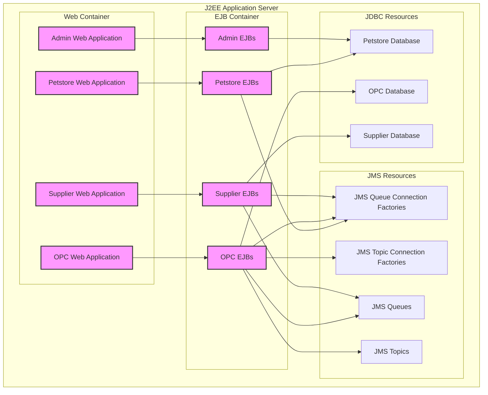
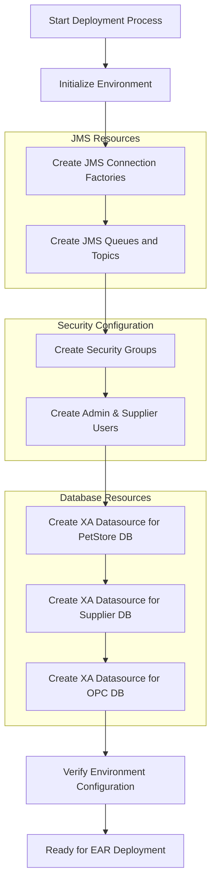
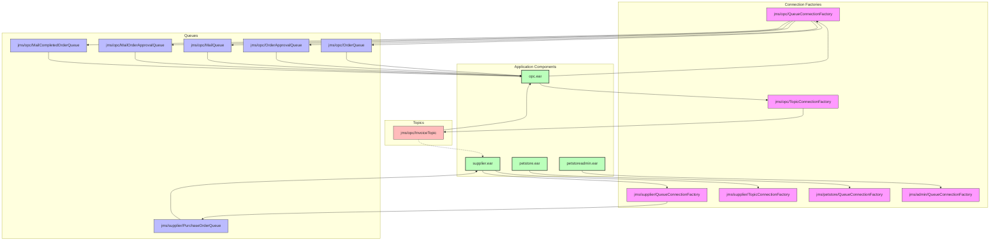
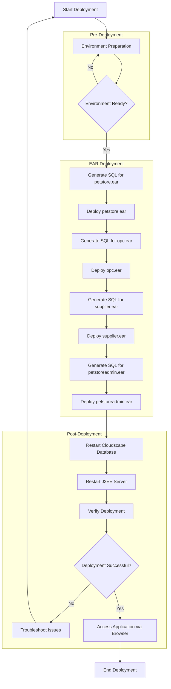
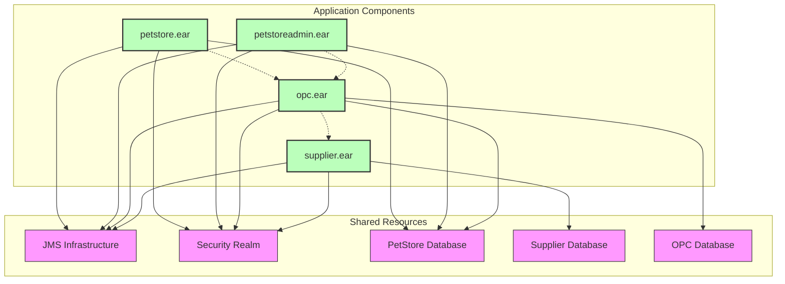

# Java Pet Store Deployment Architecture

## Overview of Java Pet Store Deployment Architecture

The Java Pet Store 1.3.2 deployment architecture represents a sophisticated multi-tiered enterprise application design following J2EE best practices. The application is structured into four distinct deployable components, each packaged as an Enterprise Archive (EAR) file: petstore.ear (core customer-facing functionality), petstoreadmin.ear (administrative interface), opc.ear (order processing center), and supplier.ear (supplier integration system). This modular approach enables separation of concerns, allowing each component to be deployed, maintained, and scaled independently while still functioning as part of a cohesive system. The deployment architecture leverages J2EE container services for transaction management, security, and resource pooling, with extensive use of JMS for asynchronous communication between components, and XA-compliant datasources for maintaining data integrity across multiple databases.

## Java Pet Store Deployment Components

The diagram illustrates the four main deployable components of the Java Pet Store application and their relationships within the J2EE environment. Each EAR file contains both web and EJB modules that interact with shared JMS and database resources. The petstore.ear handles customer interactions, petstoreadmin.ear provides administrative capabilities, opc.ear manages order processing, and supplier.ear interfaces with supplier systems. This architecture demonstrates a clean separation of concerns while allowing for efficient communication between components through JMS messaging and shared database access.

## Pre-deployment Environment Configuration

Before deploying the Java Pet Store application, a comprehensive environment setup is required to ensure all necessary resources are available to the application components. The setup process begins with the creation of JMS infrastructure, including connection factories, queues, and topics that enable asynchronous communication between application components. Next, three separate XA-compliant datasources must be configured for the PetStore, Supplier, and OPC databases, ensuring transactional integrity across distributed operations. Security configuration is equally important, requiring the creation of user groups and specific accounts with appropriate permissions, including the 'jps_admin' administrative account and 'supplier' account for supplier operations. The pre-deployment process also involves setting environment variables and ensuring the J2EE server is properly configured with the necessary services enabled. This meticulous preparation ensures that when the EAR files are deployed, they can immediately access all required resources and function correctly within the enterprise environment.

## Deployment Prerequisites Workflow

This workflow diagram illustrates the sequential initialization steps required before deploying the Java Pet Store application. The process begins with basic environment setup and progresses through creating messaging infrastructure, security configurations, and database resources. Each step is a prerequisite for successful application deployment, ensuring that all necessary resources are properly configured and available. The workflow demonstrates the complexity of enterprise application deployment, where multiple infrastructure components must be coordinated before the application itself can be deployed. This methodical approach minimizes deployment failures and ensures the application will have access to all required resources when it starts.

## JMS Infrastructure for Application Communication

The Java Pet Store deployment establishes an extensive JMS infrastructure that serves as the backbone for asynchronous communication between application components. This messaging architecture includes multiple queue connection factories (jms/opc/QueueConnectionFactory, jms/supplier/QueueConnectionFactory, jms/petstore/QueueConnectionFactory, jms/admin/QueueConnectionFactory) that provide pooled connections to JMS providers. The deployment also creates specialized queues for different business processes: order processing queues (jms/opc/OrderQueue, jms/opc/OrderApprovalQueue), email notification queues (jms/opc/MailQueue, jms/opc/MailOrderApprovalQueue, jms/opc/MailCompletedOrderQueue), and supplier interaction queues (jms/supplier/PurchaseOrderQueue). Additionally, topic connection factories (jms/opc/TopicConnectionFactory, jms/supplier/TopicConnectionFactory) and topics (jms/opc/InvoiceTopic) enable publish-subscribe messaging patterns for broadcasting events to multiple consumers. This sophisticated messaging infrastructure enables loosely coupled interactions between application components, allowing them to operate independently while maintaining system-wide data consistency and business process integrity through reliable asynchronous communication channels.

## JMS Messaging Architecture

The diagram illustrates the comprehensive JMS messaging architecture that enables asynchronous communication between Java Pet Store components. Connection factories provide managed connections to the messaging system, while queues and topics serve as message destinations. The point-to-point messaging pattern (via queues) ensures reliable delivery of orders, approvals, and notifications between components, while the publish-subscribe pattern (via topics) enables broadcasting of invoice events to multiple interested parties. This architecture demonstrates how enterprise applications can achieve loose coupling between components while maintaining reliable communication channels for critical business processes.

## Database Resource Configuration

The Java Pet Store deployment requires the configuration of three distinct XA-compliant datasources, each supporting a different functional area of the application. The primary "PetStoreDB" datasource (jdbc/petstore/PetStoreDB) serves the core e-commerce functionality, storing product catalogs, customer information, and orders. It's accessed by both the main petstore.ear and the administrative petstoreadmin.ear components. The "SupplierDB" datasource (jdbc/supplier/SupplierDB) is dedicated to supplier management, handling inventory, purchase orders, and supplier profiles used by the supplier.ear component. The "OPCDB" datasource (jdbc/opc/OPCDB) supports the Order Processing Center functionality, managing order workflows, approvals, and fulfillment processes accessed by the opc.ear component. All three datasources are configured as XA resources using Cloudscape's RemoteXaDataSource driver, enabling distributed transactions across multiple databases when necessary. This configuration ensures data integrity while allowing each application component to maintain its own dedicated database schema, promoting modularity and separation of concerns. The setup.xml script automates the creation of these datasources with appropriate properties, including the "createDatabase=create" flag to initialize the databases if they don't already exist.

## Security and User Management

The Java Pet Store deployment implements a comprehensive security configuration that establishes the necessary user groups and accounts required for proper application functionality. The deployment process creates a default security group that serves as the foundation for role-based access control throughout the application. Two specific user accounts are provisioned during deployment: the "jps_admin" account with administrative privileges, allowing access to the administration interface for catalog management, order processing, and system configuration; and the "supplier" account, which enables supplier partners to interact with the supplier interface for managing inventory, processing purchase orders, and updating product information. These security configurations are implemented using the J2EE server's built-in realm-based authentication system, with the RealmTool utility handling the creation of groups and users. This security model enforces proper separation of duties between regular customers (who don't require special accounts), administrative staff, and supplier partners, ensuring that each user type has access only to the functionality appropriate for their role within the system.

## Deployment Process Flow

This diagram illustrates the complete deployment process flow for the Java Pet Store application, from initial environment preparation through SQL generation and EAR deployment to final verification steps. The process follows a sequential pattern where each component is deployed only after the previous one has been successfully installed. The SQL generation step for each EAR creates the necessary database schema before deployment, ensuring that database structures are in place when the application starts. Post-deployment steps include restarting key services and verification to ensure the application is functioning correctly. This methodical approach minimizes deployment failures and provides clear points for troubleshooting if issues arise.

## EAR Deployment and SQL Generation

The Java Pet Store deployment process involves a carefully orchestrated sequence of SQL generation and EAR deployment steps to ensure proper application initialization. The process begins with the petstore.ear component, which contains the core customer-facing functionality. First, the deploytool utility generates the necessary SQL scripts to create database tables, indexes, and constraints for the PetStore database. Once the SQL generation is complete, the petstore.ear is deployed to the J2EE server. This same pattern is then repeated for the remaining components: opc.ear (Order Processing Center), supplier.ear (Supplier interface), and petstoreadmin.ear (Administration interface). The sequence is important because it respects the dependencies between components - the core petstore component must be available before the supporting components can function properly. The SQL generation step is particularly critical as it ensures that each component's database schema is properly initialized before the application attempts to access it. This two-phase approach (SQL generation followed by deployment) for each component minimizes deployment failures due to missing database structures and provides a clean separation between database initialization and application deployment concerns.

## Post-Deployment Configuration

After the successful deployment of all four EAR files (petstore.ear, opc.ear, supplier.ear, and petstoreadmin.ear), several critical post-deployment steps must be completed to ensure the Java Pet Store application functions correctly. First, both the Cloudscape database server and the J2EE application server must be restarted to ensure all deployed components are properly initialized and all database connections are refreshed. This restart helps clear any cached resources and ensures that the application starts with a clean state. Following the restart, verification procedures should be performed to confirm that all application components are running correctly, including checking server logs for startup errors, verifying that all required JMS destinations are active, and ensuring database connectivity is established. The final step involves accessing the deployed application through the web interface by navigating to http://[server-name]:[port]/petstore in a web browser. This allows for functional testing of the customer-facing interface, while administrative functions can be accessed through the separate admin interface. Any post-deployment issues should be investigated by examining server logs, verifying database connectivity, and ensuring that all required resources are properly configured and accessible to the application.

## Application Component Dependencies

This diagram visualizes the dependencies between the Java Pet Store application components and their shared resources. Each EAR file depends on specific database resources and the common JMS and security infrastructure. The dotted lines represent functional dependencies between components, where one component relies on services provided by another. For example, the petstore component depends on the OPC component for order processing, while the OPC component depends on the supplier component for inventory management. This architecture demonstrates how enterprise applications can be decomposed into loosely coupled components that communicate through well-defined interfaces and shared resources, enabling independent development, deployment, and scaling while maintaining system cohesion.

[Generated by the Sage AI expert workbench: 2025-03-21 23:18:02  https://sage-tech.ai/workbench]: #