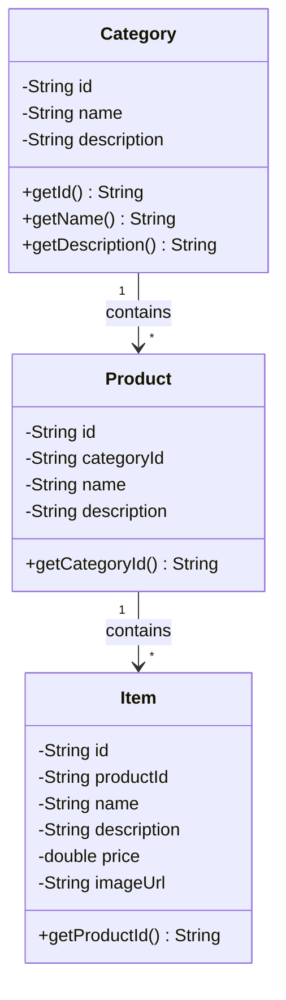
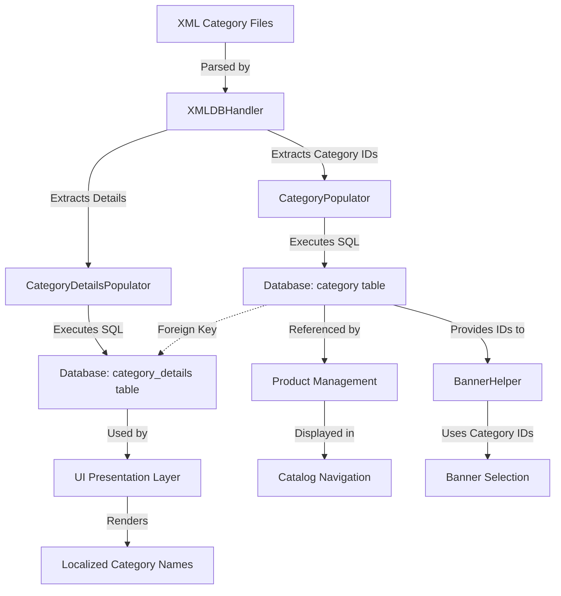
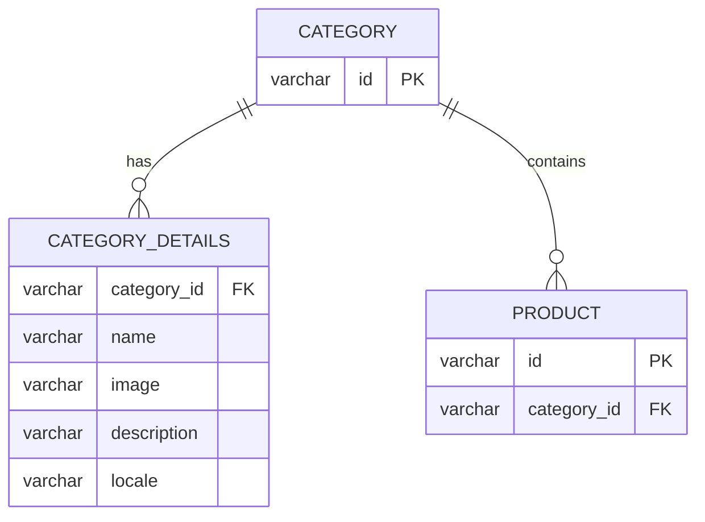

# Category Management in Java Pet Store 1.3.2

## Category Model Architecture

The Category class serves as a fundamental data model representing product categories in the Java Pet Store application. Implemented as a serializable entity, this class encapsulates the core attributes of a product category: a unique identifier, a display name, and a descriptive text. The serializable nature of the Category class enables it to be persisted to storage, transmitted across networks, and reconstructed in different application tiers. This design choice aligns with J2EE best practices for entity models that need to traverse application boundaries.

Categories form the top level of the product hierarchy in the Pet Store catalog system. Each Category contains multiple Products, which in turn contain multiple InventoryItems. This hierarchical structure enables efficient organization and navigation of the product catalog. The Category class provides a clean API with getter methods for all properties and a toString() method for debugging and logging purposes. Notably, the class includes both a fully-parameterized constructor and a no-argument constructor, with the latter specifically designed to support JavaBean conventions required by the web tier components.

## Category Hierarchy Structure

The diagram illustrates the hierarchical relationship between categories, products, and inventory items in the Pet Store catalog system. This structure forms the backbone of the catalog navigation system. Categories represent the broadest classification (e.g., "Dogs", "Cats", "Fish"), each containing multiple products (e.g., "Bulldog", "Poodle", "Dalmation" under "Dogs"). Products in turn contain multiple inventory items representing specific variants or individual items available for purchase. This organization enables customers to navigate from general categories to specific purchasable items in a logical manner, while also supporting efficient catalog management from an administrative perspective.

## XML Schema for Category Data

The Category.dtd and CategoryDetails.dtd files define the structure for XML category data in the Java Pet Store application. These Document Type Definitions (DTDs) establish a formal contract for how category information should be structured in XML documents, enabling consistent data representation and validation for multilingual category information.

Category.dtd defines the root structure, specifying that a Category element must have a unique ID attribute and contain one or more CategoryDetails elements. It uses an external entity reference to include the CategoryDetails.dtd definition, demonstrating a modular approach to DTD design that promotes reusability and maintainability.

CategoryDetails.dtd complements this by defining the structure for the CategoryDetails elements. Each CategoryDetails element must contain a Name element and may optionally include Image and Description elements. Critically, it requires a mandatory xml:lang attribute for the CategoryDetails element to specify the language, enabling multilingual support for category information. This attribute is essential for internationalization, allowing the same category to have names and descriptions in multiple languages.

Together, these DTDs ensure that XML documents containing category information conform to a consistent structure when populating the pet store database, facilitating reliable data import and export operations.

## Database Population Mechanism

The CategoryPopulator and CategoryDetailsPopulator classes work together to extract category data from XML sources and populate database tables. These classes form a specialized ETL (Extract, Transform, Load) mechanism designed specifically for category data in the Java Pet Store application.

CategoryPopulator handles the main category attributes, particularly the category ID which serves as the primary key. It contains methods for database table management (check, create, drop) and leverages the XMLDBHandler class to parse XML category data and execute corresponding database operations. The class maintains a reference to CategoryDetailsPopulator, establishing a parent-child relationship that mirrors the structure defined in the DTDs.

CategoryDetailsPopulator manages the multilingual details associated with each category, including name, description, image, and locale information. It similarly provides methods for database operations and XML parsing. The class uses the PopulateUtils helper to execute SQL statements, supporting both actual database insertion and SQL statement printing based on the connection parameter.

Both populators follow a consistent pattern of operation: they parse XML data using SAX filters, extract relevant attributes and elements, and map these to database columns through parameterized SQL statements. This approach provides a clean separation between data representation (XML) and storage (relational database), while maintaining the integrity of the category data model.

## Category Data Flow

This diagram illustrates the flow of category data from XML files through the population classes to database storage and eventual presentation in the application. The process begins with XML category files that conform to the Category.dtd and CategoryDetails.dtd specifications. These files are parsed by the XMLDBHandler, which extracts category IDs and details.

The CategoryPopulator processes the core category data, executing SQL statements to populate the category table in the database. Simultaneously, the CategoryDetailsPopulator handles the multilingual details, populating the category_details table. These tables are related through a foreign key relationship, where category_details references the primary category ID.

Once stored in the database, category data serves multiple purposes in the application. The Product Management component uses category IDs to organize products, which are then displayed in the Catalog Navigation interface. The UI Presentation Layer uses the localized category details to render appropriate names and descriptions based on the user's language preference.

Additionally, the BannerHelper class uses category IDs to select appropriate banner images for different product categories, enhancing the visual presentation of the catalog. This comprehensive flow demonstrates how category data moves from static XML files to dynamic, interactive elements of the user interface.

## Multilingual Category Support

The Java Pet Store application implements a robust approach to handling multiple languages for category information through the xml:lang attribute and CategoryDetails structure. This design enables a truly internationalized catalog where categories can be presented in the user's preferred language without duplicating the underlying data model.

At the core of this implementation is the CategoryDetails entity, which encapsulates language-specific attributes of a category: name, description, and image. Each Category can have multiple associated CategoryDetails objects, one for each supported language. The xml:lang attribute serves as a discriminator, identifying which language a particular set of details represents.

The CategoryDetailsPopulator class manages the persistence of this multilingual data, ensuring that each language variant is properly stored in the database. When retrieving category information for display, the application can filter the CategoryDetails based on the user's locale preference, presenting the appropriate localized content.

This approach offers several advantages over simpler internationalization strategies. Rather than maintaining separate catalogs for each language or embedding all translations within a single entity, the Category-CategoryDetails relationship provides a clean separation of concerns. The core category identity and structure remain language-neutral, while the presentation details can vary by locale. This design also allows for asymmetric localization, where some categories might have more complete translations in certain languages based on regional market priorities.

## Category-Based Presentation

The BannerHelper class exemplifies how the system uses category information to customize the user interface by selecting appropriate banner images for different product categories. This class implements a simple yet effective strategy for enhancing the visual presentation of the catalog based on the current category context.

BannerHelper maintains a categoryId field that can be set to indicate which product category the user is currently browsing. The getBanner() method maps this ID to a corresponding banner image filename through a series of conditional statements. For example, when the category is "dogs", the method returns "banner_dogs.gif", providing a visually distinct header for the Dogs category page.

This implementation demonstrates a pattern of context-sensitive UI customization driven by the category model. While the current implementation uses hard-coded mappings between category IDs and banner images, the class comments acknowledge that this mapping could be externalized to properties files or database tables for greater flexibility and maintainability.

The serializable nature of BannerHelper supports its use within the web tier's state management system, allowing the selected category context to persist across requests within a user session. This ensures consistent presentation as users navigate through the catalog.

This approach to category-based presentation could be extended to other UI elements beyond banners, such as category-specific color schemes, layouts, or promotional content, creating a more immersive and tailored shopping experience based on the product categories being explored.

## Category Management Database Schema

The database schema supporting category management in the Java Pet Store application consists of two primary tables with a third related table for products. The CATEGORY table is minimalist, containing only the category ID as its primary key. This design choice reflects the nature of categories as primarily organizational entities whose meaningful attributes are language-dependent.

The CATEGORY_DETAILS table stores the localized information for each category, including name, description, image reference, and locale identifier. The composite primary key consists of the category_id (foreign key to CATEGORY) and locale, ensuring that each category can have exactly one set of details per language. This structure efficiently supports multilingual content without redundancy.

The PRODUCT table references CATEGORY through a foreign key relationship, establishing the hierarchical organization of the catalog. This allows efficient queries for all products within a specific category.

This schema design demonstrates several important database principles:
1. Separation of identity (CATEGORY) from descriptive attributes (CATEGORY_DETAILS)
2. Support for internationalization through locale-specific detail records
3. Normalization to eliminate redundancy while maintaining referential integrity
4. Simple hierarchical relationships that mirror the logical organization of the catalog

The schema provides a solid foundation for category management operations while remaining flexible enough to accommodate future enhancements such as category hierarchies or additional metadata.

## XML Parsing and Database Integration

The CategoryPopulator and CategoryDetailsPopulator classes leverage a sophisticated XML parsing and database integration mechanism through the XMLDBHandler implementation. This approach demonstrates an elegant solution for transforming hierarchical XML data into relational database structures while maintaining the semantic relationships between entities.

XMLDBHandler extends the SAX XMLFilter class, providing event-driven parsing of XML documents. As the parser encounters elements matching predefined patterns (such as Category and CategoryDetails elements), it captures the relevant attributes and text content. The handler maintains a context map of these values, which can then be used to construct SQL statements for database operations.

Both populator classes create anonymous inner classes extending XMLDBHandler, overriding the create() method to define specific database operations. This method uses the PopulateUtils helper class to execute parameterized SQL statements, mapping XML data to database columns through the PARAMETER_NAMES array that defines the expected order of parameters.

A notable feature of this implementation is its flexibility in execution modes. When provided with a valid database connection, the system performs actual database insertions. Without a connection, it generates and prints the equivalent SQL statements, useful for debugging or generating scripts for later execution.

This architecture effectively decouples the concerns of XML parsing, data mapping, and database operations, making the system more maintainable and extensible. The consistent pattern across different entity types (categories, products, items) demonstrates a systematic approach to data import that could easily accommodate additional entity types or structural changes to existing entities.

## Category Management Extensibility

The category management system in the Java Pet Store application demonstrates several design considerations that facilitate extensibility for future enhancements. While the current implementation provides a solid foundation for basic category organization and multilingual support, several areas could be extended to support more complex business requirements.

One notable extensibility point is in the BannerHelper class, which currently uses hard-coded mappings between category IDs and banner image filenames. As mentioned in the class comments, these mappings could be externalized to properties files or database tables, allowing for runtime configuration without code changes. This would enable marketing teams to update category presentations without developer intervention.

The flat category structure could be extended to support hierarchical categories (subcategories) by adding a parent_id reference to the Category model. This would enable more complex catalog organizations while maintaining the clean separation between category identity and localized details.

The XML import mechanism is designed with extensibility in mind, using a consistent pattern of DTDs, populator classes, and database mappings. This approach could be extended to support additional category attributes or relationships by:
1. Enhancing the DTDs to define new elements or attributes
2. Updating the populator classes to capture and persist these new data points
3. Extending the database schema to store the additional information

The serializable nature of the Category model supports potential integration with distributed caching systems or remote service invocations, allowing the category management system to scale across multiple application instances or integrate with external systems.

Finally, the clean separation between data model, persistence, and presentation concerns follows good J2EE practices, making it straightforward to extend any layer independently. For example, new presentation strategies could be implemented without changing the underlying data model, or the persistence mechanism could be updated to use JPA annotations while maintaining compatibility with existing business logic.

[Generated by the Sage AI expert workbench: 2025-03-29 21:37:00  https://sage-tech.ai/workbench]: #