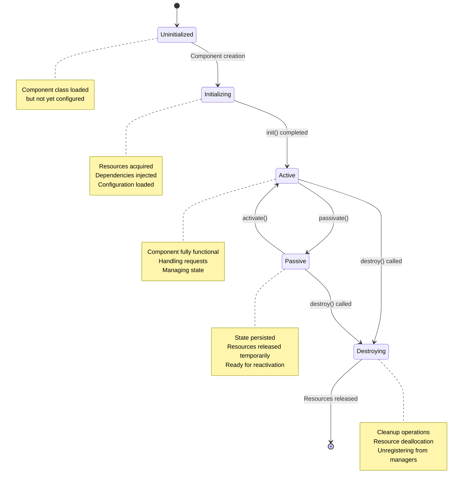
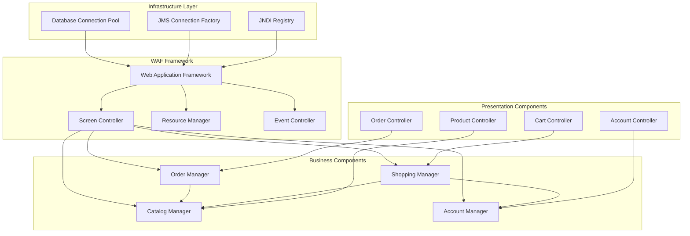
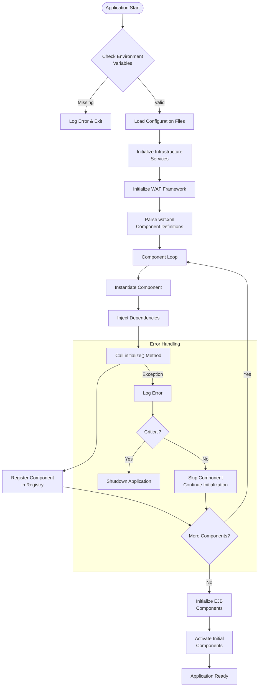
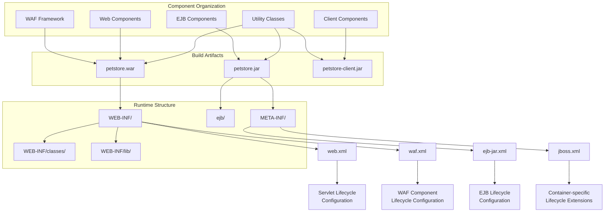

# Component Lifecycle Management in Java Pet Store 1.3.2

## Component Lifecycle Overview in Java Pet Store

Java Pet Store 1.3.2 implements a sophisticated component lifecycle management approach that reflects J2EE best practices of the era. The application employs a structured architecture where components progress through well-defined lifecycle phases from creation to destruction. This lifecycle management is distributed across multiple layers, with the Web Application Framework (WAF) providing the foundation for web components, while EJB containers manage the business components. The architecture emphasizes clean separation between initialization, active operation, passivation, and termination phases, allowing for efficient resource utilization and state management. Components are registered with appropriate managers upon creation, configured through deployment descriptors and property files, and properly decommissioned during application shutdown. This approach ensures that resources are properly allocated and released, maintaining system stability even under varying load conditions.

## Component Lifecycle Phases

The diagram illustrates the key phases in a component's lifecycle within the Java Pet Store application. Components begin in an uninitialized state after class loading, then enter initialization where resources are acquired and dependencies are injected. Once active, components can handle requests and manage state. The application supports passivation for resource optimization, allowing components to temporarily release resources while preserving state. Components can be reactivated when needed. The destruction phase ensures proper cleanup and resource deallocation before the component is completely removed from the system. This lifecycle management is particularly evident in the EJB components and servlet-based controllers that form the backbone of the Pet Store application.

## Build System Integration

The build.sh script serves as the foundational element for component lifecycle management in Java Pet Store 1.3.2, establishing the necessary environment for component compilation, packaging, and deployment. This script performs critical pre-initialization checks that directly impact component behavior throughout their lifecycle. By validating the presence of JAVA_HOME and J2EE_HOME environment variables, it ensures that components will have access to the correct JDK and J2EE libraries during both build-time and runtime. The script's dynamic resolution of Java executable paths demonstrates a flexible approach to environment configuration, allowing components to be built consistently across different development environments.

The Ant classpath construction within build.sh is particularly significant for component lifecycle management, as it assembles the precise set of dependencies required for proper component initialization. By including tools.jar, ant.jar, parser.jar, jaxp.jar, and j2ee.jar in a specific order, the script ensures that components will be compiled against the correct API versions and with all necessary dependencies resolved. This careful dependency management at build time prevents subtle class loading and compatibility issues that could otherwise manifest during component initialization or operation phases. The build system thus establishes the foundation for reliable component lifecycle by ensuring that all prerequisites for proper component operation are satisfied before the components are even instantiated.

## Component Dependencies and Resolution

Java Pet Store 1.3.2 implements a sophisticated dependency resolution system that underpins its component lifecycle management. The application uses a combination of explicit classpath configuration (as seen in the build.sh script) and container-managed dependency injection to ensure components have access to their required dependencies throughout their lifecycle. During component initialization, the application leverages the J2EE container's JNDI registry to locate and inject service dependencies, while also supporting direct lookup for components that need to dynamically discover dependencies at runtime.

The dependency resolution mechanism is hierarchical, with lower-level infrastructure components being initialized first, followed by business components and finally presentation-layer components. This initialization order ensures that dependencies are available when needed. For EJB components, the container manages dependency resolution through the ejb-ref and resource-ref elements in deployment descriptors, while for web components, the WAF framework provides a custom dependency resolution mechanism. The application also implements a form of lazy initialization for certain components, where dependencies are resolved only when first accessed rather than at startup. This approach optimizes resource usage by deferring the initialization of rarely-used components until they are actually needed, while ensuring that core components are always available from application startup.

## Component Dependency Hierarchy

The component dependency hierarchy diagram illustrates the layered architecture of Java Pet Store 1.3.2, showing how components depend on each other throughout their lifecycle. At the foundation, infrastructure services like database connection pools, JMS connection factories, and the JNDI registry provide essential resources. The Web Application Framework (WAF) builds upon these services, offering core functionality through its Screen Controller, Resource Manager, and Event Controller components.

Business components form the middle tier, with managers for catalog, orders, accounts, and shopping functionality. These components have interdependencies - for example, the Order Manager depends on the Catalog Manager for product information, while the Shopping Manager relies on both Catalog and Account Managers. At the presentation layer, controller components interface with their respective business components to handle user interactions.

This hierarchical structure directly influences component lifecycle management. Components must be initialized in dependency order (bottom to top) and destroyed in reverse order (top to bottom) to maintain system integrity. The WAF framework orchestrates this process, ensuring that dependent components are not activated until their dependencies are ready, and that components are not destroyed while still being referenced by others. This careful management of dependencies is critical for maintaining application stability throughout component lifecycle transitions.

## Web Application Framework (WAF) Component Management

The Web Application Framework (WAF) in Java Pet Store 1.3.2 serves as the central orchestrator for web component lifecycle management. It implements a sophisticated component registry that tracks the state of all web-facing components from initialization through destruction. During application startup, the WAF's ServletContextListener implementation triggers the component initialization sequence, parsing the waf.xml configuration file to identify components that need to be created. For each component, the WAF instantiates the class, injects dependencies through setter methods, and calls the initialize() method to complete setup.

The WAF's component management extends beyond simple creation and destruction. It implements a request processing pipeline where components can register as request handlers, response generators, or both. When handling requests, the WAF activates the appropriate components in sequence, managing their state transitions between requests. For components that implement the Poolable interface, the WAF provides sophisticated instance pooling, allowing components to be passivated when not in use and reactivated when needed. This reduces memory consumption while maintaining performance. During application shutdown, the WAF systematically calls destroy() on all registered components in reverse dependency order, ensuring clean resource release. The framework also provides error handling for component lifecycle events, catching exceptions during initialization or destruction and logging detailed diagnostics while preventing cascading failures. This comprehensive approach to component lifecycle management enables the Pet Store application to maintain stability even under varying load conditions.

## Environment Configuration Impact on Component Lifecycle

Environment variables play a pivotal role in shaping component behavior throughout the lifecycle stages in Java Pet Store 1.3.2. The application's sensitivity to environment configuration begins at the build phase, as evidenced by the build.sh script's explicit checks for JAVA_HOME and J2EE_HOME. These variables not only influence the compilation environment but also determine which versions of core libraries will be linked to components, affecting their runtime behavior. During component initialization, the application reads environment-specific configuration from multiple sources, including system properties, environment variables, and configuration files, with a sophisticated fallback mechanism that allows for environment-specific overrides.

The J2EE_HOME variable is particularly significant as it determines the container implementation that will manage component lifecycles, especially for EJB components whose lifecycle events (creation, activation, passivation, and removal) are container-controlled. Different J2EE containers may implement slightly different interpretations of the EJB specification, affecting component behavior during state transitions. Similarly, JAVA_HOME impacts the JVM features available to components, potentially affecting their performance characteristics and available APIs. The application also uses environment variables to configure connection pools, thread limits, and cache sizes, all of which influence how components manage resources throughout their lifecycle. This environment-aware design allows the Pet Store application to adapt to different deployment scenarios while maintaining consistent component behavior, demonstrating a sophisticated approach to configuration management that was ahead of its time for a J2EE 1.3 application.

## Component Initialization Sequence

The component initialization sequence diagram illustrates the ordered process through which Java Pet Store 1.3.2 bootstraps its component ecosystem. The process begins with environment validation, ensuring that critical variables like JAVA_HOME and J2EE_HOME are properly set. Once validated, the application loads configuration files that define component parameters and relationships.

Infrastructure services are initialized first, establishing the foundation for higher-level components. These include database connection pools, JMS providers, and security services. The WAF framework is then initialized, providing the container for web components. The application parses the waf.xml configuration file to identify component definitions, including their class names, dependencies, and initialization parameters.

For each component, the application follows a consistent initialization pattern:
1. Instantiate the component class
2. Inject dependencies through setter methods or direct field access
3. Call the component's initialize() method to perform custom setup
4. Register the fully initialized component in the application registry

The initialization process includes robust error handling. When a component fails to initialize, the system logs detailed diagnostic information and determines whether to abort the entire initialization process or skip the problematic component based on its criticality.

After web components are initialized, the system triggers initialization of EJB components through the J2EE container. Finally, components marked for immediate activation are transitioned to their active state, making the application ready to handle requests. This carefully orchestrated sequence ensures that components are initialized in the correct dependency order, maintaining system integrity throughout the startup process.

## Component Registry and Lookup Mechanisms

Java Pet Store 1.3.2 implements a sophisticated component registry system that serves as the backbone for component discovery and access throughout the application lifecycle. The registry operates as a hierarchical repository, organizing components by both type and name to facilitate efficient lookup. Components are registered during the initialization phase, either programmatically or through declarative configuration in deployment descriptors and the waf.xml file. The registry maintains not only references to component instances but also metadata about their state, dependencies, and lifecycle stage, enabling intelligent management decisions.

The application employs multiple lookup mechanisms to accommodate different component types and access patterns. For EJB components, it leverages the standard JNDI-based lookup provided by the J2EE container, with caching to improve performance. For web components managed by the WAF framework, it provides both direct lookup by name and type-based discovery that returns all components implementing a particular interface. The registry also supports contextual lookup, where components can be discovered based on their relationship to the current request or session. To prevent circular dependencies during initialization, the registry implements a lazy resolution mechanism where dependencies are satisfied on first access rather than at registration time. This approach allows components with mutual dependencies to be properly initialized. The registry also provides lifecycle notifications, alerting dependent components when a component they rely on changes state or becomes unavailable. This comprehensive approach to component registration and discovery ensures that components can reliably locate their dependencies throughout their lifecycle, contributing to the application's overall robustness.

## Resource Management During Component Lifecycle

Java Pet Store 1.3.2 implements a multi-layered approach to resource management throughout the component lifecycle. At the infrastructure level, the application leverages container-managed resources such as JDBC connection pools, JMS connection factories, and thread pools, relying on the J2EE container's implementation of resource pooling and lifecycle management. These resources are acquired during component initialization and properly released during component destruction, with the container handling the complexities of connection validation and renewal.

For component-specific resources, the application implements a consistent pattern where resources are acquired in the initialize() method, temporarily released during passivation (if the component supports it), reacquired during activation, and permanently released in the destroy() method. This pattern is particularly evident in the WAF framework components that manage file system resources, in-memory caches, and thread-local storage. The application also implements resource usage tracking, where components register their resource requirements with a central manager that monitors overall resource consumption and can trigger passivation of inactive components when system resources become constrained.

Error handling for resource management is robust, with components implementing cleanup code in finally blocks to ensure resources are released even when exceptions occur. For long-lived resources like database connections, the application implements validation before use and automatic reconnection when connections become stale. The application also employs a resource hierarchy, where high-level components acquire resources through intermediate managers rather than directly, allowing for centralized resource policies and more efficient sharing. This comprehensive approach to resource management ensures that the Pet Store application maintains stable performance even under varying load conditions while preventing resource leaks that could otherwise degrade system performance over time.

## Component Packaging Structure

The component packaging structure diagram illustrates how Java Pet Store 1.3.2 organizes its components into deployment artifacts and how this organization influences component lifecycle management. The application is divided into three main build artifacts: petstore.war (web components), petstore.jar (EJB components), and petstore-client.jar (client components).

The WAF Framework and web components are packaged into the WAR file, while EJB components reside in the EJB JAR. Utility classes that support multiple component types are replicated across all three artifacts to ensure availability. This separation reflects the J2EE architectural pattern of the era, with distinct tiers for presentation, business logic, and client access.

At runtime, these components are organized into a directory structure that follows J2EE conventions. Web components reside in WEB-INF/classes or WEB-INF/lib (if packaged as JARs), while EJB components are deployed to the container's EJB directory. This organization ensures that the appropriate class loaders manage each component type, which is crucial for proper lifecycle management.

The diagram also highlights the configuration files that control component lifecycle. The web.xml file configures servlet lifecycle events, while waf.xml defines WAF component initialization parameters and dependencies. For EJB components, ejb-jar.xml specifies standard lifecycle attributes like transaction behavior and security roles, while container-specific files like jboss.xml provide extended lifecycle controls such as pooling parameters and cache configuration.

This structured packaging approach ensures that components are properly isolated yet can interact when needed, with clear lifecycle boundaries that align with J2EE container management capabilities. The organization also supports the incremental deployment of components, allowing for updates to specific parts of the application without requiring a full redeployment.

## Lifecycle Management Best Practices

Java Pet Store 1.3.2 exemplifies several best practices for component lifecycle management that remain relevant even in modern application architectures. First, the application demonstrates clear separation of concerns in lifecycle handling, with initialization logic isolated from business logic, making components more testable and maintainable. Components follow a consistent lifecycle pattern with well-defined initialize(), activate(), passivate(), and destroy() methods, creating a predictable framework for resource management. The application also implements defensive programming throughout lifecycle methods, with thorough parameter validation during initialization and comprehensive error handling during all lifecycle transitions.

For resource management, the Pet Store application shows sophisticated practices such as lazy initialization of expensive resources, proper resource cleanup in finally blocks, and graceful degradation when resources become unavailable. The application implements a hierarchical shutdown sequence that ensures components are destroyed in reverse dependency order, preventing access to already-destroyed dependencies. It also demonstrates effective use of the J2EE container's lifecycle management capabilities, leveraging container-managed transactions, security, and resource pooling rather than reimplementing these concerns.

Error handling during lifecycle events is particularly robust, with detailed logging of initialization failures, automatic retry mechanisms for transient errors, and fallback strategies for non-critical components. The application also implements health checking for long-running components, allowing the system to detect and recover from components that have entered an inconsistent state. These practices collectively ensure that the Pet Store application maintains stability throughout component lifecycle transitions, gracefully handles resource constraints, and provides meaningful diagnostics when problems occur. Many of these approaches anticipated modern practices in microservices and cloud-native applications, showing the forward-thinking design of this reference implementation.

[Generated by the Sage AI expert workbench: 2025-03-21 23:18:02  https://sage-tech.ai/workbench]: #