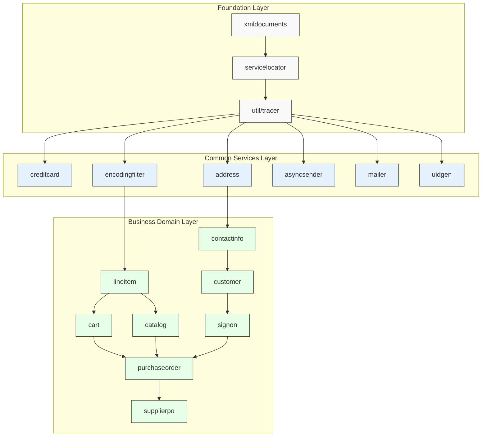
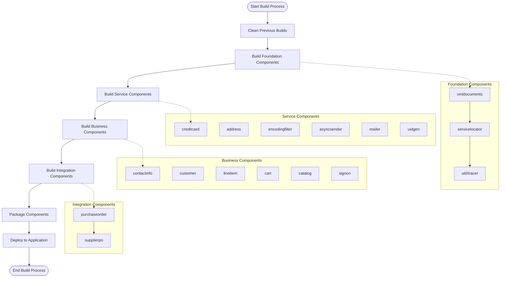
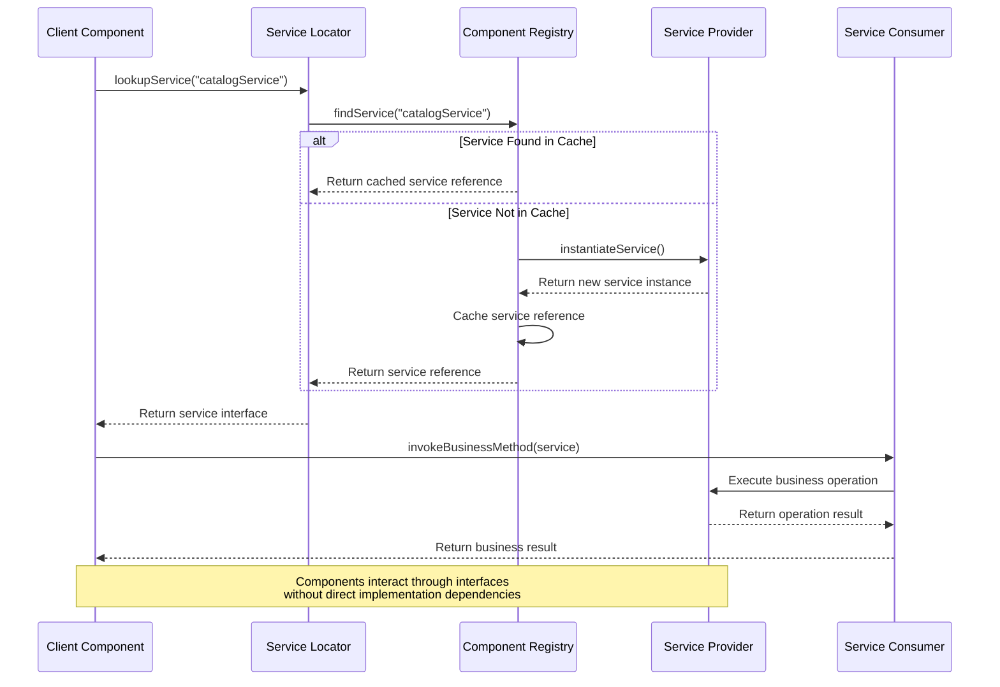
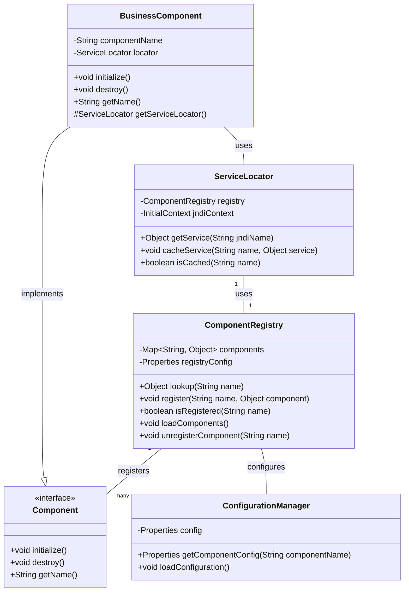

# Component Management in Java Pet Store 1.3.2

## Component Architecture Overview

The Java Pet Store application is built on a sophisticated component management system that organizes functionality into modular, reusable components. This architecture follows a service-oriented approach where discrete business and infrastructure components work together to create a cohesive e-commerce platform. The component architecture employs a layered design that separates concerns between utility components (providing foundational services), business domain components (implementing core business logic), and presentation components. This modular approach enables easier maintenance, testing, and extension of the application. Components are designed with clear interfaces and responsibilities, allowing them to be developed and evolved independently while maintaining system integrity through well-defined integration points. The build system reinforces this architecture by ensuring components are compiled in the correct dependency order, starting with base utilities and progressing to higher-level business components.

## Component Dependency Hierarchy

The component dependency hierarchy diagram illustrates the layered architecture of Java Pet Store's component system. At the foundation, we have core infrastructure components like XML document handling and the service locator pattern implementation, which provide essential services to the entire application. The middle layer consists of common service components that offer cross-cutting functionality such as credit card processing, address management, and asynchronous messaging. The top layer contains business domain components that implement specific e-commerce features like customer management, shopping cart, catalog, and order processing. This hierarchy enforces a clean separation of concerns while ensuring that higher-level components can leverage the functionality provided by lower-level ones without creating circular dependencies. The build system's compilation sequence directly reflects this hierarchy, ensuring that foundation components are built first, followed by service components, and finally business domain components.

## Core Component Categories

The Java Pet Store application organizes its components into three primary categories, each serving distinct roles within the architecture. First, utility components provide foundational services that support the entire application. These include the xmldocuments component for XML processing, the servicelocator for service discovery and dependency injection, and the util/tracer for diagnostic logging. These components are designed to be application-agnostic, offering generic functionality that can be reused across different contexts. Second, business domain components encapsulate the core e-commerce functionality of the application. These include catalog for product management, cart for shopping cart operations, customer for user profile management, and purchaseorder for order processing. Each business component maintains its own data model, business logic, and persistence mechanisms while exposing well-defined interfaces for integration with other components. Third, service components provide cross-cutting functionality that supports business operations. These include creditcard for payment processing, mailer for email notifications, and asyncsender for asynchronous messaging. The service components act as bridges between the business domain and external systems or specialized functionality. This categorization enables a clean separation of concerns, allowing each component to focus on its specific responsibility while collaborating through well-defined interfaces.

## Build System Organization

The Java Pet Store build system employs a sophisticated organization that ensures components are compiled in the correct order based on their dependencies. The central build.xml file in the components directory serves as the orchestration point for the entire component compilation process. This master build file defines three primary targets: 'all', 'core', and 'clean'. The 'core' target, which is the default, coordinates the build sequence across all components by invoking Ant in each component directory in a specific order that respects their interdependencies. The build sequence starts with foundational components like xmldocuments and servicelocator, proceeds through utility services like tracer and creditcard, and culminates with business domain components such as cart, catalog, and purchaseorder. Each component has its own build script that handles the component-specific compilation tasks, but the master build file ensures they are executed in the correct sequence. This hierarchical build structure mirrors the component architecture itself, with lower-level components being built before those that depend on them. The 'clean' target follows a different order than the build target, suggesting that cleanup operations don't need to adhere to the same dependency constraints. This build organization demonstrates a thoughtful approach to managing complex component dependencies in a large enterprise application.

## Component Build Process Flow

The component build process flow diagram illustrates the sequential steps involved in building the Java Pet Store application from its constituent components. The process begins with cleaning previous build artifacts to ensure a fresh compilation environment. Next, foundation components like xmldocuments, servicelocator, and util/tracer are built first as they provide essential services required by other components. The service components layer follows, including creditcard, address, encodingfilter, asyncsender, mailer, and uidgen, which offer cross-cutting functionality. Once these infrastructure components are in place, the business domain components are compiled, including contactinfo, customer, lineitem, cart, catalog, and signon. Finally, integration components like purchaseorder and supplierpo, which depend on multiple business components, are built. After all components are successfully compiled, they are packaged and deployed to the application server. This carefully orchestrated build sequence ensures that component dependencies are respected, preventing compilation errors that would occur if a component were built before its dependencies. The build.xml file in the components directory implements this flow through its target definitions and the order in which it invokes Ant on each component's build script.

## Service Locator Pattern Implementation

The Java Pet Store application implements the Service Locator pattern as a central component of its architecture, providing a robust mechanism for dynamic service discovery and component interaction. The servicelocator component serves as a registry and lookup facility that decouples service consumers from service providers, enabling loose coupling between components. This implementation follows the J2EE design pattern recommendations, allowing components to obtain references to resources and services without having direct dependencies on their implementations. The Service Locator maintains a cache of service references, reducing the overhead of JNDI lookups and improving performance. When a component needs to access a service, it requests it from the Service Locator by name or type, and the locator handles the details of finding and returning the appropriate service instance. This pattern is particularly valuable in the Pet Store's component-based architecture, as it allows business components like cart, catalog, and customer to interact with each other and with infrastructure services without creating tight dependencies. The Service Locator also simplifies testing and configuration changes, as service implementations can be swapped without modifying the components that use them. This implementation demonstrates how architectural patterns can enhance component management by providing standardized mechanisms for component discovery and interaction.

## Component Interaction Model

The component interaction model diagram illustrates how components in the Java Pet Store application communicate at runtime through the Service Locator pattern. When a client component needs to access a service (such as the catalog service), it requests it from the Service Locator by name. The Service Locator then checks with the Component Registry to find the requested service. If the service reference is already cached, it's returned immediately; otherwise, the registry instantiates the service through its provider, caches the reference for future use, and returns it to the Service Locator. The client receives an interface to the service, not the concrete implementation, maintaining loose coupling. The client can then invoke business methods on the service through this interface, and the service provider executes the requested operations. This interaction model demonstrates several key aspects of the Pet Store's component management approach: service discovery is centralized, components interact through well-defined interfaces rather than direct implementation dependencies, and service references are cached to improve performance. The model also supports runtime flexibility, as service implementations can be changed without affecting clients as long as they adhere to the same interface. This approach to component interaction enables the modular, maintainable architecture that characterizes the Java Pet Store application.

## Business Domain Component Integration

The Java Pet Store application demonstrates sophisticated business domain component integration through a carefully designed architecture that balances separation of concerns with effective collaboration. Each business domain component—catalog, cart, customer, and orders—encapsulates a specific area of functionality with its own data model, business logic, and persistence mechanisms. However, these components don't operate in isolation; they integrate with each other through well-defined interfaces and the Service Locator pattern. For example, the cart component depends on the catalog component to retrieve product information, but it accesses this functionality through interfaces rather than direct implementation dependencies. Similarly, the purchaseorder component integrates with customer, cart, and catalog components to gather all the information needed to process an order. This integration is achieved without creating tight coupling between components, allowing each to evolve independently as long as its interfaces remain stable. The component dependencies are explicitly managed in the build system, ensuring that components are compiled in the correct order. Additionally, the business components share common utility services like address management and unique identifier generation, further promoting code reuse and consistency. This approach to business domain component integration demonstrates how a well-architected component system can maintain clear boundaries between functional areas while enabling them to work together seamlessly to deliver complex business processes.

## Infrastructure Components

The Java Pet Store application relies on a robust set of infrastructure components that provide essential technical services to support the business functionality. These components operate beneath the business domain layer, offering capabilities that are not specific to the pet store domain but are critical for the application's operation. The xmldocuments component provides XML parsing, validation, and transformation services, enabling structured data exchange between components and with external systems. The encodingfilter component ensures proper character encoding handling, particularly important for internationalization support. The asyncsender component implements asynchronous messaging capabilities, allowing components to communicate without tight temporal coupling and supporting reliable messaging patterns. The servicelocator component, as previously discussed, enables dynamic service discovery and component interaction. The util/tracer component provides diagnostic logging services that help with debugging and monitoring. The uidgen component generates unique identifiers used throughout the application for entities like orders and customers. These infrastructure components demonstrate a thoughtful approach to addressing cross-cutting concerns in a component-based architecture. By extracting these technical services into dedicated components, the Pet Store application achieves better separation of concerns, allowing business components to focus on their domain logic while leveraging common infrastructure. This approach also promotes reusability, as these infrastructure components could potentially be used in other applications with similar technical requirements.

## Component Registry Architecture

The Component Registry Architecture diagram illustrates the sophisticated component management system at the heart of the Java Pet Store application. The ComponentRegistry serves as the central repository for all application components, maintaining references to them in a name-indexed map. Components are registered with the registry during application initialization, either programmatically or through configuration files processed by the ConfigurationManager. The ServiceLocator acts as the primary interface for component discovery, leveraging the ComponentRegistry for local components and falling back to JNDI lookups for external services. All components implement a common Component interface that defines lifecycle methods (initialize and destroy) and identification methods. Business components extend this interface with additional functionality specific to their domain areas while maintaining the standard component contract. This architecture enables several key capabilities: components can be dynamically discovered at runtime, component implementations can be changed without affecting consumers, and component lifecycle can be centrally managed. The configuration system allows components to be wired together through external configuration rather than hard-coded dependencies. This approach to component registry architecture demonstrates enterprise-grade design principles, providing a flexible foundation for managing the complex interactions between the many components that make up the Java Pet Store application.

## Component Lifecycle Management

The Java Pet Store application implements a comprehensive component lifecycle management approach that ensures components are properly initialized, maintained, and disposed throughout the application's operation. Each component follows a well-defined lifecycle that begins with instantiation, typically performed by the component registry or service locator. After instantiation, components undergo an initialization phase where they acquire necessary resources, establish connections to other components or external systems, and prepare their internal state. This initialization is often driven by configuration parameters loaded from external sources, allowing component behavior to be customized without code changes. During the application's operation, components remain active, providing services to other components and responding to requests. The component registry maintains references to active components, allowing them to be discovered and used by other parts of the application. When components are no longer needed or when the application is shutting down, they enter a destruction phase where they release acquired resources, close connections, and perform any necessary cleanup operations. This orderly shutdown prevents resource leaks and ensures data integrity. The component lifecycle management is coordinated through the component registry and service locator, which track component states and dependencies. This approach to lifecycle management demonstrates a mature understanding of enterprise application requirements, ensuring that components behave predictably throughout their existence and that system resources are properly managed.

## Component Management Best Practices

The Java Pet Store application exemplifies several best practices for effective component management that remain relevant in modern enterprise software development. First, the application demonstrates the principle of modularity by organizing functionality into discrete components with clear responsibilities and boundaries. Each component encapsulates a specific area of functionality, making the system easier to understand, maintain, and extend. Second, the application emphasizes interface-based design, where components interact through well-defined interfaces rather than direct implementation dependencies. This approach enables loose coupling between components and supports the substitution of alternative implementations without affecting consumers. Third, the Pet Store implements a centralized service discovery mechanism through the Service Locator pattern, providing a consistent way for components to find and interact with each other. Fourth, the application manages component dependencies explicitly, both in the code structure and in the build system, ensuring that components are compiled and deployed in the correct order. Fifth, the Pet Store demonstrates the value of shared infrastructure components that address cross-cutting concerns, promoting code reuse and consistency across the application. Sixth, the application employs configuration-driven component wiring, allowing component relationships to be modified without code changes. Finally, the Pet Store implements proper component lifecycle management, ensuring that components are initialized and disposed of in an orderly manner. These best practices collectively contribute to a component management approach that balances flexibility, maintainability, and performance—principles that remain fundamental to effective software architecture regardless of technological evolution.

[Generated by the Sage AI expert workbench: 2025-03-21 23:18:02  https://sage-tech.ai/workbench]: #