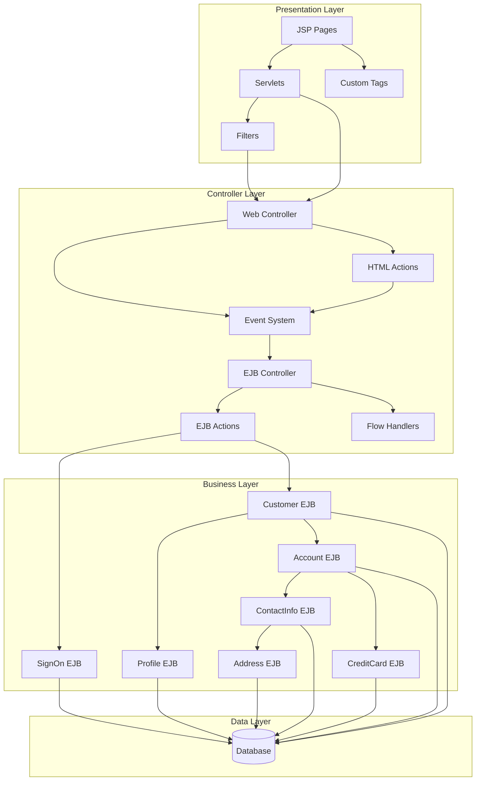
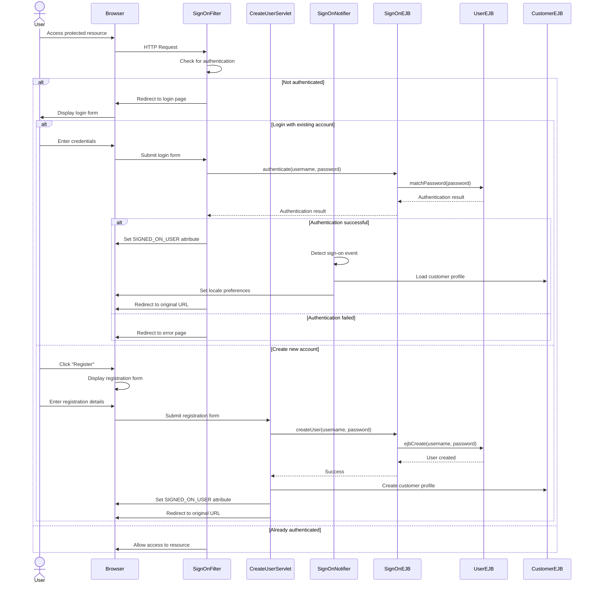
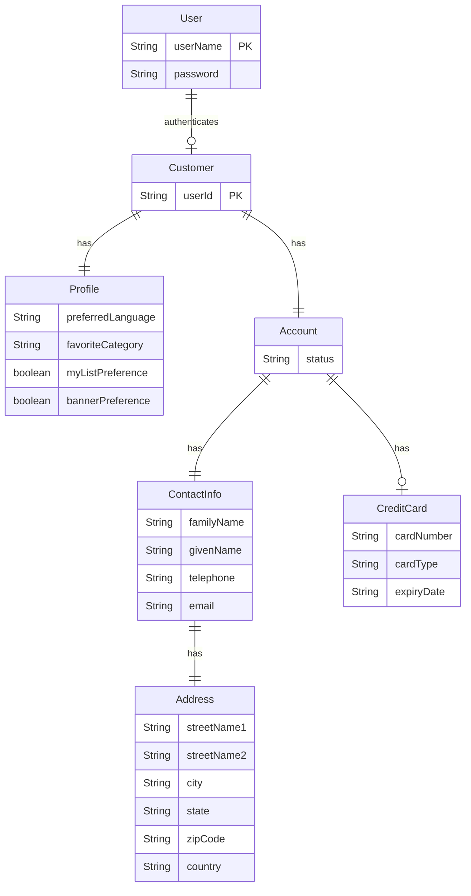
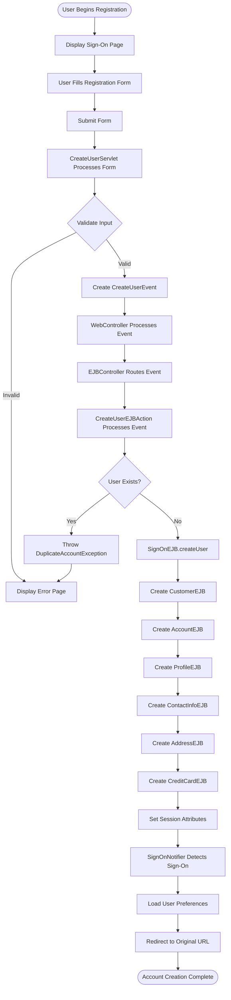

# Customer Account Management in Java Pet Store 1.3.2

## Overview of Customer Account Management

The Java Pet Store 1.3.2 application implements a comprehensive customer account management system that serves as the foundation for user interactions across the e-commerce platform. This system handles user authentication, registration, profile management, address and contact information storage, credit card processing, and personalization preferences. Built using J2EE technologies, the account management functionality follows a multi-tiered architecture that separates presentation, business logic, and data persistence concerns. The system supports internationalization with localized interfaces in English, Japanese, and Chinese, and implements security measures to protect customer data. The account management components integrate with other parts of the application such as the shopping cart and order processing systems to provide a seamless customer experience.

## Customer Account Management Architecture

The Customer Account Management architecture in Java Pet Store follows a multi-tiered design pattern. At the presentation layer, JSP pages, custom tags, and servlets handle user interactions. The SignOnFilter intercepts requests to protected resources and enforces authentication. The controller layer processes user actions through a chain of WebController, EventSystem, and EJBController components, which transform UI actions into business events. The business layer consists of multiple interconnected EJBs that manage different aspects of customer data: SignOnEJB handles authentication, CustomerEJB serves as the main entry point for customer operations, while specialized EJBs like ProfileEJB, AccountEJB, ContactInfoEJB, CreditCardEJB, and AddressEJB manage specific customer data domains. This modular approach allows for clear separation of concerns and maintainable code organization.

## User Authentication System

The Java Pet Store's authentication system is implemented through the SignOn component, which provides a secure mechanism for user identification and access control. At its core, the system uses a UserEJB entity bean to store username and password credentials, with validation logic that enforces constraints like maximum length (25 characters) and prohibited special characters. The SignOnEJB session bean serves as the facade for authentication operations, providing methods to verify credentials and create new users.

On the web tier, the SignOnFilter intercepts requests to protected resources (defined in signon-config.xml) and redirects unauthenticated users to a login page. This filter implements form-based authentication, storing authentication state in the session and managing persistent cookies for "remember me" functionality. The CreateUserServlet handles new account registration, while the SignOnNotifier listens for successful authentication events to load user preferences and notify other components.

The authentication system integrates with the event-driven architecture through events like SignOnEvent and CreateUserEvent, which trigger corresponding EJB actions (SignOnEJBAction and CreateUserEJBAction) to perform business logic. This separation of concerns allows the authentication system to remain decoupled from other application components while still enabling coordinated workflows like loading customer profiles after successful login.

## Authentication Flow

The authentication flow in Java Pet Store begins when a user attempts to access a protected resource. The SignOnFilter intercepts the request and checks if the user is already authenticated by looking for the SIGNED_ON_USER session attribute. If not authenticated, the user is redirected to the login page.

For existing users, the login form submits credentials to the SignOnFilter, which passes them to the SignOnEJB for verification. The SignOnEJB delegates to the UserEJB to match the password. Upon successful authentication, the filter sets the SIGNED_ON_USER attribute in the session, which triggers the SignOnNotifier to load the customer profile and set locale preferences. The user is then redirected to their originally requested URL.

For new users, the registration process starts with a form submission to CreateUserServlet, which calls SignOnEJB.createUser(). This creates a new UserEJB entity, and then triggers the creation of associated CustomerEJB, AccountEJB, and ProfileEJB entities with default values. After successful account creation, the user is automatically authenticated and redirected to their intended destination.

The system also supports sign-off functionality through SignOffHTMLAction, which invalidates the session while preserving locale preferences. This event-driven approach to authentication allows for loose coupling between components while maintaining a consistent user experience.

## Customer Profile Management

The Java Pet Store application implements a sophisticated customer profile management system that stores and maintains user preferences and personalization settings. At the core of this system is the ProfileEJB entity bean, which maintains a one-to-one relationship with the CustomerEJB entity. The profile stores several key pieces of information: preferred language (supporting internationalization), favorite category (for personalized product recommendations), myList preference (determining whether to display previously purchased items), and banner preference (controlling advertisement display).

The profile management functionality is exposed to users through the customer.screen JSP page, which allows users to view and update their preferences. When changes are submitted, the CustomerHTMLAction class processes the form data, extracting profile information through its extractProfileInfo() method. This information is then packaged into a CustomerEvent with an UPDATE action type and sent to the EJBController.

On the business tier, the CustomerEJBAction processes these events by updating the corresponding ProfileLocal EJB instance. The system maintains profile consistency by automatically loading user preferences upon sign-on through the SignOnEJBAction, which retrieves the profile's preferred language and sets it as the application locale. This ensures that the user interface is presented in the user's chosen language throughout their session.

The profile management system demonstrates the application's commitment to personalization, allowing users to tailor their shopping experience according to their preferences while maintaining a clean separation between user interface and business logic through the event-driven architecture.

## Customer Data Model

The Customer Data Model in Java Pet Store represents a comprehensive structure for managing customer information through a network of related entities. At the center is the Customer entity, identified by a unique userId that serves as the primary key. Each Customer has exactly one Profile entity that stores personalization preferences including preferred language, favorite category, and display preferences for myList and banner features.

The Customer also has exactly one Account entity that maintains the customer's status (active or disabled). This Account entity forms relationships with two critical components: ContactInfo and CreditCard. The ContactInfo entity stores personal details including family name, given name, telephone number, and email address. It has a one-to-one relationship with the Address entity, which contains comprehensive location information including street names, city, state, zip code, and country.

The CreditCard entity, which has an optional relationship with Account (customers may not provide payment information initially), stores payment details including card number, card type, and expiration date.

Authentication is handled through the User entity, which contains the username and password credentials. This entity has a one-to-many relationship with Customer, as a single user account could potentially be associated with multiple customer profiles (though in practice, this is typically a one-to-one relationship).

This entity relationship model demonstrates the application's clean separation of concerns, with distinct entities handling different aspects of customer data while maintaining clear relationships between them. The model supports the application's customer account management features including authentication, profile management, and order processing.

## Address and Contact Information

The Java Pet Store application implements a robust system for managing customer address and contact information through dedicated components that ensure data integrity and proper persistence. The address management functionality is encapsulated in the AddressEJB entity bean, which stores comprehensive location data including street names (supporting two-line addresses), city, state, zip code, and country. This entity bean uses Container-Managed Persistence (CMP) with abstract getter and setter methods for each field, allowing the J2EE container to handle database operations.

Contact information is managed through the ContactInfoEJB entity bean, which maintains personal details including family name, given name, telephone number, and email address. This entity establishes a Container-Managed Relationship (CMR) with AddressEJB, creating a one-to-one association with cascade delete functionality to ensure that address records are automatically removed when contact information is deleted.

Both components provide data transfer objects (Address and ContactInfo classes) that implement XML serialization and deserialization capabilities through toDOM() and fromDOM() methods. This enables seamless conversion between entity beans and XML representations for web service integration and data exchange. The XML structure is defined by corresponding DTD files (Address.dtd and ContactInfo.dtd) that enforce data validation rules.

The system supports address and contact information creation through multiple paths: during customer registration, profile updates, and data import operations. The AddressPopulator and ContactInfoPopulator classes facilitate bulk data loading from XML sources, while the CustomerHTMLAction extracts form data for interactive updates. Validation logic ensures that required fields are provided before persisting the data.

This comprehensive approach to address and contact information management provides a flexible and maintainable solution that supports the application's customer account management needs while maintaining clean separation between data representation and persistence concerns.

## Credit Card Management

The Java Pet Store application implements a secure and flexible credit card management system to handle customer payment information. The core of this system is the CreditCardEJB entity bean, which stores essential payment details including card number, card type, and expiration date. This entity uses Container-Managed Persistence (CMP) to abstract database operations, providing a clean interface for credit card manipulation.

Credit card information is associated with customer accounts through a one-to-one relationship between AccountEJB and CreditCardEJB. This relationship is configured with cascade-delete functionality, ensuring that credit card data is properly removed when an account is deleted. The AccountEJB provides methods to get and set the associated credit card, facilitating updates to payment information.

For data transfer between tiers, the application uses the CreditCard value object class, which implements serialization for network transmission and XML conversion through toDOM() and fromDOM() methods. The XML structure is defined by CreditCard.dtd, which enforces data validation rules. During customer registration or profile updates, the CustomerHTMLAction extracts credit card information from form submissions using its extractCreditCard() method, which performs basic validation before creating a CreditCard object.

While the application stores credit card information, it's important to note that the implementation focuses on functionality rather than security best practices by modern standards. The credit card number is stored as plain text without encryption or tokenization, which would not meet current PCI DSS compliance requirements. In a production environment, this would need to be enhanced with proper encryption, masking, and potentially integration with a payment gateway that handles the actual storage of sensitive payment information.

The CreditCardPopulator class supports bulk loading of credit card data during system initialization, creating CreditCardLocal entities from XML sources. This facilitates testing and demonstration of the application with pre-populated data.

## Account Creation Process

The account creation process in Java Pet Store begins when a user accesses the sign-on page and selects the registration option. The user completes a form with their credentials, contact information, address details, credit card information, and profile preferences. Upon submission, the CreateUserServlet processes the form data, validating required fields and creating a CreateUserEvent that encapsulates the user's credentials.

The event flows through the Web Application Framework's controller components: WebController passes it to the EJBController, which routes it to the CreateUserEJBAction. This action uses the SignOnEJB to create a new user account, checking first for duplicate usernames. If the username already exists, a DuplicateAccountException is thrown and the user is redirected to an error page.

Upon successful user creation, the system initiates a cascade of entity creation operations. First, a CustomerEJB entity is created with the user's ID. This triggers the creation of associated entities: AccountEJB (with status set to "active"), ProfileEJB (with default preferences), ContactInfoEJB (with the user's personal details), AddressEJB (with location information), and optionally CreditCardEJB (with payment details).

After all entities are created, the system sets session attributes to mark the user as authenticated. The SignOnNotifier component detects this authentication event and loads the user's preferences, setting the appropriate locale for internationalization. Finally, the user is redirected to their originally requested URL or to the main page if they came directly to registration.

This process demonstrates the application's event-driven architecture and the clean separation between presentation logic, business logic, and data persistence. It also showcases the relationships between the various entities that make up the customer account model.

## Event-Driven Architecture

The Java Pet Store application implements a sophisticated event-driven architecture to facilitate customer account operations. This architecture decouples user interface actions from business logic processing, allowing for greater flexibility and maintainability. At its core, the system uses events like SignOnEvent, CreateUserEvent, and CustomerEvent to represent user actions related to account management.

When a user interacts with the application, such as signing in or updating their profile, HTML actions (SignOnHTMLAction, CreateUserHTMLAction, CustomerHTMLAction) capture the request parameters and transform them into appropriate events. These events are then passed to the WebController, which routes them to the EJBController for processing. The EJBController uses a StateMachine to determine which EJB action should handle each event based on the event's type and the current application state.

EJB actions (SignOnEJBAction, CreateUserEJBAction, CustomerEJBAction) contain the business logic for processing these events, interacting with the appropriate EJB components to perform operations like user authentication, account creation, or profile updates. After processing, these actions may generate EventResponse objects that indicate the outcome and provide data for the presentation layer.

The SignOnNotifier component demonstrates how this event architecture supports cross-cutting concerns by listening for session attribute changes that indicate successful authentication. When a user signs on, it creates a SignOnEvent and triggers the loading of customer profile information.

This event-driven approach provides several benefits: it maintains a clean separation between presentation and business logic, allows for easy extension of functionality by adding new event types and handlers, and supports the application's internationalization features by propagating locale preferences through the event system. The architecture also facilitates error handling through specialized exceptions like DuplicateAccountException that can be caught and presented appropriately to users.

## Internationalization Support

The Java Pet Store application implements a comprehensive internationalization (i18n) framework to support multiple languages and locales for customer interfaces. This system enables users to experience the application in their preferred language, enhancing usability and accessibility for a global audience.

At the core of the internationalization support is the Profile entity, which stores each customer's preferred language setting. When users sign in, the SignOnEJBAction retrieves this preference and sets the appropriate Locale object in the application's state machine. This locale is then used throughout the user's session to determine which language resources to display.

The application includes localized resources for multiple languages, with complete implementations for English, Japanese, and Chinese. These resources are organized in a structured directory hierarchy, with language-specific JSP files stored in dedicated directories (e.g., /ja/ for Japanese, /zh/ for Chinese). Screen definitions for each language are configured in XML files like screendefinitions_ja_JP.xml, which map logical screen names to localized JSP templates.

Resource bundles provide localized text strings for dynamic content, allowing the application to display appropriate messages based on the user's locale. The I18nUtil helper class facilitates conversion between string representations of locales and Java Locale objects.

The templating system supports locale-specific layouts through the Screens and Screen classes, which determine which template to use based on the current locale. This approach ensures consistent navigation and structure across languages while allowing for cultural and linguistic adaptations.

Users can change their language preference through the customer profile management interface, which updates their Profile entity and immediately applies the new locale to their session. The system also preserves locale preferences across sessions and even during sign-off operations, ensuring a consistent experience.

This comprehensive internationalization support demonstrates the application's commitment to serving a global customer base by providing a seamless, localized user experience across all aspects of account management.

## Admin Interface for Account Management

The Java Pet Store application includes a dedicated administrative interface for managing customer accounts, providing system administrators with tools to oversee and maintain user data. This admin module is implemented as a separate web application with its own security constraints, ensuring that only authorized personnel can access these sensitive functions.

The admin interface is secured through container-managed authentication requiring the 'administrator' role, as defined in the application's deployment descriptors. This security layer prevents unauthorized access to customer account information and administrative functions.

Administrators can access the interface through a landing page that directs them to the AdminRequestProcessor servlet, which serves as the entry point for administrative operations. The interface is implemented as a Java Web Start application, providing a rich client experience while maintaining centralized deployment and updates.

Key account management features in the admin interface include:

1. Viewing customer accounts with filtering and sorting capabilities
2. Examining detailed customer information including profiles, contact details, and order history
3. Modifying account status (active/disabled) to control customer access
4. Managing order approvals for orders that exceed automatic approval thresholds
5. Generating reports on customer activity and account status

The admin application communicates with the core Pet Store components through EJB interfaces, particularly accessing the Customer, Account, and Profile EJBs to retrieve and modify customer data. It uses the AdminBD (Business Delegate) pattern to abstract these interactions and provide a clean separation between the presentation and business tiers.

Data visualization in the admin interface is facilitated by utility classes like TableMap, which supports the display and manipulation of tabular customer data. The interface follows the same event-driven architecture as the main application, with specialized events and actions for administrative operations.

This comprehensive admin interface provides the necessary tools for effective customer account management from an administrative perspective, complementing the self-service capabilities available to customers through the main application interface.

[Generated by the Sage AI expert workbench: 2025-03-29 21:37:00  https://sage-tech.ai/workbench]: #