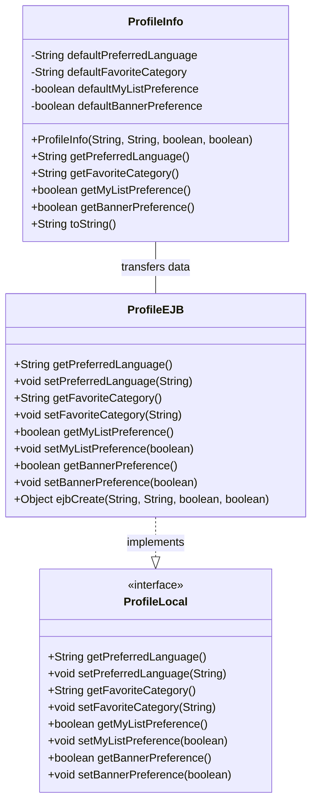
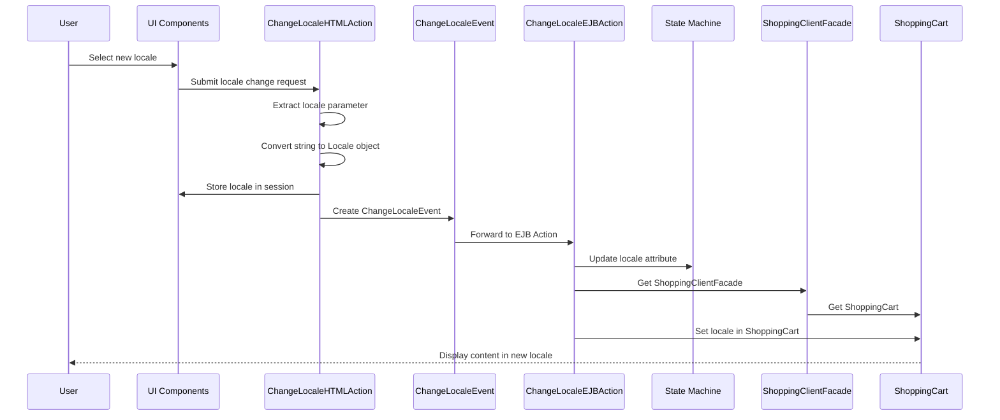
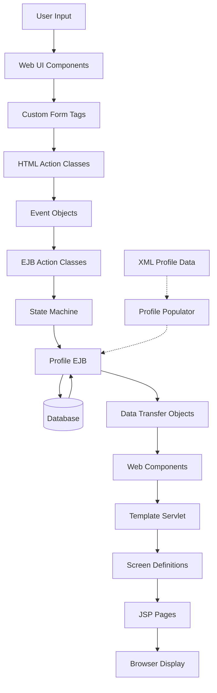

# Understanding Customer Preferences in Java Pet Store

The Java Pet Store 1.3.2 application implements a comprehensive customer preference management system that allows users to personalize their shopping experience. This system encompasses language selection, display options, favorite categories, and other user-specific settings that enhance the application's usability and user experience.

## Customer Preference Data Model

The ProfileInfo class serves as the core data structure for customer preferences in Java Pet Store 1.3.2. It encapsulates four key preference attributes that define the user's experience: preferredLanguage for internationalization settings, favoriteCategory for product category preferences, myListPreference for enabling/disabling personalized lists, and bannerPreference for controlling banner display. This model provides a clean separation between the data representation and the persistence layer implemented through the ProfileEJB entity bean. The ProfileInfo class is serializable, allowing it to be transferred between application tiers and stored in session state when needed.

## Profile Management Architecture

The Java Pet Store 1.3.2 implements profile management through a robust Enterprise JavaBeans (EJB) architecture centered around the Profile entity bean. This container-managed persistence (CMP) bean provides a reliable and scalable mechanism for storing customer preferences in the database. The Profile EJB uses local interfaces (ProfileLocal and ProfileLocalHome) to optimize performance by avoiding remote method invocation overhead, as preference data is typically accessed within the same JVM.

The architecture follows J2EE best practices by clearly separating concerns: the ProfileEJB handles persistence operations, ProfileLocal defines the business interface, and ProfileLocalHome provides factory methods for creating and finding Profile entities. Default preference values are defined as constants in the ProfileLocalHome interface, ensuring consistent initialization across the application. The Profile entity bean implements the standard EJB lifecycle methods (ejbCreate, ejbLoad, ejbStore, etc.) while delegating the actual persistence operations to the container.

This architecture enables efficient data access patterns, as the application can retrieve and update user preferences without complex JDBC code or transaction management. The local interface approach also improves performance by avoiding serialization overhead that would occur with remote interfaces. The Profile EJB integrates with the broader customer management subsystem while maintaining a focused responsibility for preference data.

## Internationalization Support

The Java Pet Store 1.3.2 application implements comprehensive internationalization support through a layered approach that handles multiple languages and regional settings. At the foundation is the EncodingFilter, a servlet filter that ensures proper character encoding for HTTP requests, preventing encoding issues with form submissions in non-ASCII languages. This filter reads the target encoding from configuration parameters and applies it consistently to incoming requests.

The I18nUtil class provides core internationalization utilities including locale-specific currency and number formatting with precision control, Japanese character encoding conversion, and locale-aware keyword parsing using BreakIterator for proper word boundary detection across different languages. This class also includes methods for converting string representations of locales (e.g., "en_US") into Java Locale objects.

Resource bundles store localized text and messages, while the TemplateServlet loads screen definitions from locale-specific XML files, enabling complete UI customization based on the user's language preference. The application maintains locale information in both session state and the user's profile, ensuring consistent language presentation throughout the shopping experience. When a user changes their language preference, the change propagates to all application components, including the shopping cart, through the event system.

## Locale Change Event Flow

The locale change process in Java Pet Store 1.3.2 demonstrates a sophisticated event-driven architecture that ensures consistent language settings across the application. When a user selects a new language, the request is processed by ChangeLocaleHTMLAction, which extracts the locale parameter, converts it to a Java Locale object using I18nUtil, and stores it in the user's session. This action then creates a ChangeLocaleEvent that propagates through the system.

The event is handled by ChangeLocaleEJBAction, which updates the locale attribute in the application's state machine. Importantly, this action also notifies the shopping cart component by retrieving the ShoppingClientFacade from the state machine and calling setLocale() on the associated ShoppingCartLocal object. This ensures that product information, pricing, and other shopping cart elements are displayed in the user's preferred language.

This event flow demonstrates how the application maintains consistent localization across different components while respecting separation of concerns through the event-driven architecture. The mappings.xml file configures the relationships between events, actions, and URL patterns, enabling the framework to route locale change requests appropriately.

## User Interface Components for Preference Selection

Java Pet Store 1.3.2 implements a sophisticated set of custom JSP tag libraries that provide reusable UI components for capturing user preferences. These components enhance the standard HTML form controls with additional functionality while maintaining a clean separation between presentation and business logic.

The SelectTag and OptionTag work together to create dropdown menus for language and category selection. SelectTag manages the overall select element, maintaining options in a TreeMap for sorted display, while OptionTag adds individual options to the parent select element. The SelectedTag determines which option should be pre-selected based on the user's current preferences.

For boolean preferences like MyListPreference and BannerPreference, the CheckboxTag and CheckedTag provide checkbox functionality. CheckboxTag renders the HTML input element with appropriate attributes, while CheckedTag determines whether the checkbox should be checked based on the user's current settings.

These tag implementations follow a consistent pattern of parent-child relationships, with child tags finding their parent using the findAncestorWithClass() method and passing data up to the parent tag. This approach allows for clean JSP code that clearly expresses the intent of the form without exposing implementation details.

The ValueTag works with InputTag to set values for text input fields, providing another mechanism for capturing user preferences. All these components properly reset their state after rendering to prevent data leakage between requests, ensuring reliable operation in a multi-user environment.

## Template-Based View Customization

The Java Pet Store 1.3.2 application employs a sophisticated template-based view customization system centered around the TemplateServlet. This servlet acts as the cornerstone of the presentation layer, enabling dynamic screen rendering based on user preferences, particularly locale settings. The system loads screen definitions from XML files specific to each supported locale, allowing complete customization of the user interface based on language preferences.

When processing a request, TemplateServlet determines the appropriate screen template by examining the URL pattern and the user's locale setting. It first checks for a locale parameter in the request, then falls back to the locale stored in the session, and finally defaults to the system locale if needed. Once the locale is determined, the servlet retrieves the corresponding screen definition from its cache and forwards the request to the appropriate template JSP.

The template system uses the Parameter class to store key-value pairs that customize the presentation, with a boolean flag indicating whether values require further processing. This allows for dynamic content insertion based on user preferences. The system also supports caching previous screen attributes and parameters, enabling seamless navigation between screens while maintaining state.

For efficiency, TemplateServlet wraps request dispatcher calls within UserTransaction boundaries, optimizing local EJB access. This approach demonstrates how the application balances performance considerations with the flexibility needed for preference-based customization.

## Preference Data Flow

The preference data flow in Java Pet Store 1.3.2 demonstrates how customer preferences are captured, stored, and applied throughout the application. User input begins at the web interface, where custom form tags (SelectTag, CheckboxTag, etc.) capture preference selections. These selections are processed by HTML action classes like ChangeLocaleHTMLAction, which convert the raw form data into event objects.

Events propagate through the system to EJB action classes that update both the application's state machine and the persistent profile data stored in the Profile EJB. The Profile EJB uses container-managed persistence to store preferences in the database. When preferences need to be displayed or applied, the data flows back through data transfer objects (like ProfileInfo) to web components.

The TemplateServlet plays a crucial role in applying preferences to the user interface by selecting appropriate screen definitions based on the user's locale and other preferences. These screen definitions determine which JSP templates are rendered, completing the cycle by presenting a customized interface to the user.

Additionally, the system supports initial preference setup through the ProfilePopulator, which can create profile entities from XML data during system initialization or account creation. This comprehensive data flow ensures that user preferences are consistently applied across all aspects of the application.

## XML-Based Profile Configuration

Java Pet Store 1.3.2 employs a structured XML format for profile data representation, defined by the Profile.dtd Document Type Definition. This DTD establishes a clear schema for profile documents, specifying a Profile root element that contains four child elements: PreferredLanguage, FavoriteCategory, MyListPreference, and BannerPreference. Each element is defined to contain parsed character data (#PCDATA), providing a clean, hierarchical representation of user preferences.

The ProfilePopulator class serves as the bridge between this XML representation and the application's EJB persistence layer. It implements a SAX-based parsing approach using an XMLFilter and anonymous inner class extending XMLDBHandler to process profile XML documents. When parsing a profile document, the populator extracts preference values from the XML elements and uses them to create Profile entity beans through the ProfileLocalHome interface.

This XML-based approach offers several advantages: it provides a human-readable format for default profiles, enables bulk importing of user preferences, and supports system initialization with predefined profiles. The separation between XML representation and EJB entities allows the application to source profile data from various inputs while maintaining a consistent persistence model.

The ProfilePopulator demonstrates good design by focusing solely on the transformation between XML and EJB domains, using JNDI for EJB lookup and properly handling exceptions during the creation process. This clean separation of concerns makes the system more maintainable and extensible.

## State Management for User Preferences

Java Pet Store 1.3.2 implements a multi-layered approach to state management for user preferences, ensuring that preference data is available and consistent across the application. The system manages preference state at three distinct levels: session attributes, client-side state, and EJB persistence.

At the session level, the application stores the user's current locale in the HTTP session using a well-defined key (WebKeys.LOCALE). This makes the locale immediately available to all components that process the current request, without requiring database access. The ChangeLocaleHTMLAction updates this session attribute whenever the user changes their language preference.

For more complex state management, the application uses the ClientStateTag and ClientStateValueTag to maintain state on the client side. These tags generate hidden form fields or URL parameters that preserve preference information across requests, even when session cookies are disabled. This approach is particularly useful for maintaining state during multi-page workflows.

Long-term preference storage relies on the Profile EJB, which provides container-managed persistence for user preferences in the database. When a user logs in, their profile is loaded from the database, and their preferences are applied to the session. Changes to preferences are persisted back to the database through the Profile EJB's setter methods.

The TemplateServlet enhances state management by optionally caching previous screen attributes and parameters. This feature, controlled by servlet initialization parameters, allows the application to restore the complete state of a previous screen when the user navigates back, providing a seamless user experience.

Together, these mechanisms ensure that user preferences are consistently applied throughout the application while balancing performance considerations with persistence requirements.

[Generated by the Sage AI expert workbench: 2025-03-29 21:37:00  https://sage-tech.ai/workbench]: #