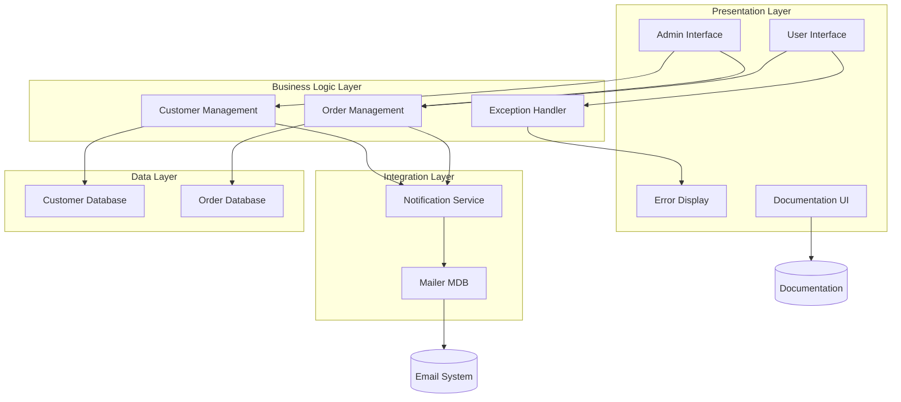
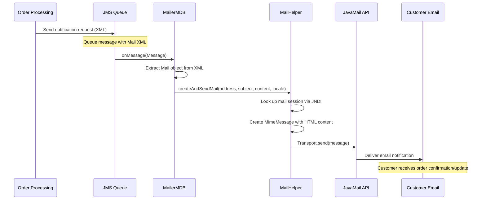
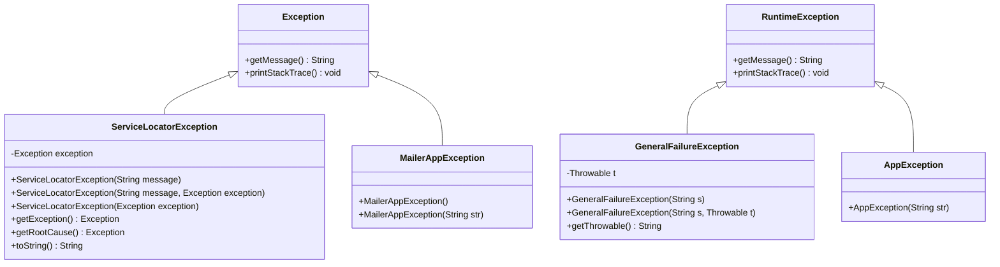
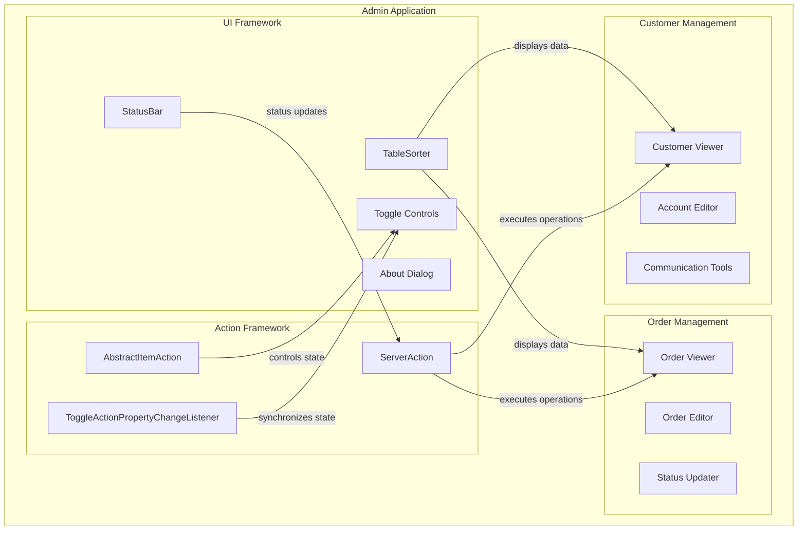

# Customer Support Features in Java Pet Store 1.3.2

## Overview of Customer Support Features

The Java Pet Store 1.3.2 application implements a comprehensive set of customer support capabilities designed to enhance user experience and provide assistance throughout the e-commerce journey. These features are integrated across multiple architectural layers, from presentation components to backend services. The customer support infrastructure includes multilingual documentation, error handling mechanisms, email notification systems, and administrative interfaces that enable customer service representatives to manage orders and respond to inquiries. The application's modular design allows these support features to operate seamlessly within the broader J2EE architecture while maintaining separation of concerns. Key components include the mailer subsystem for customer communications, exception handling frameworks for graceful error recovery, and internationalized resources that make the application accessible to a global audience.

## Customer Support Architecture

The customer support architecture in Java Pet Store follows a multi-layered approach where various components interact to provide comprehensive support services. The diagram illustrates how customer-facing components connect with backend services through well-defined interfaces. When events occur that require customer notification (such as order status changes), the business logic layer triggers the notification service, which uses the Mailer MDB (Message-Driven Bean) to send appropriate emails. The admin interface provides tools for customer service representatives to manage orders and customer information. The exception handling framework ensures that errors are properly captured and presented to users in a meaningful way, enhancing the overall support experience.

## Email Notification System

The Java Pet Store implements a robust email notification system centered around the Mailer component, which handles asynchronous communication with customers. This system is designed to keep customers informed about their order status, account changes, and other important events. The Mailer component uses Java Message Service (JMS) to receive notification requests and JavaMail API to deliver formatted emails to customers.

The core of this system is the MailerMDB class, a message-driven bean that listens for JMS messages containing XML-formatted email information. When a message arrives, it extracts the recipient address, subject, and content, then delegates to a MailHelper to send the actual email. The system supports HTML-formatted emails through the ByteArrayDataSource class, which creates appropriate MIME content.

For email content formatting, the system employs the MailContentXDE class, which applies XSL transformations to XML documents, enabling locale-specific and template-based email generation. This approach allows for consistent branding while supporting multiple languages through locale-specific stylesheets.

The system is configured through deployment descriptors and JNDI resources, making it easily configurable without code changes. Error handling is managed through custom exceptions like MailerAppException, ensuring that mail delivery failures don't disrupt the application's core functionality.

## Email Notification Workflow

The email notification workflow begins when an order event occurs in the system, such as order placement, approval, or shipment. The order processing component creates an XML-formatted mail message and sends it to a JMS queue. The MailerMDB, which continuously listens to this queue, receives the message and deserializes it into a Mail object. The MDB then delegates to the MailHelper to handle the actual email creation and sending process.

The MailHelper retrieves the mail session from JNDI, creates a properly formatted HTML email message, and uses the JavaMail API to send it to the customer. This asynchronous approach ensures that email notifications don't block the main application flow, providing better scalability and responsiveness. If any errors occur during this process, they are captured by the exception handling framework but don't disrupt the customer's interaction with the application.

## Multilingual Support

The Java Pet Store 1.3.2 implements comprehensive multilingual support to serve a global customer base. The application provides localized content in multiple languages including English, Japanese, and Chinese, enabling customers to interact with the system in their preferred language. This internationalization is achieved through several key mechanisms integrated throughout the application architecture.

Documentation files are provided in multiple languages, with dedicated directories for each supported locale (e.g., /docs/ja/ for Japanese, /docs/zh/ for Chinese). These directories contain localized versions of essential documents such as installation guides, user manuals, and copyright notices. Each document uses appropriate character encoding for the target language - EUC-JP for Japanese content and GB2312 for Chinese content - ensuring proper text rendering.

The email notification system supports multilingual communications through locale-specific XSL stylesheets. The MailContentXDE class dynamically selects the appropriate stylesheet based on the customer's locale preference, transforming generic XML content into properly formatted and localized email messages. This approach separates content structure from presentation, making it easier to add support for additional languages.

Resource bundles are used throughout the application to store UI labels, error messages, and other text elements. These bundles follow Java's standard internationalization pattern, with locale-specific variants loaded based on the user's language settings. This ensures that all user-facing text elements appear in the appropriate language.

The system also handles character encoding properly across different components, ensuring that multilingual data is preserved when moving between the presentation layer, business logic, and data storage. This comprehensive approach to internationalization makes the Java Pet Store accessible to customers worldwide, enhancing the support experience for non-English speakers.

## Error Handling Framework

The Java Pet Store implements a sophisticated error handling framework designed to provide meaningful feedback to users while maintaining system stability. This framework consists of a hierarchy of exception classes that capture different types of errors and standardize how they are reported and managed throughout the application.

At the core of this framework is the ServiceLocatorException class, which implements a pattern for wrapping lower-level exceptions. This approach preserves the original error context while adding application-specific information, making troubleshooting more effective. The class provides methods like getRootCause() that recursively traverse the exception chain to find the original cause of an error, which is particularly valuable for diagnosing complex issues.

For web-specific errors, the framework includes GeneralFailureException and AppException classes that extend RuntimeException. These exceptions are used throughout the Web Application Framework (WAF) component to handle errors in the presentation layer. The GeneralFailureException class is particularly noteworthy as it implements Serializable, allowing exception objects to be passed between JVM instances or persisted for later analysis.

The mailer component has its own specialized exception class, MailerAppException, which is thrown when there are failures during email sending operations. This allows the system to gracefully handle communication errors without disrupting other functionality.

The error handling framework is designed to provide appropriate feedback based on the context. For end users, it generates user-friendly error messages that explain what went wrong without exposing sensitive system details. For administrators and developers, it captures detailed diagnostic information that can be used to identify and resolve issues. This dual approach ensures that customers receive helpful guidance when problems occur while giving support staff the information they need to provide assistance.

## Exception Handling Hierarchy

The exception handling hierarchy in Java Pet Store is designed to provide structured error management across different application layers. At the top level, there are two main branches: exceptions that extend the standard Java Exception class (checked exceptions) and those that extend RuntimeException (unchecked exceptions).

ServiceLocatorException extends Exception and is used primarily in the service location components. It implements a wrapper pattern that can encapsulate other exceptions while adding context-specific information. Its getRootCause() method uses recursion to find the original cause of an error, which is essential for troubleshooting complex issues that may involve multiple layers of the application.

MailerAppException also extends Exception and is specific to the email notification system. It provides specialized error handling for mail-related operations, allowing the system to gracefully handle communication failures.

On the RuntimeException branch, GeneralFailureException serves as the base class for web-related runtime exceptions. It can wrap a Throwable object and provides methods to access the underlying exception details. AppException is a simpler extension of RuntimeException used for application-specific errors that don't require additional context.

This hierarchical approach ensures that exceptions are handled appropriately at each level of the application, with more specific exception types for specialized components and broader types for general application errors.

## Administrative Interface

The Java Pet Store's administrative interface provides a comprehensive set of tools for customer service representatives to manage orders and respond to customer inquiries. This interface is implemented as a separate application (Admin) that connects to the same backend services as the customer-facing storefront, allowing authorized personnel to access and modify order information, customer data, and system settings.

The admin interface is built using Java Swing, providing a rich desktop application experience for customer support staff. It includes components like TableSorter for efficient data presentation and manipulation, allowing representatives to quickly find relevant information when assisting customers. The StatusBar component provides continuous feedback about system operations, keeping support staff informed about the status of their actions.

A key architectural pattern in the admin interface is the ServerAction class, which implements asynchronous processing for UI operations. This ensures that the interface remains responsive even when performing time-consuming operations like retrieving large sets of order data or updating customer records. The class manages a shared WorkQueue for background tasks and coordinates between worker threads and the Event Dispatch Thread to maintain UI responsiveness.

The interface includes specialized components for managing toggle states (AbstractItemAction and ToggleActionPropertyChangeListener) that ensure consistent representation of state across multiple UI elements. This is particularly important for features like order filtering or status updates, where multiple components might reflect the same underlying data.

The admin application also provides an About dialog that displays information about the system version and development team, which can be useful for support staff when determining compatibility or reporting issues to the development team.

## Admin Interface Components

The Admin Interface consists of several interconnected components that work together to provide customer support functionality. The UI Framework provides the visual elements and interaction patterns, including the StatusBar for displaying operation status, TableSorter for organizing and filtering data, an About Dialog for system information, and Toggle Controls for managing interface states.

The Action Framework handles the business logic and asynchronous processing, with ServerAction managing background operations, AbstractItemAction providing support for toggleable UI elements, and ToggleActionPropertyChangeListener ensuring state synchronization across multiple UI components.

These framework components support the two main functional areas: Order Management and Customer Management. Order Management includes tools for viewing order details, editing order information, and updating order status. Customer Management provides capabilities for viewing customer information, editing account details, and accessing communication tools to interact with customers.

The diagram shows how these components interact, with StatusBar receiving updates from ServerAction to display operation status, TableSorter providing data display capabilities for both Order and Customer viewers, and the Action Framework components executing operations on the management components while controlling UI state.

## Documentation and Help Resources

The Java Pet Store 1.3.2 includes a comprehensive documentation system designed to support both customers and administrators. This system provides installation guides, usage instructions, and reference materials in multiple languages, ensuring that users worldwide can effectively use the application.

The documentation is organized in a hierarchical structure with language-specific directories (/docs/en/, /docs/ja/, /docs/zh/) containing HTML files that cover various aspects of the application. Each language version maintains consistent content but is properly localized with appropriate character encodings (EUC-JP for Japanese, GB2312 for Chinese) and translated text.

Installation guides provide detailed step-by-step instructions for setting up the application, including system requirements (J2SE SDK v1.4.1 and J2EE SDK v1.3.1), environment variable configuration, and deployment procedures. These guides are tailored for different operating systems, with specific command sequences for both UNIX and Windows platforms.

Usage documentation explains how to navigate the application, manage accounts, place orders, and perform other common tasks. This helps customers quickly become familiar with the system and reduces the need for direct support.

Legal documentation, including copyright notices and license information, is also provided in multiple languages. These documents clearly explain the terms of use and intellectual property rights associated with the software.

The admin application includes built-in help features, such as the About dialog, which provides version information and credits. This information is particularly useful for support staff who need to identify which version of the software they are working with when troubleshooting issues.

All documentation files are HTML-based, making them easily accessible through web browsers without requiring specialized software. This approach ensures that help resources are readily available to all users regardless of their technical expertise.

## Future Enhancements

Based on the analysis of Java Pet Store 1.3.2's customer support capabilities, several enhancements could significantly improve the application's support functionality in future versions:

1. **Real-time Chat Support**: Implementing a WebSocket-based chat system would allow customers to communicate directly with support representatives without leaving the application. This would provide immediate assistance for complex issues that documentation alone cannot address.

2. **Knowledge Base Integration**: Developing a searchable knowledge base with common questions, troubleshooting guides, and how-to articles would empower customers to find solutions independently. This could be integrated with the existing documentation system but provide more interactive and targeted assistance.

3. **Support Ticket System**: Adding a ticket management system would allow customers to submit, track, and follow up on support requests. This would provide better continuity for complex issues that require multiple interactions to resolve.

4. **Enhanced Email Templates**: The current email notification system could be expanded with more sophisticated templates that include personalized content, order-specific details, and dynamic elements based on customer behavior or preferences.

5. **Social Media Integration**: Adding support for notifications and customer communication through popular social media platforms would provide additional channels for customer support, meeting users where they already spend their time.

6. **Automated Response System**: Implementing an AI-powered response system could provide immediate answers to common questions, reducing the workload on human support staff while improving response times for customers.

7. **Customer Feedback Mechanism**: Adding structured ways to collect and analyze customer feedback would help identify pain points and prioritize improvements to the application and support processes.

8. **Enhanced Multilingual Support**: While the current system supports multiple languages, expanding to additional languages and improving the translation quality would make the application more accessible globally.

9. **Mobile Support Interface**: Developing a mobile-optimized version of the admin interface would allow support staff to assist customers while away from their desks, improving response times and flexibility.

10. **Analytics Dashboard**: Creating a dashboard that tracks common support issues, resolution times, and customer satisfaction metrics would provide valuable insights for continuously improving the support experience.

These enhancements would build upon the solid foundation of Java Pet Store's existing customer support architecture while addressing modern expectations for responsive, multi-channel support experiences.

[Generated by the Sage AI expert workbench: 2025-03-29 21:37:00  https://sage-tech.ai/workbench]: #