# Overview of Inventory Management

The inventory management system in Java Pet Store 1.3.2 serves as a critical component that bridges the supplier and store applications, ensuring accurate tracking of product availability throughout the e-commerce platform. This system is responsible for maintaining real-time inventory counts, processing inventory updates from supplier systems, and providing inventory status information to the order processing components. The architecture employs a container-managed persistence approach using Entity EJBs to represent inventory items, with each item tracked by a unique product ID and quantity value. The supplier application maintains the authoritative inventory database, while the admin application provides interfaces for inventory management and reporting. This separation of concerns allows for efficient inventory control while maintaining the integrity of the overall system through well-defined interfaces and transaction boundaries.

## Inventory Management Architecture


The diagram illustrates the architecture of the inventory management system in Java Pet Store 1.3.2. The system is divided between the Supplier Application, which maintains the core inventory data, and the Admin Application, which provides management interfaces. 

At the heart of the system is the InventoryEJB, an entity bean that persists inventory data in the database. This EJB is accessed through the InventoryLocal interface, which defines methods for retrieving and updating inventory quantities. The InventoryLocalHome interface provides factory methods for creating and finding inventory items.

The PopulateServlet initializes the inventory system by reading XML data files and using the InventoryPopulator to create initial inventory records. The RcvrRequestProcessor servlet handles inventory updates from the supplier interface and coordinates with the OrderFulfillmentFacade to process orders based on inventory availability. The DisplayInventoryBean provides a presentation layer component that retrieves inventory data for display.

This architecture demonstrates a clear separation of concerns with well-defined interfaces between components, allowing for maintainable and scalable inventory management.

# Core Inventory Data Structure

The inventory management system in Java Pet Store is built around a simple yet effective data model centered on the InventoryEJB entity bean. This entity bean employs container-managed persistence (CMP) to handle the storage and retrieval of inventory data, which consists primarily of two fields: itemId (the primary key) and quantity. The itemId serves as a unique identifier that corresponds to product IDs in the catalog system, while the quantity field tracks the available stock for each item.

The InventoryEJB implements the EntityBean interface and exposes abstract getter and setter methods for its container-managed fields, allowing the EJB container to handle the persistence details. The bean also implements business logic methods such as reduceQuantity() that encapsulate inventory operations beyond simple field access. This approach follows the best practices of the time by keeping business logic with the data it manipulates while delegating persistence concerns to the container.

Access to the inventory data is controlled through the InventoryLocal interface, which extends EJBLocalObject and defines the business methods available to clients within the same container. The InventoryLocalHome interface provides factory methods for creating new inventory items and finder methods for retrieving existing ones, including findByPrimaryKey() for specific items and findAllInventoryItems() for batch operations.

This design demonstrates the J2EE 1.3 approach to data management, where entity beans represent business objects with container-managed persistence handling the database interactions. While this approach has been superseded in modern Java EE by JPA and other technologies, it provided a robust foundation for inventory management in the Pet Store application, with clear separation between data access logic and business operations.

# Inventory Population Process

The Java Pet Store's inventory population process is a critical initialization step that seeds the supplier's inventory database with product quantities. This process is orchestrated by the PopulateServlet, which serves as the entry point for triggering the population of inventory data from XML files into the database.

When the supplier application is first deployed or when an administrator explicitly requests repopulation, the PopulateServlet is invoked either through HTTP GET or POST requests. The servlet first checks if inventory data already exists in the database (unless forced repopulation is requested via the "forcefully" parameter). This check prevents duplicate data and unnecessary database operations during normal application restarts.

For the actual data loading, the servlet delegates to the InventoryPopulator class, which implements the SAX parsing logic for processing the XML inventory data. The XML files (primarily Populate-UTF8.xml) follow a simple structure defined by a DTD that specifies inventory items with "id" and "quantity" attributes. Each inventory item in the XML file corresponds to a product in the catalog, identified by its unique product ID (e.g., "EST-1"), with an initial quantity value (typically set to 10,000 for demonstration purposes).

The InventoryPopulator uses the SAX parsing approach for efficient XML processing and creates inventory records through the InventoryLocalHome EJB interface. This approach leverages container-managed transactions to ensure data integrity during the population process. After successful population, the servlet redirects to a success page or back to the referring page, providing feedback on the operation's outcome.

This initialization process exemplifies the J2EE pattern of using servlets as controllers that delegate to specialized components for business logic and data access, with XML as the data interchange format for initial application setup.

## Inventory Population Flow

```mermaid
sequenceDiagram
    participant Client as Administrator
    participant PS as PopulateServlet
    participant IP as InventoryPopulator
    participant XML as XML Data File
    participant Parser as SAX Parser
    participant ILH as InventoryLocalHome
    participant IE as InventoryEJB
    participant DB as Database
    
    Client->>PS: Request population (GET/POST)
    PS->>IP: check() if already populated
    IP->>ILH: findAllInventoryItems()
    ILH->>DB: SELECT query
    DB-->>ILH: Return results
    ILH-->>IP: Return collection
    IP-->>PS: Return population status
    
    alt Force repopulation or not populated
        PS->>IP: setup(XMLReader)
        PS->>XML: getResource(populateDataPath)
        XML-->>PS: Return XML content
        PS->>Parser: parse(XMLSource)
        Parser->>IP: startElement events
        
        loop For each inventory item
            IP->>IP: createInventory(id, quantity)
            IP->>ILH: findByPrimaryKey(id)
            
            alt Item exists
                ILH-->>IP: Return existing item
                IP->>IE: remove()
                IE->>DB: DELETE query
            end
            
            IP->>ILH: create(id, quantity)
            ILH->>IE: ejbCreate(id, quantity)
            IE->>DB: INSERT query
        end
    end
    
    PS-->>Client: Redirect to success page
```



The sequence diagram illustrates the detailed flow of the inventory population process in Java Pet Store 1.3.2. This process begins when an administrator triggers the population through the PopulateServlet, which can be invoked via either GET or POST requests.

First, the servlet checks if the database is already populated by calling the InventoryPopulator's check() method, which queries the database through the InventoryLocalHome interface. If the database already contains inventory items and forced repopulation wasn't requested, the process stops here.

For a new population or forced repopulation, the servlet sets up the XML parser and retrieves the XML inventory data file (typically Populate-UTF8.xml). The SAX parser processes the XML document and triggers events for each inventory element. For each element, the InventoryPopulator:

1. Attempts to find an existing inventory item with the same ID
2. If found, removes it to ensure clean data
3. Creates a new inventory record with the specified ID and quantity

This approach ensures idempotent population - running the process multiple times produces the same result without duplicate records. The process leverages container-managed transactions to maintain data integrity, and the servlet redirects to a success page upon completion.

This implementation demonstrates efficient XML processing with SAX (rather than DOM), proper error handling, and a clean separation between the web controller (servlet) and the business logic (populator).

# Inventory Update Operations

The inventory update operations in Java Pet Store 1.3.2 are primarily handled through the RcvrRequestProcessor servlet, which serves as the controller for the supplier's receiver interface. This servlet processes inventory updates from the supplier application and coordinates with the OrderFulfillmentFacade to process pending purchase orders based on updated inventory levels.

When a supplier user submits inventory updates through the web interface, the RcvrRequestProcessor's doPost() method processes the "updateinventory" action. The servlet extracts updated quantity values from the request parameters, which follow a naming convention where "item_[itemId]" identifies the product and "qty_[itemId]" specifies the new quantity. For each item being updated, the servlet retrieves the corresponding InventoryLocal EJB reference through the InventoryLocalHome interface and calls setQuantity() to update the inventory level.

The inventory update process is wrapped in a UserTransaction to ensure atomicity and consistency. This transaction management is crucial because inventory updates may trigger order fulfillment operations. After updating inventory quantities, the servlet calls the OrderFulfillmentFacade's processPendingPO() method, which checks if previously pending orders can now be fulfilled based on the updated inventory levels. If orders can be fulfilled, the facade generates invoices that are then sent through the TransitionDelegate mechanism.

The InventoryLocal interface provides several methods for inventory manipulation:
- getQuantity() - retrieves the current quantity
- setQuantity() - sets the quantity to a specific value
- reduceQuantity() - decreases the quantity by a specified amount

These methods are implemented in the InventoryEJB entity bean, which uses container-managed persistence to store the updated values in the database. The reduceQuantity() method demonstrates how business logic is encapsulated within the entity bean, ensuring that inventory operations follow consistent rules regardless of which client invokes them.

This design follows the J2EE pattern of using servlets as controllers, entity beans for persistent data, and session beans (OrderFulfillmentFacade) for coordinating business processes, with transactions ensuring data integrity across operations.

## Inventory Update Transaction Flow


The diagram illustrates the transaction flow for inventory updates in the Java Pet Store supplier application. This process demonstrates how the system maintains data integrity through proper transaction management while coordinating inventory updates with order fulfillment.

When a supplier user submits inventory updates through the web interface, the RcvrRequestProcessor servlet begins a UserTransaction to ensure atomicity across all operations. Within this transaction boundary, the servlet processes each updated inventory item by:

1. Extracting the item ID and new quantity from the request parameters
2. Retrieving the corresponding InventoryLocal EJB through the InventoryLocalHome
3. Updating the quantity using the setQuantity() method

After updating all inventory items, but still within the same transaction, the servlet calls the OrderFulfillmentFacade to process any pending purchase orders that may now be fulfillable with the updated inventory levels. The facade:

1. Checks inventory levels for items in pending orders
2. For orders with sufficient inventory, reduces the inventory quantities
3. Creates invoices for fulfilled orders
4. Returns a collection of generated invoices

The servlet then uses a TransitionDelegate to process each invoice, sending notifications to the appropriate systems. Finally, the transaction is committed, making all changes permanent in a single atomic operation.

This design demonstrates several enterprise patterns:
- Transaction boundaries that encompass related operations
- Separation of concerns between inventory management and order processing
- Use of facades to simplify complex business processes
- Error handling with transaction rollback to maintain data consistency

The implementation ensures that inventory updates and subsequent order processing either complete entirely or not at all, preventing inconsistent states in the system.

# Integration with Order Processing

The inventory management system in Java Pet Store 1.3.2 is tightly integrated with the order processing workflow, ensuring that orders are only fulfilled when sufficient inventory is available. This integration occurs primarily through the OrderFulfillmentFacade EJB, which serves as the coordination point between inventory management and order processing.

When a customer places an order in the Pet Store application, the order is initially captured and stored in the system. However, the actual fulfillment depends on inventory availability from the supplier. The OrderFulfillmentFacade implements the business logic to check inventory levels before processing orders, creating a dependency between order fulfillment and inventory status.

The key integration points include:

1. **Inventory Checks During Order Fulfillment**: When the RcvrRequestProcessor servlet triggers order processing after inventory updates, the OrderFulfillmentFacade's processPendingPO() method retrieves pending purchase orders and checks if sufficient inventory exists for each ordered item. This is done by accessing the InventoryLocal EJB through its home interface and calling getQuantity() to determine current stock levels.

2. **Inventory Reduction on Order Approval**: For orders with sufficient inventory, the facade calls the reduceQuantity() method on the InventoryLocal interface to decrease the available stock by the ordered amount. This operation is part of the same transaction that processes the order, ensuring that inventory is only reduced if the order is successfully processed.

3. **Order Status Management**: Orders that cannot be fulfilled due to insufficient inventory remain in a pending state until inventory is replenished. The system periodically rechecks these orders when inventory levels change.

4. **Invoice Generation**: After successful inventory reduction, the OrderFulfillmentFacade generates invoices that are sent back to the Pet Store application through the TransitionDelegate mechanism, completing the order fulfillment process.

This integration demonstrates the J2EE pattern of using session beans (OrderFulfillmentFacade) to coordinate workflows across multiple entity beans (Inventory and Order entities), with transactions ensuring data consistency. The design ensures that inventory and order processing remain synchronized, preventing overselling while maximizing fulfillment rates.

# Admin Interface for Inventory Management

The Admin Interface for inventory management in Java Pet Store 1.3.2 provides a comprehensive set of tools for administrators to monitor, manage, and control the inventory system. This interface is implemented as part of the Admin application component, which is packaged as a separate EAR file (AdminEAR) and deployed independently from the main Pet Store application.

The Admin application connects to the supplier's inventory system through well-defined interfaces, allowing administrators to view current inventory levels, update quantities, and trigger inventory repopulation when necessary. The interface is designed with a clear separation between presentation and business logic, following the MVC pattern prevalent in J2EE applications of that era.

Key features of the Admin Interface include:

1. **Inventory Dashboard**: Provides a consolidated view of all inventory items with their current quantities, allowing administrators to quickly identify low-stock items or inventory discrepancies.

2. **Inventory Updates**: Allows administrators to manually adjust inventory quantities, which is particularly useful for correcting discrepancies or accounting for inventory that may have been damaged or returned.

3. **Inventory Population Control**: Provides access to the inventory population process, allowing administrators to initialize or reset inventory data from XML configuration files.

4. **Order Status Monitoring**: Shows the relationship between inventory levels and pending orders, helping administrators understand how inventory affects order fulfillment.

The Admin application leverages several components from the supplier system, including the InventoryLocal and OrderFulfillmentFacade EJBs, which it accesses through their client interfaces. This design demonstrates the component-based architecture of J2EE, where different applications can share business components through well-defined interfaces.

The build.xml file for the Admin application shows these dependencies explicitly, including references to the OPC (Order Processing Center), AsyncSender, ServiceLocator, and XMLDocuments components. These dependencies are packaged into the AdminEAR file during the build process, ensuring that the Admin application has access to all the necessary components for inventory management.

## Supplier-Admin Communication


The component diagram illustrates the communication channels between the Supplier inventory system and the Admin application in Java Pet Store 1.3.2. This architecture demonstrates how separate J2EE applications can interact through well-defined interfaces to provide comprehensive inventory management capabilities.

The Admin Application communicates with the Supplier Application primarily through EJB client interfaces. These interfaces provide a clean abstraction layer that allows the Admin application to access inventory data and order fulfillment functionality without direct coupling to the implementation details. This approach follows the J2EE best practice of using local interfaces for components within the same container and client interfaces for cross-application communication.

Several shared components facilitate this communication:

1. **Service Locator**: Both applications use this pattern to abstract the JNDI lookup process, making it easier to locate EJB references and other resources.

2. **XML Documents**: Provides standardized data structures for exchanging information about orders, invoices, and inventory between applications.

3. **Async Sender**: Enables asynchronous communication for operations that don't require immediate responses, such as batch inventory updates.

The Reporting Component in the Admin application aggregates data from both the Inventory EJBs and the OrderFulfillmentFacade to provide administrators with comprehensive views of inventory status and its impact on order processing.

Both applications ultimately interact with the same Inventory Database, but they do so through the controlled interface of the Inventory EJBs, ensuring data integrity and consistent business rules. This architecture demonstrates the component-based design principles of J2EE, with clear separation of concerns and well-defined interfaces between subsystems.

# Service Locator Pattern in Inventory Management

The Service Locator pattern plays a crucial role in the inventory management system of Java Pet Store 1.3.2, providing an abstraction layer for accessing distributed services and EJB components. This pattern addresses the complexity and performance concerns associated with JNDI lookups by centralizing and caching these operations, resulting in more maintainable and efficient code throughout the application.

In the inventory management components, the Service Locator pattern is implemented through the ServiceLocator class, which is used consistently across different layers of the application. For example, in the RcvrRequestProcessor servlet, the Service Locator is used to obtain references to both the InventoryLocalHome and OrderFulfillmentFacadeLocalHome interfaces:

```java
ServiceLocator serviceLocator = ServiceLocator.getInstance();
inventoryHomeRef = (InventoryLocalHome)
    serviceLocator.getLocalHome(JNDINames.INV_EJB);
orderFacadeHomeRef = (OrderFulfillmentFacadeLocalHome)
    serviceLocator.getLocalHome(JNDINames.ORDERFACADE_EJB);
```

Similarly, the DisplayInventoryBean uses the Service Locator to access the InventoryLocalHome interface:

```java
ServiceLocator serviceLocator = new ServiceLocator();
inventoryHomeRef = (InventoryLocalHome)
                 serviceLocator.getLocalHome(JNDINames.INV_EJB);
```

The pattern provides several key benefits in the inventory management context:

1. **Centralized JNDI Configuration**: The JNDINames class centralizes all JNDI path constants, making it easier to maintain and update these paths across the application.

2. **Caching of Home Interfaces**: The Service Locator caches EJB home interfaces after the initial lookup, significantly improving performance for subsequent access.

3. **Exception Handling**: The pattern encapsulates the complex exception handling required for JNDI lookups, providing a cleaner API for client code.

4. **Decoupling**: Client components are decoupled from the specific JNDI lookup mechanisms, allowing the implementation to change without affecting clients.

5. **Consistent Access Pattern**: The pattern establishes a consistent approach to service access across the application, making the code more maintainable and easier to understand.

The Admin application's build.xml file explicitly includes the ServiceLocator component as a dependency, highlighting its importance as a shared infrastructure component across the Pet Store application. This implementation of the Service Locator pattern exemplifies the J2EE best practice of using design patterns to address common architectural challenges in enterprise applications.

# Inventory Management Security and Transaction Handling

The inventory management system in Java Pet Store 1.3.2 implements robust security and transaction handling mechanisms to ensure data integrity during concurrent operations. These mechanisms are particularly critical for inventory management, where accurate quantity tracking directly impacts order fulfillment and customer satisfaction.

## Transaction Management

Transaction handling in the inventory system follows the J2EE container-managed transaction model, with strategic use of bean-managed transactions where finer control is needed:

1. **Container-Managed Transactions (CMT)**: The InventoryEJB entity bean uses container-managed transactions for its basic operations like getQuantity() and setQuantity(). This approach leverages the container's transaction management capabilities, ensuring that database operations are properly committed or rolled back.

2. **Bean-Managed Transactions (BMT)**: For complex workflows that span multiple components, such as inventory updates that trigger order processing, the application uses bean-managed transactions. In the RcvrRequestProcessor servlet, a UserTransaction is explicitly started before updating inventory and processing orders:

```java
UserTransaction ut = (UserTransaction) ic.lookup(JNDINames.USER_TRANSACTION);
ut.begin();        // start the xaction.
updateInventory(req);
Collection invoices = procPO.processPendingPO();
sendInvoices(invoices);
ut.commit();        // end xaction
```

This approach ensures that all operations within the workflow are treated as a single atomic unit, maintaining data consistency even if errors occur during processing.

## Security Considerations

Security in the inventory management system is implemented at multiple levels:

1. **Authentication**: The supplier application, which manages inventory, requires users to authenticate as "supplier" before accessing inventory management functions. This is noted in the RcvrRequestProcessor class comment: "The user is expected to have logged in as 'supplier'".

2. **Authorization**: Access to inventory management functions is restricted to users with appropriate roles, as defined in the application's deployment descriptors.

3. **Data Integrity**: The transaction boundaries described above protect against data corruption during concurrent operations. For example, if two administrators attempt to update the same inventory item simultaneously, the transaction system ensures that one update doesn't overwrite the other without proper concurrency control.

4. **Input Validation**: The inventory update process includes validation to ensure that quantities are non-negative:

```java
if(qty.intValue() >= 0 ) {
  inventory = inventoryHomeRef.findByPrimaryKey(itemId);
  inventory.setQuantity(qty.intValue());
}
```

These security and transaction handling mechanisms work together to protect the inventory data from corruption, unauthorized access, and inconsistency, ensuring that the inventory management system remains reliable even under high load and concurrent access conditions. The design follows J2EE best practices for enterprise applications, balancing performance with data integrity and security requirements.

[Generated by the Sage AI expert workbench: 2025-03-29 21:37:00  https://sage-tech.ai/workbench]: #