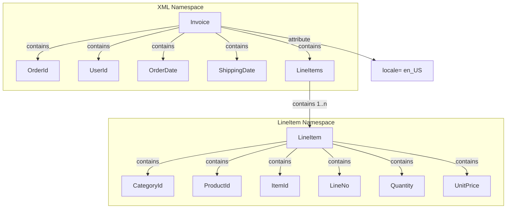
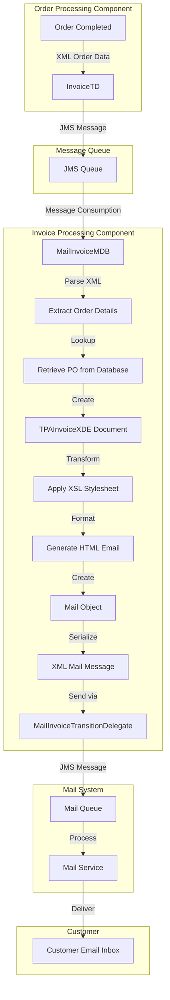
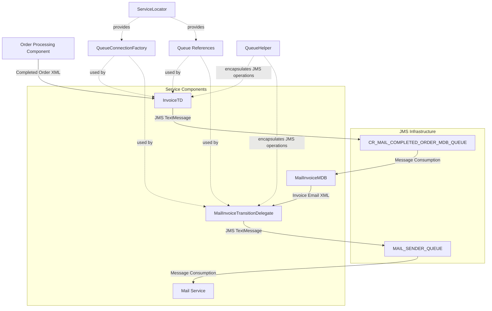

# Invoice Generation in Java Pet Store

## Invoice Structure and Data Model

The invoice system in Java Pet Store 1.3.2 is built around a well-defined XML structure that serves as the data model for invoice documents. The core structure is defined in two complementary DTD files: `Invoice.dtd` and `TPAInvoice.dtd` (Trading Partner Agreement Invoice). These DTDs establish a hierarchical document structure with the `Invoice` element as the root, containing essential order information including `OrderId`, `UserId`, `OrderDate`, `ShippingDate`, and one or more `LineItem` elements. The invoice structure supports internationalization through a locale attribute with a default value of "en_US".

The `TPAInvoice.dtd` extends this model with namespace support, using the `tpai` prefix mapped to the "http://blueprints.j2ee.sun.com/TPAInvoice" namespace. This enables the invoice documents to be properly identified and processed within the broader XML document exchange architecture of the application. The modular design is evident in how both DTDs import line item definitions from separate DTD files (`LineItem.dtd` and `TPALineItem.dtd` respectively) using external entity references, allowing for consistent representation of order items across different document types while maintaining separation of concerns.

This structured approach ensures that invoice documents maintain consistent format and content throughout the system, facilitating reliable processing across components while supporting extensibility for future enhancements.

## Invoice Document Structure

The diagram illustrates the hierarchical structure of invoice documents in the Java Pet Store application. The root `Invoice` element contains order metadata elements (`OrderId`, `UserId`, `OrderDate`, `ShippingDate`) and a `LineItems` container element. Each `LineItem` represents a purchased product with detailed information including category, product identifier, item identifier, line number, quantity, and unit price. This structure is defined in the DTD files and enforced through XML validation during document processing.

The namespacing approach separates the main invoice elements from the line item elements, allowing for modular schema design and potential reuse of the line item structure in other document types. The locale attribute on the Invoice element supports internationalization, enabling the system to format currency values and dates according to the customer's locale preferences.

## XML Document Processing

The `TPAInvoiceXDE` class serves as the cornerstone for programmatic creation and manipulation of invoice documents in the Java Pet Store application. This XML Document Editor (XDE) provides a comprehensive API for building invoice documents that conform to the TPA (Trading Partner Agreement) schema. The class leverages the Document Object Model (DOM) for in-memory representation and manipulation of invoice XML structures, offering a more robust approach than string concatenation or manual XML generation.

The class implements a flexible document creation workflow through methods like `newDocument()`, which initializes a clean DOM document, and setter methods (`setOrderId()`, `setUserId()`, `setOrderDate()`, `setShippingDate()`) that populate the document with order-specific data. The `addLineItem()` method enables the addition of purchased items with their respective details. For document serialization, the class provides multiple output options through `getDocument()` (returning a DOM Source) and `getDocumentAsString()` (returning a formatted XML string), accommodating different integration requirements.

A particularly sophisticated aspect of the implementation is its support for both DTD and XSD validation through a configurable flag, allowing the system to adapt to different validation requirements without code changes. The class also handles XML namespace management transparently, ensuring that all generated documents conform to the TPA namespace conventions. This abstraction shields other components from the complexities of XML document creation and validation, providing a clean API for invoice generation while maintaining strict adherence to the defined schema.

## Order Processing Workflow

The order processing workflow in Java Pet Store follows a well-defined path from order completion to invoice generation. When an order is successfully processed and payment is confirmed, the system transitions the order to a "completed" state. At this point, the `InvoiceTD` (Invoice Transition Delegate) class comes into play as a critical component in the workflow.

The `InvoiceTD` implements the `TransitionDelegate` interface, serving as a bridge between the order processing system and the invoice generation subsystem. When an order reaches the appropriate state, the order processing component invokes the `doTransition()` method of `InvoiceTD`, passing the completed order information as XML data within a `TransitionInfo` object. The delegate then serializes this data and sends it as a JMS message to a dedicated queue (`CR_MAIL_COMPLETED_ORDER_MDB_QUEUE`).

This asynchronous approach decouples the order processing from invoice generation, allowing the order processing component to continue handling new orders without waiting for the potentially time-consuming invoice generation and delivery process to complete. The use of JMS messaging provides reliable delivery semantics, ensuring that even if the invoice generation component is temporarily unavailable, the order information will be preserved in the queue until it can be processed.

The workflow leverages the Service Locator pattern to obtain JMS resources, promoting loose coupling between components and simplifying resource management. This architecture allows the system to scale horizontally, with multiple instances of order processing components feeding into a pool of invoice generation workers as transaction volume increases.

## Invoice Generation Workflow

The invoice generation workflow in Java Pet Store follows a sophisticated asynchronous processing model. When an order is completed, the `InvoiceTD` transition delegate serializes the order data and sends it as a JMS message to a dedicated queue. This message is then consumed by the `MailInvoiceMDB` message-driven bean, which orchestrates the invoice generation process.

Upon receiving the message, `MailInvoiceMDB` parses the XML order data and retrieves additional purchase order details from the database. It then uses the `TPAInvoiceXDE` to create a structured invoice document conforming to the defined XML schema. This document undergoes transformation through an XSL stylesheet (`PartialInvoice.xsl`) to generate formatted HTML content suitable for email delivery.

The formatted content is encapsulated in a `Mail` object along with the customer's email address and an appropriate subject line. This mail object is serialized to XML and passed to the `MailInvoiceTransitionDelegate`, which sends it to another JMS queue for processing by the mail service. The mail service ultimately delivers the formatted invoice to the customer's email inbox.

This multi-stage workflow demonstrates several enterprise architecture best practices: separation of concerns (order processing, invoice generation, and email delivery are handled by separate components), asynchronous processing for improved scalability, and the use of XML as a common data format for inter-component communication.

## JMS Integration for Asynchronous Processing

The Java Pet Store application leverages Java Message Service (JMS) as a fundamental architectural component to enable decoupled, asynchronous invoice processing. This approach provides significant advantages in terms of system scalability, reliability, and maintainability. The integration centers around two key transition delegates: `InvoiceTD` and `MailInvoiceTransitionDelegate`, which serve as bridges between the synchronous business logic and the asynchronous messaging infrastructure.

The `InvoiceTD` class implements the `TransitionDelegate` interface and is responsible for initiating the invoice generation process. When an order is completed, this delegate serializes the order data and sends it as a JMS message to the `CR_MAIL_COMPLETED_ORDER_MDB_QUEUE`. This queue acts as a buffer, allowing the order processing component to continue handling new orders without waiting for invoice generation to complete. The message contains all necessary information for invoice creation, encoded as XML.

On the receiving end, the `MailInvoiceMDB` message-driven bean listens for messages on this queue. When a message arrives, the bean processes it by generating an invoice and preparing an email notification. The resulting email content is then passed to the `MailInvoiceTransitionDelegate`, which sends it to another JMS queue (`MAIL_SENDER_QUEUE`) for delivery to the customer.

Both transition delegates use the `ServiceLocator` pattern to obtain JMS resources, reducing direct JNDI lookups and promoting loose coupling. The `QueueHelper` utility class encapsulates the JMS API complexity, providing a simplified interface for sending messages. This layered approach to JMS integration allows the application to handle high transaction volumes efficiently while maintaining system resilience through message persistence and guaranteed delivery.

## Message Flow Architecture

The message flow architecture for invoice generation in Java Pet Store demonstrates a sophisticated approach to asynchronous processing using JMS messaging. The diagram illustrates how different components communicate through message queues to achieve decoupled, reliable invoice generation and notification.

The flow begins when the Order Processing Component signals order completion by invoking the `InvoiceTD` transition delegate. This delegate serializes the order data as XML and sends it as a JMS TextMessage to the `CR_MAIL_COMPLETED_ORDER_MDB_QUEUE`. The `MailInvoiceMDB` message-driven bean listens to this queue and processes incoming messages by generating invoice documents and formatting them as HTML emails.

Once the email content is prepared, the `MailInvoiceMDB` passes it to the `MailInvoiceTransitionDelegate`, which sends another JMS TextMessage containing the formatted email to the `MAIL_SENDER_QUEUE`. This message is ultimately consumed by the Mail Service component, which handles the actual email delivery to the customer.

The architecture leverages the `ServiceLocator` pattern to obtain JMS resources (QueueConnectionFactory and Queue references) in a consistent manner across components. The `QueueHelper` utility class encapsulates the JMS API complexity, providing a simplified interface for message sending operations.

This message-driven architecture provides several benefits: it decouples components for better scalability, enables asynchronous processing for improved responsiveness, and leverages JMS's reliability features for guaranteed message delivery even in the face of system failures.

## Customer Notification System

The customer notification system in Java Pet Store is implemented through the `MailInvoiceMDB` message-driven bean, which serves as the central component for transforming invoice XML documents into formatted HTML emails and delivering them to customers. This component operates asynchronously, consuming JMS messages containing invoice information from a dedicated queue and processing them to generate customer notifications.

Upon receiving a message, `MailInvoiceMDB` first extracts the invoice XML and uses the `TPAInvoiceXDE` class to parse and manipulate the document. It then retrieves additional purchase order details from the database, including the customer's email address and locale preferences. This information is crucial for proper formatting and localization of the notification content.

The transformation from raw invoice data to a visually appealing email is accomplished through XSL transformation. The bean uses a predefined stylesheet (`PartialInvoice.xsl`) to convert the structured XML invoice into formatted HTML content suitable for email delivery. This approach separates the data structure from its presentation, allowing for easy customization of the email template without modifying the underlying code.

Once the HTML content is generated, the bean creates a `Mail` object containing the recipient's email address, a subject line (which includes the order ID for easy reference), and the formatted message body. This object is serialized to XML and passed to the `MailInvoiceTransitionDelegate`, which handles the actual delivery through the mail service.

The system includes a configuration flag (`SEND_CONFIRMATION_MAIL`) that can be used to enable or disable email notifications globally, providing operational flexibility. Error handling is implemented throughout the process, with exceptions being wrapped in EJBExceptions to ensure proper transaction management and logging.

## Internationalization Support

The invoice generation system in Java Pet Store demonstrates comprehensive internationalization support, enabling the application to serve customers across different locales with appropriately formatted content. This support is implemented at multiple levels throughout the invoice generation and notification process.

At the data model level, the invoice XML structure includes a `locale` attribute on the root `Invoice` element, with a default value of "en_US". This attribute serves as a marker for the document's intended locale, influencing how dates, numbers, and currencies are formatted during presentation. The XML schemas (both DTD and XSD versions) explicitly define this attribute, ensuring it's consistently available throughout the processing pipeline.

The `MailInvoiceMDB` component retrieves the customer's locale preference from the purchase order database record (`po.getPoLocale()`) and uses the `LocaleUtil` helper class to convert the string representation into a proper `Locale` object. This locale information is then passed to the `mailContentXDE.setLocale()` method, which configures the XSL transformation process to use locale-appropriate formatting.

The XSL stylesheet used for transforming invoice XML into HTML email content likely contains locale-aware formatting logic for elements such as dates, currency values, and possibly translated text. By applying the customer's preferred locale during transformation, the system ensures that the resulting email presents information in a format familiar to the recipient.

This multi-layered approach to internationalization—from data model to presentation transformation—demonstrates a mature understanding of globalization requirements in enterprise applications. It allows the Java Pet Store to serve an international customer base while maintaining a consistent user experience across different regions and language preferences.

## Error Handling and Resilience

The invoice generation system in Java Pet Store implements a comprehensive error handling strategy to ensure resilience in the face of various failure scenarios. This approach is evident across all components involved in the invoice generation and notification process.

In the `MailInvoiceMDB` message-driven bean, exceptions encountered during processing are caught and wrapped in `EJBException` instances before being thrown. This pattern ensures that the EJB container can properly manage transactions, potentially rolling them back when necessary, and provides consistent logging of error conditions. The bean handles various exception types including `XMLDocumentException`, `TransitionException`, `JMSException`, `MailContentXDE.FormatterException`, and `FinderException`, demonstrating awareness of the different failure modes that can occur during processing.

The transition delegates (`InvoiceTD` and `MailInvoiceTransitionDelegate`) follow a similar pattern, catching JMS-specific exceptions and wrapping them in `TransitionException` instances. This approach provides a unified error handling model across the transition system while preserving the original exception details for diagnostic purposes.

The system's use of asynchronous messaging through JMS provides inherent resilience through message persistence. If the invoice generation component is temporarily unavailable, messages remain in the queue until they can be processed. Similarly, if email delivery fails, the mail service can implement retry logic without affecting the invoice generation process.

Configuration flags like `SEND_CONFIRMATION_MAIL` allow the system to operate in a degraded mode if necessary, skipping non-critical functions like email notifications while still completing essential order processing tasks. This graceful degradation capability is an important aspect of system resilience.

While the code doesn't explicitly show circuit breakers or retry mechanisms, the component-based architecture and asynchronous messaging foundation provide natural isolation boundaries that prevent failures in one component from cascading throughout the system.

[Generated by the Sage AI expert workbench: 2025-03-29 21:37:00  https://sage-tech.ai/workbench]: #