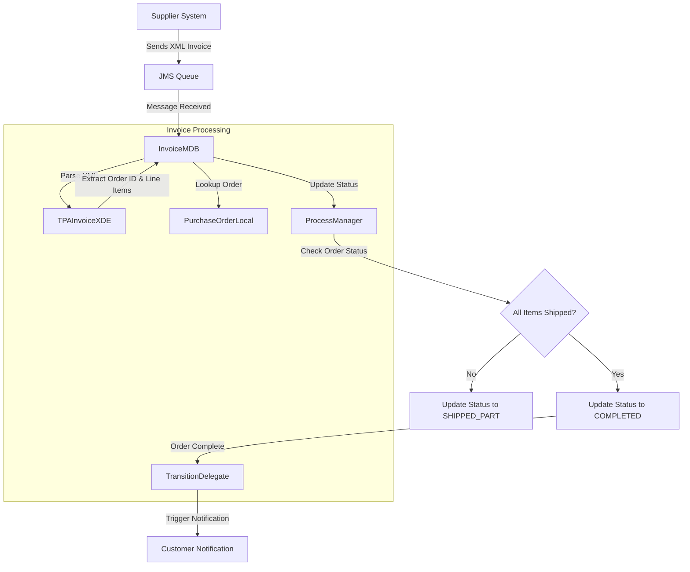
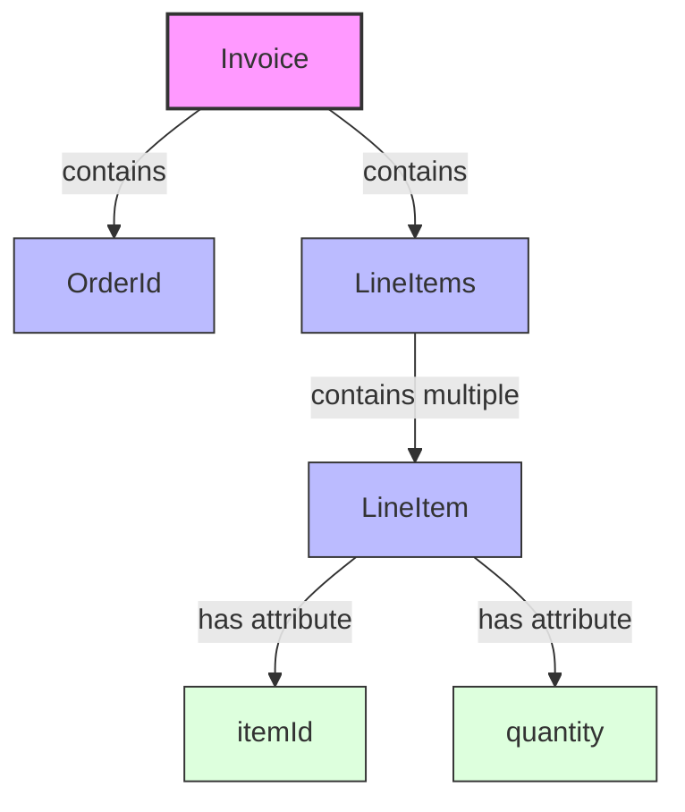
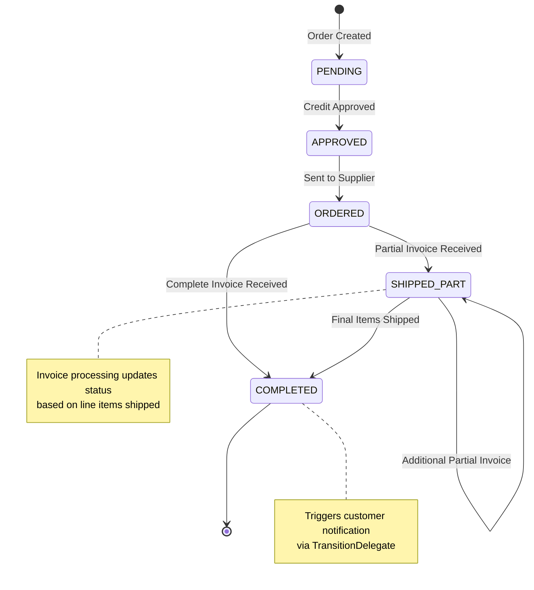
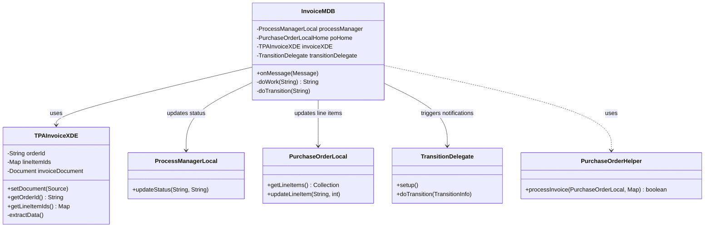

# Invoice Processing in Java Pet Store 1.3.2

## Invoice Processing Overview

Invoice processing in Java Pet Store serves as a critical bridge between supplier communications and internal order management systems. It represents the final phase of the order fulfillment workflow, where supplier-generated invoices are processed to update order status and notify customers of shipment completion. The system implements an asynchronous message-driven architecture that decouples supplier invoice submission from internal order processing. When suppliers ship products, they generate XML invoices that are transmitted to the Pet Store application via JMS messaging. These invoices contain essential information about which items have been shipped and in what quantities, allowing the system to track partial or complete order fulfillment. The invoice processing subsystem parses these XML documents, validates them against predefined schemas, extracts the relevant data, and then updates the order status accordingly. This component plays a vital role in maintaining accurate order status information and ensuring timely customer notifications when orders are fulfilled.

## Invoice Processing Workflow

The diagram illustrates the invoice processing workflow in Java Pet Store. The process begins when a supplier system sends an XML invoice through a JMS queue. The InvoiceMDB component, acting as a message-driven bean, receives this message and initiates processing. It uses TPAInvoiceXDE to parse the XML document and extract critical information such as the order ID and shipped line items. The system then looks up the corresponding purchase order through the PurchaseOrderLocal interface and updates its status based on the invoice data. The ProcessManager evaluates whether all items have been shipped, updating the order status to either COMPLETED or SHIPPED_PART accordingly. When an order reaches completion, the TransitionDelegate pattern is used to trigger customer notifications, informing them that their order has been fulfilled. This asynchronous architecture ensures that supplier communications are processed efficiently without blocking other system operations.

## XML Invoice Structure and Parsing

The TPAInvoiceXDE class serves as the cornerstone of XML invoice processing in Java Pet Store. This class extends XMLDocumentEditor.DefaultXDE and implements specialized functionality for parsing Trading Partner Agreement (TPA) invoices. The class handles the complex task of deserializing XML documents from various sources, validating them against either DTD or XSD schemas, and extracting structured data into a format usable by the application's business logic.

TPAInvoiceXDE defines a clear namespace structure with constants like INVOICE_NS and LINEITEM_NS, ensuring proper XML parsing in a namespace-aware manner. The class maintains internal state through three key variables: orderId (string), lineItemIds (map of item IDs to quantities), and invoiceDocument (DOM Document). When an invoice is received, the setDocument() method deserializes the XML content using a transformer with configurable validation options. The extractData() method then navigates the DOM structure to populate the orderId and lineItemIds fields, using namespace-aware DOM traversal methods.

The class implements sophisticated error handling for XML validation failures, ensuring that only properly formatted invoices are processed. This validation is configurable through constructor parameters, allowing the system to adapt to different validation requirements. The getOrderId() and getLineItemIds() methods provide access to the extracted data, serving as a clean interface for other components like InvoiceMDB to retrieve the necessary information without dealing with XML parsing complexities. This separation of concerns allows the invoice processing system to evolve independently of the XML document structure, providing flexibility for future changes to the invoice format.

## Message-Driven Architecture for Invoice Handling

The InvoiceMDB class exemplifies the asynchronous message-driven architecture that powers Java Pet Store's invoice processing system. As a message-driven bean implementing the MessageListener interface, it establishes a loosely coupled integration point between supplier systems and the order management infrastructure. This design pattern allows suppliers to submit invoices at their convenience without requiring immediate synchronous processing, enhancing system scalability and resilience.

When initialized through ejbCreate(), InvoiceMDB uses the ServiceLocator pattern to obtain references to critical components including the PurchaseOrderLocalHome, ProcessManagerLocal, and configuration parameters for XML validation. This dependency injection approach simplifies component wiring while maintaining flexibility. The core functionality resides in the onMessage() method, which receives JMS TextMessages containing XML invoice data. This method orchestrates the invoice processing workflow by delegating XML parsing to TPAInvoiceXDE, updating purchase order status through PurchaseOrderLocal, and managing workflow state transitions via ProcessManagerLocal.

The doWork() method handles the business logic of processing invoices, determining whether an order has been completely fulfilled based on the shipped items. It returns the order ID if the order is complete, triggering subsequent workflow transitions. The doTransition() method then leverages the TransitionDelegate pattern to initiate customer notifications when orders reach completion. This separation of message reception, business logic processing, and workflow transition management creates a modular, maintainable architecture that effectively handles the asynchronous nature of supplier communications while ensuring reliable order status updates and customer notifications.

## Invoice XML Document Structure

The TPA invoice XML document follows a structured format designed for efficient processing of supplier shipment information. At the root level, the `Invoice` element (in the `http://blueprints.j2ee.sun.com/TPAInvoice` namespace) serves as the container for all invoice data. It contains two primary child elements: `OrderId` and `LineItems`. The `OrderId` element holds the unique identifier that links the invoice to a specific purchase order in the system. The `LineItems` element acts as a container for one or more `LineItem` elements (in the `http://blueprints.j2ee.sun.com/TPALineItem` namespace).

Each `LineItem` element represents a product that has been shipped and contains two essential attributes: `itemId` (identifying the specific product) and `quantity` (indicating how many units were shipped). This structure allows suppliers to report partial shipments where only some items from an order have been fulfilled.

The TPAInvoiceXDE class parses this structure using namespace-aware DOM traversal methods, extracting the order ID as a string and building a map of item IDs to quantities. This parsed data is then used by the InvoiceMDB to update the corresponding purchase order status. The XML structure is validated against either a DTD or XSD schema (depending on configuration) to ensure data integrity before processing, with validation errors properly handled to prevent corrupt data from affecting the system.

## Order Status Management

Invoice processing plays a pivotal role in managing the lifecycle of purchase orders within the Java Pet Store application. When invoices are received from suppliers, they trigger state transitions in the order status, reflecting the real-world fulfillment progress. The InvoiceMDB class implements sophisticated logic to determine the appropriate status updates based on the invoice content.

The core of this functionality resides in the doWork() method, which leverages the PurchaseOrderHelper to process invoice line items against the corresponding purchase order. This helper method compares the shipped quantities in the invoice against the ordered quantities in the purchase order, determining whether all items have been shipped. Based on this analysis, the system makes a critical decision point: if all items have been shipped (orderDone == true), the order status is updated to COMPLETED; otherwise, it's set to SHIPPED_PART, indicating partial fulfillment.

This status management approach allows the system to track orders through various stages of fulfillment, providing accurate visibility into order progress. The ProcessManager component is responsible for maintaining this state and ensuring proper transitions between states. When an order reaches the COMPLETED state, it triggers additional workflow actions through the TransitionDelegate pattern, such as customer notifications.

The granular tracking at the line item level enables the system to handle complex real-world scenarios, such as partial shipments, back-ordered items, or multiple shipments for a single order. This detailed status tracking ensures that customers receive accurate information about their orders and that the system maintains a consistent view of inventory and fulfillment status across all components.

## Workflow State Transitions

The Java Pet Store implements a sophisticated workflow state transition system for order processing, with invoice handling representing a critical phase in this workflow. The TransitionDelegate pattern is employed to decouple the state transition logic from the core invoice processing functionality, allowing for flexible workflow management without modifying the message-driven bean implementation.

When an invoice is processed and an order is determined to be complete, the InvoiceMDB's doTransition() method is invoked with the completed order ID. This method creates a TransitionInfo object containing the order ID and passes it to the TransitionDelegate implementation (InvoiceTD). The delegate then orchestrates the appropriate actions based on the workflow state, typically triggering customer notifications to inform them that their order has been fulfilled.

This pattern enables a clean separation of concerns: the InvoiceMDB focuses on processing invoice messages and updating order status, while the TransitionDelegate handles the subsequent workflow actions. The setup() method in the TransitionDelegate implementation configures the necessary components for handling transitions, potentially including notification services, email templates, or other resources needed for customer communications.

The workflow transition system allows for extensibility and customization of the order fulfillment process. New transition actions can be added by modifying the TransitionDelegate implementation without changing the core invoice processing logic. This architecture supports complex business rules for order fulfillment, such as different notification templates based on order characteristics, special handling for premium customers, or integration with additional systems for order tracking and analytics.

## Order Status State Machine

The diagram illustrates the order status state machine in Java Pet Store, highlighting how invoice processing drives the final stages of the order lifecycle. Orders begin in a PENDING state when created and progress through APPROVED (after credit verification) and ORDERED (when sent to suppliers) states. The invoice processing component manages the critical transitions from ORDERED to either SHIPPED_PART or COMPLETED states.

When an invoice is received, the InvoiceMDB determines whether all items have been shipped. If only some items are shipped, the order transitions to the SHIPPED_PART state, where it may remain while receiving additional partial invoices. Each new invoice triggers a reevaluation of the order's completion status. Once all items have been shipped (either in a single invoice or across multiple partial invoices), the order transitions to the COMPLETED state.

The COMPLETED state represents the terminal state in the order fulfillment process and triggers additional workflow actions through the TransitionDelegate pattern. Most importantly, this transition initiates customer notifications, informing them that their order has been fully shipped.

This state machine design provides several advantages: it accurately tracks order progress, supports complex fulfillment scenarios like partial shipments, maintains a clear audit trail of order status changes, and ensures appropriate notifications at key transition points. The ProcessManager component enforces the state transition rules, ensuring that orders follow valid paths through the state machine and maintaining data consistency throughout the order lifecycle.

## Integration with Purchase Order System

Invoice processing in Java Pet Store is tightly integrated with the purchase order system through the PurchaseOrderLocal interface. This integration ensures that invoice data from suppliers is properly reflected in the order management system, maintaining consistency between external communications and internal order status.

When an invoice is received, the InvoiceMDB uses the ServiceLocator pattern to obtain a reference to the PurchaseOrderLocalHome interface. It then uses the order ID extracted from the invoice to locate the corresponding purchase order through the findByPrimaryKey() method. This lookup establishes the connection between the supplier invoice and the internal order representation.

The PurchaseOrderHelper class provides specialized functionality for processing invoice data against purchase orders. Its processInvoice() method takes the PurchaseOrderLocal instance and the map of line item IDs to quantities extracted from the invoice. This method updates the purchase order's line items to reflect the shipped quantities and returns a boolean indicating whether all items have been shipped.

This integration allows the system to track partial shipments at a granular level. Each line item in the purchase order maintains its own status, which is updated based on the invoice data. The purchase order system can then provide detailed information about which items have been shipped and which are still pending, supporting customer inquiries and internal inventory management.

The purchase order system also maintains the relationship between orders and customers, enabling the workflow system to access customer information for notifications when orders are completed. This bidirectional integration ensures that all components have access to the information they need while maintaining clear separation of concerns between invoice processing, order management, and customer communications.

## Error Handling and Validation

The invoice processing system in Java Pet Store implements robust error handling and validation strategies to ensure system reliability and data integrity. These mechanisms operate at multiple levels, from XML document validation to transaction management and exception handling.

At the XML level, the TPAInvoiceXDE class provides configurable validation against either DTD or XSD schemas. This validation is controlled through constructor parameters, allowing the system to adapt to different validation requirements. The setDocument() method uses XMLDocumentUtils.deserialize() to parse and validate XML content, throwing XMLDocumentException if validation fails. This ensures that only well-formed and valid invoices proceed to data extraction.

During data extraction, the extractData() method implements additional semantic validation, verifying that required elements like OrderId and LineItems are present and properly structured. It uses namespace-aware DOM traversal methods to navigate the document structure, with clear error messages when expected elements are missing or malformed.

The InvoiceMDB class wraps lower-level exceptions in EJBException instances, ensuring that transaction rollback occurs appropriately when errors are encountered. This prevents partial updates to the system state, maintaining data consistency. The onMessage() method catches specific exceptions like XMLDocumentException, JMSException, and FinderException, providing context-specific error handling for different failure scenarios.

The system also leverages the container's transaction management capabilities. As a message-driven bean, InvoiceMDB operates within container-managed transactions, ensuring that all database updates are either committed together or rolled back entirely if an error occurs. This transaction boundary encompasses both the purchase order updates and the process manager status changes, maintaining consistency between these related components.

For operational monitoring, the system can be configured to log validation failures and processing errors, providing visibility into system behavior and facilitating troubleshooting. This comprehensive approach to error handling and validation ensures that the invoice processing system remains robust and reliable, even when dealing with external data sources and complex processing requirements.

## Component Interaction Diagram

The component interaction diagram illustrates the architectural relationships between the key components involved in invoice processing. At the center is the InvoiceMDB, which orchestrates the entire process. It maintains references to several critical components and coordinates their interactions to process invoices and update order status.

The InvoiceMDB uses TPAInvoiceXDE for XML document parsing and data extraction. This component encapsulates all XML-specific logic, providing a clean interface for accessing invoice data without exposing XML parsing details. The extracted data (order ID and line items) flows back to the InvoiceMDB for further processing.

For order management, InvoiceMDB interacts with PurchaseOrderLocal to retrieve order information and update line item status. It uses the PurchaseOrderHelper utility class to process invoice data against the purchase order, determining whether all items have been shipped. This separation of concerns keeps the business logic for invoice processing distinct from the entity access code.

The ProcessManagerLocal component manages order status transitions, with InvoiceMDB calling its updateStatus() method to reflect the current fulfillment state. When orders reach completion, InvoiceMDB delegates to the TransitionDelegate to trigger appropriate notifications and other workflow actions.

This architecture demonstrates several design patterns: Message-Driven Bean for asynchronous processing, Data Access Object for entity manipulation, Service Locator for component discovery, and Delegate for workflow management. Together, these patterns create a modular, maintainable system that effectively handles the complex requirements of invoice processing while maintaining clear separation of concerns between components.

[Generated by the Sage AI expert workbench: 2025-03-29 21:37:00  https://sage-tech.ai/workbench]: #