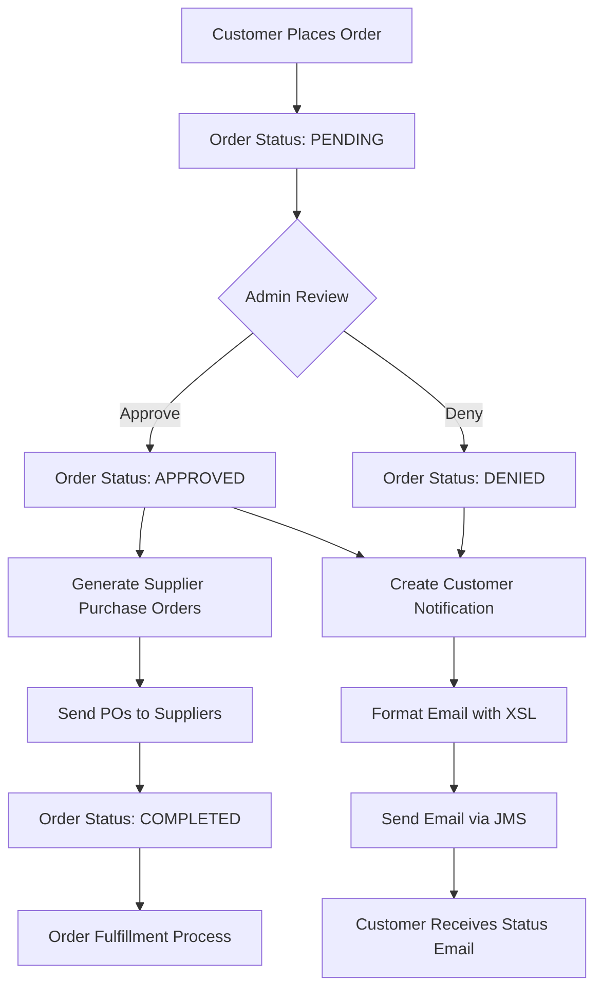
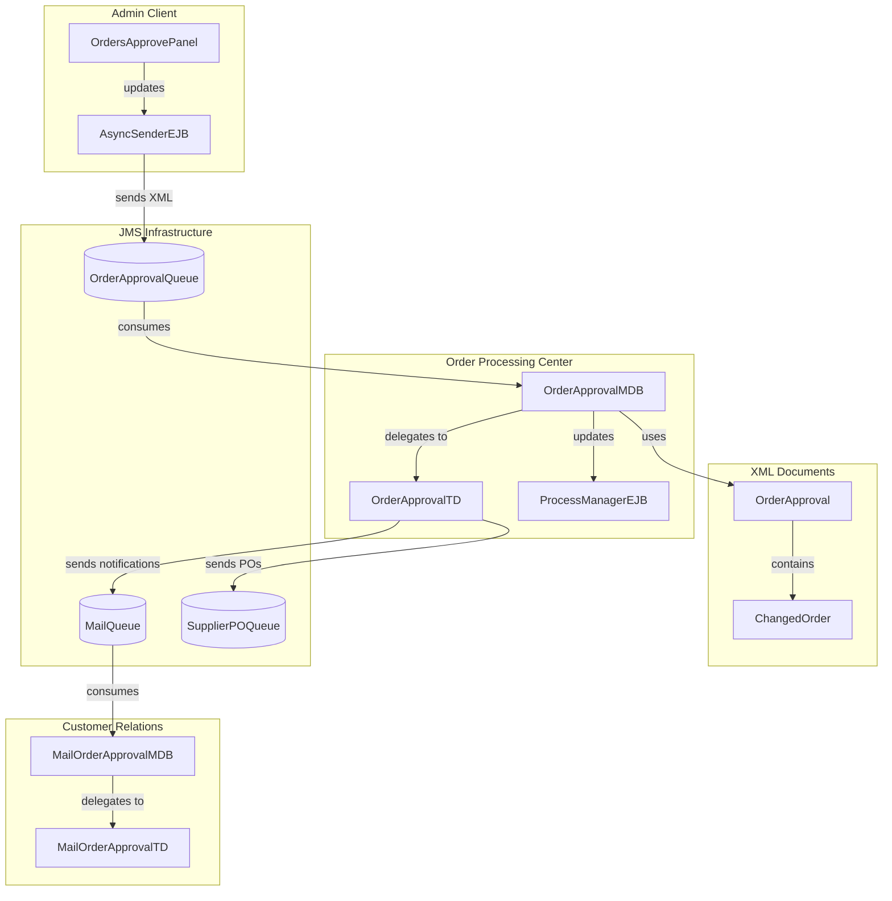
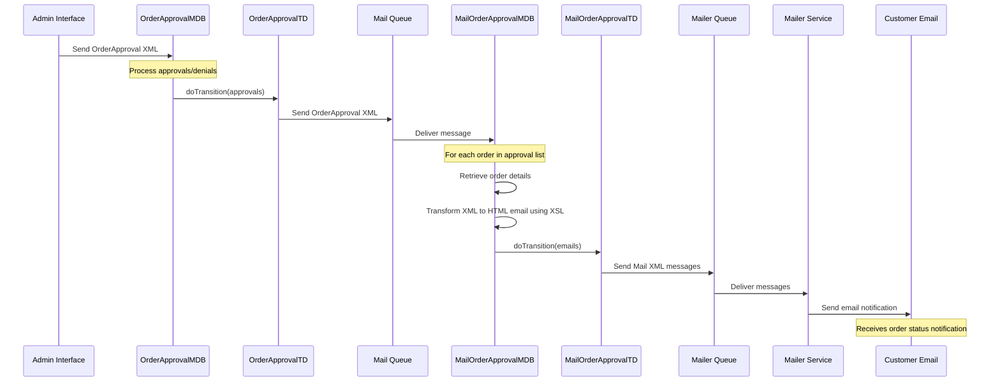
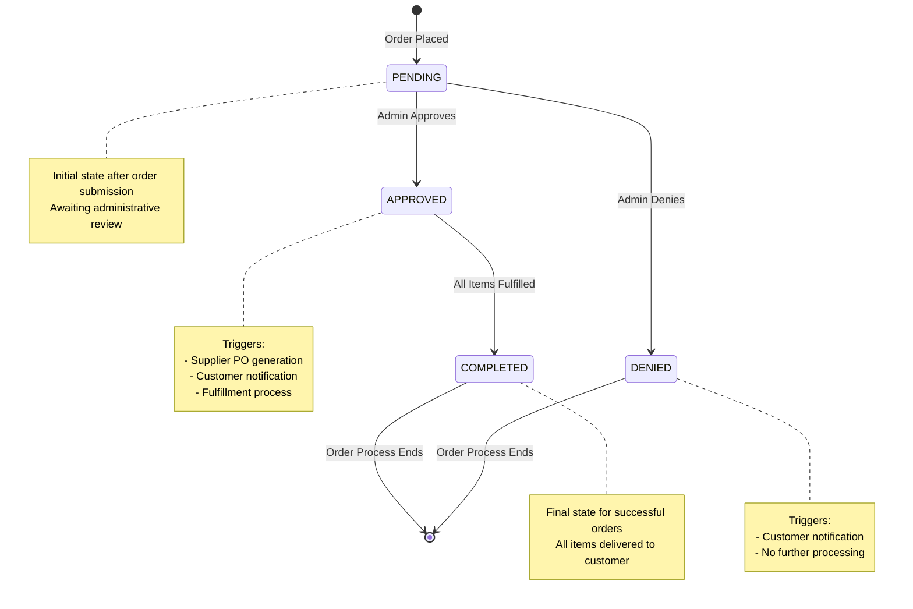

# Order Approval in Java Pet Store

## Order Approval Overview

The order approval process in Java Pet Store 1.3.2 represents a critical business workflow that bridges the gap between customer order submission and fulfillment. This process serves as a control point where administrators can review pending orders before committing business resources to fulfillment. The implementation follows a message-driven architecture that decouples the approval decision from both the customer-facing storefront and the supplier integration components. Order approval is particularly important for business operations as it provides an opportunity to validate orders for legitimacy, check inventory availability, and ensure proper payment processing before triggering downstream fulfillment processes. The system's design allows for both automated and manual approval workflows, with the admin interface providing visual tools for order management. This architecture demonstrates the J2EE platform's capability to handle complex business processes through asynchronous messaging, component-based design, and separation of concerns across multiple tiers.

## Order Approval Workflow



The order approval workflow in Java Pet Store follows a well-defined process that begins after a customer places an order. Initially, all orders enter the system with a "PENDING" status, awaiting administrative review. The OrderApprovalMDB component listens for approval decision messages on a JMS queue, which are typically generated through the admin interface (OrdersApprovePanel).

When an administrator reviews orders, they can either approve or deny them individually or in batches. Upon approval, the system generates supplier purchase orders for fulfillment and updates the order status to "APPROVED" in the database. For denied orders, no purchase orders are created, and the status is updated to "DENIED". In both cases, the system creates customer notifications using the OrderApproval XML format.

These notifications are transformed into HTML emails using XSL stylesheets and sent to customers via the MailOrderApprovalMDB. The system uses transition delegates to decouple the business logic from the actual message sending, allowing for flexible implementation of different notification mechanisms. For approved orders, the fulfillment process continues with supplier integration, eventually updating the order status to "COMPLETED" once all items are fulfilled.

## XML Data Structure

The order approval process in Java Pet Store relies on a well-defined XML data structure to facilitate information exchange between system components. At the core of this structure is the OrderApproval DTD, which defines a simple yet effective schema for representing order status changes. The DTD establishes a hierarchical structure where `OrderApproval` is the root element containing one or more `Order` elements, each with `OrderId` and `OrderStatus` child elements.

The `OrderApproval.java` class serves as the object representation of this XML structure, providing methods for creating, manipulating, and serializing/deserializing order approval data. This class implements a robust XML processing framework with support for DOM conversion, validation against the DTD, and various XML input/output methods. It maintains an internal collection of `ChangedOrder` objects, each representing an order with updated status information.

Interestingly, the DTD contains a comment indicating that `OrderStatus` should be implemented as an attribute rather than an element, suggesting a potential future refactoring. This highlights the evolutionary nature of the data model and the separation between the logical data structure and its physical representation.

The XML structure enables loose coupling between components in the order approval process. The admin interface can generate OrderApproval documents that are sent via JMS to the OrderApprovalMDB, which processes them and generates appropriate responses. This document-centric approach allows different components to interact without tight dependencies on each other's internal implementations, facilitating a more maintainable and extensible system architecture.

## Admin Interface for Order Management

The OrdersApprovePanel class implements a sophisticated Swing-based user interface that empowers administrators to efficiently manage the order approval process. This panel presents pending orders in a sortable table with intuitive visual cues—green for approved orders, red for denied, and yellow for pending—allowing administrators to quickly assess order status at a glance.

The interface is designed for both individual and batch operations. Administrators can select multiple orders and apply mass approval or denial actions through dedicated buttons, streamlining the workflow for high-volume order processing. Each order row displays critical information including order ID, customer ID, date, amount, and current status, providing comprehensive context for decision-making.

The panel implements the PropertyChangeListener interface to maintain synchronization with the underlying data model. When order data changes, the table automatically refreshes to reflect the current state. Similarly, during data retrieval or update operations, the action buttons are temporarily disabled to prevent concurrent modifications.

The implementation leverages several advanced Swing patterns, including custom cell renderers for status visualization and the TableSorter wrapper to enable dynamic sorting. The status column features a dropdown editor that constrains status values to valid options (PENDING, APPROVED, DENIED), preventing invalid data entry.

This interface represents a critical touchpoint in the order fulfillment process, where human judgment can be applied before committing to order processing. By providing clear visual feedback and efficient batch operations, the panel balances the need for careful review with operational efficiency in high-volume e-commerce environments.

## Order Approval Component Architecture



The Order Approval component architecture in Java Pet Store demonstrates a sophisticated implementation of enterprise integration patterns. At the center of this architecture is the OrderApprovalMDB (Message-Driven Bean), which serves as the primary processor for order approval decisions. This component receives XML messages from the OrderApprovalQueue, processes them by updating order status in the database via the ProcessManagerEJB, and then delegates further actions to the OrderApprovalTD (Transition Delegate).

The architecture follows a clear separation of concerns: the admin client (OrdersApprovePanel) provides the user interface for approval decisions, the AsyncSenderEJB handles the asynchronous communication with the order processing center, and the OrderApprovalMDB focuses on the business logic of processing approvals. The TransitionDelegate pattern is used extensively to decouple the core processing logic from the specific mechanisms used for communication with other components.

The XML Documents components (OrderApproval and ChangedOrder) serve as the data transfer objects that flow through the system, providing a well-defined contract between components. These documents are serialized to XML for transmission over JMS queues and deserialized on receipt.

The Customer Relations components (MailOrderApprovalMDB and MailOrderApprovalTD) handle the customer notification aspect of the workflow, receiving approval/denial information and generating appropriate email notifications. Similarly, approved orders trigger purchase order generation that flows to suppliers through the SupplierPOQueue.

This architecture exemplifies J2EE best practices by using message-driven components for loose coupling, delegating specific responsibilities to specialized components, and using XML as a common data exchange format.

## Message-Driven Processing

The OrderApprovalMDB class represents a sophisticated implementation of the Message-Driven Bean (MDB) pattern, serving as the core processor for order approval decisions in the Java Pet Store application. This component listens for JMS messages containing OrderApproval XML documents on a dedicated queue and processes them asynchronously, decoupling the approval decision from the administrative interface.

Upon receiving a message, the MDB parses the XML content into an OrderApproval object, which contains a collection of ChangedOrder instances. For each order, the MDB first verifies that it's in a PENDING state to prevent processing already approved, denied, or completed orders—an important idempotency check that prevents duplicate processing. It then updates the order status in the database through the ProcessManagerLocal EJB.

For approved orders, the MDB generates supplier purchase orders by retrieving detailed order information from the PurchaseOrderLocal EJB and transforming it into supplier-specific XML format using the TPASupplierOrderXDE (XML Document Exchange) component. This demonstrates the system's ability to transform internal data representations into formats suitable for external business partners.

The MDB employs an inner class WorkResult to bundle multiple return values from its processing method, showing a clean approach to handling complex return structures. After processing all orders in a batch, it delegates the actual sending of messages to the TransitionDelegate, adhering to the principle of separation of concerns.

The component's initialization logic uses the ServiceLocator pattern to obtain references to required resources and dependencies, reducing boilerplate JNDI lookup code and improving maintainability. Error handling is robust, with exceptions wrapped in EJBExceptions to ensure proper transaction rollback when necessary.

This implementation showcases how message-driven components can effectively process business events asynchronously while maintaining transaction integrity and separation of concerns in an enterprise application.

## Transition Delegation Pattern

The Transition Delegation pattern, as implemented in the Java Pet Store's order approval system, represents a sophisticated approach to decoupling business process logic from communication mechanisms. This pattern is exemplified by the TransitionDelegate interface and its implementations like OrderApprovalTD and MailOrderApprovalTransitionDelegate.

At its core, the pattern defines a contract through the TransitionDelegate interface with two primary methods: setup() for initializing resources and doTransition() for executing the actual transition logic. This abstraction allows the business components (like OrderApprovalMDB) to focus on their core responsibilities while delegating the specifics of inter-component communication to specialized classes.

The OrderApprovalTD implementation handles the transition of approved orders by sending purchase orders to suppliers and notifications to customer relations. It encapsulates all the JMS-specific code for message sending, shielding the MDB from these details. Similarly, the MailOrderApprovalTransitionDelegate focuses specifically on sending email notifications through the mail queue.

This pattern provides several architectural benefits. First, it enhances maintainability by isolating changes to communication protocols within the delegate implementations. Second, it improves testability by allowing mock delegates to be substituted during testing. Third, it supports the single responsibility principle by separating business logic from integration concerns.

The pattern also facilitates configuration flexibility through the TransitionDelegateFactory, which instantiates the appropriate delegate based on configuration settings. This allows the system to adapt to different deployment scenarios without code changes.

By implementing this pattern, the Pet Store application achieves a clean separation between its business process logic and the technical details of inter-component communication, resulting in a more maintainable and adaptable system architecture.

## Customer Notification Flow



The customer notification flow in Java Pet Store's order approval system demonstrates a sophisticated, multi-stage process that transforms administrative decisions into personalized customer communications. The sequence begins when an administrator approves or denies orders through the admin interface, generating an OrderApproval XML document that contains status updates for one or more orders.

This document is processed by the OrderApprovalMDB, which updates the order status in the database and delegates notification responsibilities to the OrderApprovalTD. This transition delegate forwards the OrderApproval XML to a dedicated mail queue, where it's picked up by the MailOrderApprovalMDB.

The MailOrderApprovalMDB performs the critical transformation from raw order data to customer-friendly notifications. For each order in the approval list, it retrieves detailed order information from the PurchaseOrderLocal EJB, including customer contact details and locale preferences. It then applies an XSL transformation (using the MailContentXDE component) to convert the technical XML data into localized HTML email content appropriate for customer communication.

The generated email messages are wrapped in Mail XML documents and passed to the MailOrderApprovalTransitionDelegate, which sends them to the mailer queue. From there, the mailer service handles the actual email delivery to customers.

This design demonstrates several architectural strengths: separation of concerns (processing logic vs. notification logic), asynchronous processing to prevent notification delays from affecting order processing, content transformation using standardized technologies (XSL), and internationalization support through locale-specific formatting. The use of multiple message queues also provides natural buffering during high-load periods and resilience against temporary failures in the notification system.

## Supplier Order Generation

The supplier order generation process represents a critical bridge between the internal order management system and external fulfillment partners in the Java Pet Store application. When an order is approved through the administrative interface, the OrderApprovalMDB not only updates the order status but also initiates the supplier fulfillment process by generating purchase orders in a format suitable for supplier consumption.

This transformation from internal order representation to supplier-specific format is handled by the `getXmlPO()` method in the OrderApprovalMDB class. The method retrieves comprehensive order details from the PurchaseOrderLocal EJB, including customer information, shipping address, and line items. It then uses the TPASupplierOrderXDE (XML Document Exchange) component to construct a standardized XML document that conforms to the Trading Partner Agreement (TPA) format expected by suppliers.

The TPASupplierOrderXDE component encapsulates the complexity of XML document creation, providing methods to set order metadata (ID, date), shipping information, and add line items. This abstraction shields the MDB from the details of XML structure and validation, promoting separation of concerns and maintainability.

Once generated, these XML purchase orders are collected in a batch and passed to the OrderApprovalTD transition delegate, which sends them to the supplier queue for asynchronous processing. This queue-based approach decouples the order approval process from supplier communication, allowing the system to handle temporary supplier unavailability gracefully.

The supplier order generation process demonstrates the application's sophisticated approach to B2B integration through standardized XML document exchange. By transforming internal data structures into industry-standard formats and using asynchronous messaging for communication, the system achieves loose coupling between the Pet Store application and its supplier network, facilitating easier integration with diverse fulfillment partners.

## Internationalization Support

The order approval system in Java Pet Store demonstrates comprehensive internationalization support, ensuring that customers receive notifications in their preferred language. This capability is implemented through a layered approach that separates localization concerns from core business logic.

At the foundation of this support are property files like `petstore_de.properties`, which contain language-specific translations for UI elements and customer-facing messages. These files define localized text for order status values (APPROVED="Angenommen", DENIED="Abgelehnt", PENDING="Offen"), ensuring consistent terminology throughout the application. The property files follow Java's resource bundle naming convention, allowing the system to dynamically load the appropriate translations based on locale settings.

The MailOrderApprovalMDB leverages this internationalization framework when generating customer notifications. It retrieves the customer's locale preference from the PurchaseOrderLocal EJB using the `getPoLocale()` method and converts this string representation to a Java Locale object using the LocaleUtil helper class. This locale information is then passed to the MailContentXDE component during the XSL transformation process:

```java
mailContentXDE.setLocale(LocaleUtil.getLocaleFromString(po.getPoLocale()));
```

The XSL transformation applies locale-specific formatting to dates, currency values, and text content, ensuring that the generated email appears natural to the recipient. This approach separates the structural transformation (XML to HTML) from the localization concerns, making it easier to add support for new languages without modifying the transformation logic.

The admin interface also benefits from this internationalization support, with all UI elements, button labels, and status indicators loaded from locale-specific property files. This ensures a consistent experience for administrators working in different languages.

By implementing internationalization at multiple levels—from the database to the presentation layer—the Java Pet Store application demonstrates a mature approach to building globally accessible e-commerce systems that can serve customers in their native languages.

## Order Status State Machine



The Order Status State Machine in Java Pet Store represents the lifecycle of an order through the approval process and beyond. This state machine is implemented primarily through the ProcessManagerEJB, which maintains the current state of each order and enforces valid transitions between states.

When a customer places an order, it enters the system in the PENDING state, awaiting administrative review. At this point, the order appears in the OrdersApprovePanel in the admin interface, highlighted in yellow to indicate its pending status. The administrator can then make a decision to either approve or deny the order.

If the order is approved, its state transitions to APPROVED, triggering several parallel processes: supplier purchase orders are generated and sent to fulfillment partners, a notification email is sent to the customer, and the order enters the fulfillment tracking process. The OrderApprovalMDB handles this transition, updating the status in the database and initiating the appropriate follow-up actions through the OrderApprovalTD.

If the order is denied, its state transitions to DENIED, which triggers only a customer notification without generating supplier purchase orders. This represents a terminal state for the order, with no further processing expected.

For approved orders, the final transition occurs when all items have been fulfilled, moving the order to the COMPLETED state. This transition typically happens outside the scope of the order approval system, as part of the fulfillment tracking process.

The state machine implementation includes safeguards against invalid transitions. For example, the OrderApprovalMDB checks that an order is in the PENDING state before attempting to update it, preventing duplicate processing or updates to orders that have already been approved or denied.

This state-based approach provides a clear model of the order lifecycle, facilitates status tracking and reporting, and ensures that business processes are applied consistently across all orders in the system.

[Generated by the Sage AI expert workbench: 2025-03-29 21:37:00  https://sage-tech.ai/workbench]: #