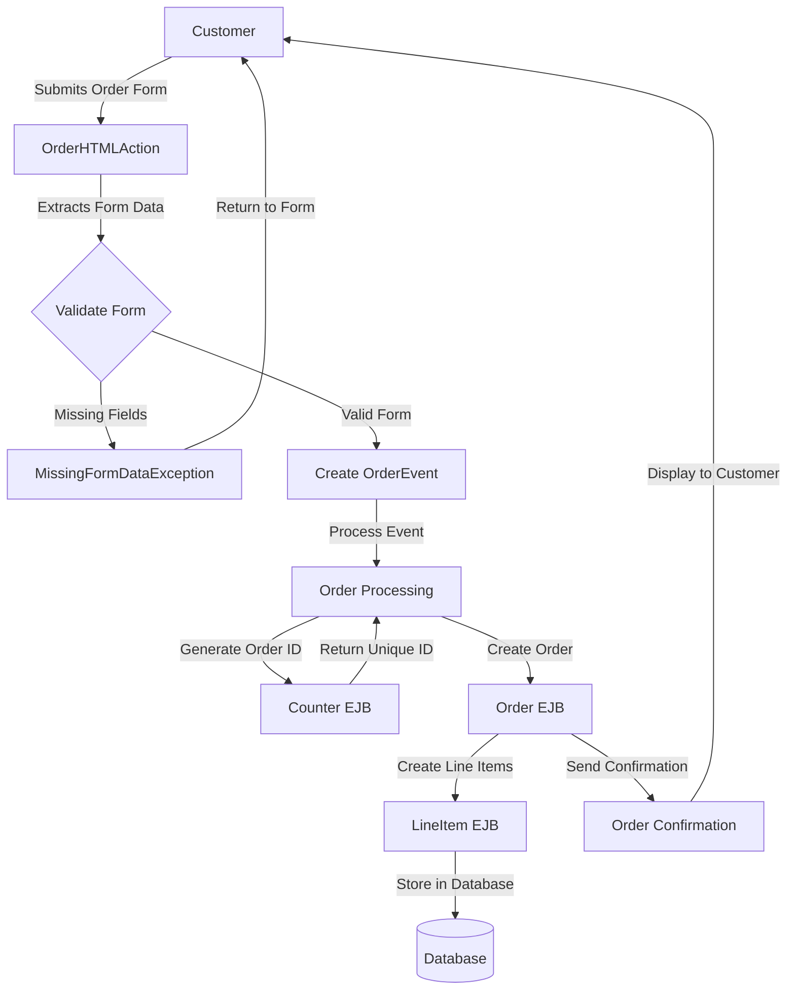
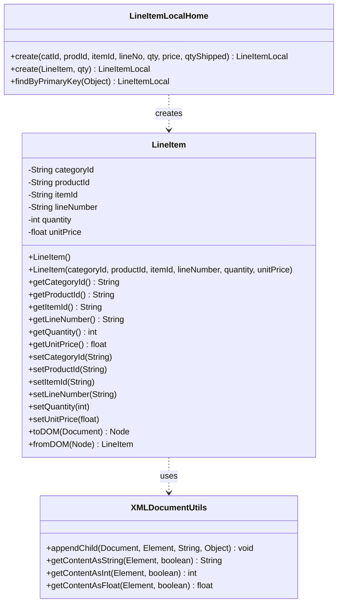
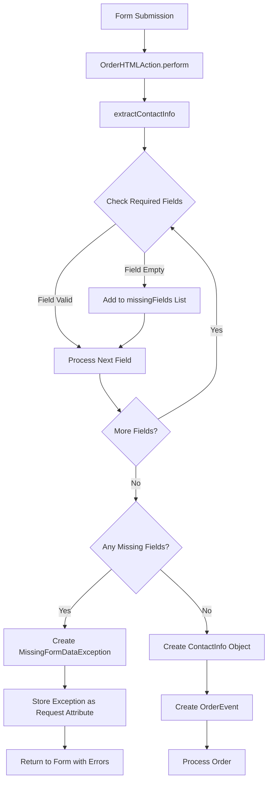
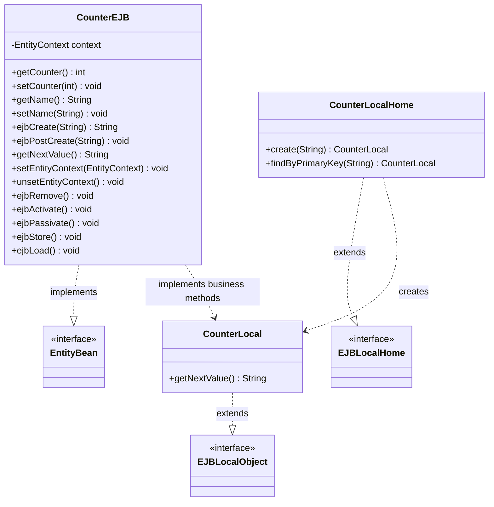

# Order Entry in Java Pet Store 1.3.2

## Order Entry Overview

The order entry process in Java Pet Store represents a critical workflow in the e-commerce application, serving as the bridge between customer shopping activities and backend fulfillment processes. This subsystem handles the collection, validation, and processing of customer order information, transforming user inputs into persistent order entities. The architecture follows a multi-tier approach consistent with J2EE design patterns, separating presentation logic from business rules and data persistence. Key components include the OrderHTMLAction controller that processes form submissions, validation mechanisms to ensure data integrity, LineItem entities that represent individual products in an order, and the Counter service that generates unique identifiers. The order entry process integrates with other subsystems including the shopping cart, inventory management, and customer profile services, employing both synchronous processing for immediate user feedback and asynchronous mechanisms for backend order fulfillment tasks.

## Order Entry Workflow

The order entry workflow begins when a customer submits an order form containing shipping and billing information. The OrderHTMLAction controller processes this submission by extracting contact information and validating required fields. If validation fails, a MissingFormDataException is thrown, redirecting the customer back to the form with error messages. When validation succeeds, an OrderEvent is created containing shipping, receiving, and payment details.

The event is then processed by the order processing subsystem, which uses the Counter EJB to generate a unique order identifier. This ensures each order has a system-wide unique reference. The order processing component then creates an Order entity and associated LineItem entities representing the products being purchased. These entities are persisted to the database through their respective EJBs.

Once the order is successfully stored, a confirmation is generated and displayed to the customer, completing the initial order entry process. Subsequent asynchronous processing handles inventory updates and fulfillment workflows.

## Line Item Management

Line items represent the individual products within an order in the Java Pet Store application. Each line item encapsulates essential information about a specific product being purchased, including its hierarchical categorization (categoryId, productId, itemId), position in the order (lineNumber), quantity requested, and unit price. This structured approach allows the system to maintain detailed records of each product in an order while supporting various business operations such as inventory management, pricing calculations, and order fulfillment.

The LineItem implementation follows a value object pattern, providing immutability after creation while supporting XML serialization for persistence and data exchange. This design enables line items to be efficiently transferred between application tiers and persisted in the database. The LineItem class includes comprehensive getters and setters for all properties, allowing for flexible manipulation during the order creation process.

Line items are managed as a collection within an order, with each item maintaining its own state independent of other items. This separation of concerns simplifies order processing logic, as individual line items can be processed, updated, or removed without affecting the entire order. The system also supports quantity adjustments and price calculations at the line item level, providing granular control over order details.

## Line Item Data Structure

The LineItem class serves as the core data structure for representing individual items within an order. It maintains a comprehensive set of attributes that identify the product (categoryId, productId, itemId), specify its position in the order (lineNumber), and capture commercial details (quantity, unitPrice). This structure enables precise tracking of each product in an order while supporting various business operations.

A key feature of the LineItem implementation is its XML serialization capability. The class provides toDOM() and fromDOM() methods that convert between Java objects and XML document representations. This functionality is critical for data persistence and exchange across system boundaries. The toDOM() method constructs a DOM node containing all LineItem properties, while the static fromDOM() factory method parses an XML node to recreate a LineItem object. These methods leverage the XMLDocumentUtils helper class to handle the complexities of DOM manipulation.

The LineItem is managed through the LineItemLocalHome interface, which provides methods for creating and finding LineItem entities. The interface offers two creation methods: one that accepts individual parameters and another that takes a LineItem object with quantity. This flexibility supports different creation scenarios within the application. The EJB container manages the persistence of LineItem entities, ensuring data integrity and transaction safety during order processing.

## Order Form Processing

The order form processing in Java Pet Store represents a critical interaction point where customer input is transformed into structured order data. This process begins when a customer submits the order form containing shipping and billing information. The OrderHTMLAction class serves as the controller that handles this HTTP request, extracting form parameters and organizing them into domain objects.

The form processing logic follows a clear separation of concerns, with dedicated methods for extracting different types of information. The extractContactInfo() method parses address form fields (with suffixes to distinguish between shipping and billing addresses) and constructs ContactInfo objects containing structured address data. This approach allows the system to maintain clean domain objects while handling the complexities of form data extraction.

Once the form data is extracted, the system creates an OrderEvent containing the shipping information, receiving information, and credit card details. This event is then dispatched to the appropriate event handlers in the business tier, which process the order further. The event-driven architecture allows for loose coupling between the web tier and the business logic, making the system more maintainable and extensible.

The order form processing also includes mechanisms for maintaining state across HTTP requests. The doEnd() method stores the order response in the request attributes, making it available to the JSP page that renders the order confirmation. This approach ensures that users receive immediate feedback about their order submission while the system handles the processing asynchronously.

## Form Validation and Error Handling

Form validation in the Java Pet Store's order entry system implements a comprehensive approach to ensure data integrity before processing customer orders. The validation logic primarily focuses on required field checking, with the OrderHTMLAction class performing this validation during form submission processing. Each required field is checked for emptiness, and missing fields are tracked in an ArrayList to provide detailed feedback to users.

The validation process is methodical, examining each form field individually and building a collection of validation errors when necessary. This approach allows the system to identify all missing fields in a single validation pass rather than stopping at the first error, providing a better user experience by showing all issues at once. The validation logic is particularly thorough for address information, checking essential fields like name, street address, city, state/province, postal code, and telephone number.

Error handling is implemented through a custom exception hierarchy, with MissingFormDataException serving as the primary mechanism for reporting validation failures. This exception extends HTMLActionException and implements Serializable, allowing it to be passed between different application tiers. When validation fails, the exception stores both an error message and the collection of missing field names, providing context-rich information for error reporting.

The system's error handling approach follows the principle of early detection and clear communication. Validation errors are caught at the controller level, preventing invalid data from reaching the business tier. The exception is stored as a request attribute using a predefined key (PetstoreKeys.MISSING_FORM_DATA_EXCEPTION_KEY), making it accessible to the view layer. This allows JSP pages to extract the missing fields and present appropriate error messages to the user, guiding them to correct the form data.

## Form Validation Process

The form validation process begins when a customer submits an order form, triggering the OrderHTMLAction.perform() method. This initiates a systematic validation workflow that ensures all required data is present before proceeding with order creation.

The core validation occurs in the extractContactInfo() method, which processes form fields with specific suffixes to distinguish between shipping and billing addresses. For each required field (family name, given name, address line 1, city, state/province, postal code, telephone), the method checks if the value is empty after trimming whitespace. When a missing field is detected, it's added to an ArrayList of missingFields, allowing the system to collect all validation errors in a single pass.

After checking all fields, the validation logic evaluates whether any required fields were missing. If missingFields is not null, indicating validation failures, the system creates a MissingFormDataException containing both an error message and the collection of missing field names. This exception is stored as a request attribute using PetstoreKeys.MISSING_FORM_DATA_EXCEPTION_KEY, making it accessible to the view layer for error display.

When validation succeeds (missingFields remains null), the method constructs Address and ContactInfo objects from the validated form data. These objects are then used to create an OrderEvent, which continues through the order processing workflow. This validation approach ensures data integrity while providing clear feedback to users when corrections are needed.

## Unique Identifier Generation

The Java Pet Store application implements a robust system for generating unique identifiers through the Counter component, which is essential for creating distinct order IDs and other entity identifiers throughout the application. This component follows a simple yet effective approach to sequential ID generation, ensuring uniqueness across the distributed application environment.

The Counter component is implemented as an Entity EJB with container-managed persistence (CMP), providing transactional integrity and persistence for the counter values. Each counter instance is associated with a name prefix that identifies its purpose (e.g., "ORDER" for order IDs), and maintains a numeric value that is incremented each time a new identifier is requested. This design allows the application to maintain multiple independent counters for different entity types.

The core functionality is provided by the getNextValue() method, which atomically increments the counter and returns a concatenated string of the name prefix and the new counter value. This atomic operation is crucial for preventing duplicate IDs in a multi-threaded environment. The EJB container ensures that concurrent requests are properly serialized, maintaining the integrity of the sequence.

The Counter component is accessed through a local interface (CounterLocal), which exposes only the getNextValue() method to clients. This encapsulation hides the implementation details and provides a clean API for ID generation. The component is typically accessed during the order creation process, where it generates a unique order ID that is then associated with the new order entity.

This approach to ID generation offers several advantages: it's simple to implement and understand, provides guaranteed uniqueness within a single application instance, and leverages the transactional capabilities of the EJB container to ensure consistency. The use of string concatenation also allows for human-readable IDs that include meaningful prefixes, making debugging and support easier.

## Counter Component Architecture

The Counter component architecture follows the standard EJB entity bean pattern, providing a robust solution for generating unique sequential identifiers in the Java Pet Store application. This diagram illustrates the key classes and their relationships within the component.

At the core of the architecture is the CounterEJB class, which implements the javax.ejb.EntityBean interface. This class uses Container-Managed Persistence (CMP) to maintain two essential fields: a name that serves as a prefix for the generated IDs and a counter value that is incremented with each request. The EJB container automatically handles the persistence of these fields, ensuring data integrity across transactions.

The component exposes its functionality through the CounterLocal interface, which extends javax.ejb.EJBLocalObject. This interface defines a single business method, getNextValue(), which clients call to obtain a new unique identifier. The implementation in CounterEJB atomically increments the counter and returns a concatenated string of the name and the new counter value.

The CounterLocalHome interface extends javax.ejb.EJBLocalHome and provides factory methods for creating and finding Counter instances. The create() method initializes a new Counter with a specified name and a counter value of zero, while findByPrimaryKey() retrieves an existing Counter by its name. This allows different parts of the application to maintain separate counters for different entity types.

When a client needs a unique identifier (such as during order creation), it obtains a reference to the appropriate Counter through JNDI lookup, then calls getNextValue() to generate a new ID. The EJB container ensures that these operations are thread-safe and transactional, preventing duplicate IDs even in a concurrent environment.

## Order Event Processing

The order event processing system in Java Pet Store represents a sophisticated implementation of the event-driven architecture pattern, specifically designed to handle the complex workflow of order creation and management. When a customer submits an order form, the OrderHTMLAction controller processes the form data and transforms it into an OrderEvent object, which encapsulates all the necessary information for order processing, including shipping details, billing information, and payment data.

This event-driven approach provides several architectural benefits. First, it decouples the web tier from the business logic, allowing each to evolve independently. The web controller doesn't need to know how orders are processed; it simply creates an event with the appropriate data and dispatches it to the event handling system. Second, it enables asynchronous processing of orders, which is crucial for handling potentially time-consuming operations like inventory checks, payment processing, and fulfillment notifications without blocking the user interface.

The OrderEvent contains structured data objects rather than raw form parameters, including ContactInfo objects for shipping and receiving addresses and a CreditCard object for payment details. This approach ensures that the event carries well-formed, validated data that can be directly used by business components without additional parsing or validation.

Once created, the OrderEvent is processed by the event handling system, which routes it to the appropriate event handlers based on the event type. These handlers implement the business logic for order processing, including generating a unique order ID using the Counter component, creating Order and LineItem entities, updating inventory, and initiating the fulfillment process.

The event processing system also supports transaction management, ensuring that all operations related to order creation either complete successfully or roll back entirely. This transactional behavior is crucial for maintaining data consistency, especially when multiple database updates are involved in processing an order.

## XML Integration in Order Processing

XML plays a pivotal role in the Java Pet Store's order processing system, serving as a standardized format for data representation, persistence, and exchange between components. The LineItem class exemplifies this integration, providing comprehensive XML serialization and deserialization capabilities through its toDOM() and fromDOM() methods. These methods enable the transformation of Java objects into XML document structures and vice versa, facilitating seamless data exchange across system boundaries.

The XML representation follows a well-defined structure, with element names and attributes declared as constants in the LineItem class (XML_LINEITEM, XML_CATEGORYID, XML_PRODUCTID, etc.). This approach ensures consistency in the XML schema throughout the application. The class also defines DTD identifiers (DTD_PUBLIC_ID and DTD_SYSTEM_ID) that can be used for XML validation, ensuring that documents conform to the expected structure.

For XML manipulation, the system leverages the XMLDocumentUtils helper class, which provides methods for creating XML elements, setting their content, and extracting values of various types (string, integer, float) from XML nodes. This abstraction simplifies the XML handling code in the LineItem class, making it more maintainable and less prone to errors.

The XML integration extends beyond simple data representation to support various aspects of order processing. When orders are persisted, their line items are serialized to XML format, allowing for efficient storage and retrieval. XML is also used for data exchange between distributed components, enabling loose coupling between the order processing subsystem and other parts of the application.

Furthermore, the XML-based approach facilitates integration with external systems. Orders can be exported in XML format for processing by partner systems, and incoming orders from external sources can be parsed and converted to internal objects. This interoperability is essential for supporting B2B scenarios where the Pet Store might need to exchange order data with suppliers or fulfillment partners.

[Generated by the Sage AI expert workbench: 2025-03-29 21:37:00  https://sage-tech.ai/workbench]: #