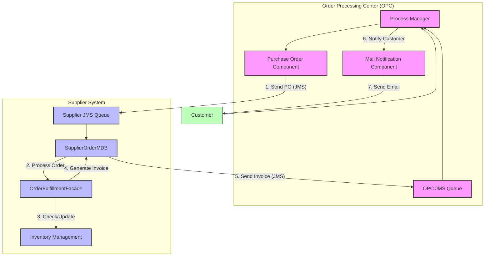
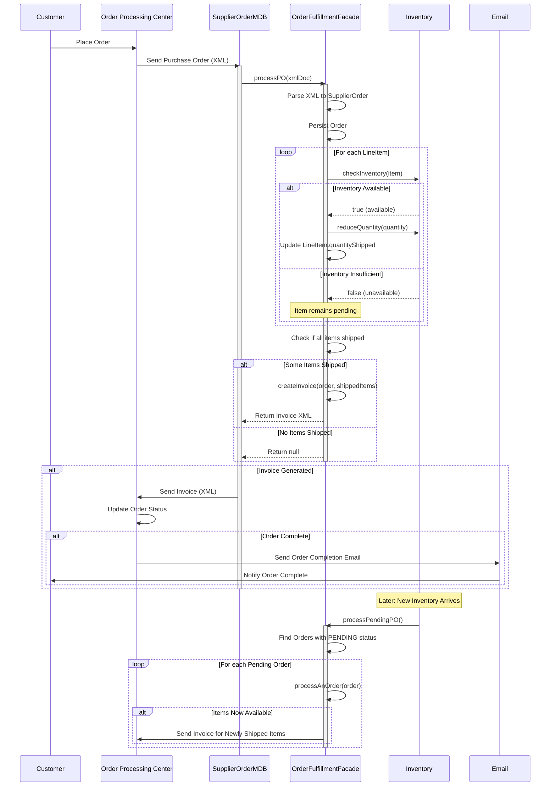
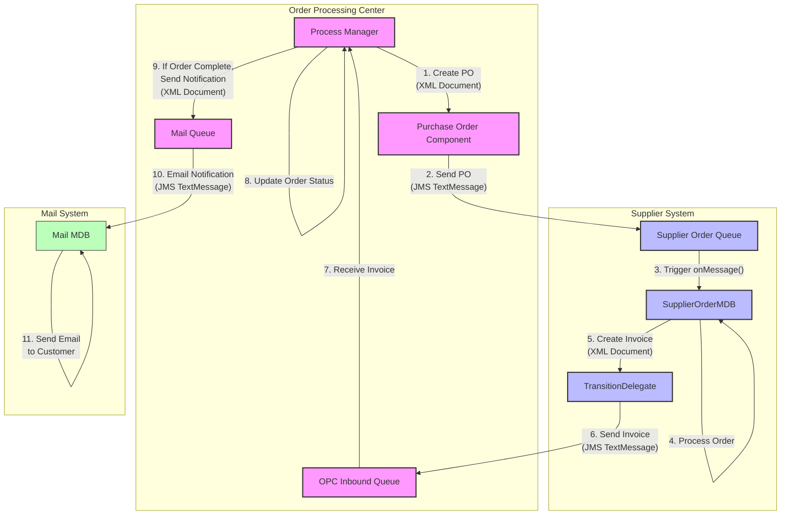
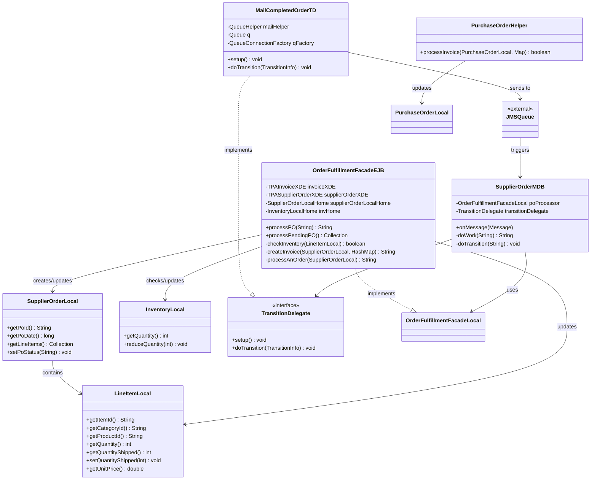

# Order Fulfillment in Java Pet Store

## Order Fulfillment Overview

Order fulfillment in the Java Pet Store represents a critical business process that bridges the gap between customer order placement and physical delivery of products. This process encompasses multiple components working together to manage the flow of purchase orders, inventory allocation, shipping, and customer notification. The order fulfillment system is designed as a distributed architecture where the Order Processing Center (OPC) communicates with Supplier components through asynchronous messaging. This approach enables loose coupling between components, allowing for scalability and resilience in handling varying order volumes. The fulfillment process begins when a customer order is received by the OPC, which then creates purchase orders for suppliers. Suppliers process these orders by checking inventory, shipping available items, and generating invoices that are sent back to the OPC. Once all items in an order are fulfilled, the customer is notified of the completed order. This architecture demonstrates J2EE best practices for enterprise application design, particularly in handling complex business processes across distributed systems.

## Order Fulfillment Architecture



The diagram illustrates the high-level architecture of the order fulfillment system in Java Pet Store. The process begins with the Order Processing Center (OPC) which manages customer orders and generates purchase orders for suppliers. These purchase orders are sent via JMS messaging to the Supplier system, where the SupplierOrderMDB receives and processes them through the OrderFulfillmentFacade. The facade checks inventory availability and allocates items to orders when possible. For items that can be shipped, the supplier generates invoices which are sent back to the OPC via JMS. When the OPC receives these invoices, it updates the order status and, when all items are fulfilled, notifies the customer via email through the Mail Notification Component. This architecture demonstrates a clean separation of concerns between order processing and fulfillment, with asynchronous messaging enabling loose coupling between the OPC and Supplier components.

## Purchase Order Processing

The purchase order processing in Java Pet Store begins when the Order Processing Center (OPC) sends a purchase order to the supplier system via JMS messaging. This XML-formatted purchase order is received by the SupplierOrderMDB, a message-driven bean that acts as the entry point for supplier order processing. The SupplierOrderMDB's onMessage() method extracts the purchase order XML from the JMS message and delegates processing to the OrderFulfillmentFacade through its processPO() method.

The OrderFulfillmentFacade serves as the central component for order processing, implementing a two-phase approach. First, it persists the purchase order by converting the XML document into a SupplierOrder entity using the TPASupplierOrderXDE XML document handler and creating a corresponding database record. This ensures that the order is safely stored before any fulfillment attempts are made.

In the second phase, the facade attempts to fulfill the order by checking inventory availability for each line item. The OrderFulfillmentFacadeEJB's processAnOrder() method iterates through each line item in the purchase order, verifying if sufficient inventory exists through the checkInventory() method. For items with available inventory, the system reduces the inventory quantity and marks the line item as shipped by updating its quantityShipped attribute. This approach allows for partial order fulfillment when only some items are available in inventory.

The SupplierOrderMDB then evaluates the results of the order processing. If any items were shipped, it triggers the creation of an invoice and sends it back to the OPC through the JMS-based transition delegate mechanism. This asynchronous communication pattern ensures that the supplier system can process orders efficiently without waiting for responses from the OPC.

## Inventory Management

Inventory management in the Java Pet Store's order fulfillment system is primarily handled by the OrderFulfillmentFacadeEJB component within the supplier application. This component implements a sophisticated approach to inventory checking and allocation that supports both immediate fulfillment and deferred processing of orders when inventory is insufficient.

When a purchase order is received, the OrderFulfillmentFacadeEJB's checkInventory() method is called for each line item to determine if sufficient inventory exists. This method attempts to locate the requested item in the inventory database using the InventoryLocalHome interface. If the item is found and has sufficient quantity, the inventory is reduced by the requested amount through the reduceQuantity() method, and the line item is marked as available for shipping.

A key design aspect of the inventory management system is its ability to handle partial fulfillment. The system does not require all items in an order to be available before processing; instead, it ships what is available and keeps track of unfulfilled items. This is implemented in the processAnOrder() method, which maintains a HashMap of items that can be shipped and updates the quantityShipped attribute of each LineItemLocal entity accordingly.

For items that cannot be fulfilled immediately due to inventory shortages, the system maintains the purchase order in a PENDING status. When new inventory arrives, the processPendingPO() method can be called to attempt fulfillment of these pending orders. This method retrieves all orders with PENDING status using the findOrdersByStatus() method of the SupplierOrderLocalHome interface and attempts to process each one with newly available inventory.

The inventory management system also handles edge cases gracefully. For example, if an item is not found in inventory (resulting in a FinderException), the checkInventory() method silently handles this exception and returns false, indicating the item cannot be fulfilled. This approach allows the system to continue processing other line items without disruption.

## Order Fulfillment Workflow



The sequence diagram illustrates the complete order fulfillment workflow in the Java Pet Store application. The process begins when a customer places an order, which is received by the Order Processing Center (OPC). The OPC creates a purchase order in XML format and sends it to the supplier via JMS messaging.

The SupplierOrderMDB receives this message and delegates to the OrderFulfillmentFacade, which first persists the order and then attempts to fulfill it. For each line item, the facade checks inventory availability. If inventory is sufficient, it reduces the inventory quantity and marks the item as shipped; otherwise, the item remains pending.

After processing all line items, the facade determines if any items were shipped. If so, it creates an invoice XML document containing details of the shipped items and returns it to the SupplierOrderMDB, which then sends this invoice back to the OPC. If no items could be shipped, no invoice is generated at this time.

When the OPC receives an invoice, it updates the order status. If all items in the order have been fulfilled, the OPC triggers an email notification to the customer through the MailCompletedOrderTD transition delegate.

The diagram also shows how pending orders are handled when new inventory arrives. The system calls the processPendingPO() method, which retrieves all pending orders and attempts to fulfill them with the newly available inventory. If any items can now be shipped, new invoices are generated and sent to the OPC.

This workflow demonstrates the system's ability to handle both immediate and deferred fulfillment, ensuring that customers receive their orders as quickly as inventory allows while maintaining accurate order status information throughout the process.

## Invoice Generation

The invoice generation process in the Java Pet Store's order fulfillment system is a critical step that documents the items shipped to customers and provides a formal record of the transaction. This process is primarily handled by the OrderFulfillmentFacadeEJB class, which creates structured XML invoices when orders are fulfilled.

When items from a purchase order are available in inventory and can be shipped, the OrderFulfillmentFacadeEJB's createInvoice() method is called to generate an XML invoice document. This method uses the TPAInvoiceXDE (XML Document Exchange) utility to construct a well-formed XML document according to the Trading Partner Agreement (TPA) specifications. The invoice generation follows a systematic approach:

1. A new XML document is initialized using the invoiceXDE.newDocument() method.
2. Order metadata is populated, including the order ID (poId), customer information, original order date, and the current shipping date.
3. The method iterates through all line items in the purchase order, but only includes those that are actually being shipped in the current fulfillment batch (tracked in the newLis HashMap).
4. For each shipped item, detailed information is added to the invoice including category ID, product ID, item ID, line number, quantity, and unit price.
5. Finally, the complete XML document is serialized to a string using the getDocumentAsString() method.

The resulting invoice XML document serves multiple purposes in the system:
- It provides confirmation to the OPC that items have been shipped
- It contains the necessary details for updating the order status in the OPC
- It serves as the basis for customer notifications about shipped items
- It creates an audit trail of fulfilled orders

The XML structure of the invoice follows a standardized format that can be validated against an XML schema, ensuring consistency and interoperability. The validation settings are configured through JNDI parameters, allowing for flexible configuration without code changes. This approach to invoice generation demonstrates the application's use of XML as a data exchange format between loosely coupled components in a distributed system.

## Asynchronous Communication

Asynchronous communication is a cornerstone of the Java Pet Store's order fulfillment architecture, enabling loose coupling between the Order Processing Center (OPC) and Supplier components. This design pattern is implemented through Java Message Service (JMS), which allows these components to communicate reliably without requiring immediate responses or direct connections.

The asynchronous communication flow begins when the OPC needs to send a purchase order to a supplier. Instead of making a direct method call, the OPC serializes the purchase order as an XML document and sends it as a JMS message to a designated supplier queue. This allows the OPC to continue processing other orders without waiting for the supplier to respond.

On the supplier side, the SupplierOrderMDB (Message-Driven Bean) listens for messages on the queue. When a purchase order message arrives, the onMessage() method is triggered, which extracts the XML content and processes it through the OrderFulfillmentFacade. This design pattern follows the Observer pattern, where the MDB observes the message queue and reacts when new messages arrive.

After processing the order and shipping available items, the supplier needs to notify the OPC. Again, this is done asynchronously through JMS. The SupplierOrderMDB uses a TransitionDelegate (configured through JNDI) to send an invoice XML document back to the OPC's queue. The TransitionDelegate pattern provides a flexible way to handle different types of transitions in the business process without hardcoding the communication mechanism.

Similarly, when the OPC needs to notify customers about completed orders, it uses the MailCompletedOrderTD transition delegate to send email notifications asynchronously. This delegate also uses JMS to communicate with a mail service, which handles the actual email delivery.

This asynchronous approach provides several benefits:
1. Improved scalability by allowing components to process messages at their own pace
2. Enhanced reliability through JMS's guaranteed message delivery
3. Better fault tolerance, as temporary failures in one component don't block others
4. Simplified system evolution, as components can be modified independently

The use of XML as the message format further enhances this loose coupling by providing a standardized, self-describing data format that can evolve over time without breaking compatibility.

## Message Flow Between Components



The diagram illustrates the message flow between components in the Java Pet Store's order fulfillment system, highlighting how JMS messaging enables asynchronous communication between distributed components.

The process begins in the Order Processing Center (OPC) where the Process Manager creates a purchase order as an XML document. This document is then sent as a JMS TextMessage to the Supplier Order Queue. The use of JMS queues ensures reliable message delivery even if the supplier system is temporarily unavailable.

When a message arrives in the Supplier Order Queue, it triggers the SupplierOrderMDB's onMessage() method. This message-driven bean processes the purchase order by checking inventory and fulfilling available items. For items that can be shipped, the MDB creates an invoice XML document and uses a TransitionDelegate to send it back to the OPC's Inbound Queue as another JMS TextMessage.

The OPC Process Manager receives the invoice message and updates the order status accordingly. If all items in an order have been fulfilled, the Process Manager creates a notification message and sends it to the Mail Queue. The Mail MDB then processes this message and sends an email notification to the customer.

This message flow demonstrates several key architectural patterns:
1. The use of XML documents as the payload for JMS messages provides a structured, self-describing format for data exchange
2. JMS queues provide asynchronous, reliable communication between components
3. Message-driven beans act as observers that react to incoming messages
4. TransitionDelegates abstract the messaging details from the business logic
5. The entire flow is decoupled, allowing each component to process messages at its own pace

This architecture enables the system to handle high volumes of orders efficiently while maintaining loose coupling between components, making the system more resilient and easier to maintain.

## Customer Notification

Customer notification is the final step in the order fulfillment process, ensuring that customers are informed when their orders have been completely fulfilled. This critical communication is handled by the MailCompletedOrderTD (Mail Completed Order Transition Delegate) component within the Order Processing Center (OPC).

The notification process begins when the OPC determines that all items in a customer's order have been shipped. This determination is made by the PurchaseOrderHelper class, which tracks the status of each line item in an order. When the processInvoice() method returns true, indicating that all items have been shipped, the OPC triggers the customer notification workflow.

The MailCompletedOrderTD class implements the TransitionDelegate interface, which is part of the process management framework used throughout the application. This design allows the notification mechanism to be plugged into the overall workflow without tight coupling to other components. The delegate is responsible for sending an XML message containing order details to a mail service that will generate and send the actual email to the customer.

During initialization, the setup() method of MailCompletedOrderTD obtains the necessary JMS resources through the ServiceLocator pattern:

```java
public void setup() throws TransitionException {
  try {
    ServiceLocator serviceLocator = new ServiceLocator();
    qFactory = serviceLocator.getQueueConnectionFactory(JNDINames.QUEUE_CONNECTION_FACTORY);
    q = serviceLocator.getQueue(JNDINames.MAIL_SENDER_QUEUE);
    mailHelper = new QueueHelper(qFactory, q);
  } catch (ServiceLocatorException se) {
    throw new TransitionException(se);
  }
}
```

When an order is completed, the doTransition() method is called with a TransitionInfo object containing the XML message to be sent:

```java
public void doTransition(TransitionInfo info) throws TransitionException {
  String xmlMail = info.getXMLMessage();
  try {
    if (xmlMail != null) {
      mailHelper.sendMessage(xmlMail);
    }
  } catch (JMSException je) {
    throw new TransitionException(je);
  }
}
```

This method sends the XML message to the mail queue using the QueueHelper utility class. The message contains all the necessary information about the order, including customer contact information, order details, and shipping information.

The asynchronous nature of this notification system allows the OPC to continue processing other orders without waiting for the email to be sent. It also provides a clean separation of concerns, with the mail service handling the complexities of email formatting and delivery while the OPC focuses on order processing.

## Handling Pending Orders

The Java Pet Store's order fulfillment system implements a sophisticated approach to handling pending orders—those that cannot be immediately fulfilled due to inventory shortages. This capability is crucial for maintaining customer satisfaction while efficiently managing inventory constraints.

When a purchase order is received by the supplier, the OrderFulfillmentFacadeEJB attempts to fulfill it by checking inventory availability for each line item. If some items are unavailable, the system ships what it can and keeps the order in a PENDING status. This partial fulfillment approach ensures that customers receive available items promptly rather than waiting for complete inventory availability.

The key to managing pending orders lies in the OrderFulfillmentFacadeEJB's processPendingPO() method:

```java
public Collection processPendingPO() throws FinderException {
  ArrayList invoices = new ArrayList();
  Collection coll = supplierOrderLocalHome.findOrdersByStatus(OrderStatusNames.PENDING);
  if(coll != null) {
    Iterator it = coll.iterator();
    while((it!=null) && (it.hasNext())) {
      SupplierOrderLocal order = (SupplierOrderLocal) it.next();
      String newInvoice = null;
      try {
        newInvoice = processAnOrder(order);
      } catch (XMLDocumentException xe) {
        System.out.println("OrderFulfillmentFacade:" + xe);
      }
      if(newInvoice != null) {
        invoices.add(newInvoice);
      }
    }
  }
  return invoices;
}
```

This method is designed to be called when new inventory becomes available, typically triggered by inventory management processes. It retrieves all orders with PENDING status using the findOrdersByStatus() method of the SupplierOrderLocalHome interface. For each pending order, it attempts to process it again using the same processAnOrder() method used for new orders.

If items that were previously unavailable can now be fulfilled, the method generates new invoices for these items and returns them as a collection. These invoices are then sent back to the OPC through the same messaging channels used for regular order fulfillment.

The system's design for handling pending orders demonstrates several advanced architectural patterns:

1. **State Management**: Orders maintain a status (PENDING or COMPLETED) that drives processing behavior
2. **Idempotent Processing**: The processAnOrder() method can be called multiple times on the same order without negative effects
3. **Incremental Fulfillment**: Orders can be fulfilled in multiple batches as inventory becomes available
4. **Event-Driven Architecture**: New inventory arrival triggers reprocessing of pending orders

This approach to handling pending orders ensures that the system can adapt to inventory fluctuations while maintaining accurate order status information and providing customers with their items as quickly as possible.

## Component Interaction



The component interaction diagram illustrates the complex relationships between the various EJBs, message-driven beans, and other components involved in the order fulfillment process of the Java Pet Store application.

At the heart of the supplier system is the SupplierOrderMDB, which acts as the entry point for purchase orders received via JMS. This message-driven bean delegates the business logic of order processing to the OrderFulfillmentFacadeEJB through its local interface (OrderFulfillmentFacadeLocal). The facade is responsible for the core order fulfillment operations, including persisting orders, checking inventory, and generating invoices.

The OrderFulfillmentFacadeEJB interacts with several entity beans: SupplierOrderLocal for order data, LineItemLocal for order line items, and InventoryLocal for inventory management. When processing orders, it checks inventory availability for each line item and updates both the inventory levels and the line item's shipped quantity accordingly.

For communication back to the Order Processing Center, the SupplierOrderMDB uses a TransitionDelegate, which provides an abstraction layer for the messaging infrastructure. This delegate is responsible for sending invoices as JMS messages to the OPC.

On the OPC side, the PurchaseOrderHelper class processes incoming invoices by updating the shipped quantities of line items and determining if an order is completely fulfilled. When an order is complete, the MailCompletedOrderTD (which also implements the TransitionDelegate interface) is used to send email notifications to customers.

This component architecture demonstrates several enterprise design patterns:
1. **Message-Driven Architecture**: Using JMS and MDBs for asynchronous processing
2. **Facade Pattern**: OrderFulfillmentFacadeEJB simplifies the complex order processing logic
3. **Strategy Pattern**: TransitionDelegate allows for different communication strategies
4. **Entity-Control-Boundary Pattern**: Clear separation between entity beans, control logic, and boundary interfaces
5. **Data Transfer Objects**: XML documents serve as DTOs between components

The interactions between these components enable a flexible, scalable order fulfillment system that can handle complex business scenarios like partial order fulfillment and pending order management.

## Order Fulfillment Architecture Patterns

The order fulfillment system in Java Pet Store 1.3.2 exemplifies several sophisticated architectural patterns that contribute to its flexibility, maintainability, and scalability. These patterns represent best practices in J2EE application design and demonstrate how complex business processes can be effectively implemented in enterprise applications.

**Facade Pattern**: The OrderFulfillmentFacadeEJB serves as a classic implementation of the Facade pattern, providing a simplified interface to the complex subsystem of order processing. This facade encapsulates the interactions between multiple components (inventory management, order persistence, invoice generation) behind a clean, cohesive API with methods like processPO() and processPendingPO(). This pattern reduces coupling between the client (SupplierOrderMDB) and the subsystems it uses, making the system more maintainable and easier to evolve.

**Service Locator Pattern**: Throughout the order fulfillment components, the ServiceLocator class is used to obtain references to resources like EJBs, JMS queues, and configuration parameters. This pattern centralizes the complex JNDI lookup logic and provides caching capabilities, improving performance and reducing redundant code. For example, in MailCompletedOrderTD's setup() method, the ServiceLocator is used to obtain JMS resources:

```java
ServiceLocator serviceLocator = new ServiceLocator();
qFactory = serviceLocator.getQueueConnectionFactory(JNDINames.QUEUE_CONNECTION_FACTORY);
q = serviceLocator.getQueue(JNDINames.MAIL_SENDER_QUEUE);
```

**TransitionDelegate Pattern**: The system uses a custom TransitionDelegate pattern to abstract the communication mechanisms between components. This pattern allows the business logic to trigger transitions in the workflow without being coupled to the specific communication technology (JMS in this case). The MailCompletedOrderTD and the delegate used by SupplierOrderMDB both implement this pattern, allowing for flexible communication strategies that could be changed without affecting the core business logic.

**Message-Driven Architecture**: The use of JMS messaging and Message-Driven Beans (MDBs) like SupplierOrderMDB implements an asynchronous, message-driven architecture. This pattern decouples the timing of operations between components, allowing them to operate at their own pace and improving system resilience.

**Two-Phase Commit Pattern**: The order fulfillment process implements a form of the two-phase commit pattern, particularly in the OrderFulfillmentFacadeEJB. First, it persists the purchase order, ensuring it's safely stored. Only then does it attempt to fulfill the order by checking and updating inventory. This approach ensures that orders are never lost, even if fulfillment cannot happen immediately.

**Partial Processing Pattern**: The system handles partial order fulfillment through a pattern where it processes what it can now and defers the rest for later. This is evident in the checkInventory() method that silently handles FinderExceptions and in the processPendingPO() method that reprocesses orders when new inventory arrives.

**XML Document Exchange Pattern**: The system uses XML as a data exchange format between loosely coupled components. The TPAInvoiceXDE and TPASupplierOrderXDE classes implement this pattern, providing a structured way to transform business objects to and from XML documents that can be validated against schemas.

These architectural patterns work together to create a robust, flexible order fulfillment system that can handle complex business scenarios while maintaining loose coupling between components. The patterns demonstrate J2EE best practices and provide valuable insights for designing enterprise applications that can evolve over time.

[Generated by the Sage AI expert workbench: 2025-03-29 21:37:00  https://sage-tech.ai/workbench]: #