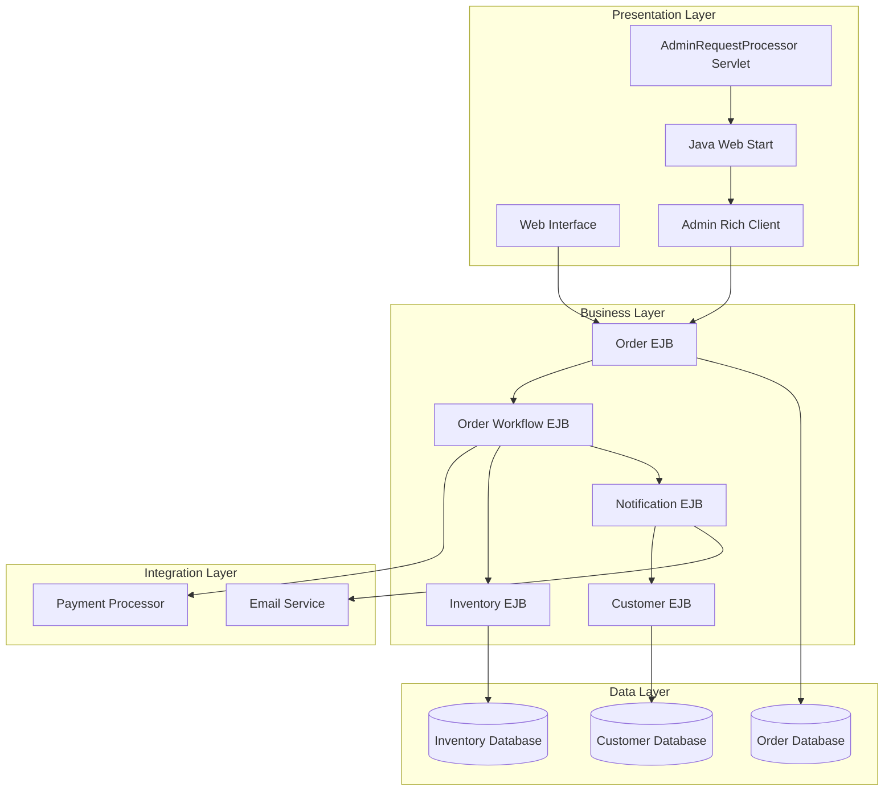
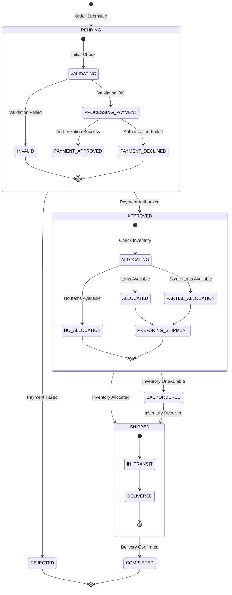
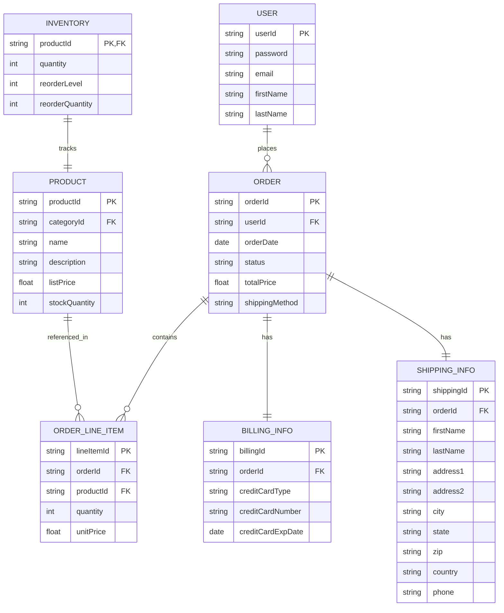
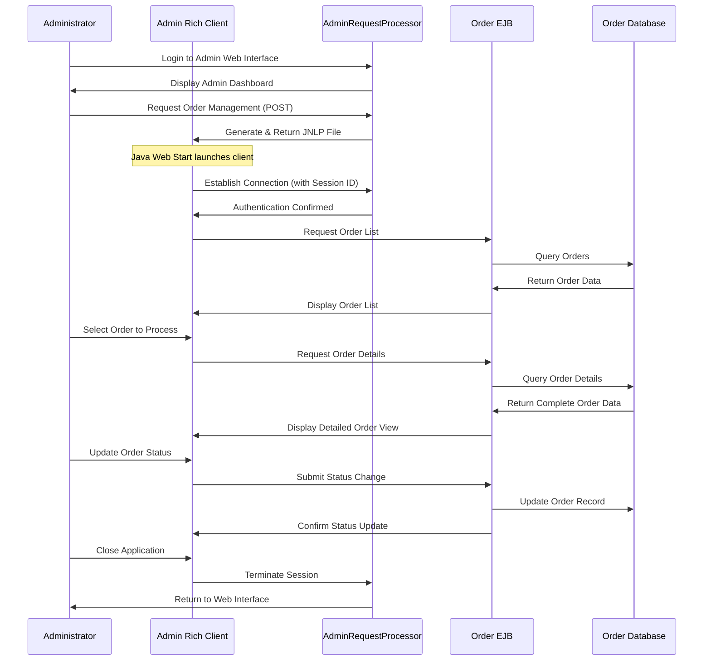

# Order Management in Java Pet Store 1.3.2

## Order Management Overview in Java Pet Store

The order management system in Java Pet Store 1.3.2 serves as a critical component of this reference e-commerce application, demonstrating best practices for handling customer transactions in enterprise J2EE applications. This system orchestrates the complete lifecycle of orders from initial submission through fulfillment, integrating multiple architectural layers including presentation, business logic, and persistence. The order management functionality showcases how J2EE technologies can be leveraged to create a robust transaction processing system that maintains data integrity while providing administrative oversight capabilities. Key components include the order processing engine, which handles validation and state transitions; the admin interface, which provides order management capabilities through a rich client application; and integration points with inventory, customer notification, and payment processing systems. The architecture demonstrates a clear separation of concerns, with distinct components handling web presentation, business logic encapsulation through EJBs, and data persistence—all working together to provide a comprehensive order management solution that exemplifies enterprise-grade design patterns.

## Order Management Architecture

The order management architecture in Java Pet Store 1.3.2 demonstrates a sophisticated multi-tiered approach to handling e-commerce transactions. The diagram illustrates the complete system architecture with clear separation between presentation, business logic, integration, and data persistence layers.

At the presentation layer, the system provides two distinct interfaces: a standard web interface for customers and an administrative interface launched through Java Web Start technology. The AdminRequestProcessor servlet serves as the entry point for administrative functions, dynamically generating JNLP files that enable the rich client application to launch with proper authentication context maintained through session ID passing.

The business layer contains the core EJBs that encapsulate order processing logic. The Order EJB serves as the primary component for order management, while the Workflow EJB orchestrates the complex state transitions throughout the order lifecycle. Supporting EJBs handle customer information, inventory updates, and notification services. This architecture demonstrates the J2EE best practice of using stateless session beans for business logic and entity beans for persistent data representation.

The integration layer connects the order management system with external services such as payment processing and email notification systems, while the data layer provides persistent storage for orders, inventory, and customer information. This comprehensive architecture enables the system to maintain transactional integrity while supporting both customer-facing and administrative order management functions.

## Admin Interface for Order Management

The AdminRequestProcessor servlet represents a sophisticated entry point for the Java Pet Store's order management administrative interface. This servlet exemplifies the bridge pattern between web-based authentication and rich client functionality, enabling administrators to manage orders through a dedicated Java application while maintaining security context. The servlet's primary function is to dynamically generate JNLP (Java Network Launch Protocol) files that instruct Java Web Start to download and execute the administrative client application with proper authentication credentials. When an administrator selects the "manageorders" function, the servlet constructs a JNLP document containing application resources, server connection parameters, and—critically—the HTTP session ID that authenticates the rich client against the existing web session. This elegant approach solves the complex problem of maintaining authentication state between web and desktop environments without requiring re-authentication. The implementation demonstrates advanced J2EE security practices by leveraging the servlet container's session management while extending its reach to a rich client application. The AdminRequestProcessor also handles the complete lifecycle of administrative sessions, including logout functionality, ensuring proper resource cleanup and session invalidation when administrative tasks are complete.

## Order Processing Workflow

The order processing workflow in Java Pet Store 1.3.2 demonstrates a sophisticated implementation of enterprise transaction management patterns. The workflow begins when a customer submits an order through the web interface, triggering a validation process that checks inventory availability, payment information validity, and shipping address correctness. Once validated, the system creates an order entity with an initial "PENDING" status and assigns it a unique identifier. The workflow then progresses through a series of well-defined states managed by the OrderWorkflowEJB, which implements a state machine pattern to ensure orders follow the correct progression. Payment processing occurs asynchronously, with the system attempting to authorize the customer's credit card through an external payment gateway. Upon successful authorization, the order transitions to "APPROVED" status, triggering inventory allocation where the system decrements available stock for ordered items. If inventory is successfully allocated, the order moves to "COMPLETED" status, initiating the fulfillment process. Throughout this lifecycle, the system maintains transactional integrity using JTA (Java Transaction API) to ensure that database operations across multiple EJBs remain atomic. The workflow also includes exception handling for scenarios such as payment rejection, inventory shortages, or system failures, with appropriate compensating transactions to restore system state. At each significant state transition, the system generates notifications to both customers and administrators, providing transparency into the order's progress. This comprehensive workflow exemplifies J2EE best practices for handling complex business processes with proper transaction boundaries, state management, and integration with external systems.

## Order Lifecycle State Diagram

The Order Lifecycle State Diagram illustrates the comprehensive state machine that governs order processing in the Java Pet Store application. This state-based approach demonstrates how the system implements a robust workflow management pattern to handle the complex transitions an order undergoes from creation to completion.

The diagram reveals a hierarchical state structure, with major states (PENDING, APPROVED, SHIPPED, COMPLETED, REJECTED) containing nested substates that provide fine-grained tracking of an order's progress. This design allows the system to maintain detailed status information while presenting simplified high-level states to users and administrators.

When an order is first submitted, it enters the PENDING state where it undergoes validation and payment processing. The nested substates within PENDING track the progression through validation checks and payment authorization attempts. This granular approach enables precise error handling and recovery strategies based on exactly where in the process a failure might occur.

Once payment is authorized, the order transitions to the APPROVED state, where inventory allocation occurs. The system accounts for various inventory scenarios, including full allocation, partial allocation (leading to split shipments), or no allocation (resulting in backordering). This demonstrates how the order management system integrates with inventory control to handle real-world fulfillment challenges.

The SHIPPED state tracks the physical movement of goods from warehouse to customer, while the final COMPLETED state represents successful order fulfillment. Throughout this lifecycle, the state transitions are managed by the OrderWorkflowEJB, which enforces business rules regarding valid state transitions and ensures that orders progress through the system in a controlled, predictable manner.

This state-based architecture exemplifies enterprise-grade design patterns for complex process management, providing clear separation between the state data (persisted in the database) and the transition logic (implemented in the business layer).

## Transaction Management in Order Processing

Transaction management in the Java Pet Store's order processing system exemplifies sophisticated use of J2EE's distributed transaction capabilities to maintain data integrity across multiple system components. The application leverages container-managed transactions (CMT) for most order processing operations, allowing the EJB container to handle transaction demarcation based on method-level transaction attributes defined in deployment descriptors. This approach ensures that complex operations spanning multiple EJBs—such as creating an order, updating inventory, and processing payment—are executed within appropriate transaction boundaries. For operations requiring fine-grained control, the system employs bean-managed transactions (BMT) where transaction boundaries are explicitly coded using the UserTransaction interface. The order processing system implements a two-phase commit protocol when transactions span multiple resource managers, such as when updating both the order database and sending JMS messages for order notifications. To handle potential concurrency issues, the application employs optimistic locking strategies for order updates, detecting conflicts through version fields in entity beans. The system also implements compensation logic for handling partial failures in distributed transactions, particularly for integrations with external payment processors that cannot participate in JTA transactions. This approach allows the system to maintain a consistent state even when external systems fail or timeout. Additionally, the order processing components are designed with idempotent operations where possible, enabling safe retry mechanisms for failed transactions without creating duplicate orders or inventory adjustments. This comprehensive transaction management strategy demonstrates enterprise-grade handling of the complex transactional requirements inherent in e-commerce order processing.

## Customer Notification System

The customer notification system in Java Pet Store's order management framework provides a comprehensive communication channel between the application and its users throughout the order lifecycle. Implemented through a combination of EJB components and JMS messaging, this system ensures customers receive timely updates about their orders while maintaining loose coupling between order processing and notification logic. The NotificationEJB serves as the central component, receiving event triggers from the OrderWorkflowEJB when significant state transitions occur in an order's lifecycle. These notifications are carefully designed to provide meaningful information at key touchpoints: order receipt confirmation, payment processing results, shipment notifications, and order completion or cancellation notices. The system leverages templated email messages stored in resource bundles, supporting internationalization by selecting appropriate language variants based on the customer's locale preferences. Email delivery is handled asynchronously through JMS queues, preventing notification delays from impacting the performance of the core order processing flow. This architecture demonstrates the application of the observer pattern at an enterprise scale, with the notification system subscribing to order state changes without creating tight dependencies. The implementation also includes error handling mechanisms that prevent notification failures from affecting order processing, with failed notifications logged and queued for retry. For administrative purposes, the system maintains a notification history associated with each order, allowing customer service representatives to verify what communications have been sent and when. This sophisticated notification architecture exemplifies how enterprise applications can implement effective customer communication channels while maintaining separation of concerns and system resilience.

## Order Data Structure

The Order Data Structure diagram illustrates the comprehensive data model underlying the Java Pet Store's order management system. This entity-relationship diagram reveals a normalized database design that efficiently captures all aspects of customer orders while maintaining proper relationships between entities.

At the core of the model is the ORDER entity, which serves as the central record for each customer transaction. Each order is uniquely identified and linked to a specific user account, capturing essential metadata such as order date, status, and total price. The model demonstrates a clear separation of concerns by decomposing order information into related entities:

ORDER_LINE_ITEM entities represent individual products within an order, maintaining quantity and price information for each item. This one-to-many relationship allows orders to contain multiple products while preserving the price at the time of purchase, which may differ from the current product price.

The BILLING_INFO and SHIPPING_INFO entities encapsulate payment and delivery details, respectively. By separating these concerns from the main ORDER entity, the system allows for flexible handling of different payment methods and shipping scenarios while maintaining data integrity.

The diagram also illustrates how the order system integrates with other subsystems through relationships to USER and PRODUCT entities. The connection to INVENTORY demonstrates how order processing affects stock levels, with inventory updates occurring as part of the order fulfillment process.

This data model exemplifies enterprise-grade design principles, including:
- Proper normalization to eliminate redundancy
- Clear separation of concerns between different data domains
- Appropriate foreign key relationships to maintain referential integrity
- Support for the complete order lifecycle from creation through fulfillment

The structure efficiently supports both transactional operations (order creation and processing) and analytical queries (reporting on order history and inventory impacts), demonstrating how a well-designed data model serves as the foundation for robust order management functionality.

## Security and Authentication in Order Management

The security and authentication mechanisms in Java Pet Store's order management system implement a multi-layered approach to protect sensitive order data and administrative functions. At the web tier, the application leverages container-managed security through J2EE role-based access control, with distinct roles defined for customers and administrators. The AdminRequestProcessor servlet demonstrates a sophisticated approach to extending this security context beyond the web container to the rich client application. By embedding the HTTP session ID within the dynamically generated JNLP file, the system creates a secure bridge between web authentication and the Java Web Start client, ensuring that only authenticated administrators can access order management functionality. This technique avoids storing credentials in the client application while maintaining the security context established during web login. For data in transit, the system supports SSL encryption for both web interactions and the communication between the admin client and server components, protecting order details and payment information from interception. At the EJB tier, method-level security constraints enforce access control based on caller identity, preventing unauthorized access to sensitive order operations even if the presentation layer security is somehow bypassed. The system also implements fine-grained authorization checks within the business logic to ensure that customers can only view and modify their own orders, while administrators have broader access based on their responsibilities. Audit logging captures all significant actions performed on orders, creating an accountability trail for administrative operations. For payment information, the system follows PCI DSS guidelines by encrypting credit card details in the database and masking this information in the user interface. This comprehensive security approach demonstrates enterprise-grade protection for the sensitive financial and personal data handled by the order management system, while maintaining usability for both customers and administrators.

## Integration with Inventory Management

The Java Pet Store's order management system demonstrates sophisticated integration with inventory management through a carefully designed interface that maintains data consistency while supporting the complete order lifecycle. This integration operates bidirectionally: the order system queries inventory availability during order creation and checkout, while order fulfillment triggers inventory adjustments to reflect items sold. The architecture employs a reservation pattern, where inventory is temporarily allocated when an order is approved but not yet shipped, preventing the same items from being promised to multiple customers. This reservation becomes a permanent deduction once the order ships. The integration leverages EJB local interfaces between OrderEJB and InventoryEJB components, providing transactional integrity for these operations through container-managed transactions. When inventory levels fall below configured thresholds during order processing, the system automatically generates replenishment notifications to administrators, demonstrating how the order management system participates in supply chain operations. For backordered items, the integration implements a subscription model where orders are placed in a waiting queue and automatically processed when inventory becomes available, without requiring manual intervention. The system also supports partial order fulfillment, allowing available items to ship while backordered items remain pending. This capability is reflected in the order status tracking, which can indicate mixed states such as "partially shipped." Performance considerations are evident in the design, with inventory checks optimized to avoid unnecessary database queries during high-volume order processing. The integration also includes exception handling for edge cases such as inventory discrepancies discovered during fulfillment, with compensating transactions that maintain data integrity across both systems. This comprehensive integration exemplifies enterprise-grade design patterns for maintaining consistency between interdependent business components while supporting complex business processes.

## Admin Client-Server Communication

The Admin Client-Server Communication diagram illustrates the sophisticated interaction flow between the administrative rich client application and server-side components in the Java Pet Store's order management system. This sequence diagram reveals the hybrid architecture that combines web-based authentication with a desktop client for enhanced order management capabilities.

The communication begins with the administrator authenticating through the web interface, establishing a secure session. When the administrator requests the order management functionality, the AdminRequestProcessor servlet dynamically generates a JNLP (Java Network Launch Protocol) file containing application resources and—crucially—the administrator's session ID. This approach demonstrates an elegant solution to the challenge of maintaining authentication context between web and desktop environments.

Java Web Start launches the rich client application, which immediately establishes a connection back to the server using the embedded session ID as an authentication token. This secure handshake ensures that only properly authenticated administrators can access the order management functionality, without requiring separate credential entry in the client application.

Once authenticated, the client application communicates with the Order EJB to retrieve and manipulate order data. The diagram shows how the rich client provides enhanced functionality for order processing, including detailed views of orders and the ability to update order status. All data modifications are performed through the EJB layer, ensuring that business rules and data validation are consistently applied regardless of whether changes originate from the web interface or the admin client.

The sequence also demonstrates proper session management, with the client application notifying the server when the administrator closes the application, allowing for appropriate resource cleanup. This comprehensive communication flow exemplifies enterprise-grade design for administrative tools, providing rich functionality while maintaining security and system integrity.

## Reporting and Analytics Capabilities

The Java Pet Store's order management system incorporates robust reporting and analytics capabilities that provide administrators with comprehensive insights into sales performance, order metrics, and customer purchasing patterns. These capabilities are accessible through the administrative rich client application, which connects to specialized reporting EJBs that execute optimized queries against the order database. The reporting framework supports both predefined standard reports and ad-hoc analysis through a flexible query builder interface. Standard reports include daily sales summaries, order fulfillment statistics, product performance metrics, and customer purchase history analysis. These reports leverage aggregate queries with appropriate indexing strategies to maintain performance even when analyzing large volumes of order data. The system implements a data warehouse pattern, with a separate reporting database that receives periodic updates from the transactional order database, preventing analytical queries from impacting order processing performance. For real-time operational reporting, the system provides dashboards showing current order status distributions, recent order volumes, and alerts for orders requiring attention. The analytics engine supports drill-down capabilities, allowing administrators to navigate from summary metrics to detailed order information when investigating trends or anomalies. Export functionality enables report data to be extracted in various formats including CSV, XML, and PDF, facilitating integration with external business intelligence tools. The reporting system also includes forecasting capabilities based on historical order patterns, helping inventory managers anticipate demand and adjust stock levels accordingly. Security controls ensure that reporting access is restricted to authorized personnel, with row-level security filtering data based on administrative roles. This comprehensive reporting and analytics framework demonstrates how the order management system not only processes transactions but also provides the business intelligence necessary for informed decision-making and operational optimization.

[Generated by the Sage AI expert workbench: 2025-03-29 21:37:00  https://sage-tech.ai/workbench]: #