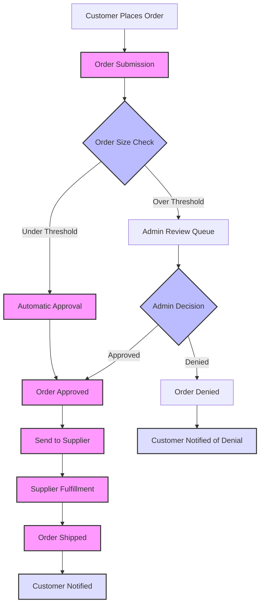
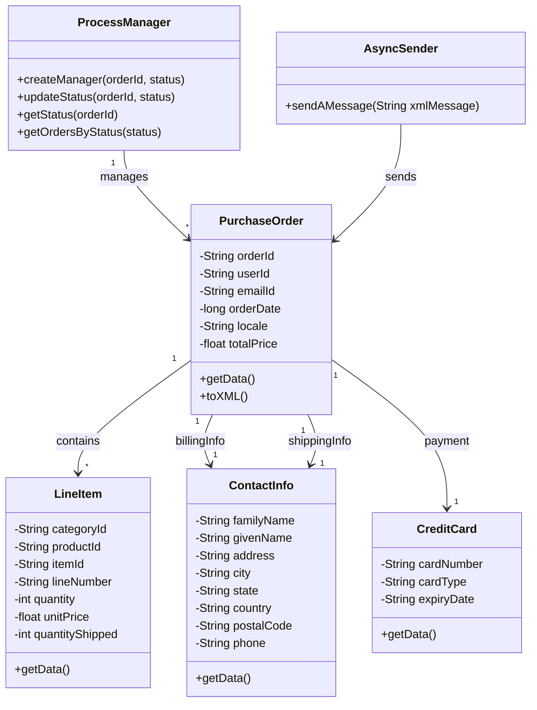
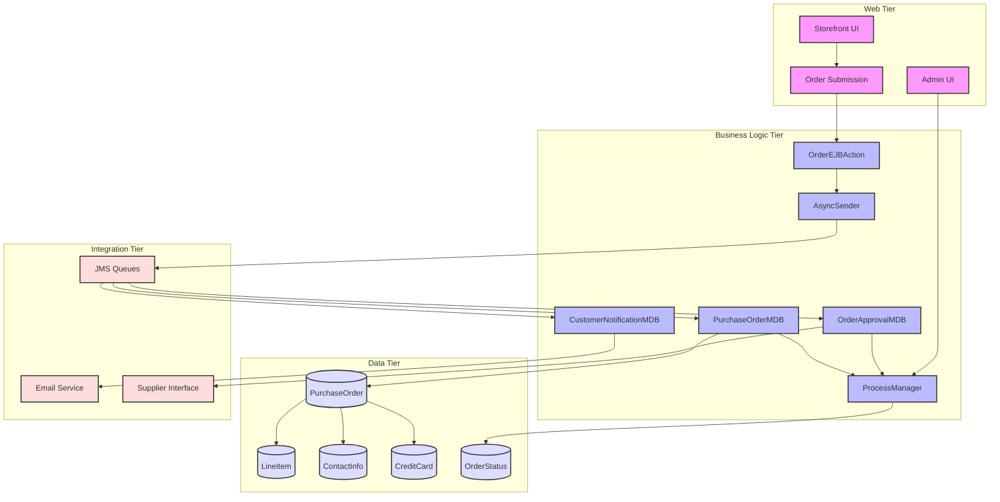

# Order Processing in Java Pet Store 1.3.2

## Order Processing Overview

Order processing represents the core business function in the Java Pet Store application, handling the complete lifecycle of customer orders from initial submission through fulfillment. The system implements a sophisticated workflow that manages orders as they progress through various states including pending, approved, denied, and completed. 

The architecture employs a message-driven approach using JMS (Java Message Service) to enable loose coupling between components, allowing for asynchronous processing and improved scalability. Order processing begins when a customer submits an order through the storefront, which creates a PurchaseOrder entity and sends it to the Order Processing Center (OPC) via JMS. The OPC then manages the order approval process, which may be automatic for small orders or require administrator intervention for larger ones. Once approved, orders are sent to suppliers for fulfillment, with status updates communicated back to customers via email notifications.

The system is designed with clear separation of concerns, with distinct components handling specific aspects of order processing such as order creation, approval, fulfillment, and customer communication. This modular design promotes maintainability and allows for flexible business rule implementation throughout the order lifecycle.

## Order Data Structure

The order processing system in Java Pet Store is built upon a well-structured data model centered around the PurchaseOrder entity. This entity serves as the primary container for all order-related information and maintains relationships with several supporting entities.

The PurchaseOrder class represents a complete customer order and contains fields for order identification (orderId), customer information (userId, emailId), order date, locale settings, and total price. It maintains one-to-one relationships with ContactInfo entities for both shipping and billing addresses, as well as a one-to-one relationship with a CreditCard entity for payment information. Additionally, it has a one-to-many relationship with LineItem entities, each representing a product in the order.

The LineItem entity captures details about individual products within an order, including categoryId, productId, itemId, lineNumber, quantity, unitPrice, and quantityShipped. This structure allows the system to track both the ordered quantity and the shipped quantity separately, facilitating partial shipments and backorder management.

The ContactInfo entity encapsulates customer address information including name, street address, city, state, country, and postal code, while the CreditCard entity stores payment details such as card number, expiration date, and card type.

This comprehensive data model provides the foundation for order processing, with XML representations defined through DTDs enabling standardized data exchange between components. The model's design supports the complete order lifecycle from creation through fulfillment while maintaining data integrity and consistency.

## Order Processing Workflow

The order processing workflow in Java Pet Store represents a comprehensive business process that handles orders from submission to completion. When a customer places an order through the storefront interface, the OrderEJBAction component creates a PurchaseOrder object containing billing information, shipping details, credit card data, and line items from the customer's shopping cart. A unique order ID is generated using the UniqueIdGenerator component, and the order is converted to XML format.

This XML representation is then sent asynchronously via the AsyncSender component to the Order Processing Center (OPC), where the PurchaseOrderMDB receives and processes it. The OPC implements a business rule that automatically approves orders under a certain threshold ($500 for US orders or ¥50000 for Japanese orders) while routing larger orders to an administrator review queue.

For orders requiring approval, the Admin application allows administrators to view pending orders and either approve or deny them. Once approved (either automatically or manually), the order transitions to the supplier fulfillment stage, where the supplier processes the order and updates inventory. When fulfillment is complete, the system marks the order as shipped and sends notification emails to customers.

Throughout this workflow, the ProcessManager component tracks the order's status transitions, maintaining a record of each order's current state. This enables administrators to query orders by status and provides visibility into the entire order fulfillment process. The workflow's asynchronous nature, implemented through JMS messaging, ensures system resilience and scalability while maintaining loose coupling between components.

## Order Status Management

The Java Pet Store application implements a sophisticated order status management system through the ProcessManager component. This component tracks and updates the status of orders as they progress through the fulfillment workflow, providing a centralized mechanism for monitoring order progression and enabling status-based queries.

At the core of this system is the Manager entity bean, which maintains a one-to-one relationship between order IDs and their current status. When a new order is created, the ProcessManagerEJB's createManager() method establishes a record for the order with an initial status, typically "PENDING". As the order moves through the workflow, components call the updateStatus() method to reflect transitions between states.

The system defines standard status values in the OrderStatusNames class, including "PENDING", "APPROVED", "DENIED", "COMPLETED", and others. These standardized status values ensure consistency across the application and facilitate status-based filtering and reporting.

The ProcessManager component also provides query capabilities through the getOrdersByStatus() method, allowing administrators to retrieve collections of orders with a specific status. This functionality is particularly important for the Admin application, which displays orders grouped by their current status and enables administrators to process pending orders.

Status transitions are typically triggered by message-driven beans that respond to JMS messages. For example, when the OrderApprovalMDB processes an approval message, it updates the order's status to "APPROVED" through the ProcessManager. Similarly, when a supplier completes fulfillment, the status is updated to "COMPLETED".

This status management approach provides a clear audit trail of order progression and enables both automated processing and manual intervention based on an order's current state, forming a critical component of the order processing infrastructure.

## Asynchronous Messaging Architecture

The Java Pet Store application employs a sophisticated asynchronous messaging architecture based on JMS (Java Message Service) to enable reliable, loosely coupled communication between order processing components. This architecture is fundamental to the system's ability to handle order processing in a scalable and resilient manner.

At the core of this messaging system is the AsyncSender component, implemented as a stateless session bean that provides a simple interface for sending messages to JMS queues. Components that need to communicate asynchronously, such as the OrderEJBAction, use the AsyncSender to place messages on appropriate queues without needing to manage JMS connection details directly.

The system defines several key message queues that facilitate different aspects of order processing:
- The PurchaseOrderQueue receives new orders from the storefront
- The OrderApprovalQueue handles order approval messages
- The OrderApprovalMailQueue and CompletedOrderMailQueue manage customer notifications
- The SupplierPurchaseOrderQueue communicates with supplier systems

Message-Driven Beans (MDBs) serve as the consumers of these messages, with specialized MDBs for each stage of order processing. For example, the PurchaseOrderMDB processes incoming orders, the OrderApprovalMDB handles approval decisions, and various notification MDBs manage customer communications.

This asynchronous approach provides several benefits:
1. Improved scalability through decoupling of components
2. Enhanced reliability with guaranteed message delivery
3. Better fault tolerance as components can fail independently
4. Simplified transaction management across system boundaries

The messaging architecture also supports the workflow transitions through the TransitionDelegate pattern, where components use JMS to signal state changes to downstream processes. This pattern allows for flexible workflow configuration without tight coupling between components.

XML documents serve as the payload format for these messages, providing a standardized way to exchange structured data between components while maintaining loose coupling. DTDs define the structure of these documents, ensuring consistency in message content across the system.

## Order Component Relationships

The order processing system in Java Pet Store is built upon a network of interrelated components that work together to manage the order lifecycle. At the center of this network is the PurchaseOrder entity, which serves as the primary container for order information and maintains relationships with several supporting entities.

PurchaseOrder has a one-to-many relationship with LineItem entities, with each LineItem representing a product in the order. This relationship is managed through container-managed persistence (CMP) and allows for efficient retrieval of all items in an order. PurchaseOrder also maintains one-to-one relationships with ContactInfo entities for both shipping and billing addresses, as well as a one-to-one relationship with a CreditCard entity for payment information.

The ProcessManager component maintains a record of each order's current status and provides methods to create, update, and query orders by status. It acts as a workflow coordinator, tracking orders as they move through the fulfillment process.

The AsyncSender component facilitates communication between order processing stages by sending XML messages to JMS queues. It provides a simple interface that abstracts the complexities of JMS messaging, allowing other components to send messages without managing connection details directly.

Message-Driven Beans (MDBs) like PurchaseOrderMDB, OrderApprovalMDB, and InvoiceMDB consume messages from JMS queues and perform specific processing tasks. These MDBs use TransitionDelegate implementations to handle workflow transitions between processing stages.

The UniqueIdGenerator component generates sequential, prefixed identifiers for orders and related entities, ensuring uniqueness across the system.

This component architecture demonstrates a clear separation of concerns, with each component responsible for a specific aspect of order processing. The relationships between these components are carefully managed to maintain data integrity while enabling flexible workflow implementation.

## Order Approval Process

The order approval process in Java Pet Store implements a sophisticated workflow that combines automated business rules with manual administrative oversight. This process begins when a new order is received by the PurchaseOrderMDB, which creates a PurchaseOrder entity and initiates the approval workflow.

The system applies a business rule that automatically approves orders below a certain monetary threshold. For US orders, this threshold is set at $500, while for Japanese orders, it's ¥50000. This locale-aware rule allows for different approval thresholds based on the customer's region. Orders that fall below these thresholds are automatically approved without requiring administrator intervention, streamlining the process for smaller purchases.

For orders exceeding the threshold, the system places them in a pending state and routes them to the administrator approval queue. These orders remain in this state until an administrator reviews them through the Admin application. The Admin interface provides administrators with a comprehensive view of pending orders, including order details, customer information, and order totals.

When reviewing pending orders, administrators have two options: approve or deny. This decision might be based on various factors such as order size, customer history, inventory availability, or payment verification. The Admin application allows administrators to select multiple orders and process them in batches, improving efficiency for high-volume operations.

When an administrator approves an order, the system generates an OrderApproval XML document containing the approval decision and the order ID. This document is sent via the AsyncSender to the OrderApprovalMDB, which updates the order status to "APPROVED" and initiates the next stage in the fulfillment process.

If an administrator denies an order, a similar process occurs, but the order status is updated to "DENIED" and the customer is notified of the denial. The system may also include a reason for the denial in the notification.

Throughout this process, the ProcessManager component tracks the order's status, maintaining a record of each transition and enabling status-based queries. This approach provides a flexible approval workflow that balances automation for efficiency with manual oversight for larger orders that may require additional scrutiny.

## XML Document Exchange

The Java Pet Store application leverages XML documents as a primary mechanism for data exchange between order processing components. This approach provides a standardized, platform-independent format for representing structured data while maintaining loose coupling between system components.

The XML document structure for orders is defined through Document Type Definitions (DTDs) that specify the required elements and their relationships. The PurchaseOrder.dtd defines the structure for purchase orders, including elements for OrderId, UserId, EmailId, OrderDate, shipping and billing information, TotalPrice, CreditCard details, and LineItem entries. Similarly, LineItem.dtd defines the structure for line items with elements for CategoryId, ProductId, ItemId, LineNum, Quantity, and UnitPrice.

These DTDs ensure consistency in document structure and provide validation capabilities to verify document correctness before processing. The system also supports XML Schema Definition (XSD) for more advanced validation requirements, particularly for Trading Partner Agreement (TPA) documents used in business-to-business integration.

The application includes comprehensive XML processing capabilities through classes like PurchaseOrder, which provide methods for converting between Java objects and XML representations. These classes implement methods such as toXML(), fromXML(), toDOM(), and fromDOM() to facilitate various XML transformation needs. They also support validation against DTDs or XSDs to ensure document integrity.

To optimize XML processing, the system employs an EntityCatalog mechanism that maps public identifiers to local file resources, eliminating the need for network access during DTD resolution. This catalog is configured through properties files that define mappings for all document types used in the system.

When components need to communicate, they typically convert their data to XML format before transmission. For example, when submitting an order, the OrderEJBAction converts the PurchaseOrder object to XML before sending it via the AsyncSender. Similarly, when the PurchaseOrderMDB receives this XML message, it parses it back into a PurchaseOrder object for processing.

This XML-based approach provides a flexible, interoperable mechanism for data exchange that supports the loosely coupled, message-driven architecture of the order processing system.

## Order Processing Architecture

The order processing architecture in Java Pet Store demonstrates a well-structured, multi-tiered design that separates concerns while enabling efficient workflow management. The architecture spans four primary tiers: web, business logic, data, and integration.

The web tier provides user interfaces for both customers and administrators. Customers interact with the Storefront UI to browse products, manage shopping carts, and submit orders. Administrators use the Admin UI to review pending orders, approve or deny them, and monitor order status. The Order Submission component in this tier captures order details and initiates the order processing workflow.

The business logic tier contains the core components that implement order processing functionality. The OrderEJBAction handles initial order creation, validating order details and preparing them for processing. The AsyncSender facilitates asynchronous communication between components through JMS messaging. The ProcessManager tracks order status throughout the workflow. Message-Driven Beans (MDBs) like PurchaseOrderMDB, OrderApprovalMDB, and CustomerNotificationMDB process specific stages of the order lifecycle, responding to messages and updating order status accordingly.

The data tier manages persistent storage of order-related information. Entity beans including PurchaseOrder, LineItem, ContactInfo, and CreditCard represent the core data model, while the OrderStatus entity tracks the current state of each order. These entities use Container-Managed Persistence (CMP) to handle database operations automatically.

The integration tier provides connectivity to external systems and services. JMS Queues enable asynchronous messaging between components, supporting a loosely coupled architecture. The Email Service sends notifications to customers at various stages of order processing. The Supplier Interface facilitates communication with supplier systems for order fulfillment.

This architecture demonstrates several key design principles:
1. Clear separation of concerns across tiers
2. Asynchronous messaging for loose coupling
3. Stateful workflow management through the ProcessManager
4. XML-based data exchange for interoperability
5. Component-based design for maintainability and reusability

The result is a flexible, scalable system that can handle the complete order lifecycle while accommodating changes in business rules and processes.

## Unique Order Identification

The UniqueIdGenerator component in Java Pet Store provides a critical service for order processing by creating sequential, prefixed identifiers for orders and related entities. This component ensures that each order has a unique identifier that can be used for tracking, referencing, and querying throughout the order lifecycle.

The UniqueIdGenerator is implemented as a stateless session bean that delegates to a Counter entity bean for persistent storage of counter values. When a component needs a new unique identifier, it calls the getUniqueId() method with a prefix parameter. For example, order IDs typically use the prefix "1001", resulting in identifiers like "1001-1", "1001-2", and so on.

The Counter entity bean maintains a mapping between prefix names and their current counter values. When a new ID is requested, the UniqueIdGenerator retrieves the current counter value for the specified prefix, increments it, and returns the combined prefix and counter value as a string. This approach ensures that identifiers are both unique and meaningful, with the prefix indicating the type of entity being identified.

The UniqueIdGenerator uses a "find-or-create" pattern when accessing counters. It first attempts to find an existing counter for the specified prefix, and if none exists, it creates a new one starting at 1. This allows the system to dynamically support new prefix types without requiring configuration changes.

The component is designed for high concurrency, with appropriate transaction attributes to ensure that counter increments are atomic operations. This prevents duplicate IDs even under high load conditions with multiple concurrent requests.

In the order processing workflow, the OrderEJBAction uses the UniqueIdGenerator to create a new order ID when a customer submits an order. This ID becomes the primary key for the PurchaseOrder entity and is used in all subsequent processing steps and customer communications. The unique identifier also appears in customer notifications, allowing customers to reference their orders in communications with customer service.

This approach to unique identification provides a simple yet effective mechanism for generating identifiers that are both unique across the system and meaningful to users and administrators.

## Order Administration

The Java Pet Store application provides comprehensive administrative capabilities for managing orders through the Admin application. This component allows administrators to view, approve, and deny orders, as well as monitor order status and generate reports on sales performance.

The Admin application is implemented as a rich client using Java Swing, providing a responsive user interface for order management tasks. It communicates with the server-side components through XML-based remote procedure calls, allowing administrators to work from any location with network access to the application server.

The main order management interface presents orders grouped by their current status, with separate tabs for pending orders that require approval and non-pending orders that are in various stages of fulfillment. For pending orders, administrators can view detailed information including order ID, customer details, order date, total amount, and line items. They can then select one or more orders and choose to either approve or deny them based on business criteria.

When an administrator approves or denies orders, the Admin application generates OrderApproval XML documents containing the approval decisions and sends them to the server via the ApplRequestProcessor servlet. These approval messages are then processed by the OrderApprovalMDB, which updates the order status and initiates the next stage in the workflow.

For non-pending orders, administrators can view orders by status (approved, denied, completed) to monitor the progress of order fulfillment. This visibility into the order pipeline helps administrators identify potential bottlenecks or issues in the fulfillment process.

The Admin application also provides reporting capabilities through charts that visualize sales data. Administrators can generate pie charts or bar charts showing sales by product category for specified date ranges. These analytics help in understanding sales patterns and making informed business decisions.

Security for the Admin application is implemented through container-managed authentication, ensuring that only authorized users can access the administrative functions. This security model integrates with the J2EE security framework, leveraging role-based access control to protect sensitive operations.

The order administration capabilities provide a crucial interface for human oversight of the order processing workflow, allowing for manual intervention when needed while supporting efficient batch processing of routine approvals.

## Customer Communication

The Java Pet Store application implements a comprehensive customer communication system that keeps customers informed about their orders throughout the processing lifecycle. This system uses email notifications to provide timely updates at key stages of order processing, enhancing the customer experience and reducing support inquiries.

When a customer places an order, the system captures their email address as part of the order information. This email address becomes the primary channel for subsequent communications regarding the order. The OrderEJBAction component returns an OrderEventResponse containing the order ID and customer email, which can be used for initial order confirmation.

The customer communication process is primarily handled by specialized Message-Driven Beans (MDBs) that respond to events in the order processing workflow. These MDBs include:

1. CR_MAIL_ORDER_APPROVAL_MDB - Sends notifications when orders are approved or denied
2. CR_MAIL_COMPLETED_ORDER_MDB - Sends notifications when orders are fulfilled and shipped

These MDBs listen to dedicated JMS queues (OrderApprovalMailQueue and CompletedOrderMailQueue) that receive messages when order status changes occur. When a message arrives, the MDB processes it and generates an appropriate email notification to the customer.

Email notifications are sent through the Mailer component, which provides a standardized interface for email communication. This component handles the details of SMTP connection management and message formatting, allowing the notification MDBs to focus on content generation rather than email protocol details.

The content of customer notifications includes essential order information such as:
- Order ID for reference in future communications
- Current status of the order (approved, denied, shipped)
- Expected delivery timeframe (for approved orders)
- Reason for denial (if applicable)
- Shipping details including tracking information (for completed orders)

This communication system ensures that customers remain informed about their orders without requiring them to log in and check status manually. The asynchronous nature of the notification system, implemented through JMS messaging, ensures that communication processing does not delay the core order workflow while still providing timely updates to customers.

By keeping customers informed throughout the order lifecycle, the system reduces support inquiries and enhances customer satisfaction, contributing to a positive overall shopping experience.

[Generated by the Sage AI expert workbench: 2025-03-29 21:37:00  https://sage-tech.ai/workbench]: #