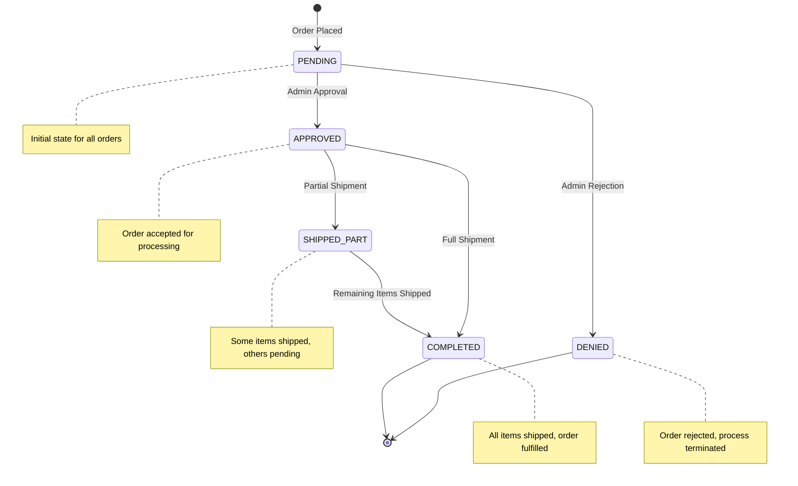
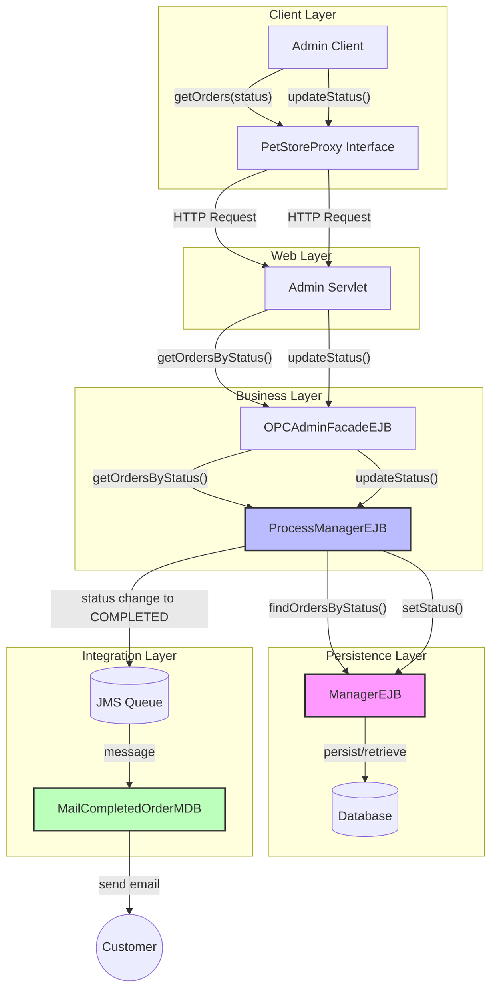
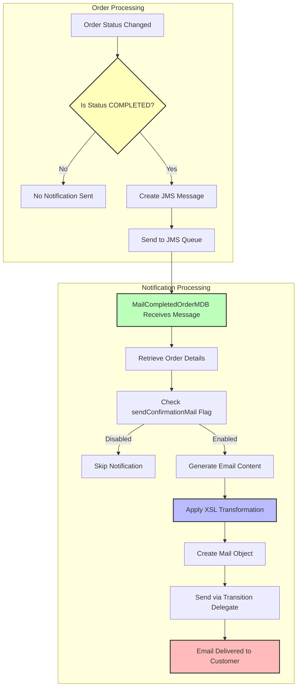
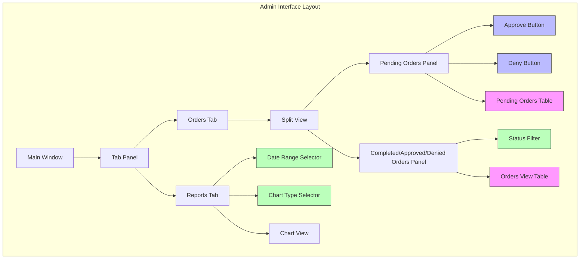

# Order Status Tracking in Java Pet Store

## Order Status Lifecycle

The Java Pet Store application implements a comprehensive order status tracking system that follows orders from initial creation through fulfillment. Orders begin in a PENDING state when first placed by customers. From there, they follow one of two primary paths: approval or denial. Approved orders progress through the fulfillment process, potentially moving through a SHIPPED_PART state for partial shipments before ultimately reaching COMPLETED status when all items are shipped. Alternatively, orders may be DENIED, which terminates the order lifecycle.

The system maintains this status information in the ManagerEJB entity bean, which stores the orderId and status fields. Status changes are triggered by various components in the system, including the admin client for manual status updates and automated processes for order fulfillment. Each status change is tracked and can trigger notifications to customers, particularly when orders reach the COMPLETED state.

The status tracking architecture is designed to be robust and transactional, ensuring that order status changes are atomic and consistent across the distributed application. The ProcessManagerEJB session bean provides the business interface for creating, retrieving, and updating order status information, abstracting the persistence details from the rest of the application.

## Order Status State Transition Flow

The diagram illustrates the order status workflow in the Pet Store application. All orders start in the PENDING state when initially placed. From there, an administrator can either APPROVE or DENY the order. Denied orders terminate the process, while approved orders proceed to fulfillment. During fulfillment, orders may transition to SHIPPED_PART if only some items are shipped, or directly to COMPLETED if all items are shipped at once. Orders in SHIPPED_PART state eventually transition to COMPLETED when all remaining items are shipped. The COMPLETED state represents the successful conclusion of the order lifecycle.

## Status Tracking Architecture

The order status tracking architecture in the Java Pet Store application is built around several key components that work together to maintain and update order status information throughout the system. At its core is the ProcessManager EJB component, which consists of two primary beans: the ManagerEJB entity bean and the ProcessManagerEJB session bean.

The ManagerEJB is a Container-Managed Persistence (CMP) entity bean that stores the fundamental status information for each order. It maintains two key fields: orderId (the primary key) and status. This bean provides the persistence layer for order status data, with finder methods to retrieve orders by their status. The entity bean's local interface, ManagerLocal, exposes methods to get and set status information.

The ProcessManagerEJB is a stateless session bean that acts as a facade, providing a business interface for order status operations. It offers methods for creating new manager entries, updating status values, retrieving status for specific orders, and querying for orders by status. This bean encapsulates the business logic for status transitions and shields other components from the details of the persistence mechanism.

The architecture follows a strict transactional model, with all methods requiring transactions to ensure data consistency. The system uses local interfaces throughout to optimize performance for in-container calls. Additionally, the architecture leverages EJB-QL queries for finding orders by status, demonstrating the object-oriented query capabilities of the J2EE platform.

## Order Status Component Interaction

This diagram illustrates how different components interact to track and update order status in the Pet Store application. The Admin Client communicates with the server through the PetStoreProxy interface, which sends HTTP requests to the Admin Servlet. The servlet delegates to the OPCAdminFacadeEJB, which acts as a facade for administrative operations.

The OPCAdminFacadeEJB interacts with the ProcessManagerEJB, which provides the business logic for order status management. The ProcessManagerEJB uses the ManagerEJB entity bean to persist and retrieve status information from the database.

When an order status changes to COMPLETED, the ProcessManagerEJB publishes a message to a JMS queue. The MailCompletedOrderMDB listens for these messages and sends email notifications to customers about their completed orders.

This architecture separates concerns across layers while maintaining a cohesive flow for status tracking operations. The use of local interfaces between EJBs optimizes performance, while the JMS integration enables asynchronous customer notifications.

## Status Change Representation

The ChangedOrder class serves as a critical component in the order status tracking system, providing a standardized way to encapsulate and communicate order status changes throughout the application. This class is part of the xmldocuments component and implements a simple data structure with two primary fields: orderId and orderStatus.

ChangedOrder's primary purpose is to represent an order that has been updated with a new status. It provides a clean abstraction that can be passed between different system components, particularly when communicating across tier boundaries. The class includes constructors for creating new instances, getters for accessing the order ID and status information, and most importantly, methods for XML serialization and deserialization.

The XML capabilities are particularly significant as they enable the ChangedOrder objects to be converted to and from XML representations. The toDOM() methods generate XML document structures representing the order status change, while the static fromDOM() factory method parses XML nodes to reconstruct ChangedOrder objects. This XML serialization mechanism facilitates communication between distributed components, particularly when passing order status changes through JMS messages or other messaging systems.

The class employs the static factory method pattern for XML deserialization instead of using constructors, which provides more flexibility in object creation. It also implements a two-level DOM conversion approach with both document-level and node-level toDOM methods, allowing for efficient integration into larger XML documents.

By standardizing the representation of order status changes, the ChangedOrder class ensures consistent handling of status information across the application's various components, from the process manager to notification systems and administrative interfaces.

## Status Notification System

The Java Pet Store implements a robust notification system to keep customers informed about changes to their order status. At the heart of this system is the MailCompletedOrderMDB, a message-driven bean that listens for JMS messages containing information about orders that have reached the COMPLETED status.

When an order's status changes to COMPLETED, the ProcessManagerEJB publishes a message to a JMS queue. The MailCompletedOrderMDB consumes these messages and processes them to generate email notifications for customers. The bean retrieves the complete order details from the PurchaseOrder entity bean, including customer contact information and the items ordered.

The notification content is generated using XSL transformation, which converts the order data (stored in XML format) into a customer-friendly HTML email. This approach separates the content formatting logic from the notification business logic, making the system more maintainable and allowing for easy customization of email templates.

The actual email delivery is handled through a transition delegate pattern, where the MailCompletedOrderTD class encapsulates the details of interacting with the mailer service. This decoupling allows the notification system to focus on its core responsibility of generating appropriate content while delegating the actual delivery mechanism.

The system is also configurable through environment settings. The sendConfirmationMail flag, retrieved through the ServiceLocator, allows administrators to enable or disable email notifications globally without modifying code. This provides operational flexibility while maintaining the integrity of the notification architecture.

## Status Notification Process

The flowchart illustrates the complete process of notifying customers about order status changes in the Pet Store application. The process begins when an order's status is updated. The system checks if the new status is COMPLETED, as this is the trigger for customer notification.

For completed orders, the system creates a JMS message containing the order ID and sends it to a dedicated JMS queue. The MailCompletedOrderMDB, which continuously listens to this queue, receives the message and begins processing it.

The MDB first retrieves the complete order details from the PurchaseOrder entity bean, including customer information and order contents. It then checks the system configuration to determine if email notifications are enabled (via the sendConfirmationMail flag).

If notifications are enabled, the MDB generates the email content by applying an XSL transformation (CompletedOrder.xsl) to the order data. This transforms the raw order information into a customer-friendly HTML email. The MDB then creates a Mail object with the customer's email address, a subject line indicating the order is completed, and the formatted message body.

Finally, the Mail object is sent to the customer through the MailCompletedOrderTD transition delegate, which handles the actual email delivery. This completes the notification process, ensuring customers are informed when their orders are fully shipped.

## Administrative Order Management

The Java Pet Store application provides a comprehensive administrative interface for managing orders and their statuses. This functionality is primarily exposed through the OPCAdminFacade interface and its implementation, OPCAdminFacadeEJB, which serves as a facade for administrative operations in the Order Processing Center.

Administrators can view orders through the getOrdersByStatus method, which returns collections of orders filtered by their current status (PENDING, APPROVED, DENIED, or COMPLETED). This allows administrators to focus on orders requiring attention, such as pending orders awaiting approval or recently completed orders.

The admin client application, built using Swing, provides a graphical interface for these operations. It includes specialized panels like OrdersViewPanel for displaying read-only views of orders that are already approved, denied, or completed, and interactive components for managing pending orders. The TableSorter utility enhances usability by allowing administrators to sort orders by various attributes such as order ID, date, or value.

For pending orders, administrators can approve or deny them through the updateStatus method in the PetStoreProxy interface. This action triggers a status change in the underlying order management system, moving orders from PENDING to either APPROVED or DENIED status. The OrdersApproveTableModel handles the UI interaction for these status changes, collecting modified orders and submitting them in batches to optimize server communication.

The admin interface also provides reporting capabilities through the getChartInfo method, which generates sales data based on order status information. This allows administrators to analyze order trends, such as approval rates or fulfillment times, providing valuable business intelligence.

Communication between the admin client and server components is handled through the HttpPostPetStoreProxy, which implements XML-based HTTP communication to retrieve order information and submit status updates. This architecture allows the admin interface to operate remotely while maintaining secure access to the order management functionality.

## Order Status Data Models

The Java Pet Store application employs several specialized data models to represent order status information across different layers of the system. These models facilitate the transfer of status data between components while maintaining appropriate abstractions for each context.

At the persistence layer, the ManagerEJB entity bean provides the fundamental data model, with fields for orderId and status. This entity bean uses Container-Managed Persistence (CMP) to handle database operations automatically, with the container implementing the abstract getter and setter methods at runtime. The ManagerLocal interface exposes these properties to other components within the EJB container.

For communication between the server and admin client, the OrderDetails class serves as a serializable transfer object. This class encapsulates essential order information including orderId, userId, orderDate, orderValue, and orderStatus. It provides a clean, serializable representation that can be transmitted across network boundaries while hiding the complexities of the underlying entity beans.

The admin client uses the PetStoreProxy.Order class as its internal representation of orders. This class includes not only the order data but also static constants defining the possible status values (PENDING, APPROVED, DENIED, COMPLETED). It provides methods for accessing order properties and includes validation logic to ensure status values are valid.

For UI representation, specialized table models like OrdersViewTableModel and OrdersApproveTableModel adapt the order data for display in Swing tables. These models handle the mapping between the raw order data and the tabular format required by the UI components, including column definitions and data type conversions.

When order status changes need to be communicated between components, particularly through messaging systems, the ChangedOrder class provides an XML-serializable representation. This class focuses specifically on the orderId and orderStatus fields, with methods to convert between Java objects and XML DOM structures.

The OrderStatusNames utility classes (in both the processmanager and supplierpo components) centralize the definition of status constants, ensuring consistent naming across the application. These classes also document the typical state transitions, providing a reference for developers working with the status tracking system.

## Admin Interface for Order Status

The admin interface for order status management in the Java Pet Store application provides administrators with a comprehensive view of orders and their statuses. The interface is organized into tabs, with the Orders tab being the primary location for status management.

The Orders tab features a split view with two main panels. The top panel displays pending orders that require administrator action. Each pending order is shown in a sortable table with columns for order ID, user ID, date, amount, and status. Administrators can select one or more pending orders and use the Approve or Deny buttons to change their status. These actions immediately update the status in the database and move the orders to the appropriate category.

The bottom panel displays orders that have already been processed (completed, approved, or denied). Administrators can filter this view by status to focus on specific categories of orders. This panel is read-only, as these orders have already been processed and their status cannot be changed through the admin interface.

The Reports tab provides analytical capabilities based on order status data. Administrators can select date ranges and chart types to visualize order trends, such as approval rates or fulfillment times. This helps in identifying bottlenecks in the order processing workflow or analyzing business performance.

The interface uses color coding to indicate different statuses: pending orders might be highlighted in yellow, approved in green, denied in red, and completed in blue. This visual distinction helps administrators quickly identify the status of orders at a glance.

The admin interface communicates with the server through the PetStoreProxy interface, which handles the retrieval of order data and submission of status updates. The DataSource class manages the data models that power the interface, ensuring that all components display consistent information.

## Status Reporting and Analytics

The Java Pet Store application includes robust reporting and analytics capabilities centered around order status data. These features provide administrators with valuable business intelligence derived from the order processing workflow, helping them understand sales patterns, identify bottlenecks, and make data-driven decisions.

The reporting system is primarily accessed through the OPCAdminFacadeEJB's getChartInfo method, which generates aggregated data based on order status information. This method can produce two types of reports: revenue analysis and order quantity analysis. Both report types can be filtered by date range and optionally by product category, allowing for detailed drill-down analysis.

For revenue reporting, the system aggregates the monetary value of orders in different statuses. This helps administrators understand the financial impact of approved versus denied orders, or track the value of completed orders over time. The revenue data can be broken down by product category or, when a specific category is selected, by individual items within that category.

Order quantity reporting focuses on the number of orders in each status category. This provides insights into the efficiency of the order processing workflow, such as the ratio of approved to denied orders or the time taken for orders to move from approved to completed status. Like revenue reporting, this data can be filtered by category and time period.

The admin client presents this data through interactive charts, including pie charts for showing the distribution of orders across different statuses and bar charts for tracking trends over time. The ChartModel classes (PieChartModel and BarChartModel) provide the data structures needed to populate these visualizations.

The reporting system is designed to be flexible, with the ability to adjust date ranges and category filters on demand. When filter criteria change, the system sends new requests to the server to retrieve updated data, ensuring that administrators always have access to current information.

By leveraging order status data for analytics, the Java Pet Store application transforms operational information into strategic insights, helping businesses optimize their order processing workflows and improve customer satisfaction.

[Generated by the Sage AI expert workbench: 2025-03-29 21:37:00  https://sage-tech.ai/workbench]: #