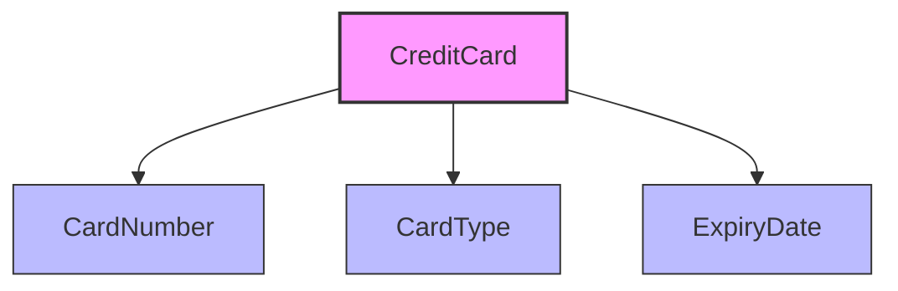
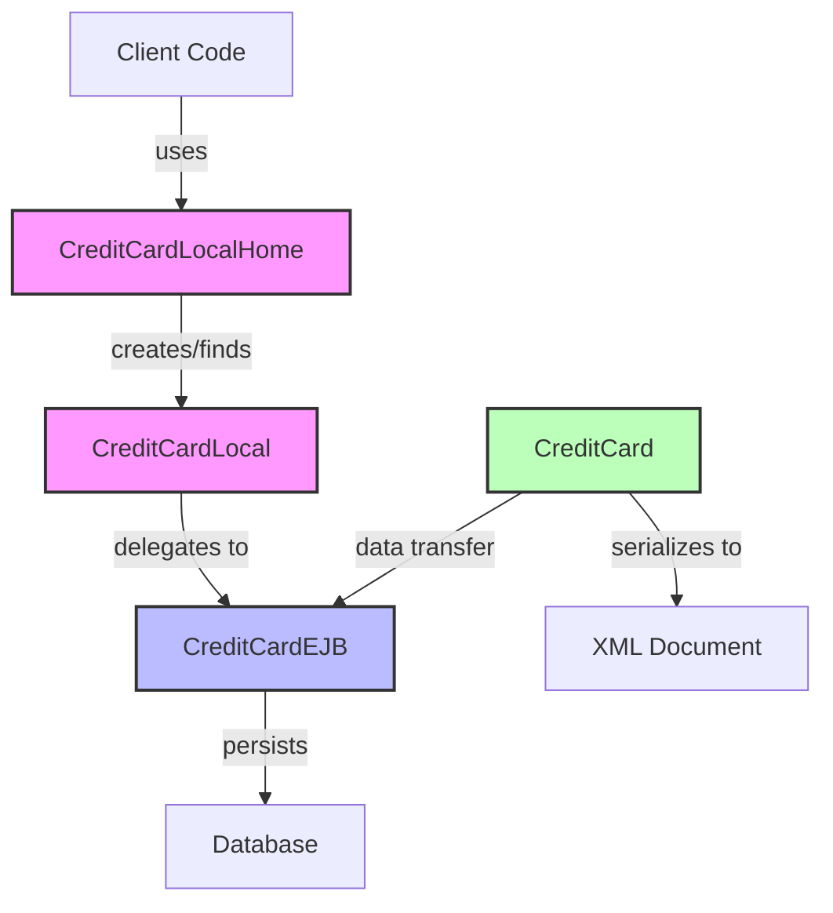
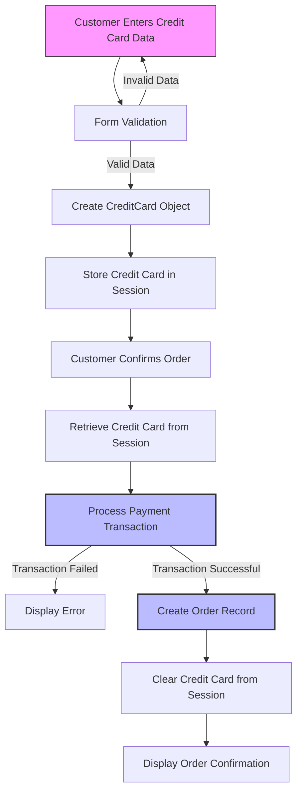

# Payment Processing in Java Pet Store 1.3.2

## Payment Processing Overview

The payment processing system in Java Pet Store 1.3.2 represents a critical component of the e-commerce workflow, responsible for handling financial transactions during the checkout process. Built on the J2EE 1.3 platform, the payment system leverages Enterprise JavaBeans (EJB) technology to provide a robust, transactional framework for processing credit card information. The architecture follows a multi-tiered approach where credit card data is captured through the web tier, processed by the business tier using EJBs, and persisted to the database tier using container-managed persistence (CMP). 

The system centers around the CreditCard component, which encapsulates all payment-related functionality. This component includes a data model for representing credit card information, entity beans for persistence, local interfaces for business logic access, and XML serialization capabilities for data exchange. The payment processing workflow integrates with the broader order fulfillment process, where credit card validation and transaction processing occur as part of the order submission sequence. The component is designed with security considerations in mind, implementing transaction management and following J2EE best practices for handling sensitive financial information.

## Credit Card Data Model

The CreditCard class serves as the core data model for payment information in the Java Pet Store application. This model implements a straightforward yet comprehensive representation of credit card data necessary for processing financial transactions. The class encapsulates three essential properties: `cardNumber` (the actual credit card number), `cardType` (the type of credit card such as Visa or MasterCard), and `expiryDate` (the card's expiration date in MM/YYYY format). 

The model is designed as a serializable Java class that functions both as a transfer object for moving credit card data between application tiers and as a data container for XML serialization/deserialization. The class provides utility methods for parsing the expiry date string into separate month and year components, facilitating validation and display operations. The model deliberately maintains a clean separation between data representation and business logic, adhering to the principle of separation of concerns. This design allows the credit card information to be easily passed between the presentation layer, business logic layer, and persistence layer without unnecessary coupling. The simplicity of the model reflects a focused approach to capturing only the essential payment information required for transaction processing while maintaining flexibility for integration with various payment gateways.

## Credit Card Data Structure

The credit card data structure in Java Pet Store is defined through an XML schema specified in a Document Type Definition (DTD). This structure establishes the format for credit card information exchange throughout the application.

The diagram illustrates the hierarchical relationship between elements in the credit card XML schema. The root element `CreditCard` contains three child elements: `CardNumber` (storing the actual credit card number), `CardType` (indicating the type of card, such as Visa or MasterCard), and `ExpiryDate` (containing the card's expiration date in MM/YYYY format). Each of these elements is defined to contain parsed character data (#PCDATA) according to the DTD specification.

This simple yet effective structure provides a standardized format for representing credit card information across different components of the application. The XML representation facilitates data exchange between the web tier, business tier, and integration with external payment processing systems. The schema's simplicity reflects a deliberate design choice to capture only the essential information required for payment processing while maintaining compatibility with XML-based communication protocols.

## Entity Bean Implementation

The CreditCardEJB class implements an entity bean that manages the persistence of credit card information in the Java Pet Store application. This implementation leverages Container-Managed Persistence (CMP) 2.x, a feature of the J2EE 1.3 platform that delegates database operations to the EJB container. The entity bean defines abstract accessor methods for the credit card properties (cardNumber, cardType, and expiryDate), allowing the container to handle the mapping between these properties and database columns automatically.

The implementation includes multiple ejbCreate methods to support different initialization scenarios: creating a credit card entity with individual field values, creating from a pre-populated CreditCard transfer object, or creating an empty entity for later population. The entity bean also implements utility methods for parsing the expiry date string into separate month and year components, enhancing the functionality beyond basic persistence.

Following the EJB lifecycle pattern, the class implements the standard EntityBean interface methods (ejbActivate, ejbPassivate, ejbLoad, ejbStore, ejbRemove) to manage the bean's state throughout its lifecycle. The getData() method exemplifies the Transfer Object pattern, creating a detached CreditCard object that contains all the entity's data, which can be safely passed across tier boundaries without maintaining a reference to the entity bean itself. This approach effectively separates the persistence concerns from the business logic, allowing the credit card data to be manipulated independently of its persistence mechanism.

## Credit Card Component Architecture

The Credit Card component in Java Pet Store follows a standard J2EE architecture pattern, with clear separation between interfaces and implementation within the EJB container environment.

This architectural diagram illustrates the relationships between the key components of the Credit Card subsystem. The CreditCardLocalHome interface serves as the factory for creating and finding CreditCardLocal objects. Client code interacts with the CreditCardLocalHome to obtain references to CreditCardLocal objects, which provide the business methods for manipulating credit card data.

The CreditCardLocal interface defines the contract for operations on credit card entities, including getters and setters for card properties and methods to retrieve formatted data. Behind this interface, the CreditCardEJB implementation class handles the actual business logic and persistence through container-managed persistence (CMP).

The CreditCard class functions as a transfer object, facilitating data exchange between the entity bean and client code. It also provides XML serialization capabilities, converting between Java objects and XML representations for persistence and communication with external systems.

This architecture follows the EJB design patterns recommended for J2EE applications, providing a clean separation of concerns between interface, implementation, and data representation. The component operates within the J2EE container environment, leveraging container services for transaction management, security, and lifecycle management of the entity beans.

## XML Serialization and Deserialization

The Java Pet Store's credit card component implements a sophisticated XML serialization and deserialization mechanism to transform credit card data between Java objects and XML representations. This functionality is primarily encapsulated within the CreditCard class, which serves as both a data container and a converter between object and XML formats.

For serialization, the CreditCard class provides a `toDOM()` method that transforms the object's state into a Document Object Model (DOM) structure. This method creates an XML element hierarchy that mirrors the DTD-defined structure, with a root `CreditCard` element containing child elements for `CardNumber`, `CardType`, and `ExpiryDate`. The implementation leverages utility methods from the XMLDocumentUtils class to handle the creation of elements and text nodes, ensuring proper XML structure.

The deserialization process is implemented through the static `fromDOM()` method, which acts as a factory for creating CreditCard objects from XML nodes. This method navigates the DOM structure, extracting values from the appropriate elements and populating a new CreditCard instance. The implementation includes validation to ensure the expected element structure is present, throwing XMLDocumentException when parsing errors occur.

The XML structure is defined by constants within the CreditCard class, including DTD identifiers (DTD_PUBLIC_ID and DTD_SYSTEM_ID) and element names (XML_CREDITCARD, XML_CARD_NUMBER, XML_CARD_TYPE, XML_EXPIRYDATE). This approach ensures consistency between serialization and deserialization processes and provides a clear mapping between the object model and XML representation.

This XML capability enables the credit card component to participate in document-based workflows, such as order processing and payment authorization, where structured data exchange is required between system components or with external services.

## Transaction Management

Transaction management in the Java Pet Store's payment processing system is primarily handled through declarative transaction attributes defined in the EJB deployment descriptor (ejb-jar.xml). This approach leverages the container-managed transaction capabilities of the J2EE platform, allowing the application to focus on business logic while delegating transaction coordination to the EJB container.

The credit card component employs a consistent transaction strategy across all its methods, using the "Required" transaction attribute. This specification instructs the container to execute each method within an existing transaction context if one is present, or to create a new transaction if none exists. This ensures that all database operations related to credit card data are performed atomically, maintaining data consistency even in the face of concurrent access or system failures.

The deployment descriptor meticulously defines transaction attributes for each method exposed by the CreditCardEJB, including creation methods (create), finder methods (findByPrimaryKey), accessor methods (getCardNumber, getCardType, getExpiryDate), and business methods (getData). This comprehensive coverage ensures that all operations on credit card data are properly transactional.

For creation operations, the transaction ensures that a new credit card entity is either completely persisted or not persisted at all, preventing partial records. For update operations, the transaction guarantees that modifications to credit card information are atomic, avoiding inconsistent states where only some fields are updated. The transaction context also extends to the removal of credit card entities, ensuring that all related data is properly cleaned up.

This declarative transaction management approach simplifies the development process by removing the need for explicit transaction coding while providing robust transaction semantics. The container handles transaction demarcation, commit, and rollback operations based on the outcome of the business methods, automatically rolling back transactions when exceptions occur.

## Payment Processing Workflow

The payment processing workflow in Java Pet Store represents the sequence of operations from credit card data capture through validation, processing, and confirmation within the order fulfillment process.

This flowchart depicts the payment processing sequence in the Java Pet Store application. The workflow begins when a customer enters credit card information during checkout. Client-side and server-side validation ensure the data meets format requirements before proceeding. Upon validation, the system creates a CreditCard object and temporarily stores it in the user's session for the duration of the checkout process.

When the customer confirms the order, the system retrieves the credit card information from the session and initiates the payment transaction. This critical step involves creating a CreditCardEJB entity and potentially interacting with an external payment gateway (though in the sample application, this is simulated). If the transaction fails, an error message is displayed to the customer, allowing them to correct information or try again.

Upon successful payment processing, the system creates an order record in the database, associating it with the payment information. For security reasons, sensitive credit card data is then cleared from the session. Finally, an order confirmation is displayed to the customer, completing the payment workflow.

This workflow demonstrates the integration of the credit card component with the broader order processing system, showing how payment information flows through the application while maintaining security and transactional integrity.

## Component Build and Deployment

The credit card component in Java Pet Store is built and deployed using Apache Ant, a Java-based build tool that automates the compilation, packaging, and deployment processes. The build.xml file in the creditcard component directory defines the structure and sequence of the build process, ensuring consistent and repeatable deployment.

The build process begins with the initialization phase, where properties are set for directory paths, dependencies, and classpath settings. The component has a dependency on the xmldocuments component, which provides classes for XML processing and is built first through the "components" target.

The core compilation process is handled by the "compile" target, which compiles Java source files into class files and preserves resource files by copying them to the output directory. This includes the DTD schema files needed for XML validation. The build script creates separate JAR files for different deployment scenarios: a complete EJB JAR (creditcard-ejb.jar) containing all implementation classes, and a client JAR (creditcard-ejb-client.jar) that excludes the implementation classes, providing only the interfaces needed by client code.

The EJB JAR packaging process includes the creation of a META-INF directory and copying the ejb-jar.xml deployment descriptor, which defines the bean's structure, transaction attributes, and security settings. The build system also generates documentation through the "docs" target, creating JavaDoc API documentation that includes both the creditcard component and its dependencies.

The component is designed to be deployed to a J2EE application server as part of the larger Pet Store application. The deployment process involves adding the EJB JAR to the enterprise application archive (EAR) and configuring any server-specific deployment descriptors. The build system supports clean builds through the "clean" target, which removes all generated artifacts, allowing for fresh builds when needed.

## Security Considerations

Security is a paramount concern in the credit card processing component of the Java Pet Store application, given the sensitive nature of payment information. The implementation incorporates several security measures at different levels of the architecture to protect credit card data throughout its lifecycle.

At the EJB security level, the deployment descriptor (ejb-jar.xml) defines security settings for the CreditCardEJB. The component uses the `<security-identity>` element with the `<use-caller-identity>` option, which means the EJB methods execute with the security identity of the calling principal. This approach allows the application to leverage container-managed security for access control. Additionally, the deployment descriptor includes method permissions with the `<unchecked/>` element, indicating that authentication is required but specific role-based authorization is not enforced at the EJB level. In a production environment, this would typically be replaced with more restrictive role-based access controls.

The application follows best practices for handling sensitive credit card information by minimizing its persistence and exposure. The credit card data is only stored temporarily during the transaction process and is not persisted long-term in the database. The implementation avoids logging credit card numbers and other sensitive data that could be exposed in log files.

For data in transit, the application relies on the underlying J2EE container's security features, which would typically include SSL/TLS encryption for web communications in a production deployment. The application architecture separates the presentation layer from the business logic layer, reducing the risk of exposing sensitive data through the user interface.

The component design also considers transaction security, using container-managed transactions with the "Required" attribute to ensure atomicity and consistency of operations involving credit card data. This prevents partial updates or inconsistent states that could compromise data integrity.

While the Java Pet Store is a demonstration application and not intended for production use without additional security hardening, its architecture illustrates key security principles for payment processing components in enterprise Java applications. In a real-world deployment, additional measures such as credit card tokenization, compliance with PCI DSS standards, and integration with secure payment gateways would be essential extensions to this foundation.

[Generated by the Sage AI expert workbench: 2025-03-29 21:37:00  https://sage-tech.ai/workbench]: #