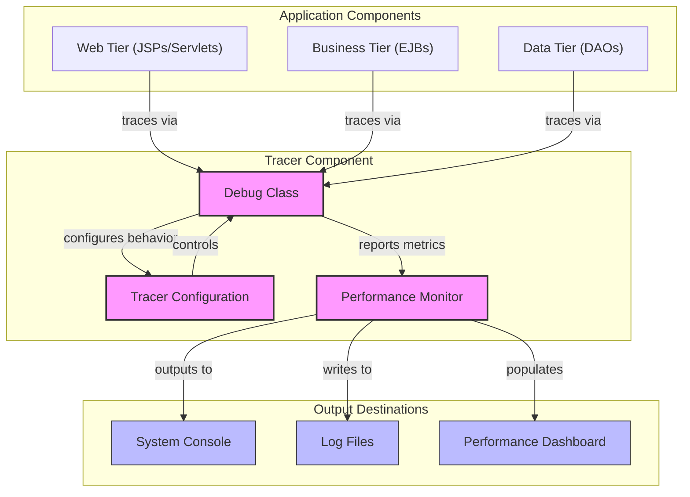
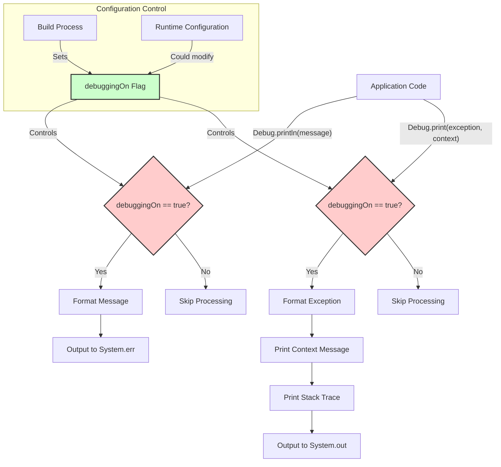
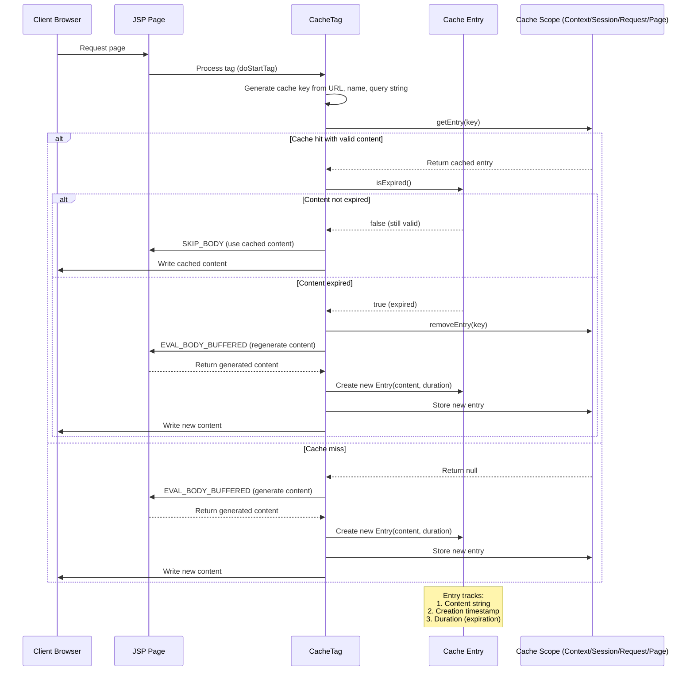

# Performance Reporting in Java Pet Store 1.3.2

## Introduction to Performance Reporting in Java Pet Store

The Java Pet Store 1.3.2 application implements a comprehensive performance reporting infrastructure designed to monitor system health, track resource usage, and optimize application performance. This infrastructure is built upon a lightweight tracer utility component that provides diagnostic capabilities throughout the application. The performance reporting system serves multiple purposes: it enables developers to identify bottlenecks during development, helps system administrators monitor production deployments, and provides valuable metrics for capacity planning. By leveraging conditional debugging and content caching mechanisms, the application balances the need for detailed performance data with minimal runtime overhead. The performance reporting capabilities are integrated across multiple architectural layers, from low-level diagnostic tracing to high-level content optimization strategies, forming a cohesive approach to maintaining optimal application performance in the J2EE environment.

## Tracer Component Architecture

The tracer utility component in Java Pet Store 1.3.2 serves as the foundation for performance monitoring throughout the application. This component is structured as a standalone module with its own build configuration, allowing it to be compiled and deployed independently of other application components. The build.xml file defines a focused compilation process that targets only the necessary classes within the com/** package hierarchy, producing a lightweight tracer.jar that can be easily integrated with the broader application. The tracer component is designed to work seamlessly with the J2EE framework, as evidenced by its dependency on the j2ee.jar library in its classpath configuration. This integration enables the tracer to monitor performance across various J2EE components, including servlets, JSPs, and EJBs. The architecture follows a minimalist approach, providing essential diagnostic capabilities without introducing significant overhead. This design philosophy is particularly important for performance monitoring tools, as excessive instrumentation can itself become a performance bottleneck. The tracer component's architecture emphasizes conditional execution, allowing performance monitoring to be enabled or disabled through configuration rather than code changes, which facilitates rapid switching between development and production environments without recompilation.

## Tracer Component Structure

The diagram illustrates the architecture of the tracer component within Java Pet Store 1.3.2. At its core, the Debug class serves as the primary interface for application components across all tiers to report diagnostic information. This class interacts with a configuration mechanism that determines when and how tracing should occur, allowing for runtime control of performance monitoring overhead.

The tracer component is designed with a clear separation of concerns: the Debug class handles the collection of diagnostic information, the TracerConfig manages the rules for when tracing should occur, and the Performance Monitor aggregates and processes the collected metrics. This separation allows for flexible deployment configurations where tracing can be enabled or disabled for specific application components or under certain conditions.

The component's integration with the broader application is lightweight by design, requiring minimal code changes to implement tracing at key points in the application flow. This approach ensures that performance monitoring can be comprehensive without becoming intrusive. The output from the tracer component can be directed to multiple destinations, supporting both real-time monitoring via console output and historical analysis through log files, ultimately feeding into performance dashboards that provide visibility into system behavior.

## Debug Utility Implementation

The Debug class in Java Pet Store 1.3.2 provides a streamlined approach to conditional logging for performance monitoring. Its implementation centers around a single static boolean flag, `debuggingOn`, which controls whether debug messages are output. This design choice reflects a pragmatic approach to performance monitoring—debug statements can be liberally placed throughout the codebase with minimal runtime impact when debugging is disabled. The class offers several overloaded methods for printing messages and exceptions, allowing developers to provide context-specific information when logging issues. The `print` and `println` methods direct output to standard error, while exception-related methods use standard output and include stack traces. This separation helps distinguish between informational messages and actual errors during analysis. The implementation is intentionally lightweight, avoiding dependencies on complex logging frameworks that might introduce additional overhead. This simplicity makes the Debug utility particularly suitable for performance-critical sections of code where more heavyweight logging solutions might impact measurements. By centralizing the debugging control through a single flag, the application can easily transition between development environments (with debugging enabled) and production deployments (with debugging disabled) without code changes, supporting efficient performance tuning and troubleshooting workflows.

## Debug Message Flow

The diagram illustrates how debug messages flow through the Debug utility in Java Pet Store 1.3.2. The process begins when application code calls one of the Debug methods, either for standard messages or exception reporting. The central decision point in this flow is the `debuggingOn` boolean flag, which acts as a global switch for all debugging output.

When a debug message is initiated, the system first checks if debugging is enabled. If the flag is set to false (the default in production environments), the message processing is immediately skipped, resulting in minimal performance impact. This design ensures that debug statements can remain in production code without affecting system performance.

For regular messages that pass the debugging check, the system formats the message (adding prefix markers like ">>") and outputs it to System.err. For exceptions, the system provides more comprehensive handling: it prints the exception message, any provided context information, and the full stack trace to System.out.

The configuration of the debug flag is controlled either at build time or potentially through runtime configuration mechanisms. This separation of debugging logic from application code allows for flexible deployment scenarios where debugging can be enabled in specific environments or situations without code changes.

This approach to debug message flow represents a pragmatic balance between comprehensive diagnostic capabilities and performance considerations, making it particularly suitable for monitoring system performance without introducing significant overhead.

## Content Caching Strategy

The Java Pet Store 1.3.2 implements a sophisticated content caching strategy through the CacheTag custom JSP tag, which optimizes performance by storing rendered content with configurable expiration policies. This strategy is particularly important for performance optimization as it reduces the processing load on the server and minimizes response times for frequently accessed content. The CacheTag implementation supports four distinct caching scopes—context, session, request, and page—allowing developers to fine-tune caching behavior based on content characteristics and usage patterns. The context scope enables application-wide caching for static content that rarely changes, while session scope maintains user-specific cached content throughout a user's interaction with the application. The request and page scopes provide more granular caching for shorter-lived content. A key feature of the implementation is its time-based expiration mechanism, which uses timestamps to track when cached content should be invalidated and regenerated. This prevents stale content from being served while maximizing cache utilization. The tag generates unique cache keys by combining the request URL, tag name, and query string, ensuring proper isolation between cached fragments. When a cache miss occurs or content expires, the tag evaluates its body content, stores the result in the appropriate scope with timestamp information, and then renders the content. On subsequent requests, if valid cached content exists, the tag bypasses content generation entirely and outputs the cached content directly, significantly reducing processing overhead. This implementation demonstrates a pragmatic approach to performance optimization that balances freshness requirements with processing efficiency.

## Cache Lifecycle Management

The sequence diagram illustrates the lifecycle management of cached content in Java Pet Store 1.3.2 through the CacheTag implementation. This process begins when a client requests a page containing the cache tag, triggering the JSP container to process the tag.

When the CacheTag's `doStartTag()` method executes, it first generates a unique cache key by combining the request URL, tag name, and query string parameters. This ensures that different content variations are properly isolated in the cache. The tag then attempts to retrieve a previously cached entry from the appropriate scope (context, session, request, or page).

If a cache entry is found, the tag checks whether it has expired by comparing the current time against the entry's creation timestamp plus its configured duration. For valid, non-expired content, the tag instructs the JSP container to skip processing the tag body (SKIP_BODY) and directly outputs the cached content to the client, significantly reducing processing overhead.

When content has expired or no cache entry exists, the tag instructs the JSP container to evaluate and buffer the tag body (EVAL_BODY_BUFFERED). After content generation, the tag creates a new Entry object containing the generated content, current timestamp, and configured duration. This entry is then stored in the appropriate scope for future requests, and the newly generated content is written to the client.

The Entry inner class plays a crucial role in this lifecycle, encapsulating not just the content itself but also the metadata needed for expiration management. This design allows for efficient freshness validation without requiring complex external dependencies.

This caching mechanism exemplifies how Java Pet Store balances performance optimization with content freshness requirements, providing significant performance benefits for frequently accessed content while ensuring that users receive up-to-date information when content changes.

## Performance Metrics Collection

The Java Pet Store 1.3.2 application implements a strategic approach to performance metrics collection through its tracer component. At the core of this implementation is the Debug class, which serves as both a diagnostic tool and a metrics collection point. While seemingly simple, this class provides the foundation for gathering performance data across the application. The metrics collection process begins with instrumentation points strategically placed throughout the codebase, particularly around resource-intensive operations and critical business functions. These instrumentation points leverage the Debug class to record execution times, resource utilization, and operation success rates. The conditional nature of the Debug implementation ensures that metrics collection has minimal impact on production performance, as the debuggingOn flag can be toggled based on the environment. For more detailed performance analysis, developers can enable debugging in specific environments to gather comprehensive metrics. The collected metrics primarily focus on execution timing, exception rates, and resource utilization patterns. While the basic implementation outputs these metrics to standard output streams, in practice, these could be redirected to structured logging systems or performance monitoring tools for aggregation and analysis. The metrics collection strategy also complements the content caching mechanism, as cache hit rates and rendering times provide valuable insights into application performance. By correlating these metrics with user activity patterns, system administrators can identify optimization opportunities and proactively address potential bottlenecks. This approach to performance metrics collection exemplifies the pragmatic design philosophy of Java Pet Store, providing essential monitoring capabilities without introducing unnecessary complexity or overhead.

## Performance Optimization Techniques

The Java Pet Store 1.3.2 application incorporates several performance optimization techniques that work together to enhance system responsiveness and resource utilization. At the forefront is the content caching strategy implemented through the CacheTag custom JSP tag. This mechanism significantly reduces processing overhead by storing rendered content across different scopes (context, session, request, and page), with configurable expiration policies to balance freshness with performance. The implementation generates unique cache keys based on request parameters, ensuring proper content isolation while maximizing cache utilization. Complementing this caching approach is the conditional debugging system provided by the Debug class. This lightweight implementation allows for extensive instrumentation throughout the codebase with minimal runtime impact when debugging is disabled. The global debuggingOn flag provides a simple yet effective mechanism to toggle diagnostic output based on the environment, supporting both detailed development-time analysis and optimized production performance. Resource management is another key optimization area, particularly evident in how the application handles memory-intensive operations. The CacheTag implementation, for instance, carefully manages the lifecycle of cached content, removing expired entries to prevent memory leaks while maintaining performance benefits. The application also employs lazy initialization patterns and scope-appropriate storage strategies to minimize resource consumption. These optimization techniques demonstrate a holistic approach to performance management, addressing rendering performance, diagnostic capabilities, and resource utilization. By combining these strategies, Java Pet Store achieves responsive user experiences while maintaining system stability under varying load conditions. The implementation reflects a pragmatic balance between feature richness and performance considerations, providing valuable patterns that remain relevant in modern application development.

## Performance Reporting Dashboard

```mermaid
graph TD
    subgraph "Performance Reporting Dashboard"
        A[System Overview] --> B[Response Time Metrics]
        A --> C[Resource Utilization]
        A --> D[Cache Performance]
        
        B --> B1[Average Response Time]
        B --> B2[Response Time Distribution]
        B --> B3[Slowest Operations]
        
        C --> C1[Memory Usage]
        C --> C2[Thread Utilization]
        C --> C3[Database Connections]
        
        D --> D1[Cache Hit Rate]
        D --> D2[Cache Size]
        D --> D3[Expiration Analysis]
        
        E[Real-time Monitoring] --> E1[Active Sessions]
        E --> E2[Request Rate]
        E --> E3[Error Rate]
        
        F[Historical Analysis] --> F1[Performance Trends]
        F --> F2[Peak Usage Patterns]
        F --> F3[Regression Detection]
    end
    
    subgraph "Data Sources"
        DS1[Debug Traces]
        DS2[Cache Statistics]
        DS3[System Metrics]
        DS4[Application Logs]
    end
    
    DS1 -->|Feeds| B
    DS1 -->|Feeds| E3
    DS2 -->|Feeds| D
    DS3 -->|Feeds| C
    DS3 -->|Feeds| E
    DS4 -->|Feeds| F
    
    classDef overview fill:#f9f,stroke:#333,stroke-width:2px;
    classDef metrics fill:#bbf,stroke:#333,stroke-width:1px;
    classDef sources fill:#bfb,stroke:#333,stroke-width:1px;
    
    class A overview;
    class B,C,D,E,F metrics;
    class DS1,DS2,DS3,DS4 sources;
```

The Performance Reporting Dashboard conceptualized for Java Pet Store 1.3.2 would integrate data from multiple sources to provide comprehensive visibility into application performance. This dashboard represents how the performance data collected through the tracer component and caching mechanisms could be visualized for operational monitoring and analysis.

The dashboard is organized into key performance areas, starting with a System Overview that provides at-a-glance health indicators. From there, it branches into specialized sections focusing on Response Time Metrics, Resource Utilization, and Cache Performance—the three pillars of application performance monitoring.

The Response Time section would display metrics derived from Debug traces, showing average response times, distribution patterns, and highlighting the slowest operations that might require optimization. Resource Utilization would track memory usage, thread pool status, and database connection metrics to identify potential resource constraints.

The Cache Performance section would be particularly valuable, as it would leverage data from the CacheTag implementation to show hit rates across different scopes, cache size trends, and expiration patterns. This information would help administrators fine-tune caching parameters for optimal performance.

The dashboard also distinguishes between real-time monitoring needs (active sessions, current request rates, and error rates) and historical analysis capabilities (performance trends over time, peak usage patterns, and regression detection).

While the actual implementation of such a dashboard is not explicitly present in the provided code, the data collection mechanisms through the Debug class and CacheTag implementation provide the necessary foundation for building this visualization layer. In a production environment, this data would typically be aggregated through logging systems or performance monitoring tools that would populate the dashboard with actionable insights.

## Integration with System Diagnostics

The performance reporting capabilities in Java Pet Store 1.3.2 are designed to integrate seamlessly with broader system diagnostics, creating a comprehensive monitoring ecosystem. This integration occurs at multiple levels, beginning with the Debug class that serves as a bridge between application-specific performance data and system-wide diagnostic tools. The Debug implementation's use of standard output streams allows its diagnostic information to be captured by system logging frameworks, enabling correlation between application performance metrics and system-level events. This integration is particularly valuable for identifying whether performance issues stem from application logic or underlying infrastructure constraints. The CacheTag implementation further contributes to this diagnostic integration by providing insights into content rendering and caching efficiency, which can be correlated with HTTP request patterns and server resource utilization. In a production environment, the performance data collected through these mechanisms would typically feed into enterprise monitoring solutions that aggregate metrics across the technology stack. This allows operations teams to correlate Java Pet Store's performance characteristics with database performance, network latency, and hardware utilization. The conditional nature of the Debug implementation also supports different diagnostic depths based on the environment—comprehensive tracing can be enabled in testing or troubleshooting scenarios without modifying code, while production environments can run with minimal overhead. This flexible integration approach ensures that performance reporting serves both development-time diagnostics and production monitoring needs, providing actionable insights across the application lifecycle. By designing performance reporting components that complement rather than duplicate system diagnostic capabilities, Java Pet Store achieves efficient monitoring without unnecessary overhead.

## Future Enhancements for Performance Monitoring

The current performance reporting capabilities in Java Pet Store 1.3.2 provide a solid foundation, but several enhancements could significantly extend its monitoring capabilities for modern deployment scenarios. First, the Debug class could be evolved into a more sophisticated logging framework that supports multiple severity levels and configurable output destinations, while maintaining its lightweight approach. This would allow for more granular control over what performance data is collected and where it's directed, supporting both development diagnostics and production monitoring. The tracer component could be enhanced to support distributed tracing across microservices, becoming particularly valuable if the monolithic Pet Store application were refactored into smaller, independently deployable services. This would enable end-to-end transaction monitoring across service boundaries, providing insights into cross-service latencies and dependencies. The CacheTag implementation could be extended with more advanced caching strategies, such as partial content invalidation and proactive warming, along with more detailed metrics on cache efficiency and memory consumption. Additionally, integrating real-time monitoring capabilities would allow for immediate visibility into performance anomalies, supporting proactive intervention before users experience degraded performance. Advanced analytics features could be incorporated to identify performance patterns and predict potential issues based on historical data and current trends. This might include machine learning algorithms to establish performance baselines and detect deviations that warrant investigation. Finally, implementing a comprehensive performance testing framework that leverages the existing monitoring infrastructure would enable continuous performance validation throughout the development lifecycle. These enhancements would transform the current performance reporting capabilities from primarily diagnostic tools into a comprehensive performance management system that supports modern operational requirements while maintaining the pragmatic, lightweight approach that characterizes the original implementation.

[Generated by the Sage AI expert workbench: 2025-03-29 21:37:00  https://sage-tech.ai/workbench]: #