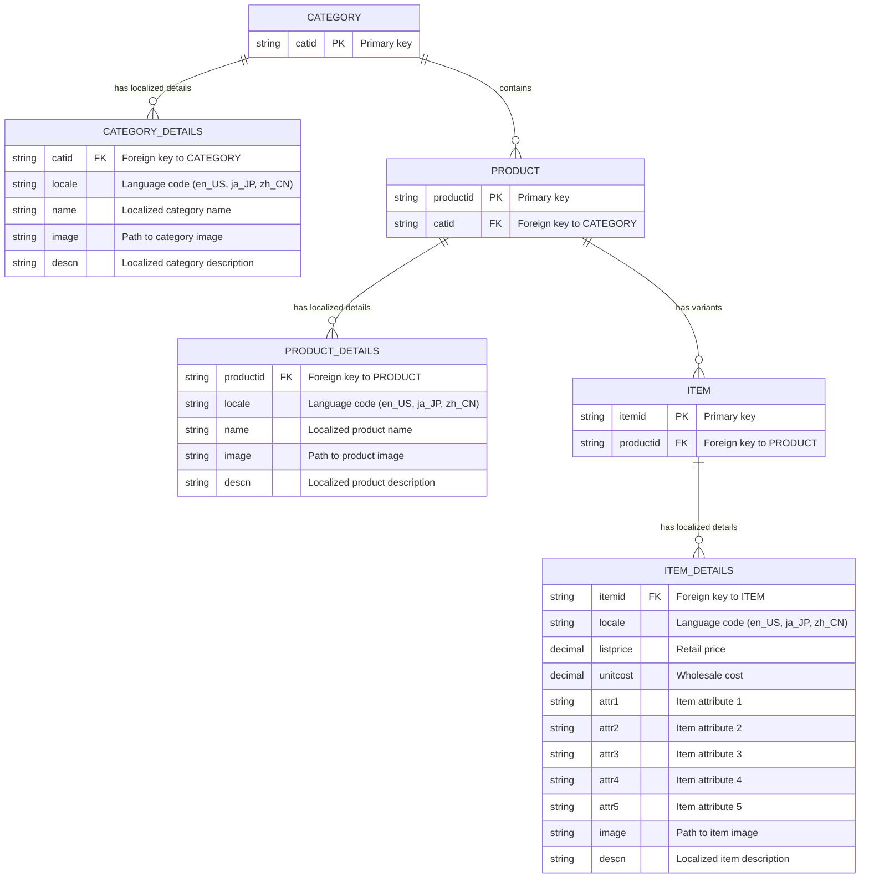
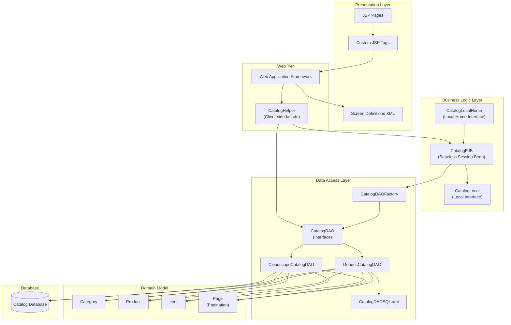
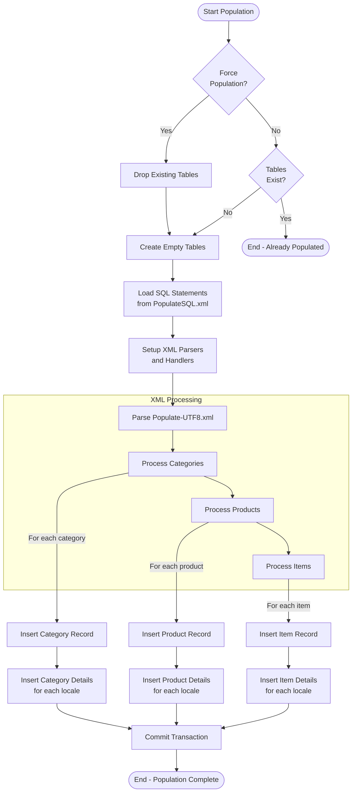
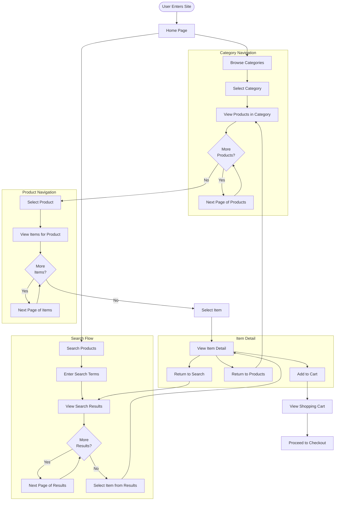

# Overview of Product Catalog Management in Java Pet Store

The Java Pet Store Demo 1.3.2 serves as a reference implementation for J2EE technologies, with product catalog management forming its core business function. The catalog system enables customers to browse, search, and view detailed information about pet products organized in a hierarchical structure. This system demonstrates best practices for implementing an e-commerce catalog using J2EE components including Enterprise JavaBeans (EJB), Java Server Pages (JSP), and database access patterns.

At its heart, the catalog management system provides a comprehensive set of features including category browsing, product listings, detailed item views, search capabilities, and internationalization support. The implementation showcases a clean separation of concerns through a multi-layered architecture that isolates presentation logic from business logic and data access. This modular design allows for flexibility in deployment, maintenance, and extension of the catalog functionality.

The catalog component serves as the foundation for other application features like shopping cart management and order processing. Its implementation demonstrates how to build a scalable, maintainable product catalog that can handle diverse product types, multiple languages, and efficient data retrieval patterns.

# Catalog Data Model Architecture

The catalog component in Java Pet Store implements a hierarchical domain model that organizes products in a logical structure familiar to e-commerce applications. This three-level hierarchy consists of Category, Product, and Item classes, each representing progressively more specific product information.

At the top level, the `Category` class represents broad product groupings such as "Fish," "Dogs," or "Cats." Categories serve as the entry point for catalog navigation and help organize the product catalog into manageable sections. Each category contains multiple products.

The middle tier consists of the `Product` class, which represents specific types of pets or pet products within a category. For example, the "Fish" category might contain products like "Goldfish" or "Angel Fish." Each product is identified by a unique ID and contains descriptive information including name and description.

At the most granular level, the `Item` class represents specific variants of a product available for purchase. Items include detailed attributes such as size, color, or other distinguishing characteristics, along with pricing information (list price and unit cost), inventory data, and image references. For example, a "Goldfish" product might have items for different sizes or colors of goldfish.

This domain model is implemented as a set of serializable Java classes with appropriate getter methods, making them suitable for transfer between application tiers. The model classes are deliberately kept simple, focusing on data representation rather than business logic, which is instead handled by the service layer. This clean separation facilitates maintenance and allows the model to be used across different application components.

# Product Catalog Entity Relationship Diagram



This entity relationship diagram illustrates the catalog's database schema design. The schema employs a pattern where core entities (CATEGORY, PRODUCT, ITEM) are separated from their localized details (CATEGORY_DETAILS, PRODUCT_DETAILS, ITEM_DETAILS). This separation enables efficient internationalization by storing language-specific content in separate tables with locale identifiers.

The relationships form a hierarchical structure where categories contain products, which in turn contain items. Each entity maintains its core identity in a base table while storing localized content in corresponding detail tables. This approach allows for efficient querying by language preference while maintaining referential integrity through foreign key constraints.

The schema also demonstrates careful normalization to minimize data redundancy while optimizing for the most common query patterns in catalog browsing and searching. The design balances normalization principles with practical performance considerations for an e-commerce application.

# Data Access Layer Implementation

The Java Pet Store catalog component implements the Data Access Object (DAO) pattern to abstract and encapsulate database access. This pattern provides a clean separation between the business logic and the underlying data storage mechanisms, allowing the application to switch database implementations without affecting the rest of the application.

At the core of this implementation is the `CatalogDAO` interface, which defines the contract for all catalog data access operations. This interface declares methods for retrieving categories, products, and items, as well as search functionality. All methods accept a `Locale` parameter to support internationalization and most collection-returning methods include pagination parameters (start and count).

The application provides multiple implementations of this interface:

1. `CloudscapeCatalogDAO`: A concrete implementation for Cloudscape (now Apache Derby) database. This class contains SQL queries specific to Cloudscape's dialect and handles the mapping between relational data and domain objects.

2. `GenericCatalogDAO`: A more flexible implementation that loads SQL statements from an XML configuration file (`CatalogDAOSQL.xml`). This approach allows for database portability by externalizing SQL statements and supporting different database dialects (Cloudscape and Oracle) through configuration.

The `CatalogDAOFactory` class implements the Factory pattern to instantiate the appropriate DAO implementation based on configuration stored in JNDI. This factory approach allows the application to be configured for different database backends without code changes.

The DAO implementations handle database connection management, SQL execution, and result set processing. They use JDBC prepared statements for secure and efficient database access and implement careful resource cleanup to prevent connection leaks. The implementations also provide pagination support through the `Page` class, which encapsulates collections of results with metadata about available pages.

This data access layer demonstrates J2EE best practices including separation of concerns, interface-based design, factory pattern usage, and externalized configuration. The design allows for database portability while providing optimized access patterns for catalog browsing and searching.

# Catalog Component Architecture



The diagram illustrates the multi-layered architecture of the catalog component in Java Pet Store. This architecture follows the Model-View-Controller (MVC) pattern and J2EE best practices for enterprise applications.

At the top, the Presentation Layer consists of JSP pages, custom tags, and screen definition XML files that define the user interface. The Web Application Framework (WAF) manages screen flow and template-based rendering.

The Web Tier includes the CatalogHelper class, which serves as a facade for catalog operations. This helper can access the catalog data either through the EJB (for transactional operations) or directly through the DAO (using the Fast Lane Reader pattern for read-only operations).

The Business Logic Layer contains the CatalogEJB, a stateless session bean that implements the business logic for catalog operations. It's accessed through local interfaces (CatalogLocal and CatalogLocalHome) and delegates data access to the DAO layer.

The Data Access Layer implements the DAO pattern with the CatalogDAO interface and multiple implementations. The CatalogDAOFactory creates the appropriate implementation based on configuration. The GenericCatalogDAO loads SQL statements from an XML configuration file for database portability.

The Domain Model consists of simple Java beans (Category, Product, Item) that represent the catalog data structure, along with the Page class for pagination support.

At the bottom, the Database stores the catalog data in a relational schema. The architecture allows for different database implementations through the DAO pattern.

This layered architecture provides separation of concerns, flexibility in implementation choices, and maintainability through well-defined interfaces between layers.

# Internationalization and Localization Support

The Java Pet Store catalog system implements comprehensive internationalization (i18n) and localization (l10n) support, enabling the application to serve content in multiple languages and adapt to regional preferences. This capability is built into the core architecture of the catalog system rather than added as an afterthought.

At the database level, the catalog implements a design pattern where each entity (Category, Product, Item) has a corresponding details table that stores language-specific content. For example, the `category_details` table contains localized names and descriptions for each category, with a `locale` column identifying the language. This approach allows efficient storage and retrieval of multilingual content without duplicating the core entity data.

The `DatabaseNames` utility class centralizes the management of table names with locale-specific suffixes. It provides methods like `getTableName(String tableName, Locale locale)` that append appropriate suffixes (`_ja` for Japanese, `_zh` for Chinese) to table names based on the requested locale. This abstraction shields the rest of the application from the details of how localized tables are named.

At the data access layer, all DAO methods accept a `Locale` parameter that determines which language version of the data to retrieve. The DAO implementations use this parameter to construct appropriate SQL queries that join with the correct localized detail tables. The `GenericCatalogDAO` implementation further enhances this by loading database-specific SQL from XML configuration files, allowing for dialect differences while maintaining the localization approach.

The presentation layer leverages the Web Application Framework's templating system to handle localized content. Screen definitions are organized in locale-specific XML files (e.g., `screendefinitions_en_US.xml`, `screendefinitions_ja_JP.xml`, `screendefinitions_zh_CN.xml`), allowing different layouts and content paths for each supported language. The framework automatically selects the appropriate definition based on the user's locale preference.

The application also includes localized resource bundles for UI elements, error messages, and other text content. These are loaded dynamically based on the user's locale settings, providing a consistent localized experience throughout the application.

The XML-based data population system supports multilingual content through the `Populate-UTF8.xml` file, which contains product data in English, Japanese, and Chinese. This allows the application to be initialized with a complete multilingual catalog from the start.

This comprehensive approach to internationalization demonstrates how enterprise applications can be designed from the ground up to support multiple languages and regional preferences, making the Pet Store accessible to a global audience.

# XML-Based Data Population

The Java Pet Store application employs a sophisticated XML-based approach for populating the catalog database with initial product data. This approach provides a clean, maintainable way to define catalog content separate from the application code, allowing for easy updates and localization of product information.

At the core of this system is the `Populate-UTF8.xml` file, which contains comprehensive definitions for categories, products, and items in multiple languages (English, Japanese, and Chinese). This XML file follows a structured format defined by a set of Document Type Definitions (DTDs) that enforce the proper hierarchy and required attributes for each entity type. The DTDs include `Category.dtd`, `Product.dtd`, `Item.dtd`, and their corresponding detail DTDs that define localized content structures.

The XML structure mirrors the database schema's hierarchical organization:
- Categories contain multiple products
- Products contain multiple items
- Each entity has localized details with language-specific content

The population process is managed by the `PopulateServlet`, which orchestrates the database initialization when invoked. This servlet works with a set of specialized populator classes:

1. `CatalogPopulator`: Coordinates the population of the entire catalog
2. `CategoryPopulator`: Handles category data
3. `ProductPopulator`: Handles product data
4. `ItemPopulator`: Handles item data

Each populator class is responsible for creating database tables, checking for existing data, and inserting new records. They use the `XMLDBHandler` class, a SAX-based XML parser, to process the XML data and execute corresponding SQL statements.

The SQL statements themselves are defined in `PopulateSQL.xml`, which contains database-specific SQL for both Cloudscape and Oracle databases. This separation allows the application to support multiple database platforms without changing the population logic or data format.

The population process follows these steps:
1. Load SQL statements from `PopulateSQL.xml` based on the target database type
2. Check if tables already exist; drop them if forced repopulation is requested
3. Create empty tables with appropriate schema
4. Parse the `Populate-UTF8.xml` file using SAX parsers with custom handlers
5. For each entity in the XML, execute the corresponding INSERT statements

This approach demonstrates best practices for data initialization in enterprise applications, providing a clean separation between data definition and database operations while supporting internationalization and database portability.

# Database Population Process Flow



This flowchart illustrates the database population process for the Java Pet Store catalog. The process begins with a decision point based on whether forced population is requested, which determines if existing tables should be dropped and recreated.

If forced population is not requested, the system checks if tables already exist. If they do, the process ends early since the database is already populated. Otherwise, it proceeds with table creation.

The system then loads SQL statements from the PopulateSQL.xml configuration file, which contains database-specific SQL for both schema creation and data insertion. These statements are organized by database type (Cloudscape or Oracle) and table name.

Next, the system sets up XML parsers and handlers for processing the catalog data. The PopulateServlet coordinates this process, creating a chain of XML filters for categories, products, and items.

During XML processing, the system parses the Populate-UTF8.xml file, which contains the complete catalog data in multiple languages. For each entity type (categories, products, items), the corresponding handler processes the XML elements and attributes.

For each category found in the XML, the system inserts a record in the category table and corresponding records in the category_details table for each supported locale (English, Japanese, Chinese). The same process is repeated for products and items, maintaining the hierarchical relationships between them.

After all data is inserted, the transaction is committed, and the population process completes. This structured approach ensures that the catalog database is consistently populated with multilingual product data, ready for use by the application.

# Search and Navigation Capabilities

The Java Pet Store catalog component implements sophisticated search and navigation capabilities that enable users to efficiently browse and find products. These features are essential for e-commerce applications where users need to quickly locate items of interest among potentially thousands of products.

The catalog's navigation system is built around the hierarchical organization of products. Users can browse from categories to products to individual items, with each level providing more specific information. This hierarchical navigation is implemented through a series of linked pages that maintain context as users drill down into the catalog.

The `CatalogDAO` interface provides methods specifically designed for this navigation pattern:
- `getCategories()` retrieves a list of top-level categories
- `getProducts(String categoryID, ...)` retrieves products within a specific category
- `getItems(String productID, ...)` retrieves items for a specific product

For direct access to specific entities, the DAO also provides methods like `getCategory()`, `getProduct()`, and `getItem()` that accept unique identifiers.

Search functionality is implemented through the `searchItems()` method in the `CatalogDAO` interface. This method accepts a query string and returns items matching the search criteria. The implementation in `GenericCatalogDAO` and `CloudscapeCatalogDAO` tokenizes the search query and constructs SQL with multiple LIKE clauses to search across item names, descriptions, and attributes. This provides flexible text-based search capabilities.

A key feature of both browsing and search is pagination support. All methods that return collections accept `start` and `count` parameters to specify which subset of results to return. Results are encapsulated in a `Page` object that includes not only the requested items but also metadata about whether previous and next pages are available. This pagination approach enables efficient handling of large result sets without overwhelming the user interface or consuming excessive server resources.

The `CatalogHelper` class in the web tier provides a simplified interface for JSP pages to access these navigation and search capabilities. It offers both EJB-based and direct DAO access methods, allowing the application to choose the most efficient approach based on the operation.

Together, these features create a responsive, user-friendly catalog experience that balances performance with functionality, demonstrating best practices for implementing navigation and search in enterprise e-commerce applications.

# Presentation Layer Integration

The Java Pet Store catalog's presentation layer leverages the Web Application Framework (WAF) to create a flexible, template-based user interface. This framework implements a sophisticated approach to screen composition that separates layout structure from content, enabling consistent presentation across the application while supporting multiple languages and easy customization.

At the core of this integration is the screen definition system, implemented through XML configuration files like `screendefinitions_en_US.xml`, `screendefinitions_ja_JP.xml`, and `screendefinitions_zh_CN.xml`. These files define logical screens (such as "main", "category", "product", "item") and map them to specific JSP components for different parts of the page layout including title, banner, sidebar, body content, and footer.

The WAF uses a template-based approach where a master template JSP (typically `template.jsp`) defines the overall page structure with placeholders for content. The `InsertTag` custom JSP tag then dynamically includes the appropriate content based on the current screen definition. This approach implements the Composite View pattern, allowing complex pages to be assembled from reusable components.

```jsp
<template:insert parameter="banner"/>
<template:insert parameter="sidebar"/>
<template:insert parameter="body"/>
<template:insert parameter="footer"/>
```

For catalog-specific functionality, the presentation layer uses the `CatalogHelper` class as a facade to access catalog data. This helper class provides methods for retrieving categories, products, items, and search results, handling pagination, and managing state between requests. JSP pages interact with this helper through standard JavaBeans patterns, setting properties and invoking methods to retrieve data for display.

```jsp
<jsp:useBean id="catalogHelper" class="com.sun.j2ee.blueprints.catalog.client.CatalogHelper" scope="request"/>
<jsp:setProperty name="catalogHelper" property="categoryId" value="<%= categoryId %>"/>
```

The presentation layer also implements internationalization through locale-specific resource bundles and content paths. The WAF automatically selects the appropriate screen definitions and resources based on the user's locale preference, ensuring a consistent localized experience.

This integration demonstrates best practices for web application architecture, including:
- Separation of concerns between layout and content
- Template-based page composition
- Reusable UI components
- Internationalization support
- Clean integration with business logic through helper classes

The result is a flexible, maintainable presentation layer that provides a consistent user experience while allowing for customization and localization.

# Catalog Browse and Search User Flow



This diagram illustrates the user flow for browsing and searching the product catalog in the Java Pet Store application. The flow begins when a user enters the site and is presented with the home page, which offers two primary navigation paths: browsing categories or searching for products.

In the category navigation flow, users browse through the available product categories (such as Fish, Dogs, Cats, etc.). After selecting a category, they view a paginated list of products within that category. The pagination controls allow users to navigate through multiple pages of products if the category contains more items than fit on a single page.

Once users select a specific product, they enter the product navigation flow, where they can view the individual items available for that product. Again, pagination is available if there are many items. For example, after selecting "Goldfish" as a product, users might see different varieties or sizes of goldfish as individual items.

The search flow provides an alternative navigation path. Users can enter search terms to find specific products across categories. The search results are displayed in a paginated list, allowing users to browse through all matching items. From the search results, users can select individual items to view their details.

Both navigation paths converge at the item detail view, where users can see comprehensive information about a specific item, including description, price, attributes, and images. From this detail view, users have several options: they can add the item to their shopping cart, return to the product listing, or return to their search results.

If users add an item to their cart, they can view the cart contents and proceed to checkout, transitioning from catalog browsing to the order processing flow.

This user flow demonstrates how the catalog component's architecture supports flexible navigation patterns while maintaining context and providing efficient access to product information. The pagination support ensures good performance even with large catalogs, and the dual navigation paths (browse and search) accommodate different user preferences for finding products.

[Generated by the Sage AI expert workbench: 2025-03-29 21:37:00  https://sage-tech.ai/workbench]: #