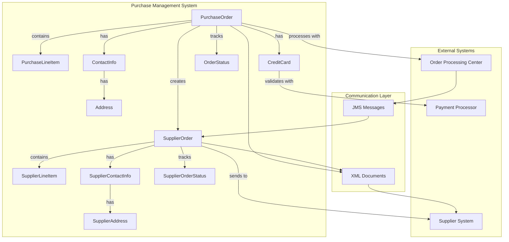
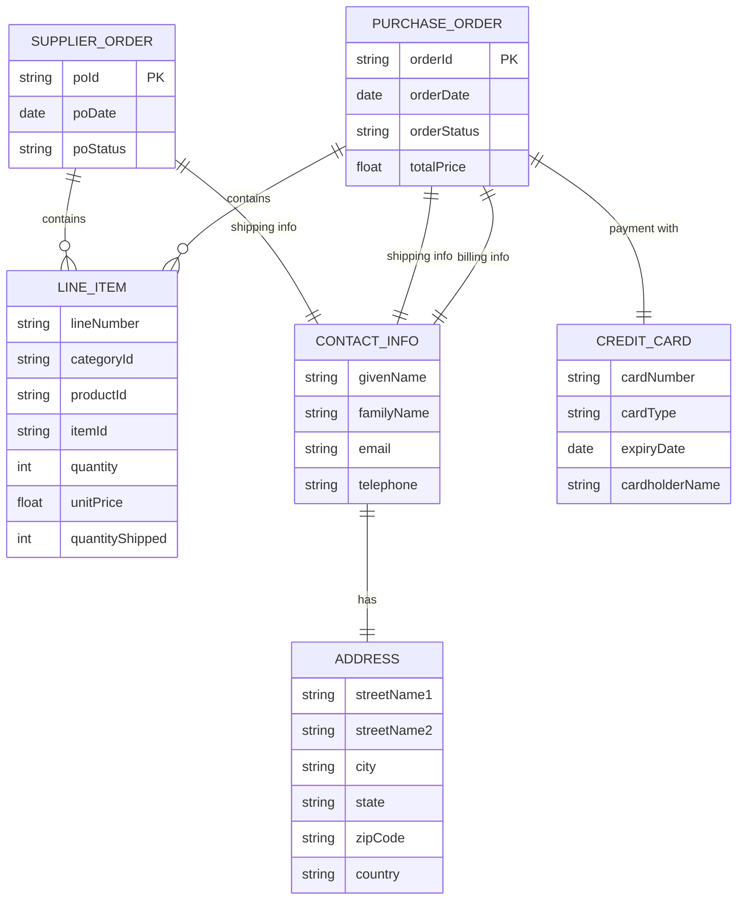
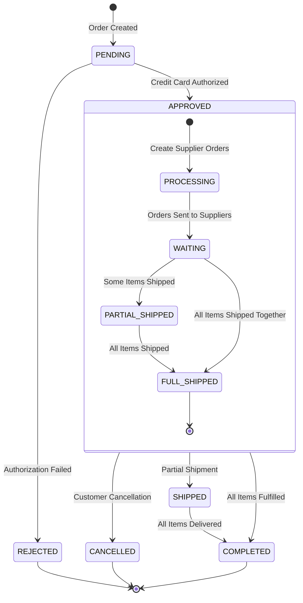
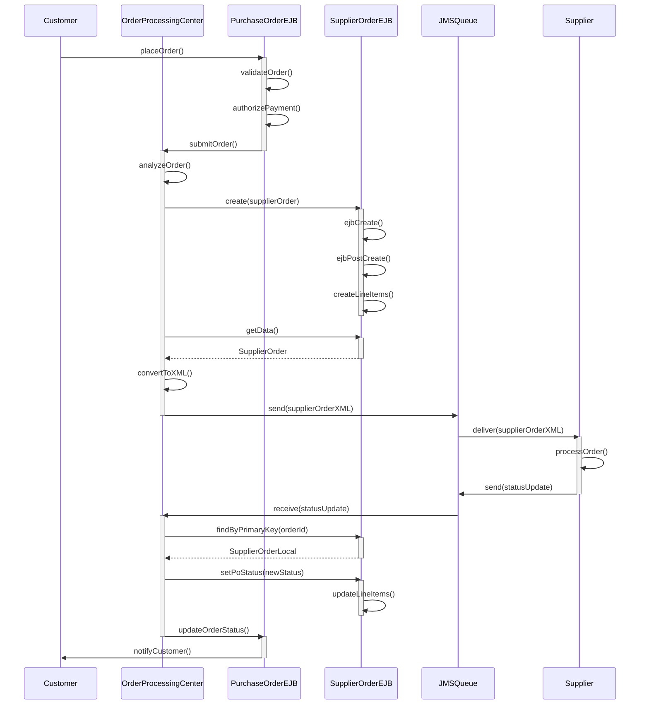
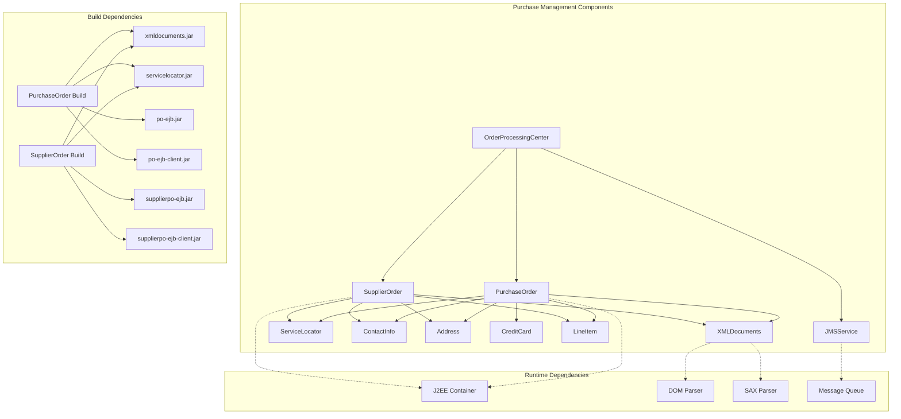

# Purchase Management in Java Pet Store

## Purchase Management Overview

Purchase management in the Java Pet Store application is a critical component that handles the entire lifecycle of customer orders and supplier procurement. It serves as the backbone of the e-commerce transaction flow, managing both customer-facing purchase orders and the backend supplier orders needed to fulfill customer requests. The system implements a comprehensive workflow that begins when a customer places an order and continues through order processing, supplier notification, inventory management, and ultimately order fulfillment. This component demonstrates J2EE best practices for handling complex business transactions, maintaining data integrity through container-managed relationships, and facilitating system integration through XML-based data exchange. The purchase management system showcases how enterprise applications can effectively coordinate multiple business processes while maintaining separation of concerns between different architectural layers.

## Purchase Management Architecture

The Purchase Management Architecture diagram illustrates the key components involved in handling orders in the Java Pet Store application. At its core are two main entities: PurchaseOrder (for customer orders) and SupplierOrder (for orders sent to suppliers). These entities maintain relationships with supporting components like LineItems, ContactInfo, and Address objects. The architecture implements a clear separation between customer-facing order processing and supplier communication, with XML documents serving as the integration mechanism between these systems. The diagram also shows how JMS messaging is used for asynchronous communication between the Order Processing Center and the supplier order management system, enabling loosely coupled and reliable transaction processing.

## Order Data Model

The purchase management system in Java Pet Store is built around several core data structures that work together to represent and process orders. At the center of this model are two primary entities: PurchaseOrder and SupplierOrder.

The PurchaseOrder entity represents customer orders and contains essential information such as a unique order ID, order date, order status, billing and shipping addresses, payment information (credit card details), and a collection of line items. Each line item in a purchase order includes details about the product being ordered (category ID, product ID, item ID), quantity, and unit price. The PurchaseOrder status tracks the order through various states including pending, approved, shipped, and completed.

The SupplierOrder entity represents orders sent to suppliers to fulfill customer requests. It contains a supplier order ID, order date, order status, shipping information, and a collection of line items. The supplier order status tracks states like pending, sent, and fulfilled. This separation between customer orders and supplier orders allows the system to manage the procurement process independently from customer order processing.

Both order types are associated with ContactInfo objects that contain customer or supplier contact details including name, email, telephone, and address information. The Address entity stores structured address data with fields for street, city, state, zip code, and country.

The LineItem entity is used by both order types to represent individual items being purchased, with fields for product identification, quantity, and pricing. For supplier orders, additional fields track the quantity shipped to manage partial fulfillments.

All these entities are implemented as Enterprise JavaBeans with container-managed persistence (CMP) and container-managed relationships (CMR), allowing the J2EE container to handle database persistence and relationship management automatically.

## Entity Relationships in Purchase Management

The Entity Relationships diagram illustrates the data model for the purchase management system in Java Pet Store. The diagram shows how different entities are connected and their cardinality relationships. A PurchaseOrder has one-to-many relationship with LineItems, representing multiple products in a single order. Each PurchaseOrder is associated with exactly one ContactInfo object for billing and another for shipping (when they differ), demonstrating a one-to-one relationship. Similarly, each PurchaseOrder has exactly one CreditCard for payment processing.

The ContactInfo entity has a one-to-one relationship with Address, storing the structured location data. SupplierOrder follows a similar pattern, with one-to-many relationship to LineItems and one-to-one relationship with ContactInfo for shipping details.

The diagram also shows the key attributes of each entity. These relationships are implemented in the Java Pet Store application using container-managed relationships (CMR) in the EJB framework, which handles the database mapping and referential integrity. The cascade-delete relationships ensure that when a parent entity is removed (like a PurchaseOrder), all its dependent entities (like LineItems) are automatically deleted as well, maintaining data integrity throughout the system.

## Transaction Processing Flow

The purchase management system in Java Pet Store implements a comprehensive transaction flow that begins with order creation and continues through fulfillment. When a customer completes checkout, the system creates a PurchaseOrder entity with initial status "PENDING". This triggers a series of validation steps, including inventory verification and credit card authorization.

Once validated, the order status changes to "APPROVED", and the system initiates the fulfillment process. At this point, the Order Processing Center (OPC) component analyzes the order to determine which suppliers can fulfill the requested items. For each supplier, the system creates a SupplierOrder entity containing the relevant line items. These supplier orders are initially set to "PENDING" status.

The supplier orders are then converted to XML documents using the SupplierOrder.toXML() method and transmitted to the appropriate supplier systems. The XML format ensures interoperability with various supplier systems regardless of their internal implementation. As suppliers process these orders, they send status updates back to the Pet Store system.

The OPC component monitors supplier order status through JMS messages. When a supplier fulfills an order (partially or completely), the corresponding SupplierOrder status is updated to "SHIPPED" or "COMPLETED", and the quantityShipped field in each LineItem is updated accordingly. The OPC aggregates these updates to determine the overall status of the customer's PurchaseOrder.

When all line items in a customer order have been fulfilled, the PurchaseOrder status changes to "COMPLETED", and the customer is notified. If issues arise during processing, such as inventory shortages or payment problems, the system can transition orders to special states like "CANCELLED" or "ON_HOLD" and trigger appropriate exception handling procedures.

Throughout this process, the system maintains transactional integrity using the J2EE container's transaction management capabilities, ensuring that database operations are atomic, consistent, isolated, and durable (ACID compliant).

## Purchase Order Lifecycle

This state diagram illustrates the lifecycle of a purchase order in the Java Pet Store application. When a customer places an order, it enters the PENDING state while the system validates inventory availability and processes payment authorization. If the credit card authorization fails, the order transitions to REJECTED state. If authorization succeeds, the order moves to APPROVED state.

Within the APPROVED state, the order goes through several sub-states. First, it enters PROCESSING as the system creates supplier orders for the requested items. Once these supplier orders are sent, the order moves to WAITING state. As suppliers begin shipping items, the order may transition to PARTIAL_SHIPPED if only some items have been shipped, or directly to FULL_SHIPPED if all items are shipped simultaneously. Once all items are shipped, the order exits the APPROVED composite state.

From APPROVED state, the order can transition to SHIPPED when items begin shipping to the customer, and then to COMPLETED when all items are delivered. Alternatively, the customer may cancel the order at any point while it's in APPROVED state, moving it to CANCELLED.

The terminal states in this lifecycle are REJECTED, CANCELLED, and COMPLETED. This state management is implemented in the Java Pet Store application through status fields in the PurchaseOrder and SupplierOrder entities, with business logic controlling the transitions between states based on events in the system.

## XML Integration for Orders

The Java Pet Store application employs XML as a key integration mechanism for exchanging purchase order data with external systems, particularly suppliers. This approach provides a standardized, platform-independent format for data exchange that decouples the internal data model from external system requirements.

The SupplierOrder class demonstrates sophisticated XML handling capabilities, implementing both serialization (Java objects to XML) and deserialization (XML to Java objects) methods. These methods use DOM (Document Object Model) and SAX (Simple API for XML) processing techniques to convert between object representations and XML documents.

For serialization, the SupplierOrder.toXML() method converts the object hierarchy into a structured XML document that conforms to a predefined DTD (Document Type Definition). This method handles complex nested structures, including contact information and line items, ensuring that all relevant data is properly encoded. The XML document includes elements for order ID, order date, shipping information, and line items, with appropriate formatting for dates and numeric values.

For deserialization, the static SupplierOrder.fromXML() method parses XML documents to reconstruct SupplierOrder objects. This method validates incoming XML against the DTD schema to ensure data integrity and uses DOM traversal to extract values and populate object fields. The implementation handles error conditions gracefully, providing meaningful exceptions when parsing fails.

The XML integration also supports different output targets (such as Result objects or Strings) and input sources (such as Source objects or String buffers), making it flexible for various integration scenarios. The system uses a consistent date format (yyyy-MM-dd) for XML serialization to ensure interoperability.

This XML-based approach enables the Pet Store application to communicate with diverse supplier systems without requiring tight coupling or shared technology stacks. It also provides a clear audit trail of order data as it moves between systems, facilitating troubleshooting and compliance requirements.

## Container-Managed Relationships

The Java Pet Store's purchase management system leverages EJB container-managed relationships (CMR) to maintain data integrity between purchase orders and related entities. This approach delegates the responsibility of relationship management to the J2EE container, reducing development complexity and ensuring consistent data operations.

In the SupplierOrder component, the ejb-jar.xml deployment descriptor defines several key relationships. The SupplierOrder entity has a one-to-one relationship with ContactInfo, implemented as a unidirectional relationship where SupplierOrder references ContactInfo but not vice versa. This relationship includes a cascade-delete configuration, ensuring that when a SupplierOrder is deleted, its associated ContactInfo is automatically removed as well.

Similarly, ContactInfo has a one-to-one relationship with Address, also configured with cascade-delete. This creates a hierarchy of dependent objects where deleting a parent object (SupplierOrder) triggers the deletion of all its children (ContactInfo and Address), maintaining referential integrity.

The SupplierOrder entity also has a one-to-many relationship with LineItem entities, represented as a Collection in the Java code. This relationship is also unidirectional with cascade-delete, allowing a single SupplierOrder to contain multiple LineItems while ensuring they are properly managed throughout their lifecycle.

In the implementation code, these relationships are accessed through abstract getter and setter methods in the EJB classes. For example, the SupplierOrderEJB class includes methods like getContactInfo(), setContactInfo(), getLineItems(), and addLineItem() that operate on the container-managed relationships. The container automatically handles the underlying database operations to maintain these relationships.

This approach provides several benefits: it simplifies the code by eliminating the need for explicit SQL join operations, ensures consistent relationship management across the application, and improves performance through container-optimized data access patterns. It also enables the application to leverage advanced features like lazy loading of related entities and optimistic concurrency control.

## Supplier Order Processing Sequence

This sequence diagram illustrates the interaction flow during supplier order processing in the Java Pet Store application. The process begins when a customer places an order, which is validated and submitted to the Order Processing Center (OPC). The OPC analyzes the order and creates one or more SupplierOrder entities through the SupplierOrderEJB, which handles the creation of associated line items and contact information.

Once the supplier order is created, the OPC retrieves the order data and converts it to XML format for transmission. The XML order is sent to a JMS queue, which delivers it to the appropriate supplier system. This asynchronous messaging approach decouples the Pet Store application from supplier systems, allowing for reliable communication even when supplier systems are temporarily unavailable.

When the supplier processes the order, it sends status updates back through the JMS queue. The OPC receives these updates and locates the corresponding SupplierOrder using its primary key. It then updates the order status and line item information to reflect the supplier's response. Based on these updates, the OPC also updates the status of the original customer purchase order and notifies the customer of any significant changes.

This sequence demonstrates how the Java Pet Store application uses EJB components, JMS messaging, and XML data exchange to implement a robust, loosely coupled supplier order processing workflow. The design allows for scalable, reliable communication with multiple suppliers while maintaining data integrity throughout the process.

## Transaction Management and Persistence

The purchase management system in Java Pet Store employs J2EE's container-managed transaction (CMT) capabilities to ensure data consistency throughout the order processing workflow. This approach delegates transaction demarcation and management to the EJB container, allowing developers to focus on business logic rather than transaction handling details.

In the ejb-jar.xml deployment descriptor for the SupplierOrder component, each method is configured with appropriate transaction attributes. Most methods use the "Required" transaction attribute, which ensures they execute within a transaction context—either joining an existing transaction if one is present or creating a new transaction if necessary. This configuration is particularly important for methods that modify data, such as creating orders, updating status fields, or managing relationships between entities.

The persistence layer leverages container-managed persistence (CMP) for entity beans, which automates the mapping between Java objects and database tables. The deployment descriptor defines abstract schema names (like "SupplierOrder" and "LineItem") that the container maps to database tables. It also specifies container-managed fields that correspond to database columns, such as "poId", "poDate", and "poStatus" for the SupplierOrder entity.

For complex queries, the system uses EJB-QL (EJB Query Language), as demonstrated by the "findOrdersByStatus" query in the SupplierOrderEJB. This query allows the application to retrieve orders based on their current status, facilitating order tracking and reporting.

The transaction management system handles various scenarios that could affect data integrity:

1. When creating a new order, all associated entities (contact information, address, line items) are created within the same transaction, ensuring they are either all committed or all rolled back.

2. When updating order status, the transaction ensures that status changes are atomic and consistent across related entities.

3. For operations that span multiple components (like order processing that involves both customer orders and supplier orders), the container propagates the transaction context appropriately.

This comprehensive transaction management approach ensures that the purchase management system maintains data consistency even in the face of concurrent access, system failures, or processing errors.

## Error Handling in Purchase Processing

The Java Pet Store's purchase management system implements a robust error handling strategy to maintain system stability and provide appropriate feedback when issues arise during order processing. This strategy operates at multiple levels, from low-level exception handling to high-level status management.

At the foundational level, the system uses Java exceptions to capture and manage error conditions. For example, in the SupplierOrderEJB class, the ejbPostCreate method catches ServiceLocatorException and wraps it in a CreateException with additional context information, making it easier to diagnose the root cause of failures during order creation. Similarly, the XML processing methods in the SupplierOrder class use XMLDocumentException to encapsulate various XML-related errors that might occur during serialization or deserialization.

Beyond basic exception handling, the purchase management system uses status codes to track and communicate error conditions throughout the order lifecycle. Both PurchaseOrder and SupplierOrder entities include status fields that can reflect error states such as "REJECTED" (for failed payment authorization) or "CANCELLED" (for orders that cannot be fulfilled due to inventory issues). These status values provide a business-level view of errors that is more meaningful than technical exceptions.

For integration with external systems, the application employs defensive programming techniques when processing incoming XML data. The fromXML and fromDOM methods in the SupplierOrder class validate incoming data against a DTD schema and include error handling for malformed dates and missing elements. This approach prevents corrupt or incomplete data from entering the system.

The transaction management configuration in ejb-jar.xml ensures that database operations maintain ACID properties even when errors occur. By using container-managed transactions with appropriate attributes, the system can automatically roll back changes when exceptions are thrown, preserving data integrity.

For operational monitoring, the application includes trace flags and logging statements that can be enabled to provide detailed information about processing steps and error conditions. This facilitates troubleshooting in production environments without requiring code changes.

This multi-layered approach to error handling ensures that the purchase management system can detect, report, and recover from various error conditions while maintaining data consistency and providing meaningful feedback to users and administrators.

## Purchase Management Component Dependencies

This diagram illustrates the component dependencies within the Purchase Management system of Java Pet Store. The components are organized into three main categories: Purchase Management Components (showing logical dependencies), Runtime Dependencies (showing execution environment dependencies), and Build Dependencies (showing compilation and packaging dependencies).

In the Purchase Management Components section, we see that both PurchaseOrder and SupplierOrder depend on shared components like XMLDocuments (for XML serialization/deserialization), ServiceLocator (for JNDI lookups), and domain entities like ContactInfo, Address, CreditCard, and LineItem. The OrderProcessingCenter component orchestrates the workflow between customer orders and supplier orders, and depends on JMSService for asynchronous messaging.

The Runtime Dependencies section shows how these components interact with the underlying infrastructure. Both PurchaseOrder and SupplierOrder run within the J2EE Container, which provides services like transaction management and persistence. The XMLDocuments component relies on DOM and SAX parsers for XML processing, while the JMS service depends on a Message Queue implementation.

The Build Dependencies section illustrates how the components are packaged during the build process. Both PurchaseOrder and SupplierOrder builds depend on pre-built JAR files for XMLDocuments and ServiceLocator. Each component produces both a server-side EJB JAR (containing implementation classes) and a client JAR (containing interfaces and transfer objects). This separation allows client applications to interact with the purchase management system without needing access to the implementation details.

This comprehensive dependency structure demonstrates how the Java Pet Store application uses modular design and clear separation of concerns to create a maintainable and extensible purchase management system.

[Generated by the Sage AI expert workbench: 2025-03-29 21:37:00  https://sage-tech.ai/workbench]: #