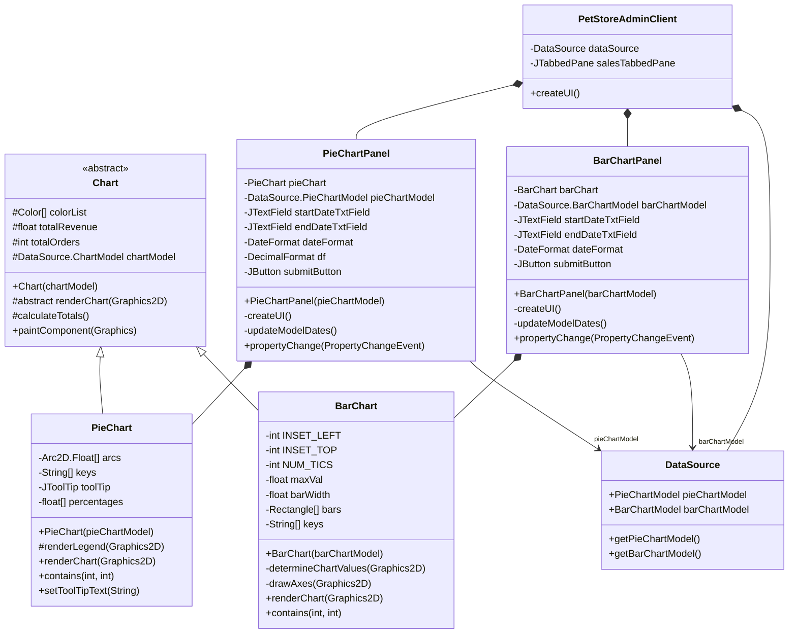
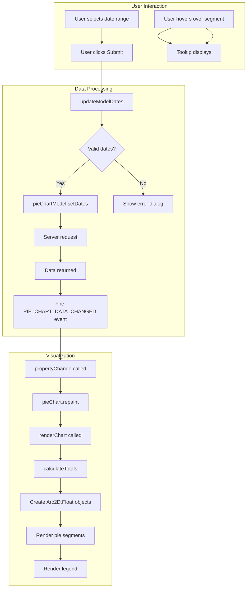
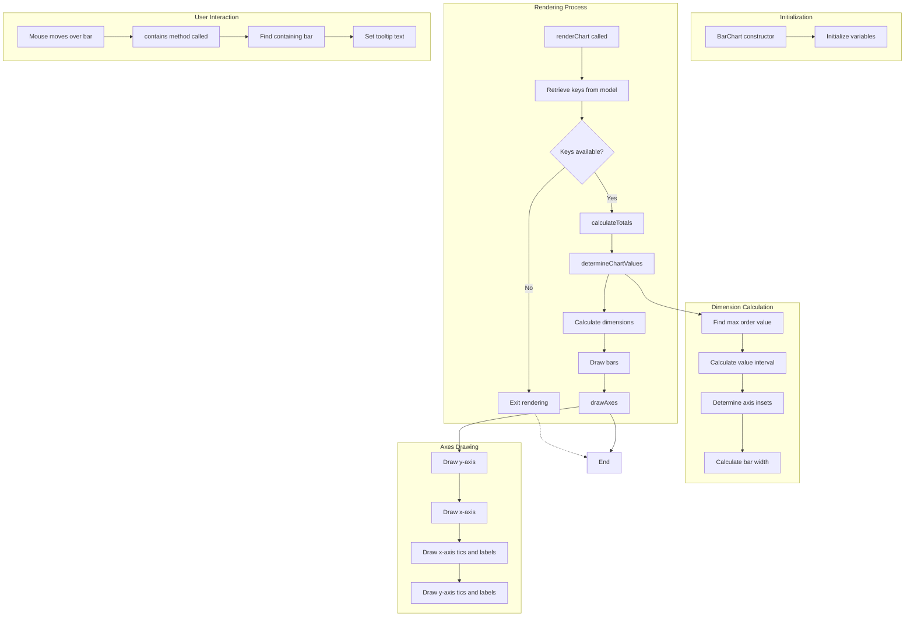
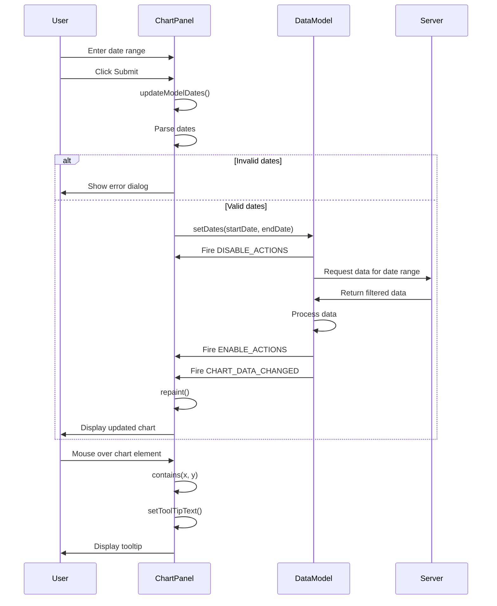

# Overview of Sales Analytics in Java Pet Store

The sales analytics functionality in the Java Pet Store admin application serves as a critical business intelligence tool for monitoring the performance of the online pet store. This component provides administrators with visual representations of sales data through interactive charts, enabling them to make informed business decisions. The analytics module is integrated into the admin dashboard and offers two primary visualization methods: pie charts for category-based sales percentage analysis and bar charts for tracking order counts across time periods. These visualizations allow administrators to identify sales trends, compare performance across product categories, and monitor business growth over customizable date ranges. The sales analytics functionality represents a key administrative capability that transforms raw sales data into actionable insights through an intuitive graphical interface.

# Architecture of the Sales Analytics Module

The sales analytics module in Java Pet Store follows a well-structured component architecture that separates visualization, data handling, and user interaction concerns. At the core of this architecture is the abstract `Chart` class, which defines the common behavior and properties for all chart types. This class establishes a foundation for rendering visualizations and calculating data totals, while delegating specific rendering logic to concrete implementations.

Two specialized visualization components extend this abstract class: `PieChartPanel` and `BarChartPanel`. Each implements its own rendering strategy and user interaction handling while maintaining a consistent interface. These components communicate with the `DataSource` class, which serves as a mediator between the UI components and the server-side data. The `DataSource` provides specialized models (`PieChartModel` and `BarChartModel`) that encapsulate the data retrieval logic and expose the necessary methods for the chart components to access sales information.

The `PetStoreAdminClient` class orchestrates the integration of these components into the admin dashboard through a tabbed interface, allowing administrators to switch between different visualization types. This architecture employs the PropertyChangeListener pattern extensively to maintain synchronization between the data models and visual components, ensuring that changes in the underlying data are immediately reflected in the UI. The separation of concerns in this architecture allows for easy maintenance and potential extension with additional chart types in the future.

# Pie Chart Visualization

The `PieChartPanel` implementation provides a sophisticated visualization of category-based sales percentages in the Java Pet Store admin application. This component transforms raw sales data into an intuitive circular representation where each segment's size corresponds to the relative percentage of sales for a particular product category. The implementation leverages Java's 2D graphics capabilities through the `Arc2D.Float` class to render precise pie segments with distinct colors from a predefined palette.

A key feature of the pie chart visualization is its interactive nature. When administrators hover over a segment, a tooltip appears displaying the exact category name and percentage value, formatted to two decimal places for precision. This interactivity enhances the user experience by providing detailed information without cluttering the visual representation.

The panel includes date range filtering functionality through text fields that accept dates in MM/dd/yyyy format. When administrators modify these dates and click the submit button, the `updateModelDates()` method validates the input and updates the underlying `PieChartModel`. This triggers a server request for data within the specified date range, and the chart automatically refreshes to display the new information.

The implementation employs the PropertyChangeListener pattern to maintain synchronization between the data model and visual representation. When the model signals that new data is available through the `PIE_CHART_DATA_CHANGED` property, the chart repaints itself to reflect the updated information. This architecture ensures a responsive user interface that accurately represents the current state of the data.

# Bar Chart Visualization

The `BarChartPanel` implementation offers a detailed examination of order counts across product categories over specified time periods. Unlike the pie chart that focuses on proportional representation of sales percentages, the bar chart provides a quantitative visualization that allows administrators to compare absolute order volumes between different product categories. This approach is particularly valuable for identifying high-performing product lines and tracking changes in ordering patterns.

The implementation meticulously handles the complexities of rendering a professional-quality bar chart. The `determineChartValues()` method dynamically calculates appropriate scaling factors based on the maximum order count in the dataset, ensuring that the visualization remains meaningful regardless of the range of values present. The chart automatically adjusts its dimensions, including the width of bars and spacing between them, to accommodate the number of categories being displayed.

A distinguishing feature of the bar chart is its comprehensive axis system. The `drawAxes()` method creates both x and y axes with properly positioned tic marks and labels. The x-axis displays category names, while the y-axis shows order count values at regular intervals. This provides crucial context for interpreting the data and makes the visualization self-contained.

The bar chart also implements interactive tooltips that display the exact order count when hovering over a specific bar. Each bar is rendered with a 3D effect using the `fill3DRect()` method, enhancing visual appeal while maintaining clarity. The bars are colored according to the same consistent palette used throughout the analytics module, creating a cohesive visual language across different chart types.

Like the pie chart, the bar chart panel includes date range filtering capabilities and leverages the PropertyChangeListener pattern to stay synchronized with its underlying data model. This ensures that administrators always see the most current representation of the order data for their selected time period.

# Data Model Integration

The Chart components in the Java Pet Store admin application integrate with specialized DataSource models through a well-designed abstraction layer that separates visualization logic from data retrieval. This integration is centered around the `DataSource.ChartModel` interface, which defines common methods for accessing sales data, and its two concrete implementations: `PieChartModel` and `BarChartModel`.

The `Chart` abstract class maintains a reference to a `ChartModel` instance, allowing derived chart classes to access data through a consistent interface. This design enables the charts to remain agnostic about the specific data retrieval mechanisms while still being able to access the necessary information for visualization. The `calculateTotals()` method in the `Chart` class demonstrates this approach by iterating through data keys provided by the model to compute aggregate values without knowing the underlying data source.

When chart panels need to update their data, they communicate with their respective models through well-defined methods like `setDates()`, which triggers asynchronous data retrieval from the server. The models handle all the complexities of server communication, data parsing, and caching, presenting the charts with ready-to-use data structures. This separation of concerns allows the visualization components to focus solely on rendering and user interaction.

The data models also implement a notification system using the PropertyChangeListener pattern. When new data is retrieved from the server, the models fire events such as `PIE_CHART_DATA_CHANGED` or `BAR_CHART_DATA_CHANGED`, which the chart panels listen for and respond to by updating their visual representations. This event-driven approach ensures that the UI remains responsive and consistent with the underlying data.

The integration also handles error conditions gracefully. If server communication fails or returns invalid data, the models can notify the UI components through the same event system, allowing them to display appropriate error messages or fallback visualizations. This robust error handling ensures a smooth user experience even when network or server issues occur.

# User Interaction and Date Filtering

The sales analytics module in the Java Pet Store admin application provides a sophisticated date filtering mechanism that empowers administrators to analyze sales data for specific time periods. This functionality is implemented consistently across both the pie chart and bar chart panels, offering a unified user experience for temporal data analysis.

The date filtering interface consists of two text fields for specifying start and end dates, accompanied by a submit button to trigger the data refresh. The text fields accept dates in the MM/dd/yyyy format, which is enforced through the `SimpleDateFormat` class. When administrators enter dates and click submit, the `updateModelDates()` method performs validation to ensure the input can be parsed as valid dates. If validation fails, a dialog box appears with an appropriate error message, guiding the user to correct their input.

Upon successful validation, the date range is passed to the underlying chart model through the `setDates()` method. This triggers an asynchronous request to the server for data within the specified time period. During this request, the UI temporarily disables interactive elements through the `DISABLE_ACTIONS` property change event, preventing users from initiating conflicting operations. Once the data is retrieved, the `ENABLE_ACTIONS` event re-enables these elements, and the appropriate chart-specific event (e.g., `PIE_CHART_DATA_CHANGED`) triggers the visualization update.

This date filtering capability allows administrators to perform various analytical tasks, such as comparing sales performance across different time periods, identifying seasonal trends, or evaluating the impact of marketing campaigns. The consistent implementation across chart types enables users to switch between different visualizations while maintaining their selected time context, facilitating multi-dimensional analysis of the same data period.

# Event Handling and UI Updates

The sales analytics module in Java Pet Store employs a sophisticated event handling system based on the PropertyChangeListener pattern to synchronize UI components when underlying data changes or user actions occur. This event-driven architecture ensures that the visual representation remains consistent with the data model and provides a responsive user experience.

At the core of this system is the implementation of the `PropertyChangeListener` interface by both the `PieChartPanel` and `BarChartPanel` classes. These components register themselves with the `DataSource` to receive notifications about specific events. The event types are defined as string constants in the `DataSource` class, creating a clear contract between the data provider and consumers.

Three primary event types drive the UI updates in the sales analytics module:

1. `PIE_CHART_DATA_CHANGED` and `BAR_CHART_DATA_CHANGED`: These events signal that new data is available for the respective chart types. When these events occur, the corresponding panel's `propertyChange()` method triggers a repaint of the chart component, refreshing the visualization with the updated data.

2. `DISABLE_ACTIONS`: This event is fired when a potentially long-running operation begins, such as retrieving data from the server. The panels respond by disabling their submit buttons, preventing users from initiating conflicting operations.

3. `ENABLE_ACTIONS`: Fired when operations complete, this event triggers the re-enabling of interactive UI elements, allowing users to continue their analysis.

The event handling system also extends to user interactions with the charts. Both chart implementations override the `contains()` method to detect when the mouse hovers over specific chart elements (pie segments or bars). When such interactions occur, the charts dynamically update their tooltips to display relevant data values, enhancing the information density of the visualization without cluttering the display.

This comprehensive event handling approach creates a fluid, interactive experience where the UI automatically adapts to both data changes and user actions, maintaining a consistent state across all components of the sales analytics module.

# Integration with Admin Dashboard

The sales analytics components are seamlessly integrated into the broader Java Pet Store admin interface through a sophisticated tabbed pane architecture and toggle action system. This integration allows administrators to access sales visualizations within the same application they use for order management, providing a unified administrative experience.

The `PetStoreAdminClient` class serves as the orchestrator for this integration, managing the lifecycle and visibility of the sales analytics components. It creates a dedicated `JTabbedPane` named `salesTabbedPane` that contains both the pie chart and bar chart panels, allowing administrators to switch between different visualization types while remaining in the sales analytics context.

The admin dashboard implements a toggle mechanism through custom `AbstractItemAction` subclasses (`OrdersAction` and `SalesAction`) that control the visibility of major functional areas. When an administrator clicks the sales toggle button in the toolbar or selects the corresponding menu item, the `SalesAction.actionPerformed()` method executes, removing the orders panel from view and displaying the sales analytics tabbed pane. This implementation uses `SwingUtilities.invokeLater()` to ensure thread safety when modifying the UI.

The toggle actions maintain their state through a ButtonGroup that ensures only one functional area is active at a time. The `ToggleActionPropertyChangeListener` class synchronizes the state of all UI components associated with a particular action, ensuring that toolbar buttons and menu items remain consistent.

The integration also extends to the application's resource management and internationalization system. All text displayed in the sales analytics components is retrieved through the `getString()` method, which loads localized strings from a resource bundle. This approach ensures that the sales analytics module maintains a consistent look and feel with the rest of the admin application and supports multiple languages.

The refresh functionality provided by the `DataSource.RefreshAction` applies to all components, including the sales analytics panels. When an administrator triggers a refresh, both the order management and sales visualization components update their data, ensuring a consistent view of the business state across all administrative functions.

[Generated by the Sage AI expert workbench: 2025-03-29 21:37:00  https://sage-tech.ai/workbench]: #