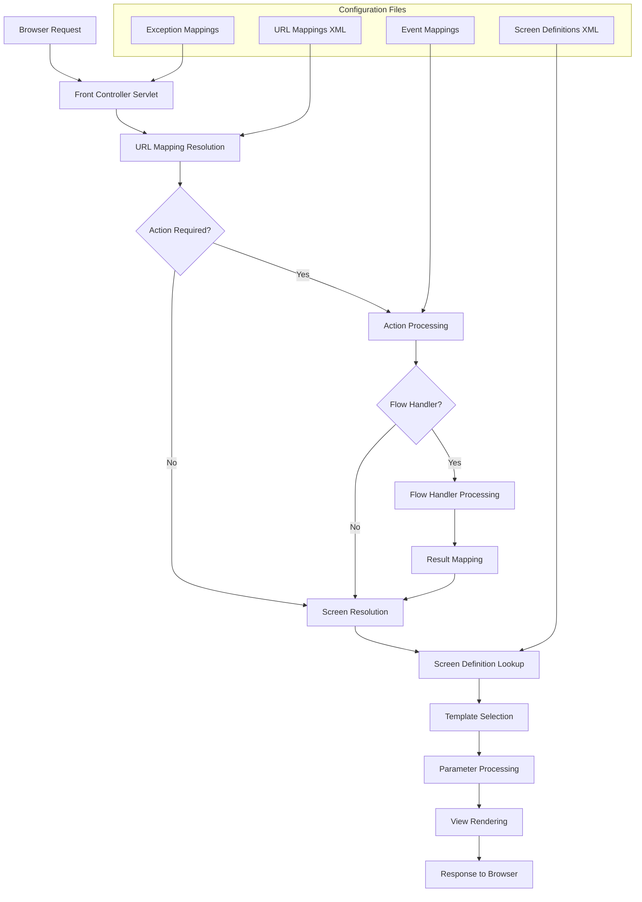
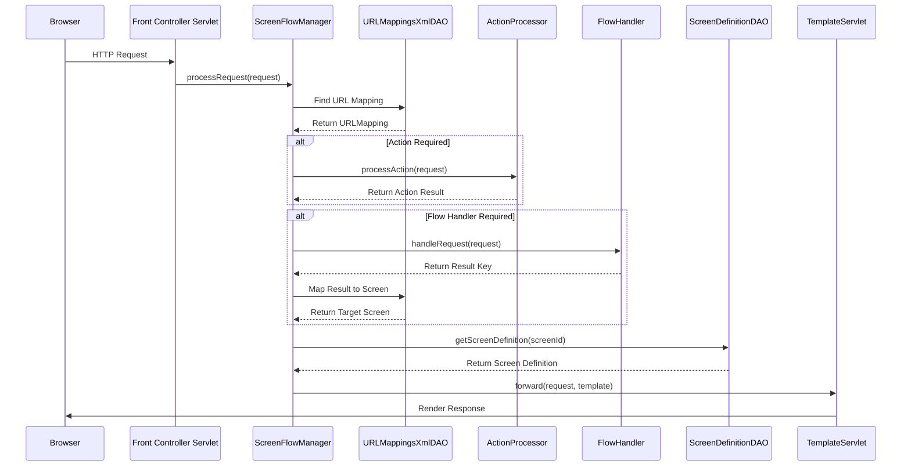
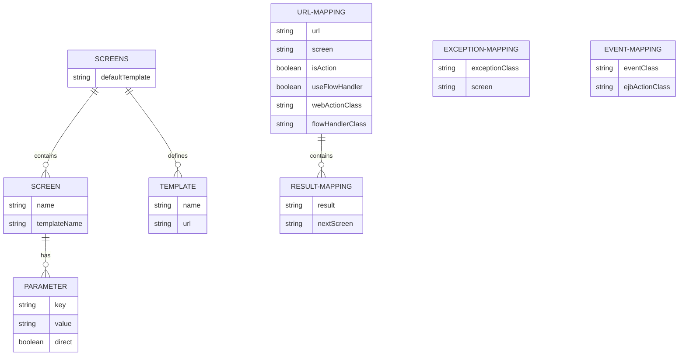
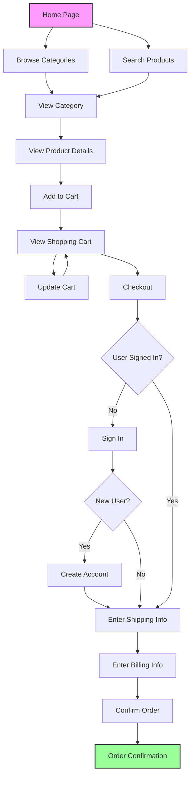

# Screen Flow Navigation in Java Pet Store 1.3.2

## Introduction to Screen Flow Navigation

Screen Flow Navigation in Java Pet Store 1.3.2 defines how users move between application screens, handling URL requests, and managing the presentation flow based on user actions and system events. The framework implements a sophisticated navigation system that separates the navigation logic from the application code, allowing for declarative definition of screen transitions. This architecture enables developers to modify the application's flow without changing Java code, promoting maintainability and flexibility. The navigation system handles various aspects including URL mapping to screens, action processing, flow control decisions, and exception handling to ensure a consistent user experience throughout the application.

## Screen Flow Architecture Overview

The diagram illustrates the architecture of the screen flow system in Java Pet Store 1.3.2. When a request arrives from the browser, the Front Controller Servlet intercepts it and initiates the navigation process. The URL Mapping Resolution component uses the URLMappingsXmlDAO to determine which screen should handle the request based on the URL pattern. If action processing is required, the system executes the appropriate action class before proceeding. 

Flow handlers provide conditional navigation logic, determining the next screen based on application state or user input. The Screen Definition Lookup component uses ScreenDefinitionDAO to retrieve the appropriate template and parameters for rendering the selected screen. This architecture separates navigation concerns from business logic and presentation, allowing for flexible configuration of the application's flow through XML files rather than hard-coded paths.

## XML-Based Configuration Approach

Java Pet Store implements screen flow navigation using XML configuration files that separate navigation logic from application code, allowing for flexible definition of screen transitions without code changes. This declarative approach uses two primary XML files: URL mappings and screen definitions. The URL mappings file defines how incoming URLs are mapped to specific screens and whether they require action processing or flow handler intervention. The screen definitions file specifies the templates and parameters used to render each screen. This separation of concerns allows developers to modify the application's navigation flow by simply updating XML files, without recompiling Java code. The XML-based configuration also supports internationalization by allowing language-specific screen definitions, making it easier to create localized versions of the application.

## URL Mappings and Request Processing

URLMappingsXmlDAO parses XML files to create mappings between URLs and screen identifiers, determining which screens to display in response to user requests and defining action processing requirements. This component is a critical part of the navigation infrastructure, as it translates incoming HTTP requests into application-specific screen transitions. The DAO loads three types of mappings: URL mappings, event mappings, and exception mappings. URL mappings connect URL patterns to screen identifiers, optionally specifying action classes that should process the request before rendering the screen. Event mappings link event classes to EJB action classes, enabling event-driven navigation. Exception mappings associate exception types with error screens, providing graceful error handling. The URLMappingsXmlDAO uses DOM parsing to extract this configuration data, creating a comprehensive navigation map that the controller components use to direct user flow through the application.

## URL Request Processing Flow

This sequence diagram illustrates the detailed flow of a user request through the Java Pet Store navigation system. When a request arrives at the Front Controller Servlet, it delegates to the ScreenFlowManager which uses URLMappingsXmlDAO to determine the appropriate mapping for the requested URL. If the mapping indicates that action processing is required, the ActionProcessor executes the associated action class.

For complex navigation decisions, Flow Handlers provide conditional logic that determines the next screen based on application state or user input. The Flow Handler returns a result key which is mapped to a target screen using the result mappings defined in the URL mapping configuration. Once the target screen is determined, the ScreenDefinitionDAO retrieves the screen definition including template and parameters. Finally, the TemplateServlet renders the response using the specified template and sends it back to the browser.

This architecture provides a flexible, configurable approach to navigation that separates concerns and allows for complex navigation flows without hard-coding paths in the application logic.

## Screen Definitions and Templates

ScreenDefinitionDAO loads screen definitions that specify which templates to use for rendering each screen, along with parameters that control content display and formatting. This component is responsible for parsing the screen definitions XML file and creating a structured representation of the UI components. Each screen definition includes a reference to a template, which is a JSP file that defines the layout and structure of the page. The screen definition also contains parameters that provide dynamic content to the template, with each parameter having a key, value, and a "direct" flag that indicates whether the value should be used directly or resolved through a lookup mechanism. The ScreenDefinitionDAO supports a default template that serves as a fallback when a screen doesn't specify its own template, ensuring consistent presentation throughout the application. This separation of screen definitions from templates allows for flexible UI customization without changing the underlying application logic.

## Screen Definition Structure

This entity-relationship diagram illustrates the structure of screen definitions and related components in the Java Pet Store navigation system. At the top level, the SCREENS entity contains the default template setting and maintains collections of individual SCREEN definitions and TEMPLATE definitions.

Each SCREEN has a name (identifier) and references a templateName that specifies which template should render it. SCREENS can have multiple PARAMETERS, each with a key-value pair and a "direct" flag that determines how the value is processed during rendering.

The URL-MAPPING entity represents the connection between URL patterns and screens, with flags indicating whether action processing or flow handling is required. For screens using flow handlers, RESULT-MAPPING entities define how result keys from the flow handler map to target screens.

The diagram also shows EXCEPTION-MAPPING and EVENT-MAPPING entities, which connect exception types to error screens and events to action classes, respectively. This comprehensive structure enables the flexible, configuration-driven navigation system that is central to the Java Pet Store architecture.

## Flow Handlers and Navigation Control

The framework supports flow handlers that provide programmatic control over navigation, allowing complex decision-making about screen transitions based on application state and user input. Flow handlers are Java classes that implement a specific interface and are invoked by the screen flow manager when a URL mapping specifies the need for flow handling. Unlike simple URL-to-screen mappings, flow handlers can execute business logic, check user permissions, validate input, and make dynamic decisions about which screen should be displayed next. The flow handler returns a result key, which is then mapped to a specific screen using the result mappings defined in the URL mapping configuration. This approach allows for sophisticated navigation flows that can adapt to runtime conditions while keeping the navigation logic separate from both the business logic and the presentation layer. Flow handlers can be reused across different parts of the application, promoting code reuse and maintaining a clean separation of concerns.

## Exception Handling in Navigation

Screen flow includes exception mapping capabilities that redirect users to appropriate error screens when exceptions occur, maintaining a consistent user experience even during error conditions. The exception handling mechanism in Java Pet Store's navigation framework is designed to gracefully manage unexpected errors without exposing technical details to end users. When an exception occurs during request processing, the ScreenFlowManager catches it and consults the exception mappings loaded by URLMappingsXmlDAO to determine which error screen should be displayed. These mappings associate exception class names with specific screen identifiers, allowing different types of errors to be handled with appropriate context-specific error pages. The framework supports both specific exception types and their parent classes, enabling hierarchical exception handling where more specific handlers take precedence over general ones. This approach ensures that users receive meaningful feedback when errors occur while preserving the application's visual consistency and professional appearance.

## User Journey Navigation Paths

This flowchart illustrates the typical user navigation paths through the Java Pet Store application, highlighting the key screens and decision points in the shopping and checkout process. Users typically begin at the Home Page and can either browse product categories or search for specific products. Both paths lead to viewing category listings, from which users can select individual products to view detailed information.

After viewing product details, users can add items to their shopping cart and then view or update the cart contents. When ready to checkout, the system checks if the user is signed in. New users must create an account, while returning users can proceed directly to entering shipping information after signing in.

The checkout process continues with billing information entry, order confirmation, and finally the order confirmation screen. This structured navigation flow guides users through the e-commerce process while allowing flexibility to move between different sections of the application as needed.

The navigation system handles these transitions through URL mappings and flow handlers, ensuring a smooth user experience while maintaining separation between the navigation logic and the business functionality.

## Internationalization Support

The screen flow system supports internationalization through language-specific screen definitions, allowing the application to present appropriate content based on user language preferences. This capability is implemented through the ScreenDefinitionDAO, which can load different screen definition XML files based on the user's selected language. Each language-specific file contains the same screen identifiers but may reference different templates or parameters tailored to that language. The system determines which language file to load based on the user's locale settings, falling back to a default language when a specific translation isn't available. This approach allows the application to maintain consistent navigation flow across all languages while presenting culturally appropriate content and formatting. The internationalization support extends beyond simple text translation to include language-specific layouts, images, and even navigation paths when cultural differences require different user experiences. This comprehensive approach to internationalization makes the Java Pet Store application accessible to a global audience without requiring changes to the core application logic.

## Event-Based Navigation

Navigation can be triggered by application events, with event mappings connecting event classes to appropriate action handlers that determine the next screen in the flow. This event-driven navigation approach complements the URL-based navigation system, allowing screens to change in response to system events rather than just direct user actions. The URLMappingsXmlDAO loads event mappings that associate event class names with EJB action classes. When an event is fired within the application, the corresponding action is executed, and its result determines which screen should be displayed next. This mechanism is particularly useful for handling asynchronous processes, background tasks, or system-initiated workflows that need to update the user interface. For example, when an order processing event completes, the system can automatically navigate the user to an order confirmation screen. Event-based navigation maintains the same separation of concerns as URL-based navigation, keeping the navigation logic in configuration files rather than embedding it in application code, which enhances maintainability and flexibility.

[Generated by the Sage AI expert workbench: 2025-03-29 21:37:00  https://sage-tech.ai/workbench]: #