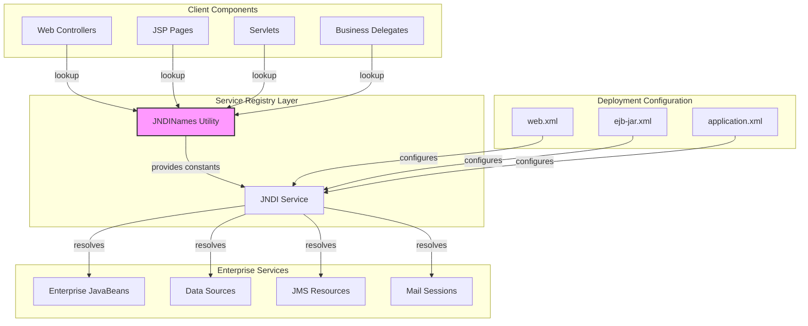
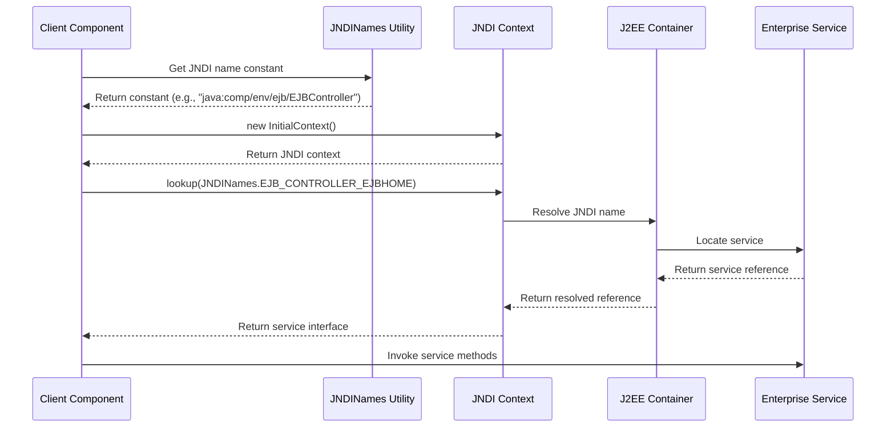
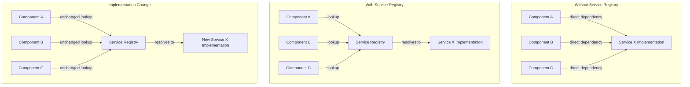
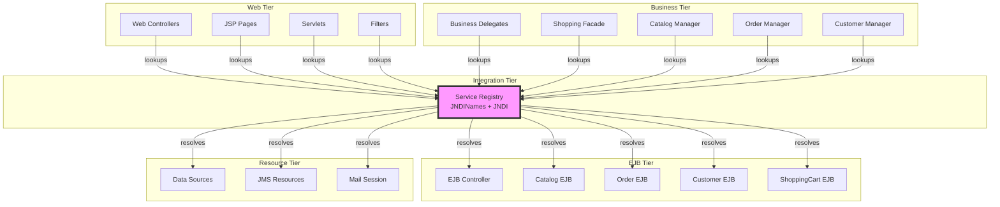

# Service Registry in Java Pet Store 1.3.2

## Service Registry Overview

The Service Registry in Java Pet Store 1.3.2 serves as a critical architectural component that enables dynamic discovery and location of services throughout the application. At its core, the Service Registry implements the Service Locator pattern, which centralizes the lookup of distributed components and services, thereby decoupling service consumers from concrete service implementations. In the Java Pet Store application, this registry primarily leverages the Java Naming and Directory Interface (JNDI) to provide a standardized mechanism for storing, retrieving, and managing references to enterprise resources such as EJB components, data sources, and other application services. This approach significantly enhances the application's maintainability by reducing direct dependencies between components and promoting a more modular architecture. The Service Registry acts as a mediator that abstracts the complexities of service location, allowing client components to focus on business logic rather than the intricacies of resource discovery and connection management.

## Service Registry Architecture

The diagram illustrates how the Service Registry fits within the Java Pet Store architecture. At the center is the JNDINames utility class, which provides a centralized repository of JNDI lookup constants. Client components such as Web Controllers, JSPs, Servlets, and Business Delegates use these constants to locate services through the JNDI service. The JNDI service then resolves these lookups to actual enterprise resources like EJBs, Data Sources, JMS resources, and Mail Sessions. The deployment configuration files (web.xml, ejb-jar.xml, and application.xml) define the mapping between logical JNDI names and physical resources, ensuring that the constants in JNDINames align with the deployed components. This architecture promotes loose coupling between client components and enterprise services, allowing for greater flexibility in deployment configurations without requiring code changes.

## JNDI as Service Registry Implementation

In the Java Pet Store application, the Java Naming and Directory Interface (JNDI) serves as the primary implementation of the Service Registry pattern. JNDI provides a standardized API for accessing various naming and directory services, making it an ideal choice for service discovery in J2EE applications. The implementation leverages the J2EE container's built-in JNDI provider, which manages a hierarchical namespace where enterprise resources are bound to logical names. Java Pet Store specifically utilizes the `java:comp/env/` namespace, which is the standard environment naming context for J2EE components, ensuring portability across different application servers. This approach allows the application to reference resources through logical names that remain consistent regardless of the underlying physical implementation or deployment environment. The JNDI registry in Java Pet Store manages various types of resources, including EJB home interfaces, data sources, JMS connection factories, and environment entries. By centralizing these lookups through JNDI, the application achieves a clean separation between resource usage and resource location, enabling administrators to reconfigure resources without modifying application code.

## JNDINames Utility Class

The `JNDINames` utility class in Java Pet Store serves as a central repository for JNDI lookup constants, playing a pivotal role in the Service Registry implementation. Located in the `com.sun.j2ee.blueprints.waf.util` package, this class exemplifies the Constants Pattern by providing static final String constants that represent the JNDI names of various enterprise resources. The class is deliberately designed with a private constructor to prevent instantiation, enforcing its use as a pure utility class. Each constant follows a consistent naming convention and uses the `java:comp/env/` prefix, adhering to J2EE best practices for portable JNDI lookups. The constants include references to critical application components such as the EJB Controller home interface (`EJB_CONTROLLER_EJBHOME`), Component Manager (`COMPONENT_MANAGER`), and Default Web Controller (`DEFAULT_WEB_CONTROLLER`). By centralizing these JNDI names, the application ensures consistent access patterns across all components and simplifies maintenance—any changes to JNDI names need only be updated in this single class rather than throughout the codebase. The class documentation explicitly notes that any changes to these constants must be synchronized with the corresponding deployment descriptors, highlighting the critical relationship between code and configuration in the Service Registry pattern.

## JNDI Lookup Flow

This sequence diagram illustrates the flow of JNDI lookups in the Java Pet Store application. The process begins when a client component needs to access an enterprise service. Instead of hardcoding JNDI names, the client references the appropriate constant from the JNDINames utility class. The client then creates a JNDI InitialContext and performs a lookup using the constant. The JNDI context forwards the request to the J2EE container, which resolves the logical JNDI name to the actual service implementation. The container locates the service, obtains a reference to it, and returns this reference back through the JNDI context to the client. Finally, the client can invoke methods on the service interface. This standardized lookup flow ensures consistent service discovery throughout the application while maintaining the loose coupling between clients and services. The use of centralized constants from JNDINames simplifies maintenance and promotes code reuse across different components that need to access the same services.

## Component Registration and Discovery

Component registration and discovery in Java Pet Store follows a declarative approach leveraging the J2EE container's deployment infrastructure. Registration occurs primarily during application deployment through deployment descriptors rather than programmatically at runtime. For EJBs, the `ejb-jar.xml` descriptor defines the components and their JNDI bindings, while web components use `web.xml` to declare resource references. The application server processes these descriptors during deployment and registers the components in the JNDI tree at the specified locations. This registration process is transparent to the application code, as it's handled entirely by the container. On the discovery side, client components use the JNDINames utility class to obtain the standardized JNDI names and then perform lookups through the JNDI API. The discovery process typically involves creating an InitialContext, performing a lookup using the appropriate constant from JNDINames, and casting the returned object to the expected interface type. For frequently accessed services, the application often implements a caching mechanism to avoid repeated JNDI lookups, improving performance. This pattern of declarative registration and standardized discovery creates a clean separation between component providers and consumers, allowing either side to evolve independently as long as the JNDI contract remains stable.

## Service Registry and Application Modularity

The Service Registry pattern, as implemented through JNDI in Java Pet Store, plays a fundamental role in enabling application modularity and promoting loose coupling between components. By providing a level of indirection between service consumers and providers, the registry allows components to interact without direct dependencies on each other's implementation details. This indirection facilitates several key aspects of modularity: First, it enables component substitution, where one implementation of a service can be replaced with another without affecting clients, as long as the interface remains consistent. Second, it supports distributed deployment, allowing components to be deployed across different JVMs or servers while maintaining the same logical access pattern. Third, it simplifies versioning and upgrades by providing a stable access point even as underlying implementations evolve. The Java Pet Store leverages these benefits throughout its architecture, particularly in the separation between presentation, business, and data access layers. For example, web controllers can access EJB services without knowledge of their physical location or implementation details. This modularity extends to the application's multi-tiered architecture, where each tier can evolve independently as long as the service interfaces and registry entries remain stable. The result is a more maintainable and adaptable application structure that can accommodate changes in business requirements or deployment environments with minimal impact on existing code.

## Component Dependency Management

This diagram illustrates how the Service Registry pattern manages component dependencies in the Java Pet Store application. In the top section, we see the traditional approach without a service registry, where components have direct dependencies on service implementations. This creates tight coupling and makes it difficult to change implementations without modifying client code. The middle section shows the Service Registry approach used in Java Pet Store, where components depend only on the registry, which in turn resolves to the actual service implementation. This introduces a level of indirection that decouples clients from service implementations. The bottom section demonstrates how this approach facilitates implementation changes—when a service implementation is updated or replaced, only the registry's resolution needs to change while client components remain untouched. In Java Pet Store, this pattern is particularly valuable for managing dependencies on EJBs and other distributed components, allowing the application to evolve more easily over time. The centralized JNDINames class further enhances this pattern by providing a single point of truth for all service lookups, ensuring consistency across the application and simplifying maintenance when JNDI paths need to be updated.

## Deployment Configuration and Service Registry

The synchronization between deployment descriptors and the JNDINames constants is a critical aspect of the Service Registry implementation in Java Pet Store. This relationship forms a contract that must be carefully maintained throughout the application lifecycle. Deployment descriptors such as `web.xml`, `ejb-jar.xml`, and `application.xml` define how components are registered in the JNDI tree during deployment, while the JNDINames class defines how these components are discovered at runtime. Any mismatch between these two sides can lead to runtime errors when components fail to locate required services. For EJBs, the `ejb-jar.xml` descriptor includes `<ejb-name>` and `<jndi-name>` elements that specify the binding between an EJB and its JNDI location. Similarly, web components use `<resource-ref>` and `<env-entry>` elements in `web.xml` to declare references to external resources, with corresponding `<res-ref-name>` elements that must match the constants in JNDINames. The application server uses these descriptors to populate the JNDI tree during deployment, creating the bindings that will be looked up at runtime. This configuration-based approach to service registration provides flexibility in deployment scenarios but requires careful coordination between development and operations teams. Any changes to JNDI names must be reflected in both the deployment descriptors and the JNDINames class, a requirement explicitly noted in the class documentation. This dual-maintenance requirement is a common challenge in J2EE applications and highlights the importance of treating configuration as a first-class concern in the development process.

## Service Registry Best Practices

The Java Pet Store implementation of the Service Registry pattern through JNDI demonstrates several best practices that remain relevant even in modern architectures. First, the application employs consistent naming conventions for JNDI paths, using the standard `java:comp/env/` prefix for all lookups to ensure portability across different J2EE containers. Second, it centralizes all JNDI names in the JNDINames utility class, creating a single point of truth that simplifies maintenance and ensures consistency throughout the application. Third, it uses descriptive, hierarchical naming that reflects the purpose and type of each resource, making the registry more self-documenting. Fourth, the application includes clear documentation about the relationship between code constants and deployment configuration, highlighting the need to keep these synchronized. Fifth, it leverages the J2EE container's built-in JNDI provider rather than implementing a custom registry, taking advantage of the container's lifecycle management and security features. Sixth, it follows the principle of separation of concerns by keeping service lookup logic separate from business logic, typically encapsulating JNDI lookups in factory or delegate classes. Seventh, it uses appropriate typing and casting patterns when retrieving objects from the registry, ensuring type safety while accommodating the generic nature of JNDI lookups. These practices collectively create a robust service discovery mechanism that balances flexibility with maintainability, providing valuable lessons for service registry implementations even in more modern architectural styles.

## Service Registry Integration Points

The Service Registry in Java Pet Store serves as a central integration hub connecting various application components across different architectural tiers. As illustrated in the diagram, the registry (implemented through JNDINames and JNDI) provides critical integration points throughout the application. In the web tier, controllers, JSP pages, servlets, and filters use the registry to locate business services and resources. These components typically perform lookups during initialization or request processing to obtain references to the services they need. In the business tier, delegates and managers use the registry to locate EJBs and other enterprise resources, often caching these references for performance. The EJB tier itself may use the registry for locating other EJBs or resources like data sources and JMS destinations. The registry also provides access to infrastructure services in the resource tier, including database connections, messaging services, and mail facilities. Each integration point follows a similar pattern: components use constants from JNDINames to perform JNDI lookups, obtaining typed references to the services they need. This consistent approach to service discovery creates a standardized integration mechanism across the application, simplifying cross-component communication while maintaining loose coupling. The centrality of the Service Registry in these integration points highlights its importance as a foundational architectural component that enables the modular design of the Java Pet Store application.

## Service Registry in Modern Architectures

The Service Registry pattern implemented in Java Pet Store 1.3.2 through JNDI represents an early approach to service discovery that has evolved significantly in modern architectures. While contemporary systems have moved beyond the static, container-managed JNDI registry to more dynamic and distributed service discovery mechanisms, many of the fundamental principles remain relevant. Modern service registries like Netflix Eureka, Consul, etcd, and Kubernetes Service Discovery offer features that address limitations in the JNDI approach, including dynamic registration and deregistration, health checking, and multi-datacenter awareness. Unlike the compile-time constants in JNDINames, modern registries support runtime discovery of services that may come and go dynamically, a critical requirement in cloud-native and microservices architectures. They also typically provide richer metadata about services, enabling more sophisticated routing, load balancing, and failover strategies. However, the core pattern of mediating service discovery through a registry rather than hardcoding dependencies remains unchanged. The Java Pet Store's approach of centralizing lookup constants (albeit as compile-time constants) presages modern service mesh control planes that centralize service discovery configuration. Similarly, the separation of logical service names from physical implementations continues to be a fundamental principle in contemporary service discovery. The evolution from JNDI to modern service registries reflects the industry's shift toward more distributed, resilient, and dynamic architectures, but the foundational pattern established in applications like Java Pet Store remains a cornerstone of service-oriented design.

[Generated by the Sage AI expert workbench: 2025-03-29 21:37:00  https://sage-tech.ai/workbench]: #