# Shopping Cart Architecture Overview

The Java Pet Store's shopping cart functionality is implemented using a multi-tier architecture with clear separation between presentation, business logic, and data layers. The architecture follows J2EE best practices with a stateful session EJB (ShoppingCartLocalEJB) at its core that maintains the cart state across user interactions. The design employs the Model-View-Controller (MVC) pattern where CartItem and ShoppingCartModel classes represent the data model, ShoppingCartLocalEJB implements the business logic, and web-tier components like CartHTMLAction handle user interactions. The system uses an event-driven approach where user actions are translated into CartEvents that flow through the controller layer to the EJB tier. A facade pattern is implemented through ShoppingClientFacadeLocal to provide a unified interface for shopping operations. The architecture ensures proper transaction management with container-managed transactions and leverages local EJB interfaces for efficient same-JVM communication.

## Shopping Cart Component Architecture

The diagram illustrates the component architecture of the shopping cart system in Java Pet Store. User interactions begin at the presentation layer with CartHTMLAction, which creates CartEvents representing user intentions (add, delete, update items). These events flow through the ShoppingWebController to the business logic layer where ShoppingControllerEJB routes them to the appropriate CartEJBAction. The ShoppingClientFacadeEJB provides a unified interface to shopping operations, managing access to the ShoppingCartLocalEJB which maintains the cart state. The ShoppingCartLocalEJB interacts with the CatalogHelper to retrieve product information and creates CartItem objects that are contained in the ShoppingCartModel. This architecture ensures clear separation of concerns and promotes maintainability through well-defined interfaces between components.

## Core Data Model

The shopping cart's data model centers around CartItem and ShoppingCartModel classes that store product information, quantities, and pricing for items selected by users. The CartItem class represents individual line items in the shopping cart, storing essential product details including itemId, productId, category, name, attribute, quantity, and unitCost. Each CartItem can calculate its total cost by multiplying quantity by unit price. The ShoppingCartModel serves as a container for CartItem objects, providing methods to access the collection of items, calculate the total cost of all items, and determine the cart size. Both classes implement Serializable to support state persistence across HTTP sessions. The model is designed as a value object with fine-grained getter methods, following a clean separation from the business logic. This design allows for efficient transfer of cart data between application tiers while maintaining encapsulation of the underlying data structures.

## EJB Implementation

ShoppingCartLocalEJB implements a stateful session bean that maintains cart state across user interactions, providing methods to add, delete, update, and retrieve cart items. The EJB stores cart items in a HashMap where keys are item IDs and values are Integer objects representing quantities. When users interact with the cart, the EJB processes these operations and persists the state changes. For item retrieval, it collaborates with the CatalogHelper to fetch detailed product information from the catalog component, converting catalog items to cart items with appropriate pricing and attributes. The implementation intelligently handles edge cases, such as removing items when their quantity is set to zero or negative. The EJB uses container-managed transactions with the Required attribute to ensure data integrity during cart modifications. This design leverages the stateful session bean's capability to maintain conversational state across multiple client requests, providing a reliable and efficient shopping cart experience.

## Shopping Cart Operation Flow

```mermaid
sequenceDiagram
    participant User
    participant CartHTMLAction
    participant ShoppingWebController
    participant CartEJBAction
    participant ShoppingCartEJB
    participant CatalogHelper
    
    User->>CartHTMLAction: Click "Add to Cart"
    CartHTMLAction->>CartHTMLAction: Extract itemId from request
    CartHTMLAction->>ShoppingWebController: Create CartEvent(ADD_ITEM, itemId)
    ShoppingWebController->>CartEJBAction: handleEvent(CartEvent)
    CartEJBAction->>ShoppingCartEJB: addItem(itemId)
    ShoppingCartEJB->>CatalogHelper: getItem(itemId)
    CatalogHelper-->>ShoppingCartEJB: Item details
    ShoppingCartEJB->>ShoppingCartEJB: Store in cart HashMap
    
    User->>CartHTMLAction: Update quantity
    CartHTMLAction->>CartHTMLAction: Extract itemId and quantity
    CartHTMLAction->>ShoppingWebController: Create CartEvent(UPDATE_ITEMS, {itemId:quantity})
    ShoppingWebController->>CartEJBAction: handleEvent(CartEvent)
    CartEJBAction->>ShoppingCartEJB: updateItemQuantity(itemId, quantity)
    ShoppingCartEJB->>ShoppingCartEJB: Update HashMap or remove if quantity ≤ 0
    
    User->>CartHTMLAction: Remove item
    CartHTMLAction->>CartHTMLAction: Extract itemId
    CartHTMLAction->>ShoppingWebController: Create CartEvent(DELETE_ITEM, itemId)
    ShoppingWebController->>CartEJBAction: handleEvent(CartEvent)
    CartEJBAction->>ShoppingCartEJB: deleteItem(itemId)
    ShoppingCartEJB->>ShoppingCartEJB: Remove from HashMap
```

This sequence diagram illustrates the flow of shopping cart operations from user interaction through the web interface to the EJB tier. When a user adds an item to the cart, the CartHTMLAction extracts the item ID from the request and creates a CartEvent with the ADD_ITEM action type. This event is passed to the ShoppingWebController, which delegates it to the CartEJBAction. The action then calls the addItem method on the ShoppingCartEJB, which retrieves item details from the CatalogHelper and stores the item in its internal HashMap. Similar flows exist for updating quantities and removing items, with the CartHTMLAction creating appropriate CartEvents that are processed through the controller layers to modify the cart state in the ShoppingCartEJB. This event-driven architecture provides a clean separation between user interface and business logic while maintaining a consistent flow for all cart operations.

## Web Tier Integration

The web tier uses CartHTMLAction and ShoppingWebController to process user requests and convert them to CartEvents that are handled by the EJB tier. CartHTMLAction extends HTMLActionSupport and serves as the entry point for cart operations in the web tier. It parses HTTP request parameters to determine the action type (purchase, remove, or update) and creates appropriate CartEvent objects with the necessary data. For batch updates, it extracts multiple item quantities from request parameters using a prefix-based naming convention. The ShoppingWebController acts as a proxy between the web tier and EJB tier, implementing the WebController interface to handle events synchronously. It retrieves the ShoppingControllerLocal EJB from the PetstoreComponentManager and forwards events to it for processing. The controller ensures thread safety by synchronizing methods that access the stateful session bean, preventing concurrent requests that could corrupt cart state. This integration leverages the Web Application Framework's (WAF) event-driven architecture to maintain a clean separation between presentation and business logic.

## Event-Driven Architecture

Shopping cart operations follow an event-driven architecture where CartEvent objects represent user actions and are processed by CartEJBAction to modify cart state. The CartEvent class encapsulates four action types: ADD_ITEM, DELETE_ITEM, UPDATE_ITEMS, and EMPTY. Each event contains the necessary data for its operation, such as item IDs and quantities. When users interact with the cart interface, the CartHTMLAction creates appropriate CartEvent instances that flow through the controller layers. The ShoppingWebController synchronously processes these events by delegating them to the EJB tier. In the business logic layer, the CartEJBAction interprets the event type and performs the corresponding operation on the ShoppingCartLocalEJB. For batch updates, the event can carry a map of item IDs and quantities, allowing multiple cart items to be modified in a single operation. This event-driven approach decouples the user interface from the business logic, enabling a more maintainable and extensible architecture where new cart operations can be added by introducing new event types without modifying the existing flow.

## Shopping Cart Event Flow

This diagram illustrates how CartEvents flow through the system from user actions to final cart state changes. In the web tier, user actions are captured by the CartHTMLAction, which determines the action type and creates the appropriate CartEvent (ADD_ITEM, DELETE_ITEM, or UPDATE_ITEMS). These events are then passed to the ShoppingWebController, which forwards them to the EJB tier. In the EJB tier, the ShoppingControllerEJB routes the events to the CartEJBAction, which interprets the event type and calls the corresponding method on the ShoppingCartEJB. The ShoppingCartEJB modifies its internal HashMap representation of the cart, which ultimately affects the ShoppingCartModel and its collection of CartItem objects. This event flow architecture provides a clean separation of concerns, with each component having a specific responsibility in the processing chain, from user interface to data model.

## Facade Pattern Implementation

ShoppingClientFacade provides a unified interface to shopping-related operations, simplifying access to the shopping cart and customer components. This implementation of the Facade design pattern encapsulates the complexity of interacting with multiple EJBs behind a single, cohesive interface. The ShoppingClientFacadeLocalEJB maintains references to both ShoppingCartLocal and CustomerLocal EJBs, offering methods like getShoppingCart(), getCustomer(), and createCustomer() that abstract away the details of EJB lookup and creation. The facade uses lazy initialization for the shopping cart, creating it only when needed and caching the reference for subsequent requests. It also manages user identification through setUserId() and getUserId() methods, establishing the context for customer-related operations. By centralizing these responsibilities, the facade reduces coupling between client code and the underlying EJB components, making the system more maintainable and adaptable to changes. This pattern is particularly valuable in the Pet Store application, where shopping operations often involve coordinated interactions with multiple backend services.

## Transaction Management

Shopping cart operations use container-managed transactions with Required attribute to ensure data integrity when adding, updating, or removing items. The ejb-jar.xml deployment descriptor explicitly configures transaction attributes for all cart methods including addItem, deleteItem, updateItemQuantity, and empty. With the Required attribute, these methods execute within an existing transaction context if one exists, or the container starts a new transaction if none is active. This approach guarantees that cart modifications are atomic, consistent, isolated, and durable (ACID). For example, when updating an item quantity, the transaction ensures that either the item is successfully updated or removed (if quantity is zero), or the operation fails completely without partial updates. The ShoppingCartLocalEJB implements these transactional methods, while the CartEJBAction coordinates the transaction context by processing CartEvents within the same transaction. This container-managed transaction strategy relieves developers from manually coding transaction boundaries, reducing complexity and potential errors while ensuring data integrity across the shopping cart subsystem.

## Shopping Cart Session Management

This diagram illustrates how shopping cart state is maintained across user sessions and how it integrates with the broader application state. When a user's session is created, the PetstoreComponentManager initializes an empty cart and stores it as a session attribute. As the user adds items, the cart transitions from EmptyCart to CartWithItems state, with the ShoppingCartLocalEJB maintaining the cart contents in its internal HashMap. The stateful session bean preserves this state across multiple HTTP requests, allowing users to navigate through the application while their cart contents remain intact. When users update quantities or remove items, the cart remains in the CartWithItems state, with the nested ItemsState reflecting these changes. If all items are removed or the empty() method is called, the cart returns to the EmptyCart state. Upon checkout, the cart transitions to OrderCreated state, after which it can be emptied for continued shopping. If the user's session times out (default 30 minutes as configured in web.xml), the cart state is lost. This session management approach leverages the J2EE container's capabilities to maintain conversational state efficiently while integrating with the broader application flow.

[Generated by the Sage AI expert workbench: 2025-03-29 21:37:00  https://sage-tech.ai/workbench]: #