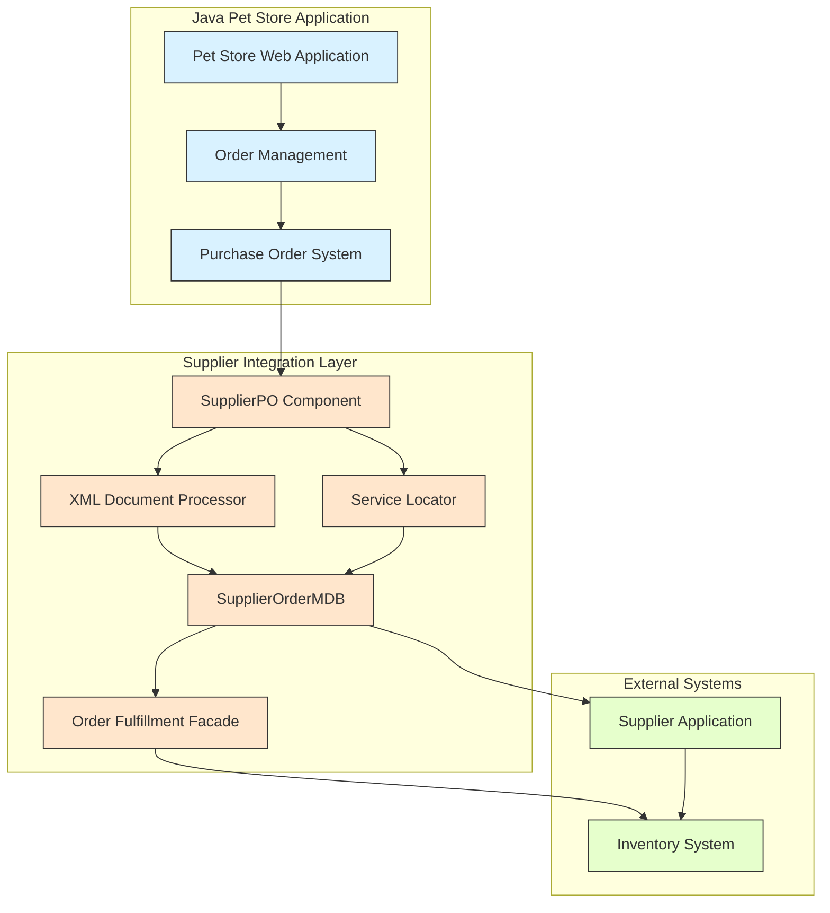
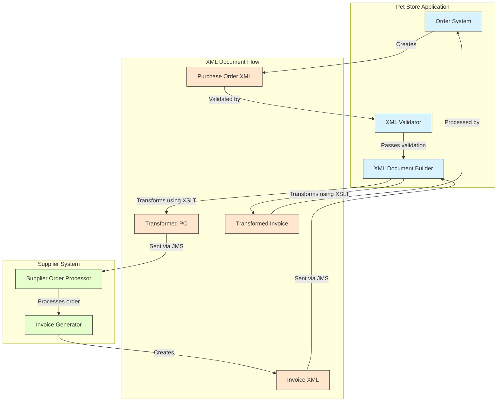
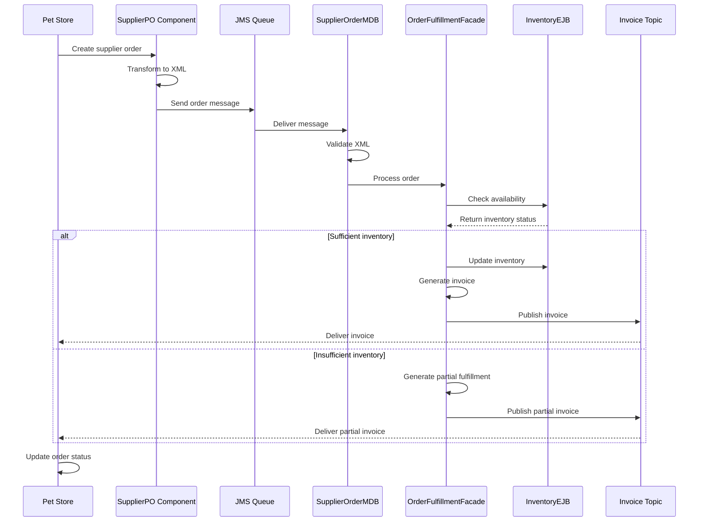
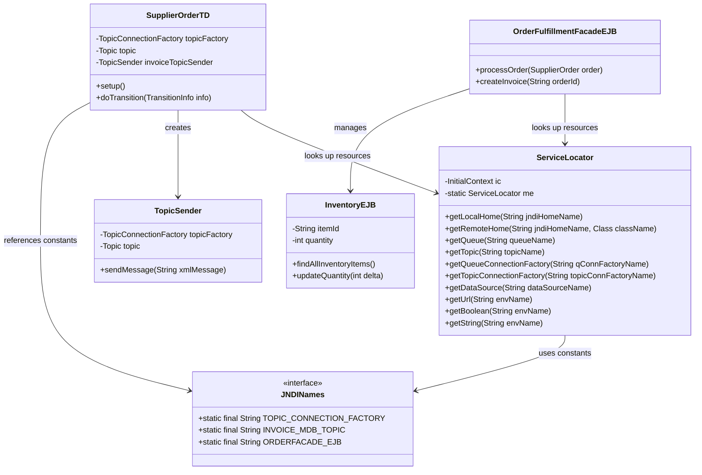

# Supplier Integration in Java Pet Store

## Overview of Supplier Integration

The Java Pet Store 1.3.2 implements a sophisticated supplier integration architecture that connects the e-commerce system with external product suppliers through standardized interfaces. This integration layer enables the application to automate the procurement process, from order placement to inventory management. The supplier integration is built on J2EE technologies including Enterprise JavaBeans (EJB), Java Message Service (JMS), and XML document exchange. The architecture follows a loosely coupled design that allows the Pet Store to communicate with multiple suppliers using standardized protocols while maintaining separation of concerns between the core e-commerce functionality and supplier-specific operations. This modular approach enables the system to adapt to different supplier requirements without modifying the core business logic.



The supplier integration architecture consists of several key components that work together to facilitate communication between the Pet Store and supplier systems. The SupplierPO component handles purchase order creation and management, while the SupplierOrderMDB processes incoming orders asynchronously through JMS. The Order Fulfillment Facade coordinates the fulfillment process, interacting with the Inventory System to check stock levels and update product availability. The XML Document Processor transforms business objects into standardized XML formats for communication with external systems, and the Service Locator provides centralized access to enterprise resources like JMS destinations and EJB components.

## XML-Based Document Exchange

The supplier integration in Java Pet Store relies heavily on XML-based document exchange to standardize communication between the e-commerce system and external suppliers. This approach provides a flexible, platform-independent method for sharing structured data. The system defines several Document Type Definitions (DTDs) and XML Schema Definitions (XSDs) that formalize the structure of supplier-related documents, including purchase orders and invoices.

The core of this XML exchange is the SupplierOrder DTD, which defines the structure for purchase orders sent to suppliers. This DTD specifies elements for order identification, shipping information, and line items. The system also supports Trading Partner Agreement (TPA) formats through TPASupplierOrder.dtd, which adds namespace support and additional fields for more complex B2B integration scenarios.

XML document processing is handled by specialized classes like TPASupplierOrderXDE, which provides functionality to create, manipulate, and serialize XML documents representing supplier orders. These classes support both DTD and XSD validation through configuration options, ensuring that all documents exchanged with suppliers conform to the agreed-upon formats.

The system uses entity catalogs (EntityCatalog.properties) to map XML DTD and schema identifiers to their physical file locations within the application. This approach allows the XML parsers to locate the correct schema definitions when validating documents, even when working offline or in environments where the standard URIs might not be accessible.

Document transformation is another critical aspect of the XML exchange system. The application uses XSLT stylesheets defined in SupplierOrderStyleSheetCatalog.properties to transform between different XML formats as needed, enabling compatibility with various supplier systems that might use different document structures.



The diagram illustrates how XML documents flow between the Pet Store and supplier systems. Purchase orders originate in the Pet Store's order system, are validated against DTDs/XSDs, transformed if necessary, and sent to the supplier via JMS. The supplier processes these orders and generates invoices, which flow back to the Pet Store through a similar process of transmission, validation, and transformation. This standardized document exchange ensures reliable communication between systems while maintaining loose coupling.

## Message-Driven Communication

The Java Pet Store supplier integration implements an asynchronous messaging system using Java Message Service (JMS) to enable reliable, loosely-coupled communication between the Pet Store and supplier systems. This message-driven architecture is crucial for handling order processing operations that may span different systems and execution contexts.

At the core of this messaging system is the SupplierOrderMDB, a message-driven bean that listens for purchase order messages on a JMS queue. When the Pet Store application needs to place an order with a supplier, it creates an XML document representing the order and sends it to a designated JMS queue. The SupplierOrderMDB consumes these messages asynchronously, processes the orders, and initiates the fulfillment workflow.

The system also uses JMS topics for broadcasting events that multiple components might need to respond to. For example, the InvoiceTopic is used to publish invoice messages that can be consumed by both the Pet Store application and potentially other interested systems. This publish-subscribe model allows for flexible system integration without tight coupling between components.

The messaging infrastructure is configured in the deployment descriptors (web.xml, ejb-jar.xml, and sun-j2ee-ri.xml), which define the necessary JMS connection factories, queues, and topics. The ServiceLocator pattern is employed to abstract the JNDI lookup of these JMS resources, making the code more maintainable and less dependent on specific naming conventions.

For sending messages, the system uses helper classes like TopicSender, which encapsulates the JMS API complexity and provides a simple interface for publishing messages to topics. These classes handle the lifecycle of JMS connections, ensuring proper resource management even in the presence of exceptions.

The asynchronous nature of this messaging system provides several benefits:
1. Improved reliability through guaranteed message delivery
2. Better scalability by decoupling the timing of order submission and processing
3. Enhanced fault tolerance, as temporary unavailability of the supplier system doesn't block the Pet Store application
4. Support for transaction management across distributed systems

## Order Fulfillment Process

The supplier order fulfillment process in Java Pet Store represents a comprehensive workflow that manages the lifecycle of an order from initial creation to invoice processing and inventory updates. This process begins when a customer places an order in the Pet Store application, triggering a series of coordinated actions across multiple components.

Initially, the Pet Store application creates a purchase order based on the customer's selections. This order is transformed into a standardized XML format using the SupplierOrder DTD and sent to the supplier system via a JMS queue. The SupplierOrderMDB, a message-driven bean in the supplier application, receives this message and initiates the fulfillment process.

The OrderFulfillmentFacadeEJB acts as the coordinator for the fulfillment workflow. It first validates the incoming order XML against the defined schemas to ensure data integrity. Then it processes the order by checking inventory availability through the InventoryEJB. Based on inventory status, the system determines whether the order can be fulfilled completely, partially, or not at all.

For items that can be fulfilled, the system updates inventory levels, prepares shipment information, and generates an invoice. This invoice is formatted as an XML document and sent back to the Pet Store application via the InvoiceTopic JMS topic. Throughout this process, the system maintains order status information, allowing both the supplier and the Pet Store to track the progress of fulfillment.

The process incorporates error handling and compensation mechanisms to deal with exceptional conditions such as inventory shortages or communication failures. The TransitionDelegate pattern (implemented by SupplierOrderTD) manages the state transitions in this workflow, ensuring that the process moves correctly from one state to another.



The sequence diagram illustrates the order fulfillment workflow, showing the interactions between components and the decision points based on inventory availability. This process demonstrates how the system handles the complete lifecycle of a supplier order, from initial creation to final fulfillment, while maintaining loose coupling between the Pet Store and supplier systems through asynchronous messaging and standardized XML document exchange.

## Inventory Management

The supplier module in Java Pet Store implements a sophisticated inventory management system through the InventoryEJB entity bean. This component is responsible for tracking product stock levels and determining whether orders can be fulfilled based on current inventory. The InventoryEJB uses container-managed persistence (CMP) to store and retrieve inventory data from the underlying database, with each entity representing a specific product identified by its itemId.

The inventory management system is designed around a simple yet effective data model. Each inventory record contains an itemId as its primary key and a quantity field that tracks the current stock level. The InventoryEJB provides methods to query inventory status, reserve items for orders, and update quantities when new stock arrives or orders are fulfilled.

When a supplier order is received, the OrderFulfillmentFacade interacts with the InventoryEJB to check if sufficient stock is available for each requested item. This check is performed through a local EJB interface, allowing for efficient communication within the supplier application. If adequate inventory exists, the system decrements the quantity and proceeds with order fulfillment. If inventory is insufficient, the system can implement various strategies such as partial fulfillment, backorders, or order rejection.

The InventoryEJB also supports querying all inventory items through an EJB-QL finder method (findAllInventoryItems), which enables administrative functions like inventory reports and stock level monitoring. This query capability is defined in the ejb-jar.xml deployment descriptor and implemented by the container.

For data population and initial setup, the supplier application includes a PopulateServlet that can load inventory data from XML files. This servlet uses the XMLDBHandler class to parse XML data and create corresponding inventory records, providing a convenient way to initialize or refresh the inventory database.

The inventory management system is tightly integrated with the order fulfillment process, ensuring that orders are only promised when they can actually be fulfilled. This integration helps maintain accurate inventory records and prevents overselling, which is crucial for customer satisfaction in an e-commerce environment.

## Service Locator Pattern Implementation

The Java Pet Store's supplier integration module implements the Service Locator pattern to abstract resource lookup and provide centralized access to JMS and EJB resources. This pattern addresses the complexity and overhead associated with JNDI lookups in J2EE applications by encapsulating the lookup logic in a dedicated component, reducing code duplication and improving maintainability.

The core implementation is found in the ServiceLocator class, which provides methods to retrieve various J2EE resources including EJB homes (both local and remote), JMS resources (queues, topics, and their connection factories), DataSources, and environment entries. The class maintains an InitialContext instance for performing lookups and wraps exceptions in ServiceLocatorException to provide a cleaner API for client code.

Several key features of the Service Locator implementation include:

1. **Resource caching**: While not fully implemented as a singleton, the class maintains a static instance variable that could be extended to cache resources and reduce repeated lookups.

2. **Exception handling**: The class wraps JNDI exceptions in ServiceLocatorException, providing a unified exception handling approach that shields client code from JNDI-specific exceptions.

3. **Type-safe casting**: For remote EJB homes, the class uses PortableRemoteObject.narrow() to ensure type-safe casting across different JVM implementations.

4. **Comprehensive resource support**: The implementation handles various resource types including EJB homes, JMS destinations, DataSources, and environment entries, making it a versatile utility for the entire application.

The supplier module leverages this pattern through JNDINames classes that define constants for resource names. These constants are used with the ServiceLocator to retrieve resources in a consistent manner. For example, the SupplierOrderTD class uses ServiceLocator to obtain JMS resources for sending invoice messages:

```java
ServiceLocator servicelocator = new ServiceLocator();
topicFactory = servicelocator.getTopicConnectionFactory(JNDINames.TOPIC_CONNECTION_FACTORY);
topic = servicelocator.getTopic(JNDINames.INVOICE_MDB_TOPIC);
```

This approach centralizes resource lookup logic, making the code more maintainable and less prone to errors from hardcoded JNDI names or inconsistent lookup patterns.



The diagram illustrates the relationships between key components in the supplier integration system. The ServiceLocator provides centralized access to resources, while JNDINames defines the constants used for lookups. SupplierOrderTD uses both to obtain JMS resources for sending messages, and OrderFulfillmentFacadeEJB coordinates the interaction between order processing and inventory management through InventoryEJB.

## Security and Authentication

The supplier integration module in Java Pet Store implements a comprehensive security framework to protect supplier operations and ensure that only authorized users can access sensitive functionality. The security implementation leverages J2EE's declarative security model, combining form-based authentication with role-based access control.

The web.xml deployment descriptor defines a security constraint that restricts access to the RcvrRequestProcessor servlet, which handles supplier inventory requests. This constraint specifies that only users with the "administrator" role can access this servlet, ensuring that inventory management operations are protected:

```xml
<security-constraint>
  <web-resource-collection>
    <web-resource-name>MySecureBit0</web-resource-name>
    <url-pattern>/RcvrRequestProcessor</url-pattern>
    <http-method>GET</http-method>
    <http-method>POST</http-method>
  </web-resource-collection>
  <auth-constraint>
    <role-name>administrator</role-name>
  </auth-constraint>
</security-constraint>
```

Authentication is implemented using form-based login, with custom login and error pages defined in the deployment descriptor:

```xml
<login-config>
  <auth-method>FORM</auth-method>
  <realm-name>default</realm-name>
  <form-login-config>
    <form-login-page>/login.jsp</form-login-page>
    <form-error-page>/error.jsp</form-error-page>
  </form-login-config>
</login-config>
```

The sun-j2ee-ri.xml file maps the "administrator" role to the "supplier" principal, establishing the connection between the application's security roles and the J2EE server's user management system:

```xml
<rolemapping>
  <role name="administrator">
    <principals>
      <principal>
        <name>supplier</name>
      </principal>
    </principals>
    <groups>
      <group name="administrator_group" />
    </groups>
  </role>
</rolemapping>
```

At the EJB level, security is enforced through the use of security-identity elements in the ejb-jar.xml file. For example, the InventoryEJB uses caller identity propagation to ensure that access to inventory data is restricted to authorized users:

```xml
<security-identity>
  <description></description>
  <use-caller-identity></use-caller-identity>
</security-identity>
```

This security framework ensures that supplier integration operations are protected from unauthorized access while providing a seamless authentication experience for legitimate users. The role-based approach allows for flexible security policies that can be adapted to different deployment scenarios without modifying application code.

## Deployment and Configuration

The supplier integration components in Java Pet Store are deployed and configured through a sophisticated build and deployment process that leverages Ant scripts and J2EE deployment descriptors. This process ensures that all necessary components are properly assembled, configured, and initialized within the J2EE environment.

The deployment process begins with the setup.xml script, which configures the J2EE environment by creating JMS queues, user accounts, and databases required for the application. This script includes targets for creating the supplier database and deploying the supplier EAR file:

```xml
<target name="create_supplier_db" depends="init">
  <!-- Database creation commands -->
</target>
```

The supplier application's build.xml script manages the compilation, packaging, and deployment of the supplier components. It defines targets for initializing properties, compiling source code, creating EJB JARs, building WAR files, assembling EAR packages, and deploying to J2EE servers:

```xml
<target name="ear" depends="init,compile,ejbjar,war">
  <!-- EAR packaging commands -->
</target>

<target name="deploy" depends="init">
  <exec executable="${deploytool}">
    <arg line="-generateSQL ${supplier.ear} ${j2ee.server.name}" />
  </exec>
  <exec executable="${deploytool}">
    <arg line="-deploy ${supplier.ear} ${j2ee.server.name}" />
  </exec>
</target>
```

Configuration settings are managed through various descriptor files:

1. **application.xml**: Defines the structure of the supplier enterprise application, including its EJB and web modules.

2. **ejb-jar.xml**: Configures the Enterprise JavaBeans components, including the InventoryEJB, SupplierOrderMDB, and OrderFulfillmentFacadeEJB.

3. **web.xml**: Configures the web components, including servlets, security constraints, and resource references.

4. **sun-j2ee-ri.xml**: Provides J2EE Reference Implementation specific settings, including role mappings, resource configurations, and CMP field mappings.

The supplier components are initialized through several mechanisms:

1. **Database Population**: The PopulateServlet loads initial inventory data from XML files.

2. **Environment Entries**: Configuration parameters like XML validation settings are defined as environment entries in the deployment descriptors:

```xml
<env-entry>
  <env-entry-name>param/xml/validation/SupplierOrder</env-entry-name>
  <env-entry-type>java.lang.Boolean</env-entry-type>
  <env-entry-value>true</env-entry-value>
</env-entry>
```

3. **JMS Resource Configuration**: JMS queues and topics are created and configured during the setup process:

```xml
<java classname="com.sun.enterprise.tools.admin.AdminTool" fork="yes">
  <arg line="-addJmsDestination jms/opc/InvoiceTopic queue"/>
</java>
```

This comprehensive deployment and configuration approach ensures that the supplier integration components are properly set up and ready to process orders, manage inventory, and communicate with the main Pet Store application.

[Generated by the Sage AI expert workbench: 2025-03-29 21:37:00  https://sage-tech.ai/workbench]: #