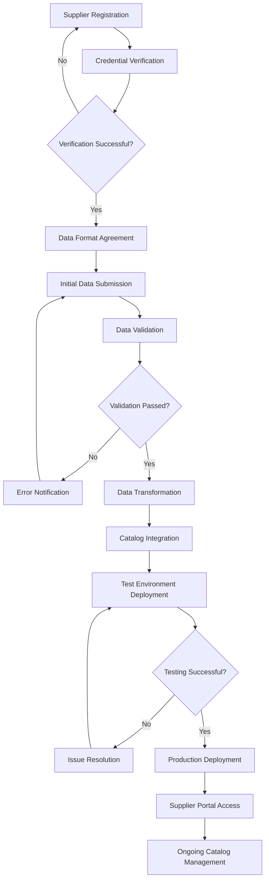
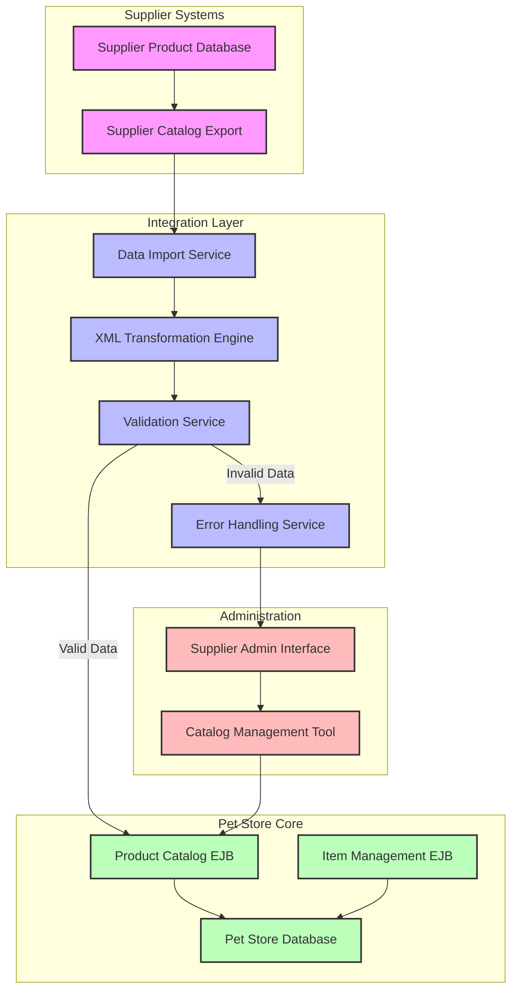
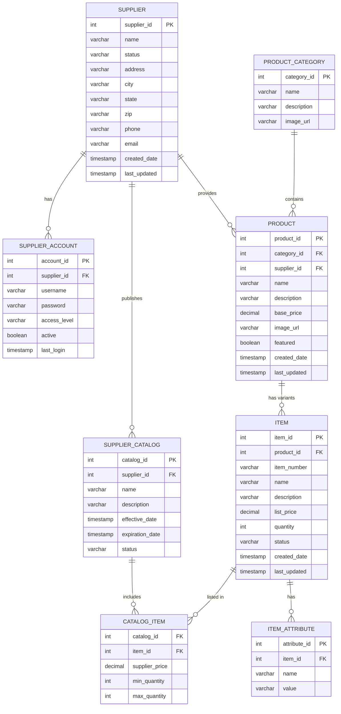
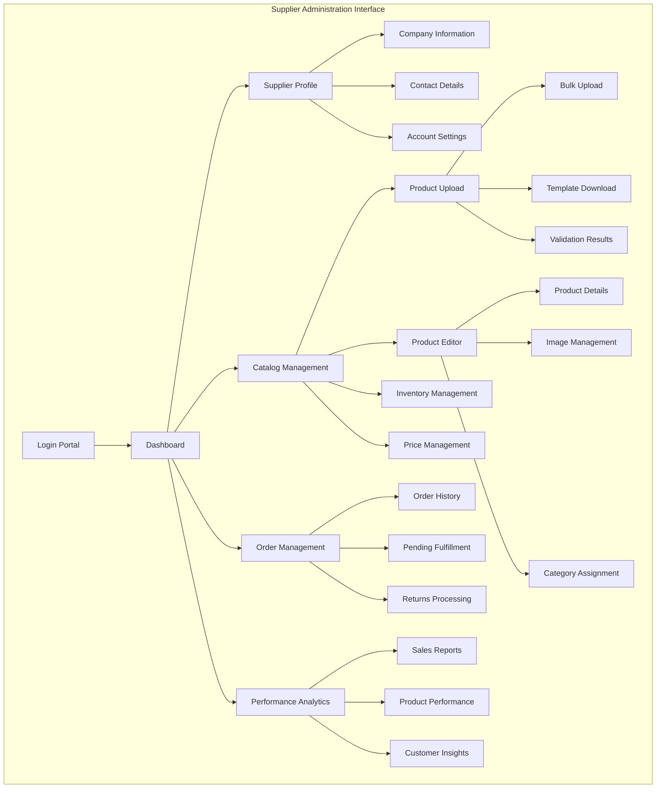

# Supplier Onboarding in Java Pet Store 1.3.2

## Introduction to Supplier Onboarding

The supplier onboarding process in Java Pet Store 1.3.2 represents a critical component of the application's e-commerce ecosystem. This process enables the platform to expand its product offerings by integrating new suppliers and their respective product catalogs. In the architecture of the Pet Store application, supplier onboarding serves as the entry point for new merchandise data, allowing the system to maintain a diverse and up-to-date inventory. The process encompasses multiple stages including supplier registration, data validation, catalog integration, and eventual product display to end users. By implementing a structured onboarding workflow, the Pet Store application ensures consistency in product data while accommodating the unique requirements of different suppliers. This functionality demonstrates the application's capability to function as a true marketplace platform rather than a single-vendor storefront, showcasing the J2EE platform's suitability for complex business processes in enterprise e-commerce applications.

## Environment Setup Requirements

The supplier onboarding process in Java Pet Store 1.3.2 requires specific environment configurations to function properly. As evidenced in the setup.sh script, two critical environment variables must be properly configured: JAVA_HOME and J2EE_HOME. JAVA_HOME points to the Java Development Kit installation directory, which provides the necessary Java runtime and development tools. The script intelligently attempts to locate Java in the system PATH if JAVA_HOME isn't explicitly set, demonstrating the application's flexibility in different development environments. J2EE_HOME must reference the J2EE SDK installation directory, as it contains essential J2EE libraries like j2ee.jar that are required for supplier integration components. Additionally, the Ant build tool environment is configured with appropriate classpaths that include Ant libraries, Java tools, and J2EE components. These environment settings are crucial for the proper functioning of the data transformation and validation processes that occur during supplier onboarding. The script's approach to environment setup reflects enterprise-grade practices for ensuring consistent build and deployment environments across development teams.

## Supplier Onboarding Process Flow

The supplier onboarding process flow diagram illustrates the end-to-end workflow for integrating new suppliers into the Java Pet Store ecosystem. The process begins with supplier registration, where potential vendors provide their business information. After credential verification, suppliers agree to data format specifications that align with the Pet Store's schema requirements. The initial data submission undergoes rigorous validation to ensure compliance with the application's data model. 

The setup.sh script plays a crucial role in this process by establishing the environment needed for the build tools that process supplier data. As shown in the technical notes, the script intelligently detects Java installations and configures the appropriate classpath for Ant, which handles the XML-based data transformation tasks during supplier integration. The script's ability to pass through command-line arguments to the Ant build process (using "$@") allows for flexible configuration of the onboarding process parameters.

Once data passes validation, it undergoes transformation to fit the Pet Store database schema before being integrated into the product catalog. The process includes testing in a staging environment before final production deployment, after which suppliers gain access to a portal for ongoing catalog management. This structured approach ensures data integrity throughout the supplier integration process.

## Configuration and Build Process

The configuration and build process for supplier onboarding in Java Pet Store 1.3.2 is orchestrated through the setup.sh script, which serves as the entry point for preparing the environment. This script establishes the foundation for processing new supplier data by configuring essential build tools and environment variables. The process begins with validation of JAVA_HOME and J2EE_HOME environment variables, which are critical for accessing the Java runtime and J2EE libraries required for supplier data processing. If JAVA_HOME isn't explicitly set, the script intelligently locates Java in the system PATH, demonstrating the application's adaptability to different development environments. The Ant build tool configuration is particularly significant for supplier onboarding, as it establishes a classpath that includes Ant libraries, Java tools, and J2EE components necessary for XML processing and data transformation. The script accommodates different project directory structures through path existence checks, ensuring flexibility across development environments. By executing Ant with the setup.xml build file and passing along command-line arguments, the script enables customized configuration of the supplier onboarding process. This approach allows for different supplier-specific parameters to be applied during the build process, facilitating the integration of diverse supplier data formats into the standardized Pet Store catalog structure.

## Supplier Data Integration Architecture

The Supplier Data Integration Architecture diagram illustrates how supplier product data flows through the Java Pet Store system components during the onboarding process. The architecture is divided into four key areas: Supplier Systems, Integration Layer, Pet Store Core, and Administration.

The process begins with the supplier's own product database, which exports catalog data in a predefined format. This data is then ingested by the Data Import Service in the Integration Layer. The setup.sh script examined earlier plays a crucial role in configuring this integration environment, ensuring that the necessary Java and J2EE components are available for processing supplier data.

Within the Integration Layer, the XML Transformation Engine converts supplier-specific formats into the standardized Pet Store schema. The Validation Service then performs data integrity checks before passing valid data to the Product Catalog EJB in the Pet Store Core. Any validation failures are routed to the Error Handling Service, which communicates issues to the administration interface.

The Pet Store Core components, including Product Catalog and Item Management EJBs, interact with the Pet Store Database to store and manage supplier product information. The Administration section provides interfaces for supplier management and catalog oversight, allowing administrators to resolve data issues and manage the onboarding process.

This architecture demonstrates how the Java Pet Store application leverages J2EE components to create a robust, scalable system for integrating diverse supplier data sources while maintaining data integrity and standardization across the product catalog.

## Catalog Management for New Suppliers

Catalog management for newly onboarded suppliers in the Java Pet Store 1.3.2 application represents a sophisticated implementation of J2EE patterns for data management and persistence. Once a supplier has successfully completed the onboarding process, their product catalog data becomes integrated into the Pet Store's unified catalog system. This integration is facilitated through a series of Enterprise JavaBeans (EJBs) that handle the persistence and business logic aspects of catalog management. The application employs a multi-tiered approach where catalog data is abstracted through Data Access Objects (DAOs) and Entity Beans, allowing for separation between the physical data storage and the business logic that operates on that data. For new suppliers, the system creates appropriate entries in the supplier-related database tables and establishes relationships with product categories and items. The catalog management system supports hierarchical organization of products, allowing suppliers to have their offerings distributed across multiple pet categories while maintaining supplier-specific metadata. The Pet Store application implements caching mechanisms to optimize catalog browsing performance, with invalidation strategies that ensure newly added supplier products become visible in the catalog at appropriate times. Administrative interfaces provide capabilities for catalog managers to review, edit, and publish supplier product information, ensuring quality control in the onboarding process. This approach demonstrates how the J2EE architecture can be leveraged to create flexible, maintainable systems for managing complex product hierarchies from multiple data sources.

## Data Transformation and Validation

The data transformation and validation processes within Java Pet Store 1.3.2's supplier onboarding system represent critical components that ensure data integrity and compatibility. When new supplier product data enters the system, it undergoes a comprehensive transformation pipeline to normalize it according to the Pet Store's standardized schema. This transformation process leverages XSLT (Extensible Stylesheet Language Transformations) to convert supplier-specific XML formats into the application's canonical data model. The validation mechanism employs a multi-layered approach, beginning with XML Schema validation to ensure structural correctness, followed by business rule validation that enforces domain-specific constraints such as price ranges, category compatibility, and inventory thresholds. The system implements both synchronous validation for immediate feedback and asynchronous validation for more complex, resource-intensive checks. Error handling during validation is particularly sophisticated, with detailed error reporting that pinpoints specific issues in the supplier data and provides actionable remediation steps. The Pet Store application maintains validation logs that track the history of submission attempts, enabling suppliers to learn from previous errors and improve their data quality over time. For performance optimization, the validation system employs progressive validation techniques that fail fast on critical errors while collecting non-critical issues for comprehensive reporting. This approach to data transformation and validation demonstrates the application's enterprise-grade capabilities in handling diverse data sources while maintaining strict data quality standards.

## Supplier Database Schema

The Supplier Database Schema diagram illustrates the relational structure that supports supplier onboarding and product management in the Java Pet Store application. This schema demonstrates how supplier information is integrated with the product catalog system through a series of interconnected tables.

The SUPPLIER table serves as the foundation, storing essential vendor information including contact details and status. Each supplier can have multiple SUPPLIER_ACCOUNT entries, enabling different levels of access for supplier representatives. The product hierarchy is organized through PRODUCT_CATEGORY, PRODUCT, and ITEM tables, with ITEM representing the specific sellable units that customers can purchase.

A key aspect of the supplier onboarding process is reflected in the relationships between suppliers and products. The PRODUCT table includes a supplier_id foreign key, establishing which vendor provides each product. The SUPPLIER_CATALOG and CATALOG_ITEM tables create a flexible mechanism for suppliers to manage their product offerings, including pricing, availability dates, and quantity constraints.

The ITEM_ATTRIBUTE table allows for extensible product characteristics, accommodating diverse supplier product specifications without schema modifications. This approach enables the Pet Store application to onboard suppliers with varying product attribute requirements while maintaining a consistent database structure.

This schema design demonstrates sophisticated entity relationship modeling that balances normalization principles with the practical requirements of an e-commerce application. The structure supports the complete supplier lifecycle from initial onboarding through ongoing catalog management while maintaining referential integrity throughout the system.

## Error Handling in Supplier Integration

Error handling in the supplier integration process of Java Pet Store 1.3.2 demonstrates a robust approach to managing the complexities of data exchange between disparate systems. The application implements a multi-tiered error management strategy that addresses issues at various stages of the supplier onboarding workflow. At the data ingestion level, the system employs schema validation to catch structural errors in supplier data feeds, generating detailed validation reports that identify specific problematic elements and their locations within the source data. For business rule violations, such as invalid pricing or missing required attributes, the application implements a separate validation layer that enforces Pet Store-specific constraints while providing supplier-friendly error messages that guide remediation efforts. The error handling framework distinguishes between recoverable errors, which allow partial processing of supplier data, and fatal errors that require complete resubmission. This distinction optimizes the onboarding process by avoiding unnecessary reprocessing of valid data segments. The system maintains comprehensive error logs with contextual information, enabling support teams to assist suppliers in resolving integration issues efficiently. Additionally, the application implements circuit-breaker patterns to prevent system degradation when encountering persistent errors from specific suppliers. Error notifications are delivered through multiple channels, including the administrative interface and automated email alerts, ensuring timely awareness of integration issues. This sophisticated error handling approach reflects enterprise-grade practices for maintaining system stability and data integrity while facilitating smooth supplier onboarding.

## Multilingual Support for Supplier Content

The Java Pet Store 1.3.2 application implements a sophisticated approach to multilingual support for supplier product content, enabling a truly global e-commerce platform. The system employs a resource bundle architecture that separates product content from presentation logic, allowing supplier product descriptions and details to be maintained in multiple languages without code duplication. During the supplier onboarding process, the application accepts localized content through structured XML formats that associate language identifiers with corresponding text elements. This content is stored in the database using a locale-aware schema design that maintains relationships between product identifiers and their language-specific descriptions. The Pet Store's internationalization framework leverages Java's ResourceBundle mechanism, extended with database-backed resource loading to dynamically retrieve the appropriate language content based on user preferences. For suppliers unable to provide translations for all supported languages, the system implements fallback mechanisms that display content in the supplier's primary language when translations are unavailable. The application also supports character encoding management to properly handle diverse scripts including Latin, Cyrillic, CJK (Chinese, Japanese, Korean), and bidirectional text for languages like Arabic and Hebrew. Administrative interfaces include tools for managing translations and validating linguistic consistency across product descriptions. This comprehensive approach to multilingual content management demonstrates the application's enterprise-ready capabilities for supporting global supplier networks while providing localized experiences for customers worldwide.

## Supplier Administration Interface

The Supplier Administration Interface diagram presents a conceptual mockup of the administrative portal used by suppliers to manage their product information and catalog entries in the Java Pet Store application. This interface serves as the primary touchpoint for suppliers after the initial onboarding process is complete.

The interface begins with a secure login portal that authenticates supplier credentials, leading to a central dashboard that provides an overview of key metrics and access to various management functions. The Supplier Profile section allows vendors to maintain their company information, contact details, and account settings, ensuring that the Pet Store has current information for communications and payments.

The Catalog Management section represents the core functionality for supplier onboarding and ongoing product management. The Product Upload feature supports bulk data imports with template downloads and validation feedback, aligning with the data transformation and validation processes discussed earlier. The Product Editor provides granular control over individual items, including image management and category assignment.

Order Management and Performance Analytics sections give suppliers visibility into their business operations within the Pet Store ecosystem, including order fulfillment, returns processing, and sales performance metrics.

This administrative interface design demonstrates how the Java Pet Store application provides a comprehensive supplier management solution that extends beyond initial onboarding to support the entire supplier relationship lifecycle. The interface leverages J2EE web application capabilities to deliver a functional, secure portal that integrates with the underlying supplier data schema and business logic components of the Pet Store application.

[Generated by the Sage AI expert workbench: 2025-03-29 21:37:00  https://sage-tech.ai/workbench]: #