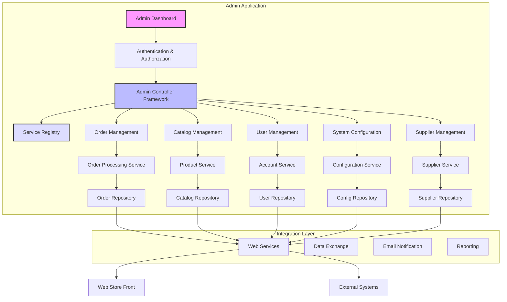
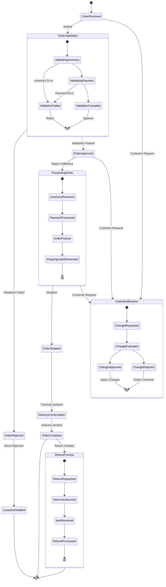
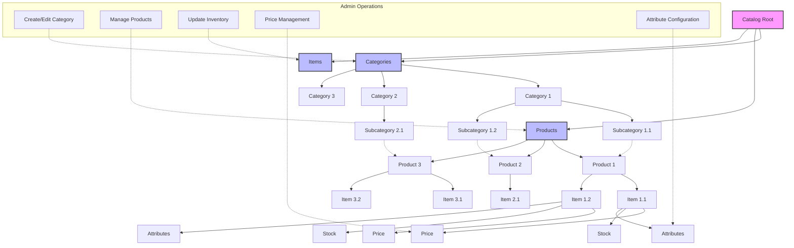

# System Administration in Java Pet Store 1.3.2

## System Administration Overview

The Java Pet Store 1.3.2 administrative components form a comprehensive backend management system designed to support the operational needs of the e-commerce application. These administrative modules provide system administrators with the tools necessary to manage the day-to-day operations of the online store, including order processing, catalog maintenance, user account management, and system configuration. Built on J2EE architecture principles, the admin application leverages Enterprise JavaBeans (EJB), Java Servlets, and JavaServer Pages (JSP) to create a robust management interface that separates business logic from presentation concerns. The administrative system is designed with modularity in mind, allowing for component-based management of different functional areas while maintaining security through role-based access controls. This administrative framework enables store operators to efficiently handle backend operations, monitor system performance, and maintain data integrity across the application ecosystem, ensuring the smooth functioning of the customer-facing storefront.

## Admin Application Architecture

The administrative architecture of Java Pet Store 1.3.2 follows a layered design that promotes separation of concerns and modularity. At the top level, the Admin Dashboard serves as the entry point for system administrators, providing a unified interface to access various management functions. The authentication and authorization layer ensures that only authorized personnel can access administrative features, implementing role-based security controls.

The Admin Controller Framework forms the backbone of the application, routing requests to appropriate service components and coordinating workflows. This framework connects to a Service Registry that maintains references to all available administrative services, facilitating loose coupling between components. The core administrative functions are organized into specialized modules: Order Management for processing customer orders, Catalog Management for maintaining product information, User Management for customer account administration, System Configuration for application settings, and Supplier Management for vendor relationships.

Each management module interfaces with corresponding service components that encapsulate business logic and data access operations. These services communicate with repositories that handle persistent storage operations. The entire administrative system connects to the customer-facing web store and external systems through an integration layer that includes web services, data exchange mechanisms, email notifications, and reporting tools. This architecture enables administrators to efficiently manage all aspects of the e-commerce platform while maintaining system integrity and security.

## Admin Application Build Process

The build process for the Java Pet Store 1.3.2 admin application is orchestrated through a shell script (`build.sh`) that demonstrates sophisticated environment configuration and dependency management techniques. The script begins with essential environment validation, checking for the presence of critical variables like `JAVA_HOME` and `J2EE_HOME`, which are fundamental to the build process. If `JAVA_HOME` is not explicitly set, the script intelligently attempts to locate the Java executable in the system path and derives the Java home directory from it, showcasing environment-agnostic design principles. This approach enhances portability across different development environments. The build automation leverages Apache Ant as its core engine, with the script carefully constructing a comprehensive classpath that includes Ant libraries, Java tools, and J2EE dependencies. The execution command passes multiple system properties to Ant, including paths and configuration parameters that control the build process. This parameterization allows for flexible builds that can adapt to different environments or requirements. The script's design reflects best practices in build automation for enterprise Java applications of that era, providing a reliable and repeatable process for compiling the administrative components while abstracting away the complexity of the underlying build system from developers.

## Order Management System

The Order Management System within Java Pet Store's administrative interface provides a comprehensive solution for processing customer transactions throughout their lifecycle. The system implements a sophisticated order validation framework that verifies order integrity, checking for product availability, pricing accuracy, and customer information completeness before accepting orders into the processing queue. Once validated, orders enter a multi-stage workflow where administrators can track their status through a centralized dashboard that displays key metrics such as pending orders, processing times, and fulfillment rates. The interface supports granular status tracking with timestamps for each stage transition, enabling administrators to identify bottlenecks in the fulfillment process. The system incorporates notification mechanisms that automatically generate emails to customers at critical points in the order lifecycle, such as order confirmation, shipping updates, and delivery confirmation. For complex scenarios, the management interface provides exception handling capabilities, allowing administrators to address issues like payment failures, inventory discrepancies, or shipping complications. The order management functionality integrates with inventory systems to ensure product availability and automatically update stock levels upon order completion. This integration extends to the fulfillment workflow, where the system generates picking lists, packing slips, and shipping labels to streamline the physical processing of orders. The entire system is designed with audit capabilities, maintaining comprehensive logs of all administrative actions for accountability and troubleshooting purposes.

## Order Lifecycle Workflow

The Order Lifecycle Workflow diagram illustrates the comprehensive journey of an order through the Java Pet Store administrative system. When an order is initially received, it enters a rigorous validation process that verifies inventory availability and payment information. This validation can result in either approval or rejection, with appropriate customer notifications triggered automatically.

Approved orders progress to the processing phase, where the system manages a sequence of operations including inventory reservation, payment processing, order packing, and shipping label generation. The admin interface provides visibility into each stage, allowing administrators to monitor progress and identify potential bottlenecks. Once shipped, the system tracks the order through delivery confirmation until it reaches the completed state.

The workflow accommodates order modifications at various stages through a structured change management process. When customers request changes, administrators can evaluate these requests and either approve or reject them based on the order's current status and business rules. This flexibility allows the system to handle real-world scenarios while maintaining process integrity.

Post-completion, the system supports return processing through a dedicated workflow that manages return authorization, item receipt verification, and refund processing. This comprehensive approach ensures that administrators have complete visibility and control over the entire order lifecycle, from initial submission through potential returns, with appropriate status tracking and notification mechanisms at each transition point.

## Catalog Administration

The Catalog Administration module in Java Pet Store 1.3.2 provides a sophisticated framework for managing the product hierarchy and inventory within the e-commerce platform. Administrators can define and organize products through a hierarchical category structure, with tools for creating, editing, and deprecating product categories to maintain an organized shopping experience. The interface supports comprehensive product definition capabilities, allowing administrators to specify detailed product attributes including descriptions, specifications, pricing information, and associated media assets such as images and documentation. Each product can be further subdivided into specific items with unique SKUs, enabling granular inventory tracking and variant management for products that come in different sizes, colors, or configurations. The catalog system incorporates inventory control mechanisms that track stock levels, set threshold alerts for low inventory, and can optionally display inventory status to customers. For operational efficiency, the module includes batch operations for updating multiple products simultaneously and bulk import/export functionality to facilitate data exchange with supplier systems or other enterprise applications. The catalog administration interface also provides tools for managing product visibility, allowing administrators to schedule product releases, implement seasonal promotions, or temporarily hide products without removing them from the database. This comprehensive approach to catalog management ensures that store administrators can maintain an accurate, up-to-date product catalog that supports both customer-facing operations and backend inventory management processes.

## Catalog Structure Hierarchy

The Catalog Structure Hierarchy diagram illustrates the organization and relationships between different elements in the Java Pet Store administrative catalog system. At the top level, the Catalog Root serves as the primary container for all product-related information, branching into three main components: Categories, Products, and Items.

Categories form the navigational structure of the catalog, organized in a hierarchical tree that can include multiple levels of subcategories. This hierarchical arrangement allows administrators to create logical groupings of products that facilitate customer browsing and discovery. Each category can contain multiple subcategories or directly link to products.

Products represent the conceptual merchandise offerings and serve as containers for specific items. A product defines common characteristics such as name, description, and brand, while accommodating variations through its associated items. The dotted lines between categories and products indicate the association relationship, where products can be assigned to one or more categories.

Items are the actual purchasable units within the catalog, each with specific attributes like price, stock information, and variant-specific characteristics (size, color, etc.). Each item belongs to exactly one product but inherits the category associations of its parent product.

The diagram also highlights the administrative operations available to catalog managers, including category creation and editing, product management, inventory updates, price management, and attribute configuration. These operations interact with different levels of the catalog hierarchy, providing a comprehensive management interface for maintaining the product catalog. This structured approach enables efficient catalog administration while supporting a flexible shopping experience for customers.

## User and Account Administration

The User and Account Administration component of Java Pet Store 1.3.2 provides a comprehensive framework for managing customer identities and access throughout the application. The system implements a multi-tiered approach to user management, starting with registration processing where administrators can review new account requests, verify submitted information, and approve or reject registrations based on business rules. For existing accounts, the interface offers detailed profile management capabilities, allowing administrators to view and modify customer information including contact details, shipping preferences, and communication settings. The account administration module incorporates robust authentication controls with password management features, account locking mechanisms for security violations, and audit trails that track account modifications. Access permissions are managed through a role-based system that can assign users to predefined roles such as regular customers, preferred customers, or business accounts, each with different privileges and access levels. The interface also provides tools for account lifecycle management, including processes for handling account suspension, reactivation, and permanent closure. For operational efficiency, the system includes batch processing capabilities for common administrative tasks such as sending notifications to user segments or updating account statuses based on activity patterns. Customer service representatives can use the interface to assist users with account-related issues, with specialized views that provide comprehensive customer history while maintaining appropriate security boundaries. This holistic approach to user and account administration ensures that the system can effectively manage customer identities while maintaining security and providing personalized experiences.

## System Configuration and Monitoring

The System Configuration and Monitoring module in Java Pet Store 1.3.2 provides administrators with comprehensive tools to maintain optimal system performance and customize application behavior. The configuration management component offers a centralized interface for adjusting application parameters across multiple tiers, including web presentation settings, business logic behavior, and data access configurations. Administrators can modify these settings through a hierarchical parameter structure that supports both global defaults and context-specific overrides, with changes taking effect either immediately or during scheduled maintenance windows to minimize disruption. The monitoring subsystem delivers real-time visibility into system health through performance dashboards that track key metrics such as request throughput, response times, database connection utilization, and memory consumption. These metrics are complemented by threshold-based alerting mechanisms that can notify administrators when performance indicators deviate from acceptable ranges. For operational stability, the module includes resource management tools that control connection pools, thread allocation, and cache sizes to optimize system resource utilization under varying load conditions. The monitoring interface also provides historical performance data visualization, enabling trend analysis and capacity planning based on usage patterns. System logs are aggregated and presented through a searchable interface that allows administrators to quickly identify and troubleshoot issues across distributed components. For maintenance operations, the module includes utilities for database management, cache invalidation, and controlled application restarts. This comprehensive approach to system configuration and monitoring ensures that administrators can maintain optimal performance while adapting the application to specific business requirements.

## Admin Dashboard Layout

```mermaid
graph TD
    subgraph "Admin Dashboard"
        A[Header: Navigation & User Info]
        B[System Status Overview]
        C[Quick Actions Panel]
        
        D[Order Management]
        E[Catalog Management]
        F[User Management]
        G[System Configuration]
        
        H[Performance Metrics]
        I[Recent Activity Log]
        J[Footer: System Info & Support]
    end
    
    B --> B1[Active Sessions: 42]
    B --> B2[Pending Orders: 17]
    B --> B3[System Health: Good]
    B --> B4[DB Connections: 8/20]
    
    C --> C1[Process Orders]
    C --> C2[Update Catalog]
    C --> C3[User Search]
    C --> C4[System Settings]
    
    D --> D1[Orders Awaiting Processing: 12]
    D --> D2[Orders Shipped Today: 28]
    D --> D3[Recent Order Issues: 3]
    
    E --> E1[Products: 1,245]
    E --> E2[Categories: 37]
    E --> E3[Low Stock Items: 15]
    
    F --> F1[Registered Users: 3,842]
    F --> F2[New Accounts Today: 7]
    F --> F3[Support Requests: 4]
    
    H --> H1[Response Time: 230ms]
    H --> H2[Memory Usage: 68%]
    H --> H3[Cache Hit Rate: 92%]
    
    I --> I1[Order #12345 Processed]
    I --> I2[Catalog Update Completed]
    I --> I3[User johndoe Locked Out]
    I --> I4[Low Stock Alert: Item #789]
    
    style A fill:#f9f,stroke:#333,stroke-width:2px
    style B fill:#bbf,stroke:#333,stroke-width:2px
    style C fill:#ddf,stroke:#333,stroke-width:2px
    style H fill:#fdd,stroke:#333,stroke-width:2px
    style I fill:#dfd,stroke:#333,stroke-width:2px
```

The Admin Dashboard Layout diagram illustrates the comprehensive interface designed for Java Pet Store administrators to monitor and manage the e-commerce system. The dashboard is organized into logical sections that provide both at-a-glance system status and detailed operational controls.

At the top, the header contains navigation elements and user information, allowing administrators to quickly identify their login status and access different sections of the admin interface. The System Status Overview provides critical real-time metrics including active user sessions, pending orders requiring attention, overall system health indicators, and database connection utilization.

The Quick Actions Panel offers one-click access to frequently used functions, enabling administrators to rapidly respond to common operational needs without navigating through multiple screens. These actions include processing orders, updating catalog information, searching for user accounts, and accessing system settings.

The central portion of the dashboard is divided into operational areas that reflect the core administrative functions: Order Management displays metrics on orders awaiting processing, daily fulfillment statistics, and order issues requiring attention; Catalog Management shows product and category counts along with inventory alerts; User Management provides visibility into the customer base with metrics on registered users, new account creation, and support requests.

The lower section of the dashboard contains Performance Metrics with technical indicators such as system response time, memory utilization, and cache efficiency, allowing administrators to monitor system health. Adjacent to this is the Recent Activity Log, which displays a chronological record of significant system events and administrative actions for accountability and troubleshooting.

This dashboard design prioritizes operational awareness and administrative efficiency, presenting critical information in a structured format while providing direct access to management functions that support the day-to-day operation of the e-commerce platform.

## Integration and Data Exchange

The Integration and Data Exchange framework within Java Pet Store 1.3.2's administrative system provides robust mechanisms for interoperating with external systems and managing data flows across the e-commerce ecosystem. At its core, the framework implements a service-oriented architecture that exposes key business functions through standardized interfaces, allowing for flexible integration with supplier systems, payment processors, and shipping providers. The supplier management component enables administrators to configure and maintain connections with product vendors, supporting automated inventory updates, price synchronization, and purchase order submissions through configurable data exchange protocols. For data import and export operations, the system provides template-based mechanisms that support both scheduled batch processes and on-demand transfers, with transformation capabilities that can map between different data formats and structures. The web service integration layer exposes RESTful APIs and SOAP endpoints that external systems can consume to retrieve catalog information, submit orders, or query order status, with comprehensive authentication and authorization controls protecting these interfaces. For real-time integration scenarios, the system implements event-driven messaging patterns that can notify external systems of significant state changes such as order submissions, inventory updates, or price changes. The administrative interface provides monitoring tools for integration points, allowing administrators to track message volumes, error rates, and processing times across integration channels. Data validation is enforced at integration boundaries, ensuring that incoming data meets quality and format requirements before entering core business processes. This comprehensive approach to integration and data exchange ensures that the Java Pet Store can effectively participate in broader business ecosystems while maintaining data integrity and operational efficiency.

## Security and Access Control

The Security and Access Control framework in Java Pet Store 1.3.2's administrative system implements a defense-in-depth approach to protecting sensitive functions and data. At the authentication layer, the system employs a robust credential verification mechanism that supports username/password authentication with password complexity requirements, account lockout policies for failed attempts, and session timeout controls to mitigate unauthorized access risks. Once authenticated, administrative users are governed by a comprehensive role-based access control (RBAC) system that defines granular permissions for different administrative functions. This RBAC implementation allows system operators to assign roles such as Order Manager, Catalog Administrator, or System Administrator, each with carefully scoped permissions that align with job responsibilities. The security framework enforces the principle of least privilege, ensuring that administrators can access only the functions and data necessary for their specific roles. For sensitive operations such as order cancellations, refund processing, or price changes, the system implements additional authorization checks that may require approval workflows or secondary verification. All administrative actions are captured in a detailed audit log that records the user, timestamp, action performed, and affected resources, providing accountability and supporting forensic analysis if needed. The framework includes resource protection mechanisms that prevent unauthorized direct access to application components, implementing URL pattern restrictions, programmatic access controls, and data filtering based on user context. For data in transit, the system leverages transport layer security protocols, while sensitive data at rest such as customer payment information is protected through appropriate encryption mechanisms. The administrative interface provides security management tools that allow authorized users to review active sessions, manage user accounts, and configure security parameters without requiring direct database access. This comprehensive security architecture ensures that administrative functions are protected against unauthorized access while providing the flexibility needed for legitimate business operations.

[Generated by the Sage AI expert workbench: 2025-03-21 23:18:02  https://sage-tech.ai/workbench]: #