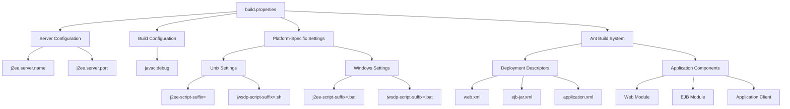
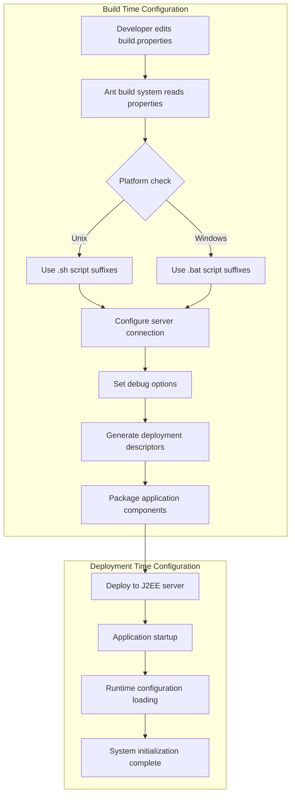
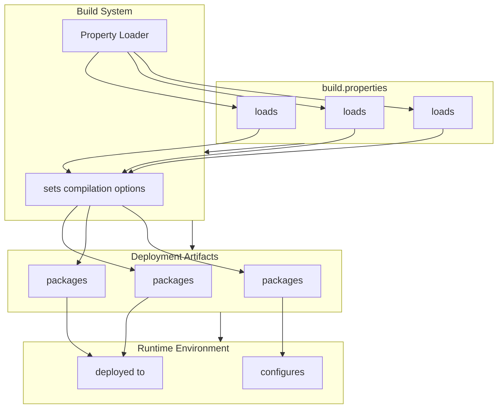

# System Configuration in Java Pet Store 1.3.2

## System Configuration Overview

The Java Pet Store 1.3.2 implements a robust configuration architecture that separates environment-specific settings from application code. This separation follows the principle of externalization of configuration, a best practice in enterprise application development. The configuration system is designed to support multiple deployment environments while maintaining a consistent application behavior. At its core, the configuration architecture uses property files as the primary mechanism for defining system parameters, with build.properties serving as the central configuration file. This approach enables system administrators and developers to modify deployment settings without altering application code, facilitating easier transitions between development, testing, and production environments. The configuration system also supports conditional property selection based on the target platform, demonstrating an early implementation of environment-aware configuration that has become standard in modern application frameworks.

## Build Properties Configuration

The build.properties file serves as the cornerstone of Java Pet Store's configuration system, defining essential parameters that control how the application is built, deployed, and executed. This file contains server connection parameters (hostname and port), debugging options for Java compilation, and platform-specific script suffix configurations. The structure of build.properties follows a simple key-value pattern, making it easily parsable by the build system while remaining human-readable for manual configuration. The properties defined in this file are referenced throughout the build process, particularly by Ant build scripts that handle compilation, packaging, and deployment tasks. By centralizing these configuration parameters, the application achieves a clean separation between environment-specific settings and the core build logic, allowing for consistent builds across different environments while accommodating local variations in deployment targets and development preferences.

## Configuration Hierarchy Diagram

The configuration hierarchy diagram illustrates how the build.properties file serves as the root of the configuration system in Java Pet Store 1.3.2. The properties defined in this file cascade down to influence various aspects of the application's build and deployment process. Server configuration parameters define where the application will be deployed, while build configuration controls compilation behavior. Platform-specific settings enable the application to adapt to different operating environments by selecting appropriate script suffixes. These configuration settings are consumed by the Ant build system, which generates deployment descriptors and packages application components accordingly. This hierarchical approach to configuration management demonstrates a well-structured system that separates concerns while maintaining clear relationships between different configuration aspects.

## Cross-Platform Configuration Support

Java Pet Store 1.3.2 implements a pragmatic approach to cross-platform configuration through conditional property selection in the build.properties file. The system recognizes that deployment scripts require different file extensions depending on the operating system (.sh for Unix-based systems and .bat for Windows). Rather than implementing complex detection logic, the application provides clearly commented configuration blocks for both platforms, allowing developers to uncomment the appropriate section based on their environment. This approach exemplifies the "configuration by convention" principle, where sensible defaults (Unix settings) are provided but can be easily overridden. The j2ee-script-suffix and jwsdp-script-suffix properties control how the build system references external scripts, ensuring that the correct script type is invoked regardless of the underlying platform. This configuration strategy demonstrates an understanding of the heterogeneous environments in which enterprise applications typically operate, providing a simple yet effective mechanism for platform adaptation without requiring code changes.

## Server Connection Parameters

The server connection parameters defined in build.properties form the foundation of Java Pet Store's deployment configuration. The j2ee.server.name property (set to "localhost" by default) specifies the hostname of the J2EE application server where the application will be deployed, while j2ee.server.port (set to "8000") defines the port on which the server listens for connections. These parameters are crucial for several aspects of the application lifecycle: they direct the deployment process to the correct server instance, they configure client components to connect to the appropriate endpoint, and they establish the base URL for web access. The default values facilitate local development and testing, allowing developers to work with a server instance on their own machine. In production environments, these values would be modified to point to the appropriate production servers. This configuration approach exemplifies the principle of environment-specific externalization, where connection details can be changed without modifying application code, supporting the deployment pipeline from development through to production.

## Configuration Flow Process

The configuration flow process diagram illustrates how configuration settings move through the Java Pet Store system from initial definition to runtime application. The process begins when a developer edits the build.properties file to specify environment-specific settings. During the build phase, the Ant build system reads these properties and makes platform-specific adjustments, selecting the appropriate script suffixes based on the target operating system. Server connection parameters and debug options are then applied to generate properly configured deployment descriptors. These configurations are embedded in the packaged application components, which are subsequently deployed to the J2EE server. At application startup, these configurations are loaded into the runtime environment, completing the system initialization. This flow demonstrates how configuration settings transition from static properties to dynamic application behavior, ensuring consistent system operation across different environments.

## Debug and Development Settings

The debug configuration options in Java Pet Store 1.3.2 exemplify the application's support for different development workflows. The javac.debug property controls whether debugging information is included in compiled Java classes. When set to "off" (the default in the examined build.properties), the resulting class files are optimized for size and performance, suitable for production deployment. Setting this property to "on" instructs the Java compiler to include source file information, line numbers, and local variable tables in the compiled classes, facilitating debugging with tools like JDB or IDE debuggers. This configuration option represents a common trade-off in Java applications between runtime performance and debugging capability. By externalizing this setting, the application allows developers to easily switch between development mode (with full debugging support) and production mode (with optimized bytecode) without modifying build scripts. This approach aligns with the principle of environment-specific configuration, where development environments prioritize debugging capabilities while production environments prioritize performance and resource efficiency.

## Configuration Management Best Practices

The Java Pet Store 1.3.2 configuration management approach demonstrates several best practices that remain relevant in modern application development. First, the application employs the principle of separation of concerns by isolating environment-specific configuration from application logic, making the system more maintainable and adaptable to different deployment scenarios. Second, the use of externalized configuration through property files provides a simple yet effective mechanism for modifying system behavior without code changes, reducing the risk of introducing errors during environment transitions. Third, the application implements sensible defaults (such as localhost for server connections) while allowing for easy overrides, balancing convenience for development with flexibility for production deployment. Fourth, the configuration system acknowledges platform differences and provides clear mechanisms for adaptation, ensuring cross-platform compatibility. Finally, the configuration approach supports different development workflows through toggleable debug settings. These practices collectively create a configuration system that supports the full application lifecycle from development through production, demonstrating an understanding of enterprise application deployment challenges that predates many modern configuration management frameworks but implements similar principles.

## System Configuration Components

The System Configuration Components diagram illustrates the relationships between configuration files, build system components, and runtime elements in the Java Pet Store 1.3.2 application. The build.properties file serves as the primary configuration source, containing server settings, platform-specific configurations, and debug options. These properties are consumed by the build system, particularly the Ant scripts that orchestrate the build process. The Property Loader component within the build system reads and interprets these configuration values, making them available to the build scripts. The build system then generates deployment artifacts—Web Module, EJB Module, and Application Client—with the appropriate configuration embedded. These artifacts are deployed to the runtime environment, which consists of the J2EE Server and Application Context. This component architecture demonstrates how configuration flows from static property files through the build process and ultimately shapes the behavior of the deployed application, creating a clear path from configuration definition to runtime behavior.

## Integration with Deployment Process

The system configuration in Java Pet Store 1.3.2 is tightly integrated with the build and deployment process, enabling a streamlined workflow from development to production. The build.properties file serves as the single point of configuration for deployment parameters, which are then consumed by Ant build scripts that handle the compilation, packaging, and deployment of application components. This integration follows a declarative approach where developers specify what the deployment environment looks like rather than how to deploy to it, abstracting away the complexities of the J2EE deployment process. The server connection parameters (hostname and port) direct the deployment tools to the correct target environment, while platform-specific script suffixes ensure that the appropriate deployment commands are executed regardless of the underlying operating system. This configuration-driven deployment approach facilitates automation, allowing for consistent deployment across different environments with minimal manual intervention. By centralizing deployment configuration in build.properties, the application also creates a clear audit trail of deployment parameters, enhancing traceability and reproducibility of deployments—concepts that have become central to modern DevOps practices but were already present in this earlier J2EE application architecture.

## Security Considerations in Configuration

The configuration approach in Java Pet Store 1.3.2 implements several security best practices that were forward-thinking for its time. First, the system separates configuration from code, reducing the risk of hardcoded credentials or sensitive connection details being embedded in the application's source code. This separation allows sensitive configuration data to be managed with appropriate access controls independent of the codebase. Second, the default configuration uses localhost as the server name, minimizing exposure during development and requiring an explicit configuration change to connect to production systems. Third, the configuration system supports different environments without code changes, enabling proper separation between development, testing, and production settings—a fundamental security principle for preventing test credentials from being deployed to production. However, the examined configuration does not show evidence of encryption for sensitive properties or integration with secure credential stores, which would be expected in modern applications. Despite this limitation, the overall approach of externalizing configuration and separating environment-specific settings from application code represents a solid foundation for secure configuration management that aligns with principles still relevant in contemporary application security.

[Generated by the Sage AI expert workbench: 2025-03-21 23:18:02  https://sage-tech.ai/workbench]: #